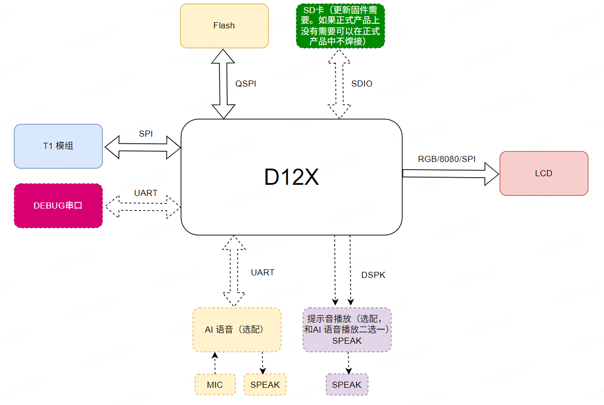
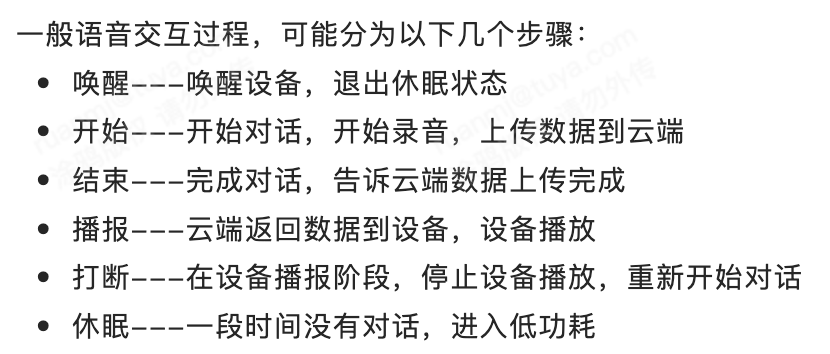
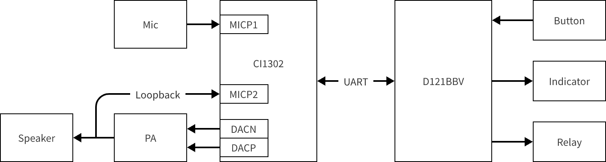
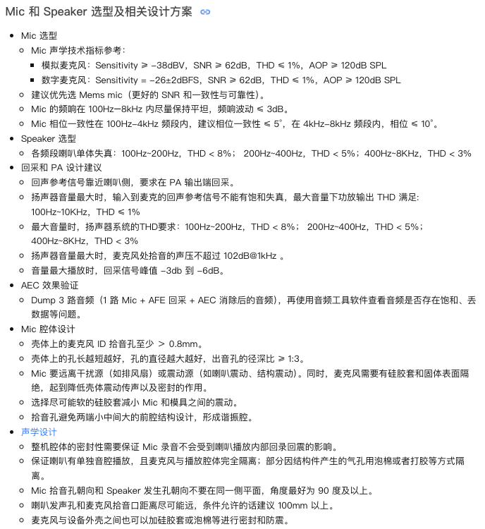

# 1. 背景

用户对开关的诉求从「能远程控」升级为「就地看得懂、说得清」——屏显降低学习成本，语音解决双手占用场景

屏幕：屏上运行UI图，语音交互时、实时显示文字（输入、输出）

音频：复杂自然语言对话、大模型级语义理解

pid：lq8pvhbwwzlneoa5

# 2. 硬件架构

## 2.1. 屏驱

### 2.1.1. 屏驱芯片

屏驱芯片选择型号为D121BBV，除驱动屏幕外，还需和T1模组通过SPI通信、和CI1302屏驱芯片通过UART通信。

### 2.1.2. 显示屏

| 显示屏 | 参数说明 |
| :--- | :--- |
| 型号 | HD40010C40带触摸 |
| 屏幕尺寸 | 4寸/3.95寸TFT液晶屏 |
| 分辨率 | 480*480 |
| 接口类型 | RGB |
| 驱动 | ST7701 |
| 可视视角 | ≥80°（右/左/上/下） |
| 触摸屏 | 电容，IC：GT911 |
| 显示亮度 | ≥400cd/m2 |

### 2.1.3. UI/交互

交互稿：https://design.tuya-inc.com:7799/file/131850344368735?file=131850344368735&page_id=160%3A2775&devMode=true

部分示意图如下：

<table>
<tbody>
  <tr>
    <th style="text-align: center">
功能单元
</th>
    <th style="text-align: center">
示意图
</th>
    <th>
备注说明
</th>
  </tr>
  <tr>
    <td style="text-align: center">
首页

（左右滑动）

<a href="https://design.tuya-inc.com:7799/prototype/131850344368735?zs=1&amp;pageId=160%3A2775&amp;layerId=160%3A3454">https://design.tuya-inc.com:7799/prototype/131850344368735?zs=1&amp;pageId=160%3A2775&amp;layerId=160%3A3454</a>
</td>
    <td style="text-align: center">

</td>
    <td>
1、天气、温度

2、日期、时间

3、Wi-Fi信号强度

4、主题背景

5、开关通道-2路（可控制）
</td>
  </tr>
  <tr>
    <td style="text-align: center">
场景

（左右滑动）

<a href="https://design.tuya-inc.com:7799/prototype/131850344368735?zs=1&amp;pageId=160%3A2775&amp;layerId=160%3A3601">https://design.tuya-inc.com:7799/prototype/131850344368735?zs=1&amp;pageId=160%3A2775&amp;layerId=160%3A3601</a>
</td>
    <td style="text-align: center">

</td>
    <td>
1、天气、温度

2、日期、时间

3、Wi-Fi信号强度

4、场景通道-2路（可控制）
</td>
  </tr>
  <tr>
    <td style="text-align: center">
设置

（顶部下拉）

<a href="https://design.tuya-inc.com:7799/prototype/131850344368735?zs=1&amp;pageId=160%3A2775&amp;layerId=162%3A05153">https://design.tuya-inc.com:7799/prototype/131850344368735?zs=1&amp;pageId=160%3A2775&amp;layerId=162%3A05153</a>
</td>
    <td style="text-align: center">

</td>
    <td>
1、天气、温度

2、日期、时间

3、Wi-Fi信号强度

4、亮度设置

5、接近感应

6、自动休眠

7、关于：配网
</td>
  </tr>
  <tr>
    <td>

实时显示文字

（弹窗显示）

</td>
    <td>

</td>
    <td>
实时显示AI语音的输入、输出文字
</td>
  </tr>
</tbody>
</table>

## 2.2. AI语音

### 2.2.1. AI对话模式

需要支持以下4种AI对话模式：

| AI对话模式 | 模式说明 | 硬件配置要求 |
| :--- | :--- | :--- |
| 长按对话模式 | 唤醒--按键长按 开始--长按按键开始对话 结束--按键松开结束对话 播报--设备播放 打断--按键短按 休眠--30s无对话休眠（时间可配置） | 唤醒按键 |
| 按键对话模式 | 唤醒--按键短按 开始--唤醒后/播报完成随时开始对话 结束--开始对话后500ms无人声结束对话 播报--设备播放，播报完成之后回到开始 打断--按键短按 休眠--30s无对话休眠（时间可配置） | 唤醒按键 |
| 唤醒对话模式 | 唤醒--按键/唤醒词 开始--唤醒后/播报完成随时开始对话 结束--开始对话后500ms无人声结束对话 播报--设备播放 打断--唤醒词 休眠--30s无对话退出唤醒（时间可配置） | 音频回采电路 |
| 自由对话模式 | 唤醒--按键/唤醒词 开始--随时开始对话 结束--开始对话后500ms无人声结束对话 播报--设备播放 打断--唤醒词/任意人声对话打断 休眠--30s无对话休眠（时间可配置） | 音频回采电路 |

【注1】参考技术文档：[Wukong AI 语音模式概念](https://wiki.tuya-inc.com:7799/page/1897891485349580898)

【注2】唤醒对话模式，唤醒词：hey tuya、你好涂鸦、小智同学

【注3】本产品为强电设备，不进入休眠



### 2.2.2. 音频参数

音频参数设置如下：

| 音频参数设置 | 参数说明 | 备注 |
| :--- | :--- | :--- |
| 音量设置 | Speaker的播放音量 APP端可无级调节 设备端可“分段跳跃式”步进调节 | 0-100%，默认50% |
| 拾音最大时间设置 | Mic最大的拾音时长，超过该时间后停止拾音 | 默认30s |
| 唤醒超时时间设置 | 设备唤醒后，在超时时间内如果没有说话，后面麦克不再拾音，需要重新唤醒 | 默认30s |



### 2.2.3. 按键/指示灯

按键/指示灯外设如下：

<table>
<tbody>
  <tr>
    <th>
按键/指示灯
</th>
    <th>
可选项
</th>
    <th>
功能说明
</th>
    <th>
备注
</th>
  </tr>
  <tr>
    <td>
唤醒按键
</td>
    <td>
必选
</td>
    <td><ul><li>
长按对话模式
</li></ul>
     长按：唤醒；短按：打断
<ul><li>
按键对话模式
</li></ul>
     短按：唤醒；短按：打断
</td>
    <td>
适用于长按对话模式和单次按键对话模式

【注】唤醒超时时间为30s
</td>
  </tr>
  <tr>
    <td>
状态指示灯
</td>
    <td>
可选
</td>
    <td><ul><li>
拾音ing：常亮
</li><li>
播放ing：500ms亮/灭
</li></ul></td>
    <td>

</td>
  </tr>
  <tr>
    <td>
音量+/-按键

（两个按键）
</td>
    <td>
可选
</td>
    <td>
音量+按键，短按：步进调节、音量+10%

音量-按键，短按：步进调节、音量-10%
</td>
    <td>
均采用“分段跳跃式”步进调节

【案例】53% -&gt; 60% -&gt; 70% -&gt; 80%；

           53% -&gt; 50% -&gt; 40% -&gt; 30%
</td>
  </tr>
  <tr>
    <td>
Mute按键
</td>
    <td>
可选
</td>
    <td>
短按：禁麦/开麦状态切换
</td>
    <td>

</td>
  </tr>
  <tr>
    <td>
Mute指示灯
</td>
    <td>
可选
</td>
    <td>
静音ing：常亮

解除静音：常灭
</td>
    <td>

</td>
  </tr>
</tbody>
</table>



### 2.2.4. 语音芯片

语音芯片选择型号为CI1302，和D121BBV屏驱芯片通过UART通信。



### 2.2.5. 外设：音频

音频外设如下：

| 音频 | 外设说明 | 备注 |
| :--- | :--- | :--- |
| Mic | 1路 |  |
| Speaker | 1路 |  |
| 音频回采 | 1路 | 内置板载电路 |



#### 2.2.5.1. Mic 和 Speaker 选型及相关设计方案

参考T1AI-BOX 语音方案：https://developer.tuya.com/cn/docs/iot/T1AI-BOX-DATA-SHEET?id=Kehlfln9zvtww

#### 2.2.5.2. 声学设计参考

参考文档：

1、语音模组声学结构设计：https://developer.tuya.com/cn/docs/iot/speech-module-reference-for-acoustic-structure-design-of-product-design?id=K9hhl5myc7393

2、声学结构设计规范：https://developer.tuya.com/cn/docs/iot/Acoustic-structure-design?id=Kb97hhu11c9k2

## 2.3. 控制

支持2路继电器输出。

# 3. 软件功能

<table>
<tbody>
  <tr>
    <th>
功能模块
</th>
    <th>
功能点
</th>
    <th>
设置/交互入口

（APP 面板）
</th>
    <th>
设置/交互入口（设备屏幕）
</th>
    <th>
备注
</th>
  </tr>
  <tr>
    <td colSpan="1" rowSpan="5">
开关


</td>
    <td>
开/关
</td>
    <td>
✅
</td>
    <td>
✅
</td>
    <td>
详见：<a href="https://wiki.tuya-inc.com:7799/page/73680419">https://wiki.tuya-inc.com:7799/page/73680419</a>

开关名称默认为 Switch1，Switch2，可在 APP 上修改，修改后设备屏幕立即同步
</td>
  </tr>
  <tr>
    <td>
定时
</td>
    <td>
✅
</td>
    <td>

</td>
    <td>
详见：<a href="https://wiki.tuya-inc.com:7799/page/73680421">https://wiki.tuya-inc.com:7799/page/73680421</a>
</td>
  </tr>
  <tr>
    <td>
倒计时
</td>
    <td>
✅
</td>
    <td>

</td>
    <td>
详见：<a href="https://wiki.tuya-inc.com:7799/page/73680775">https://wiki.tuya-inc.com:7799/page/73680775</a>
</td>
  </tr>
  <tr>
    <td>
点动（延时关）
</td>
    <td>
✅
</td>
    <td>

</td>
    <td>
详见：<a href="https://wiki.tuya-inc.com:7799/page/73680825">https://wiki.tuya-inc.com:7799/page/73680825</a>
</td>
  </tr>
  <tr>
    <td>
上电状态
</td>
    <td>
✅
</td>
    <td>

</td>
    <td>
详见：<a href="https://wiki.tuya-inc.com:7799/page/73680858">https://wiki.tuya-inc.com:7799/page/73680858</a>
</td>
  </tr>
  <tr>
    <td>
场景
</td>
    <td>
场景控制
</td>
    <td>
✅
</td>
    <td>
✅
</td>
    <td>
在 APP面板 设置的一键执行场景，可以绑定同步到设备屏幕上显示控制

绑定时场景列表需过滤，只显示一键执行场景

同步名称、图标、顺序

已经绑定的场景，在 APP面板 修改后，需要同步修改的内容

场景下发成功与否需要有弹框提醒

*最多支持绑定8个
</td>
  </tr>
  <tr>
    <td colSpan="1" rowSpan="2">
屏幕
</td>
    <td>
设置（屏幕亮度、自动熄屏、接近亮屏、关于）
</td>
    <td>

</td>
    <td>
✅
</td>
    <td>
屏幕亮度：1～100%，初始值为100%

自动熄屏：关闭｜15秒｜30秒｜1分钟｜5分钟（默认）｜15分钟

接近亮屏：关闭（默认）（点击屏幕任意处，实现亮屏）；开启：靠近亮屏

关于：显示 Wi-Fi 连接状态/名称、重置设备
</td>
  </tr>
  <tr>
    <td>
首页显示（日期、时间、天气、温度、Wi-Fi 信号强度）
</td>
    <td>

</td>
    <td>
✅
</td>
    <td>
云端接口


</td>
  </tr>
  <tr>
    <td colSpan="1" rowSpan="5">
其他
</td>
    <td>
配网
</td>
    <td>
✅
</td>
    <td>
✅
</td>
    <td>

</td>
  </tr>
  <tr>
    <td>
多语言
</td>
    <td>
✅
</td>
    <td>
✅
</td>
    <td>

</td>
  </tr>
  <tr>
    <td>
24/12小时切换
</td>
    <td>
✅
</td>
    <td>
✅
</td>
    <td>

</td>
  </tr>
  <tr>
    <td>
自定义名称同步
</td>
    <td>
✅
</td>
    <td>

</td>
    <td>

</td>
  </tr>
  <tr>
    <td>
OTA
</td>
    <td>
✅
</td>
    <td>

</td>
    <td>

</td>
  </tr>
</tbody>
</table>


