# LVGL 开发指南

# V1.5

本教程适用于正点原子所有 STM32 开发板

修订历史：  

<table><tr><td>版本</td><td>日期</td><td>修改内容</td></tr><tr><td>V1.0</td><td>2022/6/18</td><td>第一次发布</td></tr><tr><td>V1.1</td><td>2022/7/6</td><td>整理第二章的内容</td></tr><tr><td>V1.2</td><td>2022/11/29</td><td>更新例程功能</td></tr><tr><td>V1.3</td><td>2023/1/30</td><td>更新例程功能、修正部分描述</td></tr><tr><td>V1.4</td><td>2023/10/31</td><td>添加对 ATK-DNH562 开发板的支持</td></tr><tr><td>V1.5</td><td>2023/1/9</td><td>添加对北极星 F/H750 开发板的支持</td></tr><tr><td></td><td></td><td></td></tr><tr><td></td><td></td><td></td></tr><tr><td></td><td></td><td></td></tr><tr><td></td><td></td><td></td></tr><tr><td></td><td></td><td></td></tr></table>


# 正点原子

正点原子公司名称 ：广州市星翼电子科技有限公司

原子哥在线教学平台：www.yuanzige.com

开源电子网 / 论坛：www.openedv.com/forum.php

正点原子官方网站 ： www.alientek.com

正点原子淘宝店铺 : https://openedv.taobao.com

正点原子B站视频 : https://space.bilibili.com/394620890

电话：020-38271790 传真：020-36773971

请下载原子哥APP，数千讲视频免费学习，更快更流畅。  
请关注正点原子公众号，资料发布更新我们会通知。

  
扫码下载“原子哥”APP

  
扫码关注正点原子公众号

内容简介 23

基础篇 24

第一章 初识LVGL 25

1.1 认识LVGL 25  
1.2 LVGL 移植要求 26  
1.3 LVGL 源码下载 27

第二章LVGL无操作系统移植 29

2.1 移植准备工作 29  
2.2 向工程添加文件 30  
2.3 修改工程文件 35  
2.4移植官方例程 47  
2.5下载验证 49

第三章 LVGL 带操作系统移植 ..... 51

3.1 移植准备工作 ..... 51  
3.2 编写 FreeRTOS 相关代码 ..... 51  
3.3调用接口函数 55  
3.4下载验证 56

第四章PC模拟器的使用 57

3.1 LVGL模拟器工程下载 57  
3.2 模拟运行 LVGL 例程 ..... 59  
3.3 工程文件解析 61

第五章 LVGL 移植的相关知识 64

5.1 LVGL 初始化流程 64  
5.2 lv_conf.h 文件解析 64  
5.3显示接口 72

5.3.1 绘制缓冲区 ..... 72  
5.3.2 注册显示驱动 73  
5.3.3屏幕旋转 74

5.3.4 显示接口 API 函数 ..... 75  
5.4输入设备 77  
5.4.1注册输入设备 77  
5.4.2输入设备相关API 77  
5.5 LVGL 时基 ..... 78  
5.6 LVGL 任务处理 ..... 78  
5.7 拓展知识 79

# 第六章 LVGL 基础知识 ..... 81

6.1 LVGL控制流程 81  
6.2 LVGL 对象介绍 82  
6.2.1 对象的基本属性 82  
6.2.2 对象的私有属性 83  
6.2.3 父对象与子对象的关系 83  
6.2.4 创建对象与删除对象 84  
6.2.5 LVGL屏幕 84  
6.2.6 LVGL 图层 84  
6.3 LVGL 布局 86  
6.3.1 对象的坐标位置 86  
6.3.2 对象的大小 86  
6.3.3 对象的对齐 86  
6.4 LVGL样式属性 89  
6.4.1 LVGL样式设置方法 89  
6.4.2部件组成部分 90  
6.4.3部件的状态 91  
6.4.4 LVGL样式属性 92  
6.5 LVGL滚动属性 109  
6.5.1滚动的类型： 109  
6.5.2 滚动条模式： 109  
6.5.3滚动的事件类型 110  
6.5.4 设置滚动方向 110  
6.5.5滚动的其他特性 110  
6.6 LVGL 动画属性 111  
6.6.1 创建动画 111

6.6.2设置动画路径 112  
6.6.3设置动画速度 113  
6.6.4 删除动画 113  
6.6.5动画实例 113  
6.6.6 动画时间线 ..... 114  
6.6.7 动画相关 API 函数 ..... 119  
6.7LVGL定时器 120  
6.7.1 创建定时器 120  
6.7.2 定时器配置 ..... 121  
6.7.3 定时器 API 函数 ..... 122  
6.8LVGL事件 123  
6.8.1事件简介 123  
6.8.2 添加事件（回调） 124  
6.8.3 删除事件 ..... 125  
6.8.4事件类型 125  
6.8.5 获取事件字段 ..... 127

# 第七章 LVGL 文件系统 ..... 128

7.1 LVGL 文件系统移植 ..... 128  
7.2 LVGL 文件系统原理解析 130  
7.2.1 LVGL 文件系统相关的 API 函数 ..... 130  
7.3 LVGL 文件系统实验 133  
7.3.1 硬件设计 133  
7.3.2 软件设计 133  
7.3.3 下载验证 135

# 第八章 LVGL 字库使用 136

8.1启用UTF-8编码 136  
8.2 使用LVGL内置图标字体 136  
8.3 使用LVGL内部字库 139  
8.4 使用自定义字库 140  
8.4.1 C 语言数组字库 (内部) 140  
8.4.2 文件系统读取字库（外部） 146

部件篇 156

第九章 基础对象 (lv_obj) 157

9.1基础对象的作用 157  
9.2基础对象的相关知识 161  
9.3基础对象的API函数 161  
9.4基础对象部件的实验 162  
9.4.1 硬件设计 162  
9.4.2软件设计 162  
9.4.3 下载验证 165

第十章 圆弧部件 (lv_arc) 166

10.1 圆弧部件的组成 ..... 166  
10.2 圆弧部件的相关知识 166  
10.2.1 圆弧的当前值和范围值 ..... 166  
10.2.2 圆弧部件角度设置 167  
10.2.3 圆弧部件旋转设置 169  
10.2.4 圆弧的模式选择 170  
10.2.5 圆弧部件的变化率设置 ..... 170  
10.2.6 移除旋钮 ..... 170  
10.2.7 圆弧部件事件 ..... 170  
10.3 圆弧部件的 API 函数 ..... 170  
10.4 圆弧部件的实验 174  
10.4.1 硬件设计 ..... 174  
10.4.2 软件设计 174  
10.4.3 下载验证 177

第十一章 进度条部件 lv_bar) 178

11.1 进度条部件的组成 ..... 178  
11.2 进度条部件的相关知识 ..... 178  
11.2.1 进度条的方向 ..... 178  
11.2.2 进度条的当前值和范围值 ..... 178  
11.2.3 进度条模式 179  
11.2.4 进度条事件 ..... 180

11.3 进度条部件的 API 函数 ..... 180  
11.4 进度条部件的实验 ..... 182  
11.4.1 硬件设计 ..... 182  
11.4.2 软件设计 182  
11.4.3 下载验证 ..... 185

# 第十二章 按钮部件(lvbtn) 186

12.1 按钮部件的组成 ..... 186  
12.2 按钮部件的相关知识 ..... 186  
12.3 按钮部件的 API 函数 ..... 186  
12.4 按钮部件的实验 ..... 187  
12.4.1 硬件设计 ..... 187  
12.4.2 软件设计 187  
12.4.3 下载验证 191

# 第十三章 按钮矩阵部件 lv_btnmatrix). 192

13.1 按钮矩阵部件的组成 ..... 192  
13.2 按钮矩阵部件的相关知识 ..... 192  
13.2.1 按钮文本设置 192  
13.2.2 按钮换行 193  
13.2.3 按钮索引 193  
13.2.4 按钮宽度 194  
13.2.5 按钮属性 ..... 194  
13.2.6 按钮互斥 195  
13.2.7 按钮文本重着色 196  
13.2.8按钮矩阵部件的事件 196  
13.3 按钮矩阵部件的 API 函数 ..... 196  
13.4按钮矩阵部件的实验 199  
13.4.1 硬件设计 199  
13.4.2 软件设计 199  
13.4.3 下载验证 203

# 第十四章 画布部件(Iv Canvas) ..... 205

14.1 画布部件的组成 ..... 205

14.2 画布部件的相关知识 ..... 205  
14.2.1 画布创建 205  
14.2.2 画布调色板设置 ..... 206  
14.2.3 画布部件的绘画 206  
14.2.4 画布部件的旋转 ..... 207  
14.2.5 画布部件的模糊处理 ..... 209  
14.3 画布部件的 API 函数 ..... 211  
14.4 画布部件的实验 ..... 215  
14.4.1 硬件设计 215  
14.4.2 软件设计 215  
14.4.3 下载验证 219

# 第十五章 复选框部件 lv_checkbox) 220

15.1 复选框部件的组成 ..... 220  
15.2复选框部件的相关知识 220  
15.2.1 设置复选框文本 220  
15.2.2 复选框部件的状态 221  
15.2.3 复选框事件 ..... 221  
15.3复选框部件API函数 221  
15.4复选框部件实验 222  
15.4.1 硬件设计 222  
15.4.2 软件设计 222  
15.4.3 下载验证 226

# 第十六章下拉列表部件(lv_dropout) 227

16.1下拉列表部件的组成 227  
16.2下拉列表部件的相关知识 227  
16.2.1 添加选项 227  
16.2.2 获取当前选中的选项 229  
16.2.3 设置列表展开方向 229  
16.2.4 设置下拉列表图标 230  
16.2.5 设置列表常显文本 230  
16.2.6 打开、开闭下拉列表 231  
16.3下拉列表部件的API函数 232

16.4下拉列表部件的实验 234  
16.4.1 硬件设计 234  
16.4.2 软件设计 234  
16.4.3 下载验证 238

# 第十七章 图片部件(lv_img) 239

17.1 图片部件的组成 ..... 239  
17.2 图片部件的相关知识 239  
17.2.1 图片源选择 239  
17.2.2 图片重新着色 240  
17.2.3 图片自动大小 240  
17.2.4 图片偏移 240  
17.2.5 图片缩放 241  
17.2.6 图片旋转 241  
17.3 图片部件的 API 函数 ..... 242  
17.4 图片部件的实验 244  
17.4.1 硬件设计 244  
17.4.2 软件设计 244  
17.4.3 下载验证 248

# 第十八章 标签部件 lv_label) 249

18.1标签部件的组成 249  
18.2标签部件的相关知识 249  
18.2.1 文本设置 249  
18.2.2换行符设置 249  
18.2.3 文本长模式 250  
18.2.4 文本着色 250  
18.3标签部件的API函数 251  
18.4标签部件的实验 253  
18.4.1 硬件设计 253  
18.4.2 软件设计 253  
18.4.3 下载验证 256

# 第十九章 线条部件(lv_line) 257

19.1 线条部件的组成 ..... 257  
19.2 线条部件的相关知识 ..... 257  
19.2.1 设置连接点 257  
19.2.2 自适应大小 258  
19.2.3 倒 Y 操作 ..... 258  
19.3 线条部件的 API 函数 ..... 259  
19.4 线条部件的实验 ..... 260  
19.4.1 硬件设计 260  
19.4.2 软件设计 260  
19.4.3下载验证 263

# 第二十章滚轮部件 lv Roller) 264

20.1滚轮部件的组成 264  
20.2滚轮部件的相关知识 264  
20.2.1 添加选项和滚轮模式 264  
20.2.2 获取选项索引和文本 ..... 265  
20.2.3 可见选项的数量 ..... 265  
20.3滚轮部件的API函数 266  
20.4滚轮部件的实验 268  
20.4.1 硬件设计 ..... 268  
20.4.2 程序设计 ..... 268  
20.4.3 下载验证 ..... 273

# 第二十一章 滑块部件 lv_slider) 274

21.1滑块部件的组成 274  
21.2滑块部件的相关知识 274  
21.2.1 设置滑块当前值和范围值 ..... 274  
21.2.2 设置滑块部件的模式 275  
21.2.3 禁用单击 276  
21.3滑块部件的API函数 276  
21.4滑块部件的实验 277  
21.4.1 硬件设计 ..... 277  
21.4.2 软件设计 ..... 278  
21.4.3 下载验证 ..... 280

# 第二十二章 开关部件 lv_SWITCH) 281

22.1 开关部件的组成 ..... 281  
22.2 开关部件的相关知识 ..... 281  
22.2.1 获取开关部件状态 281  
22.2.2 设置开关部件的状态 281  
22.3 开关部件的 API 函数 ..... 282  
22.4开关部件的实验 282  
22.4.1 硬件设计 282  
22.4.2 软件设计 282  
22.4.3 下载验证 287

# 第二十三章 表格部件 lv_table) 288

23.1表格部件的组成 288  
23.2表格部件的相关知识 288  
23.2.1 设置单元格的值 ..... 288  
23.2.2 行和列的设置 289  
23.2.3宽度和高度的设置 289  
23.2.4 合并单元格 ..... 290  
23.3 表格部件的 API 函数 ..... 290  
23.4表格部件的实验 292  
23.4.1 硬件设计 292  
23.4.2软件设计 292  
23.4.3 下载验证 294

# 第二十四章 文本区域部件(Iv_textarea) 295

24.1 文本区域部件的组成 ..... 295  
24.2 文本区域部件的相关知识 ..... 295  
24.2.1 创建文本区域部件 295  
24.2.2 添加与删除字符 295  
24.2.3 占位符文本 296  
24.2.4移动光标 297  
24.2.5 文本区域部件的特殊模式 297  
24.2.6 限制输入的字符 ..... 297

24.3 文本区域部件的 API 函数 ..... 298  
24.4 文本区域部件的实验 301  
24.4.1 硬件设计 301  
24.4.2 软件设计 302  
24.4.3 下载验证 306

# 第二十五章 日历部件 lv Calendar) 307

25.1日历部件的组成 307  
25.2日历部件的相关知识 307  
25.2.1 创建日历部件 307  
25.2.2 日期的设置/显示 307  
25.2.3设置日期高亮 308  
25.2.4设置日名 310  
25.3日历部件的API函数 311  
25.4日历部件的实验 314  
25.4.1 硬件设计 314  
25.4.2 软件设计 314  
25.4.3 下载验证 317

# 第二十六章 图表部件 lv chart) 319

26.1 图表部件的组成 319  
26.2图表部件的相关知识 319  
26.2.1图表部件的主要功能 319  
26.2.2图表部件的辅助功能 324  
26.3图表部件API函数 327  
26.4图表部件的实验 328  
26.4.1 硬件设计 328  
26.4.2 软件设计 329  
26.4.3 下载验证 333

# 第二十七章 色环部件 lv_colorwheel) 334

27.1色环部件的组成 334  
27.2 色环部件的相关知识 334  
27.2.1 创建色环部件 334

27.2.2 设置色环部件的模式 334  
27.2.3色环部件的事件 335  
27.3色环部件API函数 335  
27.4 色环部件的实验 337  
27.4.1 硬件设计 337  
27.4.2 软件设计 337  
27.4.3 下载验证 339

# 第二十八章 图片按钮部件(Iv_imgbtn) 340

28.1 图片按钮部件的组成 340  
28.2 图片按钮部件的相关知识 340  
28.2.1 图片的来源 340  
28.2.2 添加/清除的状态 341  
28.3 图片按钮部件 API 函数 ..... 341  
28.4 图片按钮部件实验 343  
28.4.1 硬件设计 343  
28.4.2 软件设计 343  
28.4.3 下载验证 348

# 第二十九章 键盘部件 lv(keyboard) 349

29.1 键盘部件的组成 349  
29.2 键盘部件的相关知识 349  
29.2.1 键盘部件模式 349  
29.2.2 指定文本区域 349  
29.2.3 按键弹窗设置 350  
29.3键盘部件API函数 351  
29.4 键盘部件实验 353  
29.4.1 硬件设计 353  
29.4.2 软件设计 353  
29.4.3 下载验证 356

# 第三十章LED部件 lv_led) 357

30.1 LED部件的组成 357  
30.2 LED部件的相关知识 357

30.2.1 设置LED颜色 357  
30.2.2 设置LED亮度 357  
30.2.3 状态切换 358  
30.3 LED部件API函数 358  
30.4 LED部件实验 359  
30.4.1 硬件设计 359  
30.4.2 软件设计 360  
30.4.3 下载验证 363

# 第三十一章 列表部件 lv_list) 365

31.1列表部件的组成 365  
31.2列表部件的相关知识 365  
31.2.1 添加列表按钮 365  
31.2.2 设置列表文本 366  
31.3列表部件API函数 366  
31.4列表部件实验 368  
31.4.1 硬件设计 368  
31.4.2 软件设计 368  
31.4.3 下载验证 371

# 第三十二章 仪表部件 lv_meter) 373

32.1 仪表部件的组成 ..... 373  
32.2 仪表部件的相关知识 ..... 373  
32.2.1 仪表部件主要功能 373  
32.2.2 仪表部件辅助功能 ..... 379  
32.3 仪表部件 API 函数 ..... 386  
32.4 仪表部件实验 387  
32.4.1 硬件设计 387  
32.4.2 软件设计 387  
32.4.3 下载验证 394

# 第三十三章 消息框部件 lvmsgbox) 395

33.1 消息框部件的组成 395  
33.2 消息框部件的相关知识 395

33.2.1 创建消息框部件 395  
33.2.2 获取消息框的组成部分 396  
33.2.3 关闭消息框部件 396  
33.2.4 消息框部件事件 396  
33.3 消息框部件 API 函数 ..... 396  
33.4 消息框部件实验 398  
33.4.1 硬件设计 398  
33.4.2 软件设计 398  
33.4.3 下载验证 402

# 第三十四章 跨度部件(lv spans). 404

34.1 Span部件的组成 404  
34.2 Span 部件的相关知识 ..... 404  
34.2.1设置文本和样式 404  
34.2.2 获取 Span 组的子对象 ..... 405  
34.2.3 Span 部件文本对齐 ..... 405  
34.2.4 Span组的模式选择 405  
34.2.5 文本溢出 406  
34.2.6 文本首行缩进 406  
34.3 Span 部件 API 函数 ..... 406  
34.4 Span 部件实验 ..... 407  
34.4.1 硬件设计 407  
34.4.2 软件设计 407  
34.4.3 下载验证 411

# 第三十五章 微调器部件 lvsworthbox) 412

35.1 微调器部件的组成 ..... 412  
35.2 微调器部件的相关知识 ..... 412  
35.2.1 微调器部件属性设置 ..... 412  
35.2.2 微调器部件翻转模式 ..... 413  
35.3 微调器部件 API 函数 ..... 413  
35.4 微调器部件实验 ..... 416  
35.4.1 硬件设计 416  
35.4.2 软件设计 416

# 35.4.3 下载验证 420

# 第三十六章 加载器部件(lv Spinner) 421

36.1加载器部件的组成 421  
36.2加载器部件的相关知识 421  
36.4加载器部件API函数 421  
36.5加载器部件实验 422  
36.4.1 硬件设计 422  
36.4.2 软件设计 422  
36.4.3 下载验证 424

# 第三十七章 选项卡视图部件(Iv_tabview). 425

37.1 选项卡视图部件的组成 ..... 425  
37.2 选项卡视图部件的相关知识 ..... 425  
37.2.1 创建选项卡视图部件 425  
37.2.2 添加选项卡 426  
37.2.3 切换选项卡 427  
37.2.4 获取部件 427  
37.3 选项卡视图部件的 API 函数 ..... 427  
37.4 选项卡视图部件的实验 ..... 428  
37.4.1 硬件设计 428  
37.4.2 软件设计 428  
37.4.3 下载验证 432

# 第三十八章 平铺视图部件 lv_TILEview) 433

38.1平铺视图部件的组成 433  
38.2平铺视图部件的相关知识 433  
38.2.1 添加页面 433  
38.2.2 切换页面 434  
38.3平铺视图部件的API函数 434  
38.4平铺视图部件的实验 436  
38.4.1 硬件设计 436  
38.4.2 软件设计 436  
38.4.3 下载验证 438

# 第三十九章 窗口部件 lv_win) 440

39.1 窗口部件的组成 440  
39.2 窗口部件的相关知识 440  
39.2.1 创建窗口 440  
39.2.2 添加标题与按键 440  
39.2.3 获取窗口的组成部分 441  
39.3窗口部件的API函数 441  
39.4窗口部件的实验 442  
39.4.1 硬件设计 442  
39.4.2 软件设计 442  
39.4.3 下载验证 447

# 第四十章动画图像 lv_animimg) 448

40.1 动画图像部件的组成 448  
40.2动画图像部件的相关知识 448  
40.3动画图像部件的API函数 448  
40.4动画图像部件的实验 450

# 第四十一章 菜单部件 lv_menu) 451

41.1 菜单部件的组成 ..... 451  
41.2 菜单部件的相关知识 451  
41.2.1 创建菜单部件 451  
41.2.2 标题模式 452  
41.2.3 根返回按钮模式 452  
41.2.4 创建菜单页面 452  
41.2.5 设置主容器页面 452  
41.2.6 设置侧边栏容器页面 454  
41.2.7 菜单页面的连接 455  
41.2.8 创建一个菜单容器、空区域和分隔符 455  
41.3 菜单部件的 API 函数 ..... 456  
41.4 菜单部件的实验 456

# 457

# 第四十二章 LVGL BMP 图片 458

42.1 LVGL 的 BMP 解码库概述 458  
42.2 LVGL 的 BMP 解码库实验 461  
42.2.1 硬件设计 461  
42.2.2 软件设计 462  
42.2.3 下载验证 463

# 第四十三章 LVGL PNG 图片 464

43.1 LVGL PNG 解码库的移植 464  
43.2 LVGL PNG 图片显示实验 465  
43.2.1 硬件设计 465  
43.2.2 软件设计 465  
43.2.3 下载验证 467

# 第四十四章 LVGL JPEG 图片 468

44.1 LVGL JPEG解码库的移植 468  
44.1.1.JPG转换SJPG图片格式 469  
44.2 LVGL JPEG 图片显示实验 471  
44.2.1 硬件设计 471  
44.2.2 软件设计 471  
44.2.3 下载验证 473

# 第四十五章 LVGL GIF 读取 ..... 474

45.1 LVGL GIF 解码库的移植 474  
45.2 LVGL GIF 图形显示实验 474  
45.2.1 硬件设计 474  
45.2.2 软件设计 475  
45.2.3 下载验证 477

# 第四十六章 LVGL 二维码库 ..... 478

46.1 LVGL 二维码库移植 ..... 478  
46.1.1 LVGL 二维码库 API 函数 ..... 478  
46.2 LVGL 二维码实验 ..... 479

46.2.1 硬件设计 479  
46.2.2 软件设计 479  
46.2.3 下载验证 481

# 第四十七章 SquareLine Studio 使用 482

47.1 SquareLine Studio 初探 ..... 482  
47.2 SquareLine Studio 实验 490  
47.3 SquareLine Studio 移植到工程 ..... 494

# 布局篇 496

# 第四十八章 Flex 布局 497

48.1 Flex 初探 497  
48.2 Flex相关知识 497  
48.2.1启用Flex布局 497  
48.2.2 Flex条文 497  
48.2.3 对象如何使用 Flex 布局 ..... 500  
48.2.4 Flex 对齐 ..... 502  
48.2.5 flex-grow 属性 ..... 503  
48.2.6 Flex条文的样式函数 504  
48.2.7 Flex间隙 504  
48.3 Flex 布局的实验 504

# 第四十九章 Grid 布局 ..... 505

49.1 Grid 初探 ..... 505  
49.2 Grid相关知识 505  
49.2.1启用Grid布局 505  
49.2.2 Grid条文 505  
49.2.3 对象如何使用 Grid 布局 ..... 505  
49.2.3 Grid 描述符 ..... 505  
49.2.4 添加 Grid 对象 ..... 506  
49.2.5 Grid 对齐 507  
49.2.6 Grid 条文的样式函数 ..... 508  
49.2.7 Grid间隙 508

49.3 Grid 布局的实验 508

# 声明

本书中关于LVGL原理性的知识均参考LVGL官方手册，若读者对某些知识点存疑，可结合官方手册进行学习和辩正，其相关网址如下：https://docs.lvgl.io/latest/en/html/index.html。本书作为学习LVGL的参考资料，全部免费公开，包括书中的实验源码！

# 内容简介

本书将由浅入深，带领大家学习LVGL的各个功能，为您开启LVGL的学习之旅。

本书总共分为四篇：

1. 基础篇，主要介绍LVGL的基础知识、LVGL移植、模拟器的使用，等等。必须好好学习并掌握；  
2，部件篇，主要介绍LVGL多种部件的相关知识及其API函数的使用。必须好好学习并掌握；  
3，组件篇，主要介绍LVGL第三方库的使用，包括：BMP、PNG、JPEG，等等；  
4，布局篇，主要介绍LVGL的Flex和Grid布局，它们可以简便、完整、响应式地实现各种页面布局。

本书不仅非常适合广大学生和电子爱好者学习LVGL，其大量的实验以及详细的解说，也可作为公司产品开发的参考。

# 基础篇

万事开头难，如果打好了基础，后面学习就事半功倍了！本篇将详细介绍LVGL学习的基础知识，包括：初识LVGL、LVGL移植、PC模拟器的使用、文件系统、字库使用等部分。学好了这些基础知识，在后面的部件学习部分，将会有非常大的帮助，能极大的提高大家的学习效率。

如果您是初学者，建议好好学习并理解这些知识点。如果您已经学过LVGL了，本篇内容则可以挑选着学习。

本篇将分为如下章节：

1，初识LVGL  
2，LVGL无操作系统移植  
3，LVGL带操作系统移植  
4，PC模拟器的使用  
5，LVGL初探  
6，LVGL基础知识  
7，LVGL文件系统  
8，LVGL字库使用

# 第一章 初识 LVGL

图形用户界面（GUI）是指采用图形方式显示的计算机操作用户界面，允许用户使用鼠标等输入设备操纵屏幕上的图标或菜单选项。图形用户界面由多种控件及其相应的控制机制构成，在各种新式应用程序中都是标准化的，即相同的操作总是以同样的方式来完成，在图形用户界面，用户看到和操作的都是图形对象，应用的是计算机图形学的技术。在市面上，图形用户界面的种类非常多，比较常用的有：LVGL、emWin、MiniGUI、QT等，本书将基于LVGL进行图形用户界面的开发。

本章节将分为以下几个小节：

1.1 认识LVGL  
1.2 LVGL移植需求  
1.3 LVGL 源码下载

# 1.1 认识LVGL

LVGL（Light and Versatile Graphics Library）是一个免费的轻量级开源图形库，其主要特征有：

1，丰富的部件：开关、按钮、图表、列表、滑块、图片，等等。  
2, 高级图形属性: 具有动画、抗锯齿、不透明度、平滑滚动等高级图形属性。  
3，支持多种输入设备：如触摸屏、鼠标、键盘、编码器等。  
4，支持多语言：UTF-8编码。  
5，支持多显示器：它可以同时使用多个TFT或者单色显示器。  
6，支持多种样式属性：它具有类CSS的样式，支持自定义图形元素。  
7，独立于硬件之外：它可以与任何微控制器或显示器一起使用。  
8，可扩展性：它能够以小内存运行（最低64kB闪存，16kB RAM的MCU）。  
9，支持操作系统、外部存储器和GPU（不是必需的）。  
10，具有高级图形效果：可进行单帧缓冲区操作。  
11，纯C编写：LVGL基于C语言编写，以获得最大的兼容性。

综上可知：LVGL是一款具有丰富部件，具备高级图形特性，支持多种输入设备和多国语言，独立于硬件之外的开源图形库。LVGL官方地址为：https://lvgl.io/，该网页主要包含用户文档、图片转换器和字体转换器，该网页打开后如图1.1.1所示：

# Light and Versatile Graphics Library

LVGL is the most popular free and open-source embedded graphics library to create beautiful UIs for any MCU, MPU and display type.

Use SquareLine Studio, our drag and drop UI editor to simplify the development, or Hire us to design and implement your next UI.

Get started

Our Services

  
GitHub

  
SquareLine

  
Docs

  
Forum

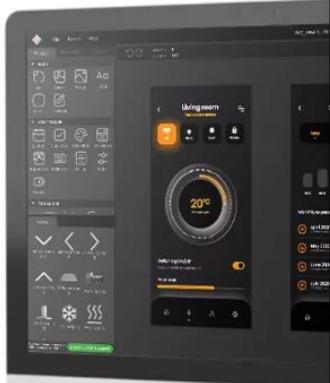

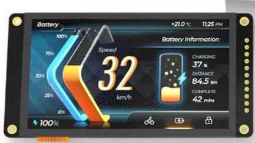  
图1.1.1LVGL官方网页

上图中，点击“GitHub”图标即可进入LVGL源码的github仓库，在该仓库中，可以下载LVGL相关的源码；点击“Docs”图标即可打开LVGL官方文档，该文档是纯英文编写的，主要讲解LVGL的基础知识、移植、部件使用、示例，等等。若您的英文水平不足以轻松阅读该文档，则建议您先跟着本书学习，遇到疑惑的地方，再结合LVGL官方文档进行辨正。

# 1.2 LVGL移植要求

市面上拥有众多的微处理器（MCU），但并不是每一个MCU都适合移植LVGL图形库，例如传统的51单片机，它并不具备移植LVGL图形库的条件。下面我们来看看LVGL对硬件的要求：

# 1. MCU

LVGL图形库对微处理器具有一定的要求，例如主频、内存等，具体要求如下表所示：

表 1.2.1 移植 LVGL 的 MCU 要求  

<table><tr><td>要求</td><td>说明</td></tr><tr><td>微控制器</td><td>16、32、64位的微控制器或处理器</td></tr><tr><td>主控频率(Hz)</td><td>&gt;16 MHz时钟速度</td></tr><tr><td>Flash/ROM</td><td>&gt;64 kB,如果使用非常多的部件,推荐&gt;180 kB</td></tr><tr><td>内存(RAM)</td><td>8kB(建议配置 24kB)</td></tr></table>

从上表可知：微处理器至少需要16位以上，所以传统的51、52单片机无法移植LVGL，它们都是8位的微处理器。接下来，我们来看一下正点原子Mini板是否满足LVGL最低移植需求，它的MCU为STM32F103RCT6，其主频率72MHz，Flash为256K，SRAM为64K，显然Mini开发板的MCU可以满足LVGL图形库的移植要求。

# 2. 显示屏

LVGL 只需要一个简单的驱动程序函数即可将像素阵列复制到显示器的给定区域中，其对显示屏的兼容性很强，具体要求如下（满足其一即可）：

① 具有  $8 / 16 / 24 / 32$  位色深的显示屏。  
② HDMI端口的显示器。

③ 小型单色显示器。  
④ LED 矩阵。  
(5) 其他可以控制像素颜色/状态的显示器。

我们正点原子的2.8/3.5/4.3/7/10.1寸TFTLCD模块以及RGBLCD模块都是16位深的显示屏，这些显示屏皆可满足LVGL的要求。

# 1.3 LVGL 源码下载

LVGL相关的源码和工程都是存放在GitHub远程仓库中，该GitHub远程仓库地址为https://github.com/lvgl/lvgl/，用户可以该仓库中下载LVGL图形库的源码。由于GitHub仓库的服务器在国外，如果用户在国内访问该服务器，可能登录不成功，此时，我们可以从正点原子光盘资料中获取LVGL的V8.2版本源码，具体路径为：A盘  $\rightarrow 6$  ，软件资料  $\rightarrow 14 / 15$  ，LVGL学习资料  $\rightarrow$  lvgl-master.zip，如下图所示：

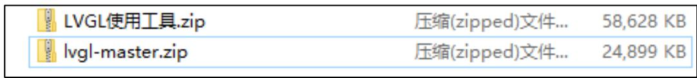  
图1.3.1LVGL源码

上图中，“LVGL 使用工具.zip”压缩包里存放了 LVGL 相关的离线转换工具，这些离线工具是广大爱好者根据 LVGL 的字库定义规则和图片的处理特性而编写的软件；“lvgl-maser.zip”压缩包里存放了 LVGL 图形库的 V8.2 版本源码，其解压后如下图所示：

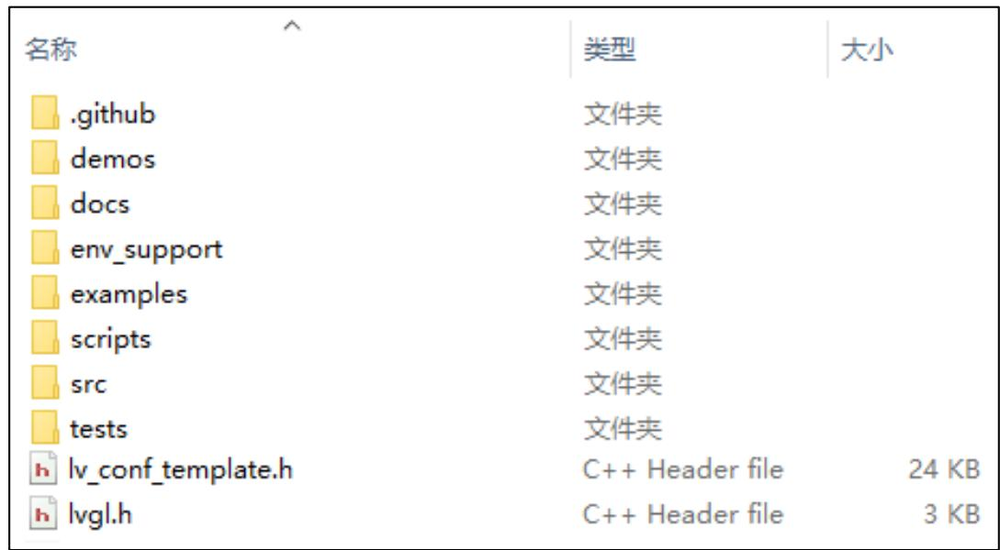  
图1.3.2LVGL源码文件

由上图可知，LVGL源码的目录下有很多文件和文件夹，但用户并不需要完全了解它们，我们只需要了解与移植相关的部分即可。各文件夹和文件的功能如下表所示：

<table><tr><td>文件</td><td>说明</td></tr><tr><td>demos</td><td>LVGL提供的综合演示源码</td></tr><tr><td>docs</td><td>LVGL文献，主要说明LVGL每个部件的使用方法</td></tr><tr><td>env_support</td><td>环境的支持（MDK、ESP、RTThread）</td></tr><tr><td>examples</td><td>LVGL例程源码和LVGL输入设备驱动，显示屏驱动文件</td></tr><tr><td>scripts</td><td>LVGL手稿（与MicroPython有关）</td></tr><tr><td>src</td><td>LVGL源文件（LVGL部件源码、第三方库）</td></tr><tr><td>tests</td><td>官方人员的测试代码，该文件夹用户无需了解</td></tr></table>

表 1.3.1 lvgl-master 文件说明  

<table><tr><td>lv_conf_template.h</td><td>LVGL的剪裁文件</td></tr><tr><td>lvgl.h</td><td>LVGL包含的头文件</td></tr></table>

上表中，与LVGL移植相关的有examples文件夹、src文件夹、lv_conf_template.h和lvgl.h文件，其他的部分均与移植无关，用户可以选择忽略。接下来我们分别看一下examples、src这两个文件夹的文件结构：

# 1. examples 文件夹

该文件夹主要包含LVGL部件实例、动画实例、其他第三方库实例以及输入设备和显示器驱动文件等内容，具体如表1.3.2所示：

表 1.3.2 examples 文件夹的内容  

<table><tr><td>文件</td><td>描述</td></tr><tr><td>anim</td><td>LVGL动画例程实例</td></tr><tr><td>arduino</td><td>开源电子平台</td></tr><tr><td>assets</td><td>图片资源</td></tr><tr><td>event</td><td>LVGL事件机制实例</td></tr><tr><td>get_started</td><td>LVGL获取状态实例</td></tr><tr><td>layouts</td><td>LVGL布局实例</td></tr><tr><td>libs</td><td>LVGL移植第三方库实例</td></tr><tr><td>others</td><td>LVGL其他测试</td></tr><tr><td>porting</td><td>LVGL输入设备驱动、文件系统驱动以及显示器驱动</td></tr><tr><td>scroll</td><td>LVGL滚动实例</td></tr><tr><td>styles</td><td>LVGL对象样式实例</td></tr><tr><td>widgets</td><td>LVGL部件实例</td></tr></table>

上表中，只有porting文件夹与移植相关，其他文件夹中存放的是各种实例。

# 2. src 文件夹

该文件夹主要包含LVGL源文件（部件源码、多种解码库），具体如表1.3.3所示：

表 1.3.3 src 文件夹的内容  

<table><tr><td>文件</td><td>描述</td></tr><tr><td>core</td><td>LVGL核心源码（事件、组、对象、坐标、样式、主题）</td></tr><tr><td>draw</td><td>LVGL绘画驱动（图片、解码、DMA2D、圆、线、圆弧、和文本）</td></tr><tr><td>extra</td><td>LVGL的拓展内容（布局、第三方库、其他测试、主题以及部件）</td></tr><tr><td>font</td><td>LVGL字库</td></tr><tr><td>gpu</td><td>LVGL针对图形加速</td></tr><tr><td>hal</td><td>硬件抽象层（显示驱动程序、输入设备程序以及LVGL系统滴答）</td></tr><tr><td>misc</td><td>主要描述LVGL其他定义（动画、内存管理、日志）</td></tr><tr><td>wi帽子</td><td>LVGL基础部件</td></tr></table>

上表中的内容都是与移植相关的，具体的移植方法我们后面将详细介绍，目前大家只需要对LVGL源码的文件结构有一定了解即可。

# 第二章 LVGL 无操作系统移植

本章我们主要介绍LVGL的无操作系统移植（裸机），让大家了解如何将LVGL移植到STM32的开发板。在移植之前，先声明一点，本书适用于正点原子所有支持LVGL（V8.2版本）的STM32开发板，各个开发板移植LVGL的不同之处，将会在书中指出。

本章节将分为以下几个小节：

2.1移植准备工作  
2.2 向工程添加文件  
2.3 修改工程文件  
2.4移植官方例程  
2.5下载验证

# 2.1 移植准备工作

# 1. 准备基础工程

在移植LVGL之前，用户必须在裸机实验中选择一个例程作为移植的基础工程，值得注意的是，最终的基础工程中必须包含LCD显示驱动、触摸屏驱动以及基本定时器驱动。这里建议大家选择《内存管理实验》作为基础工程，并准备好《触摸屏实验》、《基本定时器中断实验》这两个例程，有了这些之后，我们接下来需要将后两者中与触摸屏、基本定时器相关的驱动文件夹复制到《内存管理实验》中，如图2.1.1所示：

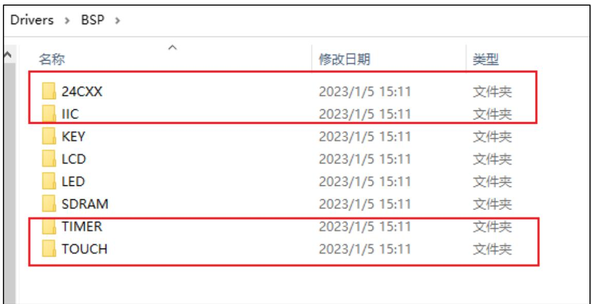  
图2.1.1添加触摸屏、基本定时器驱动

# 2. 准备LVGL源码

LVGL 官方的 GitHub 仓库(https://github.com/lvgl/lvgl/)中可以下载源码，除此之外，我们也可以在开发板的光盘资料中获取，路径：A 盘→6，软件资料→14/15，LVGL 学习资料→lvgl-maser.zip。解压 lvgl-maser.zip 压缩包后，即可得到如下图所示的文件和文件夹：

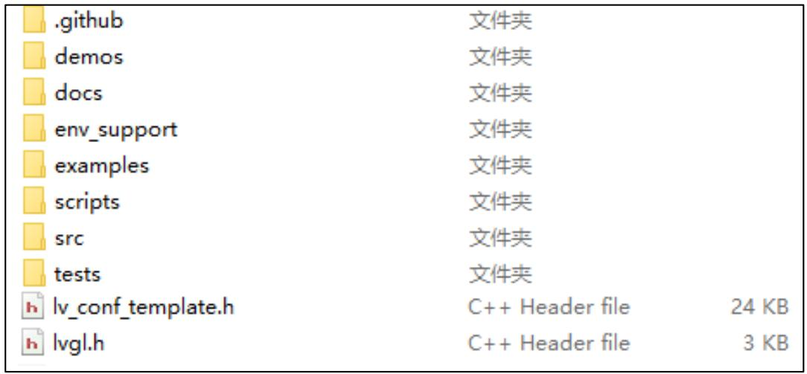  
图2.1.2LVGL源码目录

3. 把上图中的 lv_conf_template.h 文件改名为 lv_conf.h。  
4. 打开lv_conf.h文件，修改条件编译指令。

修改前：

```txt
if 0 /*Set it to "1" to enable content*/
```

修改后：

```txt
if1/\*把#if0修改成#if1\*/
```

# 5. 精简LVGL源码

除了 examples 文件夹、src 文件夹、lv_conf_template.h 和 lvgl.h 文件，其他的文件和文件夹均与移植无关，我们可以将它们删除，这样即可得到 LVGL 的精简源码，如下图所示（保留了 demos 文件夹）：

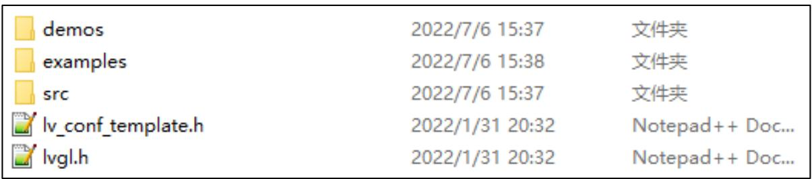  
图2.1.3LVGL移植简洁源码

由上图可知，demoos文件夹没有被删除，该文件夹中存放的是LVGL官方的演示例程，后续我们将移植其中的一些示例。

接下来我们打开上图中的 examples 文件夹，仅保留其中的 porting 文件夹，其他的文件和文件夹皆可删除，删减后如下图所示：

  
图2.1.4仅保留porting文件夹

# 2.2 向工程添加文件

# 1. 新建LVGL相关文件夹

首先我们把《内存管理实验》重命名为“LVGL例程1无操作系统移植”，然后在该工程的Middlewares目录下新建LVGL文件夹，并在该文件夹下新建GUI文件夹和GUI_APP文件夹，最后在GUI文件夹下新建lvgl文件夹。具体的文件夹结构如下图所示：

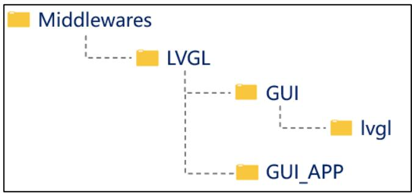  
图2.2.1Middlewares目录下文件夹结构

这里说明一点，我们的工程之所以采用这样的文件夹结构，主要是为了兼容LVGL源码中包含头文件的格式。对于初学者，这里建议按照此结构新建文件夹，否则有可能会遇到很多关于头文件的报错。

# 2. 复制LVGL源码到工程中

把精简后的LVGL源码（图2.1.3中的文件和文件夹）复制到《LVGL例程1无操作系统移植》的Middlewares/LVGLGUI/lvgl路径下，如下图所示：

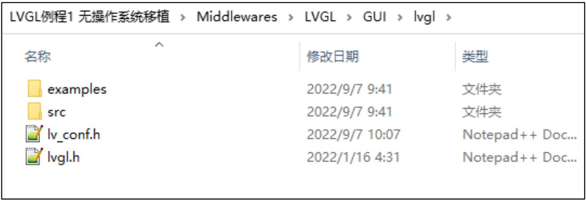  
图2.2.2移植LVGL源码

# 3. 添加工程分组、LVGL源文件

打开《LVGL例程1无操作系统移植》工程，点击图标，添加如下图所示的分组：

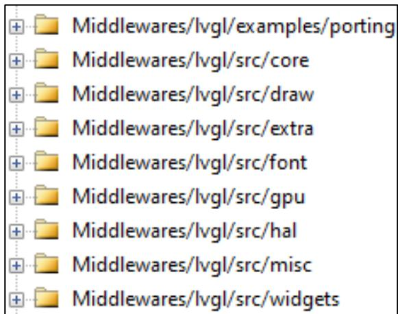  
图2.2.3 添加工程分组

打开《LVGL 例程 1 无操作系统移植》工程下的 src 文件夹（所在路径：Middlewares/LVGL/GUI/lvgl/src），我们会发现它的子文件夹名称与上图的分组名称相似，如下图所示：

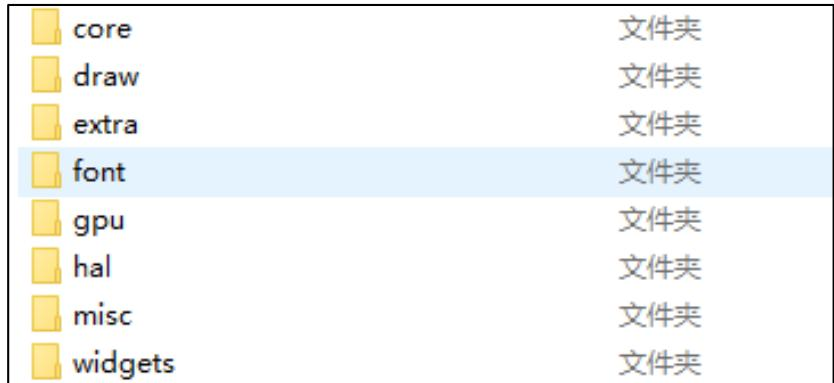  
图2.2.4src文件夹下的子文件夹

结合图2.2.3和图2.2.4，我们在对应的分组中添加文件，具体如下所示：

(1) 往 Middlewares/lvgl/src/core 分组中添加 core 文件夹下的全部.c 文件，如下图所示：

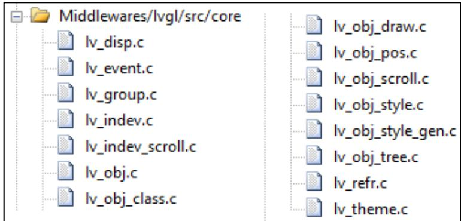  
图2.2.5Middlewares/lvgl/src/core组添加的文件

(2) 往 Middlewares/lvgl/src/draw 组中添加 draw 文件夹下除 nxp_pxp、nxp_vglite、hdl 和 stm32_DMA2d 文件夹之外的全部.c 文件，如下图所示：

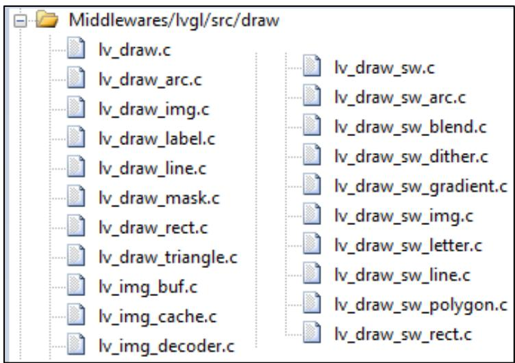  
图2.2.6 Middlewares/lvgl/src/draw组添加的文件

(3)往 Middlewares/lvgl/src/extra 组中添加 extra 文件夹下除了 lib 文件夹之外的全部.c 文件，如下图所示：

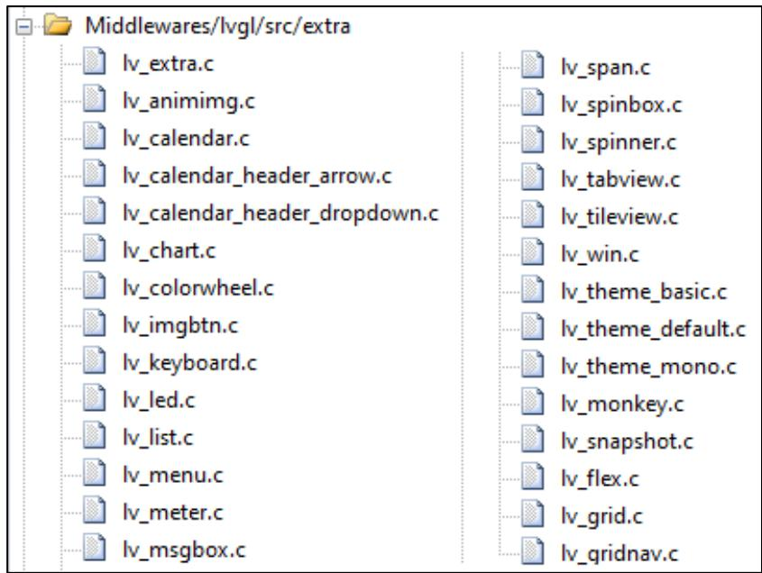  
图2.2.7 Middlewares/lvgl/src/extra组添加的文件

注意：Middlewares/lvgl/src/extra/lib 文件夹下的文件没有添加到该分组，这些文件是第三方解码库相关的，我们将在组件篇中讲解这些文件的添加和使用。

(4)往Middlewares/lvgl/srcFONT组中添加font文件夹下的全部.c文件，如下图所示：

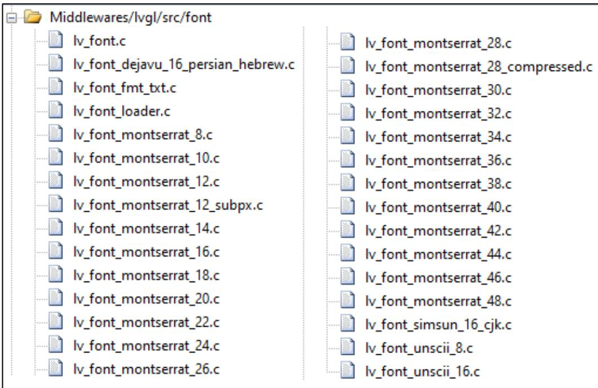  
图2.2.8 Middlewares/lvgl/srcFONT组添加的文件

(5) 往 Middlewares/lvgl/src/gpu 组中添加 draw stm32_DMA2d 和 draw/sdl 文件夹下的全部.c 文件，如下图所示：

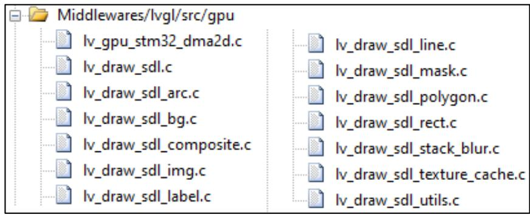  
图2.2.9 Middlewares/lvgl/src/gpu组添加的文件

(6) 往 Middlewares/lvgl/src/hal 组中添加 hal 文件夹下的全部.c 文件，如下图所示：

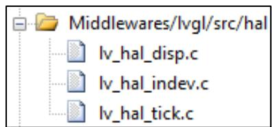  
图2.2.10 Middlewares/lvgl/src/hal组添加的文件

(7) 往 Middlewares/lvgl/src/misc 组中添加 misc 文件夹下的全部.c 文件, 如下图所示:

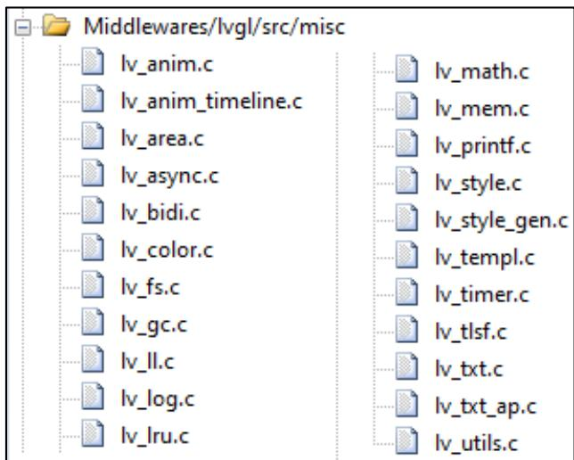  
图2.2.11 Middlewares/lvgl/src/misc组添加的文件

(8)往 Middlewares/lvgl/src痒 widgets 组中添加 widgets 文件夹下的全部.c 文件, 如下图所示:

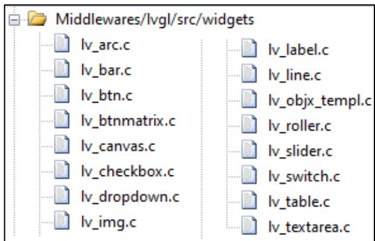  
图2.2.12 Middlewares/lvgl/src⁺ widgets组添加的文件

(9) Middlewares/lvgl/examples/porting 组添加 Middlewares/LVGL/GUI/lvgl/examples/porting 目录下的 lv_port_disp_template.c 和 lv_port_indev_template.c 文件，如下图所示：

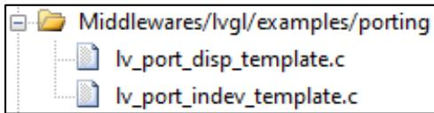  
图2.2.13 Middlewares/lvgl/examples/porting组添加的文件

# 4. 添加头文件路径

移植LVGL只需要添加关键的头文件路径即可，因为lvgl.h文件已经为我们省去了很多包含头文件的操作，添加的头文件路径如下图所示：

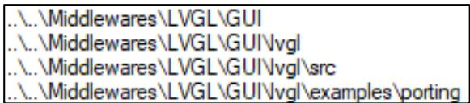  
图2.2.14 添加头文件路径

# 5. 添加触摸屏、定时器驱动

往Drivers/BSP分组中添加触摸屏、基本定时器相关驱动，如下图所示：

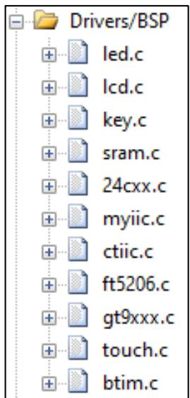  
图2.2.15 添加触摸屏、基本定时器驱动

# 6. 修改工程目标名称

将工程的目标名修改为“LVGL”或根据读者的实际场景进行修改，修改后如下图所示：

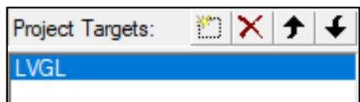  
图2.2.16 修改工程目标名称

# 7. 屏蔽MDK的警告

移植至此，如果我们编译代码，则会出现很多警告，这些警告都是LVGL源码所带来的，大家如果想屏幕这些警告，可以采用以下方法（非必须，慎用）：点击图标，选中C/C++选项卡，在MiscControls框中填入以下内容：--diag Suppress=68 --diag Suppress=111 --diag Suppress=188 --diag Suppress=223 --diag Suppress=546 --diag Suppress=1295。

# 2.3 修改工程文件

# 1.为LVGL提供时基

打开Drivers/BSP分组中的btim.c文件，声明LVGL的头文件，如下源码所示：

```txt
include "lvgl.h"
```

在该文件下的 HAL_TIM_PeriodElapsedCallback 函数中添加以下源码：

```c
void HAL_TIM_PeriodElapsedCallback(TIM_HandleTypeDef *htim)  
{  
    if (htim == (&g Tmax_handle))  
    {  
        lv Tick_inc(1); /* lvgl 的 1ms 心跳 */  
    }  
}
```

上述源码中，定时器中断回调函数调用了LVGL的lv Tick_inc函数，该函数可以让LVGL内部的时基参数加1（入口参数为1的情况下）。

接下来我们打开 main.c 文件，在 main 函数中，对基本定时器进行初始化，并设置中断周期为 1ms。注意：不同的 MCU，它们的基本定时器频率有所区别，因此定时器的初始化配置也不尽相同，各开发板的初始化配置如下表所示：

表 2.3.1 各开发板的定时器初始化配置  

<table><tr><td>正点原子 STM32 系列开发板</td><td>基本定时器初始化配置</td></tr><tr><td>Mini、精英、战舰</td><td>btim(TIMX_int_init(10-1,7200-1)</td></tr><tr><td>探索者、DMF407</td><td>btim(TIMX_int_init(10-1,8400-1)</td></tr><tr><td>阿波罗 F429</td><td>btim(TIMX_int_init(10-1,9000-1)</td></tr><tr><td>阿波罗 H743</td><td>btim(TIMX_int_init(10-1,24000-1)</td></tr><tr><td>阿波罗 F767</td><td>btim(TIMX_int_init(10-1,10800-1)</td></tr><tr><td>Mini PRO H750</td><td>btim(TIMX_int_init(10-1,24000-1)</td></tr><tr><td>ATK-DNH562</td><td>btim(TIMX_int_init(10-1,25000-1)</td></tr><tr><td>北极星 H750</td><td>btim(TIMX_int_init(100-1,2400-1)</td></tr><tr><td>北极星 F750</td><td>btim(TIMX_int_init(100-1,1080-1)</td></tr></table>

# 2. 配置显示屏、触摸输入驱动

打开 Middlewares/lvgl/examples/porting 分组中的 lv_port_disp_template.c/h（显示屏相关）和 lv_port_indev_template.c/h（触摸输入相关）文件，将这 4 个文件中的条件编译指令#if 0 都修改成#if 1，如下源码所示：

修改前：

```c
if 0 /* lv_port_disp_template.c/h 和 lv_port_indev_template.c/h */
```

修改后：

```txt
if 1 /* 把#if 0 修改成#if 1 */
```

# ① 修改lv_port_disp_template.c文件

该文件用于配置显示屏，它可以将用户的底层显示驱动与LVGL的显示驱动衔接起来。我们打开官方提供的lv_port_disp_template.c文件，包含LCD驱动头文件，然后初始化LCD以及配置打点函数，修改后的源码如下：

```c
include "lv_port_disp_template.h" #include "...//lvgl.h" /\*导入1cd驱动头文件\*/ #include".BSP/LCD/lcd.h" /********** \* DEFINES
```

```c
define USE_SRAM 0 /* 使用外部sram为1，否则为0 */
#ifdef USE_SRAM
#include "/MALLOC/malloc.h"
endif
#define MY_DISP_HOR_RES (800) /* 屏幕宽度 */
#define MY_DISP.Ver_RES (480) /* 屏幕高度 */
/* 显示设备初始化函数 */
static void disp_init(void);
/* 显示设备刷新函数 */
static void disp Flush(lv_disp_drv_t * disp_drv,
                      const lv_area_t * area,
                      lv_color_t * color_p);
*/
* @brief 初始化并注册显示设备
* @param 无
* @retval 无
*/
void lv_port_disp_init(void)
{
/* 第一步 初始化显示设备 */
disp_init();
};
/* 创建一个绘图缓冲区 */
};
/* 这里有3中缓冲配置：
* 1. 单缓冲区：
* LVGL会将显示设备的内容绘制到这里，并将他写入显示设备。
* 2. 双缓冲区：
* LVGL会将显示设备的内容绘制到其中一个缓冲区，并将他写入显示设备。
* 需要使用DMA将要显示在显示设备的内容写入缓冲区。
```

```javascript
\* 当数据从第一个缓冲区发送时，它将使LVGL能够将屏幕的下一部分绘制到另一个缓冲区。\* 这样使得渲染和刷新可以并行执行。\* \*3.全尺寸双缓冲区\* 设置两个屏幕大小的全尺寸缓冲区，并且设置disp_drv.full Refresh  $= 1$  □ LVGL将始终以'flush_cb'的形式提供整个渲染屏幕，只需更改帧缓冲区的地址。\*/ /\*单缓冲区示例）\*/ staticlv_dispdrawing_buf_tdraw_buf_dsc_1; #ifUSE_SRAM /\*设置缓冲区的大小为屏幕的全尺寸大小\*/ void\*buf_1=mymalloc(SRAMEX,MY_DISP_HOR_RES\*MY_DISP.Ver_RES); /\*初始化显示缓冲区\*/ lv_dispdrawing_buf_init(&draw_buf_dsc_1, buf_1, NULL, MY_DISP_HOR_RES\*MY_DISP.Ver_RES); #else /\*设置缓冲区的大小为10行屏幕的大小\*/ staticlv_color_tbuf_1[MY_DISP_HOR_RES\*10]; /\*第二步初始化显示缓冲区\*/ lv_dispdrawing_buf_init(&draw_buf_dsc_1,buf_1,NULL,MY_DISP_HOR_RES\*10); #endif /\*第三步在LVGL中注册显示设备\*/ staticlv_disp_drv_tdisp_drv; /\*显示设备的描述符\*/ lv_disp_drv_init(&disp_drv); /\*初始化为默认值\*/ /\*第四步设置显示设备的分辨率 \*这里为了适配正点原子的多款屏幕，采用了动态获取的方式， \*在实际项目中，通常所使用的屏幕大小是固定的，因此可以直接设置为屏幕的大小\*/ disp_drv.hor_res  $=$  lcddev.width; disp_drv VER_res  $=$  lcddev.height; /\*第五步用来将缓冲区的内容复制到显示设备\*/ disp_drv.flush_cb  $=$  disp Flush; /\*第六步设置显示缓冲区\*/ disp_drv.draw_drv = &draw_drv_dsc_1; /\*第七步注册显示设备\*/ lv_disp_drv_register(&disp_drv);
```

```c
\*\* @brief 初始化显示设备和必要的外围设备\* @param 无\* @retval 无\*/static void disp_init(void)  
{/\*Youcodehere\*/lcd_init(); /\*初始化LCD\*/lcd_display_dir(1); /\*设置横屏\*/}  
/\*\*  
\* @brief 将内部缓冲区的内容刷新到显示屏上的特定区域\* @note 可以使用DMA或者任何硬件在后台加速执行这个操作\* 但是，需要在刷新完成后调用函数'lv_disp Flush_ready()’\* @param disp_drv ：显示设备\* @arg area ：要刷新的区域，包含了填充矩形的对角坐标\* @arg color_p ：颜色数组\* \* @retval 无  
\*/  
static void disp Flush(lv_disp_drv_t \*disp_drv,const lv_area_t \*area,lv_color_t \*color_p)  
{/\*重要！！！LCD驱动函数，在指定区域内填充指定颜色块\*/lcd_color_fill(area->x1,area->y1,area->x2,area->y2,(uint16_t\*)color_p);\*/重要！！！\*通知图形库，已经刷新完毕了\*/lv_disp Flush_ready(disp_drv);  
}
```

由上述源码可知，配置LVGL显示屏驱动的步骤可分为以下7步：

(1) 调用函数 disp_init 初始化 LCD 驱动。  
(2) 调用函数 lv_disp_draw_buf_init 初始化缓冲区（最低标准：显示屏的宽度分配率*10）。  
(3) 调用函数 lv_disp_drv_init 初始化显示驱动。  
(4) 设置显示的高度与宽度。  
(5) 注册显示驱动回调（打点函数）。  
(6) 设置显示驱动的绘画缓冲区。  
(7) 调用 lv_disp_drv register 函数注册显示驱动到 LVGL 列表中。

在整个配置的过程中，实际上我们只需要提供两个函数：LCD初始化函数和LCD填充函数。如果想设置屏幕的方向，则调用lcd_display_dir函数即可。

注意：如果需要使用 DMA2D 外设，请打开 lv_conf.h 文件，将 LV_USE_GPU_STM32_DMA2D 宏定义置 1，并在 LV_GPU_DMA2D_CMSIS_INCLUDE 宏定义中添加 MCU 的头文件路径。值得注意的是，不同 MCU 所对应的头文件不同，具体如下表所示：

表 2.3.2 不同开发板对应的头文件  

<table><tr><td>正点原子具备 RGB 接口的 STM32 开发板</td><td>LV_GPU_DMA2D_CMSIS_INCLUDE</td></tr><tr><td>阿波罗 429</td><td>“#include stm32f429xx.h”</td></tr><tr><td>阿波罗 H743</td><td>“#include stm32h743xx.h”</td></tr><tr><td>阿波罗 767</td><td>“#include stm32h767xx.h”</td></tr><tr><td>北极星 F750</td><td>“#include stm32f750xx.h”</td></tr><tr><td>北极星 H750</td><td>“#include stm32h750xx.h”</td></tr></table>

配置完以上步骤之后，当LVGL调用lcd_color_fill函数绘制图形时，如果识别到显示屏是RGBLCD，则会调用ltdc_color_fill函数，该函数即可实现DMA2D传输（阻塞的方式）。如果用户想要更加优异的传输性能，可以使用DMA2D中断的方法来刷新显示屏，示例代码如下：

```c
volatile uint8_t lv_gpu_state = 0;  
/*  
* @brief dma2d中断服务函数  
* @param无  
* @retval无  
*/  
void DMA2D_IRQHandler(void)  
{  
    if ((DMA2D->ISR & DMA2D_FLAG_TC) != 0U)  
    {  
        if ((DMA2D->CR & DMA2D_IT_TC) != 0U)  
        {  
            /* 清除标志位 */  
            DMA2D->CR &= ~DMA2D_IT_TC;  
            DMA2D->IFCR = DMA2D_FLAG_TC;  
            /* 刷新显示设备 */  
            if (lv_gpu_state == 1) {  
                lv_gpu_state = 0;  
                lv_disp Flush_ready(&disp_drv);  
            }  
        }  
}  
/*  
* @brief dma2d采用寄存器初始化  
* @param无  
* @retval无  
*/  
static void dma2d_reg_init(void)  
{  
    /* 设置DMA2D中断优先级 */
```

```c
HALNVIC_SetPriority(DMA2D_IRQn，3,0);/\*使能DMA2D中断\*/HALNVIC_EnableIRQ(DMA2D_IRQn);/\*使能DMA2D外设时钟\*/_HAL_RCC_DMA2D_CLK_ENABLE();  
}  
/\*\* \* @brief 初始化显示设备和必要的外围设备\* @param 无\* @retval 无\*/static void disp_init(void)  
{/\*Youcodehere\*/lcd_init(); /\*初始化LCD\*/lcd_displaydir(1); /\*设置横屏\*/dma2d_reg_init(); /\*初始化DMA2D\*/  
}  
staticvoiddisp Flush(lv_disp_drv_t\*disp_drv,const lv_area_t\*area，lv_color_t\*color_p)  
{uint32_t OffLineSrc  $=$  lcddev.width-(area->x2- area->x1+1);uint32_t addr  $=$  LCD_FRAMEBUF_ADDR  $+2^{\star}$  (1cddev.width\*area->y1+area->x1);/\*中断传输\*//\*内存到内存模式\*/DMA2D->CR  $= 0\times 00000000UL$  |（1<<9）; $/^{*}$  源地址\*/DMA2D->FGMAR  $= (\mathrm{uint}32\_ t)$  (uint16_t\*) (color_p); $/^{*}$  目标地址\*/DMA2D->OMAR  $= (\mathrm{uint}32\_ t)$  addr;/\*输入偏移\*/DMA2D->FGOR  $= 0$  /\*输出偏移\*/DMA2D->OOR  $= \mathrm{OffLineSrc};$    
/\*前景层和输出区域都采用的RGB565颜色格式\*/DMA2D->FGPFCCR  $=$  DMA2D_OUTPUT RGB565;DMA2D->OPFCCR  $=$  DMA2D_OUTPUT RGB565;/\*多少行\*/
```

```c
DMA2D->NLR  $=$  (area->y2 - area->y1 + 1) | ((area->x2 - area->x1 +1)<< 16);   
/\*开启中断\*/   
DMA2D->CR  $\mid =$  DMA2D_IT_TC|DMA2D_IT_TE|DMA2D_IT_CE;   
\*/启动传输\*/   
DMA2D->CR  $|\equiv$  DMA2D_CR_START;   
lv_gpu_state  $= 1$  ·
```

上述的源码就是采用DMA2D中断的方式来刷新显示屏，值得注意的是，在竖屏状态下，LVGL使用DMA2D的方式刷新显示屏，会出现显示混乱的问题，该问题目前还没有很好的解决方案。如果用户想使用RGB屏，并且以竖屏的方式运行LVGL，可以使用画点方式刷新显示屏，示例源码如下：

```c
define LV_FIND_MIN(a,b) (a < b ? a : b)  
void ltdc_color_fill( uint16_t sx, uint16_t sy, uint16_t ex, uint16_t ey, uint16_t *color)  
{  
    uint16_t fillw, fillh;  
    uint16_t x, y, i, j;  
    fillw = ((ex - sx) > 0) ? (ex - sx + 1) : (sx - ex + 1);  
    fillh = ((ey - sy) > 0) ? (ey - sy + 1) : (sy - ey + 1);  
    x = LV_FIND_MIN(sx, ex);  
    y = LV_FIND_MIN(sy, ey);  
    for (i = y ; i < y + fillh ; i++)  
    {  
        for (j = x ; j < x + fillw ; j++)  
        {  
            ltdc_draw_point(j, i, (uint16_t)*(color));  
            color++;  
        }  
    }
```

上述代码使用的是画点的方式来刷新显示屏，此方法刷新屏幕的效率较低。

# ② 修改lv_port_indev_template.c文件

该文件用于配置输入设备，例如：触摸屏、鼠标、键盘、编码器、按键等，它可以将用户的底层输入设备驱动与LVGL的输入驱动衔接起来。这里我们使用触摸屏作为输入设备，具体的配置源码如下所示：

```c
/\*\*\*\*\*\*\*\*\*\*\*\*\*\*\*\*\*\*\*\*\*\*\*\*\*\*\*\*\*\*\*\*\*\*\*\*\*\*\*\*\*\*\*\*\*\*\*\*\*\*\*\*\*\*\*\*\*\*\*\*\*\*\*\*\*\*\*\*\*\*\*\*\*\*\*\*\*\*\*\*\*\*\*\*\*\*\*\*\*\*\*\*\*\*\*\*\*\*\*\*\*  
\* INCLUDES  
\*\*\*\*\*\*\*\*\*\*\*\*\*\*\*\*/  
#include "lv_port_indev_template.h"
```

```c
include".././lvgl.h"   
/\*导入屏幕触摸驱动头文件\*/   
#include"BSP/TOUCH/touch.h"   
/\*触摸屏\*/   
static void touchpad_init(void);   
static void touchpad_read lv_indev_drv_t \* indev_drv, lv_indev_data_t \* data); static bool touchpad_is_pressed(void);   
static void touchpad_get_xy lv_coord_t \* x, lv_coord_t \* y); lv_indev_t \* indev_touchpad; /\*触摸屏\*/   
\*\*\* @brief 初始化并注册输入设备 \* @param 无 \* @retval 无   
\*/   
void lv_port_indev_init(void)   
{ /\*\* \* \* 在这里你可以找到 LittlevGL 支持的出入设备的实现示例： \* - 触摸屏 \* - 鼠标（支持光标） \* - 键盘（仅支持按键的GUI用法） \* - 编码器（支持的GUI用法仅包括：左，右，按下） \* - 按钮（按下屏幕上指定点的外部按钮） \* \* 函数 `..._read()` 只是示例 \* 你需要根据具体的硬件来完成这些函数 \*/ static lv_indev_drv_t indev_drv; /\*\*\* \* 触摸屏 \* /\* 第一步初始化触摸屏\*/ touchpad_init(); /\*第二步注册触摸屏输入设备\*/ lv_indev_drv_init(&indev_drv);
```

```c
/\*第三步选择输入设备类型：触摸屏\*/  
indev_drv.type  $=$  LV_INDEV_TYPE_POINTER;  
/\*第四步设置触摸坐标读取回调函数\*/  
indev_drv.read_cb  $=$  touchpad_read;  
/\*注册输入设备\*/  
indev_touchpad  $=$  lv_indev_drv_register(&indev_drv);  
触摸屏\*/  
brief 初始化触摸屏  
param 无  
retval 无  
tic void touchpad_init(void)  
/\*Your code comes here\*/tp_dev.init();  
/\*电阻屏坐标矫正\*/if (key_scan(0)  $\equiv$  KEYO_PRES) /\*KEYO按下，则执行校准程序\*/{lcd_clear(WHITE); /\*清屏\*/tp_adjust(); /\*屏幕校准\*/tp_save_adjust_data();}  
brief 图形库的触摸屏读取回调函数  
param indev_drv ：触摸屏设备@arg data ：输入设备数据结构体retval 无  
tic void touchpad_readLv_indev_drv_t \* indev_drv,lv_indev_data_t \*data)static Lv_coord_t last_x = 0;static Lv_coord_t last_y = 0;
```

```c
/\*保存按下的坐标和状态\*/ if(touchpad_is_pressed()) { touchpad_get_xy(&last_x, &last_y); data->state  $=$  LV_INDEV_STATE_PR; } else { data->state  $=$  LV_INDEV_STATE_REL; } /\*设置最后按下的坐标\*/ data->point.x  $=$  last_x; data->point.y  $=$  last_y; } /\*\* \* @brief 获取触摸屏设备的状态 \* @param 无 \* @retval 返回触摸屏设备是否被按下 \*/ static bool touchpad_is_pressed(void) { /\*Your code comes here\*/ tp_dev.scan(0); if(tp_dev.sta&TP_PREs_DOWN) { return true; } return false; } /\*\* \* @brief 在触摸屏被按下的时候读取x、y坐标 \* @param x : x坐标的指针 \* @arg y : y坐标的指针 \* @retval 无 \*/ static void touchpad_get_xy(lv_coord_t \*x,lv_coord_t \*y) { /\*Your code comes here\*/  $(^{*}\mathbf{x}) =$  tp_dev.x[0];
```

```txt
$(^{*}\mathrm{y}) = \mathrm{tp\_dev.y[0]};$
```

由上述源码可知，配置LVGL的触摸驱动分为以下5个步骤：

(1) 调用touchpad_init函数初始化触摸设备。  
(2) 调用函数 lv_indev_drv_init 初始化输入设备。  
(3) 设置设备的的类型。  
(4) 设置触摸回调函数，该函数用于获取触摸屏的坐标。  
(5) 调用函数 lv_indev_drv_register 注册输入设备。

LVGL 官方提供的获取触摸坐标函数是 touchpad_get_xy，该函数的 *x 和 *y 的值需要用户提供。

# 3. 编写测试代码

在编写测试代码之前，我们必须先开启 C99 模式，否则编译代码会出现很多报错，开启 C99 模式的方法如下图所示：

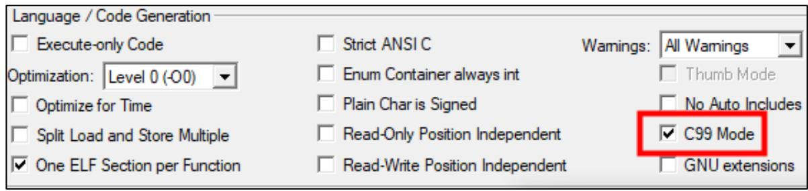  
图2.3.3开启C99模式

开启C99模式之后，接下来就可以在main.c中编写测试代码，检测LVGL是否移植成功，具体源码如下：

```c
include "lvgl.h" #include "lv_port_indev_template.h" #include "lv_port_disp_template.h" int main(void) { /* 系统其他硬件初始化信息，这里忽略 */ btim_timx_int_init(10-1,7200-1); /* 根据自己的开发板MCU定义定时器周期为1ms*/ lv_init(); /* lvgl系统初始化*/ lv_port_disp_init(); /* lvgl显示接口初始化，放在lv_init()的后面*/ lv_port_indev_init(); /* lvgl输入接口初始化，放在lv_init()的后面*/ lv_obj_t *label = lv_label_create lv_scr_ACT()); lv_label_set_text.label, "Hello Alientek!!!"); lv_obj_center.label); while(1) { lv_timerhandler(); /* LVGL管理函数相当于RTOS触发任务调度函数*/ delay_ms(5); }
```

值得注意的是，上述源码中，基本定时器的初始化函数需要根据具体的MCU来配置，这一个细节非常的关键！如果移植成功，即可看到测试代码的运行效果，如下图所示：

  
图2.3.4显示"Hello Alientek"字体

如果编译工程时出现如图2.3.2的报错（不一定出现），则说明内存不足，用户可以尝试修改malloc.h文件中MEM1_MAX_SIZE宏定义的大小（改小）。

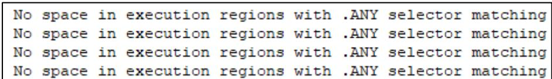  
图2.3.2内存不足编译错误

# 2.4移植官方例程

在精简LVGL源码的时候，我们保留了demo文件夹，该文件夹中存放的就是LVGL的官方示例。由于demo文件夹中存在多个官方例程，不同的例程对硬件的要求有所不同，这里以官方的音乐播放器为例（该示例对硬件要求较高），为大家介绍官方示例的移植流程，具体步骤如下：

(1) 把 demos 文件夹复制到 Middlewares/LVGL/GUI_APP 路径下，如下图所示：

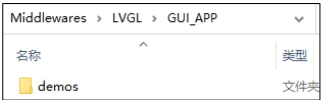  
图2.4.1复制官方例程

(2) 添加文件路径

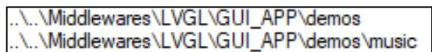  
图2.4.2添加文件路径

(3) 打开 lv_conf.h 文件，找到 LV_USE_DEMO_MUSIC 宏定义并设置为 1，开启该实验。  
(4) 创建 Middlewares/LVGL/GUI_APP 分组，往其中添加 demos/music 路径下的全部.c 文件，如下图所示：

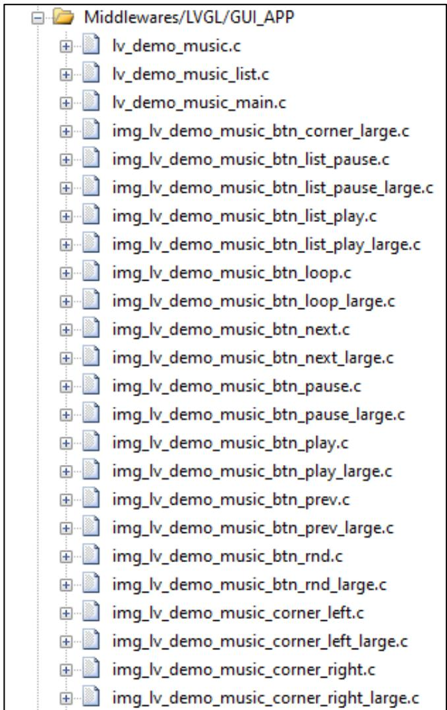  
图2.4.3官方例程文件

(5)编译工程，可能会出现如图2.4.4所示的错误，这说明12号以及16号字体没有定义。

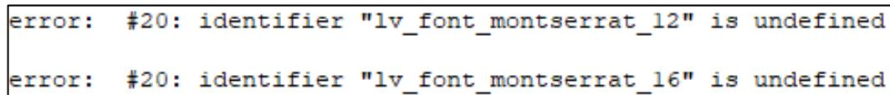  
图2.4.4 字体没有定义

如果大家遇到此报错，可以打开lv_conf.h文件，找到相应字体的宏定义，并将其设置为1即可，如下图所示：

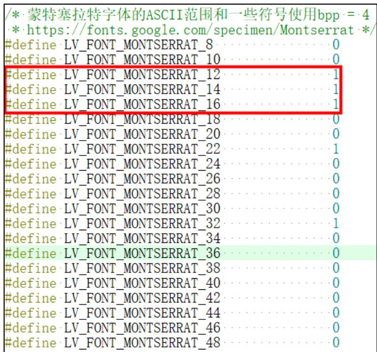  
图2.4.5定义字体

定义相应的字体之后，再一次编译工程，如果配置的内存足够，此时就不会出现报错了。接下来即可在 main 函数中调用 lv_demo_music 函数，运行音乐播放器示例，具体源码如下：

```c
include "lv_demo_music.h"  
int main(void)  
{  
/* 各种初始化/时钟/驱动等等，省略 */  
btim.timx_int_init(10-1,7200-1); /* 这里以F103为例初始化定时器 */  
lv_init(); /* lvgl系统初始化 */  
lv_port_disp_init(); /* lvgl显示接口初始化，放在lv_init()的后面 */  
lv_port_indev_init(); /* lvgl输入接口初始化，放在lv_init()的后面 */  
lv_demo_music();  
while(1)  
{  
    lv_timerhandler(); /* LVGL管理 */  
    delay_ms(5);  
}
```

# 2.5 下载验证

编译工程并下载到开发板中。值得注意的是，这个官方例程仅支持  $800*480$  分辨率的屏幕，如果使用其他分辨率的屏幕，可能导致例程功能无法正常展现。音乐播放器例程正常运行的界面如下图所示：

  
图2.5.1音乐播放器界面

# 第三章 LVGL 带操作系统移植

本章主要讲解带操作系统（FreeRTOS）的LVGL移植。虽然LVGL是支持操作系统的，但是其内部实现机制和RTOS类似，因此工程可能存在线程不安全的问题。如果用户的工程仅涉及纯软件的项目，则不建议使用RTOS。

本章节将分为以下几个小节：

3.1移植准备工作  
3.2 编写FreeRTOS相关代码  
3.3 下载验证

# 3.1 移植准备工作

# 1. 移植 FreeRTOS

LVGL 移植操作系统的步骤并不复杂，我们只需要把上一章中移植好的工程换成任务或者线程的形式即可。注意：关于 FreeRTOS 的移植，这里不展开介绍，具体的步骤请参考正点原子《FreeRTOS 开发指南.pdf》。

# 2. 为LVGL提供时基

在裸机移植的时候，我们使用基本定时器为LVGL提供时基，而当有了系统之后，提供时基的方式就有了第二种选择。需要使用RTOS提供时基，我们首先打开lv_conf.h文件，把LV_TICK.CustomOM宏定义置1，然后设置LV_TICK.CustomOM_INCLUDE和LV_TICK_CUSTOM_SYS_TIME_EXPR配置项，具体源码如下：

```c
/* 使用自定义 tick 源，以毫秒为单位告诉运行时间。它不需要手动更新 `lv Tick_inc()` 函数 */
#define LV_TICKcustom 1
#define LV_TICKCUSTOM
#define LV_TICKCustomINCLUDE "FreeRTOS.h" /* 系统时间函数头 */
/* 计算系统当前时间的表达式（以毫秒为单位） */
#define LV_TICKcustom_SYS_TIME_EXPR (xTaskGetTickCount())
#endif /*LV_TICKcustom*/
```

由上述源码可知，我们使用FreeRTOS的xTaskGetTickCount函数来为LVGL提供时基。注意：在FreeRTOSConfig.h文件中，必须把configTICK_RATE_HZ宏定义设置为1000（没有改动的情况下，默认就是1000）。

# 3.2 编写FreeRTOS相关代码

新建两个文件：lvgl_demo.c、lvgl_demo.h，并将它们存放在User目录下，如下图所示：

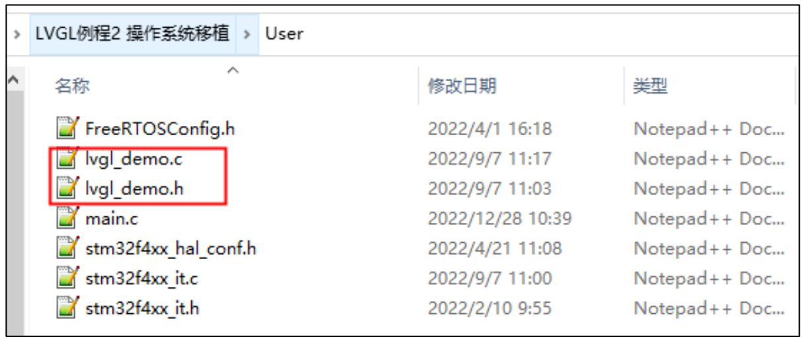

这两个文件用于存放RTOS相关的代码，具体源码如下：

1. lvgl_demo.c  
```c
include"lvgl_demo.h" #include "/BSP/LED/led.h" #include "FreeRTOS.h" #include "task.h" #include "lvgl.h" #include "lv_port_disp_template.h" #include "lv_port_indev_template.h" #include "lv_demo_music.h" /\*\*\*\*\*\*\*\*\*\*\*\*\*\*\*\*\*\*\*\*\*\*\*\*\*\*\*\*\*\*\*\*\*\*\*\*\*\*\*\*\*\*\*\*\*\*\*\*\*\*\*\*\*\*\*\*\*\*\*\*\*\*\*\*\*\*\*\*\*\*\*\*\*\*\*\*\*\*\*\*\*\*\*\*\*\*\*\*\*\*\*\*\*\*\*\*\*\*\*\*\* /\*FreeRTOS配置\*/ /\*START_TASK任务配置 \*包括：任务句柄任务优先级堆栈大小创建任务 \*/ #define START_TASK_PRIO 1 /\*任务优先级\*/ #define START_STK_SIZE 128 /\*任务堆栈大小\*/ TaskHandle_t StartTask_Handler; /\*任务句柄\*/ void start_task(void \*pvParameters); /\*任务函数\*/ /\*LVdemo_TASK任务配置 \*包括：任务句柄任务优先级堆栈大小创建任务 \*/ #define LVdemo_TASK_PRIO 3 /\*任务优先级\*/ #define LVdemo_STK_SIZE 1024 /\*任务堆栈大小\*/ TaskHandle_t LV_DEMOTask_Handler; /\*任务句柄\*/ void lv_demo_task(void \*pvParameters); /\*任务函数\*/
```

```c
/\*LED_TASK任务配置\*包括：任务句柄任务优先级堆栈大小创建任务\*/#defineLED_TASK_PRIO 4 /\*任务优先级\*/#defineLED_STK_SIZE 128 /\*任务堆栈大小\*/TaskHandle_tLEDTask_Handler; /\*任务句柄\*/void led_task(void \*pvParameters); /\*任务函数\*//**********/void lvgl_demo(void)  
{lv_init(); /\*lvgl系统初始化\*/lv_port_disp_init(); /\*lvgl显示接口初始化，放在lv_init()的后面\*/lv_port_indev_init(); /\*lvgl输入接口初始化，放在lv_init()的后面\*/xTaskCreate((TaskFunction_t)start_task, /\*任务函数\*/(const char\* ) "start_task", /\*任务名称\*/(uint16_t )START_STK_SIZE, /\*任务堆栈大小\*/(void\* )NULL, /\*传递给任务函数的参数\*/(UBaseType_t )START_TASK_PRIO, /\*任务优先级\*/(TaskHandle_t\* )&StartTask ,(任务句柄\*/vTaskStartScheduler(); /\*开启任务调度\*/  
}  
/\*\*@brief start_task\* @param pvParameters：传入参数(未用到)\* @retval 无\*/void start_task(void \*pvParameters)  
{taskENTER_CRITICAL(); /\*进入临界区\*//\*创建LVGL任务\*/xTaskCreate((TaskFunction_t)lv_demo_task,(const char\* ) "lv_demo_task", (uint16_t )LV_DEMO_STK_SIZE,(void\* )NULL,(UBaseType_t )LV_DEMO_TASK_PRIO,(TaskHandle_t\* )&LV_DEMOTask ,(任务句柄\*/
```

```c
xTaskCreate((TaskFunction_t)led_task, (const char*) "led_task", (uint16_t) LED_STK_SIZE, (void*) NULL, (UBaseType_t) LED_TASK_PRIO, (TaskHandle_t*) &LEDTask_Handler); taskEXIT_CRITICAL(); /*退出临界区*/ vTaskDelete(StartTask_Handler); /*删除开始任务*/ } /** * @brief LVGL运行例程 * @param pvParameters：传入参数(未用到) * @retval 无 */ void lv_demo_task(void *pvParameters) { lv_demo_music(); /*测试的demo*/ while(1) { lv_timerhandler(); /*LVGL计时器*/ vTaskDelay(5); } } /** * @brief 系统再运行 * @param pvParameters：传入参数(未用到) * @retval 无 */ void led_task(void *pvParameters) { while(1) { LED0_TOGGLE(); vTaskDelay(1000); }
```

lvgl_demo.c 文件的代码实现可分为 4 个步骤：

(1) 包含头文件；  
(2) 定义 FreeRTOS 相关变量以及宏定义；

(3) 编写LVGL接口函数lvgl_demo，在其中初始化LVGL、显示设备以及输入设备，并创建开始任务；  
(4) 在开始任务中创建 lvgl 示例任务以及 led 任务，调用音乐播放器相关的函数。

注意：如果使用的是其他的官方例程，请根据实际的例程来包含头文件以及调用demo函数，上述代码中以音乐播放器为例。

# 2.lvgl_demo.h

```c
ifndefLVGL_DEMO_H #define LVGL_DEMO_H void lvgl_demo(void); #endif
```

这个文件很简单，只是声明了LVGL的接口函数。

# 3.3 调用接口函数

接下来只需要在 main.c 文件中调用 LVGL 的接口函数 lvgl_demo 即可，具体源码如下所示：

```c
include "/SYSTEM/sys/sys.h" #include "/SYSTEM/usart/usart.h" #include "/SYSTEM/delay/delay.h" #include "/BSP/LED/led.h" #include "/BSP/LCD/lcd.h" #include "/BSP/KEY/key.h" #include "/BSP/SRAM/sram.h" #include "/MALLOC/malloc.h" #include "/BSP/TOUCH/touch.h" #include "lglm_demo.h" int main(void) { HAL_Init(); /* 初始化HAL库*/ sys_stm32_clock_init(RCC_PLL_MUL9); /* 设置时钟，72Mhz*/ delay_init(72); /* 延时初始化*/USART_init(115200); /* 串口初始化为115200*/ led_init(); /* 初始化LED*/ lcd_init(); /* 初始化LCD*/ key_init(); /* 初始化按键*/ sram_init(); /* SRAM初始化*/ tp_dev.init(); /* 触摸屏初始化*/ my_mem_init(SRAMIN); /* 初始化内部SRAM内存池*/ my_mem_init(SRAMEX); /* 初始化外部SRAM内存池*/ lvgl_demo(); /* 运行lvgl例程*/ }
```

# 3.4 下载验证

编译工程并下载到开发板中，代码的运行界面如下图所示：

  
图3.4.1音乐播放器界面

# 第四章 PC 模拟器的使用

PC 模拟器是指可以在电脑上模拟其他平台的模拟器软件。在没有硬件的情况下，用户依然可以使用模拟器来调试 GUI，除此之外，模拟器对于产品说明书的制作也有很大的用处。LVGL 作为一款优秀的 GUI 图形库，它是支持模拟器功能的，并且 LVGL 官方提供了多个平台的模拟器工程，本书主要介绍 VisualStudio 模拟器工程的使用。

本章节将分为以下几个小节：

3.1 LVGL模拟器工程下载  
3.2 模拟运行LVGL例程  
3.3 工程文件解析

# 3.1 LVGL 模拟器工程下载

LVGL 的 VisualStudio 模拟器工程的获取方式主要有两种：①正点原子开发板的 A 盘资料（推荐）、②官方的 git 仓库。这里建议新手的朋友使用第一种获取方式，因为从官方的 git 仓库获取该工程，可能会频繁地失败。接下来我们分别介绍这两种获取方式：

# 1. 从A盘资料获取

VisualStudio 模拟器工程所在路径：A 盘  $\rightarrow 4$  ，程序源码  $\rightarrow 3$  ，扩展例程  $\rightarrow 4$  ，LVGL 例程  $\rightarrow$  LVGL 例程 3 PC 端模拟 LVGL。注意：这个文件夹里面提供了两个平台的模拟器工程，lv_port_win visualsstudio-master.zip 压缩包中存放的是 VisualStudio 的模拟器工程，界面如下图所示：

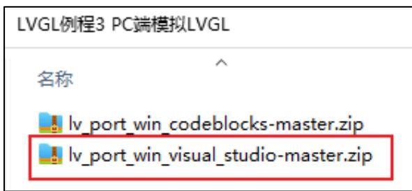  
图3.1.1 模拟器工程压缩包界面

# 2. 从官方的git仓库获取

打开LVGL官方的在线文档（https://docs.lvgl.io/master/index.html），点击“Get started”选项，界面如图3.1.2所示，然后再点击“Simulator on PC”选项。

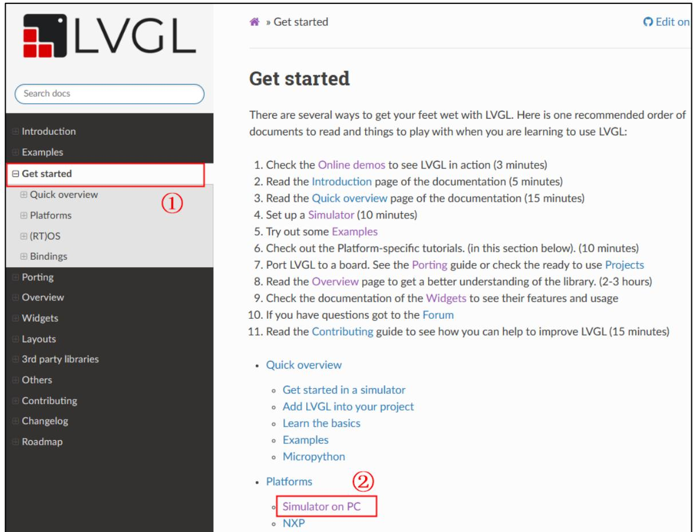  
图3.1.2在线文档界面  
图3.1.3不同平台的模拟工程

进入“Simulator on PC”页面后，即可看到不同平台的LVGL模拟器工程，如下图所示：

# Select an IDE

The simulator is ported to various IDEs (Integrated Development Environments). Choose your favorite IDE, read its README on GitHub, download the project, and load it to the IDE.

- Eclipse with SDL driver: Recommended on Linux and Mac  
CodeBlocks:Recommended on Windows  
- VisualStudio with SDL driver: For Windows  
- VSCode with SDL driver: Recommended on Linux and Mac

接下来点击上图中的“VisualStudio with SDL driver”选项，进入 VisualStudio 模拟器工程的下载页面，如下图所示：

  
图3.1.4git仓库下载工程的界面

在这个页面中，我们可以选择压缩包或者 git 的方式下载模拟器工程。值得注意的是，该仓库中存在子仓库，如果采用压缩包的方式下载工程，还需要将子仓库的文件分别下载，并复制到主工程相应的文件夹当中，子仓库的界面如下图所示：

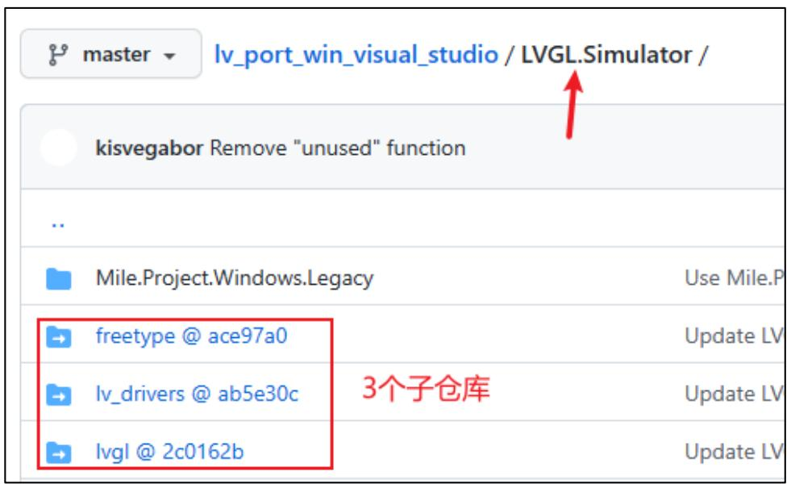  
图3.1.5子仓库界面

# 3.2 模拟运行LVGL例程

在上一小节中，我们已经获取到 VisualStudio 模拟器工程，接下来为大家介绍 LVGL 模拟器工程的使用。

# 1. 安装 VisualStudio2019

VisualStudio2019 软件的官方下载网址如下（有可能失效）：https://learn.microsoft.com/zh-cn/visualstudio/releases/2019/release-notes，大家下载后自行安装即可。

# 2. 打开模拟器工程

打开lv_port_win visualsstudio-master文件夹（如果是压缩包，则需要解压出来），双击LVGL.Simulator.sln文件，打开LVGl模拟工程，具体界面如图3.2.1所示：

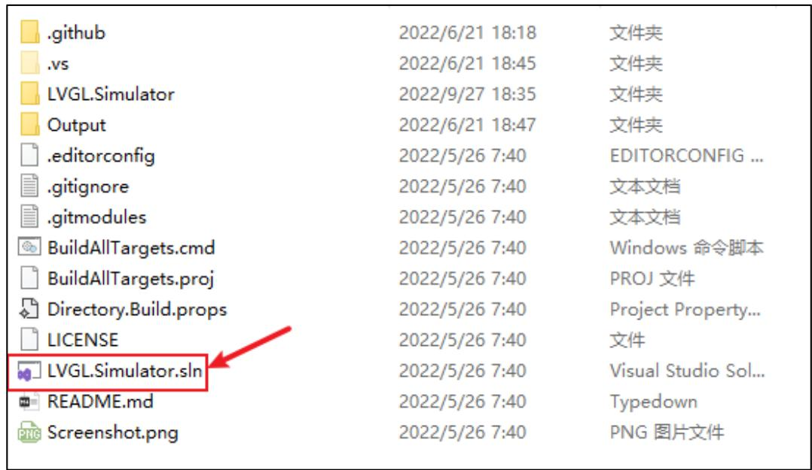  
图3.2.1 打开LVGI模拟工程

# 3. 设置配置管理器

设置平台为x64，如下图所示：

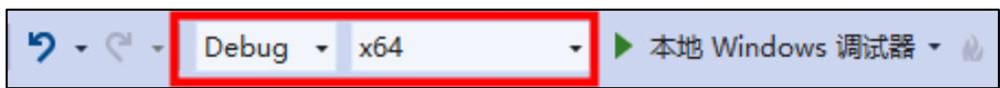  
图3.2.2设置配置管理器

# 4. 调试例程代码

点击“本地Windows调试器”，即可开始调试代码，具体操作界面如下图所示：

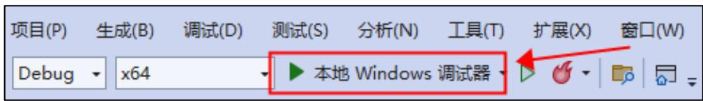  
图3.2.3开始调试

官方例程运行之后，界面如下图所示：

  
图3.2.4官方例程界面

# 3.3 工程文件解析

# 1. LVGL.Simulator.cpp 文件

对于LVGL.Simulator.cpp文件，我们一般只需要关注两个地方：①屏幕分辨率设置；②示例函数的调用。首先来看屏幕分辨率的设置，其在main函数中，如下图所示：

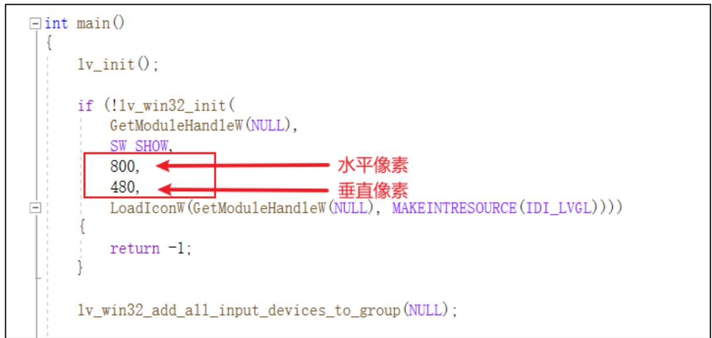  
图3.3.1屏幕分辨率设置

用户可以根据实际项目中的屏幕分辨率来进行设置，这样模拟出来的效果就更加的贴合实际。注意：LVGL官方的例程，默认仅支持  $800*480$  的分辨率。

接下来，我们看示例函数的调用，其同样在 main 函数中，如下图所示：

```cpp
//  
// Demos from lvexamples  
//  
lv_demoWidgets(); // ok  
// lv_demo;benchmark(); //ok  
// lv_demo_keypadEncoder(); //ok  
// lv_demo_music(); //removed from repository  
// lv_demoPrinter(); //removed from repository  
// lv_demo_stress(); //ok
```

图3.3.2示例函数调用

由上图可知，示例函数的调用非常简单，如果用户使用的是LVGL官方的例程，只需要将相应的示例函数取消注释即可；如果需要自行编写测试代码，可直接在此处编写（不推荐），或者另外封装函数，然后在此处调用（推荐）。

# 2.lv_conf.h文件

在LVGL的模拟器项目中，lv_conf.h文件非常重要，该文件负责LVGL功能的裁剪以及设置，这里我们主要介绍几个重点的地方：

# ① 设置颜色深度：

```c
/* 颜色深度：1 (1 byte per pixel), 8 (RGB332), 16 (RGB565), 32 (ARGB8888)*/ #define LV_COLOR_DEPTH 16
```

如果实际的项目对于色彩的要求较高，建议根据实际显示屏的颜色深度来进行设置，否则模拟的效果与现实设备运行的效果可能有较大区别。

# (2)设置内存大小

```txt
define LV MEM SIZE (1024U * 1024U) /* 字节为单位，建议贴合实际的设备 */
```

# ③设置显示刷新周期和输入设备读取周期

```c
/* 默认显示刷新周期，LVG将在这段时间内重绘改变过的区域 */
#define LV_disp_def_REFR_PERIOD 10 /*[ms]*/
/* 输入设备读取周期(毫秒) */
#define LV_INDEVDEF_READ_PERIOD 10 /*[ms]*/
```

# ④字库的使用

```c
/* 字库使用，设置1启用，设置0为失能 */
#define LVFONT_MONTSERRAT_8 1
#define LVFONT_MONTSERRAT_10 1
#define LVFONT_MONTSERRAT_12 1
#define LVFONT_MONTSERRAT_14 1
#define LVFONT_MONTSERRAT_16 1
#define LVFONT_MONTSERRAT_18 1
#define LVFONT_MONTSERRAT_20 1
#define LVFONT_MONTSERRAT_22 1
#define LVFONT_MONTSERRAT_24 1
#define LVFONT_MONTSERRAT_26 1
```

```c
define LVFONT_MONTSERRAT_28 1  
#define LVFONT_MONTSERRAT_30 1  
#define LVFONT_MONTSERRAT_32 1  
#define LVFONT_MONTSERRAT_34 1  
#define LVFONT_MONTSERRAT_36 1  
#define LVFONT_MONTSERRAT_38 1  
#define LVFONT_MONTSERRAT_40 1  
#define LVFONT_MONTSERRAT_42 1  
#define LVFONT_MONTSERRAT_44 1  
#define LVFONT_MONTSERRAT_46 1  
#define LVFONT_MONTSERRAT_48 1
```

如果工程中有用到相应的字库，则需要将其开启，否则会出现报错。

# ⑤开启/关闭官方例程

```c
/\*Show some widget\*/   
#define LV_USE_DEMO_WIGSETS 1   
#if LV_USE_DEMO_WIGSETS   
#define LV_DEMO_WIGSETS_SLIDESHOW 1   
#endif   
/\*Demonstrate the usage of encoder and keyboard\*/   
#define LV_USE_DEMO_KEYPAD_AND_ENCODER 1   
/\*Benchmark your system\*/   
#define LV_USE_DEMO_BENCHMARK 1   
\*/Stress test for LVGL\*/   
#define LV_USE_DEMO_STRESS 1   
\*/Music player demo\*/   
#define LV_USE_DEMO_MUSIC 1   
#if LV_USE_DEMO_MUSIC   
#define LV_DEMO_MUSIC SQUARE 1   
#define LV_DEMO_MUSIC_LANDSCAPE 1   
#define LV_DEMO_MUSIC-rounded 1   
#define LV_DEMO_MUSIC_large 1   
#define LV_DEMO_MUSIC_AUTOPlay 1   
#endif
```

上述代码中，不同的宏定义可以控制相应的LVGL例程，当它们置1时，表示开启例程。

# 第五章 LVGL 移植的相关知识

在前面的章节里面，我们已经成功地移植了LVGL到开发板当中，但并没有介绍移植过程中的一些知识点，所以本章主要讲解LVGL移植相关的一些知识点。

本章节将分为以下几个小节：

5.1 LVGL 初始化流程  
5.2 lv_conf.h 文件解析  
5.3 显示设备  
5.4输入设备  
5.5 LVGL时基  
5.6 LVGL 任务处理  
5.7 拓展知识

# 5.1 LVGL 初始化流程

在学习LVGL移植相关知识之前，我们需要先简单地了解一下LVGL的初始化流程，这样即可知道整个初始化过程中所涉及的一些关键配置，而这些关键配置是在移植过程中需要重点关注的。LVGL初始化流程分为以下几个步骤：

第一步：调用lv_init函数，初始化LVGL图形库。在这一步的初始化中，涉及的内容非常的多，包括：内存管理、文件系统、定时器，等等。

第二步：调用lv_port_disp_init函数和lv_port_indev_init函数，注册显示设备和输入设备。注意：在注册显示设备和输入设备之前，必须先初始化LVGL图形库（调用lv_init函数）。

第三步：为LVGL提供时基。用户可以使用定时器，在其中断里面定时调用lv Tick_inc函数，为LVGL提供时基。如果工程中带有OS操作系统，则可以使用相应的时钟函数来为LVGL提供时基。

第四步：定时处理LVGL任务。用户需要每隔几毫秒调用一次lv_timerhandler函数，以处理LVGL相关的任务，该函数可以放在while循环中，但延时不宜过大，需要确保5毫秒以内。

# 5.2 lv_conf.h 文件解析

首先，我们需要明确一个点：lv_conf.h 是一个用户级别的文件，它不属于内核的部分，因此，在不同的工程中，该文件有可能存在差异。lv_conf.h 文件具有两大功能：

(1) 配置功能：内存、屏幕刷新周期、输入设备的读取周期，等等；  
(2) 裁剪功能：使能/失能某些功能，有效地优化 Flash 的分配。

lv_conf.h 文件的内容可划分为 10 个板块, 如下表所示:

<table><tr><td>板块介绍</td><td>描述</td></tr><tr><td>颜色设置</td><td>颜色深度、屏幕透明</td></tr><tr><td>内存设置</td><td>分配内存大小</td></tr><tr><td>HAL(硬件抽象层)设置</td><td>刷新周期、输入设备读取周期以及tick时钟来源</td></tr><tr><td>特征设置</td><td>绘画、加速刷新、日志、断言以及帧率计算</td></tr><tr><td>编译器设置</td><td>设置编译器的配置</td></tr><tr><td>字体设置</td><td>选择系统字体以及声明自定义字体</td></tr></table>

表 5.2.1 lv_conf.h 文件内容描述  

<table><tr><td>文本设置</td><td>设置字符编码、文本特性</td></tr><tr><td>部件设置</td><td>使能/失能核心部件</td></tr><tr><td>特别功能</td><td>额外的部件、主题、布局、第三方库</td></tr><tr><td>实例设置</td><td>开启/关闭LVGL演示实例</td></tr></table>

接下来，我们重点讲解lv_conf.h文件中几个比较重要板块内容。

# 1. 颜色设置

```c
/*  
*颜色设置  
*/  
/* 颜色深度：1(每像素1字节)，8(RGB332)，16(RGB565)，32(ARGB8888）*/  
#define LV_COLOR_DEPTH 16  
/* 交换2字节的RGB565颜色。如果显示有8位接口(例如SPI）*/  
#define LV_COLOR_16_swap 0  
/* 1：启用屏幕透明.  
* 对OSD或其他有重叠的gui很有用.  
* 要求'LV_COLOR_DEPTH = 32 '颜色和屏幕的样式应该被修改：`style.body.op a = ...`*/  
#define LV_COLORSCREEN_TRANSP 0  
/* 调整颜色混合功能四舍五入。gpu可能会以不同的方式计算颜色混合。  
* 0:取整，64:从x.75取整，128:从half取整，192:从x.25取整，254:从half取整*/  
#define LV_COLOR_MIX-rounded_OF S (LV_COLOR_DEPTH == 32 ? 0: 128)  
/* 如果使用色度键，将不会绘制这种颜色的图像像素）*/  
#define LV_COLOR_CHROMA_KEY lv_color(hex(0x00ff00) /* 纯绿 */
```

在上述源码中，我们一般情况下只会用到以下两个宏定义：

① LV_COLOR_DEPTH 宏定义，可用于设置颜色的深度，用户根据实际的显示屏颜色深度进行配置即可  
② LV_COLOR_16_swap 宏定义，可用于交换 2 字节的 RGB565 颜色，如果用户使用的是 SPI 的屏幕，发现颜色出现异常，可以尝试将该宏置 1。

# 2.内存设置

```c
/\*0：使用内置的`lv_mem_alloc()`和`lv_mem_free()`\*/  
#define LV_MEMCustomOM 0  
#if LV_MEMCustomOM == 0  
/* `lv_mem_alloc()`可获得的内存大小(以字节为单位)  $(>=2\mathrm{kB})$  \*/  
#define LV_MEM_SIZE (100U  $\star$  1024U)/*[字节]\*/  
/\*为内存池设置一个地址，而不是将其作为普通数组分配。也可以在外部SRAM中。\*/  
#define LV_MEM_ADR 0 /\*0：未使用\*/  
/\*给内存分配器而不是地址，它将被调用来获得LVGL的内存池。例如my_malloc\*/
```

```c
if LV_MEM_ADR == 0
    //#define LV_MEMPOOL_INCLUDE your_allocLibrary
    //#define LV_MEMPOOL Alloc your_alloc
    #endif
else /*LV_MEM_CUSTOM*/
    #define LV_MEM_CUSTOM_INCLUDE <stdlib.h> /* 动态内存函数的头 */
    #define LV_MEM_CUSTOM Alloc malloc
    #define LV_MEM_CUSTOM_free free
    #define LV_MEM_CUSTOM_REALLOC realloc
    #endif /*LV_MEM_CUSTOM*/
/* 在渲染和其他内部处理机制期间使用的中间内存缓冲区的数量。
* 如果没有足够的缓冲区，你会看到一个错误日志信息。*/
#	define LV_MEMBUF_MAX_NUM 16
/* 使用标准的 `memcpy` 和 `memset` 代替 LVGL 自己的函数。(可能更快，也可能不会更快) */
#define LV_MEMCOPY_MEMSET_STD
```

在上述的源码中，LVGL为用户提供了四种内存分配的方式，接下来我们分别介绍这四种内存分配方式的实现逻辑。

①方式一（最常用）：在lv_conf.h文件中把LV_MEM_CUSTOM和LV_MEM_ADR设置为0，然后注释LV_MEMPOOL_INCLUDE和LV_MEMPOOL Alloc配置项，如下源码所示（标红的部分）：

```c
/\*0：使用内置的`lv_mem_alloc()`和`lv_mem_free()`\*/  
#define LV_MEMCustomOM 0  
#if LV_MEMCUSTOM  $= = 0$  /\*`lv_mem_alloc()`可获得的内存大小(以字节为单位)  $(>=2\mathrm{kB})$  \*/#define LV_MEM_SIZE (50U  $\star$  1024U） /\*[字节]\*//\*为内存池设置一个地址，而不是将其作为普通数组分配。也可以在外部SRAM中。\*/#define LV_MEM_ADR 0 /\*0：未使用\*//\*给内存分配器而不是地址，它将被调用来获得LVGL的内存池。例如my_malloc\*/#if LV_MEM_ADR  $= = 0$  //#define LV_MEMPOOL_INCLUDE your_alloc_library//#define LV_MEMPOOL Alloc your_alloc#endif  
#else /\*LV_MEM.CustomOM\*/#define LV_MEM_CUSTOM_INCLUDE <stdlib.h> /\*动态内存函数的头\*/#define LV_MEM_CUSTOM Alloc malloc#define LV_MEM_CUSTOMFree free#define LV_MEM_CUSTOM_REALLOC realloc  
#endif /\*LV_MEM.CustomOM\*/
```

该内存分配方式是最为便捷的，它将用一个大数组来存储动态分配的数据，申请的内存大小由LV_MEM_SIZE配置项所决定，而内存的管理则由LVGL内部的内存管理算法来实现。

②方式二：在lv_conf.h文件中把LV_MEM_Custom和LV_MEM_ADR配置项设置为0，然后配置LV_MEMPOOL_INCLUDE和LV_MEMPOOL Alloc选项，如下源码所示（标红的部分）：

```c
/\*0：使用内置的  $\backslash \mathrm{lv\_mem\_alloc()}$  和  $\backslash \mathrm{lv\_mem\_free()}$  /\*  
#define LV_MEMCustomOM 0  
#if LV_MEMCUSTOM  $= = 0$    
/\*  $\backslash \mathrm{lv\_mem\_alloc()}$  可获得的内存大小(以字节为单位）  $(>=2\mathrm{kB})$  /\*  
#define LV_MEM_SIZE (50U  $\star$  1024U）/\*[字节]\*/  
/\*为内存池设置一个地址，而不是将其作为普通数组分配。也可以在外部SRAM中。\*/  
#define LV_MEMADR 0 /\*0：未使用\*//\*给内存分配器而不是地址，它将被调用来获得LVGL的内存池。例如my_malloc\*/#if LV_MEMADR  $= = 0$  #define LV_MEMPOOL_INCLUDE "/MALLOC/malloc.h" #define LV_MEMPOOL Alloc lv_mymalloc  
#endif  
#else /\*LV_MEM.CustomOM\*/ #define LV_MEMCUSTOM_INCLUDE <stdlib.h> /\*动态内存函数的头\*/ #define LV_MEMCUSTOM_alloc malloc #define LV_MEMCUSTOMFree free #define LV_MEMCUSTOM_REALLOC realloc  
#endif /\*LV_MEM.CustomOM\*/
```

使用此内存分配方式时，内存的分配将由LV_MEMPOOL Alloc配置项所指向的lv_mymalloc函数接管，LV_MEMPOOL_INCLUDE配置项指向lv_mymalloc函数的声明路径。用户可以在malloc.c文件中定义lv_mymalloc函数，函数实现如下所示：

```c
/\*\* \* @brief 分配内存(外部调用) \* @param size：要分配的内存大小(字节) \* @retval 分配到的内存首地址. \*/   
void \* lv_mymalloc(void \*)mymalloc(SRAMIN,size);/*返回分配到的内存首地址\*/   
1
```

注意：lv_mymalloc 函数必须在 malloc.h 文件中声明，该函数所的申请内存大小将由 LV_MEM_SIZE 配置项决定，而内存的管理则由 LVGL 内部的内存管理算法来实现。

③方式三：在lv_conf.h文件中把LV_MEM_CUSTOM配置项设置为0，然后注释LV_MEMPOOL_INCLUDE和LV_MEMPOOL_alloc配置项，最后设置LV_MEM_ADR为所需要分配的内存首地址，如下源码所示（标红的部分）：

```txt
/* 0: 使用内置的 `lv_mem_alloc()` 和 `lv_mem_free()` */
```

```c
define LV_MEM_CUSTOM 0
#if LV_MEM_CUSTOM == 0
/* `lv_mem_alloc()` 可获得的内存大小（以字节为单位）  $(>=2\mathrm{kB})$  */
#define LV_MEM_SIZE (50U * 1024U) /*[字节]*/
/* 为内存池设置一个地址，而不是将其作为普通数组分配。也可以在外部 SRAM 中。 */
#define LV_MEM_ADR 0x68000000 /*0：未使用*/
/* 给内存分配器而不是地址，它将被调用来获得 LVGL 的内存池。例如 my_malloc */
#define LV_MEM_ADR = 0
//#define LV_MEMPOOL_INCLUDE your_allocLibrary
//#define LV_MEMPOOL Alloc your_alloc
#endif
#else /*LV_MEM_CUSTOM*/
#define LV_MEM_CUSTOM_INCLUDE <stdlib.h> /*动态内存函数的头*/
#define LV_MEM_CUSTOM Alloc malloc
#define LV_MEM_CUSTOMFree free
#define LV_MEM_CUSTOM_REALLOC realloc
#endif /*LV_MEM_CUSTOM*/
```

使用此内存分配方式，用户可以指定一个内存的首地址，该地址可以指向内部 SRAM 或者外部 SRAM，LV_MEM_SIZE 配置项将决定分配内存的大小，而内存的管理则由 LVGL 内部的内存管理算法来实现。

④方式四：在 lv_conf.h 文件中把 LV_MEM_Custom 配置项设置为 1，然后配置自研的内存管理算法，如下源码所示（标红的部分）：

```c
/\*0：使用内置的`lv_mem_alloc()`和`lv_mem_free()`\*/  
#define LV_MEMCustom 1  
#if LV_MEMCustom  $= = 0$  /\*`lv_mem_alloc()`可获得的内存大小(以字节为单位)  $(>=2\mathrm{kB})$  \*/#define LV_MEM_SIZE (100U  $\star$  1024U） /\*[字节]\*//\*为内存池设置一个地址，而不是将其作为普通数组分配。也可以在外部SRAM中。\*/#define LV_MEM_ADR 0 /\*0：未使用\*//\*给内存分配器而不是地址，它将被调用来获得LVGL的内存池。例如my_malloc\*/#if LV_MEM_ADR  $= = 0$  //#define LV_MEMPOOL_INCLUDE your_allocLibrary//#define LV_MEMPOOL Alloc your_alloc  
#endif  
#else /\*LV_MEM.Custom\*/#define LV_MEM_CUSTOM_INCLUDE "/MALLOC/malloc.h" /\*动态内存函数的头路径\*/#define LV_MEM_CUSTOM Alloc lv_mymalloc /\*申请内存函数\*/#define LV_MEM_CUSTOMFree lv_myfree /\*释放内存函数\*/#define LV_MEM_CUSTOM_REALLOC lv_myrealloc /\*重新分配内存函数\*/
```

```txt
endif /\*LV_MEMCustom\*/
```

在上述源码中，当LV_MEM_CUSTOM宏定义设置为1，则系统不再使用LVGL内部的内存管理算法，而是由自研的内存管理算法接管，所以用户必须配置相关的宏定义。这里我们以正点原子的内存管理算法为例，为大家介绍如何配置自研的内存管理算法。

首先打开正点原子malloc.c文件，添加以下源码：

```c
/\*\* \* @brief 分配内存(外部调用) \* @param size：要分配的内存大小(字节) \* @retval 分配到的内存首地址. /\*/ void \* lv_mymalloc(void \*mymalloc(SRAMIN,size); } /\*\* \* @brief 释放内存(外部调用) \* @param ptr ：内存首地址 \* @retval 无 \*/ void lv_myfree(void \*ptr) { myfree(SRAMIN,ptr); } /\*\* \* @brief 重新分配内存(外部调用) \* @param memx：所属内存块 \* @param \*ptr：旧内存首地址 \* @param size：要分配的内存大小(字节) \* @retval 新分配到的内存首地址. /\* void \* lv_myrealloc(void \*ptr，uint32_t size) { return(void \*)myrealloc(SRAMIN,ptr,size) }
```

在上述源码中，我们对底层的内存分配、内存释放和内存重新分配函数进行了封装，以适配LVGL的内存管理接口函数格式。

接下来，在malloc.h文件中声明这些函数，即可在LVGL中进行调用，具体的配置方式请回顾上文，查看内存分配方式四的相关源码（标红的部分）。

# 3. HAL(硬件抽象层)设置

```c
/* 默认的显示刷新周期。LVGL 使用这个周期重绘修改过的区域 */
#define LV_disp_def_REFR_PERIOD 4 /*[ms]*/
```

```c
/* 输入设备的读取周期(以毫秒为单位）*/  
#define LV_INDEVDEF_READ_PERIOD 4 /*[ms]*/  
/* 使用自定义tick源，以毫秒为单位告诉运行时间。它不需要手动更新`lv Tick_inc()`*/  
#define LV_TICK.CustomOM 1  
#if LV_TICK.CustomOM  
#define LV_TICK.CustomOM_INCLUDE "FreeRTOS.h" /*系统时间函数头*/  
/* 计算系统当前时间的表达式(以毫秒为单位）*/  
#define LV_TICK.CustomOM_SYS_TIME_EXPR (xTaskGetTickCount())  
#endif /*LV_TICK.CustomOM*/  
/* 默认每英寸的点数量。用于初始化默认大小，例如小部件大小，样式填充。  
*（不是很重要，你可以调整它来修改默认大小和空格）*/  
#define LV_DPIDEF 130 /*[px/inch]*/
```

在上述源码中，LV_disp_def_REFR_PERIOD 宏定义用于配置显示设备的刷新周期，LV_INDEVDEF_READ_PERIOD 宏定义用于配置输入设备读取周期，当 LV_TICKcustom 宏定义为 1 时，可使用 RTOS 为 LVGL 提供时基，用户只需要配置好头文件以及节拍获取的函数即可。

# 4. 特征设置

```c
/*  
*3.日志  
*/  
/*启用日志模块*/  
#define LV_USE_LOG 0  
#if LV_USE_LOG  
/*应该添加多重要的日志：  
*LV_LOG_LEVEL_TRACE 大量的日志给出了详细的信息  
*LV_LOG_LEVEL_INFO 记录重要事件  
*LV_LOG_LEVEL_WARNINGS 如果发生了一些不想要的事情但没有引起问题，则记录下来  
*LV_LOG_LEVEL_ERROR 只有在系统可能出现故障时才会出现关键问题  
*LV_LOG_LEVEL_USER 仅用户自己添加的日志  
*LV_LOG_LEVEL_NONE 不要记录任何内容*/  
#define LV_LOG_LEVEL LV_LOG_LEVEL_WARNINGS  
/*1：使用'printf'打印日志；  
*0：用户需要用'lv_log_register_print_cb() '注册回调函数*/  
#define LV_LOG_PRINT 0  
/*在产生大量日志的模块中启用/禁用LV_LOG_TRACE*/  
#define LV_LOG_trace_MEM 1
```

```c
define LV_LOG_TRACE_TIMER 1  
#define LV_LOG_TRACE_INDEV 1  
#define LV_LOG_TRACE_DISP_REFR 1  
#define LV_LOG_TRACE_EVENT 1  
#define LV_LOG_TRACE_OBJ_CREATE 1  
#define LV_LOG_TRACE_LAYOUT 1  
#define LV_LOG_TRACE_ANIM 1
```

```txt
endif /*LVUSELOG*/
```

该板块中我们一般只用到日志部分，它可以在LVGL运行时，打印相关的信息，这对于用户调试程序，了解程序的运行情况非常有用。需要开启日志功能，请把LV_USE_LOG宏定义设置为1，然后在LV_LOG_LEVEL选项中设置日志过滤等级，最后设置LV_LOG_PRINT宏定义为1，即可在串口中打印日志信息。注意：使用LV_LOG_LEVEL_TRACE过滤等级，将会有大量的日志被输出，这有可能会影响整个工程的运行，建议大家慎用！

# 5. 字体设置

```txt
/\* 可以在这里声明您的自定义字体。 你也可以使用这些字体作为默认字体 它们将在全局范围内提供。如  $\star$  #define LVFONT.CustomOM.Declare LVFONT.Declare (my.Font_1) \ (\* LVFONT.Declare (my.Font_2) /\#define LVFONT.CustomOM.Declare
```

该宏定义用于声明自定义的字体，如果用户需要使用自己生成的字体，可以在此声明。

# 6. 部件设置

```c
\*部件设置 \*/   
#define LV_USE_ARC 1   
#define LV_USE_ANIMIMG 1   
#define LV_USE_BAR 1   
#define LVUSEBTN 1   
#define LVUSE_BTNMATRIX 1   
#define LVUSE_CANVAS 1   
#define LVUSE_CHECKBOX 1   
#define LVUSE_DROPDOWN 1 /\*依赖：lv_label\*/
```

```c
define LV_USE Img 1 /* 依赖：lv_label */
#define LV_USE_LABEL 1
#if LV_USE_LABEL
#define LV_LABEL_TEXT_SELECTON 1 /* 启用标签的选择文本*/
/* 在标签中存储一些额外的信息，以加快绘制非常长的文本 */
	#define LV_LABEL LONG.TXT_HINT 1
#endif
#define LV_USELine 1
#define LV_USE_ROLLER 1 /* 依赖：lv_label */
#if LV_USE_ROLLER
	#define LV_ROLLERINF=PAGES 7 /* 当滚轮无限时，额外的“页数”*/
#endif
#define LV_USE_SLIDER 1 /* 依赖：lv_bar*/
#define LV_USE_SWITCH 1
#define LVUSE TextAREA 1 /* 依赖：lv_label*/
#if LVUSE TextAREA != 0
	#define LV TEXTAREA DEF_PWD/show_TIME 1500 /*ms*/
#endif
#define LVUSE_TABLE 1
```

上述源码用于控制相应部件的使能与失能，当某个部件的宏定义设置为1时，则使能该部件；设置为0则失能该部件。这些配置项能有效地优化Flash的分配。

# 5.3 显示接口

在绘制 UI 之前，LVGL 必须要注册一个绘制缓冲区以及显示驱动，该显示驱动可以把像素阵列（在缓冲区中）复制到显示器的指定区域。

# 5.3.1 绘制缓冲区

绘制缓冲区是LVGL用来渲染屏幕内容的简单数组。一旦渲染好，绘制缓冲区的内容就会使用flush_cb中的回调函数发送到显示器。

接下来，我们结合源码分析绘制缓冲区的三种初始化方式，具体源码如下所示：

```c
define MY_DISP_HOR_RES (800) /* 屏幕宽度 */
#define MY_DISP.Ver_RES (480) /* 屏幕高度 */
/* 第一种初始化方式：单缓冲 */
static lv_disp_draw_buf_t draw_buf_dsc_1;
```

```c
/* 设置缓冲区的大小为10行屏幕的大小 */
static lv_color_t buf_1[MY_DISP_HOR_RES * 10];
/* 初始化显示缓冲区 */
lv_disp_draw_buf_init(&draw_buf_dsc_1, buf_1, NULL, MY_DISP_HOR_RES * 10);
/* 第二种初始化方式：双缓冲 */
static lv_disp.draw_buf_t draw_buf_dsc_2;
/* 设置缓冲区的大小为10行屏幕的大小 */
static lv_color_t buf_2_1[MY_DISP_HOR_RES * 10];
/* 设置另一个缓冲区的大小为10行屏幕的大小 */
static lv_color_t buf_2_2[MY_DISP_HOR_RES * 10];
/* 初始化显示缓冲区 */
lv_disp.draw_buf_init(&draw_buf_dsc_2, buf_2_1, buf_2_2, MY_DISP_HOR_RES * 10);
/* 第三种初始化方式：全尺寸双缓冲区 */
static lv_disp.draw_buf_t draw_buf_dsc_3;
/* 设置一个全尺寸的缓冲区 */
static lv_color_t buf_3_1[MY_DISP_HOR_RES * MY_DISP.Ver_RES];
/* 设置另一个全尺寸的缓冲区 */
static lv_color_t buf_3_2[MY_DISP_HOR_RES * MY_DISP.Ver_RES];
/* 初始化显示缓冲区 */
lv_disp.draw_buf_init(&draw_buf_dsc_3, buf_3_1, buf_3_2,
MY_DISP_HOR_RES * MY_DISP.Ver_RES);
```

(1)单缓冲区：此时只有一个绘制缓冲区，其大小可以小于屏幕的总像素，但不建议小于“屏幕水平像素*10”。如果缓冲区较小，不足以一次性刷新全部内容，在这种情况下，整块区域将被重绘成多个部分，此时的屏幕刷新速度会变得不理想。而LVGL为了尽可能地提高刷新速度，当屏幕只有很小的区域发生变化时，它只会刷新那部分的区域。

注意：绘制缓冲区越大，对内存的占用就越多，所以在设置缓冲区大小的时候，需要考虑实际的内存是否够用。

(2)双缓冲区：当我们拥有两个缓冲区时，LVGL 可以在一个缓冲区中进行绘制，与此同时，将另一个缓冲区的内容从后台发送到显示器（需要硬件支持，例如 DMA2D），这样即可实现渲染和刷新的并行。  
(3)全尺寸双缓冲区：全尺寸的双缓冲区对内存的占用非常高，以上述代码为例，屏幕的分辨率为  $800 * 480$  ，颜色深度为 16 位（2 字节），此时全尺寸双缓冲区所占的内存为： $800 * 480 * 2 * 2 = 1536000$  字节，而绝大多数 MCU 的内部 SRAM 不足以开辟如此大的空间。如果大家想使用全尺寸的双缓冲区，可以将其放到外部的 SRAM 中，并结合 DMA2D 来使用，以空间换取时间。

# 5.3.2 注册显示驱动

缓冲区初始化完成后，LVGL 将会注册显示驱动，具体源码如下所示：

```javascript
/\*  
\*在LVGL中注册显示设备  
\*/
```

```javascript
static lv_disp_drv_t disp_drv; /\*显示设备的描述符\*/lv_disp_drv_init(&disp_drv); /\*初始化为默认值\*//\*设置显示设备的分辨率\*这里为了适配正点原子的多款屏幕，采用了动态获取的方式，\*在实际项目中，通常所使用的屏幕大小是固定的，因此可以直接设置为屏幕的大小\*/disp_drv.hor_res  $\equiv$  lcddev.width;disp_drv.VER_res  $\equiv$  lcddev.height;/\*用来将缓冲区的内容复制到显示设备\*/disp_drv.flush_cb  $\equiv$  disp Flush; $/^{\star}$  设置显示缓冲区\*/disp_drv.draw_buf  $\equiv$  &draw_buf_dsc_1; $/^{\star}$  注册显示设备\*/lv_disp_drv_register(&disp_drv);
```

从上述源码可知，显示驱动的注册流程分为以下几个步骤：

第一步：调用lv_disp_drv_init函数，初始化显示设备。

第二步：设置显示设备的分辨率、显示缓冲区以及刷屏函数。

第三步：调用lv_disp_drv_register函数注册显示设备。

注意：lv_disp_drv_t 需要是静态、全局或动态分配的变量。

# 5.3.3屏幕旋转

当我们硬件显示器的 X 和 Y 轴方向调转且无法通过硬件方式来改变时，为了不重新设计硬件电路，可使用 LVGL 的屏幕旋转功能（纯软件），示意效果如下图所示：

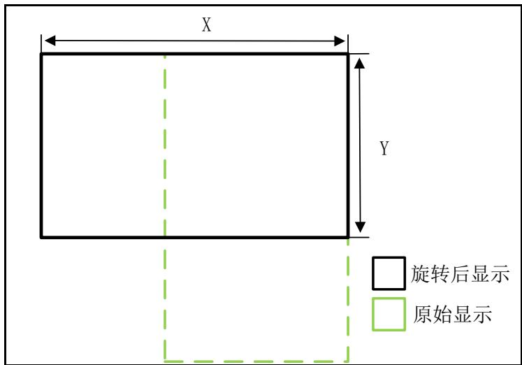  
图5.3.3.1X、Y轴调转

需要注意的是，纯软件实现屏幕旋转需要大量的内存开销，并且刷新效果会大打折扣。接下来，我们介绍屏幕旋转的配置步骤：

```javascript
/* 第一步：设置 sw Rotate 标志设置为 1 */
disp_drv.sw Rotate = 1;
```

/* 第二步：调用旋转函数，对屏幕方向进行旋转 */

```txt
lv_disp_setRotation lv_disp_get_default(), LV_disp_ROT_180);
```

用户可以在注册显示设备的时候进行屏幕旋转，旋转角度相关的枚举如下：

① LV_disp_ROT_NON: 无需旋转;  
② LV_DISP_ROT_90: 旋转 90 度;  
③ LV_DISP_ROT_180: 旋转 180 度;  
④ LV_DISP_ROT_270: 旋转 270 度;

# 5.3.4 显示接口 API 函数

LVGL官方提供了很多与显示接口相关API，如下表所示：

表 5.3.4.1 显示接口相关 API 函数  

<table><tr><td>函数</td><td>描述</td></tr><tr><td colspan="2">注册显示设备相关函数</td></tr><tr><td>lv_disp_drv_init()</td><td>初始化显示驱动</td></tr><tr><td>lv_dispdrawing_buf_init()</td><td>初始化显示缓冲区</td></tr><tr><td>lv_disp_drv_register()</td><td>注册一个显示驱动</td></tr><tr><td>lv_disp_drv_update()</td><td>在运行时更新驱动程序</td></tr><tr><td>lv_disp_remove()</td><td>移除显示器</td></tr><tr><td>lv_disp_set_default()</td><td>设置默认显示设备</td></tr><tr><td>lv_disp_get_default()</td><td>获取默认显示设备</td></tr><tr><td>lv_disp_get_hor_res()</td><td>获取显示器的水平分辨率</td></tr><tr><td>lv_disp_get_ver_res()</td><td>获取显示器的垂直分辨率</td></tr><tr><td>lv_disp_get_physical_hor_res()</td><td>获取显示器的物理水平分辨率</td></tr><tr><td>lv_disp_get_physical_ver_res()</td><td>获取显示器的物理垂直分辨率</td></tr><tr><td>lv_disp_get_offset_x()</td><td>获取物理显示的水平偏移</td></tr><tr><td>lv_disp_get_offset_y()</td><td>获取物理显示的垂直偏移</td></tr><tr><td>lv_disp_get_antialIASing()</td><td>获取是否启用了抗锯齿功能</td></tr><tr><td>lv_disp_get_dpi()</td><td>获取显示器的 DPI</td></tr><tr><td colspan="2">屏幕旋转 API 函数</td></tr><tr><td>lv_disp_setRotation()</td><td>设置旋转</td></tr><tr><td>lv_disp_getRotation()</td><td>获取当前旋转参数</td></tr><tr><td colspan="2">其他显示接口 API 函数</td></tr><tr><td>lv_disp_get_next()</td><td>获取下一个显示设备</td></tr><tr><td>lv_disp_get_draw_buf</td><td>获取显示器的内部缓冲区</td></tr></table>

接下来，我们介绍一些LVGL显示接口的常用函数：

# (1)lv_disp_drv_init函数

初始化显示驱动，其函数原型如下所示：

```txt
void lv_disp_drv_init lv_disp_drv_t *driver)
```

该函数的形参，如下表所示：

表 5.3.4.2 lv_disp_drv_init 函数形参描述  

<table><tr><td>参数</td><td>描述</td></tr><tr><td>driver</td><td>指向要初始化的驱动变量的指针</td></tr></table>

返回值：无。

# (2)lv_disp_draw_buf_init函数

初始化显示缓冲区，其函数原型如下所示：

```c
void lv_disp_draw_buf_init lv_disp_draw_buf_t * draw_buf, void *buf1, void *buf2, uint32_t size_in_px_cnt)
```

该函数的形参，如下表所示：

表 5.3.4.3 lv_disp_draw_buf_init 函数形参描述  

<table><tr><td>参数</td><td>描述</td></tr><tr><td>draw_buf</td><td>要初始化的指针变量</td></tr><tr><td>buf1</td><td>用来绘制图像的缓冲区。必须有，不能为 NULL</td></tr><tr><td>buf2</td><td>第二个缓冲区，可设置 NULL</td></tr><tr><td>size_in_px_cnt</td><td>buf1 和 buf2 像素大小</td></tr></table>

返回值：无。

# (3)lv_disp_drv_register函数

注册一个显示设备，其函数原型如下所示：

```python
lv_disp_t * lv_disp_drv_registerLv_disp_drv_t *driver)
```

该函数的形参，如下表所示：

表 5.3.4.4 lv_disp_drv register 函数形参描述  

<table><tr><td>参数</td><td>描述</td></tr><tr><td>driver</td><td>指向已初始化的“lv_disp_drv_t”变量的指针</td></tr></table>

返回值：成功时返回相应的指针，错误时为NULL。

# (4)lv_disp_remove函数

移除显示器，其函数原型如下所示：

```txt
void lv_disp_remove(lv_disp_t \*disp)
```

该函数的形参，如下表所示：

表 5.3.4.5 lv_disp_remove 函数形参描述  

<table><tr><td>参数</td><td>描述</td></tr><tr><td>disp</td><td>显示设备的指针</td></tr></table>

返回值：无。

# (5) lv_disp_get_default 函数

获取默认显示设备，其函数原型如下所示：

```txt
lv_disp_t \* lv_disp_get_default(void)
```

返回值：指向默认显示设备的指针。

# (6)lv_disp_setRotation函数

设置屏幕的旋转，其函数原型如下所示：

```python
void lv_disp_setRotation lv_disp_t * disp, lv_disp_rot_t rotation)
```

该函数的形参，如下表所示：

表 5.3.4.6 lv_disp_setRotation 函数形参描述  

<table><tr><td>参数</td><td>描述</td></tr><tr><td>disp</td><td>指向显示设备的指针（NULL 表示使用默认显示设备）</td></tr><tr><td>rotation</td><td>旋转角度</td></tr></table>

返回值：无。

# 5.4 输入设备

输入设备可以让用户和计算机系统之间进行信息交换，在LVGL中，支持的输入设备包括触摸屏、键盘、鼠标、编码器以及按钮，它们都是在lv_port_indev_template.c文件中进行配置的。我们需要成功地驱动自己的输入设备，就必须在LVGL中将其注册。

# 5.4.1 注册输入设备

这里我们结合源码来介绍LVGL输入设备的注册流程，源码如下所示（以触摸屏为例）：

```c
static lv_indev_drv_t indev_drv;   
touchpad_init(); /*第一步初始化用户触摸屏（用户层）*/ lv_indev_drv_init(&indev_drv); /*第二步初始化输入设备*/   
indev_drv.type  $=$  LV_INDEV_TYPE_POINTER; /*第三步配置输入设备类型*/ indev_drv.read_cb  $=$  touchpad_read; /*第四步设置输入设备读取回调函数*/   
/\*第五步在LVGL中注册驱动程序，并保存创建的输入设备对象\*/   
indev_touchpad  $\equiv$  lv_indev_drv_register(&indev_drv);
```

由上述源码可知，输入设备的注册流程一共有五个步骤，不同类型输入设备的配置方法有所区别，但注册的流程都是相同的。

# 5.4.2 输入设备相关 API

LVGL官方提供输入设备相关API，如下表所示：

表 5.4.2.1 输入设备相关 API 函数  

<table><tr><td>函数</td><td>描述</td></tr><tr><td>lv_indev_drv_init()</td><td>初始化输入设备</td></tr><tr><td>lv_indev_drv_register()</td><td>注册输入设备</td></tr><tr><td>lv_indev_drv_update()</td><td>在运行时更新驱动</td></tr><tr><td>lv_indev_delete()</td><td>移除输入设备</td></tr><tr><td>lv_indev_get_next()</td><td>获取下一个输入设备</td></tr><tr><td>lv_indev_read()</td><td>从输入设备读取数据</td></tr></table>

接下来，我们介绍LVGL输入设备的一些常用函数：

# (1) lv_indv_drv_init 函数

初始化输入设备，其函数原型如下所示：

```txt
void lv_indev_drv_init(struct _lv_indev_drv_t *driver)
```

该函数的形参，如下表所示：

表 5.4.2.2 lv_indev_drv_init 函数形参描述  

<table><tr><td>参数</td><td>描述</td></tr><tr><td>driver</td><td>指向要初始化的设备指针</td></tr></table>

返回值：无。

# (2)lv_indev_drv_register函数

注册输入设备，其函数原型如下所示：

```txt
lv_indev_t * lv_indev_drv_register (struct _lv_indev_drv_t *driver)
```

该函数的形参，如下表所示：

表 5.4.2.3 lv_indev_drv-register 函数形参描述  

<table><tr><td>参数</td><td>描述</td></tr><tr><td>driver</td><td>指向注册的设备指针</td></tr></table>

返回值：指向新输入设备的指针或NULL错误。

# (3)lv_indv_delete函数

移除输入设备，其函数原型如下所示：

```txt
void lv_indev_deleteLv_indev_t \* indev)
```

该函数的形参，如下表所示：

表 5.4.2.4 lv_indev_delete 函数形参描述  

<table><tr><td>参数</td><td>描述</td></tr><tr><td>indev</td><td>要删除的输入设备指针</td></tr></table>

返回值：无。

# (4) _lv_indev_read 函数

读取输入设备数据，其函数原型如下所示：

```c
void _lv_indev_read (lv_indev_t * indev, lv_indev_data_t *driver)
```

该函数的形参，如下表所示：

表 5.4.2.5 _lv_indev_read 函数形参描述  

<table><tr><td>参数</td><td>描述</td></tr><tr><td>indev</td><td>指向输入设备的指针</td></tr><tr><td>driver</td><td>指向驱动程序的指针</td></tr></table>

返回值：无。

# 5.5 LVGL 时基

在RTOS中，任务的切换需要依赖系统定时器，而LVGL同样也需要一个时基，这样它才可以知道动画以及任务所经过的时间。

关于LVGL的时基配置，请大家回顾第二、三章节。下面我们来讲解LVGL时钟相关的函数：

# (1)lv Tick get函数

该函数可以获取自启动以来经过的毫秒数，其原型如下所示：

```txt
uint32_t lv Tick_get(void)
```

返回值：经过的毫秒数。

# (2)lv Tick_elaps函数

该函数可以获取自上一个时间戳以来经过的毫秒数，其原型如下所示：

```txt
uint32_t lv Tick_elaps uint32_t prev Tick)
```

该函数具有一个参数，如下表所示：

表 5.5.1 lv Tick_elaps 函数描述  

<table><tr><td>参数</td><td>描述</td></tr><tr><td>prev Tick</td><td>上一个时间戳</td></tr></table>

返回值：经过的毫秒数。

# 5.6 LVGL 任务处理

LVGL的任务处理函数（lv_timerhandler）类似于RTOS切换任务的任务调度函数。lv_timerhandler函数对于定时的要求并不严格，一般来说，用户只需要确保在5毫秒以内调用

一次该函数即可，以保持系统响应的速度。值得注意的是，LVGL的任务处理并不是抢占式的，而是采用轮询的方式。

要处理LVGL的任务或者回调函数，用户只需要将lv_timerhandler函数定时调用即可，该函数可放在以下地方：

$①$  main函数的循环。  
② 定时器的中断（优先级需要低于lv Tick_inc）。  
③ 定时执行的OS任务。

# 5.7 拓展知识

# 1.LVGL睡眠模式

睡眠模式即低功耗模式。当没有触发信号时，我们可以让系统进入睡眠模式，以减少系统的功耗，具体的代码实现如下：

```c
while(1)   
{ /\*正常操作(无睡眠）<1秒不活动\*/ if(lv_disp_get_inactive_time(NULL)  $<  1000$  1 { lv_taskhandler(); }  $/^{\star}$  静止1秒后睡觉\*/ else { timer_stop();/\*停止调用lv Tick_inc()的定时器\*/ sleep();  $/^{\star}$  调用自己的MCU睡眠函数\*/ } delay_ms(5);   
}
```

注意：如果需要使用输入唤醒（按下、触摸等），应该在输入设备的读取中添加以下几行代码，如下所示：

```c
lv Tick_inc(LV_DISPDEF_REFR_PERIOD); /*强制唤醒任务执行*/ timer_start(); /*在调用lv Tick_inc()时重新启动计时器*/ lv_taskhandler(); /*手动调用'lv_taskhandler()'来处理唤醒事件*/
```

# 2. 操作系统

在默认情况下，LVGL不是线程安全的，其主要原因是：操作系统是抢占式的，而不同的任务之间，可能会发生资源的抢占，这将导致LVGL的运行出现异常，出现卡顿或者显示不全等问题。值得注意的是，在LVGL事件和定时器回调中部分，它们是安全的。

如果用户需要使用实际任务或线程，则需要一个互斥锁，以防止任务翻转，该互斥锁应在lv_timerhandler函数之前被调用，并在它之后释放，除此之外，用户在调用LVGL相关的函数和代码时，其相关的任务和线程中也需要使用相同的互斥锁。

以下是官方所提供的模板，源码如下：

```lisp
void lvgl_thread(void)  
{ while(1)
```

```txt
{
    xSemaphoreTake(MutexSemaphore, portMAX_DELAY);
    lv_task_handle();
    xSemaphoreGive(MutexSemaphore); /* 释放互斥信号量 */
    thread_sleep(10); /* sleep for 10 ms */
}
}
void other_thread(void)
{
    /* 使用LVGL api时，你必须始终持有互斥对象 */
    xSemaphoreTake(MutexSemaphore, portMAX_DELAY);
    lv_obj_t *img = lv_img_create(lv_scr_ACT());
    xSemaphoreGive(MutexSemaphore); /* 释放互斥信号量 */
    while(1)
    {
        xSemaphoreTake(MutexSemaphore, portMAX_DELAY);
        /* 切换到下一个图像 */
        lv_img_set_src(img, next_image);
        xSemaphoreGive(MutexSemaphore); /* 释放互斥信号量 */
        thread.Sleep(2000);
    }
}
```

# 3. 中断

用户应该尽量避免在中断里调用LVGL函数（lv Tick_inc和lv_disp Flush_ready函数除外），如果必须执行此操作，则需要在lv_timerhandler函数运行时，禁用相关的中断。

# 第六章 LVGL 基础知识

工欲善其事必先利其器，在我们学习LVGL使用之前，我们必须了解LVGL的基础知识，例如LVGL的样式管理、布局管理以及动画的制作等相关知识，本章节讲解的知识非常重要，对于后面的学习起到承上启下的作用，希望读者能认真学习本章节的内容。

本章节将分为以下几个小节：

6.1 LVGL控制流程  
6.2 LVGL对象介绍  
6.3 LVGL布局  
6.4 LVGL样式属性  
6.5LVGL滚动属性  
6.6 LVGL动画属性  
6.7LVGL定时器  
6.8 LVGL 事件

# 6.1 LVGL 控制流程

在学习LVGL基础知识之前，我们先了解一下LVGL和MCU之间的控制流程，这对于理解GUI界面与硬件之间的调度关系非常重要，其示意图如下：

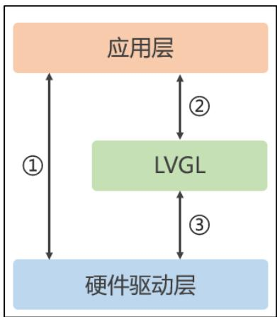  
图6.1.1LVGL和MCU的控制流程

在图6.1.1中，应用层包含了一些用户任务以及LVGL的GUI界面（仅仅是应用层的部分），而硬件驱动层则是涵盖了一些实际硬件设备（例如LED、蜂鸣器等）和输入输出设备的驱动程序。

由上图可知，在拥有LVGL的工程中，用户在调度硬件驱动层时，有两种方式：

方式一（上图①处）：直接在应用层中调度硬件（即使该工程有LVGL），此时的硬件层的反馈直接到达应用层，而不需要经过LVGL的处理。

方式二：在应用层中，先调度LVGL图形库（上图②处），然后LVGL图形库会根据应用层的操作，调度相应的硬件驱动。

这里举一个控制 LED 灯的例子来理解这两种方式的区别：当使用方式一时，用户直接在任务中调用开关 LED 的函数，即可执行相应的控制操作；当使用方式二时，用户需要在任务

中绘制 GUI 界面，然后通过相应的 GUI 部件（例如开关）去反馈操作，而 LVGL 在接收到部件的反馈之后，即可控制相应的 LED。

# 6.2 LVGL对象介绍

在LVGL中，用户界面的基本构建成分是对象，也称为小部件，例如：按钮、标签、图片、列表、图表、文本区域，等等。值得注意的是，LVGL图形库虽然是由C语言开发的，但其所采用的是一种面对对象编程思维，这就涉及到了“类”的概念。

在C语言中，并没有“类”的概念，而LVGL通过结构体的形式实现了“类”的功能（并非真的“类”），具体的实现逻辑如下图所示：

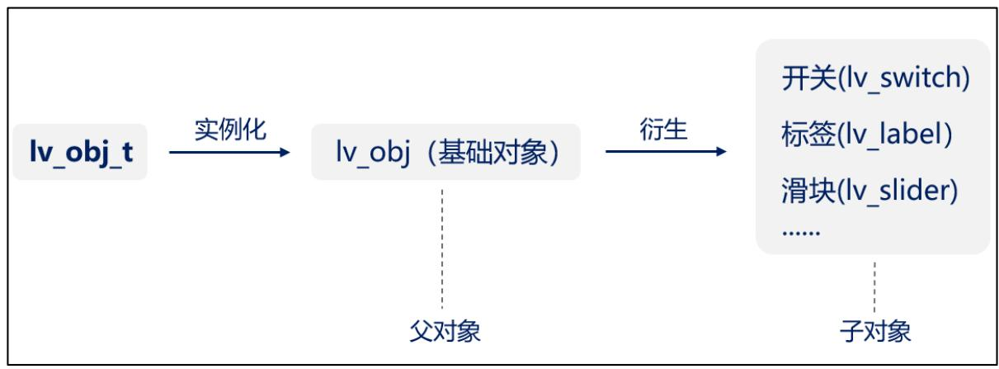  
图6.2.1LVGL实现“类”的逻辑

由上图可知，在LVGL中，首先定义了lv_obj_t这个结构体，然后通过这个结构体去实例化一个基础对象（lv_obj），这个基础对象将作为父对象，去衍生更多的子对象（其他部件）。

值得注意的是，通过这种“类”的方式去衍生其他部件，所衍生出来的部件将会继承父对象的一些基本属性，例如大小、位置、样式，等等，因此，我们可以通过一套统一的函数去管理不同部件的基本属性。

# 6.2.1 对象的基本属性

在 LVGL 中，每个对象都有一些相同的基本属性，例如：

① 大小  
$②$  父类  
(3) 样式  
④ 事件  
⑤ 位置

为了方便地设置基本属性，LVGL 设计了一套通用的属性设置函数，它们可以用于设置各个部件的基本属性，这里我们以部件的大小属性为例，来看一下函数的具体实现：

```txt
void lv_obj_set_size lv_obj_t * obj, lv_coord_t w, lv_coord_t h)
```

该函数的第一个入口参数（*obj）为某个需要设置属性的部件（例如开关、按钮等），第二、三个入口参数分别为部件的宽度和高度。除了该函数之外，还有很多设置基本属性的函数，它们都是lv_obj_set_xxx的格式，我们后面用到某一个属性设置的时候，再详细地介绍这些函数。

# 6.2.2 对象的私有属性

在对象衍生的过程中，不同的对象（部件）会拥有一些特殊的属性，也称为私有属性。例如，滑块具有以下私有属性：

① 当前值；  
② 范围值。

对于这些私有的属性，每种部件都有相应的 API 函数来进行设置，例如滑块的当前值和范围值设置，源码如下所示：

```c
/* 设置滑块的私有属性 */
lv_slider_set_range(slider1, 0, 100); /* 设置滑块的范围值 */
lv_slider_set_value(slider1, 40, LV_ANIM_ON); /* 设置滑块当前值 */
```

# 6.2.3 父对象与子对象的关系

父对象（下文称为父类）可以视为子对象（下文称为子类）的容器，当子类被创建出来之后，它是在父类里面的。注意：一个父类可以拥有多个子类，而子类就只有一个父类（屏幕除外）。

接下来，我们介绍父类和子类之间的关系：

(1) 父类移动, 则子类也会随着父类移动, 如下图所示:

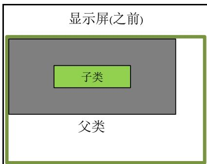  
图6.2.3.1子类随父类移动

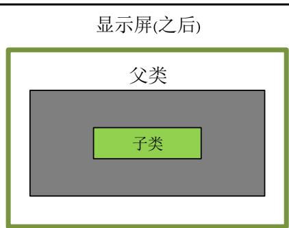

(2) 子类移动, 父类并不会随之移动, 如果子类移动的位置超出父类的范围, 则超过的部分默认不可见, 如下图所示:

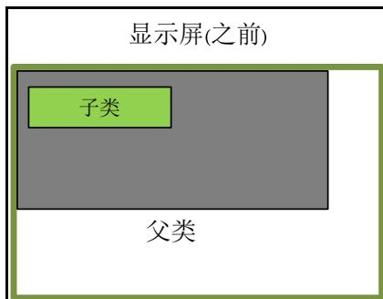  
图6.2.3.2子类超出父类的范围

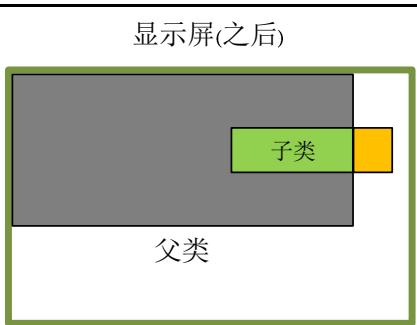

上图中，子类的黄色部分超出了父类的范围，这个部分将默认不可见。

(3) 子类在设置坐标位置时, 坐标原点在父类的左上角, 示意图如下所示:

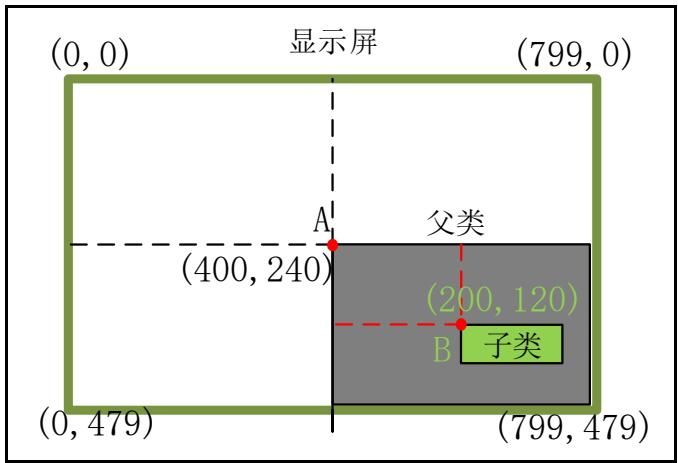  
图6.2.3.3 父类与子类的坐标定义

在上图的例子中，父类设置位置时，是以整个显示屏的坐标原点(0,0)为参考点的，而对于子类来说，其设置位置时，则是以父类的左上角坐标点为参考点，如上图中的点A(400,240)。

# 6.2.4 创建对象与删除对象

在LVGL中，用户可以在程序运行时动态创建或者删除一个对象。当对象被创建时，将消耗一定的内存，而当其被删除时，这部分内存将得到释放。

# 1.创建对象

LVGL每个对象的创建函数都很类似，它们具有高度统一的风格，源码如下所示：

```c
lv_obj_t * lv_<widget>__create lv_obj_t * parent);
```

在上述源码中，widget代表的是不同的部件，例如开关（switch）、按钮（btn）、图片（img），等等。一般情况下，创建对象的函数只有一个形参，那就是*parent，它指向父类，该父类可以是当前的活动屏幕（lv_scr_ACT）或者是其他的部件。

# 2.删除对象

用户需要删除一个对象，可使用以下几个函数：

① lv_obj_del(lv_obj_t * obj)，立即删除一个对象，并该对象的子类一起删除。  
② lv_obj_del_async lv_obj_t * obj), 下一次执行 lv_timerhandler 后删除对象。  
③ lv_obj Cleaner(lv_obj_t * obj): 立刻删除一个对象的全部子类。  
④ lv_obj_del_delayedLv_obj_t * obj, uint32_t delay_ms): 延时 delay_ms毫秒再删除对象。

# 6.2.5 LVGL屏幕

# (1) 创建屏幕：

在LVGL中，屏幕是没有父对象的特殊对象，要创建一个屏幕，可使用创建对象的方式：

```c
lv_obj_t \* scr1  $=$  lv_obj_create(NULL);
```

注意：在默认的情况下，LVGL初始化时，系统已经帮用户创建一个活动屏幕，不需要我们再次创建。

# (2) 获取当前活动的屏幕:

用户需要获取当前活动的屏幕，可以调用lv_scr_ACT函数，其将返回指向活动屏幕的指针。在部件的创建中，我们经常会获取当前活动的屏幕，将其作为父类。

# 6.2.6 LVGL图层

关于LVGL的图层，大家只需要搞清楚3个问题即可：

(1) 当用户创建两个对象, 而这两个对象的区域出现重叠时, 重叠的部分将如何绘制?  
(2) 两个对象出现重叠, 怎样把底下的对象移到上层?  
(3) LVGL 的图层有哪些?

接下来，我们围绕着这三个问题来讲解LVGL图层的知识。

# (1) 创建对象的顺序（第一个问题）

在LVGL中，旧的对象将会被绘制在背景上，而新的对象则是绘制在前景上，换而言之，如果对象之间出现重叠，则后面创建的对象会覆盖前面的，如下图所示：

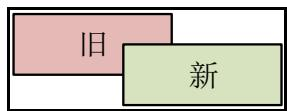  
图6.2.6.1 新对象覆盖旧对象

# (2) 前景和背景调节（第二个问题）

当部件之间出现重叠时，用户可以根据需求来修改覆盖的情况，而LVGL为此提供了3个相关的函数，具体如下所示：

① lv_obj_set_top 函数，设置该函数之后，当对象被点击时，其将置顶，它的工作原理类似于 PC 上的典型 GUI，当点击背景中的一个窗口时，它会自动来到前景。如下图所示：

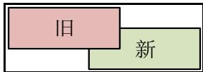  
图6.2.6.2旧对象切换到前景

② lv_obj_move_foreground 函数，直接将一个对象移动到前景。  
③ lv_obj_movebackground函数，将对象移动到背景。

# (3) LVGL 图层 (第三个问题)

在LVGL的工程中，一般拥有3个图层，它们分别为活动屏幕层（scr_ACT）、顶层（top）和系统层（sys），具体的图层结构如下图所示：

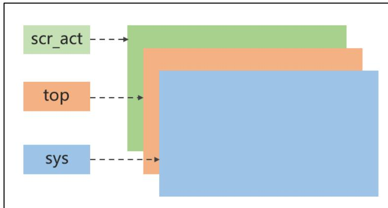  
图6.2.6.3LVGL图层结构

在上述的图层中，活动屏幕层（scr_ACT）位于最底下，在其之上是顶层（top），而最上面则是系统层（sys）。接下来，我们介绍各层的作用：

① 活动屏幕层（scr_ACT），用户可以在该层创建各种部件，例如开关、按钮、进度条，等等。  
(2) 顶层（top），用户可在该层创建一些部件，例如一个菜单栏，一个弹出窗口等。如果系统的单击属性是启用的，则该层将吸收所有用户单击，这就类似于强制的弹窗提示，则用户必须处理完弹窗消息之后，才可以继续操作其他的内容。

③ 系统层（sys），该层的内容总是可见的，例如鼠标的光标。

# 6.3 LVGL布局

LVGL的布局设计深受CSS启发，其主要内容涉及3个方面：坐标位置、大小以及对齐方式。

# 6.3.1 对象的坐标位置

在 LVGL 中，设置对象的坐标位置有两种方式，如下所示：

方式一：直接设置具体像素。

```txt
lv_obj_set_x(obj,10) /\*设置对象  $\mathbf{X}$  轴坐标\*/  
lv_obj_set_y(obj,10) /\*设置对象y轴坐标\*/  
lv_obj_set_pos(obj,10,10) /\*设置对象x,y轴坐标\*/
```

方式二：根据父类的区域大小，按百分比进行计算，用户可以使用lv_pct函数将值转换为百分比。

```c
lv_obj_set_x(obj, lv_pct(10)) /* 设置对象 x 轴坐标 */
lv_obj_set_y(obj, lv_pct(10)) /* 设置对象 y 轴坐标 */
lv_obj_set_pos(obj, lv_pct(10), lv_pct(10)) /* 设置对象 x, y 轴坐标 */
```

注意：当用户设置完对象位置之后，其值并不会立刻更新，如果此时获取对象的坐标，则获取回来的坐标值依旧是之前的。如果用户想让设置的坐标值立刻更新，可以调用lv_obj_update.layout函数，该函数会强制LVGL重新计算坐标，刷新所有对象的位置和大小信息。

# 6.3.2 对象的大小

在 LVGL 中，设置对象的大小有两种方式，如下所示：

方式一：直接设置具体像素。

```c
lv_obj_set_width(obj, 200); /* 设置对象的宽度*/  
lv_obj_set_height(obj, 100); /* 设置对象的高度*/  
lv_obj_set_size(obj, 200, 100); /* 设置对象的高度和宽度*/
```

方式二：根据父类的区域大小，按百分比进行计算，用户可以使用lv_pct函数将值转换为百分比。

```javascript
lv_obj_set_height(obj, lv_pct(100));/\*设置对象的高度为屏幕高度\*/
```

# 6.3.3 对象的对齐

对于一个成熟的GUI而言，一套易用、完善的对齐方式是非常重要的，因为在GUI界面设计中，往往会用到很多小部件，如果我们需要手动去调整部件的相对位置，那么开发效率将会变得非常低。

接下来，我们看一下LVGL的对齐模式，其内容非常丰富，如下表所示：

<table><tr><td>对齐模式</td><td>描述</td></tr><tr><td colspan="2">内部对齐</td></tr></table>

<table><tr><td>LVALIGN_TOP_LEFT</td><td>顶部左边对齐</td><td>obj</td></tr><tr><td>LVALIGN_TOP_MID</td><td>顶部中间对齐</td><td>obj</td></tr><tr><td>LVALIGN_TOP_RIGHT</td><td>顶部右边对齐</td><td>obj</td></tr><tr><td>LVALIGN BOTTOM_LEFT</td><td>底部左边对齐</td><td>obj</td></tr><tr><td>LVALIGN BOTTOM_MID</td><td>底部中间对齐</td><td>obj</td></tr><tr><td>LVALIGN BOTTOM_RIGHT</td><td>底部右边对齐</td><td>obj</td></tr><tr><td>LVALIGN LEFT_MID</td><td>左边中间对齐</td><td>obj</td></tr><tr><td>LVALIGN RIGHT_MID</td><td>右边中间对齐</td><td>obj</td></tr><tr><td>LV ALIGN CENTER</td><td>中间对齐</td><td>obj</td></tr><tr><td colspan="3">外部对齐(对齐的对象之间没有父子关系)
注意:下面示意图中,都是对象2围绕对象1对齐</td></tr></table>

表 6.3.3.1 LVGL 对齐模式  

<table><tr><td>LVALIGN_OUT_TOP_LEFT</td><td>在外顶部左边对齐</td><td>2 1</td></tr><tr><td>LVALIGN_OUT_TOP_MID</td><td>在外顶部中间对齐</td><td>2 1</td></tr><tr><td>LVALIGN_OUT_TOP_RIGHT</td><td>在外顶部右边对齐</td><td>2 1</td></tr><tr><td>LVALIGN_OUT BOTTOM_LEFT</td><td>在外底部左边对齐</td><td>1 2</td></tr><tr><td>LVALIGN_OUT BOTTOM_MID</td><td>在外底部中间对齐</td><td>1 2</td></tr><tr><td>LVALIGN_OUT BOTTOM_RIGHT</td><td>在外底部右边对齐</td><td>1 2</td></tr><tr><td>LVALIGN_OUT_LEFT_MID</td><td>在外左边中间对齐</td><td>2 1</td></tr><tr><td>LVALIGN_OUT_RIGHT_MID</td><td>在外右边中间对齐</td><td>1 2</td></tr></table>

在LVGL中，常用于设置对齐方式的函数有3个：

# (1)lv_obj_center函数

根据父对象的位置，居中对齐，其函数原型如下所示：

```txt
void lv_obj_center(struct _lv_obj_t * obj)
```

# (2)lv_obj_align函数

根据父对象的位置进行对齐，该函数的第二个形参为对齐的模式，第三、四个形参分别为对齐后  $x$  、y 轴的偏移量（以像素为单位），其函数原型如下所示：

```c
void lv_obj_align(struct _lv_obj_t * obj, /* 要对齐的对象 */
```

```c
lv_align_t align, /*要对齐的模式*/  
lv_coord_t x_ofs, /*要对齐后向x轴偏移量*/  
lv_coord_t y_ofs); /*要对齐后向y轴偏移量*/
```

# (3)lv_obj_align_to函数

根据另一个对象（无父子关系）的位置进行对齐，其函数原型如下所示：

```c
void lv_obj_align_to(struct lv_obj_t * obj, /* 要对齐的对象 */
const struct lv_obj_t * base, /* 向谁对齐 */
lv_align_t align, /* 要对齐的模式 */
lv_coord_t x_ofs, /* 要对齐后向x轴偏移量 */
lv_coord_t y_ofs); /* 要对齐后向y轴偏移量 */
```

# 6.4 LVGL样式属性

样式即对象的外观，而LVGL的样式设置深受CSS的启发，其特点如下：

① LVGL 样式的设置都是使用 lv_style_t 变量，它可以保存对象的边框宽度、文本颜色、阴影颜色等属性。  
(2) 在设置对象的样式时, 可以指定在某个部分和状态下才生效。例如: 用户给一个按钮设置样式时, 可以指定按钮被按下时 (指定状态), 其背景颜色为红色, 而在默认状态下, 其背景为蓝色。  
(3) 任何数量的对象都可以使用相同的样式。  
④ 样式可以级联，这意味着用户可以将多个样式分配给同一个对象，并且每个样式可以具有不同的属性。  
(5) 样式具有优先级。如果两个函数同时设置某个属性, 则最后调用的函数生效。  
(6) 如果对象未指定某些样式属性（例如文本颜色），其可以从父对象继承。  
(7) 对象样式设置的方法分为两种: 普通样式和本地样式。注意: 本地样式比普通样式的优先级更高, 所以 LVGL 会优先执行本地样式。

# 6.4.1 LVGL样式设置方法

在LVGL中，设置样式属性的方法有两个：

# 1. 普通样式设置

普通样式设置的最明显特点是：共用。它就类似于一个共用的样式套装，用户可以往里面添加所需要修改的样式内容（例如背景颜色、文本颜色等），当我们将这个样式套装应用到某个部件时，其所包含的样式内容将会被全部应用到该部件中。如果用户界面中有很多样式相同的部分，则建议使用此方法，这可以使样式设置变得非常高效。

接下来，我们介绍普通样式的具体设置流程，如下源码所示：

```c
static lv_style_t style_btn; /* 定义样式变量 */
lv_style_init(&style_btn); /* 初始化样式 */
lv_style_set_bg_color(&style_btn, lv_color(hex(0x115588)); /* 设置背景 */
lv_style_set_bg_opa(&style_btn, LV_OPA_50); /* 设置背景透明度 */
lv_style_set_border_width(&style_btn, 2); /* 设置边框的宽度 */
lv_style_set_border_color(&style_btn, lv_color/black()); /* 设置边框的大小 */
lv_obj_t * obj1 = lv_obj_create(obj1, & style_btn, LV_STATE_DEFAULT); /* 创建一个对象 */
lv_obj_add_style(obj1, & style_btn, LV_STATE_DEFAULT); /* 添加对象1的样式 */
```

```c
lv_obj_t \* obj2  $=$  lv_obj_create(lv_scr_act()); /\*创建一个对象\*/lv_obj_add_style(obj2，&style_btn，LV_STATE_DEFAULT); /\*添加对象2的样式\*/
```

由上述源码可知，在设置普通样式时，用户需要先调用lv_style_t结构体，定义样式变量（如上述代码中的stylebtn），然后初始化样式以及设置各种样式属性，最后即可为目标对象添加样式。注意：如果其他对象需要使用已定义的样式变量（例如上述代码中的stylebtn）对应的样式，则直接调用即可。

# 2. 本地样式设置

本地样式的特点是：设置简单，针对性强。当用户界面的对象样式有较大差异时，可以使用本地样式进行单独的设置，本地样式的具体设置流程如下：

```c
/\*创建一个对象\*/  
lv_obj_t \* obj  $=$  lv_obj_create(lv_scr_act());  
/\*设置对象背景颜色\*/  
lv_obj_set_style_bg_color(obj，lv_color_red(),LV_STATE_DEFAULT);
```

由上述源码可知，本地样式的设置非常简单，只需要直接将样式设置到某个部件上即可，注意：在上述的lv_obj_set_style bg_color函数中，第三个形参代表“状态及组成部分选择器”，用户可以在此指定所设置的样式应用到哪一个组成部分，同时也可选择该样式在什么状态下生效。接下来，我们将详细介绍部件的组成部分以及状态，这对于正确地设置样式非常重要。

# 6.4.2 部件组成部分

当我们绘制一个圆角矩阵时，可将其分解为两个部分，例如直线部分和圆弧部分，这样即可组成为圆角矩阵，如下图所示：

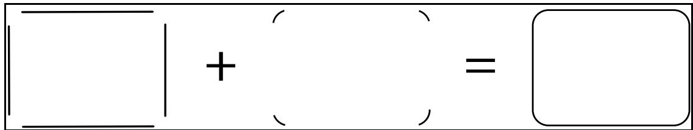  
图6.4.2.1 圆角矩形绘制示意图

在LVGL中，也利用了上述的原理，将一个复杂的部件分解成多个组成部分，这样我们即可单独地设置某个组成部分的样式。注意：如果用户想设置某个组成部分的样式，则需要在设置样式时选择该组成部分的对应枚举。各个组成部分对应的枚举如下表所示：

表 6.4.2.1 部件组成部分描述  

<table><tr><td>部件组成部分</td><td>描述</td></tr><tr><td>LV_PART_MAIN</td><td>主体，它是一个类似矩形的背景</td></tr><tr><td>LV_PART_SCROLLBAR</td><td>滚动条</td></tr><tr><td>LV_PART_INDICATOR</td><td>指示器</td></tr><tr><td>LV_PART_KNOB</td><td>旋转纽</td></tr><tr><td>LV_PART_SELECTD</td><td>选择框</td></tr><tr><td>LV_PART_items</td><td>相同的成分（例如表格里面的单元格）</td></tr><tr><td>LV_PART_TICKS</td><td>刻度</td></tr><tr><td>LV_PART CURSOR</td><td>光标</td></tr></table>

接下来，我们结合上表，以进度条部件（Slider）为例，分析它的组成部分，如下图所示：

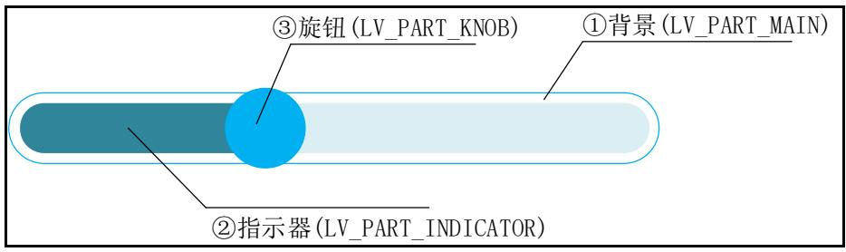  
图6.4.2.2 进度条部件的组成部分

① 主体背景（LV_PART_MAIN）；  
② 指示器（LV_PART_INDICATOR）；  
③ 旋钮（LV_PART_KNOB）。

由上图可知，进度条部件分为三个组成部分，所以我们在设置其样式时，直接指定某个组成部分，即可设置该部分的样式，示例源码如下：

```c
/\*创建一个对象\*/  
lv_obj_t \*slider  $=$  lv_slider_create(lv_scr_act());  
/\*设置指示器的背景颜色\*/  
lv_obj_set_style bg_color(slider，lv_color(hex(0xff0000)，LV_PART_INDICATOR);
```

# 6.4.3部件的状态

在LVGL中，所有的部件状态如下表所示：

表 6.4.3.1 对象的状态  

<table><tr><td>状态</td><td>描述</td></tr><tr><td>LV_STATE_DEFAULT</td><td>正常状态</td></tr><tr><td>LV_STATE_CHECKED</td><td>切换或选中</td></tr><tr><td>LV_STATE_FOCUSED</td><td>通过键盘/编码器聚焦、通过触摸板/鼠标单击</td></tr><tr><td>LV_STATEOCUS_KEY</td><td>通过键盘/编码器聚焦</td></tr><tr><td>LV_STATE Edited</td><td>由编码器编辑</td></tr><tr><td>LV_STATElongleftrightarrow</td><td>已按下</td></tr><tr><td>LV_STATE_SCROLLED</td><td>滚动状态</td></tr><tr><td>LV_STATE DISABLED</td><td>禁用状态</td></tr></table>

上表中，部件状态相关的枚举较少且不难理解，我们一般在两种情况下会用到状态枚举：

# 1.添加、清除部件状态

当用户需要添加或者清除部件的某个状态时，可以调用对应的函数，如下源码所示：

```txt
/* 添加/清除选中状态 */
lv_obj_add/clear_state(obj, part, LV_STATE_CHECKED);
```

# 2.设置部件样式

当用户设置部件样式时，可以指定该样式在哪一个状态下才生效，如下源码所示：

```c
/\*创建一个对象\*/  
lv_obj_t \*btn  $=$  lv_bbox_create(lv_scr_ACT());  
/\*设置按钮的背景颜色，按下时才生效\*/  
lv_obj_set_style_bg_color(btn，lv_color(hex(0xff0000)，LV_STATElongleftrightarrow);
```

# 6.4.4 LVGL样式属性

# 6.4.4.1 大小与位置属性

该样式属性与对象的宽度、高度、位置、对齐方式和布局相关。

注意：样式属性的设置函数都是lv_obj_set_style_xxx（本地样式）或者lv_style_set_xxx（普通样式）的格式，因此，我们在设置某个样式的时候，只需要记住关键的单词即可，例如宽度（width）设置的函数为：lv_obj_set_style_width（以本地样式为例）。

# 1.(width)宽度：

用户可以按像素单位、百分比或者 LV_SIZE_CONTENT（自适应）的方式设置宽度，注意：使用百分比设置宽度时，是以父类的大小作为参考。宽度设置的示例如下：

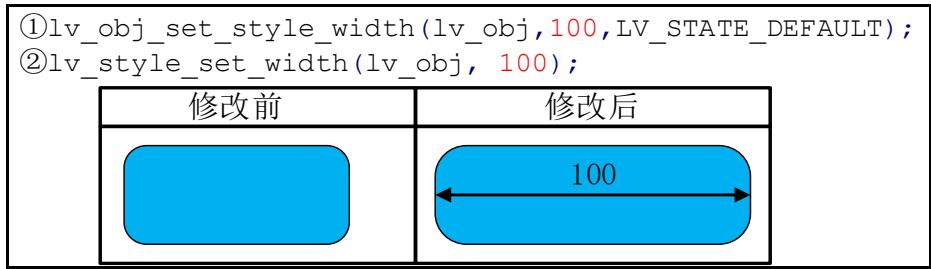  
图6.4.1.1设置宽度属性

# 2.(min_width)最小宽度：

以像素或百分比为单位。

注意：当对象设置最小宽度后，如果用户重新设置对象的宽度，且该宽度小于最小宽度时，将不会成功。

# 3. (max_width)最大宽度：

以像素或百分比为单位。

注意：当对象设置最大宽度后，如果用户重新设置对象的宽度，且该宽度大于最大宽度时，将不会成功。

# 4.(height)高度：

用户可以按像素单位、百分比或者 LV_SIZE_CONTENT（自适应）的方式设置高度，注意：使用百分比设置高度时，是以父类的大小作为参考。高度设置的示例如下：

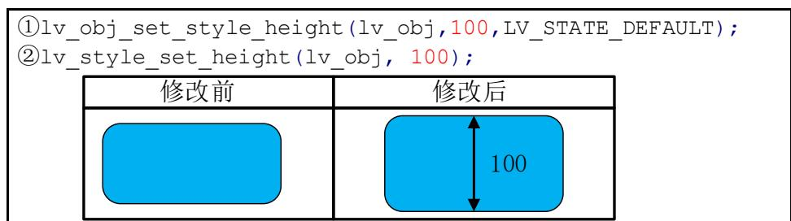  
图6.4.1.2设置高度属性

# 5. (min_height) 最小高度:

以像素或百分比为单位。

注意：当对象设置最小高度后，如果用户重新设置对象的高度，且该高度小于最小高度时，将不会成功。

# 6. (max_height) 最大高度:

以像素或百分比为单位。

注意：当对象设置最大高度后，如果用户重新设置对象的高度，且该高度大于最大高度时，将不会成功。

# 7. X坐标属性：

设置对象的X轴位置（以父类为参考），以像素或百分比为单位，X轴坐标设置的示例如下：

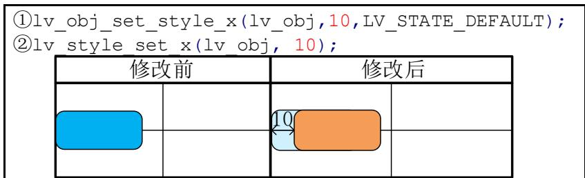  
图6.4.4.1.3设置X坐标

# 8. Y坐标属性：

设置对象的Y轴位置（以父类为参考），以像素或百分比为单位，Y轴坐标设置的示例如下：

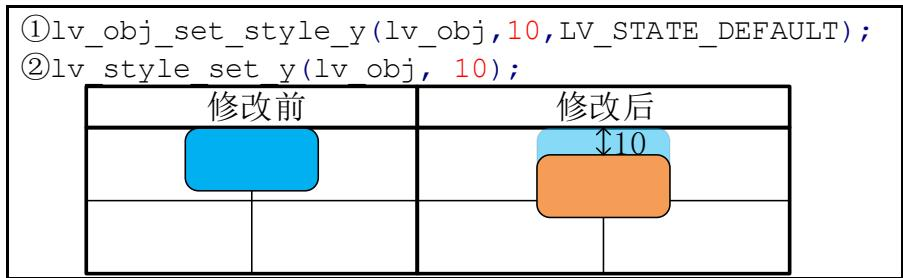  
图6.4.4.1.4设置Y坐标

# 9.(Align)对齐属性：

设置对象的对齐属性，示例如下（居中对齐）：

```csv
①lv_obj_set_style_align(lv_obj,LVALIGN_CENTER,LV_STATE_DEFAULT);  
②lv_style_set_alignLv_obj，LVALIGNCENTER)；
```

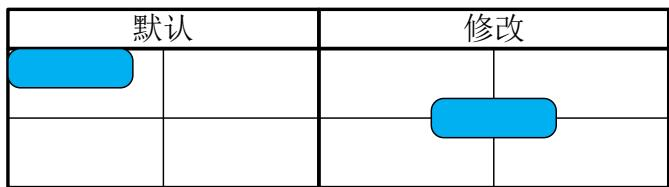  
图6.4.1.5设置对齐属性

对齐的模式如下所示：

LVALIGN_DEFAULT。  
LV ALIGN_TOP_LEFT/MID/RIGHT  
LV ALIGN BOTTOM LEFT/MID/RIGHT.  
LVALIGN_LEFT/RIGHT_MID。  
LV ALIGN Center

# 10. (transform_width) 变换宽度属性:

使对象的两边变宽，以像素或百分比为单位，示例如下：

①lv_obj_set_style_transform_width lv_obj,100,LV_STATElongleftrightarrow);  
②lv_style_set_transform_width (lv_obj，100);

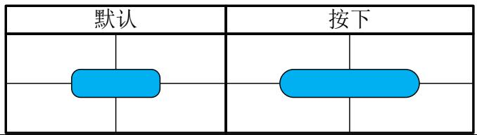  
图6.4.1.6设置转变宽度属性

# 11.(transform_height)变换高度属性：

使对象的两边变高，以像素或百分比为单位，示例如下：

①lv_obj_set_style_transform_height lv_obj,100,LV_STATElongleftrightarrow);  
②lv_style_set_transform_height lv_obj,100);

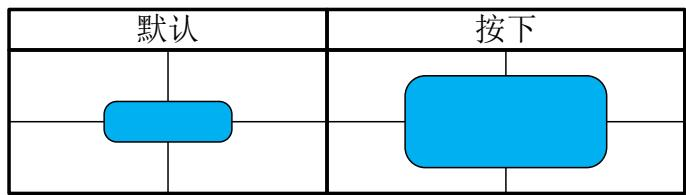  
图6.4.1.7设置转变高度属性

# 12. (translate_x) X 轴坐标偏移属性:

往X轴方向偏移，以像素或百分比为单位，示例如下：

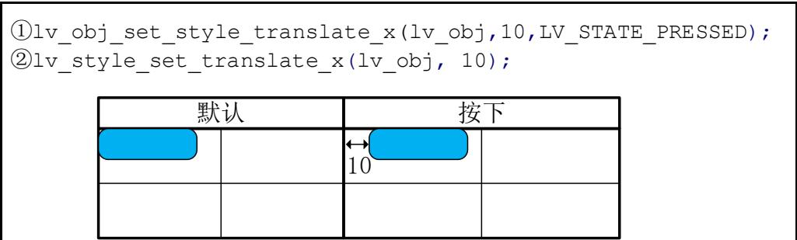  
图6.4.4.1.8设置转变X坐标属性

# 13. (translate_y) Y 轴坐标偏移属性:

往Y轴方向偏移，以像素或百分比为单位，示例如下：

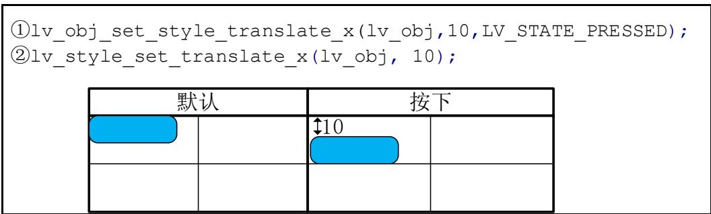  
图6.4.4.1.9设置转变Y坐标属性

# 14. (transform_Zoom)缩放属性：

用户可以调整图像的缩放，如果缩放值为256，则表示图像不缩放；如果缩放值为128，则表示图像大小为原来的  $1 / 2$  ；如果缩放值为512，则表示图像放大一倍，示例如下：

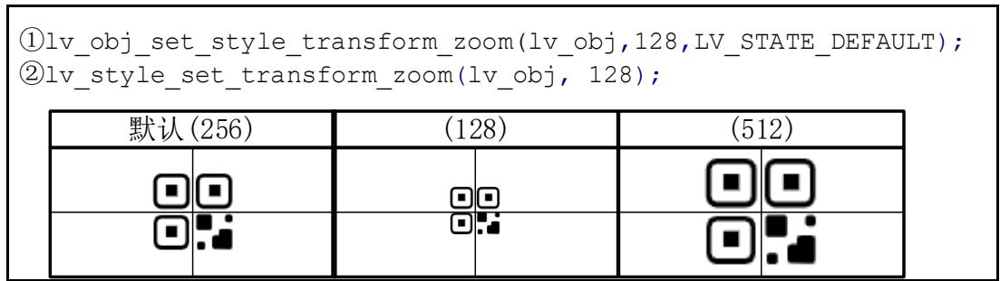  
图6.4.4.1.10设置缩放

# 15. (transform_angle) 旋转属性:

用户可以设置图像旋转角度。注意：旋转角度  $=$  旋转值/10，例如：我们需要设置图像旋转为45度，则需要在函数中设置旋转值为450，示例如下：

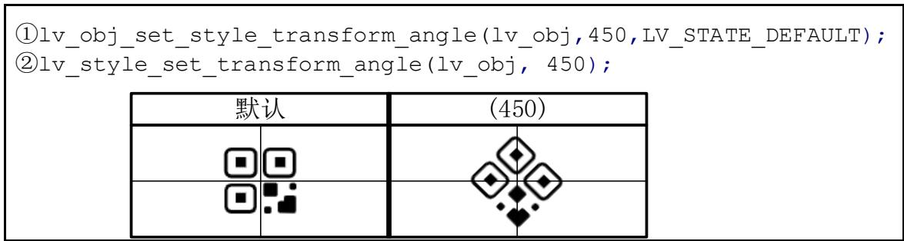  
图6.4.4.1.11设置旋转属性

# 6.4.4.2 填充属性

当部件之间存在父子关系时，用户可以在父对象和子对象之间设置填充，以改变子对象的布局，填充的方向如下图所示：

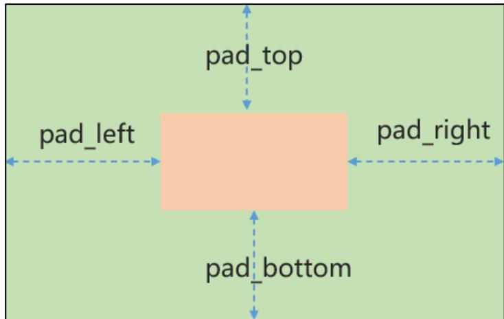  
图6.4.2.1填充的方向

# 1.(pad_top)顶部填充属性：

当用户在父对象的顶部进行填充，子对象会向下偏移（相对父对象），示例如下：

①lv_obj_set_style_pad_top lv_obj,20,LV_STATE_DEFAULT);  
②lv_style_set_pad_top lv_obj,20);

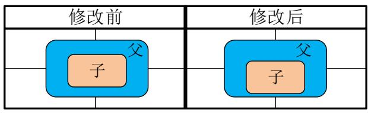  
图6.4.4.2.2顶部填充

# 2.(pad_bottom)底部填充属性：

当用户在父对象的底部进行填充，子对象会向上偏移（相对父对象），示例如下：

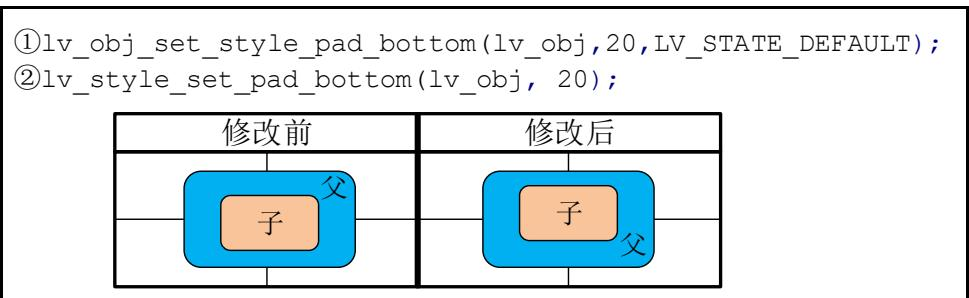  
图6.4.4.2.3底部填充

# 3. (pad_left)左侧填充属性：

当用户在父对象的左侧进行填充，子对象会向右偏移（相对父对象），示例如下：

①lv_obj_set_style_pad_left lv_obj,20,LV_STATE_DEFAULT); ②lv_style_set_pad_left lv_obj,20);

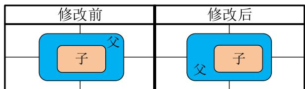  
图6.4.4.2.4 左侧填充

# 4.(pad_right)右边填充属性：

当用户在父对象的右侧进行填充，子对象会向左偏移（相对父对象），示例如下：

①lv_obj_set_style_pad_right(lv_obj,20,LV_STATE_DEFAULT);  
②lv_style_set_pad_right(lv_obj，20);

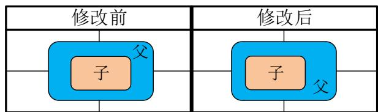  
图6.4.4.2.5右侧填充

# 5. (pad_row)行之间填充属性：

行之间的填充，由布局使用。

# 5. (pad_column)列之间填充属性：

列之间的填充，由布局使用。

# 6.4.4.3 背景属性

# 1.(bg_color)背景颜色：

设置对象的背景颜色，示例如下：

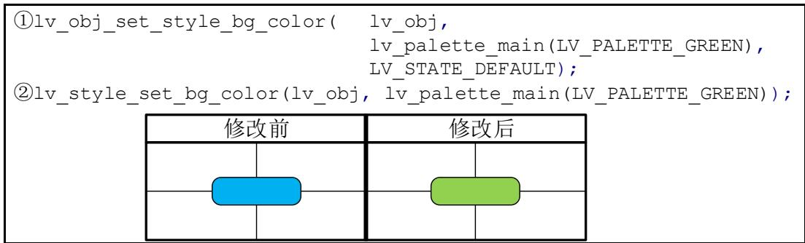  
图6.4.3.1设置背景属性

# 2. (bg_opa)背景透明属性：

设置背景的透明度，如果它的值为0、LV_OPA_0或LV_OPA_TRANSP，则表示背景完全透明；如果值为255、LV_OPA_100或LV_OPA_COVER，则表示图像完全不透明；用户可以根据需求，在0~255之间设置透明度的值，示例如下：

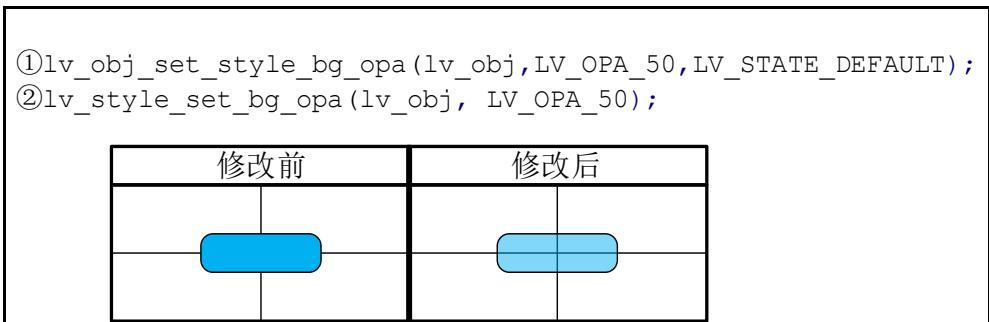  
图6.4.3.2 设置背景透明属性

# 3.(bg_grad_color)背景颜色渐变属性：

设置背景的渐变颜色。值得注意的是，当grad_dir属性设置为LV_GRAD_DIR_NONE时，渐变不会生效。背景颜色渐变示例如下：

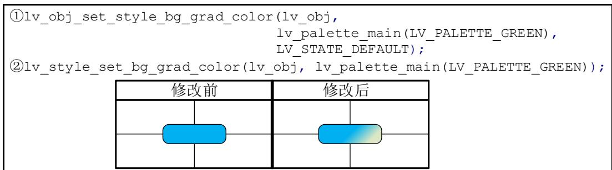  
图6.4.3.3 设置背景颜色渐变

# 4.(bg_grad_dir)背景渐变方向属性：

设置背景的渐变方向，可选方向值为LV_GRAD_DIR_NONE/HOR/VER。

# 5. (bg_grad_stop) 背景渐变起点属性:

设置背景渐变颜色的起始点，如果渐变起始点为0，则表示渐变是从顶部/左侧开始；如果渐变起始点为255，则表示渐变是从底部/右侧开始；如果渐变起始点为128，则表示渐变是从中心开始，示例如下：

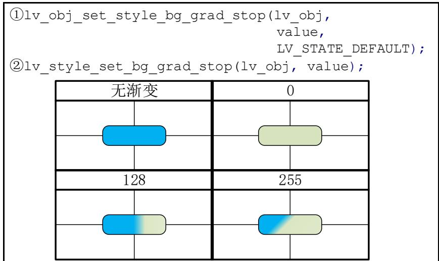  
图6.4.4.3.4设置背景颜色渐变起点

# 6.(bg_img_src)背景图片源属性：

设置背景图像源，该图像源可从lv_img_dsc_t的指针（C语言数组）、文件路径（例如外部SD卡）或内部的字体图标中获取，示例如下：

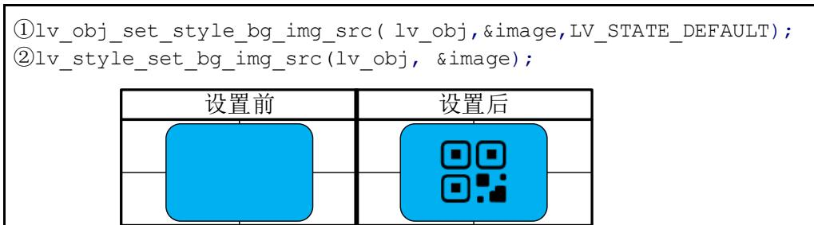  
图6.4.3.5设置背景图片源

# 7. (bg_img_opa)背景图片透明度属性：

设置背景图像的透明度，如果它的值为0、LV_OPA_0或LV_OPA_TRANSP，则表示背景图像完全透明；如果值为255、LV_OPA_100或LV_OPA_COVER，则表示背景图像完全不透明；用户可以根据需求，在0~255之间设置透明度的值，示例如下：

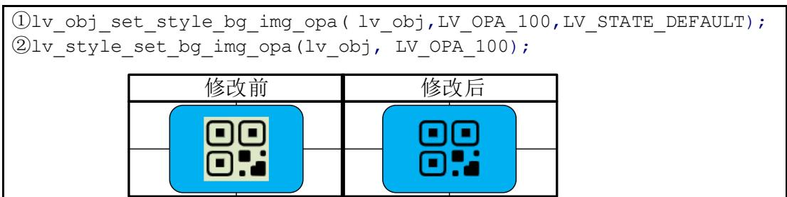  
图6.4.4.3.6设置背景图片透明度

# 8.(bg_img_recolor)背景图片重新着色属性：

用户可以设置一个颜色，将其混合到背景图像，这样可以使图像重新着色，相关的设置函数为lv_obj_set_style bg_img_recolor。值得注意的是，仅设置背景图片的重新着色，我们将看不到任何效果，因为在默认的情况下，重新着色的透明度为0，也就是完全透明的。

# 9. (bg_img_recolor_opa) 背景图片重新着色透明度属性：

设置背景图像重着色的强度，如果透明度值为0、LV_OPA_0和LV_OPA_TRANSP，则表示不混合颜色；如果透明度值为255、LV_OPA_100和LV_OPA_COVER，则表示背景图像完全重新着色。

# 10. (bg_img_tiled)背景图片平铺属性：

如果该属性启用，背景图像将被平铺，示例如下：

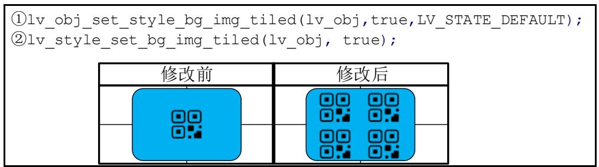  
图6.4.3.7设置背景图片平铺

# 6.4.4.4 边框属性

对象的边框处于主体之外，具体的示意图如下：

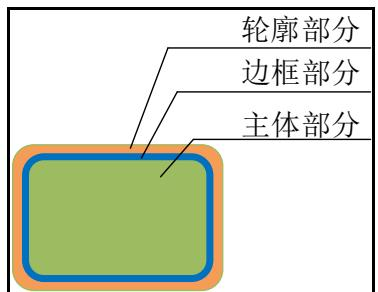  
图6.4.4.1边框的位置

# 1.(border_color)边框颜色：

设置边框的颜色属性，示例如下：

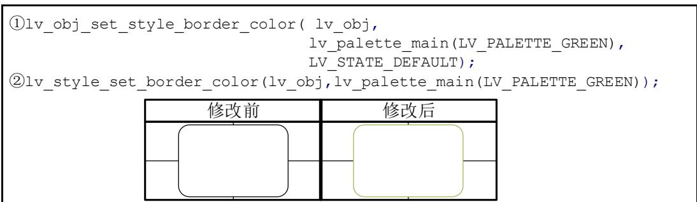  
图6.4.4.2设置边框颜色

# 2. (border_opa)边框透明度：

设置边框的透明度，如果透明度值为0、LV_OPA_0或LV_OPA_TRANSP，则表示对象边框完全透明；如果透明度值为255、LV_OPA_100或LV_OPA_COVER，则表示对象边框为不透明，用户可以根据需求，在0~255之间设置透明度的值，示例如下：

①lv_obj_set_style_border_opa(lv_obj,LV_OPA_20,LV_STATE_DEFAULT);  
②lv_style_set_border_opa lv_obj, LV_OPA_20);

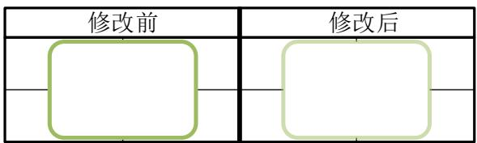  
图6.4.4.3设置边框透明度

# 3. (border_width)边框宽度：

设置边框的宽度，值得注意的是，该属性的单位只能是像素，示例如下：

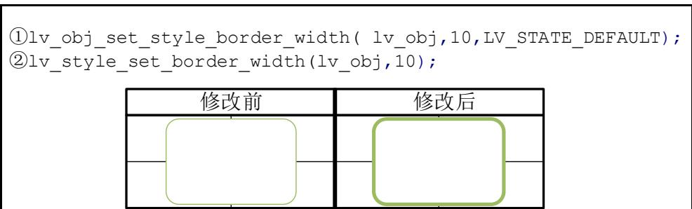  
图6.4.4.4设置边框宽度

# 4. (border_side) 仅描绘一侧边框:

用户可以仅描绘对象的某个边框，示例如下：

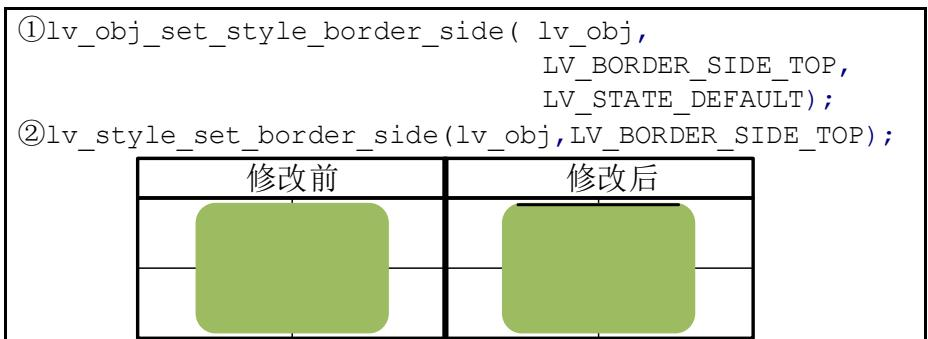  
图6.4.4.5设置边框描绘位置

边框的可选位置为：

① LV BORDER_SIDE_NONE。  
② LV BORDER_SIDE_TOP。  
③ LV BORDER_SIDE_bottom。  
④ LV BORDER_SIDE_LEFT。  
⑥ LV BORDER_SIDE_RIGHT。  
⑦ LV BORDER_SIDE_INTERNAL。

# 6.4.4.5 轮廓属性

对象的轮廓处于边框之外，具体的示意图如下：

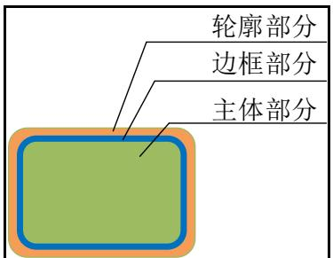  
图6.4.5.1轮廓的位置

# 1.(outline_width)轮廓宽度属性：

用户可以以像素为单位设置轮廓宽度，示例如下：

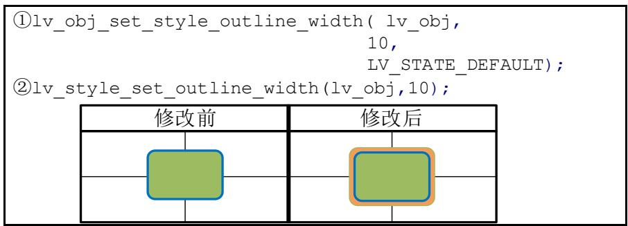  
图6.4.5.2 设置轮廓宽度

# 2.(outline_color)轮廓颜色属性：

设置轮廓的颜色，示例如下：

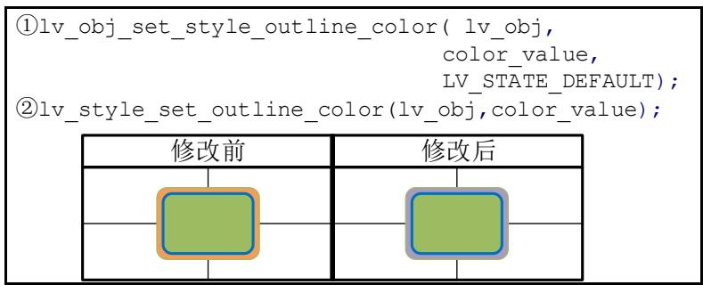  
图6.4.5.3 设置轮廓颜色

# 3.(outline_opa)轮廓透明度属性：

设置轮廓的透明度，如果透明度值为0、LV_OPA_0或LV_OPA_TRANSP，则表示对象轮廓完全透明；如果透明度值为255、LV_OPA_100或LV_OPA_COVER，则表示对象轮廓为不透明，用户可以根据需求，在0~255之间设置透明度的值，示例如下：

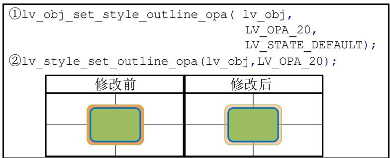  
图6.4.4.5.4设置轮廓透明度

# 4.(outline_pad)轮廓间隙属性：

设置轮廓线的填充，即对象主体和轮廓线之间的间隙，示例如下：

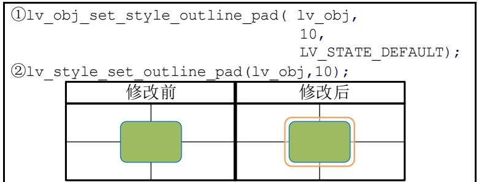  
图6.4.4.5.5设置轮廓间隙

# 6.4.4.6 阴影属性

对象的阴影处于轮廓之外，具体的示意图如下：

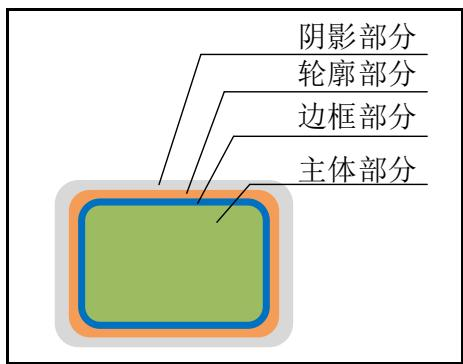  
图6.4.4.6.1阴影的位置

# 1.(shadow_width)阴影宽度属性：

用户可以以像素为单位设置阴影的宽度，示例如下：

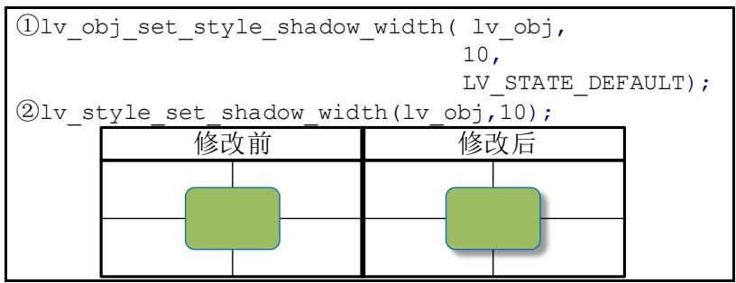  
图6.4.6.2设置阴影宽度

# 2.(shadow_ofs_x)阴影偏移（X轴方向）属性：

设置阴影在X轴方向上的像素偏移量，示例如下：

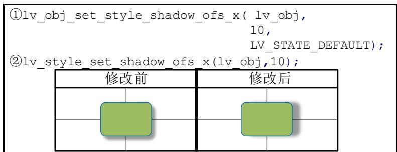

# 3.(shadow_ofs_y)阴影偏移（Y轴方向）属性：

设置阴影在Y轴方向上的像素偏移量，示例如下：

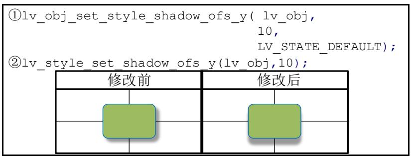  
图6.4.4.6.4设置阴影Y轴方向偏移  
图6.3.4.6.3设置阴影X轴方向偏移

# 4.(shadow_color)阴影颜色属性：

设置阴影的颜色，示例如下：

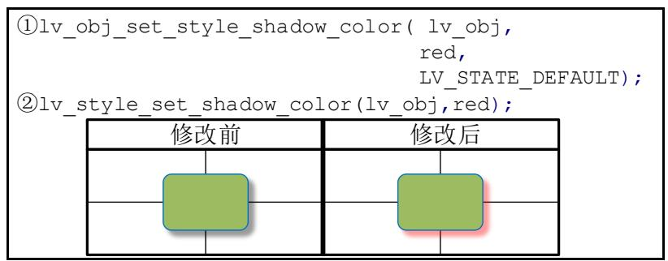  
图6.4.6.6设置阴影颜色

# 5. (shadow_opa) 阴影透明度属性：

设置阴影的透明度，如果透明度值为0、LV_OPA_0或LV_OPA_TRANSP，则表示对象阴影完全透明；如果透明度值为255、LV_OPA_100或LV_OPA_COVER，则表示对象阴影为不透明，用户可以根据需求，在0~255之间设置透明度的值，示例如下：

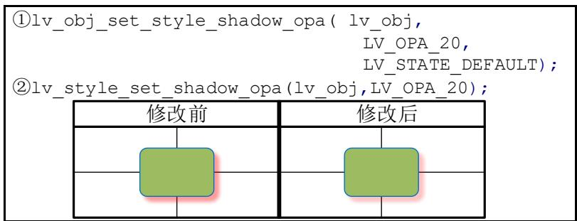  
图6.4.6.7设置阴影透明度

# 6.4.4.7 图片属性

注意：仅图片相关的部件内容适用该属性。

# 1.(img_opa)图片透明度属性：

设置图片的透明度，如果透明度值为0、LV_OPA_0或LV_OPA_TRANSP，则表示图片完全透明；如果透明度值为255、LV_OPA_100或LV_OPA_COVER，则表示图片为不透明，用户可以根据需求，在0~255之间设置透明度的值，示例如下：

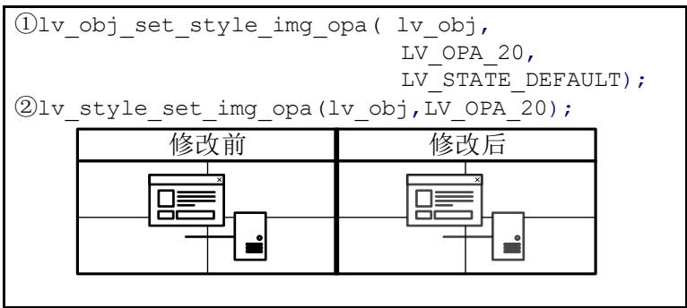  
图6.4.4.7.1设置图片透明度

# 2.(img_recolor)图片重新着色属性：

用户可以设置一个颜色，将其混合到图片，这样可以使图片重新着色，相关的设置函数为lv_obj_set_style_img_recolor。值得注意的是，仅设置图片的重新着色，我们将看不到任何效果，因为在默认的情况下，重新着色的透明度为0，也就是完全透明的。

# 3. (img_recolor_opa)图片重新着色透明度属性：

设置图片重着色的强度，如果透明度值为0、LV_OPA_0和LV_OPA_TRANSP，则表示不混合颜色；如果透明度值为255、LV_OPA_100和LV_OPA_COVER，则表示图片完全重新着色。

# 6.4.4.8线条属性

注意：仅线条相关的部件或组成部分适用该属性。

# 1. (line_width)线的宽度属性：

用户可以以像素为单位，设置线条的宽度，示例如下：

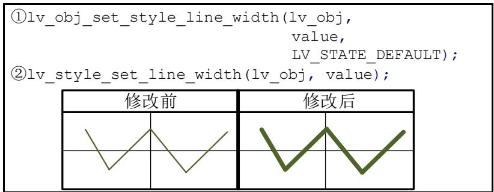  
图6.4.4.8.1设置线的宽度

# 2. (line Rounded) 线条的端点属性:

用户可以设置线条的端点形状，在相关的设置函数中，如果传入的参数为True，则线条的端点为圆角；如果传入的参数为false，则线条的端点为垂线，示例如下：

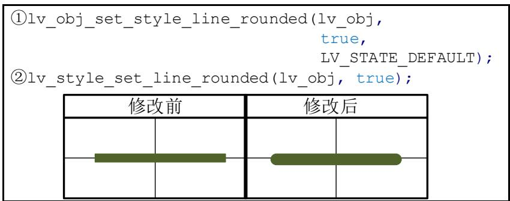  
图6.4.8.2设置线条的端点

# 3. (line_color) 线条的颜色属性:

设置线条的颜色，示例如下：

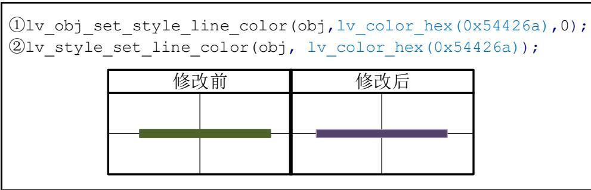  
图6.4.4.8.3设置线条的颜色

# 4. (line_opa) 线条的透明度属性：

设置线条的透明度，如果透明度值为0、LV_OPA_0或LV_OPA_TRANSP，则表示线条完全透明；如果透明度值为255、LV_OPA_100或LV_OPA_COVER，则表示线条为不透明，用户可以根据需求，在0~255之间设置透明度的值，示例如下：

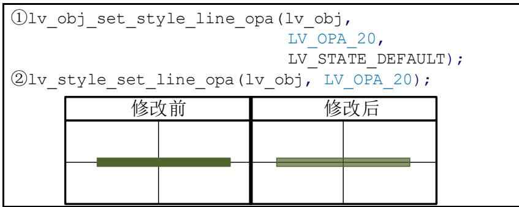  
图6.4.4.8.4设置线条的透明度

# 6.4.4.9 圆弧属性

注意：仅圆弧相关的部件或组成部分适用该属性。

# 1.(arc_width)圆弧宽度属性：

用户可以以像素为单位设置弧的宽度(厚度)，示例如下：

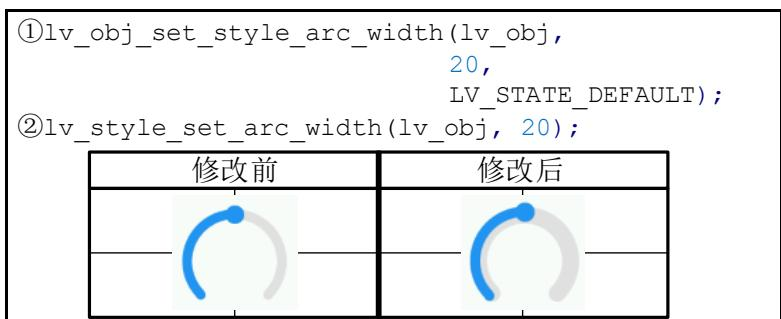  
图6.4.4.9.1设置圆弧宽度

# 2. (arc_rounded) 圆弧端点:

用户可以设置圆弧的端点形状，在相关的设置函数中，如果传入的参数为True，则圆弧的端点为圆角；如果传入的参数为false，则圆弧的端点为直角。如下图所示：

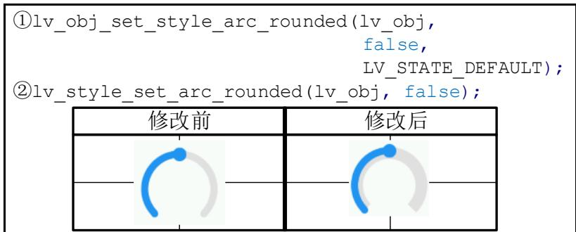  
图6.4.4.9.2设置圆弧端点

# 3.(arc_color)圆弧颜色属性：

设置圆弧的颜色，示例如下：

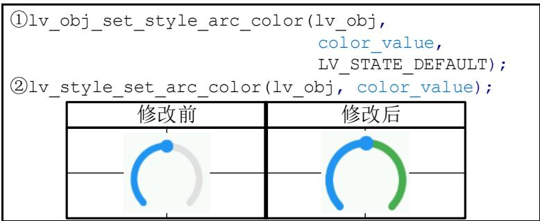  
图6.4.4.9.3设置圆弧颜色

# 4.(arc_opa)圆弧透明度属性：

设置圆弧的透明度，如果透明度值为0、LV_OPA_0或LV_OPA_TRANSP，则表示圆弧完全透明；如果透明度值为255、LV_OPA_100或LV_OPA_COVER，则表示圆弧为不透明，用户可以根据需求，在0~255之间设置透明度的值，示例如下：

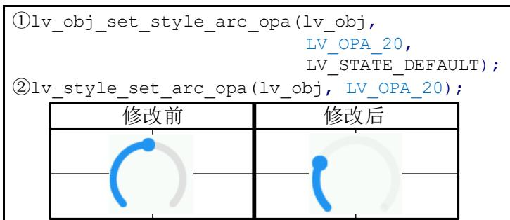  
图6.4.4.9.4设置圆弧透明度

# 6.4.4.10 文本属性

该属性适用于文本相关的部件或组成部分。

# 1.(text_color)文本颜色属性：

设置文本的颜色，示例如下：

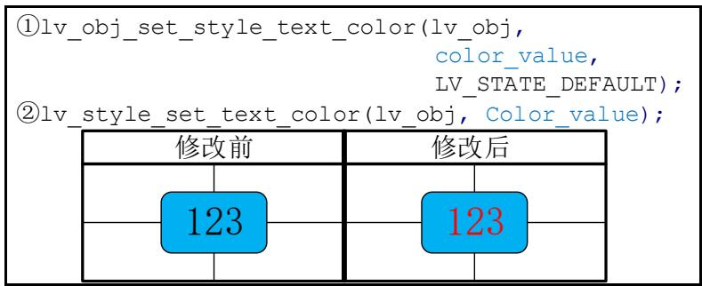  
图6.4.10.1设置文本颜色

# 2.(text_opa)文本透明度属性：

设置文本的透明度，如果透明度值为0、LV_OPA_0或LV_OPA_TRANSP，则表示文本完全透明；如果透明度值为255、LV_OPA_100或LV_OPA_COVER，则表示文本为不透明，用户可以根据需求，在0~255之间设置透明度的值，示例如下：

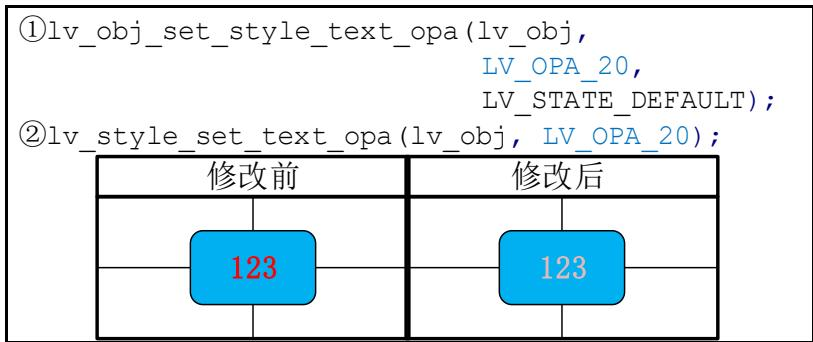  
图6.4.4.10.2设置文本透明度

# 3. (text_font)文本字体属性：

用户可以根据需求设置文本的字体（包括自定义的字体），示例如下：

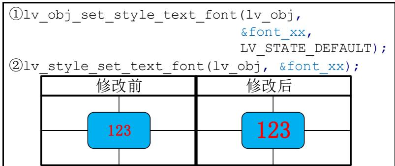  
图6.4.4.10.3设置文本字体

# 4.(text_letter_space)文本间隙属性：

设置文本字符的间隙，示例如下：

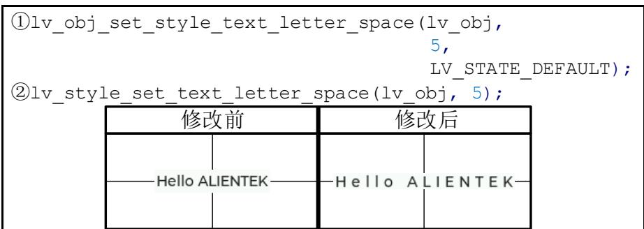

# 5.(textdecor)文本装饰属性：

文本装饰包括下划线和删除线两种，示例如下（下划线为例）：

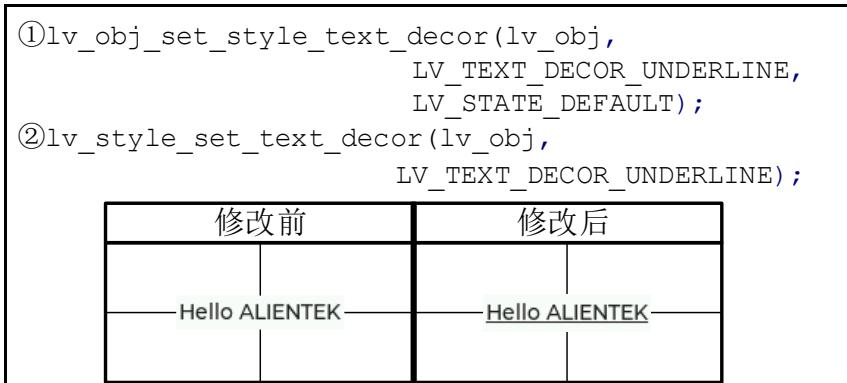  
图6.4.4.10.5设置文本装饰  
图6.4.4.10.4设置文本字符间隙

文本装饰相关的枚举如下：

① LV_TEXT_DECOR_NONE：正常文本。  
(2) LV_TEXT_DECOR UNDERLINE: 文件添加下划线  
③ LV_TEXT_DECOR_STRIKETHROUGH: 文本添加删除线。

# 6.(text_align)文本对齐属性：

用户可以设置对象内的文本对齐，该属性相关的枚举如下：

① LV_TEXTALIGN_LEFT：对象内文本左对齐。  
② LV_TEXT Alignment_CENTER：对象内文本中间对齐。  
③ LV_TEXT Alignment_RIGHT：对象内文本右对齐。  
④ LV_TEXTALIGN_AUTO：对象内文本自动对齐。

# 6.4.4.11 其他属性

# 1. (radius)设置圆角的半径属性:

用户可以设置对象边框的圆角半径，如果圆角的半径为0，则对象边框圆角为直角型；如果圆角的半径大于0且小于等于LV_RADIUS_CIRCLE，则对象边框的圆角为圆型(圆角的半径由设定值决定)，示例如下：

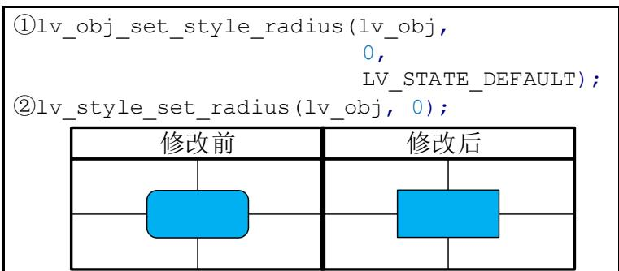  
图6.4.4.11.1设置对象圆角

# 2.(opa)透明度：

设置对象的透明度，如果透明度值为0、LV_OPA_0或LV_OPA_TRANSP，则表示对象完全透明；如果透明度值为255、LV_OPA_100或LV_OPA_COVER，则表示对象为不透明，用户可以根据需求，在0~255之间设置透明度的值，示例如下：

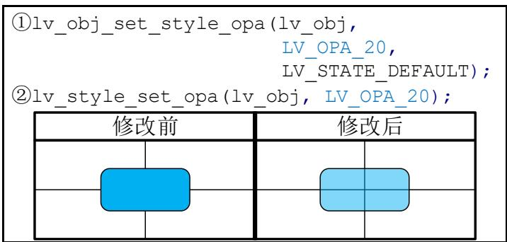  
图6.4.4.11.2设置对象透明度

# 3.(anim)动画属性：

使对象具有动画效果。

# 4.(anim_time)动画时间属性：

设置动画时间，该动画时间以毫秒为单位。

# 5.(anim_speed)动画速度属性：

设置动画速度，该动画速度以像素/秒为单位。

# 6.(layout)布局属性：

设置对象的布局，子元素将根据布局策略重新定位和调整大小。

# 7. (base_dir)对象方向属性：

设置对象的基本方向，取值为:LV_BIDI_DIR_LTR/RTL/AUTO。

# 6.5 LVGL 滚动属性

在 LVGL 中，任何对象都是支持滚动的。如果一个对象在其父对象的区域之外，则该父对象将变为可滚动的，并且在其内部出现滚动条，如下图所示：

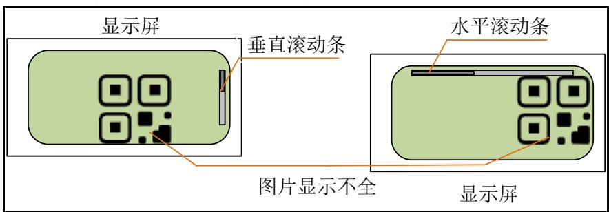  
图6.5.1滚动条的显示

# 6.5.1滚动的类型：

支持水平滚动和垂直滚动。

# 6.5.2滚动条模式：

默认情况下，子对象超出父对象的范围区域，则该父对象会自动开启滚动条。如果用户不想开启滚动条，则可以使用lv_obj_setscrollbar_mode函数设置滚动条的模式，其函数原型如下所示：

```txt
void lv_obj_set scrollbar_mode(lv_obj_t * obj, lv Scrollbar_mode_t mode);
```

该函数的形参，如下表所示：

<table><tr><td>参数</td><td>描述</td></tr><tr><td>obj</td><td>设置的对象</td></tr></table>

表 6.5.2.1 lv_obj_setscrollbar_mode 函数形参描述  

<table><tr><td rowspan="5">mode</td><td colspan="2">滚动条模式</td></tr><tr><td>LV_SROLLBAR_MODE_OFF</td><td>从不显示滚动条</td></tr><tr><td>LV_SROLLBAR_MODE_ON</td><td>始终显示滚动条</td></tr><tr><td>LV_SROLLBAR_MODE.Active</td><td>滚动对象时显示滚动条</td></tr><tr><td>LV_SROLLBAR_MODE_AUTO</td><td>当内容大到可以滚动时显示滚动条</td></tr></table>

# 6.5.3 滚动的事件类型

① LV_EVENT_SCROLL_BEGIN：滚动开始。  
② LV_EVENT_SCROLL_END: 滚动结束。  
③ LV_EVENT_SCROLL: 位置变化时触发。

这些滚动事件可以在对象回调函数中获取，相关的使用方法在后文的LVGL事件中有介绍。

# 6.5.4 设置滚动方向

用户可以调用lv_obj_set Scroll_dir函数设置对象的滚动方向，其函数原型如下所示：

```txt
void lv_obj_set Scroll_dir(lv_obj_t * obj, lv_dir_t dir);
```

该函数的形参，如下表所示：

表 6.5.4.1 lv_obj_set Scroll_dir 函数形参描述  

<table><tr><td>参数</td><td colspan="2">描述</td></tr><tr><td>obj</td><td colspan="2">目标对象</td></tr><tr><td rowspan="8">dir</td><td colspan="2">滚动方向</td></tr><tr><td>LV_DIR_TOP</td><td>只向上滚</td></tr><tr><td>LV_DIR_LEFT</td><td>只向左滚动</td></tr><tr><td>LV_DIR BOTTOM</td><td>只向下滚动</td></tr><tr><td>LV_DIR_RIGHT</td><td>只向右滚动</td></tr><tr><td>LV_DIR_HOR</td><td>仅水平滚动</td></tr><tr><td>LV_DIR.Ver</td><td>仅垂直滚动</td></tr><tr><td>LV_DIR_ALL</td><td>滚动任何方向</td></tr></table>

注意：这些滚动方向允许以组合的形式设置。

# 6.5.5 滚动的其他特性

# 1.滚动传递：

子对象滚动时，如果它的内容已经到达了父对象的最边缘位置，此时，子对象多余的滚动（力量）将被传递到父对象中，而父对象则会发生相应的滚动（假设允许滚动），从而形成滚动链。用户可以使用LV_OBJ_FLAG_SROLLChain_HOR/VER标志启用和禁用滚动传递。

# 2.滚动惯性：

当用户滚动一个对象并释放它时，LVGL可模拟滚动的惯性动量，这就像物体被抛出并平稳地减慢滚动速度。用户可以使用LV_OBJ_FLAG_SCROLL_MOMENTUM标志启用和禁用滚动惯性。

# 3.弹性滚动：

一般情况下，对象或部件组成部分发生滚动时，其滚动范围不能超过父对象或部件主体的区域。用户可以手动控制内容的位置，让其超出区域限制，而当用户释放内容之后，其将会以动画的形式，回弹到正常的区域范围之内。

# 6.6 LVGL 动画属性

优秀的过渡动画可以让用户的GUI变得更具高级感。在LVGL中，用户可指定动画的开始值和结束值，该动画将通过回调函数来处理。

# 6.6.1 创建动画

# 1. 动画创建流程

这里结合源码给大家介绍LVGL动画的创建流程，源码如下所示：

```c
/\*  $①$  定义动画变量 \*/  
lv_anim_t a;  
\*/  $②$  初始化一个动画 \*/  
lv_anim_init(&a);  
\*/  $③$  设置动画回调函数 \*/  
lv_anim_set_exec_cb(&a，(lv_anim_exec_xcb_t)lv_obj_set_x）；/\*  $④$  设置动画的目标 \*/  
lv_anim_set_var(&a,obj);  
\*/  $⑤$  动画长度[ms] \*/  
lv_anim_set_time(&a,duration);  
\*/  $⑥$  设置起始值和结束值。例如0,150\*/  
lv_anim_set_values(&a,start,end);  
\*/  $⑦$  开始动画 \*/  
lv_anim_start(&a);
```

由上述源码可知，LVGL动画的创建流程共分为七步，如下所示：

① 定义一个lv Anim_t变量。  
② 调用函数lv_anim_init初始化动画。  
③ 调用函数 lv Anim_set_exec_cb 设置动画回调函数。  
④ 调用函数lv_anim_set_var设置动画执行的目标。  
⑤ 调用函数lv_anim_set_time设置动画时间长度。  
⑥ 调用函数lv Anim_set_values设置起始值和结束值。  
⑦ 调用函数 lv_anim_start 开始动画。

# 2. 可选设置：

在创建好动画之后，用户可以选择一些额外的配置，具体可选配置如下源码所示：

```c
/* 可选设置  
*/  
/* 启动动画前的等待时间 [ms] */  
lv_anim_set_delay(&a, delay);  
/* 设置路径 (曲线)。默认是线性的 */  
lv_anim_set_path(&a, lv_anim_path_ease_in);  
/* 设置一个回调函数来指示动画何时准备好 (空闲) */
```

```c
lv_anim_set_ready_cb(&a, ready_cb);  
/* 设置一个回调函数来指示动画何时启动（延迟之后）*/  
lv_anim_set_start_cb(&a, start_cb);  
/* 准备好后，按此持续时间倒放动画。默认为0(禁用)[ms]*/  
lv_anim_set.Playback_time(&a, time);  
/* 延迟在回放。默认为0(禁用)[ms]*/  
lv_anim_set.Playback_delay(&a, delay);  
/* 重复的数量。默认值为1。LV_ANIM_REPEAT_INFINITE用于无限重复*/  
lv_anim_setrepeat_count(&a, cnt);  
/* 重复前延迟。默认为0(禁用)[ms]*/  
lv_anim_setrepeat_delay(&a, delay);  
/* True(默认)：立即应用起始值，false：延迟后应用起始值。真正的开始*/  
lv_anim_set早早_apply(&a, true/false);
```

注意：在配置可选项之前，必须先创建动画。

# 6.6.2 设置动画路径

在LVGL中，用户可以控制动画的路径，其中最简单的就是线性变化，这意味着整个动画的过程都是以固定的步长发生变化，目前，LVGL有以下设置动画路径的函数：

① lv_anim_path_LINEAR：线性动画。  
② lv_anim_path_step：最后一步改变。  
③ lv_anim_path_ease_in: 一开始很慢。  
④ lv_anim_path_ease_out: 最后慢。  
⑤ lv_anim_path_ease_in_out: 开始和结束都很慢。  
⑥ lv_anim_path_overshoot: 超出最终值。  
⑦ lv_anim_path_bounce: 从最终值反弹一点。

上述的动画路径设置函数通常都是以回调的形式传入lv Anim_set_path函数中，该函数原型如下所示：

```txt
static inline void lv_anim_set_path_cb( lv_anim_t * a, lv_anim_path_cb_t path_cb)
```

该函数的形参，如下表所示：

表 6.6.2.1 lv_anim_set_path_cb 函数形参描述  

<table><tr><td>参数</td><td colspan="2">描述</td></tr><tr><td>a</td><td colspan="2">指向初始化的&#x27;lv Anim_t&#x27;变量的指针</td></tr><tr><td rowspan="8">path_cb</td><td colspan="2">设置动画路径</td></tr><tr><td>lv Anim_path_LINEAR</td><td>线性动画</td></tr><tr><td>lv Anim_path_step</td><td>最后一步改变</td></tr><tr><td>lv Anim_path_ease_in</td><td>一开始很慢</td></tr><tr><td>lv Anim_path_ease_out</td><td>最后慢</td></tr><tr><td>lv Anim_path_ease_in_out</td><td>开始和结束都很慢</td></tr><tr><td>lv Anim_path_overshoot</td><td>超出最终值</td></tr><tr><td>lv Anim_path_bounce</td><td>从最终值反弹一点（如撞墙）</td></tr></table>

返回值：无。

# 6.6.3 设置动画速度

在LVGL中，动画速度指的是开始值到结束值所需的时间。用户需要设置动画速度，可调用lv Anim_speed_to_time函数，该函数原型如下所示：

```c
uint32_t lv_anim_speed_to_time uint32_t speed, int32_t start, int32_t end);
```

该函数的形参，如下表所示：

表 6.6.3.1 lv_anim_set_path_cb 函数形参描述  

<table><tr><td>参数</td><td>描述</td></tr><tr><td>speed</td><td>动画速度(单位/秒)</td></tr><tr><td>start</td><td>动画的起始值</td></tr><tr><td>end</td><td>动画的结束值</td></tr></table>

返回值：给定参数的动画所需的时间[ms]。

在上述的函数中，动画速度以单位/秒来表示，这里的“单位”指的是某个物理量，例如：当用户让对象往  $\mathbf{X}$  轴偏移时，上述的“单位”指的就是像素，而入口参数 speed 的速度就是像素/秒。

注意：该函数的返回值  $=$  （结束值-起始值）/动画速度。

# 6.6.4 删除动画

如果用户在LVGL运行当中，不需要某个动画了，可使用lv Anim_del函数删除这个动画，其函数原型如下所示：

```c
bool lv_anim_del(void * var, lv_anim_exec_xcb_t exec_cb);
```

该函数的形参，如下表所示：

表 6.6.4.1 lv_anim_set_path_cb 函数形参描述  

<table><tr><td>参数</td><td>描述</td></tr><tr><td>var</td><td>动画变量指针</td></tr><tr><td>exec_cb</td><td>回调函数指针</td></tr></table>

返回值：True：至少删除1个动画；false：不删除动画。

# 6.6.5动画实例

下面我们以一个简单的实例来讲解LVGL动画使用流程，示例如下：

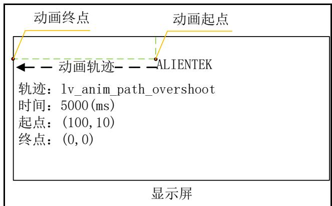  
图6.6.5.1动画功能示例

上图中，标签部件(ALIENTEK)从(100,10)坐标开始向左边移动，并在(0,0)坐标上停止，整个过程的时间为  $5000\mathrm{ms}$  。示例的实现如下源码所示：

```txt
/
```

```c
\* @brief 动画回调函数\* @param var: 对象\* @param v: 数值\* @retval 无\*/static void anim_x_cb(void* var, int32_t v)  
{lv_obj_set_x(var, v); /* 在回调函数中更新x轴的值*/}void lv_example(void)  
{/\* 第一步：创建标签 \*/lv_obj_t\* lv_label_create(lv_scr_act());lv_label_set_text(lv_obj,"ALIENTEK");lv_obj_set_pos(lv_obj,100，10);/\* 第二步：动画初始化 \*/lv_anim_t a;lv_anim_init(&a);/\* 第三步：设置动画目标为标签对象 \*/lv_anim_set_var(&a,lv_obj);/\* 第四步：设置动画起点和终点 \*/lv_anim_set_values(&a，100，0);/\* 第五步：设置动画时间 \*/lv_anim_set_time(&a，5000);/\* 第六步：设置动画回调函数 \*/lv_anim_set_exec_cb(&a，anim_x_cb);/\* 第七步：设置动画轨道 \*/lv_anim_set_path_cb(&a，lv_anim_path_overshoot);/\* 第八步：开启动画 \*/lv_anim_start(&a);
```

在上述代码中，动画的回调函数非常重要，它可以适时地更新  $x$  轴的像素值，这样才能实现优秀的动画效果。

# 6.6.6 动画时间线

在LVGL中，动画时间线的设置可以进一步优化动画效果，实现非线性动画。用户可以指定动画时间线的长度、开始时间、重复次数和时间快慢等属性。为了更加方便地实现非线性动画，LVGL将动画时间线分为了多个动画的集合，这样可以较为轻松地创建复杂的动画，示意图如下：

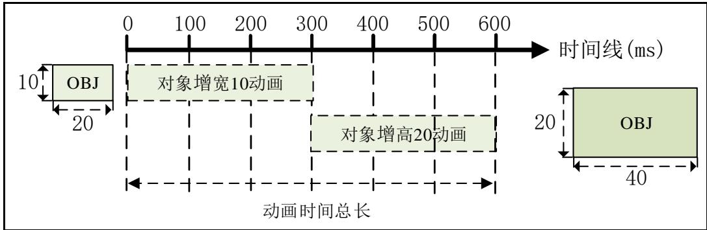  
图6.6.6.1非线性动画示意图

接下来，我们根据上述的示意图，编写动画时间线的实例，如下源码所示：

```c
static lv animatetimeline_t* animtimeline = NULL;  
static lv_obj_t* obj1 = NULL;  
static const lv_coord_t obj_width = 90;  
static const lv_coord_t obj_height = 70;  
/*  
* @brief a1动画回调函数  
* @param var:对象  
* @param v:数值  
* @retval无  
*/  
static void set_width(void* var, int32_t v)  
{ /*设置obj1对象宽度*/ lv_obj_set_width((lv_obj_t*)var, v);  
}  
/*  
* @brief a2动画回调函数  
* @param var:对象  
* @param v:数值  
* @retval无  
*/  
static void set_height(void* var, int32_t v)  
{ /*设置obj1对象高度*/ lv_obj_set_height((lv_obj_t*)var, v);  
}
```

```txt
\* @brief 创建时间线  
\* @param 无  
\* @retval 无  
\*/  
static void animtimeline_create(void)  
{/\* obj1对象增宽动画\*/lv_ANIM_t a1;lv_ANIM_init(&a1);lv_ANIM_set_var(&a1,obj1);lv_ANIM_set_values(&a1,obj_width,obj_width + 10);lv_ANIM_set_early_apply(&a1,false);lv_ANIM_set_exec_cb(&a1,(lv_ANIM_exec_xcb_t)set_width);lv_ANIM_set_path_cb(&a1,lv_ANIM_path_overshoot);lv_ANIM_set_time(&a1,300);/\*obj1对象增高动画\*/lv_ANIM_t a2;lv_ANIM_init(&a2);lv_ANIM_set_var(&a2,obj1);lv_ANIM_set_values(&a2,obj_height,obj_height  $+20$  );lv_ANIM_set_early_apply(&a2,false);lv_ANIM_set_exec_cb(&a2,(lv_ANIM_exec_xcb_t)set_height);lv_ANIM_set_path_cb(&a2,lv_ANIM_path_ease_out);lv_ANIM_set_time(&a2,300);/\*创建动画时间线\*/animTimeline  $\equiv$  lv_ANIMTimeline_create();/\*把a1动画添加到时间线中\*/lv_ANIMTimeline_add(animTimeline，0,&a1);\*/\*把a2动画添加到时间线中\*/lv_ANIMTimeline_add(animTimeline，300,&a2);  
}  
/\*\*  
\* @brief 按键回调函数\* @param e:事件\* @retval 无  
\*/  
static void bnt_start_eventhandler(lv_event_t\*e)  
{lv_obj_t\*btn  $\equiv$  lv_event_get_target(e);
```

```c
if(!animtimeline){ animtimeline_create(); } /*获取按下的点击状态*/ bool reverse  $=$  lv_obj_has_state(btn,LV_STATE_CHECKED); /*支持整个动画组的向前和向后播放\*/ lv_animTimeline_set_reverse(animtimeline,reverse); /*启动动画时间轴\*/ lv_animTimeline_start(animtimeline);   
}   
/\*\* \* @brief LVGL入口 \* @param 无 \* @retval 无 \*/   
voidlv_main(void)   
{ lv_obj_t\*par  $=$  lv_scr_act(); /\*创建按键部件\*/ lv_obj_t\*btn_start  $=$  lv_btn_create(par); /\*设置回调函数\*/ lv_obj_add_event_cb (btn_start，btn_start_event_handler, LV_EVENT_VALUE_CHANGED，NULL); lv_obj_align (btn_start，LV ALIGN_TOP_MID，-100，20); /\*按键文本\*/ lv_obj_t\*label_start  $=$  lv_label_create (btn_start); lv_label_set_text (label_start，"Start"); lv_obj_center (label_start); /\*创建动画操作对象\*/ obj1  $=$  lv_obj_create(par); lv_obj_set_size(obj1,obj_width,obj_height);   
}
```

上述源码的实现逻辑如下：

① 当按下BTN_start按键时，创建a1和a2动画，这两个动画的动画时间都是300ms；  
(2) 在 a1 和 a2 的动画回调函数中, 分别为 obj1 增宽和 obj1 增高;  
(3) 调用 lv_animtimeline_create 函数，创建动画时间线；  
④ 调用lv Animtimeline_add函数把a1和a2动画挂载到动画时间线上；  
⑤ 调用lv_animtimeline_start函数开启动画时间线。

# 6.6.6.1 动画时间线相关 API 函数

# 1.lv_anntimeline_create函数

创建动画时间线，其函数原型如下所示：

```txt
lv_animtimeline_t \* lv_animtimeline_create(void)
```

返回值：动画时间线指针。

# 2.lv_anntimeline_add函数

把动画挂载到时间线上，其函数原型如下所示：

```txt
void lv_anntimeline_add lv_annTimeline_t * at, uint32_t start_time, lv_ann_t * a)
```

该函数的形参，如下表所示：

表 6.6.6.1.1 lv_animtimeline_add 函数形参描述  

<table><tr><td>参数</td><td>描述</td></tr><tr><td>at</td><td>时间线指针</td></tr><tr><td>start_time</td><td>开始时间</td></tr><tr><td>a</td><td>挂载的动画</td></tr></table>

返回值：无。

# 3.lv_animtimeline_start函数

开启动画时间线，其函数原型如下所示：

```txt
uint32_t lv_animtimeline_start(lv_animtimeline_t * at)
```

该函数的形参，如下表所示：

表 6.6.6.1.2 lv_animtimeline_start 函数形参描述  

<table><tr><td>参数</td><td>描述</td></tr><tr><td>at</td><td>时间线指针</td></tr></table>

返回值：活动时间。

# 4.lv_anntimeline_set_reverse函数

设置动画时间线的播放方向，其函数原型如下所示：

```txt
void lv_anntimeline_set_reverse lv_annTimeline_t \* at, bool reverse)
```

该函数的形参，如下表所示：

表 6.6.6.1.3 lv_animtimeline_set_reverse 函数形参描述  

<table><tr><td>参数</td><td>描述</td></tr><tr><td>at</td><td>时间线指针</td></tr><tr><td>reverse</td><td>ture:反向，false:不反向</td></tr></table>

返回值：无。

# 5.lv animatetimeline_stop函数

停止动画时间线，其函数原型如下所示：

```txt
void lv_animtimeline_stop lv_animTimeline_t * at)
```

该函数的形参，如下表所示：

表 6.6.6.1.4 lv_animtimeline_stop 函数形参描述  

<table><tr><td>参数</td><td>描述</td></tr><tr><td>at</td><td>时间线指针</td></tr></table>

返回值：无。

# 6.lv_anntimeline_set_progress函数

设置动画时间线的进度，其函数原型如下所示：

```txt
void lv_animTimeline_set_progress(lv_animTimeline_t * at, uint16_t progress)
```

该函数的形参，如下表所示：

表 6.6.6.1.5 lv_animtimeline_set_progress 函数形参描述  

<table><tr><td>参数</td><td>描述</td></tr><tr><td>at</td><td>时间线指针</td></tr><tr><td>progress</td><td>进度数值</td></tr></table>

返回值：无。

# 7.lv_anntimeline_get/playtime函数

获取动画时间线的总时长，其函数原型如下所示：

```txt
uint32_t lv_animtimeline_get.Playtime lv_animtimeline_t * at)
```

该函数的形参，如下表所示：

表 6.6.6.1.6 lv_animtimeline_get.Playtime 函数形参描述  

<table><tr><td>参数</td><td>描述</td></tr><tr><td>at</td><td>时间线指针</td></tr></table>

返回值：时间线的总时长。

# 8. Iv_animtimeline_get_reverse 函数

获取动画时间线是否反向播放，其函数原型如下所示：

```txt
bool lv_animtimeline_get_reverse lv_animtimeline_t \* at)
```

该函数的形参，如下表所示：

表 6.6.6.1.7 lv_animtimeline_get_reverse 函数形参描述  

<table><tr><td>参数</td><td>描述</td></tr><tr><td>at</td><td>时间线指针</td></tr></table>

返回值：ture:反向播放，false:非反向播放。

# 9.lv_animtimeline_del函数

删除动画时间线，其函数原型如下所示：

```txt
void lv_animtimeline_del lv_animtimeline_t * at)
```

该函数的形参，如下表所示：

表 6.6.6.1.8 lv_animtimeline_del 函数形参描述  

<table><tr><td>参数</td><td>描述</td></tr><tr><td>at</td><td>时间线指针</td></tr></table>

返回值：无。

# 6.6.7 动画相关 API 函数

LVGL官方提供了很多动画相关的API函数，如下表所示：

<table><tr><td>函数</td><td>描述</td></tr><tr><td>lv_ANIM_init()</td><td>初始化动画</td></tr><tr><td>lv_ANIM_set_var()</td><td>设置（添加）一个动画变量</td></tr><tr><td>lv_ANIM_set_exec_cb()</td><td>设置动画回调函数</td></tr><tr><td>lv_ANIM_set_time()</td><td>设置动画的时间</td></tr><tr><td>lv_ANIM_set_delay()</td><td>设置动画开始之前的延迟</td></tr><tr><td>lv_ANIM_set_values()</td><td>设置动画的开始和结束值</td></tr><tr><td>lv_ANIM_set_path_cb</td><td>设置动画的路径</td></tr><tr><td>lv_ANIM_set_start_cb()</td><td>设置动画开始时的回调函数</td></tr><tr><td>lv_ANIM_set_get_value_cb()</td><td>设置获取当前值的回调函数</td></tr><tr><td>lv_ANIM_set_ready_cb()</td><td>设置动画准备好后的回调函数</td></tr><tr><td>lv_ANIM_set.Playback_time()</td><td>设置动画在前进方向准备好时播放</td></tr><tr><td>lv_ANIM_set.Playback_delay()</td><td>设置动画播放之前的延时</td></tr></table>

表 6.6.7.1 动画相关 API 函数描述  

<table><tr><td>lv_ANIM_setrepeat_count()</td><td>设置动画重复次数</td></tr><tr><td>lv_ANIM_setrepeat_delay()</td><td>设置重复动画之前的延迟</td></tr><tr><td>lv_ANIM_set早早_apply()</td><td>设置动画是否立即生效</td></tr><tr><td>lv_ANIM_set_user_data()</td><td>设置动画的自定义用户数据</td></tr><tr><td>lv_ANIM_start()</td><td>开启动画</td></tr><tr><td>lv_ANIM_get_delay()</td><td>获得动画开始之前的延迟时间</td></tr><tr><td>lv_ANIM_get.Playtime()</td><td>获取播放动画的时间</td></tr><tr><td>lv_ANIM_get_user_data()</td><td>获取动画的用户数据</td></tr><tr><td>lv_ANIM_del()</td><td>删除指定动画</td></tr><tr><td>lv_ANIM_del_all()</td><td>删除所有动画</td></tr><tr><td>lv_ANIM_count_runting()</td><td>获取正在运行的动画数量</td></tr><tr><td>lv_ANIM_speed_to_time()</td><td>设置动画速度</td></tr><tr><td>lv_ANIM_refr_now()</td><td>手动刷新动画的状态</td></tr><tr><td>lv_ANIM_path_LINEAR()</td><td>计算应用线性特征的动画当前值</td></tr><tr><td>lv_ANIM_path Ease_in()</td><td>计算减速开始阶段的动画当前值</td></tr><tr><td>lv_ANIM_path Ease_out()</td><td>计算减速结束阶段的动画当前值</td></tr><tr><td>lv_ANIM_path Ease_in_out()</td><td>计算应用余弦（S型）特征的动画当前值</td></tr><tr><td>lv_ANIM_path_overshoot()</td><td>计算结束时有过冲的动画当前值</td></tr><tr><td>lv_ANIM_path_bounce()</td><td>计算具有3次反弹的动画当前值</td></tr><tr><td>lv_ANIM_path_step()</td><td>计算应用步进特性的动画当前值</td></tr></table>

# 6.7 LVGL 定时器

LVGL 有一个内置的软件定时器，它构建在硬件定时器基础之上，使系统能够提供不受硬件定时器资源限制的定时服务，其实现的功能与硬件定时器也是类似的。值得注意的是，因为 lv_timerhandler 函数并不是准时调用的，所以导致了软件定时器有一定的误差。

# 6.7.1 创建定时器

用户可调用lv_timer_create函数或者lv_timer_create_basic函数来创建LVGL软件定时器。

# 1.lv_timer_create函数

创建一个定时器，其函数原型如下所示：

```c
lv_timer_t * lv_timer_create(timer_cb, period_ms, user_data);
```

该函数的形参，如下表所示：

表 6.7.1.1 函数 lv_timer_create(   )形参描述  

<table><tr><td>参数</td><td>描述</td></tr><tr><td>timer_cb</td><td>定时器回调函数</td></tr><tr><td>period_ms</td><td>定时周期</td></tr><tr><td>user_data</td><td>传入参数</td></tr></table>

返回值：定时器指针。

当用户调用lv_timer_create函数创建定时器时，可以指定回调函数，该回调函数将被定时调用，定时器回调函数原型如下所示：

```txt
void (*lv_timer_cb_t)(lv_timer_t \*);
```

# 2.lv_timer_create/basic函数

创建一个定时器，其函数原型如下所示：

```python
lv_timer_t * lv_timer_create/basic(void)
```

```c
{ return lv_timer_create(NULL,DEF_PERIOD，NULL); }
```

返回值：定时器指针。

注意：使用该函数创建LVGL定时器时，必须调用lv_timer_set_cb函数，自定义定时回调函数，默认定时周期为DEF_PERIOD。

# 6.7.2 定时器配置

# 1. 定时器就绪、重置

用户可以手动设置定时器的就绪状态以及重置定时器，相关的函数如下：

# lv_timer_ready函数

定时器已就绪，其函数原型如下所示：

```txt
void lv_timer_ready lv_timer_t * timer);
```

该函数的形参，如下表所示：

表 6.7.2.1 lv_timer_ready 函数形参描述  

<table><tr><td>参数</td><td>描述</td></tr><tr><td>timer</td><td>定时器指针</td></tr></table>

定时器就绪后，系统将在下一次调用lv_timerhandler时运行这个定时器。

# lv_timer_reset函数

重置定时器，其函数原型如下所示：

```c
void lv_timer_reset(lv_timer_t * timer);
```

该函数的形参，如下表所示：

表 6.7.2.2 lv_timer_reset 函数形参描述  

<table><tr><td>参数</td><td>描述</td></tr><tr><td>timer</td><td>定时器指针</td></tr></table>

# 2. 设置定时器参数

在LVGL软件定时器的配置中，回调函数和定时周期是非常关键的，它们相关的函数如下：

# lv_timer_set_cb函数

设置定时器的回调函数，其函数原型如下所示：

```c
void lv_timer_set_cb(lv_timer_t \* timer, lv_timer_cb_t timer_cb);
```

该函数的形参，如下表所示：

表 6.7.2.3 lv_timer_set_cb 函数形参描述  

<table><tr><td>参数</td><td>描述</td></tr><tr><td>timer</td><td>定时器指针</td></tr><tr><td>timer_cb</td><td>定时回调函数</td></tr></table>

返回值：无。

# lv_timer_set_period函数

设置定时周期，其函数原型如下所示：

```c
void lv_timer_set_period(lv_timer_t * timer, uint32_t period);
```

该函数的形参，如下表所示：

表 6.7.2.4 lv_timer_set_period 函数形参描述  

<table><tr><td>参数</td><td>描述</td></tr><tr><td>timer</td><td>定时器指针</td></tr><tr><td>new_period</td><td>定时周期</td></tr></table>

返回值：无。

# 3. 重复计数

用户可以使用lv_timer_setrepeat_count函数设置定时器重复计数的次数。当计数次数达到指定值后，计时器将自动删除。注意：当计数次数设置为-1时，以无限期地重复计数。

# lv_timer_setrepeat_count函数

设置定时器重复计数的次数，其函数原型如下所示：

```c
void lv_timer_setrepeat_count(lv_timer_t \*timer，int32_t repeat_count）;
```

该函数的形参，如下表所示：

表 6.7.2.5 lv_timer_setrepeat_count 函数形参描述  

<table><tr><td>参数</td><td>描述</td></tr><tr><td>timer</td><td>定时器指针</td></tr><tr><td>repeat_count</td><td>重复计数次数，-1：无数次；0：停止；n&gt;0：剩余次数</td></tr></table>

返回值：无。

# 4. 测量空闲时间

用户可通过lv_timer_get_idle函数获得lv_timerhandler（定时器任务）的空闲时间百分比，以此测量出LVGL的空闲时间。注意：该函数仅测量lv_timerhandler的空闲时间，而不会测量整个系统的空闲时间，因此，当用户使用操作系统并在定时器中调用lv_timerhandler时，可能会产生误差，因为它不会实际测量操作系统在空闲线程中花费的时间。

# lv_timer_get_idle函数

获得lv_timerhandler的空闲时间百分比，其函数原型如下所示：

```c
uint8_t lv_timer_get_idle(void);
```

返回值：返回空闲时间百分比。

# 6.7.3 定时器 API 函数

LVGL官方提供一些与定时器相关的API函数，如下表所示：

表 6.7.3.1 定时器相关的 API 函数描述  

<table><tr><td>函数</td><td>描述</td></tr><tr><td>lv_timer_del()</td><td>删除一个定时器</td></tr><tr><td>lv_timer Pause()</td><td>暂停定时器</td></tr><tr><td>lv_timer Resume()</td><td>恢复定时器</td></tr><tr><td>lv_timer_enable()</td><td>启用或禁用定时器</td></tr><tr><td>lv_timer_get_next()</td><td>获取下一个定时器</td></tr></table>

# 1.lv_timer_del函数

删除一个定时器，其函数原型如下所示：

```txt
void lv_timer_del (lv_timer_t *timer);
```

该函数的形参，如下表所示：

表 6.7.3.2 lv_timer_del 函数形参描述  

<table><tr><td>参数</td><td>描述</td></tr><tr><td>timer</td><td>定时器指针</td></tr></table>

返回值：无。

# 2.lv_timer Pause函数

暂停定时器，其函数原型如下所示：

```txt
void lv_timer Pause (lv_timer_t *timer);
```

该函数的形参，如下表所示：

表 6.7.3.3 lv_timer Pause 函数形参描述  

<table><tr><td>参数</td><td>描述</td></tr><tr><td>timer</td><td>定时器指针</td></tr></table>

返回值：无。

# 3.lv_timerResume函数

恢复定时器，其函数原型如下所示：

```txt
void lv_timerResume (lv_timer_t *timer);
```

该函数的形参，如下表所示：

表 6.7.3.4 lv_timerResume 函数形参描述  

<table><tr><td>参数</td><td>描述</td></tr><tr><td>timer</td><td>定时器指针</td></tr></table>

返回值：无。

# 4.lv_timer_enable函数

启用或禁用定时器，其函数原型如下所示：

```txt
void lv_timer_enable ( bool en );
```

该函数的形参，如下表所示：

表 6.7.3.5 lv_timer_enable 函数形参描述  

<table><tr><td>参数</td><td>描述</td></tr><tr><td>en</td><td>true: 启用, false: 禁用</td></tr></table>

返回值：无。

# 5.lv_timer_get_next函数

获取下一个定时器，其函数原型如下所示：

```c
lv_timer_t * lv_timer_get_next (lv_timer_t * timer);
```

该函数的形参，如下表所示：

表 6.7.3.6 lv_timer_get_next 函数形参描述  

<table><tr><td>参数</td><td>描述</td></tr><tr><td>timer</td><td>定时器指针</td></tr></table>

返回值：返回下一个定时器指针。

# 6.8 LVGL 事件

# 6.8.1 事件简介

事件(Event)在LVGL中非常重要，它是连接用户GUI界面和硬件设备（例如LED）之间的桥梁，我们可以将其理解为某种同类型操作动作的集合，例如，短按、长按、按下并释放、聚焦，等等。下面我们以一个LED控制的示例，帮助大家理解事件的作用：

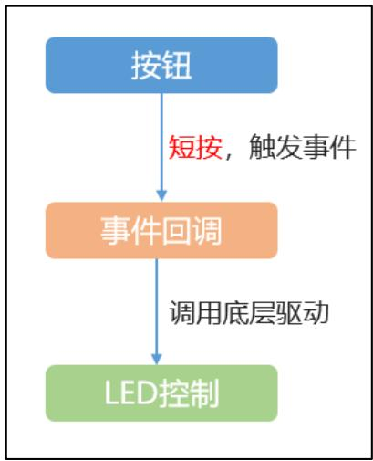  
图6.8.1.1LED控制示例

在上图的示例中，当用户短按按钮部件（发生事件），将会触发相应的事件回调函数，在该回调函数中，我们可以调用底层的LED驱动，从而实现LED的控制。

接下来，我们介绍LVGL的事件处理机制，该机制非常完善，它能够监听事件，识别事件源，并完成事件处理，处理机制的示意图如下：

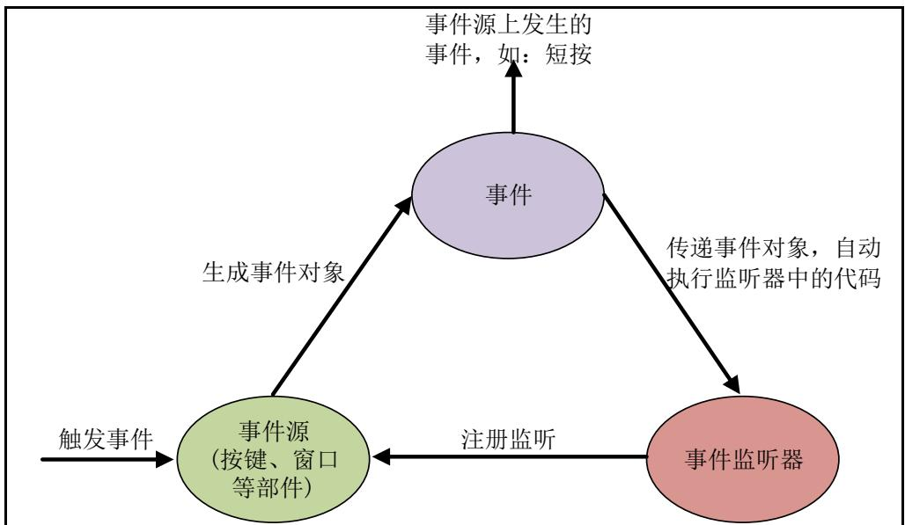  
图6.8.1.2LVGL事件处理机制

由上图可知，LVGL的事件处理机制分为三部分：

① 事件源，能够产生事件的部件，在LVGL中，每一个部件都可以触发事件。  
(2) 事件，用户对部件的操作动作，例如：短按、长按等。  
③ 事件监听器，接收事件、解释事件并处理用户代码。

# 6.8.2 添加事件（回调）

在LVGL中，用户可以调用lv_obj_add_event_cb函数来添加事件，其函数原型如下所示：

```c
struct _lv_event_dsc_t * lv_obj_add_event_cb(_lv_obj_t * obj, _lv_event_cb_t event_cb, _lv_event_code_t filter, void * user_data);
```

该函数的形参，如下表所示：

表 6.8.2.1 lv_obj_add_event_cb 函数形参描述  

<table><tr><td>参数</td><td>描述</td></tr><tr><td>obj</td><td>指向对象的指针</td></tr><tr><td>event_cb</td><td>事件回调函数</td></tr><tr><td>filter</td><td>事件类型</td></tr><tr><td>user_data</td><td>用户数据</td></tr></table>

返回值：返回事件描述符。

接下来，我们结合源码，为大家介绍事件的添加步骤，示例源码如下：

```c
/\*第一步创建按钮部件\*/  
lv_obj_t \*btn  $=$  lv_bbox_create(lv_scr_act());  
/\*第二步添加事件并设置回调函数\*/  
lv_obj_add_event_cb(btn，my_event_cb，LV_EVENTCLICKED，NULL);  
static void my_event_cbLv_event_t \*event)  
{printf("Clicked\n"); /*第三步在回调函数中处理用户逻辑代码\*/}
```

由上述源码可知，部件的事件添加共分为三步：

① 创建部件；  
(2) 添加事件到部件中，并设置回调函数和事件类型；  
(3) 在回调函数中处理用户逻辑代码。

注意：事件类型可以理解为某种同类型操作动作的集合，例如短按、长按等，其相关内容将在6.8.4小节介绍。

# 6.8.3 删除事件

用户可以通过lv_obj_remove_event_cb函数删除事件，其函数原型如下所示：

```txt
bool lv_obj_remove_event_cb(struct _lv_obj_t * obj, lv_event_cb_t event_cb);
```

该函数的形参，如下表所示：

表 6.8.3.1 lv_obj_remove_event_cb 函数形参描述  

<table><tr><td>参数</td><td>描述</td></tr><tr><td>obj</td><td>指向对象的指针</td></tr><tr><td>event_cb</td><td>事件回调函数</td></tr></table>

返回值：true：有事件被移除；false：没有事件被移除。

# 6.8.4 事件类型

事件类型可以理解为某种同类型操作动作的集合，例如短按、长按等，其可分为以下几类：

① 输入设备事件；  
② 绘图事件；  
③ 其他事件；  
④ 特别事件；  
⑤ 自定义事件；

在LVGL中，所有对象都可以接收输入设备事件、绘图事件和其他事件。注意：自定义事件由用户添加，LVGL从不发送自定义事件。

接下来，我们详细介绍这几种事件类型：

1. 输入设备事件:主要描述触摸、按键等输入设备所触发的事件，如下表所示：

表 6.8.4.1 输入设备事件类型  

<table><tr><td>事件类型</td><td>描述</td></tr><tr><td>LV_EVENTlongleftrightarrow</td><td>按下</td></tr><tr><td>LV_EVENTlongleftrightarrow</td><td>连接</td></tr><tr><td>LV_EVENTlongleftrightarrow</td><td>对象仍被按下，但光标/手指滑离对象</td></tr><tr><td>LV_EVENTlongleftrightarrow</td><td>短按，滚动则不调用</td></tr><tr><td>LV_EVENTlongleftrightarrow</td><td>长按(可指定长按时间)，滚动则不调用</td></tr><tr><td>LV_EVENTlongleftrightarrow</td><td>长按，只调用一次。滚动则不调用</td></tr><tr><td>LV_EVENTlongleftrightarrow</td><td>如果对象没有滚动（不管长按还是短按），则在释放时调用</td></tr><tr><td>LV_EVENTlongleftrightarrow</td><td>每次释放对象时调用</td></tr><tr><td>LV_EVENTlongleftrightarrow</td><td>滚动开始</td></tr><tr><td>LV_EVENTlongleftrightarrow</td><td>滚动结束</td></tr><tr><td>LV_EVENTlongleftrightarrow</td><td>发生滚动</td></tr><tr><td>LV_EVENTlongleftrightarrow</td><td>检测到手势</td></tr><tr><td>LV_EVENTlongleftrightarrow</td><td>KEY被发送到对象(和按键输入设备有关)</td></tr><tr><td>LV_EVENTlongleftrightarrow</td><td>被聚焦</td></tr><tr><td>LV_EVENTlongleftrightarrow</td><td>对象未聚焦</td></tr><tr><td>LV_EVENTlongleftrightarrow</td><td>对象未聚焦，但被选中</td></tr></table>

表 6.8.4.2 部件的绘画事件描述  
2. 绘图事件：主要描述部件绘画时的事件，如下表所示：  

<table><tr><td>事件类型</td><td>描述</td></tr><tr><td>LV_EVENT_COVER_CHECK</td><td>检查一个物体是否完全覆盖了一个区域</td></tr><tr><td>LV_EVENT_REFR_EXT_DRAW_SIZE</td><td>获取对象周围所需的额外绘制区域（例如阴影）</td></tr><tr><td>LV_EVENT_DRAW_MAIN_BEGI</td><td>开始主要绘图阶段</td></tr><tr><td>LV_EVENT_DRAW_MAIN</td><td>执行主图</td></tr><tr><td>LV_EVENT_DRAW_MAIN_END</td><td>完成主要绘图阶段</td></tr><tr><td>LV_EVENT_DRAW_POST_BEGIN</td><td>开始绘制（当所有子类都被绘制时）</td></tr><tr><td>LV_EVENT_DRAW_POST</td><td>执行绘制（当所有子类都被绘制时）</td></tr><tr><td>LV_EVENT_DRAW_POST_END</td><td>完成后期绘制阶段（当所有子类都被绘制时）</td></tr><tr><td>LV_EVENT_DRAW_PART_BEGIN</td><td>开始画一个部分</td></tr><tr><td>LV_EVENT_DRAW_PART_END</td><td>完成绘制一个部分</td></tr></table>

注意：在部件绘画事件中，不能设置大小等属性，可以获取部件的属性。

3.其他事件：主要描述删除、大小、样式等事件，如下表所示：  

<table><tr><td>事件类型</td><td>描述</td></tr><tr><td>LV_EVENT_DELETE</td><td>正在删除对象</td></tr><tr><td>LV_EVENT_CHILD_CHANGED</td><td>子类被改变</td></tr><tr><td>LV_EVENT_CHILD_created</td><td>子类被创造出来</td></tr><tr><td>LV_EVENT_CHILD_deleted</td><td>子类被删除</td></tr><tr><td>LV_EVENT_SIZE_CHANGED</td><td>对象坐标/大小已更改</td></tr><tr><td>LV_EVENT_style_CHANGED</td><td>对象的样式已更改</td></tr><tr><td>LV_EVENT_BASE_DIR_CHANGED</td><td>基本目录已更改</td></tr><tr><td>LV_EVENT_GETSELF_SIZE</td><td>获取小部件的内部大小</td></tr></table>

表 6.8.4.3 其他事件描述  

<table><tr><td>LV_EVENTSCREEN_UNLOAD_START</td><td>屏幕卸载开始</td></tr><tr><td>LV_EVENTSCREEN_LOAD_STAR</td><td>屏幕加载开始</td></tr><tr><td>LV_EVENTSCREEN_LOADING</td><td>加载了一个屏幕</td></tr><tr><td>LV_EVENTSCREEN_UNLOAD</td><td>卸载屏幕</td></tr></table>

4. 特别事件：主要描述对象数值被修改时触发的事件，如下表所示：  
表 6.8.4.4 特别事件描述  

<table><tr><td>事件类型</td><td>描述</td></tr><tr><td>LV_EVENT_VALUE_CHANGED</td><td>对象的值已更改</td></tr><tr><td>LV_EVENT_insert</td><td>文本被插入到对象中</td></tr><tr><td>LV_EVENT_REFRESH</td><td>通知对象刷新它上面的东西</td></tr><tr><td>LV_EVENT_READY</td><td>一个过程已经完成</td></tr><tr><td>LV_EVENTCANCEL</td><td>一个进程已被取消</td></tr></table>

注意：关于上述事件类型的使用方法，请回顾6.8.2小节的示例代码。

# 5. 自定义事件：

任何自定义事件代码都可通过以下方式注册：

```c
uint32_t MY_EVENT_1 = lv_event register_id();
```

上述函数可将事件等级表的 ID 获取回来，然后调用 lv_event_send 函数，发送事件到回调函数当中。

# lv_event_send函数

发送一个事件，其函数原型如下所示：

```c
lv_res_t lv_event_send(lv_obj_t * obj,  
lv_event_code_t event_code, void * param);
```

该函数的形参，如下表所示：

表 6.8.4.5 lv_event_send 函数形参描述  

<table><tr><td>参数</td><td>描述</td></tr><tr><td>obj</td><td>指向对象的指针</td></tr><tr><td>event_dsc</td><td>发送自定义事件类型</td></tr><tr><td>param</td><td>发送事件的参数</td></tr></table>

返回值：LV_RES_OK：发送成功，否则失败。

# 6.8.5 获取事件字段

在LVGL中，允许多个事件共用同一个回调函数，这可以大大减少回调函数的数量，但随之而来的问题是：用户如何去判断事件的信息？例如事件的触发源、事件类型和自定义参数等。为了解决这个问题，LVGL提供了事件字段函数，用于获取事件相关的信息，如下表所示：

表 6.8.5.1 获取事件字段函数  

<table><tr><td>函数</td><td>描述</td></tr><tr><td>lv_event_get_code(e)</td><td>获取事件类型(短按、滑动、长按等类型)</td></tr><tr><td>lv_event_get_current_target(e)</td><td>获取向其发送事件的对象(触发这个事件的对象)</td></tr><tr><td>lv_event_get_target(e)</td><td>获取最初触发事件的对象</td></tr><tr><td>lv_event_get_user_data(e)</td><td>获取用户数据</td></tr><tr><td>lv_event_get-param(e)</td><td>获取由 lv_event_send 函数传入的参数</td></tr></table>

# 第七章 LVGL 文件系统

LVGL为用户提供了一套易用的文件系统接口，用户只需要将FATFS移植到工程中，并做简单的适配即可使用LVGL文件系统。正所谓万变不离其宗，其实FATFS和LVGL文件系统很类似，因为LVGL文件系统只是对FATFS中的API函数进行了封装。

本章节将分为以下几个小节：

7.1 LVGL 文件系统移植  
7.2 LVGL文件系统原理解析  
7.3 LVGL 文件系统实验

# 7.1 LVGL 文件系统移植

LVGL支持POSIX、WIN32、STDIO和FATFS文件系统接口，而在小型的嵌入式系统中，FATFS文件系统是较为常用的。接下来，我们以FATFS为例，介绍LVGL文件系统的移植：

# 1.复制FATFS相关文件

找到对应开发板的 FATFS 裸机例程（路径：A 盘  $\rightarrow 4$ ，程序源码  $\rightarrow 2$ ，标准例程-HAL 库版本  $\rightarrow$  FATFS 实验），然后将该例程 Middlewares 目录下的 FATFS 文件夹以及 Drivers\BSP 目录下的 NORFLASH、SPI、SDMMC 文件夹（不一定是这三个）复制到 LVGL 工程当中。

注意：大家必须根据实际的开发板，找到相应的 FATFS 例程进行复制，因为不同开发板的驱动文件不尽相同！

# 2.添加FATFS文件

在工程中，创建Middlewares/FATFS分组，添加Middlewares/FATFS文件夹下的文件，如下图所示：

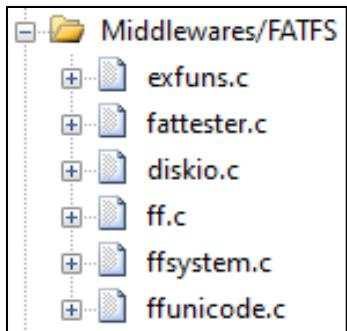  
图7.1.1Middlewares/FATFS分组添加文件

# 3.添加硬件驱动文件

请根据实际的开发板，将SD、SPI、外部FLASH等硬件相关的文件添加到Drivers/BSP分组中。如果工程中缺少HAL库相关的外设驱动，请一并添加到相应的分组！

注意：如果对此步骤不熟悉，请打开FATFS例程，对照着该工程添加。

# 4. 添加LVGL文件系统接口文件

新建 Middlewares/lvgl/src/fadrv 分组，添加 LVGL 工程的 lvgl\src\extra\lib\fsdrv 文件夹下的 lv.fs_fasfs.c 文件，如下图所示：

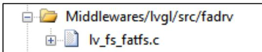

# 5. 添加头文件路径，如下图所示：

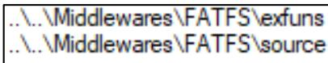  
图7.1.3添加头文件路径  
图7.1.2添加lv_FS_fasfs.c文件

# 6. 打开lv_conf.h文件，使能FATFS文件系统，如下图所示：

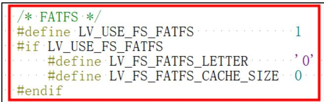  
图7.1.4使能FATFS文件系统

# 7. 打开lv_fsl FATfs.c文件，修改fs_init函数，如下源码所示：

```c
\* @brief 初始化存储设备和文件系统  
\* @param 无  
\* @retval 无  
\*/  
static void fs_init(void)  
{uint8_t res;/\*初始化SD卡和FatFS本身\*最好在自己的库中完成，一遍以后更新\*/while(sd_init()） /\*初始化SD卡\*/{printf("SD Card Error, Please Check!\r\n");LED0_TOGGLE();HAL_Delay(200);1LEDO(0);exfuns_init(); \*/为fatfs相关变量申请内存\*/res  $=$  fmount(fs[0]，"0:"，1)；/\*挂载SD卡\*/if(0！=res){printf("SD Card Mount Fail, Please Check!\r\n");LED0_TOGGLE();HAL_Delay(200);1
```

至此，LVGL文件系统移植完成。

# 7.2 LVGL 文件系统原理解析

LVGL 文件系统和 FATFS 是类似的，它只不过把 FATFS 的相关接口进行了封装，其最终调用的还是 FATFS 文件系统的底层函数，示意图如下：

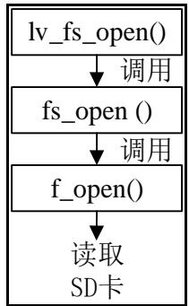  
图7.2.1LVGL文件系统调用流程

由上图可知，当用户在应用层调用lv_FS_open函数时，该函数会调用lv_FS_fatfs.c文件中的fs_open函数，而fs_open函数则会调用FATFS文件系统的接口函数（f_open）。值得注意的是，其他的应用层接口函数调用流程也是类似的。

# 7.2.1 LVGL 文件系统相关的 API 函数

LVGL官方提供了一些与文件系统相关API函数，如下表所示：

表 7.2.1.1 LVGL 文件系统相关 API 函数  

<table><tr><td>函数</td><td>描述</td></tr><tr><td colspan="2">操作文件API</td></tr><tr><td>lv.fs_open()</td><td>打开一个文件</td></tr><tr><td>lv.fs_close()</td><td>关闭一个文件</td></tr><tr><td>lv.fs_read()</td><td>读取文件内容</td></tr><tr><td>lv.fs_write()</td><td>写入数据到文件中</td></tr><tr><td>lv.fs_seek()</td><td>设置&#x27;cursor&#x27;(读/写指针)在文件中的位置</td></tr><tr><td>lv.fs_tell()</td><td>获取读写指针的位置</td></tr><tr><td colspan="2">操作文件夹API</td></tr><tr><td>lv.fs_dir_open()</td><td>打开一个目录</td></tr><tr><td>lv.fs_dir_read()</td><td>读取下一个文件名形成一个目录</td></tr><tr><td>lv.fs_dir_close()</td><td>关闭目录读取</td></tr></table>

# 1.lv_FS_open函数

打开一个文件，其函数原型如下所示：

```c
lv_FS_res_t lv_FS_open(lv_FS_file_t*file_p, const char *path, lv_FS_mode_t mode);
```

该函数的形参，如下表所示：

表 7.2.1.2 lv.fs_open 函数形参描述  

<table><tr><td>参数</td><td colspan="2">描述</td></tr><tr><td>file_p</td><td colspan="2">指向lv.fs_file_t变量的指针</td></tr><tr><td>path</td><td colspan="2">文件路径</td></tr><tr><td rowspan="4">mode</td><td colspan="2">模式选择</td></tr><tr><td>读:FS_MODE_RD</td><td>读模式</td></tr><tr><td>写:FS_MODE_WR</td><td>写模式</td></tr><tr><td>FS_MODE_RD | FS_MODE_WR</td><td>读写模式</td></tr></table>

返回值：LV_FS_RES_OK：成功；其他：失败。

# 2.lv_FS_close函数

关闭一个文件，其函数原型如下所示：

```txt
lv.fs_res_t lv.fs_close(lv.fs_file_t * file_p);
```

该函数的形参，如下表所示：

表 7.2.1.3 lv.fs_close 函数形参描述  

<table><tr><td>参数</td><td>描述</td></tr><tr><td>file_p</td><td>指向lv.fs_file_t变量的指针</td></tr></table>

返回值：LV_FS_RES_OK：成功；其他：失败。

# 3.lv.fs_read函数

读取文件内容，其函数原型如下所示：

```c
lv_FS_res_t lv_FS_read(lv_FS_file_t * file_p, void *buf, uint32_t btr, uint32_t *br);
```

该函数的形参，如下表所示：

表 7.2.1.4 lv.fs_read 函数形参描述  

<table><tr><td>参数</td><td>描述</td></tr><tr><td>file_p</td><td>指向lv.fs_file_t变量的指针</td></tr><tr><td>buf</td><td>指向存储读字节的缓冲区的指针</td></tr><tr><td>btr</td><td>读数据的字节数</td></tr><tr><td>br</td><td>实际读字节数(bytes read)，如果不使用，请传入NULL。</td></tr></table>

返回值：LV_FS_RES_OK：成功；其他：失败。

# 4.lv fs_write函数

写入文件内容，其函数原型如下所示：

```c
lv_FS_res_t lv_FS_write lv_FS_file_t * file_p, const void * buf, uint32_t btw, uint32_t * bw);
```

该函数的形参，如下表所示：

表 7.2.1.5 lv.fs_write 函数形参描述  

<table><tr><td>参数</td><td>描述</td></tr><tr><td>file_p</td><td>指向lv.fs_file_t变量的指针</td></tr><tr><td>buf</td><td>指向要写入字节的缓冲区的指针</td></tr><tr><td>btw</td><td>写数据的字节数</td></tr><tr><td>bw</td><td>实际写入字节数(bytes written)。如果未使用，请传入NULL。</td></tr></table>

返回值：LV_FS_RES_OK：成功；其他：失败。

# 5.lv_FS-seeking函数

设置光标(读/写指针)在文件中的位置，其函数原型如下所示：

```c
lv_FS_res_t lv_FS-seeking(lv_FS_file_t * file_p, uint32_t pos, lv_FS_whence_t whence);
```

该函数的形参，如下表所示：

表 7.2.1.6 lv fs-seeking 函数形参描述  

<table><tr><td>参数</td><td>描述</td></tr><tr><td>file_p</td><td>指向lv.fs_file_t变量的指针</td></tr><tr><td>pos</td><td>索引(0:文件的开始)</td></tr><tr><td>whence</td><td>设置的位置</td></tr></table>

返回值：LV_FS_RES_OK：成功；其他：失败。

# 6.lv fs_tell函数

给出读写指针的位置，其函数原型如下所示：

```c
lv_FS_res_t lv_FS.tell(lv_FS_file_t * file_p, uint32_t * pos);
```

该函数的形参，如下表所示：

表 7.2.1.7 lv_FS.tell 函数形参描述  

<table><tr><td>参数</td><td>描述</td></tr><tr><td>file_p</td><td>指向lv.fs_file_t变量的指针</td></tr><tr><td>pos</td><td>用于存储读写指针位置的指针</td></tr></table>

返回值：LV_FS_RES_OK：成功；其他：失败。

# 7.lv_FS_dir_open函数

打开目录，其函数原型如下所示：

```c
lv_FS_res_t lv_FS_dir_open(lv_FS_dir_t * rddir_p, const char * path);
```

该函数的形参，如下表所示：

表 7.2.1.8 函数 lv.fs_dir_open(   )形参描述  

<table><tr><td>参数</td><td>描述</td></tr><tr><td>rmdir_p</td><td>指向&#x27;lv.fs_dir_t&#x27;变量的指针</td></tr><tr><td>path</td><td>目录路径</td></tr></table>

返回值：LV_FS_RES_OK：成功，其他：失败。

# 8.lv.fs_dir_read函数

从目录中读取下一个文件名，其函数原型如下所示：

```txt
lv.fs_res_t lv.fs_dir_read(lv.fs_dir_t * rddir_p, char * fn);
```

该函数的形参，如下表所示：

表 7.2.1.9 lv.fs_dir_read 函数形参描述  

<table><tr><td>参数</td><td>描述</td></tr><tr><td>rmdir_p</td><td>指向&#x27;lv.fs_dir_t&#x27;变量的指针</td></tr><tr><td>fn</td><td>指向存储文件名的缓冲区的指针</td></tr></table>

返回值：LV_FS_RES_OK：成功；其他：失败。

# 9.lv.fs_dir_close函数

关闭目录，其函数原型如下所示：

```javascript
lv.fs_res_t lv.fs_dir_close(lv.fs_dir_t * rddir_p);
```

该函数的形参，如下表所示：

表 7.2.1.10 lv.fs_dir_close 函数形参描述  

<table><tr><td>参数</td><td>描述</td></tr><tr><td>rddir_p</td><td>指向&#x27;lv.fs_dir_t&#x27;变量的指针</td></tr></table>

返回值：LV_FS_RES_OK：成功；其他：失败。

# 7.3 LVGL 文件系统实验

# 7.3.1 硬件设计

# 1. 例程功能

本实验主要测试LVGL文件系统的文件读取功能。实验现象：SD卡中的测试文件将会被打开并读取其内容，然后把得到的内容打印到串口。与此同时，LED0闪烁，提示系统正在运行。

该实验的完整源码，请参考《LVGL 例程 5 LVGL 文件系统的使用》例程，路径：A 盘  $\rightarrow$  4，程序源码  $\rightarrow$  3，扩展例程  $\rightarrow$  4，LVGL 例程。

注意：DMF407和MiniSTM32不支持本实验。

# 7.3.2 软件设计

# 7.3.2.1 程序流程图

本实验的程序流程图，如下图所示：

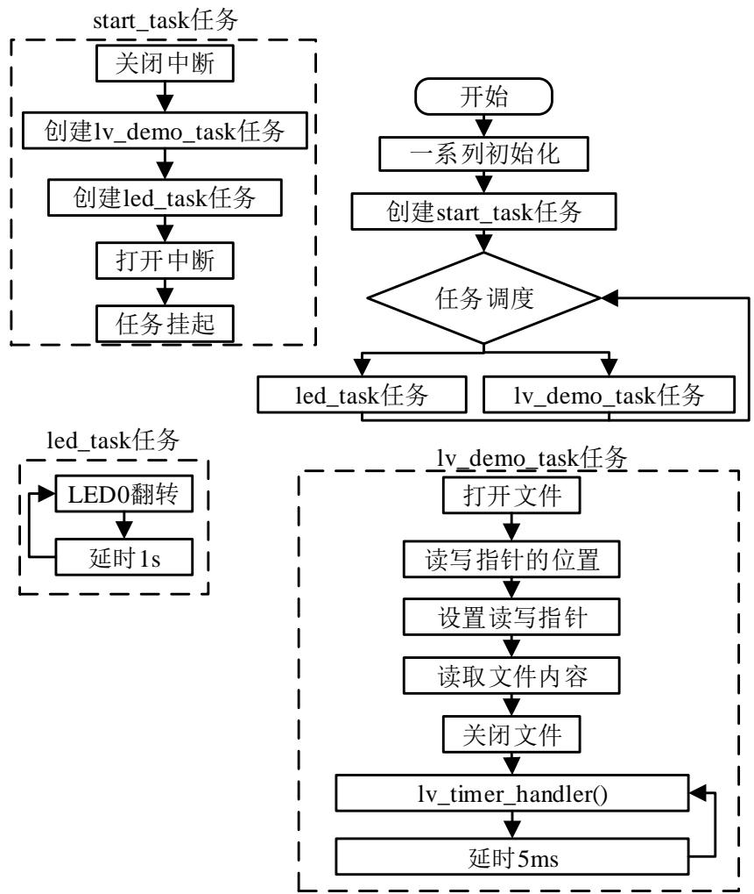  
图7.3.2.1.1LVGL文件系统实验流程图

# 7.3.2.2 程序解析

注意：为了方便管理LVGL相关的用户代码，我们在工程中新建了lv_mainstart.c/h文件，在后续的例程实验中，LVGL相关的用户代码都是在lv_mainstart.c文件中编写的。

LVGL文件系统实验相关的用户代码如下所示：

```c
/\*\* \* @brief 获取指针位置 \* @param fd: 文件指针 \* @return 返回名称   
\*/ long lv.tell(lv.fs_file_t *fd) { uint32_t pos  $= 0$  . lv.fs.tell(fd, &pos); return pos; } /\*\* \* @brief 文件系统测试 \* @param 无 \* @return 无 \*/ static void lv.fs_test(void) { char rbuf[30]  $= \{0\}$  . uint32_t rsize  $= 0$  . lv.fs_file_t fd; lv.fs_res_t res; res  $=$  lv.fs_open(&fd, "0:/SYSTEM/LV_FATFS/Fatfs_test.txt", LV_FS_MODE_RD); if (res != LV_FS_RES_OK) { printf("open 0:/Fatfs_test.txt ERROR\n"); return ; } lv.tell(&fd); lv.fs-seeking(&fd, 0,LV_FS_SEEK_SET); lv.tell(&fd); res  $=$  lv.fs_read(&fd, rbuf, 100, &rsize);
```

```c
if(res != LV_FS_RES_OK) { printf("read ERROR\n"); return; } lv Tell(&fd); printf("READ(%d): %s",rsize, rbuf); lv_FS_close(&fd); } /\*\* \* @brief 文件系统演示 \* @param 无 \* @return 无 \*/ void lv_mainstart(void) { lv_obj_t \*label  $=$  lv_label_create(lv_scr_act()); lv_label_set_text.label, "FATFS TEST"); lv_obj_center.label); lv.fs_test(); }
```

上述源码可分为两个部分：

(1) 标签显示, 此部分用于显示实验名称: FATFS TEST;  
② 文件系统测试，我们首先调用 lv.fs_open 函数打开文件，文件正常打开之后，调用 lv_tell（lv.fs_tell）函数，获取指针的位置，然后再调用 lv.fs_read 函数，读取文件内容，文件内容读取成功后，将其打印到串口，最后调用 lv.fs_close 函数关闭文件。

# 7.3.3 下载验证

注意：在验证本实验代码之前，请将“LVGL 实验所需 SD 卡文件”文件夹（路径：A 盘  $\rightarrow 4$ ，程序源码  $\rightarrow 3$ ，扩展例程  $\rightarrow 4$ ，LVGL 例程）中的内容复制到 SD 卡的根目录，并将 SD 卡插入开发板中。

编译工程并下载到开发板中，当程序正常运行之后，屏幕上会显示“FATFS TEST”，读取到的文件内容将打印到串口，如下图所示：

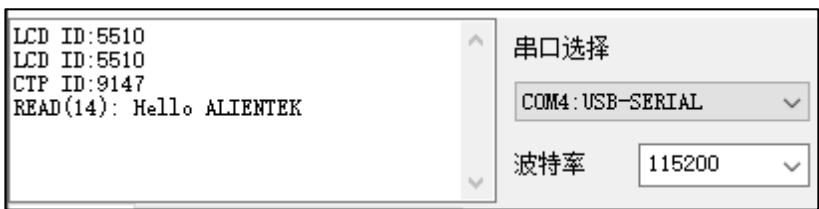  
图7.3.3.1文件系统实验现象

# 第八章 LVGL 字库使用

LVGL 的字体功能是较为强大的：支持 UTF-8 编码、图标字体、自定义字体、最高 8bpp 的抗锯齿，等等。值得注意的是，bpp 值越大，字体的边缘会越平滑，但其对内存的占用就越多，在界面上进行字体渲染时，绘制速度也会越慢，一般的项目，采用 4bpp 就足够了。

本章节将分为以下几个小节：

8.1启用UTF-8编码  
8.2 使用LVGL内置图标字体  
8.3 使用LVGL内部字库  
8.4 使用自定义字库

# 8.1启用UTF-8编码

LVGL支持2种编码方式：第一种是ASCII编码，这种编码只支持英文字符的显示；第二种是UTF-8编码，这种编码可以支持全球所有字符的显示。用户需要在LVGL工程中启用UTF-8编码，可以打开lv_conf.h文件，修改LV.TXT_ENC配置项，如下源码所示：

```c
/\*为字符串选择字符编码.  
\*IDE或编辑器应该具有相同的字符编码  
\*1.-LV.TXT_ENC_UTF8  
\*2.-LV.TXT_ENCASCII  
\**/  
#define LV.TXT_ENC LV.TXT_ENC_UTF8
```

这里建议大家将MDK软件设置为ChineseGB2312编码，以更好地兼容中文。

# 8.2 使用LVGL内置图标字体

图标字体是 web 前端中流行的一种技术，它以字体的形式，呈现出一个单色的图标。在 LVGL 中，自带了许多常用图标字体，这极大地方便了用户的界面开发。大家需要使用这些图标字体，可以打开 lv_SYMBOL_def.h 文件，查找相应的图标字体枚举，所有枚举如下源码所示：

```c
define LV_SYMBOL=AUDIO "\\xef\\x80\\x81" /*61441, 0xF001*/  
#define LV_SYMBOL Video "\\xef\\x80\\x88" /*61448, 0xF008*/  
#define LV_SYMBOL_LIST "\\xef\\x80\\x8b" /*61451, 0xF00B*/  
#define LV_SYMBOL_OK "\\xef\\x80\\x8c" /*61452, 0xF00C*/  
#define LV_SYMBOL_CLOSE "\\xef\\x80\\x8d" /*61453, 0xF00D*/  
#define LV_SYMBOL_POWER "\\xef\\x80\\x91" /*61457, 0xF011*/  
#define LV_SYMBOL_settings "\\xef\\x80\\x93" /*61459, 0xF013*/  
#define LV_SYMBOL_HOME "\\xef\\x80\\x95" /*61461, 0xF015*/  
#define LV_SYMBOL_DOWNLOAD "\\xef\\x80\\x99" /*61465, 0xF019*/  
#define LV_SYMBOL_DRIVE "\\xef\\x80\\x9c" /*61468, 0xF01C*/  
#define LV_SYMBOL_REFRESH "\\xef\\x80\\xa1" /*61473, 0xF021*/  
#define LV_SYMBOL_MUTE "\\xef\\x80\\xa6" /*61478, 0xF026*/  
#define LV_SYMBOL_volume_MID "\\xef\\x80\\xa7" /*61479, 0xF027*/  
#define LV_SYMBOL_volume_MAX "\\xef\\x80\\xa8" /*61480, 0xF028*/
```

```m4
define LV_SYMBOL_IMAGE
#define LV_SYMBOL Editing
#define LV_SYMBOL_PREV
#define LV_SYMBOL.Play
#define LV_SYMBOL_PAUSE
#define LV_SYMBOL_PAUSE
#define LV_SYMBOL_STOP
#define LV_SYMBOL_NEXT
#define LV_SYMBOL_EJECT
#define LV_SYMBOL_LEFT
#define LV_SYMBOL_RIGHT
#define LV_SYMBOL_PLUS
#define LV_SYMBOL_MINUS
#define LV_SYMBOL_MINUS
#define LV_SYMBOL_MINUS
#define LV_SYMBOL_MINUS
#define LV_SYMBOL_MINUS
#define LV_SYMBOL_MINUS
#define LV_SYMBOL_MINUS
#define LV_SYMBOL_MINUS
#define LV_SYMBOL_MINUS
#define LV_SYMBOL_MINUS
#define LV_SYMBOL_MINUS
#define LV_SYMBOL_MINUS
#define LV_SYMBOL_MINUS
#define LV_SYMBOL_MINUS
#define LV_SYMBOL_MINUS
#define LV_SYMBOL_MINUS
#define LV_SYMBOL_MINUS
#define LV_SYMBOL_MINUS
#define LV_SYMBOL_MINUS
#define LV_SYMBOL_MINUS
#define LV_SYMBOL_PLUS
#define LV_SYMBOL_MINUS
#define LV_SYMBOL_MINUS
#define LV_SYMBOL_MINUS
#define LV_SYMBOL_MINUS
#define LV_SYMBOL_MINUS
#define LV_SYMBOL_MINUS
#define LV_SYMBOL_MINUS
#define LV_SYMBOL_MINUS
#define LV_SYMBOL_MINUS
#define LV_SYMBOL_MINUS
#define LV_SYMBOL_MINUS
#define LV_SYMBOL_MINUS
#define LV_SYMBOL_MINUS
#define LV_SYMBOL_MINUS
#define LV_SYMBOL_MINUS
#define LV_SYMBOL_MINUS
#define LV_SYMBOL_MINUS
#define LV_SYMBOL_MINUS
#define LV_SYMBOL_PLUS
#define LV_SYMBOL_PLUS
#define LV_SYMBOL_PLUS
#define LV_SYMBOL_PLUS
#define LV_SYMBOL_PLUS
#define LV_SYMBOL_PLUS
#define LV_SYMBOL_PLUS
#define LV_SYMBOL_PLUS
#define LV_SYMBOL_PLUS
#define LV_SYMBOL_PLUS
#define LV_SYMBOL_PLUS
#define LV_SYMBOL_PLUS
#define LV_SYMBOL_PLUS
#define LV_SYMBOL_PLUS
#define LV_SYMBOL_PLUS
#define LV_SYMBOL_PLUS
#define LV_SYMBOL_PLUS
#define LV_SYMBOL_PLUS
#define LV_SYMBOL_PLUS
#define LV SYMBOL_UP
#define LV_SYMBOL_DOWN
#define LV_SYMBOL_DOWN
#define LV_SYMBOL_DOWN
#define LV_SYMBOL_DOWN
#define LV_SYMBOL_DOWN
#define LV_SYMBOL_DOWN
#define LV_SYMBOL_DOWN
#define LV_SYMBOL_DOWN
#define LV_SYMBOL_DOWN
#define LV_SYMBOL_DOWN
#define LVymbolslistsupload
#define LVymbolslistsdown
#define LVymbolslistsupdown
#define LVymbolslistsdown
```

```c
define LV_SYMBOL_DUMMY "\xEF\xA3\xBF" #define LV_SYMBOL_BULLET "\xE2\x80\xA2" /*20042, 0x2022*/
```

当用户调用上述的图标字体枚举，它们将显示成图标，如下图所示：

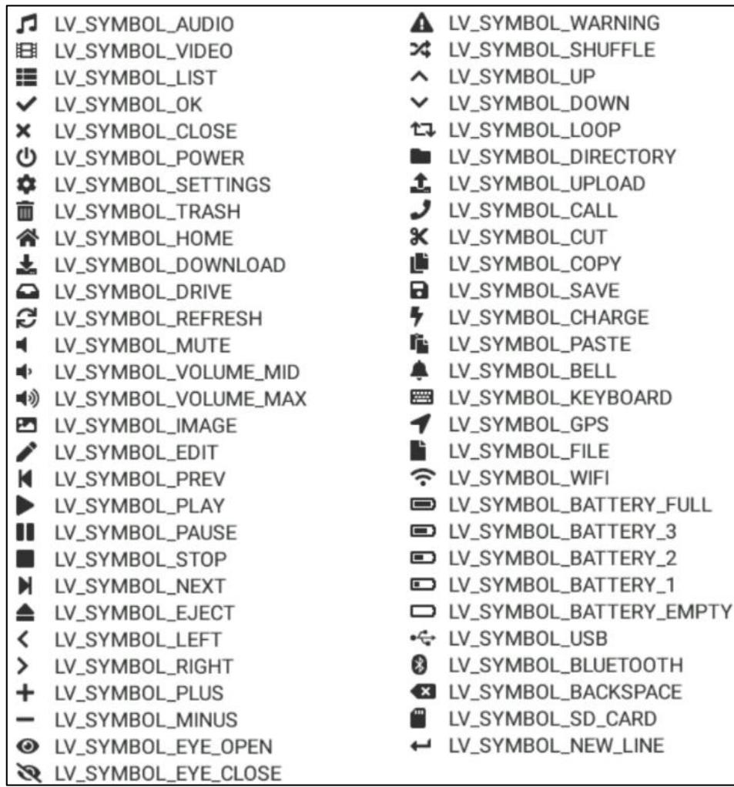  
图8.2.1LVGL内置图标字体

接下来，我们介绍图标字体的使用方法，示例代码如下：

```javascript
void lv_mainstart(void)   
{ lv_obj_t \*label  $=$  lv_label_createLv_scr_act(); lv_label_set_text.label，LV_SYMBOL=AUDIO"AUDIO");
```

由上述源码可知，图标字体的使用方法很简单，用户只需要在设置文本的函数中直接调用相应的枚举即可，示例代码的效果如下图所示：

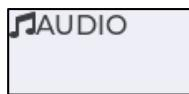  
图8.2.2LVGL图标字体示例

# 8.3 使用LVGL内部字库

LVGL 提供了一套内置的字库，这些字库在移植的时候已经被添加到工程当中，我们打开 Middlewares/lvgl/srcFONT 分组，即可找到这些字库文件，如下图所示：

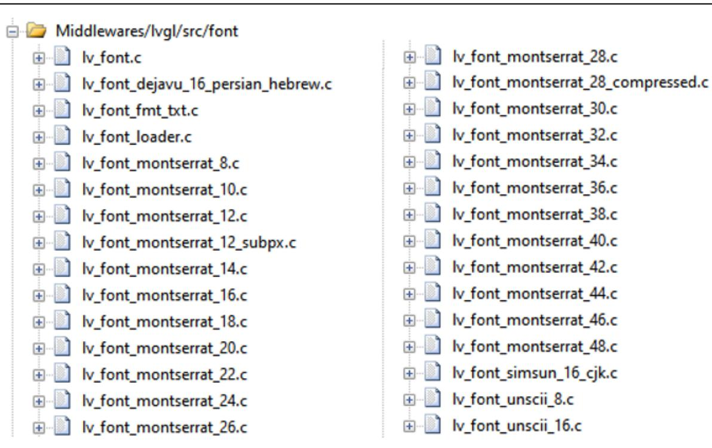  
图8.3.1LVGL内置字库

接下来，我们介绍LVGL内部字库的使用流程：

# 1.使能字库

打开lv_conf.h文件，将所需要使用的内部字库使能（宏定义置1），如下图所示：

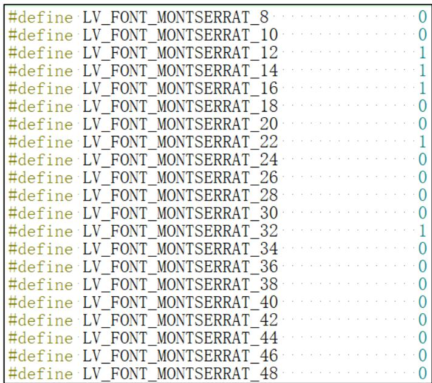  
图8.3.2 内部字库使能/失能

# 2.调用字库

使能了内部字库之后，用户就可以直接在字体设置函数中调用相应的字库了。这里我们结合源码，帮助大家理解内部字库的调用，示例代码如下：

```lisp
void lv_mainstart(void)   
{ lv_obj_t\* label  $=$  lv_label_createLv_scr_act(); lv_obj_set_style_text.Font.label,&lv_font_montserrat_16,LV_STATE_DEFAULT); lv_label_set_text.label,"Hello ALIENTEK！！！"）;   
}
```

在上述代码中，调用了lv_obj_set_style_text.Font函数，并在该函数中设置了16号字体（lv.Font_montserrat_16），如果大家需要设置其他的内部字体，只需要修改一下后缀即可，例如：18号字体为lv.Font_montserrat_18，以此类推。值得注意的是，字号越大，文字越大，但其占用的内存也越多。示例代码的效果如下图所示：

  
图8.3.3LVGL内置字库示例

# 8.4 使用自定义字库

在LVGL中，用户需要使用自定义的字库，其实现方法可分为两类：

(1) 通过 C 语言数组（内部读取）；  
(2) 通过文件系统读取字库（外部读取）。

# 8.4.1 C语言数组字库（内部）

使用C语言数组的方式来读取字库是非常便捷的，工程中需要配置的地方很少，这对于初学者来说非常友好。接下来，我们介绍三种使用C语言数组读取字库的方法：

# 方法一：

使用LVGL官方的在线字体转换工具（网址：https://lvgl.io/tools/fontconverter），将字库文件（例如TTF）转换成C语言数组字体文件，然后将其添加到工程中，声明字体后即可调用。值得注意的是，由于该工具是在线的，且服务器在国外，因此有可能出现转换失败的情况。当我们打开上述的转换工具网址后，界面如下图所示（实际页面没有红色的注释）：

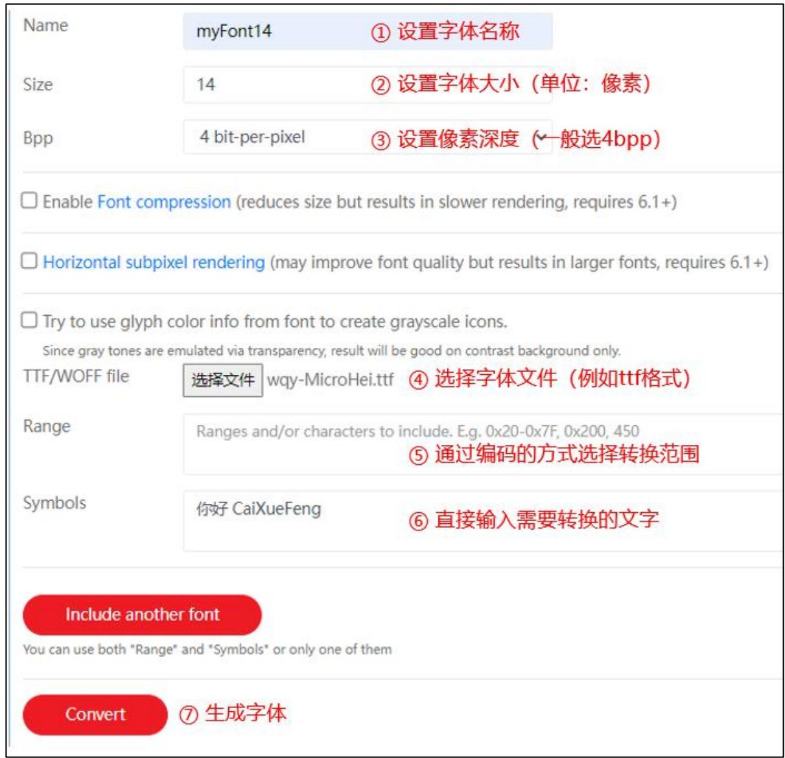

# 8.4.1.1 在线转换工具界面

由上图可知，使用在线转换工具生成字体一共需要七步：

① 在“Name”选项中填入字体名称。注意：该名称在声明字体的时候需要用到，请不要使用中文名称；  
② 在“Size”选项中填入字体的尺寸，这里是以像素为单位的；  
(3) 在 “Bpp” 选项中选择像素深度, 注意: 该值越大, 则抗锯齿效果越好, 但是对内存的占用也会越高, 一般的工程选择 4bpp 即可;  
④ 选择字体文件，例如ttf、otf格式的文件；  
⑤ 在“Range”选项中填入文字编码范围，以确定字体的转换范围。基本汉字的编码范围是0x4E00- 0x9FA5，数字、拉丁字母、标点符号的编码范围是0x20- 0x7E，这两个范围内已经涵盖了两万多个字符，可以满足绝大部分的使用场景。关于文字的编码，大家感兴趣的话可以在网上了解一下。注意：转换的范围越大，字库所占用的内存就越高，在该选项中，建议大家只填0x20- 0x7E。  
⑥ 在“Symbols”选项中直接填入需要转换的文字。我们一般会将需要转换的汉字填入该选项；  
⑦ 点击“Convert”，即可生成字体文件（后缀为.c）。

当我们得到了字体文件之后，需要将其添加到工程中，然后声明字体即可调用，示例代码如下：

```txt
LVFONTDeclare(myFont14) /\*声明字体\*/   
void lv_mainstart(void)   
{ lv_obj_t \*font_label  $=$  lv_label_createLv_scr_act(); lv_obj_set_style_text.Font(font_label，&my_Font14，LV_STATE_DEFAULT); lv_label_set_text(font_label，"你好"); lv_obj_center(font_label);   
}
```

# 方法二：

利用离线字体转换软件（V0.5 版本），将中文字库转化为 C 语言数组文件。在这里，我们由衷地感谢网友【阿里】，其开发的离线转换软件可以帮助用户轻松地生成 LVGL 字库，大家可以在他的博客网址（http://dz.lfly.xyz/forum.php）中下载字体转换软件。

接下来，我们介绍该软件的使用方法：

1. 打开 LvglFontTool V0.5 软件（路径：A 盘  $\rightarrow 6$  ，软件资料  $\rightarrow 14 / 15$  ，LVGL 学习资料  $\rightarrow$  LVGL 使用工具），进入软件主界面后点击“选择字体”，如下图所示：

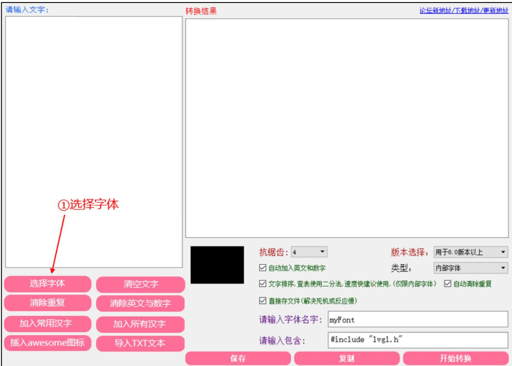  
图8.4.1.2LvglFontTool0.5软件主界面

2. 在弹窗中选择所需字体，如下图所示：

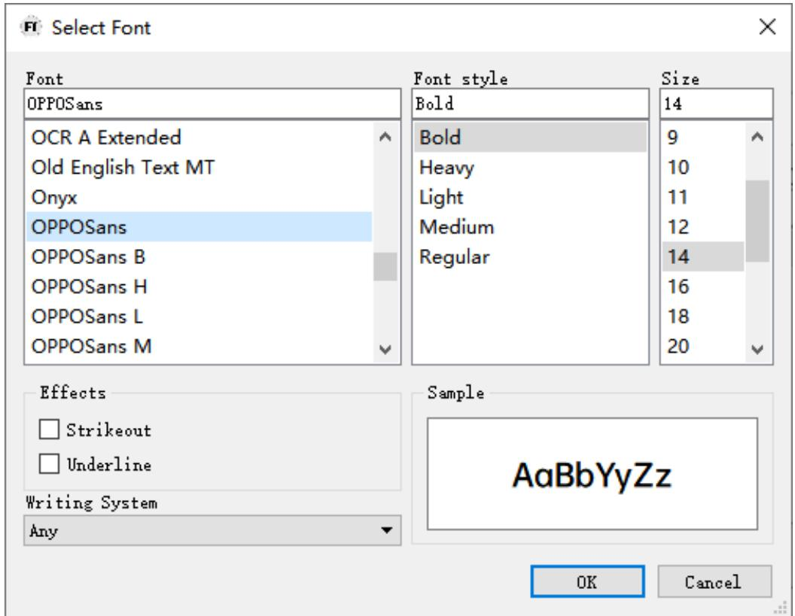  
图8.4.1.3 选择字体

3. 加入常用汉字，如下图所示：

  
图8.4.1.4添加汉字

4.选择LVGL版本、字体类型，设置字体名称，如下图所示：

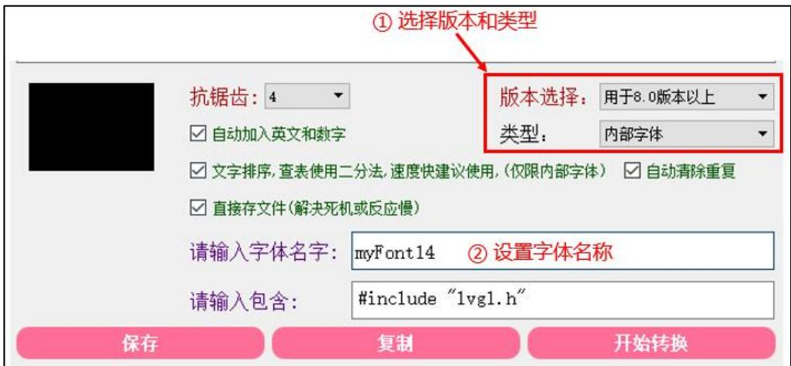  
图8.4.1.5设置转换参数

5. 点击“开始转换”，在弹窗中选择文件路径并点击“保存”。等待转换完成，将会得到一个.c 文件，该文件即字体文件。

在得到字体文件之后，我们将其添加到工程中，然后声明字体即可调用，具体示例请参考方法一或者“LVGL 例程 6 LVGL 内部字库读取”实验。

# 方法三：

利用离线字体转换软件（V0.4版本），将中文字库转化为C语言数组文件。与方法二不同的是，我们此处使用的是自选的TTF字体文件（V0.4版本软件支持该功能），具体的使用方法如下：

1. 打开 LvglFontTool V0.4 软件（路径：A 盘  $\rightarrow 6$  ，软件资料  $\rightarrow 14 / 15$  ，LVGL 学习资料  $\rightarrow$  LVGL 使用工具），进入软件主界面后点击“选择字体”，如下图所示：

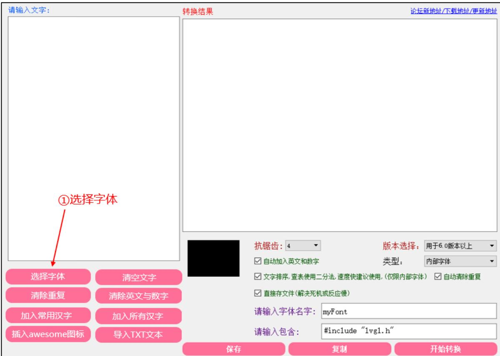  
图8.4.1.6LvglFontTool0.4软件主界面

2. 在弹窗中选择所需的 TTF 字体，设置字体大小，如下图所示：

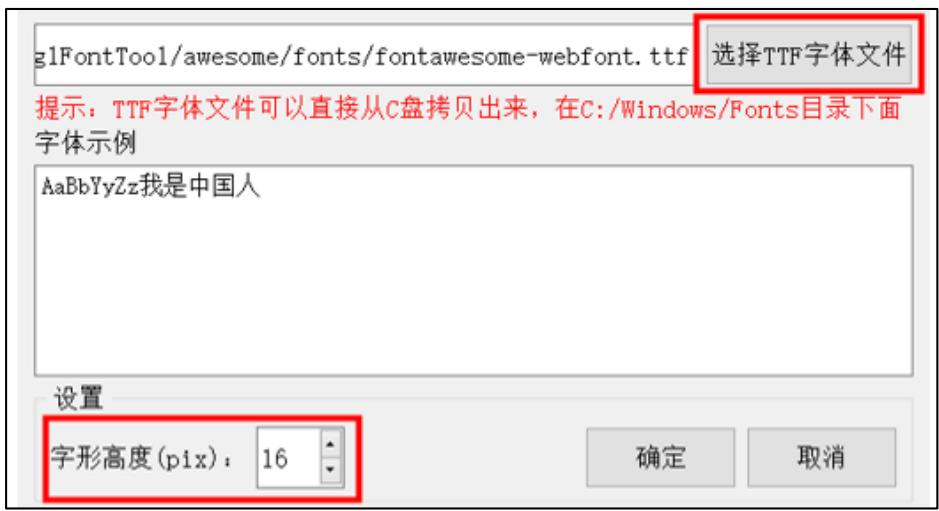  
图8.4.1.7 选择字体和设置大小

3. 添加常用的汉字，如下图所示：

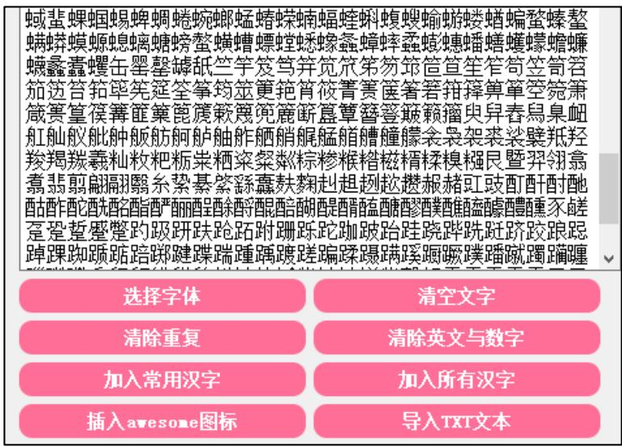  
图8.4.1.8加入常用汉字

4. 选择LVGL版本、字体类型，设置字体名称，如下图所示：

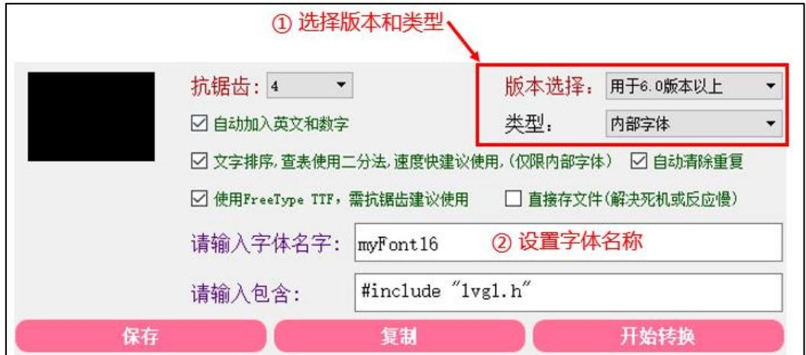  
图8.4.1.9设置转换参数

5. 点击“开始转换”，等待转换完成后，点击“保存”即可得到一个.c文件，该文件即字体文件。

在得到字体文件之后，我们将其添加到工程中，然后声明字体即可调用，具体示例请参考方法一或者“LVGL 例程 6 LVGL 内部字库读取”实验。

# 8.4.2 文件系统读取字库（外部）

在上一小节中，我们都是使用C语言数组的方式生成字库，该方法虽然简单，但其也存在一定的弊端：如果MCU的内存较小，而工程中需要使用的文字较多，此时，再用C语言数组的方式生成字库就不太现实了。

为了解决上述的问题，下面给大家介绍如何使用文件系统来读取外部字体。我们这里用到的依旧是网友【阿里】的离线字体转换软件（V0.5 版本），外部字库的使用流程如下：

1. 打开 LvglFontTool V0.5 软件（路径：A 盘  $\rightarrow 6$  ，软件资料  $\rightarrow 14 / 15$  ，LVGL 学习资料  $\rightarrow$  LVGL 使用工具），进入软件主界面后点击“选择字体”，如下图所示：

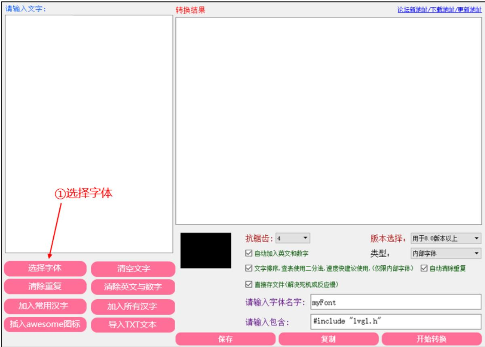  
图8.4.2.1LvglFontTool0.5软件主界面

2. 在弹窗中选择所需字体，如下图所示：

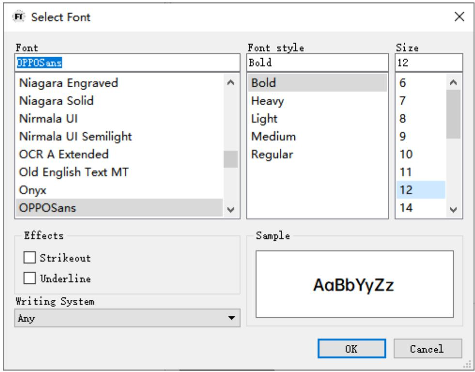  
图8.4.2.2 选择字库

3. 加入常用汉字，如下图所示：

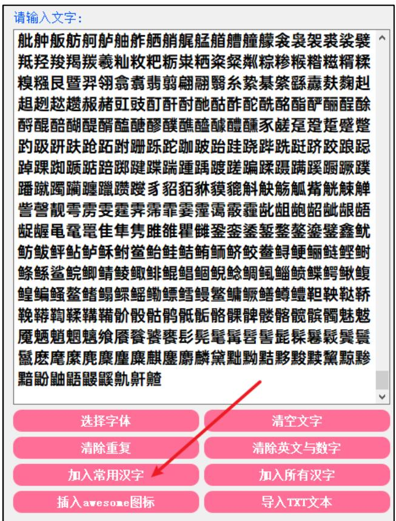  
图8.4.2.3添加常用汉字

4. 选择版本、类型（XBF，外部 bin 文件），设置字体名称，如下图所示：

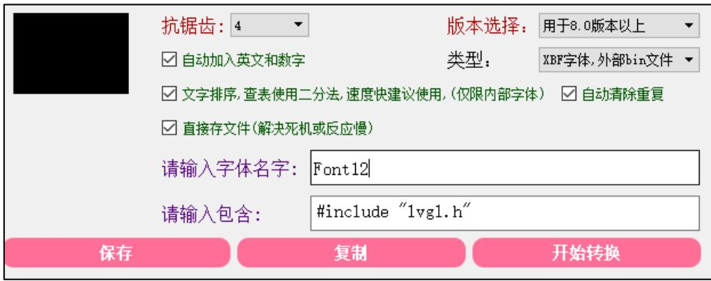  
图8.4.2.4添加外部字库文件

5. 点击“开始转换”，在弹窗中选择文件路径并点击“保存”。等待转换完成，将会得到两个文件，它们的后缀分别为.c 和.bin。我们把.c 文件添加到工程中，而.bin 文件则放到 SD 卡里面（建议路径：根目录  $\rightarrow$  SYSTEM  $\rightarrow$  LVFONT）。  
6. 打开工程，找到上一步添加的字体文件（例如示例中的 Font12.c），修改 __user_font_getdata 函数，如下源码所示：

```c
static uint8_t \*__user_font_getdata(int offset, int size){ /\*如字模保存在SPI FLASH，SPIFLASH_Read(_g.Font_buf,offset,size); 如字模已加载到SDRAM,直接返回偏移地址即可如:return (uint8_t\*) (sdram.Fontaddr+offset); \*/ norflash_ex_read(_g.Font_buf,ftinfo.lvgl_12addr +offset,size); return _g.Font_buf; }
```

注意：上述源码是以 Mini Pro H750 开发板为例的，其他的开发板用户请根据实际的开发板例程来修改。

7. 添加汉字显示相关的 TEXT 文件，如下图所示：

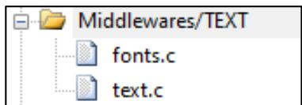  
图8.4.2.5添加TEXT文件

注意：汉字显示相关的4个文件（font.c/h和text.c/h），可以在“汉字显示实验”例程的Middlewares/TEXT目录中复制。

8. 修改 fonts.h 文件，如下源码所示：

```txt
/\* 字体信息保存首地址\*占41个字节，第1个字节用于标记字库是否存在.后续每8个字节一组，分别保存起始地址和文件大小\*/extern uint32_t FONTINFOADDR;\*\*字库信息结构体定义\*用来保存字库基本信息，地址，大小等\*/typedefPACKEDSTRUCT{
```

```c
uint8_t fontok; /\*字库存在标志，0XAA，字库正常；其他，字库不存在\*/  
uint32_t ugbkaddr; /\*unigbk的地址\*/  
uint32_t ugbksize; /\*unigbk的大小\*/  
uint32_t f12addr; /\*gbk12地址\*/  
uint32_t gbk12size; /\*gbk12的大小\*/  
uint32_t f16addr; /\*gbk16地址\*/  
uint32_t gbk16size; /\*gbk16的大小\*/  
uint32_t f24addr; /\*gbk24地址\*/  
uint32_t gbk24size; /\*gbk24的大小\*/  
uint32_t f32addr; /\*gbk32地址\*/  
uint32_t gbk32size; /\*gbk32的大小\*/  
uint32_t lvgl_12addr; /\*LVGL12地址\*/  
uint32_t lvgl_12size; /\*LVGL12的大小\*/  
uint32_t lvgl_24addr; /\*LVGL24地址\*/  
uint32_t lvgl_24size; /\*LVGL24的大小\*/  
uint32_t lvgl_36addr; /\*LVGL36地址\*/  
uint32_t lvgl_36size; /\*LVGL36的大小\*/  
} _font_info;
```

9. 修改 fonts.c 文件中的 FONT_GBK_PATH 和 FONT_UPDATE_REMIND_TB 数组，如下源码所示：

```c
/* 字库存放在磁盘中的路径 */
char *const FONT_GBK_PATH[8] =
{
    "/SYSTEMFONT/UNIGBK BIN", /* UNIGBK BIN 的存放位置 */
    "/SYSTEMFONT/GBK12.FON", /* GBK12 的存放位置 */
    "/SYSTEMFONT/GBK16.FON", /* GBK16 的存放位置 */
    "/SYSTEMFONT/GBK24.FON", /* GBK24 的存放位置 */
    "/SYSTEMFONT/GBK32.FON", /* GBK32 的存放位置 */
    "/SYSTEM/LVFONT/Font12 BIN", /* Font12 的存放位置 */
    "/SYSTEM/LVFONT/Font24 BIN", /* Font24 的存放位置 */
    "/SYSTEM/LVFONT/Font36 BIN", /* Font36 的存放位置 */
};
/* 更新时的提示信息 */
char *const FONT_UPDATE_REMIND_TBL[8] =
{
    "Updating UNIGBK BIN", /* 提示正在更新 UNIGBK.bin */
    "Updating GBK12.FON ", /* 提示正在更新 GBK12 */
    "Updating GBK16.FON ", /* 提示正在更新 GBK16 */
    "Updating GBK24.FON ", /* 提示正在更新 GBK24 */
    "Updating GBK32.FON ", /* 提示正在更新 GBK32 */
};
```

```javascript
"Updating Font12.BIN", /* 提示正在更新 Font12 */
"Updating Font24.BIN", /* 提示正在更新 Font24 */
"Updating Font36.BIN", /* 提示正在更新 Font36 */ };
```

10. 修改 fonts.c 文件中的 fonts_update.Fontx 函数，如下源码所示：

```c
\* @brief 更新某一个字库  
\* @param x, y : 提示信息的显示地址  
\* @param size : 提示信息字体大小  
\* @param fpath : 字体路径  
\* @param fx : 更新的内容  
\* @arg 0, ungbk;  
\* @Arg 1, qbk12;  
\* @arg 2, qbk16;  
\* @arg 3, qbk24;  
\* @arg 4, qbk32;  
\* @param color : 字体颜色  
\* @retval 0, 成功；其他，错误代码；  
*/  
static uint8_t fonts_update.Fontx( uint16_t x, uint16_t y, uint8_t size, uint8_t *fpath, uint8_t fx, uint16_t color)  
{  
    uint32_t flashaddr = 0;  
    FIL *fftemp;  
    uint8_t *tempbuf;  
    uint8_t res;  
    uint16_t bread;  
    uint32_t offx = 0;  
    uint8_t rval = 0;  
    fftemp = (FIL *)mymalloc(SRAMIN, sizeof(FIL)); /* 分配内存 */  
    if (fftemp == NULL)rval = 1;  
    tempbuf = mymalloc(SRAMIN, 4096); /* 分配4096个字节空间 */  
    if (tempbuf == NULL)rval = 1;  
    res = f_open(fftemp, (const TCHAR *)fpath, FA_READ);
```

```javascript
if(res)rval  $= 2$  ：/\*打开文件失败\*/  
if(rval  $\equiv = 0$  ）{switch (fx){case0：/\*更新UNIGBK.BIN\*//\*信息头之后，紧跟UNIGBK转换码表\*/ftinfo.ugbkaddr  $=$  FONTINFOADDR  $^+$  sizeof(ftinfo);ftinfo.ugbksize  $=$  fftemp->obj objsize; /\*UNIGBK大小\*/flashaddr  $=$  ftinfo.ugbkaddr;break;  
case1：/\*更新GBK12.BIN\*//\*UNIGBK之后，紧跟GBK12字库\*/ftinfo.f12addr  $=$  ftinfo.ugbkaddr  $^+$  ftinfo.ugbksize;ftinfo.ubk12size  $=$  fftemp->obj objsize; /\*GBK12字库大小\*/flashaddr  $=$  ftinfo.f12addr; /\*GBK12的起始地址\*/break;  
case2：/\*更新GBK16.BIN\*//\*GBK12之后，紧跟GBK16字库\*/ftinfo.f16addr  $=$  ftinfo.f12addr  $^+$  ftinfo.ubk12size;ftinfo.ubk16size  $=$  fftemp->obj objsize; /\*GBK16字库大小\*/flashaddr  $=$  ftinfo.f16addr; /\*GBK16的起始地址\*/break;  
case3：/\*更新GBK24.BIN\*//\*GBK16之后，紧跟GBK24字库\*/ftinfo.f24addr  $=$  ftinfo.f16addr  $^+$  ftinfo.ubk16size;ftinfo.ubk24size  $=$  fftemp->obj objsize; /\*GBK24字库大小\*/flashaddr  $=$  ftinfo.f24addr; /\*GBK24的起始地址\*/break;  
case4：/\*更新GBK32.BIN\*//\*GBK24之后，紧跟GBK32字库\*/ftinfo.f32addr  $=$  ftinfo.f24addr  $^+$  ftinfo.ubk24size;ftinfo.ubk32size  $=$  fftemp->obj objsize; /\*GBK32字库大小\*/flashaddr  $=$  ftinfo.f32addr; /\*GBK32的起始地址\*/break;  
case5：/\*更新LVGL12.BIN\*/(1)ftinfo.lvgl_12addr=ftinfo.f32addr+ftinfo.ubk32size;ftinfo.lvgl_12size=fftemp->obj objsize;
```

```javascript
flashaddr=ftinfo.lvgl_12addr; break; case 6:/\*更新LVGL24.BIN \*/ (2) ftinfo.lvgl_24addr=ftinfo.lvgl_12addr+ftinfo.lvgl_12size; ftinfo.lvgl_24size=fftemp->obj objsize; flashaddr=ftinfo.lvgl_24addr; break; case 7:/\*更新LVGL36.BIN \*/ (3) ftinfo.lvgl_36addr=ftinfo.lvgl_24addr+ftinfo.lvgl_24size; ftinfo.lvgl_36size=fftemp->obj objsize; flashaddr=ftinfo.lvgl_36addr; break; } while(res  $= =$  FR_OK）/\*死循环执行\*/ { res  $=$  f_read(fftemp, tempbuf, 4096, (UINT \*)&bread); /\*读取数据\*/ if(res！  $= =$  FR_OK)break;/\*执行错误\*/ /\*从0开始写入bread个数据\*/ norflash_ex_write(tempbuf, offx  $^+$  flashaddr,bread); offx  $+ =$  bread; /\*进度显示\*/ fonts_progress_show(x,y,size,fftemp->obj objsize,offx,color); if(bread！  $= =$  4096)break;/\*读完了.\*/ } f_close(fftemp); } myfree(SRAMIN，fftemp); /\*释放内存\*/ myfree(SRAMIN，tempbuf); /\*释放内存\*/ return res;
```

上述源码中的(1)~(3)处是新增的内容。

10. 修改 fonts.c 文件中的 fonts_update.Font 函数，如下源码所示：

/

\*@brief 更新字体文件  
\* @note 所有字库一起更新(UNIGBK,GBK12,GBK16,GBK24,GBK32)  
\* @param x，y ：提示信息的显示地址  
\* @param size ：提示信息字体大小  
\* @param src : 字库来源磁盘

```c
\* @arg "0:"，SD卡；  
\* @Arg "1:"，FLASH盘  
\* @arg "2:"，U盘  
\* @param color ：字体颜色  
\* @retval 0，成功；其他，错误代码；  
\*/  
uint8_t fonts_update.Font( uint16_t x, uint16_t y, uint8_t size, uint8_t *src, uint16_t color)  
{  
    uint8_t *pname;  
    uint32_t *buf;  
    uint8_t res = 0;  
    uint16_t i, j;  
    FIL *fftemp;  
    uint8_t rval = 0;  
    res = 0XFF;  
    ftinfoFONTOK = 0XFF;  
    pname = mymalloc(SRAMIN, 100); /*申请100字节内存*/  
    buf = mymalloc(SRAMIN, 4096); /*申请4K字节内存*/  
    fftemp = (FIL *)mymalloc(SRAMIN, sizeof(FIL)); /*分配内存*/  
if (buf == NULL || pname == NULL || fftemp == NULL)  
{  
    myfree(SRAMIN, fftemp);  
    myfree(SRAMIN, pname);  
    myfree(SRAMIN, buf);  
    return 5; /*内存申请失败*/  
}  
/*先查找文件UNIGBK, GBK12, GBK16, GBK24, GBK32, LVGL12.BIN, LVGL24.BIN, LVGL36BIN是否正常*/  
for (i = 0; i < 8; i++) (1)  
{  
    strcpy(char *)pname, (char *)src); /*copy src内容到pname*/  
strcat(char *)pname, (char *)FONT_GBK_PATH[i]); /*追加具体文件路径*/  
res = f_open(fftemp, (const TCHAR *)pname, FA_READ); /*尝试打开*/  
if (res)  
{  
    rval |= 1 << 7; /*标记打开文件失败*/  
break; /*出错了，直接退出*/
```

```c
}   
}   
myfree(SRAMIN, fftemp); /* 释放内存 */   
if (rval == 0) /* 字库文件都存在. */   
{ /* 提示正在擦除扇区 */ lcd_show_string(x, y, 240, 320, size, "Erasing sectors... ", color); for  $(\mathrm{i} = 0;\mathrm{i}<$  FONTSECSIZE; i++) /* 先擦除字库区域，提高写入速度 */ { /* 进度显示 */ fonts_progress_show(x + 20 * size / 2, y, size, FONTSECSIZE, i, color); /* 读出整个扇区的内容 */ norflash_ex_read((uint8_t *)buf, ((FONTINFOADDR / 4096)+i) * 4096, 4096); for  $(\mathrm{j} = 0;\mathrm{j}< 1024;\mathrm{j}++)$  /* 校验数据 */ { if (buf[j] != 0XFFFFFF) break; /* 需要擦除 */ } if  $(\mathrm{j} != 1024)$  { /* 需要擦除的扇区 */ norflash_ex_erase_section((FONTINFOADDR / 4096) + i); } } /* 依次更新UNIGBK, GBK12, GBK16, GBK24, GBK32, LVGL12.BIN, LVGL24.BIN, LVGL36BIN */ for  $(\mathrm{i} = 0;\mathrm{i}< 8;\mathrm{i}++)$  { lcd/show_string(x, y, 240, 320, size, FONT_UPDATE_REMIND_TB[i], color); strcpy((char *)pname, (char *)src); strcat((char *)pname, (char *)FONT_GBK_PATH[i]); res = fonts_update.Fontx(x + 20 * size / 2, y, size, pname, i, color);
```

```c
if(res)   
{ myfree(SRAMIN，buf); myfree(SRAMIN，pname); return1+i; } /\*全部更新好了\*/ ftinfo)fontok  $\equiv$  0XAA; /\*保存字库信息\*/ norflash_ex_write((uint8_t\*)&ftinfo，FONTINFOADDR,sizeof(ftinfo));   
} myfree(SRAMIN，pname）；/\*释放内存\*/ myfree(SRAMIN，buf); returnrval; /\*无错误.\*/
```

上述源码中，标识(1)代表的是新增的内容。

11. 打开 lv_conf.h 文件，找到 LVFONT.CustomOM_DECLARE 配置项，声明该字体，如下源码所示：

```elixir
define LVFONT.CustomOM.Declare LVFONT.Declare(Font12)
```

12. 编写示例代码：

```txt
void lv_mainstart(void)   
{ lv_obj_t\* label  $=$  lv_label_createLv_scr_act(); lv_obj_set_style_text.Font.label,&Font12,LV_STATE_DEFAULT); lv_label_set_text.label,"Hello ALIENTEK!!!!");   
}
```

示例代码效果如下图所示：

  
图8.4.2.6外部字库读取示例

# 部件篇

功夫不负有心人，学习至此，相信你已经掌握了基础篇所介绍的知识。本篇我们将和大家一起来学习LVGL的各种部件，这些小部件是GUI的重要组成部分，希望大家可以认真学习和掌握，以便将来更好、更快的完成实际项目开发。

本篇将采取一章一实例的方式，介绍LVGL部件的使用，带领大家进入LVGL的精彩世界。

# 第九章 基础对象（lv_obj）

基础对象本身就是一个小部件，当它被创建出来之后，其呈现出一个矩形。除此之外，基础对象还是其他小部件的父类，所有部件的位置、大小等基本属性都是归基础对象管理的。

本章节将分为以下几个小节：

9.1 基础对象的作用  
9.2 基础对象的相关知识  
9.3 基础对象的 API 函数  
9.4基础对象部件的实验

# 9.1 基础对象的作用

基础对象的作用有四个：

① 管理其他部件的基本属性；  
② 作为背景装饰；  
③ 辅助布局；  
④ 界面切换。

第一个作用我们在6.2章节中已经介绍过，本章重点介绍基础对象的其他作用。

# 1. 作为背景装饰

当基础对象被创建出来后，它默认是一个圆角矩阵，如图9.1.1所示：

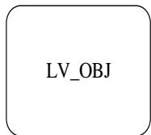  
图9.1.1 创建基础对象

在设计较为复杂的GUI界面时，不同功能的模块之间需要清晰地划分区域，此时，我们可以使用基础对象作为背景，对不同的区域进行划分。

# 2. 辅助布局

当GUI界面中有一些组成内容相似的模块时，可以利用基础对象作为父对象，创建出其他的部件，这些部件将出现在基础对象内部，此时，我们只需要管理各基础对象之间的布局即可，其他的部件会随之变化。辅助布局的示意图如下：

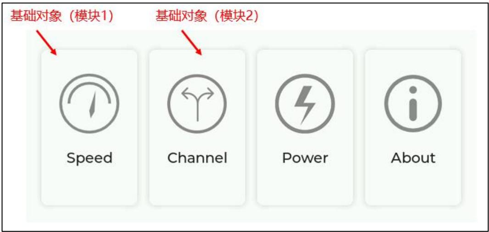  
图9.1.2辅助布局示例

# 3.界面切换

当基础对象做为父对象，创建出其他的部件时，这些被创建出来的部件将出现在其父对象的内部，换言之，此时的基础对象就是一个容器，它里面子对象会随之移动。在 UI 设计中，我们可以利用上述的特性，实现界面的切换，示意图如下所示：

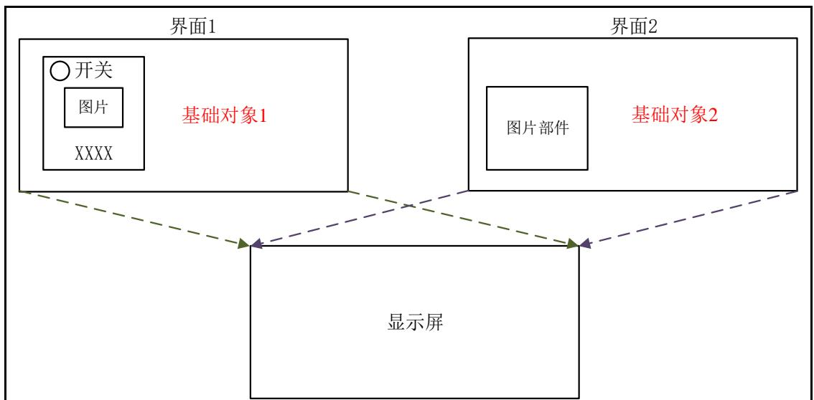  
图9.1.3界面切换示意图

由上图可知，基础对象1、2分别用于管理界面1、2，它们之中存在一些子对象（例如开关），当用户需要切换界面时，只需切换容器即可。

接下来，我们介绍界面切换的两种实现方法：

# 方法一：删除法

当用户删除一个父对象时，它所有的子对象也会被一并删除，因此，我们需要实现界面的切换，可以调用lv_obj_del函数，直接删除基础对象（父对象），然后再创建新的界面，这样即可实现界面切换，示意图如下所示：

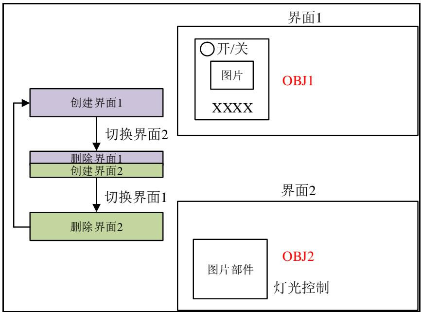  
图9.1.4 删除法切换界面

# 方法二：隐蔽法

此方法的原理和删除法类似，只不过这里是将界面隐藏起来，需要的时候还能还原。注意：隐藏的界面并未被删除，其占用内存也没有得到释放，因此，当用户使用此方法切换界面时，需要考虑内存溢出的隐患。隐蔽法的示意图如下所示：

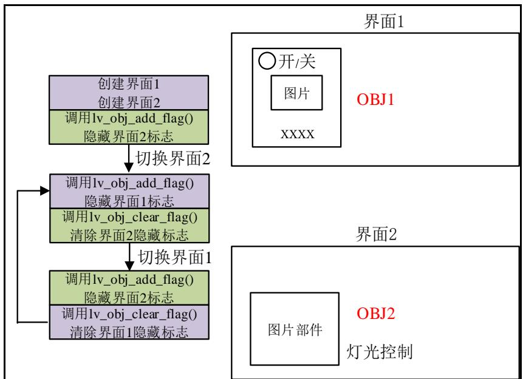  
图9.1.5 隐蔽法切换界面

由上图可知，隐藏法的实现逻辑如下：先创建出不同的界面，然后调用lv_obj_add_flag函数，为指定的界面添加隐藏的标志，此时，该界面将隐藏，而当我们需要显示某个界面时，只需要调用lv_obj_clear_flag函数，清除隐藏属性即可。注意：不要同时清除多个界面的隐藏属性，否则可能出现显示混乱的问题。下面我们来看一下上述的两个函数：

# lv_obj_add_flag函数

设置一个或多个标志，其函数原型如下所示：

```txt
void lv_obj_add_flag(lv_obj_t *obj, lv_obj_flag_t f);
```

该函数的形参，如表9.1.1所示：

表 9.1.1 lv_obj_add_flag 函数形参描述  

<table><tr><td>参数</td><td>描述</td></tr><tr><td>obj</td><td>指向对象的指针</td></tr><tr><td>f</td><td>标志相关枚举</td></tr></table>

返回值：无。

# 2.lv_obj_clear_flag函数

清除一个或多个标志，其函数原型如下所示：

```c
void lv_obj_clear_flag(lv_obj_t *obj, lv_obj_flag_t f);
```

该函数的形参，如表9.1.2所示：

表 9.1.2 lv_obj_clear_flag 函数形参描述  

<table><tr><td>参数</td><td>描述</td></tr><tr><td>obj</td><td>指向对象的指针</td></tr><tr><td>f</td><td>标志相关枚举</td></tr></table>

返回值：无。

在LVGL中，标志相关的枚举如下源码所示：

```txt
enum{ LV_OBJ_FLAG_HIDDEN  $=$  (1L<<0)， /\*隐藏\*/ LV_OBJ_FLAGCLICKABLE  $=$  (1L<<1), LV_OBJ_FLAG.ClickOCUSABLE  $=$  (1L<<2), LV_OBJ_FLAG_CHECKABLE  $=$  (1L<<3), LV_OBJ_FLAG_SCROLLABLE  $=$  (1L<<4), LV_OBJ_FLAG_SCROLL_ELASTIC  $=$  (1L<<5), LV_OBJ_FLAG_SCROLL_MOMENTUM  $=$  (1L<<6), LV_OBJ_FLAG_SCROLL_ONE  $=$  (1L<<7), LV_OBJ_FLAG_SCROLLChain_HOR  $=$  (1L<<8), LV_OBJ_FLAG_SCROLLCHAIN.Ver  $=$  (1L<<9), LV_OBJ_FLAG_SCROLLCHAIN  $=$  (LV_OBJ_FLAG_SCROLLCHAIN_HOR | LV_OBJ_FLAG_SCROLLCHAIN_HOR), LV_OBJ_FLAG_SCROLL_ON_FOCUS  $=$  (1L<<10), LV_OBJ_FLAG_SCROLL_WITHArrow  $=$  (1L<<11), LV_OBJ_FLAG_SNAPPABLE  $=$  (1L<<12), LV_OBJ_FLAG_press_LOCK  $=$  (1L<<13), LV_OBJ_FLAG_EVENT_BUBBLE  $=$  (1L<<14), LV_OBJ_FLAG_GESTURE_BUBBLE  $=$  (1L<<15), LV_OBJ_FLAG_ADV_HITTEST  $=$  (1L<<16), LV_OBJ_FLAGignite_LAYOUT  $\equiv$  (1L<<17), LV_OBJ_FLAG_FLOATING  $=$  (1L<<18), LV_OBJ_FLAG_OVERFLOW_VISIBLE  $=$  (1L<<19), LV_OBJ_FLAG_LAYOUT_1  $=$  (1L<<23), LV_OBJ_FLAG_LAYOUT_2  $=$  (1L<<24), LV_OBJ_FLAG_WIGGET_1  $=$  (1L<<25),
```

```c
LV_OBJ_FLAG_Wildget_2  $= (1L <   <   26)$  LV_OBJ_FLAG_USER_1  $= (1L <   <   27)$  LV_OBJ_FLAG_USER_2  $= (1L <   <   28)$  LV_OBJ_FLAG_USER_3  $= (1L <   <   29)$  LV_OBJ_FLAG_USER_4  $= (1L <   <   30)$
```

# 9.2基础对象的相关知识

基础对象的大部分知识，我们在6.2章节已经介绍过了，这里我们只介绍一个拓展的内容：扩大点击区域。

在默认的情况下，用户必须要在区域边界内点击对象，这样才能成功触发事件（例如按下）。如果我们想扩展点击区域，可以调用lv_obj_set_ext.click_area函数来设置，其函数原型如下所示：

```python
void lv_obj_set_ext.click_area lv_obj_t * obj, lv Coordinate_t size)
```

该函数的形参，如表9.2.1所示：

表 9.2.1 lv_obj_set_ext.click_area 函数形参描述  

<table><tr><td>参数</td><td>描述</td></tr><tr><td>obj</td><td>指向对象的指针</td></tr><tr><td>size</td><td>设置点击区域大小</td></tr></table>

返回值：无。

# 9.3基础对象的API函数

LVGL官方提供了很多与基础对象相关API函数，如表9.3.1所示：

表 9.3.1 基础对象相关 API 函数  

<table><tr><td>函数</td><td>描述</td></tr><tr><td>lv_obj_create()</td><td>创建基础对象（矩形）</td></tr><tr><td>lv_obj_set_user_data()</td><td>设置对象的 user_data 字段</td></tr><tr><td>lv_obj_has_flag()</td><td>检查是否在对象上设置了指定的标志</td></tr><tr><td>lv_obj_has_flag_any()</td><td>检查是否在对象上设置了任何标志</td></tr><tr><td>lv_obj_get_state()</td><td>获取对象的状态</td></tr><tr><td>lv_obj_has_state()</td><td>检查对象是否处于指定状态</td></tr><tr><td>lv_obj_get_group()</td><td>获取对象的组</td></tr><tr><td>lv_obj_get_user_data()</td><td>获取对象的用户数据</td></tr><tr><td>lv_obj_allocate_spec_att()</td><td>为对象分配特殊数据（还未分配时）</td></tr><tr><td>lv_obj_check_type()</td><td>检查 obj 的类型</td></tr><tr><td>lv_obj_has_class()</td><td>检查是否有任何对象具有指定的类</td></tr><tr><td>lv_obj_get_class()</td><td>获取对象的类</td></tr><tr><td>lv_obj_is_valid()</td><td>检查是否有任何对象在活动</td></tr></table>

接下来，我们介绍LVGL基础对象常用的API函数：

# 1.lv_obj_create函数

创建基础对象，其函数原型如下所示：

```c
lv_obj_t * lv_obj_create lv_obj_t * parent);
```

该函数的形参，如表9.3.2所示：

```txt
参数 描述
```

表 9.3.2 lv_obj_create 函数形参描述  

<table><tr><td>parent</td><td>部件的父类</td></tr></table>

返回值：返回对象控制块。

# 2.lv_obj_get_state函数

获取对象的状态，其函数原型如下所示：

```c
lv_state_t lv_obj_get_state(const lv_obj_t * obj);
```

该函数的形参，如表9.3.3所示：

表 9.3.3 lv_obj_get_state 函数形参描述  

<table><tr><td>参数</td><td>描述</td></tr><tr><td>obj</td><td>对象指针</td></tr></table>

返回值：返回对象状态。

# 9.4基础对象部件的实验

# 9.4.1 硬件设计

# 1. 例程功能

本实验主要测试基础对象 API 函数的使用，实验现象：开机后，屏幕上会显示两个矩形，当长按大矩形时，会改变其位置，小矩形位置也随之改变，当按下小矩形并释放时，小矩形的位置会改变，其超出大矩形的部分将不可见。与此同时，LED0 闪烁，提示系统正在运行。

该实验的完整源码，请参考《LVGL例程9lv_obj(基础对象)》例程，路径：A盘  $\rightarrow 4$  ，程序源码  $\rightarrow 3$  ，扩展例程  $\rightarrow 4$  ，LVGL例程。

# 9.4.2 软件设计

# 9.4.2.1 程序流程图

本实验的程序流程图，如下图9.4.2.1.1所示：

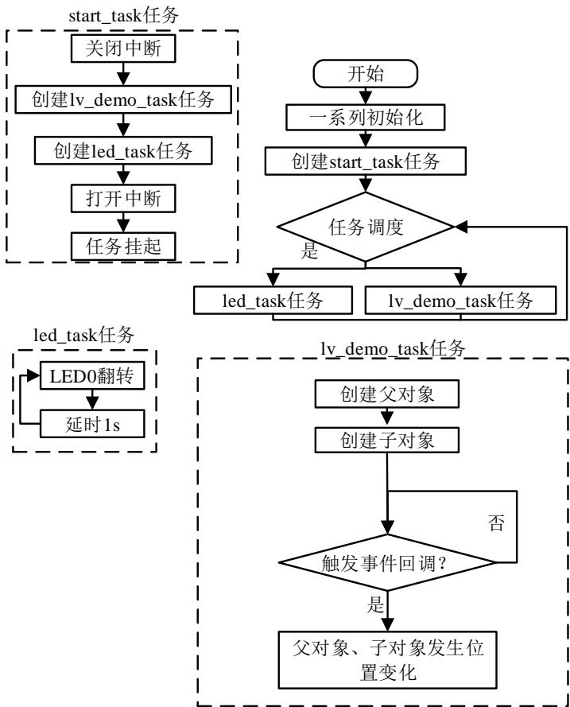  
图9.4.2.1.1基础对象实验流程图

# 9.4.2.2 程序解析

关于LVGL的用户代码，我们都是在lv_mainstart.c文件中编写的，本实验的源码如下所示：

```c
/\*\*\*\*\*\*\*\*\*\*\*\*\*\*\*\*\*\*\*\*\*\*\*\*\*\*\*\*\*\*\*\*\*\*\*\*\*\*\*\*\*\*\*\*\*\*\*\*\*\*\*\*\*\*\*\*\*\*\*\*\*\*\*\*\*\*\*\*\*\*\*\*\*\*\*\*\*\*\*\*\*\*\*\*\*\*\*\*\*\*\*\*\*\*\*\*\*\*\*\*\*  
\*/  
\* @brief LVGL 演示  
\* @param 无  
\* @return 无  
\*/  
void lv_mainstart(void)  
{  
/* 动态获取屏幕大小 */  
scr_act_width = lv_obj_get_width(lv_scr_act());  
scr_act_height = lv_obj_get_height(lv_scr_act());  
/* 父对象 */  
parent_obj = lv_obj_create(lv_scr_act()); /* 创建父对象 */  
/* 设置父对象的大小 */  
lv_obj_set_size(parent_obj, scr_act_width * 2/3, scr actu height * 2/3);  
/* 设置父对象的位置 */
```

```c
lv_obj_align(parent_obj, LVALIGN_TOP_MID, 0, 0);  
/* 设置父对象的背景色：浅蓝色 */  
lv_obj_set_style_bg_color(parent_obj, lv_color(hex(0x99ccff), 0);  
/* 为父对象添加事件：长按触发 */  
lv_obj_add_event_cb(parent_obj, obj_event_cb, LV_EVENT LONG_PRESSED, NULL);  
/* 子对象 */  
child_obj = lv_obj_create(parent_obj); /* 创建子对象 */  
/* 设置子对象的大小 */  
lv_obj_set_size(child_obj, scr_ACT_width / 3, scr_ACT_height / 3);  
/* 设置子对象的位置：居中 */  
lv_obj_align(child_obj, LVALIGN_CENTER, 0, 0);  
/* 设置子对象的背景色：深蓝色 */  
lv_obj_set_style_bg_color(child_obj, lv_color_hex(0x003366), 0);  
/* 为子对象添加事件：按下释放后触发 */  
lv_obj_add_event_cb(child_obj, obj_event_cb, LV_EVENTCLICKED, NULL);  
}  
/********** 第一部分 结束********** /  
/********** 第二部分 开始********** /  
*/  
* @brief 基础对象事件回调  
* @param *e：事件相关参数的集合，它包含了该事件的所有数据  
* @return 无  
*/  
static void obj_event_cb(cv_event_t *e)  
{  
    lv_obj_t * target = lv_event_get_target(e); /* 获取事件触发源 */  
    if (target == parent_obj) /* 判断触发源：是不是父对象？ */  
    {  
        /* 重新设置父对象的位置：居中 */  
        lv_obj_align(parent_obj, LVALIGN_CENTER, 0, 0);  
    }  
    else if (target == child_obj) /* 判断触发源：是不是子对象？ */  
    {  
        /* 重新设置子对象的位置：右侧居中，再向X轴偏移100 */  
        lv_obj_align(child_obj, LVALIGN_RIGHT_MID, 100, 0);  
    }  
}
```

上述源码可分为以下两个部分：

① 创建对象并添加事件回调。我们首先获取动态屏幕的大小，以适配不同尺寸的屏幕，然后再分别创建父对象和子对象，并为它们添加事件回调；  
② 处理事件回调。在回调函数中，我们首先获取事件的触发源，然后判断是父对象还是子对象触发的事件，若是前者，则重新设置父对象的位置，使其居中对齐，此时，子对象的位置也会随之变化；若是后者，则重新设置子对象的位置，使其右侧居中，并且向X轴的正半轴偏移100像素，此时，子对象超出父对象的部分默认不可见。

# 9.4.3 下载验证

把工程编译并下载到我们的开发板中，运行效果如图9.4.3.1所示：

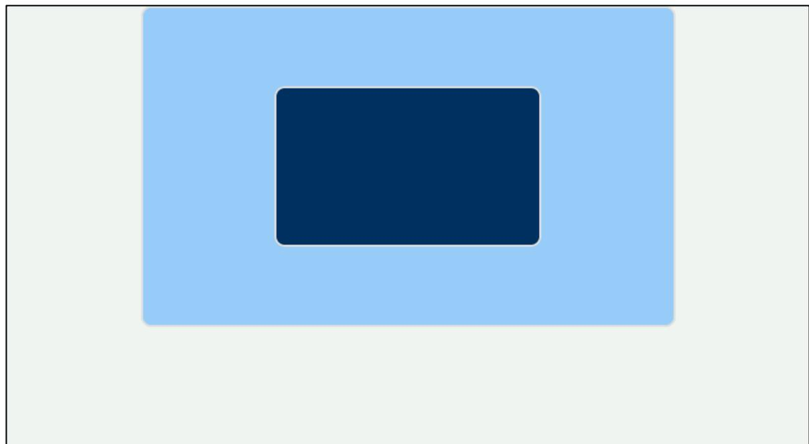  
图9.4.3.1基础对象例程演示

# 第十章 圆弧部件 (lv.arc)

圆弧（arc）部件是一个较为常用的部件，它的应用场景非常多，例如：调节参数、显示参数、显示进度，等等。

本章节将分为以下几个小节：

10.1 圆弧部件的组成  
10.2 圆弧部件的相关知识  
10.3 圆弧部件的 API 函数  
10.4 圆弧部件的实验

# 10.1 圆弧部件的组成

圆弧（lv_arc）部件由三个部分组成：背景弧、前景弧和旋钮，示意图如下：

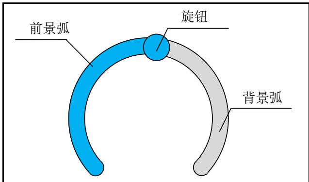  
图10.1.1圆弧（lvArc）的组成部分

各组成部分的相关枚举和作用如下所示：

① 背景弧（LV_PART_MAIN）：用于显示范围值；  
② 前景弧（LV_PART_INDICATOR）：用于显示当前值；  
③ 旋钮（LV_PART_KNOB）：用于调节当前值。

关于部件样式设置的内容，请大家参考6.4.4章节。

# 10.2 圆弧部件的相关知识

# 10.2.1 圆弧的当前值和范围值

圆弧当前值指的是当前前景弧所指示的值，范围值是指圆弧当前值的可变化范围，示意图如下：

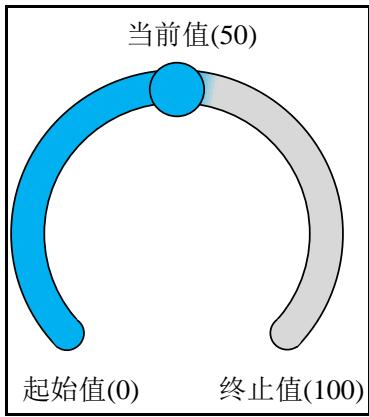  
图10.2.1.1圆弧的当前值和范围值

上图中，旋钮指示的就是当前值（50），起始值和终止值确定了范围值（0~100）。接下来，我们以简单示例来理解当前值和范围值，示例代码如下所示：

```c
void lv_mainstart(void)  
{lv_obj_t* arc = lvArc_create(lv_scr_act());lvArc_set_range(arc,0，100); /*设置arc的范围*/lvArc_set_value(arc，50); /*设置arc的值*/lv_obj_set_size(arc，200，200);lv_obj_align_to(arc，NULL，LV ALIGN_CENTER，0，0）;
```

在上述源码中，我们先创建圆弧部件，然后分别设置它的范围值和当前值，最后再设置其大小和位置。示例代码可以在PC模拟器中运行，效果图如下所示：

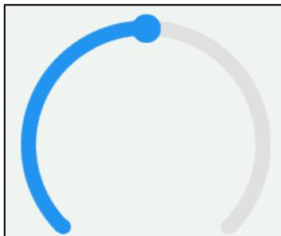  
图10.2.1.2示例代码效果图

# 10.2.2 圆弧部件角度设置

在设置圆弧部件的角度（绝对度数）之前，我们需要先搞清楚圆弧的角度划分。在圆弧部件默认的角度划分中，0度（绝对度数）位于对象右侧中部（3点钟方向），然后沿顺时针方向增加度数，直至360度，示意图如下：

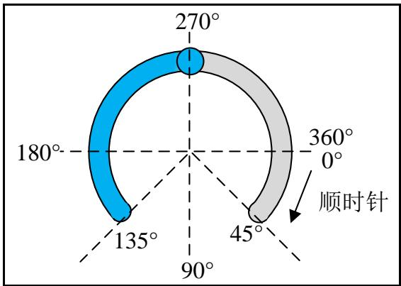  
图10.2.2.1角度划分示意图

了解了圆弧的角度划分，接下来我们介绍圆弧角度设置的相关函数，它们可以分为两类：背景弧角度设置和前景弧角度设置，具体函数如下所示：

```c
/* 背景弧角度设置 */
lv_ar_c_set_bgAngles(arc, start_angle, end_angle) /* 同时设置起始角度和终止角度 */
lv_ar_c_set_bg_start/end_angle(arc, start_angle) /* 分开设置起始角度/终止角度 */
/* 前景弧角度设置 */
lv_ar_c_setAngles(arc, start_angle, end_angle) /* 同时设置起始角度和终止角度 */
lv_ar_c_set_start/end_angle(arc, start_angle) /* 分开设置起始角度/终止角度 */
```

在上述函数中，我们只需要结合角度划分示意图，按需设置起始角度和终止角度即可。注意：前景弧的角度范围不能超过背景弧的角度范围，否则将会出现显示异常，该异常会在下次更新布局时被修正。

接下来，我们以一个简单的示例来理解圆弧角度的设置，示例代码如下：

```c
void lv_mainstart(void)  
{lv_obj_t* arc = lv_obj_create(lv_scr_act());lv_aric_set_bgAngles(arc,135，45）；/\*设置背景弧的起始角度和终止角度\*/lv_aric_setAngles(arc，135，300）；/\*设置前景弧的起始角度和终止角度\*/lv_obj_set_size(arc，200，200);lv_obj_align_to(arc，NULL，LV ALIGN_CENTER，0，0）;
```

在上述代码中，我们首先创建圆弧，设置背景弧的起始角度和终止角度分别为  $135^{\circ}$  和  $45^{\circ}$ ，然后设置前景弧的起始角度和终止角度分别为  $135^{\circ}$  和  $270^{\circ}$ ，最后再设置圆弧大小和位置。示例代码可以在 PC 模拟器中运行，运行效果如下图所示：

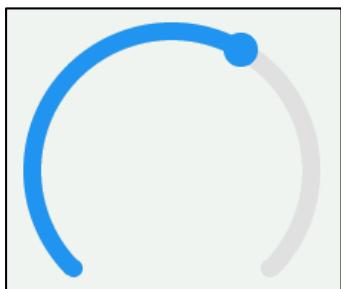  
图10.2.2.2示例代码效果图

# 10.2.3 圆弧部件旋转设置

圆弧部件旋转是指将整个部件沿顺时针方向旋转某个角度，注意：旋转的角度为相对值（增量），它的范围是0~360度，旋转中心为圆弧的中心。圆弧旋转的示意图如下（旋转180度）：

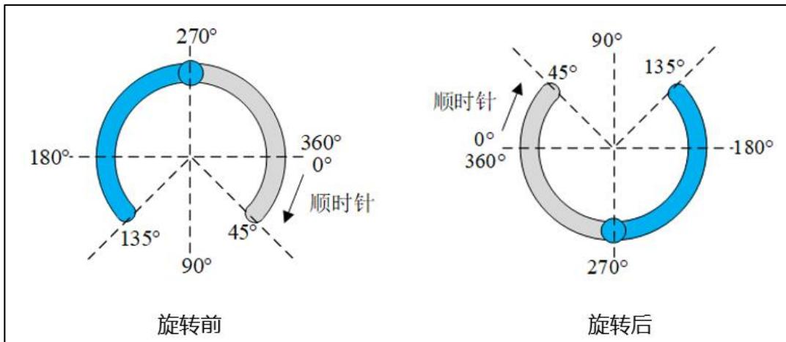  
图10.2.3.1圆弧旋转示意图

由上图可知，该圆弧旋转了180度，值得注意的是，圆弧旋转后，它的角度划分（绝对度数）就会发生变化。

接下来，我们以一个简单的示例来理解圆弧旋转的设置，示例代码如下：

```c
void lv_mainstart(void)   
{ lv_obj_t\* arc  $=$  lvArc_createLv_scr_ACT(); lvArc_set_bgAngles(arc，135，45); lvArc_setAngles(arc，135，270); lvArc_setRotation(arc，180）；  $\text{一} ^ { \text{一} }$  旋转180度\*/ lv_obj_set_size(arc，200，200); lv_obj_align_to(arc，NULL，LV ALIGN_CENTER，0，0);   
}
```

在上述的源码中，我们调用了lvArc_setRotation函数，让圆弧部件旋转180度，示例代码的效果如下图所示：

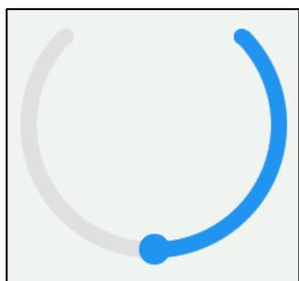  
图10.2.3.2示例代码效果图

# 10.2.4 圆弧的模式选择

默认情况下，圆弧部件是沿顺时针方向绘制的，如果用户需要修改绘制的方向，可以调用lv_ arc_set_mode函数，设置圆弧的绘制模式，圆弧模式相关的枚举如下所示：

① LV_ARC_MODE_NORMAL: 顺时针方向绘制;  
② LV_ARC_MODE_reverse: 逆时针方向绘制;  
③ LV_ARC_MODE_SYNMMETRIC：从中间点开始绘制到当前值。

# 10.2.5 圆弧部件的变化率设置

当圆弧的旋钮被滑动时，前景弧将根据设定的变化率来绘制。变化率的单位为：度/秒，用户可调用lvArc_set_change_rage函数设置变化率。

# 10.2.6 移除旋钮

当我们把圆弧作为进度指示器或者参数指示器来使用时，则需要移除它的旋钮，并清除可点击的属性，示例代码如下：

```c
lv_obj_t *arc = lv_obj_create(lv_scr_act());  
lv_obj_remove_style(arc, NULL, LV_PART_KNOB); /*移除旋钮*/  
lv_obj_clear_flag(arc, LV_OBJ_FLAG.ClickABLE); /*清除可点击属性*/  
lv_obj_center(arc);
```

在上述的源码中，我们先调用了lv_obj_remove_style函数，移除了旋钮部分，然后调用lv_obj_clear_flag函数，清除圆弧的可点击属性，示例代码的效果如下图所示：

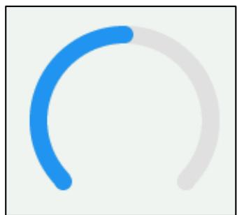  
图10.2.6.1示例代码效果图

# 10.2.7 圆弧部件事件

① LV_EVENT_VALUE_CHANGED：圆弧的值发生变化；  
(2) LV_ARC_DRAW_PARTBACKGROUND: 绘制背景弧线;  
③ LV_ARC_DRAW_PART_FOREGROUND：绘制前景弧线；  
④ LV_ARC_DRAW_PART_KNOB：绘制旋钮。

# 10.3 圆弧部件的 API 函数

LVGL官方提供了一些与圆弧部件相关API函数，如下表所示：

<table><tr><td>函数</td><td>描述</td></tr><tr><td>lv.arc_create()</td><td>创建圆弧对象</td></tr><tr><td>lv.arc_set_start_angle()</td><td>设置前景弧的起始角度</td></tr><tr><td>lv.arc_set_end_angle()</td><td>设置前景弧的结束角度</td></tr></table>

表 10.3.1 圆弧部件相关的 API 函数  

<table><tr><td>lv.arc_setAngles()</td><td>设置前景弧的开始和结束角度</td></tr><tr><td>lv.arc_set_bg_start_angle()</td><td>设置背景弧的起始角度</td></tr><tr><td>lv.arc_set_bg_end_angle()</td><td>设置背景弧的结束角度</td></tr><tr><td>lv.arc_set_bgAngles()</td><td>设置背景弧的起止和结束角度</td></tr><tr><td>lv.arc_setRotation()</td><td>设置圆弧的旋转</td></tr><tr><td>lv.arc_set_mode()</td><td>设置圆弧的模式</td></tr><tr><td>lv.arc_set_value()</td><td>设置圆弧当前值</td></tr><tr><td>lv.arc_set_range()</td><td>设置圆弧范围</td></tr><tr><td>lv.arc_set_change_rate()</td><td>设置变化率</td></tr><tr><td>lv.arc_get_angle_start()</td><td>获取前景弧的起始角度</td></tr><tr><td>lv.arc_get_angle_end()</td><td>获取前景弧的结束角度</td></tr><tr><td>lv.arc_get_bg_angle_start()</td><td>获取背景弧的起始角度</td></tr><tr><td>lv.arc_get_bg_angle_end()</td><td>获取背景弧的结束角度</td></tr><tr><td>lv.arc_get_value()</td><td>获取圆弧的当前值</td></tr><tr><td>lv.arc_get_min_value()</td><td>获取圆弧的最小值</td></tr><tr><td>lv.arc_get_max_value()</td><td>获取圆弧的最大值</td></tr><tr><td>lv.arc_get_mode()</td><td>获取圆弧的模式</td></tr></table>

接下来，我们介绍LVGL圆弧部件常用的API函数：

# 1.lv_ arc_create 函数

创建圆弧对象，其函数原型如下所示：

```sql
lv_obj_t * lv_ arc_create ( lv_obj_t * parent);
```

该函数的形参，如表10.3.2所示：

表 10.3.2 lv_ar 创建函数形参描述  

<table><tr><td>参数</td><td>描述</td></tr><tr><td>parent</td><td>部件的父类</td></tr></table>

返回值：返回对象控制块。

# 2.lv_arc_set_start_angle函数

设置前景弧的起始角度，其函数原型如下所示：

```c
void lv_ar_c_set_start_angle (lv_obj_t \* arc, uint16_t start);
```

该函数的形参，如表10.3.3所示：

表 10.3.3 lv_arc_set_start_angle 函数形参描述  

<table><tr><td>参数</td><td>描述</td></tr><tr><td>arc</td><td>指向弧对象的指针</td></tr><tr><td>start</td><td>起始角度</td></tr></table>

返回值：无。

# 3.lv_ar_c_set_end_angle函数

设置前景弧的结束角度，其函数原型如下所示：

```c
void lv_ar_c_set_end_angle (lv_obj_t * arc, uint16_t end);
```

该函数的形参，如表10.3.4所示：

表 10.3.4 lv_aric_set_end_angle 函数形参描述  

<table><tr><td>参数</td><td>描述</td></tr><tr><td>arc</td><td>指向弧对象的指针</td></tr><tr><td>end</td><td>结束角度</td></tr></table>

返回值：无。

# 4.lv argc_setAngles函数

设置前景弧的开始和结束角度，其函数原型如下所示：

```c
void lv_ar_c_setAngles (lv_obj_t \* arc, uint16_t start, uint16_t end);
```

该函数的形参，如表10.3.5所示：

表 10.3.5 lv_aric_setAngles 函数形参描述  

<table><tr><td>参数</td><td>描述</td></tr><tr><td>arc</td><td>指向弧对象的指针</td></tr><tr><td>start</td><td>起始角度</td></tr><tr><td>end</td><td>结束角度</td></tr></table>

返回值：无。

# 5.lv_ar_c_set bg_start_angle函数

设置背景弧的起始角度，其函数原型如下所示：

```c
void lv_ar_c_set bg_start_angle (lv_obj_t * arc, uint16_t start);
```

该函数的形参，如表10.3.6所示：

表 10.3.6 lv_arc_set bg_start_angle 函数形参描述  

<table><tr><td>参数</td><td>描述</td></tr><tr><td>arc</td><td>指向弧对象的指针</td></tr><tr><td>start</td><td>起始角度</td></tr></table>

返回值：无。

# 6.lv_arc_set bg_end_angle函数

设置背景弧的结束角度，其函数原型如下所示：

```c
void lv_ar_c_set bg_end_angle (lv_obj_t * arc, uint16_t end);
```

该函数的形参，如表10.3.7所示：

表 10.3.7 lv_arc_set bg_end_angle 函数形参描述  

<table><tr><td>参数</td><td>描述</td></tr><tr><td>arc</td><td>指向弧对象的指针</td></tr><tr><td>end</td><td>结束角度</td></tr></table>

返回值：无。

# 7. Iv_ar_c_set bgAngles函数

设置背景弧的起止角度，其函数原型如下所示：

```c
void lv_ar_c_set_bgAngles (lv_obj_t * arc, uint16_t start, uint16_t end);
```

该函数的形参，如表10.3.8所示：

表 10.3.8 lv_aric_set bgAngles 函数形参描述  

<table><tr><td>参数</td><td>描述</td></tr><tr><td>arc</td><td>指向弧对象的指针</td></tr><tr><td>start</td><td>起始角度</td></tr><tr><td>end</td><td>结束角度</td></tr></table>

返回值：无。

# 8.lv_ar_c_setRotation函数

设置圆弧的旋转，其函数原型如下所示：

```txt
void lv_ar_c_setRotation (lv_obj_t * arc, uint16_t rotation);
```

该函数的形参，如表10.3.9所示：

表 10.3.9 lv_aric_setRotation 函数形参描述  

<table><tr><td>参数</td><td>描述</td></tr><tr><td>arc</td><td>指向弧对象的指针</td></tr><tr><td>rotation</td><td>旋转角度</td></tr></table>

返回值：无。

# 9.lv_arc_set_mode函数

设置圆弧的模式，其函数原型如下所示：

```c
void lv_arc_set_mode (lv_obj_t * arc, lv_arc_mode_t type);
```

该函数的形参，如表10.3.10所示：

表 10.3.10 lv_ar_c_set_mode 函数形参描述  

<table><tr><td>参数</td><td>描述</td></tr><tr><td>arc</td><td>指向弧对象的指针</td></tr><tr><td>type</td><td>圆弧的模式</td></tr></table>

返回值：无。

# 10.lv_ar_c_set_value函数

设置圆弧当前值，其函数原型如下所示：

```c
void lv_ar_c_set_value (lv_obj_t * arc, int16_t value);
```

该函数的形参，如表10.3.11所示：

表 10.3.11 lv_ar_c_set_value 函数形参描述  

<table><tr><td>参数</td><td>描述</td></tr><tr><td>arc</td><td>指向弧对象的指针</td></tr><tr><td>value</td><td>当前值</td></tr></table>

返回值：无。

# 11.lv_ar_c_set_range函数

设置圆弧的范围值，其函数原型如下所示：

```c
void lv_arc_set_range (lv_obj_t * arc, int16_t min, int16_t max);
```

该函数的形参，如表10.3.12所示：

表 10.3.12 lv_ar_c_set_range 函数形参描述  

<table><tr><td>参数</td><td>描述</td></tr><tr><td>arc</td><td>指向弧对象的指针</td></tr><tr><td>min</td><td>最小值</td></tr><tr><td>max</td><td>最大值</td></tr></table>

返回值：无。

# 12.lv_ar_c_set_change_rate函数

设置变化率，其函数原型如下所示：

```c
void lv_ar_c_set_change_rate (lv_obj_t * arc, uint16_t rate);
```

该函数的形参，如表10.3.13所示：

表 10.3.13 lv_ar_set_change_rate 函数形参描述  

<table><tr><td>参数</td><td>描述</td></tr><tr><td>arc</td><td>指向弧对象的指针</td></tr><tr><td>rate</td><td>变化率，单位：度/秒</td></tr></table>

返回值：无。

# 10.4 圆弧部件的实验

# 10.4.1 硬件设计

# 1. 例程功能

本实验主要测试圆弧部件 API 函数的使用，实验现象：开机后，屏幕上会显示两个圆弧，用户可以通过左侧圆弧来调节右侧圆弧的值。与此同时，LED0 闪烁，提示系统正在运行。

该实验的完整源码，请参考《LVGL例程10 arc(圆弧)》例程，路径：A盘  $\rightarrow 4$  ，程序源码 $\rightarrow 3$  ，扩展例程  $\rightarrow 4$  ，LVGL例程。

# 10.4.2 软件设计

# 10.4.2.1 程序流程图

本实验的程序流程图，如下图 10.4.2.1.1 所示：

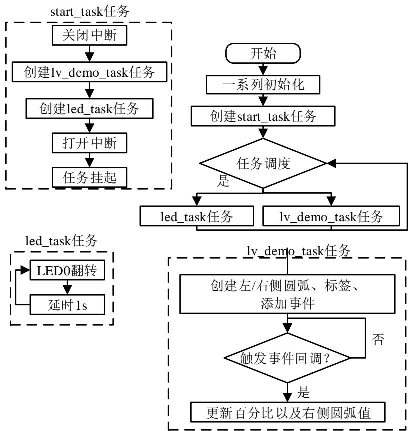  
图10.4.2.1.1圆弧实验流程图

# 10.4.2.2 程序解析

关于LVGL的用户代码，我们都是在lv_mainstart.c文件中编写的，本实验的源码如下所示：

```c
/*  
/*  
* @brief LVGL 演示
```

```txt
\* @param 无  
\* @return 无  
\*/  
void lv_mainstart(void)  
{lv_example_arcl(); /* 左侧圆弧 */lv_example_ar2(); /* 右侧圆弧 */}  
/*********** 第一部分 结束***********/  
/*********** 第二部分 开始***********/  
/*@brief 左侧圆弧\* @param 无\* @return 无  
\*/  
void lv_example_arcl(void)  
{/\* 根据活动屏幕宽度选择字体 \*/if (scr_act_width() <= 480){font  $=$  &lv_font_montserrat_14;arc_width = 10;1else{font  $=$  &lv_font_montserrat_30;arc_width = 20;\*/\* 左侧圆弧 \*/arc_left  $=$  lvARC_create(lv_scr_act()); /\* 创建圆弧 \*//\* 设置大小 \*/lv_obj_set_size(arc_left,scr actu_height() \*3/8,scr actu_height() \*3/8);/\* 设置位置 \*/lv_obj_align(arc_left,LV ALIGN_CENTER,-scr actu_width(/5,0);/\* 设置当前值 \*/lv ARC_value(arc_left,0);/\* 设置背景弧宽度 \*/lv_obj_set_style_arcl_width(arc_left,arc_width,LV_PART_MAIN);/\* 设置前景弧宽度 \*/lv_obj_set_style_arcl_width(arc_left,arc_width,LV_PART_INDICATOR);/\* 添加事件 \*/
```

```c
lv_obj_add_event_cb(arc_left, arc_event_cb, LV_EVENT_VALUE_CHANGED, NULL);  
/* 左侧百分比标签 */  
label(left = lv_label_create(lv_scr_act()); /* 创建百分比标签 */  
/* 设置位置 */  
lv_obj_align.label_left, LVALIGN_CENTER, -scr_act_width(/5, 0);  
/* 设置文本 */  
lv_label_set_text.label_left, "0%");  
/* 设置字体 */  
lv_obj_set_style_text.Font.label_left, font, LV_STATE_DEFAULT);  
}  
/********** 第二部分 结束**********  
/********** 第三部分 开始**********  
/* @brief 右侧圆弧  
* @param 无  
* @return 无  
*/  
void lv_example_arc2(void)  
{  
/* 右侧圆弧 */  
arc_right = lv_ar_create(lv_scr_act()); /* 创建圆弧 */  
/* 设置大小 */  
lv_obj_set_size(arc_right, scr actu_height() * 3/8, scr actu_height() * 3/8);  
/* 设置位置 */  
lv_obj_align(arc_right, LVALIGN_CENTER, scr actu_width(/5, 0);  
/* 设置当前值 */  
lv_ar_set_value(arc_right, 0);  
/* 设置背景弧角度 */  
lv_ar_set(bgAngles(arc_right, 0, 360);  
/* 设置旋转角度 */  
lv_ar_setRotation(arc_right, 270);  
/* 去除旋钮 */  
lv_obj_remove_style(arc_right, NULL, LV_PART_KNOB);  
/* 去除可点击属性 */  
lv_obj_clear_flag(arc_right, LV_OBJ_FLAGCLICKABLE);  
/* 设置背景弧宽度 */  
lv_obj_set_style_ar_cwidth(arc_right, arc_width, LV_PART_MAIN);  
/* 设置前景弧宽度 */  
lv_obj_set_style_ar_cwidth(arc_right, arc_width, LV_PART_INDICATOR);  
/* 右侧百分比标签 */
```

```c
label_right = lv_label_create lv_scr_act(); /* 创建百分比标签 */
/* 设置位置 */
lv_obj_align.label_right, LVALIGN_CENTER, scr actu_width(/5, 0);
/* 设置文本 */
lv_label_set_text.label_right, "0%");
/* 设置字体 */
lv_obj_set_style_text.Font labelled_right, font, LV_STATE_DEFAULT);
********** 第三部分 结束 ***
```

上述源码可分为以下三个部分：

① lv_mainstart 接口函数。在该函数中，我们调用了两个圆弧示例函数；  
(2) 左侧圆弧实现。我们先根据当前的活动屏幕宽度来选择字体大小以及圆弧宽度，以适配不同尺寸的屏幕，然后创建左侧圆弧并为其添加事件回调，最后创建百分比标签，用于指示左侧圆弧的当前值。  
③ 右侧圆弧实现。我们先创建右侧圆弧，设置其大小、位置、角度并去除旋钮，接着去除可点击的属性，此时，圆弧就不能通过触摸来改变当前值了，最后再创建百分比标签，用于指示右侧圆弧的当前值。

# 10.4.3 下载验证

把工程编译并下载到我们的开发板中，运行效果如图 10.4.3.1 所示：

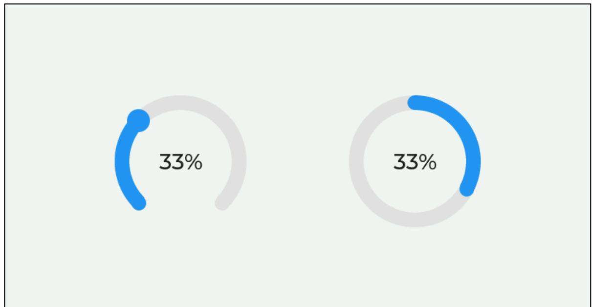  
图10.4.3.1圆弧实验效果图

# 第十一章 进度条部件Lv_bar)

进度条的功能较为简单，它一般被用作参数指示器或者进度指示器。

本章节将分为以下几个小节：

11.1 进度条部件的组成  
11.2 进度条部件的相关知识  
11.3 进度条部件的 API 函数  
11.4 进度条部件的实验

# 11.1 进度条部件的组成

进度条(lv_bar)部件由两个部分组成：背景和指示器，示意图如下：

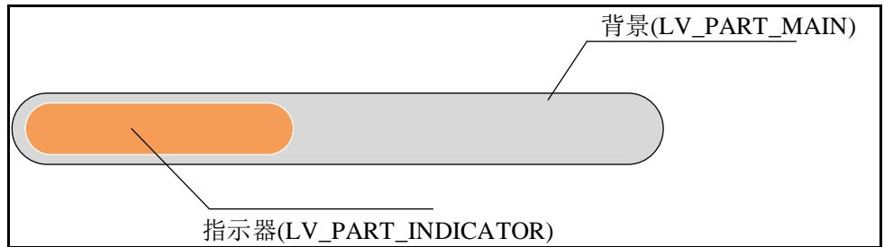  
图11.1.1 进度条的组成部分

各组成部分的相关枚举和作用如下所示：

① 背景（LV_PART_MAIN）：用于显示范围值；  
(2) 指示器（LV_PART_INDICATOR）：用于显示当前值；

关于部件样式设置的内容，请大家参考6.4.4章节。

# 11.2 进度条部件的相关知识

# 11.2.1 进度条的方向

进度条可以设置为水平或者垂直方向，当它的宽度小于高度时，其为水平方向，反之为垂直方向。

# 11.2.2 进度条的当前值和范围值

进度条当前值指的是当前指示器所指示的值，范围值是指进度条当前值的可变化范围，用户需要设置这两个参数，可以调用以下函数：

```c
lv_bar_set_range(bar, min, max); /* 设置进度条部件范围 */
lv_bar_set_value(bar, new_value, LV_ANIM_ON/OFF); /* 设置进度条当前值 */
```

上述的当前值设置函数的最后一个形参代表是否使用动画，如果使用动画请传入LV_ANIM_ON，否则传入LV_ANIM_OFF。

注意：在默认情况下，范围值为 0~100，进度条都是从该范围的最小值开始绘制的。

接下来，我们以简单示例来帮助大家理解当前值和范围值，示例代码如下所示：

```javascript
void lv_mainstart(void) {
```

```c
lv_obj_t* lv_bar1 = lv_bar_create(lv_scr_act()); /* 创建进度条 */
lv_obj_set_style_bg_color(lv_bar1, lv_color.black(), LV_PART_MAIN | LV_STATE_DEFAULT);
lv_obj_set_style_bg_color(lv_bar1, lvpalette_main(LV_PALETTE_RED), LV_PART_INDICATOR | LV_STATE_DEFAULT);
lv_obj_set_size(lv_bar1, 100, 20); /* 设置进度条的大小 */
lv_obj_align(lv_bar1, LVALIGN_CENTER, 0, 0); /* 设置对齐模式 */
lv_bar_set_range(lv_bar1, 0, 100);
lv_bar_set_value(lv_bar1, 100, LV_ANIM_OFF); /* 设置进度条的值 */
lv_obj_t* lv_bar2 = lv_bar_create(lv_scr_act()); /* 创建进度条 */
lv_obj_set_style_bg_color(lv_bar2, lv_color/black(), LV_STATE_DEFAULT);
lv_obj_set_style_bg_color(lv_bar2, lv Palette_main(LV_PALETTE BLUE), LV_STATE_DEFAULT);
lv_obj_set_size(lv_bar2, 20, 100); /* 设置进度条的大小 */
/* 设置对齐模式 */
lv_obj_align_to(lv_bar2, lv_bar1, LVALIGN_OUT_bottom_MID, 0, 20);
lv_bar_set_range(lv_bar2, 0, 100);
/* 填充满的时间 */
lv_obj_set_style Anim_time(lv_bar2, 5000, LV_STATE_DEFAULT);
lv_bar_set_value(lv_bar2, 100, LV_ANIM_ON); /* 设置进度条当前值 */
}
```

在上述源码中，我们分别创建了两个进度条，将lv_bar1进度条设置为垂直进度条，不使用动画；lv_bar2进度条则设置为水平进度条且开启动画，动画时间为5秒。在实际运行时，lv_bar2进度条需要5秒才能填充完毕，而lv_bar1进度条则是瞬间填充完毕。示例代码可以在PC模拟器中运行，效果图如下所示：

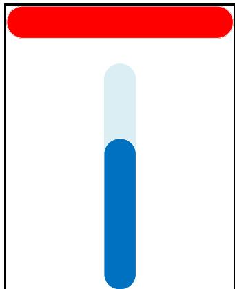  
图11.2.2.1示例代码效果图

注意：设置动画时间的函数（lv_obj_set_styleanimate_time）必须在lv_bar_set_value函数之前调用，否则不会出现效果。

# 11.2.3 进度条模式

进度条部件具有三种模式，它们对应的枚举如下所示：

① LV_BAR_MODE_NORMAL：普通模式（默认）；  
(2) LV_BAR_MODE_SYNMMETRICAL: 始终从零开始绘制, 范围值可以是负数;  
(3) LV_BAR_MODE_RANGE: 允许设置起始值, 该起始值必须始终小于结束值。

接下来，我们结合源码，给大家重点介绍LV_BAR_MODE_SYNMMETRICAL模式的使用，示例代码如下所示：

```c
void lv_mainstart(void)  
{lv_obj_t* bar = lv_bar_create(lv_scr_act()); /* 创建 bar 部件 */lv_obj_center(bar);lv_obj_set_style bg_color(bar, lv_color/black(), LV_STATE_DEFAULT);lv_obj_set_style bg_color(bar, lv Palette_main(LV_PALETTE BLUE),LV_STATE_DEFAULT);lv_bar_set_mode(bar, LV_BAR_MODE_SYNMMETRICAL); /* 设置模式 */lv_bar_set_range(bar, -100, 100); /* 设置范围值 */lv_obj_set_style anim_time(bar, 5000, LV_STATE_DEFAULT); /* 设置动画时间 */lv_bar_set_value(bar, 100, LV_ANIM_ON); /* 设置当前值*/}
```

在上述源码中，我们把进度条的范围值设置为-100~100，并使用LV_BAR_MODE_SYNMMETRICAL模式，此时，进度条始终从0开始绘制，直至当前值处停止。示例代码可以在PC模拟器中运行，效果图如下所示：

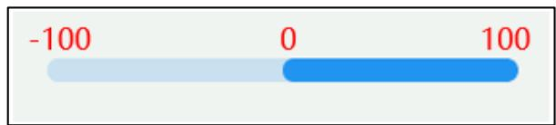  
图11.2.3.1LV_BAR_MODE_SYNMMETRICAL模式示例

在上述的示例源码中，如果我们不设置进度条的模式（默认），效果图如下所示：

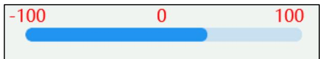  
图11.2.3.2默认模式

# 11.2.4 进度条事件

LV_BAR_DRAW_PART_INDICATOR：绘制指示器。

# 11.3 进度条部件的 API 函数

LVGL官方提供了一些与进度条部件相关API，如下表所示：

<table><tr><td>函数</td><td>描述</td></tr><tr><td>lv_bar_create()</td><td>创建进度条</td></tr><tr><td>lv_bar_set_value()</td><td>设置进度条当前值</td></tr><tr><td>lv_bar_set_start_value()</td><td>设置进度条起始值</td></tr><tr><td>lv_bar_set_range()</td><td>设置进度条范围值</td></tr><tr><td>lv_bar_set_mode()</td><td>设置进度条模式</td></tr><tr><td>lv_bar_get_value()</td><td>获取进度条的当前值</td></tr></table>

表 11.3.1 进度条相关的 API 函数  

<table><tr><td>lv_bar_get_start_value()</td><td>获取进度条起始值</td></tr><tr><td>lv_bar_get_min_value()</td><td>获取进度条最小值</td></tr><tr><td>lv_bar_get_max_value()</td><td>获取进度条最大值</td></tr><tr><td>lv_bar_get_mode()</td><td>获取进度条模式</td></tr></table>

接下来，我们介绍LVGL进度条部件常用的API函数：

# 1.lv_bar_create 函数

创建进度条对象，其函数原型如下所示：

```c
lv_obj_t * lv_bar_create ( lv_obj_t *parent);
```

该函数的形参，如表11.3.2所示：

表 11.3.2 lv_bar_create 函数形参描述  

<table><tr><td>参数</td><td>描述</td></tr><tr><td>parent</td><td>部件的父类</td></tr></table>

返回值：返回对象控制块。

# 2.lv_bar_set_value函数

在进度条设置新值，其函数原型如下所示：

```c
void lv_bar_set_value (lv_obj_t * obj, int32_t value, lv_anim_enable_t anim);
```

该函数的形参，如表11.3.3所示：

表 11.3.3 lv_bar_set_value 函数形参描述  

<table><tr><td>参数</td><td>描述</td></tr><tr><td>obj</td><td>指向 bar 对象的指针</td></tr><tr><td>value</td><td>当前值</td></tr><tr><td>anim</td><td>LV_ANIM_ON: 开启动画; LV_ANIM_OFF: 不开启动画</td></tr></table>

返回值：无。

# 3.lv_bar_set_start_value函数

在进度条设置新的起始值，其函数原型如下所示：

```c
void lv_bar_set_start_value (lv_obj_t * obj, int32_t start_value, lv_anim_enable_t anim);
```

该函数的形参，如表11.3.4所示：

表 11.3.4 lv_bar_set_start_value 函数形参描述  

<table><tr><td>参数</td><td>描述</td></tr><tr><td>obj</td><td>指向 bar 对象的指针</td></tr><tr><td>start_value</td><td>起始值</td></tr><tr><td>anim</td><td>LV_ANIM_ON: 开启动画; LV_ANIM_OFF: 不开启动画</td></tr></table>

返回值：无。

# 4.lv_bar_set_range函数

设置进度条范围值，其函数原型如下所示：

```c
void lv_bar_set_range (lv_obj_t * obj, int32_t min, int32_t max);
```

该函数的形参，如表11.3.5所示：

<table><tr><td>参数</td><td>描述</td></tr><tr><td>obj</td><td>指向 bar 对象的指针</td></tr><tr><td>min</td><td>最小值</td></tr></table>

表 11.3.5 lv_bar_set_range 函数形参描述  

<table><tr><td>max</td><td>最大值</td></tr></table>

返回值：无。

# 5.lv_bar_set_mode函数

设置进度条模式，其函数原型如下所示：

```c
void lv_bar_set_mode (lv_obj_t * obj, lv_bar_mode_t mode);
```

该函数的形参，如表11.3.6所示：

表 11.3.6 lv_bar_set_mode 函数形参描述  

<table><tr><td>参数</td><td>描述</td></tr><tr><td>obj</td><td>指向 bar 对象的指针</td></tr><tr><td>mode</td><td>进度条模式</td></tr></table>

返回值：无。

# 11.4 进度条部件的实验

# 11.4.1 硬件设计

# 1. 例程功能

本实验主要测试进度条部件 API 函数的使用，实验现象：开机后，屏幕上显示一个进度条，当它加载到  $100\%$  会提示 finished。与此同时，LED0 闪烁，提示系统正在运行。

该实验的完整源码，请参考《LVGL例程11 bar(进度条)》例程，路径：A盘  $\rightarrow 4$  ，程序源码  $\rightarrow 3$  ，扩展例程  $\rightarrow 4$  ，LVGL例程。

# 11.4.2 软件设计

# 11.4.2.1 程序流程图

本实验的程序流程图，如下图11.4.2.1.1所示：

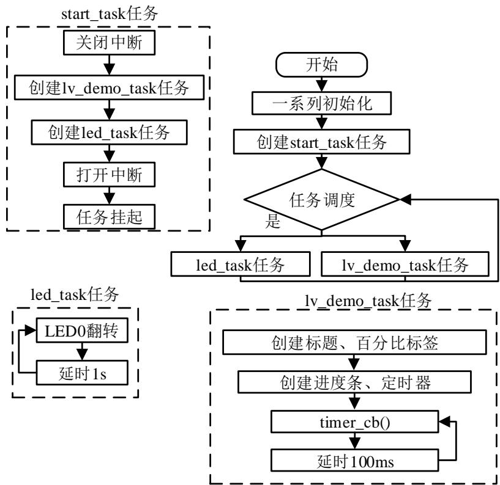  
图11.4.2.1.1 进度条部件实验流程图

# 11.4.2.2 程序解析

关于LVGL的用户代码，我们都是在lv_mainstart.c文件中编写的，本实验的源码如下所示：

```c
/\*\*\*\*\*\*\*\*\*\*\*\*\*\*\*\*\*\*\*\*\*\*\*\*\*\*\*\*\*\*\*\*\*\*\*\*\*\*\*\*\*\*\*\*\*\*\*\*\*\*\*\*\*\*\*\*\*\*\*\*\*\*\*\*\*\*\*\*\*\*\*\*\*\*\*\*\*\*\*\*\*\*\*\*\*\*\*\*\*\*\*\*\*\*\*\*\*\*\*\*\*  
\*/  
\*@brief LVGL演示  
\*@param 无  
\*@return 无  
\*/  
void lv_mainstart(void)  
{lv_example_label(); /\*加载提示标签\*/lv_example_bar(); /\*加载进度条\*/  
}  
/\*\*\*\*\*\*\*\*\*\*\*\*\*\*\*\*\*\*\*\*\*\*\*\*\*\*第一部分结束\*\*  
/\*\*\*\*\*\*\*\*\*\*\*\*\*\*第二部分开始\*
```

```txt
static void lv_example_label(void)   
{ /\*根据活动屏幕宽度选择字体\*/ if (scr_act_width() <= 480) { font  $=$  &lv_font_montserrat_14; } else { font  $=$  &lv_font_montserrat_20; } /*加载标题标签\*/ label_load  $\equiv$  lv_label_create(lv_scr_act()); lv_label_set_text.label_load，"LOADING..."); lv_obj_set_style_text.Font (label_load，font，LV_STATE_DEFAULT); lv_obj_align (label_load，LV ALIGNCENTER,0，-scract_height() / 10）; /\*百分比标签\*/ label_per  $\equiv$  lv_label_createLv_scract(); lv_label_set_text.label_per，"%0"); lv_obj_set_style_text.Font (label_per，font，LV_STATE_DEFAULT); lv_obj_align (label_per，LV ALIGNCENTER,0，scract_height() / 10）; } /\*\*\*\*\*\*\*\*\*\*\*\*\*\*\*\*\*\*\*\*\*\*\*\*\*\*\*\*\*\*\*\*\*\*\*\*\*\*\*\*\*\*\*\*\*\*\*\*\*\*\*\*\*\*\*\*\*\*\*\*\*\*\*\*\*\*\*\*\*\*\*\*\*\*\*\*\*\*\*\*\*\*\*\*\*\*\*\*\*\*\*\*\*\*\*\*\*\*\*\*\* 第二部分结束\*\*\*\*\*\*\*\*\*\*\*\*\*\*\*\*\*\*\*\*\* /\*  $@$  brief 定时器回调  $@$  param \*timer：该定时器相关的数据  $@$  return无 \*/ static void timer_cb (lv_timer_t \*timer) { if(val < 100) /\*当前值小于100\*/ { val ++; lv_bar_set_value(bar，val，LV_ANIM_ON); /\*设置当前值\*/ /\*获取当前值，更新显示\*/ lv_label_set_text fmt (label_per，"%d %d"，lv_bar_get_value(bar)); } else /\*当前值大于等于100\*/ {
```

```c
lv_label_set_text.label_per，"finished!"); /*加载完成*/   
}   
}   
/\*\* \* @brief 加载进度条 \* @param 无 \* @return 无 \*/   
static void lv_example_bar(void)   
{ bar  $=$  lv_bar_create(lv_scr_act()); /\*创建进度条\*/ lv_obj_set_align(bar，LVALIGN_CENTER); /\*设置位置\*/ lv_obj_set_size(bar，scr_act_width(）\*3/5,20); /\*设置大小\*/ lv_obj_set_style_ann_time(bar，100，LV_STATE_DEFAULT); /\*设置动画时间\*/ lv_timer_create(timer_cb，100，NULL); /\*初始化定时器\*/   
}   
\*/
```

上述源码可分为以下三个部分：

① lv_mainstart 接口函数。在该函数中，我们调用了标签和进度条示例函数；  
② 百分比标签实现。我们先根据活动屏幕的宽度选择字体大小，分别创建标题标签和百分比标签，然后设置相应的文本内容、位置。  
③ 进度条动画实现。我们先创建进度条部件和定时器，设置每  $100\mathrm{ms}$  触发一次定时器回调，然后在定时器回调中修改进度条的当前值，如果当前值大于等于100，则显示“finished!”。

# 11.4.3 下载验证

把工程编译并下载到我们的开发板中，运行效果如图11.4.3.1所示：

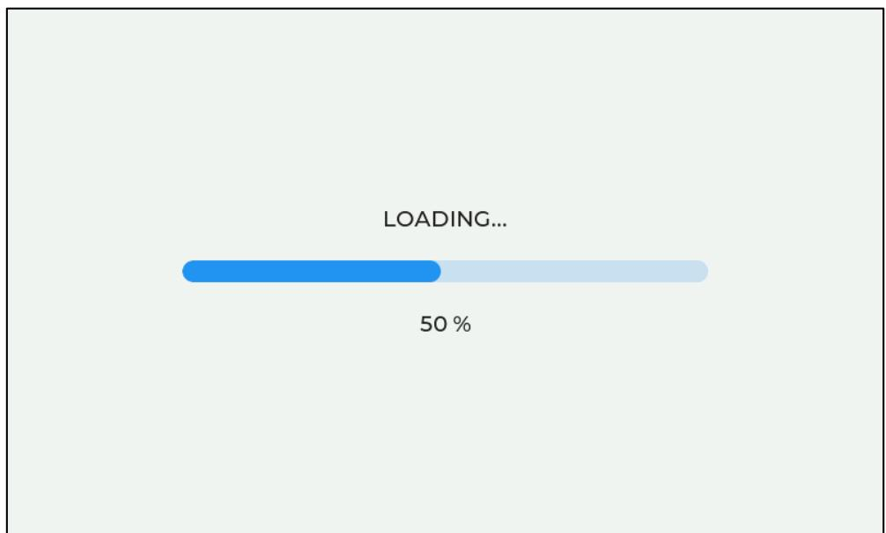  
图11.4.3.1 进度条实验

# 第十二章 按钮部件(lv_btn)

在实际的LVGL项目工程中，按钮部件的使用频率是非常高的，它常用于控制设备的启停。在LVGL中，当按钮部件被创建出来之后，其默认是一个圆角矩形，较为遗憾的是，按钮部件并不能直接设置文本。

本章节将分为以下几个小节：

12.1 按钮部件的组成  
12.2 按钮部件的相关知识  
12.3 按钮部件的 API 函数  
12.4 按钮部件的实验

# 12.1 按钮部件的组成

按钮部件(lv_btn)仅有一个组成部分：主体背景，示意图如下：

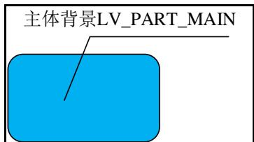  
图12.1.1按钮部件组成部分

关于部件样式设置的内容，请大家参考6.4.4章节。

# 12.2 按钮部件的相关知识

按钮部件和基础对象非常类似，它们的绝大部分知识都是通用的，这里我们只介绍它们之间的区别：

① 默认情况下，按钮部件不可滚动。  
(2) 默认情况下, 按钮部件已经添加到默认组中。  
(3) 按钮部件的默认宽高为 LV_SIZE_CONTENT（自适应）。

# 12.3 按钮部件的 API 函数

# lv��率函数

创建按钮对象，其函数原型如下所示：

```c
lv_obj_t * lv_btn_create ( lv_obj_t *parent);
```

该函数的形参，如表12.3.1所示：

表 12.3.1 lv_btn_create 函数形参描述  

<table><tr><td>参数</td><td>描述</td></tr><tr><td>parent</td><td>部件的父类</td></tr></table>

返回值：返回对象控制块。

# 12.4 按钮部件的实验

# 12.4.1 硬件设计

# 1. 例程功能

本实验主要测试按钮部件 API 函数的使用，实验现象：开机后，屏幕上显示三个控制按钮和速度提示标签，用户可以通过不同的按钮去控制速度值。与此同时，LED0 闪烁，提示系统正在运行。

该实验的完整源码，请参考《LVGL例程12btn(按钮)》例程，路径：A盘  $\rightarrow 4$  ，程序源码 $\rightarrow 3$  ，扩展例程  $\rightarrow 4$  ，LVGL例程。

# 12.4.2 软件设计

# 12.4.2.1 程序流程图

本实验的程序流程图，如下图 12.4.2.1.1 所示：

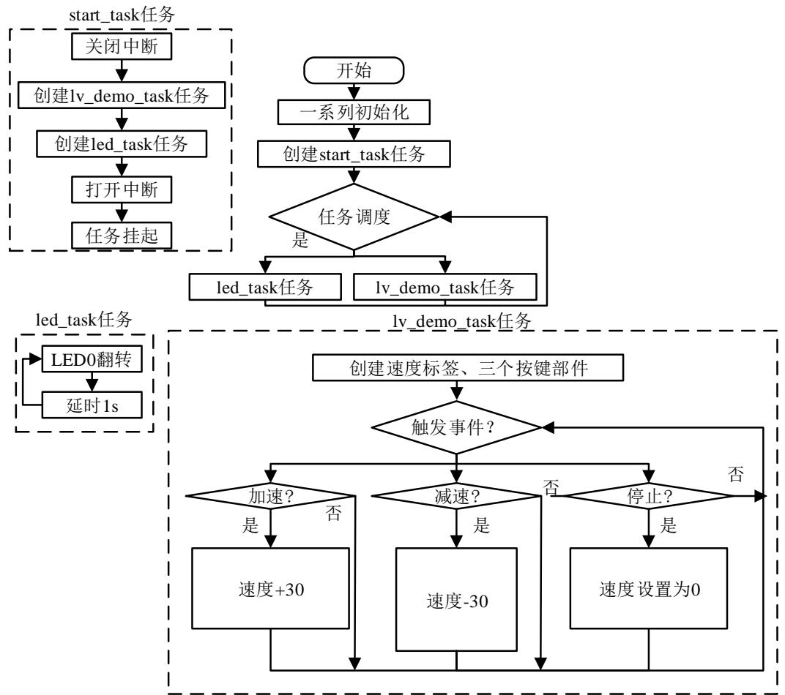  
图12.4.2.1.1按钮部件实验流程

# 12.4.2.2 程序解析

关于LVGL程序主要在lv_mainstart.c文件定义，首先我们看lv_mainstart函数，该函数是LVGL的程序入口，如下源码所示：

/★★★★★★★★★★★★★★★★★★★★★★★★★★★★★★★★★★★★★★★★★★★★★★★★★★★★★★★★★★★★★★★★★★★★★★★★★★★★★★★★★★★★★★★★★★★★★★★★★★★★★★★★★★★★★★★★★★★★★★★★★★★★★★★★★★★★★★★★★★★★★★★★★★★★★★★★★★★★★★★★★★★★★★★★★★★★★★★★★★★★★★★★★★★★★★★★★★★★★★★★★

```javascript
/\*\* \* @brief LVGL 演示\* @param 无\* @return 无\*/void lv_mainstart(void)lv_example_label(); /*速度提示标签*/lv_example_btn_up(); /*加速按钮*/lv_example_btn_down(); /*减速按钮*/lv_example_btn_stop(); /*急停按钮*/}  
/****** 第一部分 结束 /**********  
/******* 第二部分 开始 /**********  
/\*\* @brief 速度值提示标签\* @param 无\* @return 无\*/static void lv_example_label(void)  
{/\* 根据活动屏幕宽度选择字体 \*/if (scr_act_width() <= 320){font  $=$  &lv_font_montserrat_10;1else if (scr_act_width() <= 480){font  $=$  &lv.Font_montserrat_14;1else{font  $=$  &lv.Font_montserrat_20;1label_speed  $=$  lv_label_create(lv_scr_act()); /\*创建速度显示标签\*/lv_obj_set_style_text.Font.labelpeed,font,LV_PART_MAIN);/\*设置字体\*/lv_label_set_text.labelpeed,"Speed:0 RPM"); /\*设置文本\*//\*设置标签位置\*/lv_obj_align label_speed，LVALIGN_CENTER，0，-scr(act_height() / 3);
```

/*****/ 第二部分 结束 /

```c
/* */
* @brief 按钮回调
* @param *e: 事件相关参数的集合, 它包含了该事件的所有数据
* @return 无
*/
static void.btn_event_cb(lv_event_t * e)
{
    lv_obj_t *target = lv_event_get_target(e); /* 获取触发源 */
    if(target == btn_speed_up) /* 加速按钮 */
        {
            speed_val += 30;
        }
    else if(target == btn_speed_down) /* 减速按钮 */
        {
            speed_val -= 30;
        }
    else if(target == btn_stop) /* 急停按钮 */
        {
            speed_val = 0;
        }
    /* 更新速度值 */
    lv_label_set_text fmt.labelpeed, "Speed: %d RPM", speed_val);
}
/**
* @brief 加速按钮
* @param 无
* @return 无
*/
static void lv_example_btn_up(void)
{
    /* 创建加速按钮 */
    btn_speed_up = lv_btn_create(lv_scr_act());
    /* 设置按钮大小 */
    lv_obj_set_size(btn_speed_up, scr actu_width() / 4, scr actu_height() / 6);
    /* 设置按钮位置 */
    lv_obj_align(btn_speed_up, LVALIGN_CENTER, -scr actu_width() / 3, 0);
    /* 设置按钮事件 */
    lv_obj_add_event_cb(btn_speed_up, btn_event_cb, LV_EVENTCLICKED, NULL);
```

```c
lv_obj_t* label = lv_label_create(btn_speed_up); /* 创建加速按钮标签 */
lv_obj_set_style_text.Font.label, font, LV_PART_MAIN); /* 设置字体 */
lv_label_set_text[label, "Speed +"); /* 设置标签文本 */
lv_obj_set_align[label, LVALIGN_CENTER]; /* 设置标签位置 */
}
/* */
* @brief 减速按钮
* @param 无
* @return 无
*/
static void lv_example_btn_down(void)
{
/* 创建加速按钮 */
bta_speed_down = lv_bta_createLv_scr_act();
/* 设置按钮大小 */
lv_obj_set_size(bta_speed_down, scr actu_width() / 4, scr actu_height() / 6);
/* 设置按钮位置 */
lv_obj_align(bta_speed_down, LVALIGN_CENTER, 0, 0);
/* 设置按钮事件 */
lv_obj_add_event_cb(bta_speed_down, bta_event_cb, LV_EVENTCLICKED, NULL);
lv_obj_t* label = lv_label_create(bta_speed_down); /* 创建减速按钮标签 */
lv_obj_set_style_text_font.label, font, LV_PART_MAIN); /* 设置字体 */
lv_label_set_text[label, "Speed -"); /* 设置标签文本 */
lv_obj_set_align[label, LVALIGN_CENTER];
}
/* */
* @brief 急停按钮
* @param 无
* @return 无
*/
static void lv_example_btn_stop(void)
{
/* 创建急停按钮 */
bta_stop = lv_bta_createLv_scr actu();
/* 设置按钮大小 */
lv_obj_set_size(bta_stop, scr actu_width() / 4, scr actu_height() / 6);
/* 设置按钮位置 */
lv_obj_align(bta_stop, LVALIGN_CENTER, scr actu_width() / 3, 0);
/* 设置按钮背景颜色（默认） */
}
```

```c
lv_obj_set_style_bg_color(btn_stop, lv_color.hex(0xEF5f60), LV_STATE_DEFAULT);  
/* 设置按钮背景颜色（按下）*/  
lv_obj_set_style_bg_color(btn_stop, lv_color(hex(0xff0000), LV_STATE_pressed);  
/* 设置按钮事件 */  
lv_obj_add_event_cb(btn_stop, bn_event_cb, LV_EVENTCLICKED, NULL);  
lv_obj_t* label = lv_label_create(btn_stop); /* 创建急停按钮标签 */  
lv_obj_set_style_text.Font.label, font, LV_PART_MAIN); /* 设置字体 */  
lv_label_set_text.label, "Stop"); /* 设置标签文本 */  
lv_obj_set_align labelled, LVALIGN_CENTER); /* 设置标签位置 */
```

上述源码可分为以下三个部分：

① lv_mainstart 接口函数。在该函数中，我们调用了标签和按钮示例函数；  
② 速度标签实现。我们先根据活动屏幕的宽度来选择字体大小，然后创建速度显示标签并设置相应的文本内容。  
(3) 加减速、停止按钮函数实现。我们分别创建了加速、减速和急停按钮，并为它们设置了不同的样式，当某个按钮被按下时，会触发事件回调，在事件回调函数中，再根据触发源来更新当前速度值。

# 12.4.3 下载验证

把工程编译并下载到我们的开发板中，运行效果如图 12.4.3.1 所示：

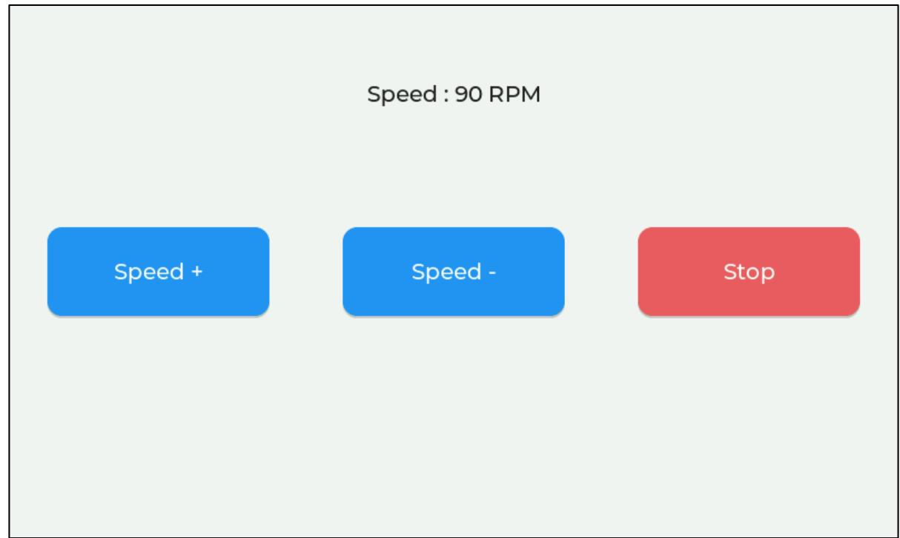  
图12.4.3.1按钮部件实验

# 第十三章 按钮矩阵部件(lv_btnmatrix)

在LVGL中，按钮矩阵部件相当于一系列伪按钮的集合，它按一定的序列来排布这些按钮。值得注意的是，这些伪按钮并不是真正的按钮部件（lv_btn），它们只是具有按钮外观的图形，但这些图形具有和按钮一样的点击效果。伪按钮所占的内存非常小，一个伪按钮大概占用8个字节，而一个普通按钮部件所占的内存大概为100~150个字节，由此可见，当GUI界面中使用较多按钮时，按钮矩阵的优势就尤为明显了。

本章节将分为以下几个小节：

13.1 按钮矩阵部件的组成  
13.2 按钮矩阵部件的相关知识  
13.3 按钮矩阵部件的 API 函数  
13.4 按钮矩阵部件的实验

# 13.1 按钮矩阵部件的组成

按钮矩阵部件由两个部分组成：主体背景和按钮，示意图如下：

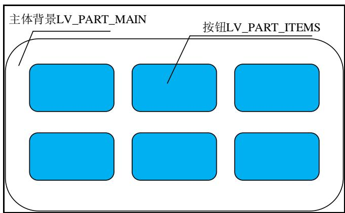  
图13.1.1按钮矩阵组成部分

关于部件样式设置的内容，请大家参考6.4.4章节。

# 13.2 按钮矩阵部件的相关知识

# 13.2.1 按钮文本设置

在LVGL中，按钮矩阵部件中的每个按钮都可以设置文本，如果用户想设置这些按钮文本，则需要定义一个字符串数组（指针），并在该数组中传入所需的文本内容，最后通过lv_btnmatrix_set_map函数设置按钮文本，示例代码如下：

```c
const char \* map[]  $=$  {"btn1","btn2","btn3",""};   
void lv_mainstart()   
{ lv_obj_t \* btnm1  $=$  lv_btnmatrix_create(lv_scr_act()); lv_btnmatrix_set_map(btnm1，map);   
}
```

在上述源码中，我们首先定义了字符串数组，里面传入了3个按钮的对应文本，注意：该数组最后一个元素必须为空。有了按钮数组后，再调用lv_btnmatrix_create函数创建按钮矩阵，最后通过lv_btnmatrix_set_map函数把字符串数组映射到按钮矩阵当中。示例代码可以在PC模拟器中运行，效果图如下所示：

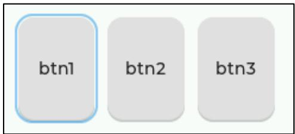  
图13.2.1.1 创建按钮矩阵

# 13.2.2 按钮换行

如果用户需要让按钮换行，可以在字符串数组中使用换行符“\n”，例如：{"btn1", "btn2", "\n", "btn3", ""}，示例代码如下：

```cpp
const char \* map[]  $=$  {"btn1","\n", "btn2","btn3",""};   
void lv_mainstart()   
{ lv_obj_t \* btnm1  $=$  lv_btmatrix_create(lv_scr_act()); lv_btmatrix_set_map(btm1, map);   
}
```

在上述源码中，我们在btn1之后进行换行，因此，btn2和btn3将出现在第二行，示例代码可以在PC模拟器中运行，效果图如下所示：

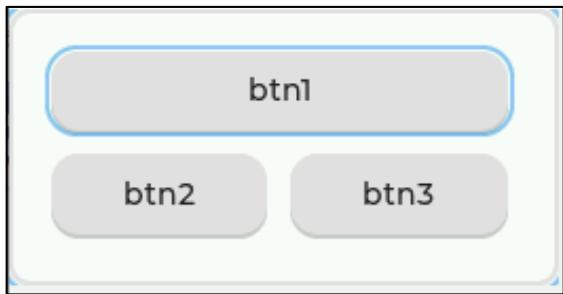  
图13.2.2.1按钮换行

# 13.2.3按钮索引

索引就相当于一个 ID，在按钮矩阵部件中，每一个按钮都有对应的索引。在上一小节的示例中，我们添加了 3 个按钮，这些按钮对应的索引如下所示：

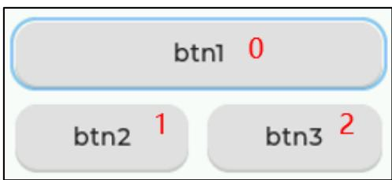  
图13.2.3.1 创建按钮矩阵

由上图可知，btn1为第一个按钮，其索引为0；btn2为第二个按钮，其索引为1，btn3以此类推。注意：索引对于按钮的属性设置非常重要，大家一定要理解它和实际按钮的对应关系。

# 13.2.4 按钮宽度

在默认情况下，按钮矩阵每一行按钮的宽度都是自动计算的，如果用户想改变按钮的宽度，可以调用lv_btnmatrix_setBtn_width函数来进行设置。值得注意的是，在按钮矩阵部件中，按钮只能设置相对宽度。

接下来，我们举一个例子，帮助大家理解按钮的相对宽度：假设按钮矩阵的某一行中存在3个按钮（btn1~btn3），btn1~btn3的相对宽度比为1：1：2，此时，btn1和btn2将各占该行 $25\%$  的宽度，而btn3将占该行  $50\%$  的宽度，示意图如下：

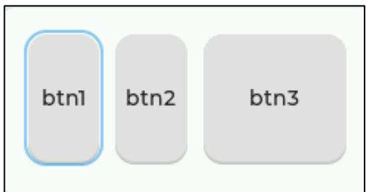  
图13.2.4.1设置按钮的宽度

# 13.2.5 按钮属性

用户可以调用lv_addrmatrix_set_addr_ctrl函数，为按钮添加、清除指定的属性，这些属性的相关枚举如下：

① LV_BTNMATRIX_CTRL_HIDDEN：将按钮隐藏；  
② LVBTNMATRIX_CTRL_NO_REPEAT：禁用长按；  
③ LVBTNMATRIX_CTRL DISABLED：禁用按钮；  
④ LVBTNMATRIX_CTRL_CHECKABLE：启用按钮状态切换；  
⑤ LVBTNMATRIX_CTRL_CHECKED：选中按钮；  
⑥ LVBTNMATRIX_CTRL_POPOVER：按下此按钮时在弹出窗口中显示按钮标签；  
⑦ LVBTNMATRIX_CTRL_RECOLOR：启用按钮文本的重新着色功能。

接下来，我们以简单示例来理解按钮属性的设置，示例代码如下所示：

```c
const char \* map[]  $=$  {"btn1","btn2","btn3",""};   
void lv_mainstart()   
{ lv_obj_t \* btnml  $=$  lv_btnmatrix_create(lv_scr_act()); lv_btnmatrix_set_map(btnml,map); lv_obj_set_size(btnml,800，480/2); lv_btnmatrix_set_btn_ctrl(btnml,0，LV_BTNMATRIX_CTRL_HIDDEN); lv_btnmatrix_set_btn_ctrl(btnml,1，LV_BTNMATRIX_CTRL DISABLED); lv_btnmatrix_set_btn_ctrl(btnml,2，LV_BTNMATRIX_CTRL_CHECKABLE); lv_btnmatrix_set_btn_width(btnml,2，2);   
}
```

在上述源码中，我们调用lv_btnmatrix_set_btn_ctrl函数，为btn1添加隐藏的属性，为btn2添加禁用的属性(不能点击)，示例代码可以在PC模拟器中运行，效果图如下所示：

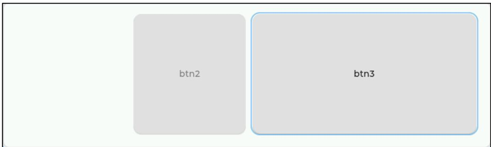  
图13.2.5.1添加按钮属性

如果用户想要清除按钮的指定属性，可以调用lv_btnmatrix_clearBtn_ctrl函数。

# 13.2.6 按钮互斥

按钮互斥是指：在某一时刻，只允许有一个按钮处于按下不弹起状态（被选中），当我们选中一个按钮之后，其他的按钮将会自动清除选中属性，示意图如下：

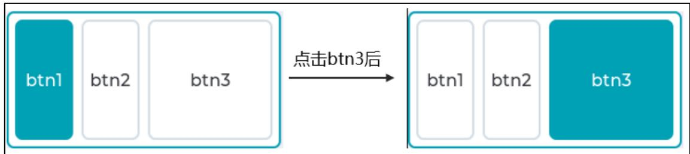  
图13.2.6.1按钮互斥示意图

用户可以调用lv_btnmatrix_set_one_checked函数，开启按钮互斥功能。接下来，我们以简单示例来理解按钮互斥的功能，示例代码如下所示：

```lisp
const char\* map[]  $=$  {"btn1","btn2","btn3",""};   
void lv_mainstart()   
{ lv_obj_t\* btnml  $=$  lv_btnmatrix_createLv_scr_act(); lv_btnmatrix_set_map(btnm1，map); lv_btnmatrix_set_btn_ctrl(btnm1,0,LV_BTNMATRIX_CTRL_CHECKABLE); lv_btnmatrix_set_btn_ctrl(btnm1,1,LV_BTNMATRIX_CTRL_CHECKABLE); lv_btnmatrix_set_btn_ctrl(btnm1,2,LV_BTNMATRIX_CTRL_CHECKABLE); lv_btnmatrix_set_btn_width(btnm1,2,2); lv_btnmatrix_set_one_checked(btnm1, true);   
}
```

由上述代码可知，按钮互斥功能的开启流程非常简单，我们只需要调用lv_btnmatrix_set_one_checked函数，并在其第二个入口参数中传入true即可。示例代码可以在PC模拟器中运行，效果图如下所示：

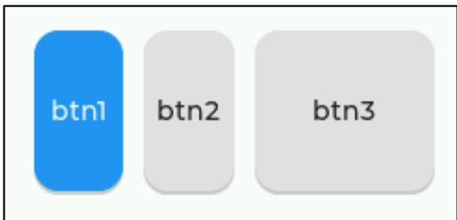  
图13.2.6.2按钮互斥示例

# 13.2.7 按钮文本重着色

在默认情况下，按钮矩阵中的按钮文本都是黑色的，如果用户需要设置文本为其他的颜色，则必须先调用lv_btnmatrix_set_btn_ctrl函数，为按钮添加文本重着色的属性。

接下来，我们以简单示例来帮助大家理解按钮文本的重着色，示例代码如下所示：

```c
const char \* map[]  $=$  {"#FF0000 btn1#"，"btn2","btn3",""};   
void lv_mainstart()   
{ lv_obj_t \* btm1 = lv_btmatrix_createLv_scr_act(), NULL); lv_btmatrix_set_map(btm1, map); lv_btmatrix_set_btm_ctrl(btm1, 0, LV_BTNMATRIX_CTRL_RECOLOR);   
}
```

由上述源码可知，我们在定义按钮数组时，为btn1的文本设置了颜色（红色），其通用的格式为：#+16进制颜色  $^+$  按钮文本  $^+\#$  ，例如设置红色文本：#FF0000 btn1#。值得注意的是，在设置完文本颜色之后，我们还需要为按钮添加文本重着色的属性，其相关的枚举为LV_BTNMATRIX_CTRL_RECOLOR。示例代码可以在PC模拟器中运行，效果图如下所示：

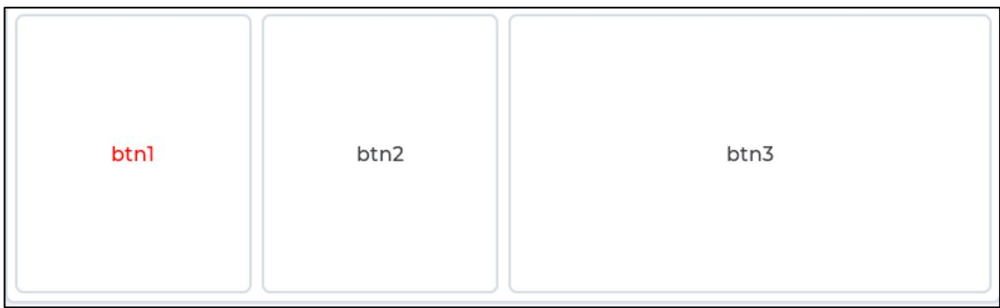  
图13.2.7.1btn1重着色

# 13.2.8 按钮矩阵部件的事件

① LV_EVENT_VALUE_CHANGED: 当一个按钮被按下、释放或长按时发送。  
② LV_EVENT_DRAW_PART_BEGIN: 开始绘制按钮。

# 13.3 按钮矩阵部件的 API 函数

LVGL官方提供了一些与按钮矩阵部件相关API，如下表所示：

<table><tr><td>函数</td><td>描述</td></tr><tr><td>lv_btnmatrix_create()</td><td>创建按钮矩阵部件</td></tr></table>

表 13.3.1 按钮矩阵部件相关的 API 函数  

<table><tr><td>lv_btnmatrix_set_map()</td><td>设置按钮</td></tr><tr><td>lv_btnmatrix_set_ctrl_map()</td><td>设置多个按钮属性</td></tr><tr><td>lv_btnmatrix_set_selected_btm()</td><td>设置选中的按钮</td></tr><tr><td>lv_btnmatrix_set_btm_ctrl()</td><td>设置一个按钮的属性</td></tr><tr><td>lv_btnmatrix_clear_btm_ctrl()</td><td>清除某个按钮的属性</td></tr><tr><td>lv_btnmatrix_set_btm_ctrl_all()</td><td>设置所有按钮的属性</td></tr><tr><td>lv_btnmatrix_clear_btm_ctrl_all()</td><td>清除所有按钮的属性</td></tr><tr><td>lv_btnmatrix_set_btm_width()</td><td>设置单个按钮的相对宽度</td></tr><tr><td>lv_btnmatrix_set_one_checked()</td><td>设置按钮互斥</td></tr><tr><td>lv_btnmatrix_get_map()</td><td>获取按钮相关映射</td></tr><tr><td>lv_btnmatrix_get_selected_btm()</td><td>获取用户最后点击的按钮的索引</td></tr><tr><td>lv_btnmatrix_get_btm_text()</td><td>获取按钮的文本</td></tr><tr><td>lv_btnmatrix_has_btm_ctrl()</td><td>获取按钮的状态</td></tr><tr><td>lv_btnmatrix_get_one_checked()</td><td>判断按钮互斥是否开启</td></tr></table>

接下来，我们介绍LVGL按钮矩阵部件常用的API函数：

# 1.lv_btnmatrix_create函数

创建按钮矩阵对象，其函数原型如下所示：

```c
lv_obj_t * lv_btnmatrix_create (lv_obj_t *parent);
```

该函数的形参，如表13.3.2所示：

表 13.3.2 lv_btnmatrix_create 函数形参描述  

<table><tr><td>参数</td><td>描述</td></tr><tr><td>parent</td><td>部件的父类</td></tr></table>

返回值：返回对象的指针。

# 2.lv_htnmatrix_set_map函数

设置按钮，其函数原型如下所示：

```txt
void lv_btnmatrix_set_map (lv_obj_t * obj, const char * map [ ]) ;
```

该函数的形参，如表13.3.3所示：

表 13.3.3 lv_btnmatrix_set_map 函数形参描述  

<table><tr><td>参数</td><td>描述</td></tr><tr><td>obj</td><td>指向按钮矩阵对象的指针</td></tr><tr><td>map</td><td>指针一个字符串数组，最后一个元素必须为空，可以使用“\n”换行</td></tr></table>

返回值：无。

# 3.lv_btnmatrix_set_ctrl_map函数

设置多个按钮属性，其函数原型如下所示：

```txt
void lv_btnmatrix_set_ctrl_map (lv_obj_t * obj, const lv_btnmatrix_ctrl_t ctrl_map[])
```

该函数的形参，如表13.3.4所示：

表 13.3.4 lv_btnmatrix_set_ctrl_map 函数形参描述  

<table><tr><td>参数</td><td>描述</td></tr><tr><td>obj</td><td>指向按钮矩阵对象的指针</td></tr><tr><td>ctrl_map</td><td>指向按钮属性数组的指针</td></tr></table>

返回值：无。

# 4.lv_btnmatrix_set_selected_btn函数

设置选中的按钮，其函数原型如下所示：

```c
void lv_btnmatrix_set_selected_btn (lv_obj_t * obj, uint16_t btn_id);
```

该函数的形参，如表13.3.5所示：

表 13.3.5 lv_btnmatrix_set_selected_btn 函数形参描述  

<table><tr><td>参数</td><td>描述</td></tr><tr><td>obj</td><td>指向按钮矩阵对象的指针</td></tr><tr><td>btn_id</td><td>按钮索引</td></tr></table>

返回值：无。

# 5.lv_btnmatrix_set_btn_ctrl函数

设置一个按钮的属性，其函数原型如下所示：

```c
void lv_btnmatrix_set_btn_ctrl (lv_obj_t * obj, uint16_t btn_id, lv_btnmatrix_ctrl_t ctrl);
```

该函数的形参，如表13.3.6所示：

表 13.3.6 lv_btnmatrix_set_btn_ctrl 函数形参描述  

<table><tr><td>参数</td><td>描述</td></tr><tr><td>obj</td><td>指向按钮矩阵对象的指针</td></tr><tr><td>btn_id</td><td>按钮索引</td></tr><tr><td>ctrl</td><td>按钮属性</td></tr></table>

返回值：无。

# 6.lv_btnmatrix_clear_btn_ctrl函数

清除某个按钮的属性，其函数原型如下所示：

```txt
void lv_btnmatrix_clear_btn_ctrl (lv_obj_t * obj, uint16_t btn_id, lv_btnmatrix_ctrl_t ctrl);
```

该函数的形参，如表13.3.7所示：

表 13.3.7 lv_btmatrix_clear_btm_ctrl 函数形参描述  

<table><tr><td>参数</td><td>描述</td></tr><tr><td>obj</td><td>指向按钮矩阵对象的指针</td></tr><tr><td>btn_id</td><td>按钮索引</td></tr><tr><td>ctrl</td><td>按钮属性</td></tr></table>

返回值：无。

# 7.lv_bpnmatrix_set_bptrl_all函数

设置所有按钮的属性，其函数原型如下所示：

```txt
void lv_btnmatrix_set_btn_ctrl_all (lv_obj_t * obj, lv_btnmatrix_ctrl_t ctrl);
```

该函数的形参，如表13.3.8所示：

表 13.3.8 lv_btnmatrix_set_btn_ctrl_all 函数形参描述  

<table><tr><td>参数</td><td>描述</td></tr><tr><td>obj</td><td>指向按钮矩阵对象的指针</td></tr><tr><td>ctrl</td><td>按钮属性</td></tr></table>

返回值：无。

# 8.lv_btnmatrix_clear_btn_ctrl_all函数

清除所有按钮的属性，其函数原型如下所示：

```txt
void lv_btnmatrix_clear_btn_ctrl_all (lv_obj_t * obj, lv_btnmatrix_ctrl_t ctrl);
```

该函数的形参，如表13.3.9所示：

表 13.3.9 lv_btnmatrix_clear_btn_ctrl_all 函数形参描述  

<table><tr><td>参数</td><td>描述</td></tr><tr><td>obj</td><td>指向按钮矩阵对象的指针</td></tr><tr><td>ctrl</td><td>按钮属性</td></tr></table>

返回值：无。

# 9.lv_bpnmatrix_set_bp_width函数

设置单个按钮的相对宽度，其函数原型如下所示：

```c
void lv_btnmatrix_set_btn_width (lv_obj_t * obj, uint16_t btn_id, uint8_t width);
```

该函数的形参，如表13.3.10所示：

表 13.3.10 lv��率矩阵的计算函数形参描述  

<table><tr><td>参数</td><td>描述</td></tr><tr><td>obj</td><td>指向按钮矩阵对象的指针</td></tr><tr><td>btn_id</td><td>按钮索引</td></tr><tr><td>width</td><td>相对宽度，可选值的范围：1~7</td></tr></table>

返回值：无。

# 10.lv_bpnmatrix_set_one_checked函数

设置按钮互斥，其函数原型如下所示：

```txt
void lv_btnmatrix_set_one_checked (lv_obj_t * obj, bool en);
```

该函数的形参，如表13.3.11所示：

表 13.3.11 lv_btnmatrix_set_one_checked 函数形参描述  

<table><tr><td>参数</td><td>描述</td></tr><tr><td>obj</td><td>指向按钮矩阵对象的指针</td></tr><tr><td>en</td><td>是否启用按钮互斥功能</td></tr></table>

返回值：无。

# 13.4 按钮矩阵部件的实验

# 13.4.1 硬件设计

# 1. 例程功能

本实验主要测试按钮矩阵部件 API 函数的使用，实验现象：开机后，屏幕上会显示一个密码输入界面，用户按下按钮矩阵中的某个按钮时，输入框中会显示相应的按钮文本。与此同时，LED0 闪烁，提示系统正在运行。

该实验的完整源码，请参考《LVGL例程13btmatrix(按钮矩阵)》例程，路径：A盘  $\rightarrow 4$  程序源码  $\rightarrow 3$  ，扩展例程  $\rightarrow 4$  ，LVGL例程。

# 13.4.2 软件设计

# 13.4.2.1 程序流程图

本实验的程序流程图，如下图 13.4.2.1.1 所示：

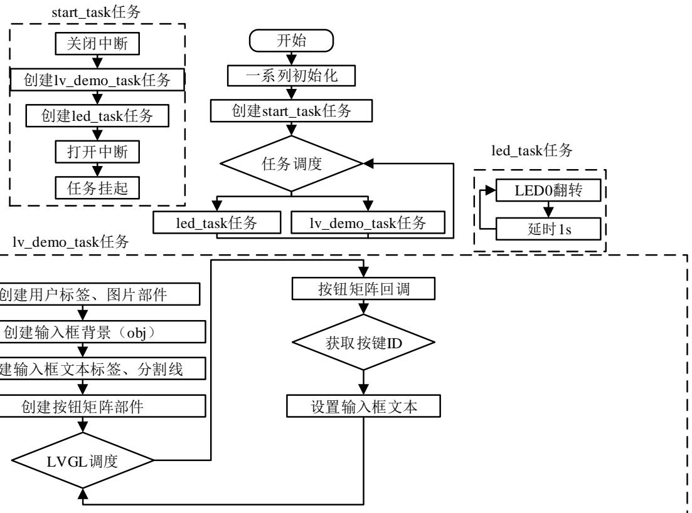  
图13.4.2.1.1 按钮矩阵部件实验流程图

# 13.4.2.2 程序解析

关于LVGL的用户代码，我们都是在lv_mainstart.c文件中编写的，本实验的源码如下所示：

```c
/\*\*\*\*\*\*\*\*\*\*\*\*\*\*\*\*\*\*\*\*\*\*\*\*\*\*\*\*\*\*\*\*\*\*\*\*\*\*\*\*\*\*\*\*\*\*\*\*\*\*\*\*\*\*\*\*\*\*\*\*\*\*\*\*\*\*\*\*\*\*\*\*\*\*\*\*\*\*\*\*\*\*\*\*\*\*\*\*\*\*\*\*\*\*\*\*\*\*\*\*\*  
\*/  
\*@briefLVGL演示  
\*@param无  
\*@return无  
\*/  
void lv_mainstart(void)  
{lv_example_btnmatrix();}  
/\*\*\*\*\*\*\*\*\*\*\*\*\*\*\*\*\*\*\*\*\*第一部分结束\* /\*  
/\*\*\*\*\*\*\*\*\*\*\*第二部分开始\* /\*  
/\*  
\*@brief按钮矩阵事件回调  
\*@param \*e：事件相关参数的集合，它包含了该事件的所有数据  
\*@return无  
\*/
```

```c
static void btnm_event_cb(lv_event_t\*e)   
{ uint8_t id; lv_event_code_t code  $=$  lv_event_get_code(e); /\*获取事件类型\*/ lv_obj_t \*target  $=$  lv_event_get_target(e); /\*获取触发源\*/ if (code  $= =$  LV_EVENT_VALUE_CHANGED) { id  $=$  lv_btnmatrix_get_selected_btn(target); /\*获取按钮索引\*/ /\*更新输入框标签文本\*/ lv_label_set_text.label_input,lv_btnmatrix_get_btn_text(target,id)); /\*设置标签位置\*/ lv_obj_align_to labelled_input, obj_input, LVALIGN_CENTER,0,0); }   
}   
/\*\* \*@brief 密码输入界面 \* @param 无 \* @return 无   
\*/ static void lv_example_btnmatrix(void)   
{ /\*根据屏幕宽度选择字体和图片缩放系数\*/ if (scr_act_width() <= 480) { font  $=$  &lv_font_montserrat_14; zoom_val  $= 128$  . } else { font  $=$  &lv.Font_montserrat_30; zoom_val  $= 256$  . } /\*图片显示\*/ lv_obj_t \*img  $=$  lv_img_create(lv_scr_act()); /\*创建图片部件\*/ lv_img_set_src(img,&img_user); /\*设置图片源\*/ lv_img_set_Zoom(img,zoom_val); /\*设置图片缩放\*/ /\*设置位置\*/ lv_obj_align(img,LV ALIGN_CENTER,-scr actuwidth/4,
```

```c
- scr_act_height() / 7);  
/* 设置重新着色 */  
lv_obj_set_style_img_recolor(img, lv_color.hex(0xf2f2f2), 0);  
lv_obj_set_style_img_recolor_opa(img, 100, 0); /* 设置着色透明度 */  
/* 用户标签 */  
lv_obj_t *label_user = lv_label_create(lv_scr_act()); /* 创建标签 */  
lv_label_set_text.label_user, "USER"); /* 设置文本 */  
/* 设置字体 */  
lv_obj_set_style_text.Font(obj_user, font, LV_PART_MAIN);  
/* 设置文本居中 */  
lv_obj_set_style_text_align(obj_user, LV_TEXT Alignment_CENTER, LV_PART_MAIN);  
/* 设置位置 */  
lv_obj_align_to(obj_user, img, LVALIGN_OUT BOTTOM_MID, 0, 10);  
/* 输入框背景 */  
obj_input = lv_obj_create(lv_scr_act()); /* 创建基础对象 */  
/* 设置大小 */  
lv_obj_set_size(obj_input, scr actuwidth() / 4, scr actuheight() / 12);  
/* 设置位置 */  
lv_obj_align_to(obj_input, label_user, LVALIGN_OUT BOTTOM_MID, 0, scr actuheight() / 20);  
/* 设置背景颜色 */  
lv_obj_set_style bgcolor(obj_input, lv_color(hex(0xcccc)), 0);  
lv_obj_set_style bgop (obj_input, 150, 0); /* 设置透明度 */  
lv_obj_set_styleborder_width(obj_input, 0, 0); /* 去除边框 */  
lv_obj_set_style_radius(obj_input, 20, 0); /* 设置圆角 */  
lv_obj_remove_style(obj_input, NULL, LV_PART_SCROLLBAR); /* 移除滚动条 */  
/* 输入框文本标签 */  
label_input = lv_label_create(lv_scr_act()); /* 创建标签 */  
lv_label_set_text(obj_input, "", /* 设置文本 */  
/* 设置字体 */  
lv_obj_set_style_textFont(obj_input, font, LV_PART_MAIN);  
lv_obj_set_style_text_align(obj_input, LV_TEXT ALIGN Center, LV_PART_MAIN); /* 设置文本居中 */  
/* 设置位置 */  
lv_obj_align_to(obj_input, obj_input, LV alignmentsCENTER, 0, 0);  
/* 分隔线 */  
lv_obj_t *line = lv_line_create(lv_scr_act()); /* 创建线条 */  
lv_line_set_points(line, points, 2); /* 设置线条坐标点 */
```

```c
lv_obj_align(line, LV-align_CENTER, 0, 0); /* 设置位置 */  
/* 设置线条颜色 */  
lv_obj_set_style_line_color(line, lv_color_hex(0xdcdcd), 0);  
/* 按钮矩阵（创建）*/  
lv_obj_t *btnm = lv_btnmatrix_create(lv_scr_act()); /* 创建按钮矩阵 */  
/* 设置大小 */  
lv_obj_set_size(btm, scr_act_width() * 2/5, scr actu_width() * 2/5);  
/* 设置按钮 */  
lv_btnmatrix_set_map(btm, num_map);  
/* 设置位置 */  
lv_obj_align(btm, LVALIGN_RIGHT_MID, -scr actu_width() / 16, 0);  
/* 设置字体 */  
lv_obj_set_style_text.Font(btm, font, LV_PART_ITEM);  
/* 按钮矩阵（优化界面）*/  
lv_obj_set_styleborder_width(btm, 0, LV_PART_MAIN); /* 去除主体边框 */  
lv_obj_set_style bg_opa(btm, 0, LV_PART_MAIN); /* 设置主体背景透明度 */  
lv_obj_set_style bg_opa(btm, 0, LV_PART_ITEM); /* 设置按钮背景透明度 */  
lv_obj_set_styleshadow_width(btm, 0, LV_PART_ITEM); /* 去除按钮阴影 */  
/* 设置按钮矩阵回调 */  
lv_obj_add_event_cb(btm, btm_event_cb, LV_EVENT_VALUE_CHANGEDED, NULL);  
}
```

上述源码可分为以下两个部分：

① lv_mainstart 接口函数。在该函数中，我们调用了按钮矩阵示例函数；  
② 按钮矩阵的文本输入功能实现。我们先根据活动屏幕的宽度来选择字体大小，然后分别创建图片、用户标签、输入框背景、输入框标签以及分割线，最后再创建按钮矩阵部件并优化其样式。当用户按下按钮矩阵中的某个按钮，就会触发事件回调，在回调函数中，会将当前被按下的按钮所对应的文本更新到输入框。

# 13.4.3 下载验证

把工程编译并下载到我们的开发板中，运行效果如图 13.4.3.1 所示：

  
图13.4.3.1按钮矩阵部件实验

USER

1

4

7

#

2

5

8

0

3

6

9

%

# 第十四章 画布部件 lv Canvas

在LVGL的画布部件中，用户可以绘制任何内容，并为其添加特殊效果，该部件会使用LVGL的绘图引擎来绘制这些内容。

本章节将分为以下几个小节：

14.1 画布部件的组成  
14.2 画布部件的相关知识  
14.3 画布部件的 API 函数  
14.4 画布部件的实验

# 14.1 画布部件的组成

画布部件只有一个组成部分：主体LV_PART_MAIN。

关于部件样式设置的内容，请大家参考6.4.4章节。

# 14.2 画布部件的相关知识

# 14.2.1 画布创建

画布的创建流程很简单，一共有三个步骤：

① 为画布申请缓冲区内存；  
② 创建画布部件；  
(3) 为画布设置缓冲区。

接下来，我们以一个简单的示例帮助大家理解画布的创建流程，示例代码如下：

```c
define CANVAS_WIDTH 200  
#define CANVAS_HEIGHT 150  
/* 第一步：为画布申请缓冲区内存 */  
static lv_color_t cbuf[LV_CANVASBUF_SIZE_true_COLOR(CANVAS_WIDTH, CANVAS_HEIGHT)];  
/* 第二步：创建一个画布*/  
lv_obj_t * canvas = lv Canvas_create(lv_scr_act());  
lv_obj_center(canvas);  
/* 第三步：为画布设置缓冲区 */  
lv Canvas_set_buffer(canvas, cbuf, CANVAS_WIDTH, CANVAS_HEIGHT, LV_IMAGE_CF_true_COLOR);
```

在上述源码中，我们先定义一个缓冲区数组，该数组用于存储需要绘制的图像数据，有了缓冲区之后，就可以创建一个画布并为其设置缓冲区。示例代码可以在PC模拟器中运行，效果图如下所示：

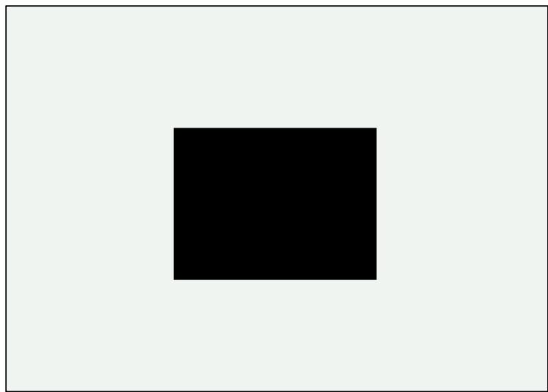  
图14.2.1.1 创建画布

# 14.2.2 画布调色板设置

用户需要设置调色板，可以调用lv Canvas_set Palette函数，示例如下：

```sql
lv Canvas_set Palette(canvas, 3, LV_COLOR_RED);
```

上述源码表示：将标识为3的像素设置为红色。

# 14.2.3 画布部件的绘画

画布部件可以绘制矩形、文本、图片和线条等，相关的绘制函数如下：

```txt
/\*绘制矩形\*/  
lv Canvas.draw_rect(canvas，x，y，width，heigth，&draw_dsc)  
/\*绘制文本\*/  
lv Canvas.draw_text(canvas，x，y，max_width，&draw_dsc，txt, LV.LabelALIGN_LEFT/CENTER/RIGHT)  
/\*绘制图片\*/  
lv Canvas.drawimg(canvas，x，y，&img_src，&draw_dsc)  
/\*绘制线\*/  
lv Canvas.draw_line(canvas，point_array，point_cnt，&draw_dsc)  
/\*绘制多边形\*/  
lv Canvas.drawpolygon(canvas，points_array，point_cnt，&draw_dsc)  
/\*绘制圆弧\*/  
lv Canvas.draw_ar canvas，x，y，radius，start_angle，end_angle，&draw_dsc)
```

接下来，我们结合源码，以绘画矩形为例，帮助大家理解绘画的配置流程，示例代码如下：

```c
define CANVAS_WIDTH 200  
#define CANVAS_HEIGHT 150  
void lv_mainstart(void)  
{lv_draw_rect_dsc_t rect_dsc;/*第一步：为画布申请缓冲区内存*/
```

```c
static lv_color_t cbuf [LV_CANVAS BUF_SIZE_true_COLOR(CANVAS_WIDTH, CANVAS_HEIGHT)]; /* 第二步：创建一个画布并初始化它的调色板 */ lv_obj_t* canvas = lv Canvas_create(lv_scr_act()); lv_obj_align(canvas, LVALIGN_CENTER, 0, 0); /* 第三步：为画布设置缓冲区 */ lv Canvas_set_buffer(canvas, cbuf, CANVAS_WIDTH, CANVAS_HEIGHT, LVIMG_CF_true_COLOR); lv_draw_rect_dsc_init(&rect_dsc); rect_dsc.width = 10; /* 设置圆角属性为10*/ rect_dsc.bg_opa = LV_OPA_COVER; /* 设置透明覆盖 */ rect_dsc.bg_color = lv Palette_main(LV_PALETTE_RED); /* 设置背景延时为红色 */ rect_dscborder_width = 2; /* 设置边框厚度为2*/ rect_dsc.birth_opa = LV_OPA_90; /* 设置边框透明 */ rect_dscemingcolor = lv_color_white(); /* 设置边框颜色 */ rect_dsc.shadow_width = 5; /* 设置阴影 */ rect_dsc.shadow_ofs_x = 5; /* 设置阴影偏移x*/ rect_dsc.shadow_ofs_y = 5; /* 设置阴影偏移y*/ lv Canvas.Draw_rect(canvas, 70, 60, 100, 70, &rect_dsc); }
```

由上述源码可知，绘画的配置流程一共有三步：

① 定义画布相关的描述符，例如：lv_draw_rect_dsc_t rect_dsc;  
② 调用lv_draw_rect_dsc_init初始化函数。  
(3) 设置各种属性（开始绘画）。

示例代码可以在PC模拟器中运行，效果图如下所示：

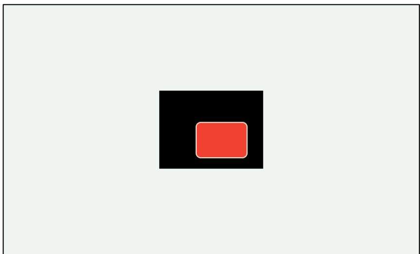  
图14.2.3.1绘画矩形

# 14.2.4 画布部件的旋转

如果用户需要旋转画布中的图像，则可以调用lv Canvas_transform函数来设置，旋转后的结果将会存储在画布上。lv Canvas_transform函数的入口参数如下表所示：

表 14.2.4.1 lv Canvas_transform 函数形参描述  

<table><tr><td>参数</td><td>描述</td></tr><tr><td>canvas</td><td>指向画布对象</td></tr><tr><td>img_pointer</td><td>转换为图像描述符</td></tr><tr><td>angle</td><td>旋转角度(0~3600)，最小步进值：0.1</td></tr><tr><td>zoom</td><td>缩放系数(256，不缩放；512，2倍；128，缩小为1/2)</td></tr><tr><td>offset_x</td><td>X轴偏移量</td></tr><tr><td>offset_y</td><td>Y轴偏移量</td></tr><tr><td>pivot_x</td><td>X轴坐标</td></tr><tr><td>pivot_y</td><td>Y轴坐标</td></tr><tr><td>antialias</td><td>true:在转换过程中应用抗锯齿</td></tr></table>

注意：画布并不能自行旋转，它需要有一个存储图像的缓冲区，而当前的图像将会被复制到该缓冲区中，复制完成后，系统再将其旋转（更新）到画布中。

接下来，我们结合源码，帮助大家理解画布旋转的配置流程，示例代码如下：

```c
define CANVAS_WIDTH 200
#define CANVAS_HEIGHT 150
void lv_mainstart(void)
{
    lv_draw_rect_dsc_t rect_dsc;
    static lv_color_t cbuf[LV_CANVAS BUF_SIZE_true_COLOR(CANVAS_WIDTH, CANVAS_HEIGHT)];
    /* 第二步：创建一个画布 */
    lv_obj_t* canvas = lv Canvas_create(lv_scr_act());
    lv_obj_align(canvas, LVALIGN_CENTER, 0, 0);
    /* 第三步：为画布设置缓冲区 */
    lv Canvas_set_buffer(canvas, cbuf, CANVAS_WIDTH, CANVAS_HEIGHT, LV_IMAGE_CF_true_COLOR);
    lv.Draw_rect_dsc_init(&rect_dsc);
    rect_dsc.width = 10; /* 设置圆角属性为10 */
    rect_dsc.bg_opa = LV_OPA_COVER; /* 设置透明覆盖 */
    rect_dsc.bg_color = lv Palette_main(LV_PALETTE_RED); /* 设置背景延时为红色 */
    rect_dscborder_width = 2; /* 设置边框厚度为2 */
    rect_dsc.button_opa = LV_OPA_90; /* 设置边框透明 */
    rect_dsc.buttoncolor = lv_color_white(); /* 设置边框颜色 */
    rect_dsc.shadow_width = 5; /* 设置阴影 */
    rect_dsc.shadow_ofs_x = 5; /* 设置阴影偏移x */
    rect_dsc.shadow_ofs_y = 5; /* 设置阴影偏移y */
    lv Canvas.draw_rect(canvas, 70, 60, 100, 70, &rect_dsc);
    /* 第一步：创建一个数组 */
    static lv_color_t cbuf_tmp[CANVAS_WIDTH * CANVAS_HEIGHT];
    /* 第二步：复制源目标数据到该数组中 */
```

```c
memcpy(cbuf_tmp, cbuf, sizeof(cbuf_tmp));
/* 第三步：定义一个lv_img_dsc_t描述符 */
lv_img_dsc_t img;
/* 第四步：设置图像相关属性 */
img.data = (const uint8_t *) cbuf_tmp; /* 设置图片数据 */
img.header.cf = LV_IMAGE_CF_true_COLOR; /* 设置不透明 */
img.header.w = CANVAS_WIDTH; /* 设置宽度 */
img.header.h = CANVAS_HEIGHT; /* 设置高度 */
/* 第五步：设置图像旋转 */
lv Canvas_transform(canvas, &img, 30, LV_IMAGE_ZOOM_NONE, 0, 0, CANVAS_WIDTH / 2, CANVAS_HEIGHT / 2, true);
}
```

由上述源码可知，画布的旋转配置流程分为以下五个步骤：

① 创建一个数组；  
② 复制源目标数据到该数组中；  
③ 定义一个lv_img_dsc_t描述符；  
(4) 设置图像相关的各种属性;  
⑤ 调用lv Canvas_transform函数，设置图像旋转。

示例代码可以在PC模拟器中运行，效果图如下所示：

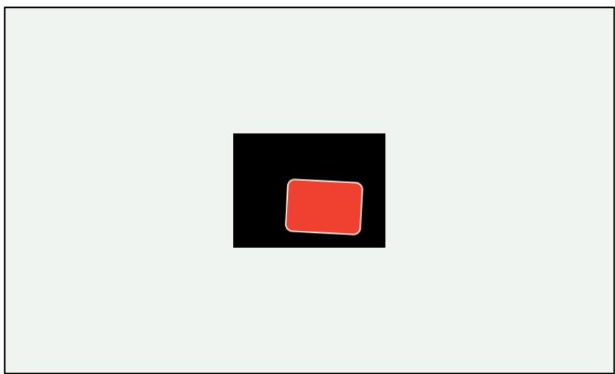  
图14.2.4.1设置目标源旋转

# 14.2.5 画布部件的模糊处理

用户可以在画布的指定区域用应用模糊效果，相关的设置函数如下：

```c
lv Canvas_blur_HOR(canvas, &area, r) /* 水平方向模糊 */
lv Canvas_blur_ver(canvas, &area, r) /* 垂直方向模糊 */
```

在上述的两个函数中，第二个入口参数代表坐标值，第三个入口参数代表模糊区域的半径。

接下来，我们结合源码，帮助大家理解模糊处理的配置流程，示例代码如下：

```c
define CANVAS_WIDTH 200  
#define CANVAS_HEIGHT 150  
void lv_mainstart(void)
```

```c
{lv.draw_rect_dsc_t rect_dsc; /*第一步：为画布申请缓冲区内存*/ static lv_color_t cbuf [LV_CANVAS BUF_SIZE_true_COLOR(CANVAS_WIDTH, CANVAS_HEIGHT)]; /*第二步：创建一个画布并初始化它的调色板*/ lv_obj_t* canvas = lv Canvas_create(lv_scr_act()); lv_obj_align(canvas, LVALIGN_CENTER, 0, 0); /*第三步：为画布设置缓冲区*/ lv Canvas_set_buffer(canvas, cbuf, CANVAS_WIDTH, CANVAS_HEIGHT, LV_IMAGE_CF_true_COLOR); lv.Draw_rect_dsc_init(&rect_dsc); rect_dsc.width = 10; /*设置圆角属性为10*/ rect_dsc.bg_opa = LV_OPA_COVER; /*设置透明覆盖*/ rect_dsc.bg_color = lvpalette_main(LV_PALETTE_RED); /*设置背景延时为红色*/ rect_dscborder_width = 2; /*设置边框厚度为2*/ rect_dsc.birth_opa = LV_OPA_90; /*设置边框透明*/ rect_dsc.birth_color = lv_color_white(); /*设置边框颜色*/ rect_dsc.sunwidth = 5; /*设置阴影*/ rect_dsc.sun ofs_x = 5; /*设置阴影偏移x*/ rect_dsc.sun ofs_y = 5; /*设置阴影偏移y*/ lv Canvas.Draw_rect(canvas, 70, 60, 100, 70, &rect_dsc); static lv_color_t cbuf_tmp[CANVAS_WIDTH * CANVAS_HEIGHT]; memcpy(cbuf_tmp, cbuf, sizeof(cbuf_tmp)); lv_img_dsc_t img; img.data = (const uint8_t *)cbuf_tmp; /*设置图片数据*/ img.header.cf = LV_IMAGE_CF_true_COLOR; /*设置不透明*/ img.header.w = CANVAS_WIDTH; /*设置宽度*/ img.header.h = CANVAS_HEIGHT; /*设置高度*/ lv Canvas_transform(canvas, &img, 30, LV_IMAGE_ZOOM_NONE, 0, 0, CANVAS_WIDTH / 2, CANVAS_HEIGHT / 2, true); lv_area_t area; area.x1 = 70; /*设置区域x1*/ area.y1 = 60; /*设置区域y1*/ area.x2 = 100; /*设置区域x2*/ area.y2 = 100; /*设置区域y2*/ lv Canvas_blur_HOR(canvas, &area, 40); /*设置水平模糊*/
```

由上述代码可知，模糊处理的配置流程非常简单，我们首先设置模糊区域的坐标，然后调用lv Canvas_blur_HOR函数，执行水平方向的模糊处理。注意：这里也可以配置为垂直方向的模糊处理。示例代码可以在PC模拟器中运行，效果图如下所示：

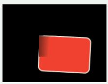  
图14.2.5.1设置模糊处理

# 14.3 画布部件的 API 函数

LVGL官方提供了一些与画布部件相关API，如下表所示：

表 14.3.1 画布部件相关的 API 函数  

<table><tr><td>函数</td><td>描述</td></tr><tr><td colspan="2">画布部件的设置函数</td></tr><tr><td>lv Canvas_create()</td><td>创建画布</td></tr><tr><td>lv Canvas_set_buffer()</td><td>为画布设置缓冲区</td></tr><tr><td>lv Canvas_set_px_color()</td><td>设置画布上一个像素的颜色</td></tr><tr><td>lv Canvas_set Palette()</td><td>设置画布的调色板颜色</td></tr><tr><td>lv Canvas_set_px_opa()</td><td>设置画布上一个像素的透明度</td></tr><tr><td colspan="2">画布部件的获取函数</td></tr><tr><td>lv Canvas_get_px()</td><td>获取像素的颜色</td></tr><tr><td>lv Canvas_get_img()</td><td>获取画布的图像</td></tr><tr><td colspan="2">画布部件的绘画函数</td></tr><tr><td>lv Canvas_copy_buf()</td><td>将缓冲区复制到画布</td></tr><tr><td>lv Canvas_transform()</td><td>旋转图像</td></tr><tr><td>lv Canvas_blur_HOR()</td><td>在画布上应用水平模糊</td></tr><tr><td>lv Canvas_blur_ver()</td><td>在画布上应用垂直模糊</td></tr><tr><td>lv Canvas_fill bg()</td><td>用颜色填充画布</td></tr><tr><td>lv Canvas_draw_rect()</td><td>在画布上绘制矩形</td></tr><tr><td>lv Canvasdraw_text()</td><td>在画布上绘制文本</td></tr><tr><td>lv Canvasdraw.img()</td><td>在画布上绘制图像</td></tr><tr><td>lv Canvas.draw_line()</td><td>在画布上绘制线条</td></tr><tr><td>lv Canvas.drawpolygon()</td><td>在画布上绘制多边形</td></tr><tr><td>lv Canvas.draw_arc()</td><td>在画布上绘制圆弧</td></tr></table>

接下来，我们介绍LVGL画布部件常用的API函数：

# 1.lv Canvas_create 函数

创建画布，其函数原型如下所示：

```javascript
lv_obj_t * lv Canvas_createLv_obj_t \* parent);
```

该函数的形参描述如表14.3.2所示：

表 14.3.2 lv Canvas_create 函数形参描述  

<table><tr><td>参数</td><td>描述</td></tr><tr><td>parent</td><td>父对象</td></tr></table>

返回值：指向画布的指针。

# 2.lv Canvas_set_buffer函数

为画布设置缓冲区，其函数原型如下所示：

```c
void lv Canvas_set_buffer( lv_obj_t * canvas, void * buf, lv_coord_t w, lv_coord_t h, lv_img_cf_t cf);
```

该函数的形参描述如表14.3.3所示：

表 14.3.3 lv Canvas_set_buffer 函数形参描述  

<table><tr><td>参数</td><td>描述</td></tr><tr><td>canvas</td><td>指向对象的指针</td></tr><tr><td>buf</td><td>画布内容所在的缓冲区</td></tr><tr><td>w</td><td>画布的宽度</td></tr><tr><td>h</td><td>画布的高度</td></tr><tr><td>cf</td><td>颜色格式</td></tr></table>

返回值：无。

# 3.lv Canvas_transform函数

旋转图像，其函数原型如下所示：

```c
void lv Canvas_transform lv_obj_t * canvas, lv_img_dsc_t * img, int16_t angle, uint16_t zoom, lv_coord_t offset_x, lv_coord_t offset_y, int32_t ivot_x, int32_t ivot_y, bool antialias);
```

该函数的形参描述如表14.3.4所示：

表 14.3.4 lv Canvas_get.img 函数形参描述  

<table><tr><td>参数</td><td>描述</td></tr><tr><td>canvas</td><td>指向对象的指针</td></tr><tr><td>img</td><td>指向要转换的图像描述符的指针</td></tr><tr><td>angle</td><td>旋转角度</td></tr><tr><td>zoom</td><td>变焦倍数</td></tr><tr><td>offset_x</td><td>X轴偏移</td></tr><tr><td>offset_y</td><td>Y轴偏移</td></tr><tr><td>ivot_x</td><td>旋转X轴</td></tr><tr><td>ivot_y</td><td>旋转Y轴</td></tr><tr><td>antialias</td><td>在转换过程中应用抗锯齿</td></tr></table>

返回值：无。

# 4. lv Canvas_blur_HOR 函数

在画布上应用水平模糊，其函数原型如下所示：

```c
void lv Canvas_blur_HOR(lv_obj_t *canvas, const lv_area_t * area, uint16_t r);
```

该函数的形参描述如表14.3.5所示：

表 14.3.5 lv Canvas_blur_HOR 函数形参描述  

<table><tr><td>参数</td><td>描述</td></tr><tr><td>canvas</td><td>指向对象的指针</td></tr><tr><td>area</td><td>要模糊的区域。NULL: 整个画布都会模糊</td></tr><tr><td>r</td><td>要模糊的半径范围</td></tr></table>

返回值：无。

# 5.lv Canvas_blur_ver函数

在画布上应用垂直模糊，其函数原型如下所示：

```c
void lv Canvas_blur_ver (lv_obj_t *canvas, const lv_area_t * area, uint16_t r);
```

该函数的形参描述如表14.3.6所示：

表 14.3.6 lv Canvas_blur_ver 函数形参描述  

<table><tr><td>参数</td><td>描述</td></tr><tr><td>canvas</td><td>指向对象的指针</td></tr><tr><td>area</td><td>要模糊的区域。NULL: 整个画布都会模糊</td></tr><tr><td>r</td><td>要模糊的半径范围</td></tr></table>

返回值：无。

# 6.lv Canvas_fill bg 函数

用颜色填充画布，其函数原型如下所示：

```txt
void lv Canvas_fill bglv_obj_t \*canvas,lv_color_t color,lv_opa_t opa);
```

该函数的形参描述如表14.3.7所示：

表 14.3.7 lv Canvas_fill bg 函数形参描述  

<table><tr><td>参数</td><td>描述</td></tr><tr><td>canvas</td><td>指向对象的指针</td></tr><tr><td>color</td><td>颜色</td></tr><tr><td>opa</td><td>透明度</td></tr></table>

返回值：无。

# 7.lv Canvas.draw_rect函数

在画布上绘制矩形，其函数原型如下所示：

```txt
void lv Canvas_draw_rect(lv_obj_t * canvas, lv_coord_t x, lv_coord_t y, lv_coord_t w, lv_coord_t h, const lv Draws_rect_dsc_t * rect_dsc);
```

该函数的形参描述如表14.3.8所示：

表 14.3.8 lv Canvas_draw_rect 函数形参描述  

<table><tr><td>参数</td><td>描述</td></tr><tr><td>canvas</td><td>指向对象的指针</td></tr><tr><td>x</td><td>矩形的x轴坐标（起点）</td></tr><tr><td>y</td><td>矩形的y轴坐标（起点）</td></tr><tr><td>w</td><td>矩形的宽度</td></tr><tr><td>h</td><td>矩形的高度</td></tr><tr><td>rect_dsc</td><td>矩形的描述符</td></tr></table>

返回值：无。

# 8. lv Canvas_draw_text 函数

在画布上绘制文本，其函数原型如下所示：

```txt
void lv Canvas_draw_text(lv_obj_t *canvas, lv_coord_t x, lv_coord_t y, lv_coord_t max_w, lv.Draw_label_dsc_t * label.Draw_dsc, const char * txt, lv_label_align_t align);
```

该函数的形参描述如表14.3.9所示：  
表 14.3.9 lv Canvas_draw_text 函数形参描述  

<table><tr><td>参数</td><td>描述</td></tr><tr><td>canvas</td><td>指向对象的指针</td></tr><tr><td>x</td><td>文本的x轴坐标（起点）</td></tr><tr><td>y</td><td>文本的y轴坐标（起点）</td></tr><tr><td>w</td><td>文字的最大宽度</td></tr><tr><td>label_draw_dsc</td><td>指向有效标签描述符的指针</td></tr><tr><td>txt</td><td>要显示的文字</td></tr><tr><td>align</td><td>文字对齐方式</td></tr></table>

返回值：无。

# 9.lv Canvas.draw.img函数

在画布上绘制图像，其函数原型如下所示：

```c
void lv Canvas_draw.img( lv_obj_t * canvas, lv_coord_t x, lv_coord_t y, const void * src, const lvdraw_img_dsc_t * img.draw_dsc);
```

该函数的形参描述如表14.3.10所示：  
表 14.3.10 lv Canvas_draw.img 函数形参描述  

<table><tr><td>参数</td><td>描述</td></tr><tr><td>canvas</td><td>指向对象的指针</td></tr><tr><td>x</td><td>图像的x轴坐标（起点）</td></tr><tr><td>y</td><td>图像的y轴坐标（起点）</td></tr><tr><td>src</td><td>图像源，可以是lv.img_dsc_t变量的指针或图像的路径</td></tr><tr><td>img_draw_dsc</td><td>指向有效标签描述符的指针</td></tr></table>

返回值：无。

# 10.lv Canvas_draw_line 函数

在画布上绘制线条，其函数原型如下所示：

```c
void lv Canvas_draw_line(lv_obj_t *canvas, const lv_point_t points[], uint32_t point_cnt, const lvdraw_line_dsc_t * line.draw_dsc);
```

该函数的形参描述如表14.3.11所示：  
表 14.3.11 lv Canvas_draw_line 函数形参描述  

<table><tr><td>参数</td><td>描述</td></tr><tr><td>canvas</td><td>指向对象的指针</td></tr><tr><td>points[]</td><td>线条坐标点相关的数组</td></tr><tr><td>point_cnt</td><td>点的数量</td></tr><tr><td>line_draw_dsc</td><td>指向lv.Draw_line_dsc_t变量的指针</td></tr></table>

返回值：无。

# 11.lv Canvas_draw=Polygon函数

在画布上绘制多边形，其函数原型如下所示：

```c
void lv Canvas.drawpolygon(lv_obj_t *canvas, const lv_point_t points[])  
    uint32_t point_cnt,  
    const lv_draw_rect_dsc_t * poly_draw_dsc);
```

该函数的形参描述如表14.3.12所示：

```txt
参数 描述
```

表 14.3.12 lv Canvas_draw=Polygon 函数形参描述  

<table><tr><td>canvas</td><td>指向对象的指针</td></tr><tr><td>points[]</td><td>线条坐标点相关的数组</td></tr><tr><td>point_cnt</td><td>点的数量</td></tr><tr><td>poly_draw_dsc</td><td>指向lv.Draw_line_dsc_t变量的指针</td></tr></table>

返回值：无。

# 12.lv Canvas.draw_arc函数

在画布上绘制圆弧，其函数原型如下所示：

```txt
void lv Canvas.draw_arc( lv_obj_t * canvas, lv_coord_t x, lv_coord_t y, lv_coord_t r, int32_t start_angle, int32_t end_angle, const lv_draw_line_dsc_t * arc Draws_dsc);
```

该函数的形参描述如表14.3.13所示：

表 14.3.13 lv Canvas_draw.arc 函数形参描述  

<table><tr><td>参数</td><td>描述</td></tr><tr><td>canvas</td><td>指向对象的指针</td></tr><tr><td>x</td><td>圆弧的x轴坐标（起点）</td></tr><tr><td>y</td><td>圆弧的y轴坐标（起点）</td></tr><tr><td>r</td><td>圆弧半径</td></tr><tr><td>start_angle</td><td>起始角度</td></tr><tr><td>end_angle</td><td>结束角度</td></tr><tr><td>arc_draw_dsc</td><td>指向lv_draw_line_dsc_t变量的指针</td></tr></table>

返回值：无。

# 14.4 画布部件的实验

# 14.4.1 硬件设计

# 1. 例程功能

本实验主要测试画布部件 API 函数的使用，实验现象：开机后，屏幕上出现一个画布部件（灰色背景），在该部件中，存在一个倾斜的矩形和文本。与此同时，LED0 闪烁，提示系统正在运行。

该实验的完整源码，请参考《LVGL 例程 14 canvas(画布)》例程，路径：A 盘  $\rightarrow 4$  ，程序源码  $\rightarrow 3$  ，扩展例程  $\rightarrow 4$  ，LVGL 例程。

注意：DMF407、MiniSTM32、战舰、探索者以及精英开发板不支持本实验。

# 14.4.2 软件设计

# 14.4.2.1 程序流程图

本实验的程序流程图，如下图 14.4.2.1.1 所示：

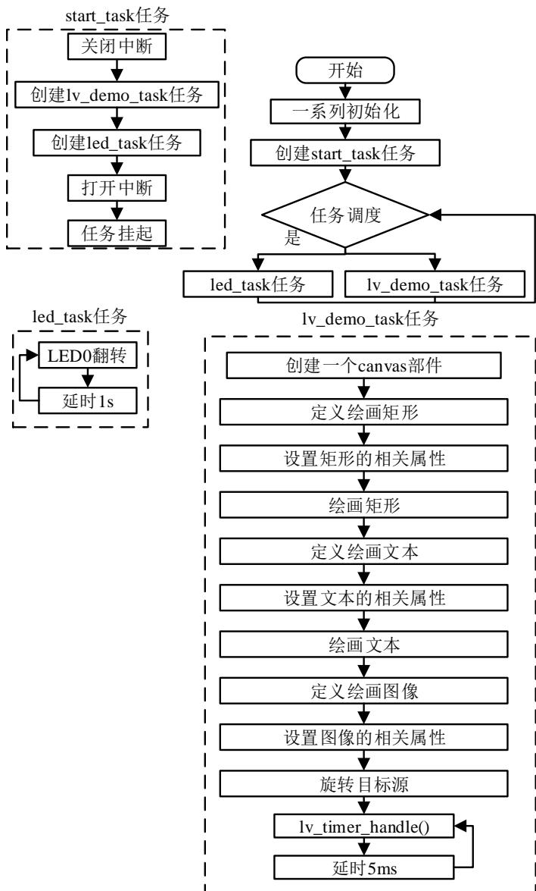  
图14.4.2.1.1 画布部件实验流程图

# 14.4.2.2 程序解析

关于LVGL的用户代码，我们都是在lv_mainstart.c文件中编写的，本实验的源码如下所示：

```c
/\*\*\*\*\*\*\*\*\*\*\*\*\*\*\*\*\*\*\*\*\*\*\*\*\*\*\*\*\*\*\*\*\*\*\*\*\*\*\*\*\*\*\*\*\*\*\*\*\*\*\*\*\*\*\*\*\*\*\*\*\*\*\*\*\*\*\*\*\*\*\*\*\*\*\*\*\*\*\*\*\*\*\*\*\*\*\*\*\*\*\*\*\*\*\*\*\*\*\*\*\*  
\*/  
\* @brief LVGL 演示  
\* @param 无  
\* @return 无  
\*/  
void lv_mainstart(void)  
{lv_example Canvas();}
```

```c
/**
* @brief 例
* @param 无
* @return 无
*/
static void lv_example Canvas(void)
{
    /* 定义画布缓冲区 */
    static lv_color_t canvas_buf[LV_CANVASBuf_SIZE_true_COLOR(canvas_width(), canvas_height());
    /* 定义并初始化画布 */
    lv_obj_t* canvas = lv Canvas_create(lv_scr_act());
    /* 设置画布缓冲区 */
    lv Canvas_set_buffer(canvas, canvas_buf, canvas_width(), canvas_height(), LV_IMAGE_CF:true_COLOR);
    /* 设置画布位置 */
    lv_obj_center(canvas);
    /* 设置画布背景颜色 */
    lv Canvas_fill_bg(canvas, lv Palette_lighten(LV_PALETTE_GREY, 3), LV_OPA_COVER);
    /* 定义绘画矩形 */
    lv.Draw_rect_dsc_t rect_dsc;
    /* 初始化绘画矩形 */
    lv.Draw_rect_dsc_init(&rect_dsc);
    /* 设置圆角 */
    rect_dsc_radius = 10;
    /* 设置透明度 */
    rect_dsc.bg_opa = LV_OPA_COVER;
    /* 设置颜色渐变方向 */
    rect_dsc.bg_grad.dir = LV_GRAD_DIR_HOR;
    /* 设置开始颜色 */
    rect_dsc.bg_gradstops[0].color = lv Palette_main(LV_PALETTE_RED);
    /* 设置结束颜色 */
    rect_dsc.bg_gradstops[1].color = lv Palette_main(LV_PALETTEBlue);
    /* 设置边缘宽度 */
    rect_dscborder_width = 2;
    /* 设置边缘透明度 */
    rect_dsc bordered_opa = LV_OPA_90;
    /* 设置边缘颜色 */
    rect_dscBorderColor = lv_color_white();
};
```

/* 在画布上绘制矩形 */  
```txt
lv Canvas.draw_rect(canvas,  
    (canvas_width() - img_width() / 2,  
    (canvas_height() - img_height() / 2,  
    img_width(),  
    img_height(),  
    &rect_dsc);
```

/* 定义绘制标签 */  
```javascript
lv_draw_label_dsc_t label_dsc;  
/* 初始化绘制标签 */  
lv.Draw_label_dsc_init(&label_dsc);  
/* 设置标签颜色 */  
label_dsc.color = lv_color_white();  
/* 在画布上绘制标签 */  
lv Canvas.Draw_text(canvas, canvas_width() / 8, canvas_height() / 8, 100, &label_dsc, "Some text on text canvas");
```

/*定义图片缓冲区*/  
```txt
static lv_color_t canvas_buf_temp[LV_CANVASBuf_SIZE_true_COLOR( canvas_width(), canvas_height());
```

/* 复制旧缓冲区 */  
```txt
lv_memcpy(canvas_buf_temp, canvas_buf, sizeof(canvas_buf_temp));
```

/\*定义图片\*/  
```txt
lv_img_dsc_t img;
```

/* 设置图片数据 */  
```txt
img.data = (uint8_t*) canvas_buf_temp;
```

/* 图片颜色格式 */  
```c
img_header.cf = LV_IMAGE_CF_true_COLOR;
```

/\*宽度\*/  
```txt
img_header.w = canvas_width();
```

/\*高度\*/  
```javascript
img.header.h  $=$  canvas_height();
```

/\*旋转画布\*/  
```txt
lv Canvas_transform(canvas, &img, 30, LV_IMAGE_ZOOM_NONE, 0, 0, canvas_width() / 2, canvas_height() / 2, true);
```

上述源码可分为以下两个部分：

① lv_mainstart 接口函数。在该函数中，我们调用了画布的示例函数；  
(2) 矩形图像和文本的绘制。我们首先创建画布，并将其背景颜色设置为灰色，然后分别绘制矩形和文本，最后再将它们旋转 30 度。

# 14.4.3 下载验证

把工程编译并下载到我们的开发板中，运行效果如图 14.4.3.1 所示：

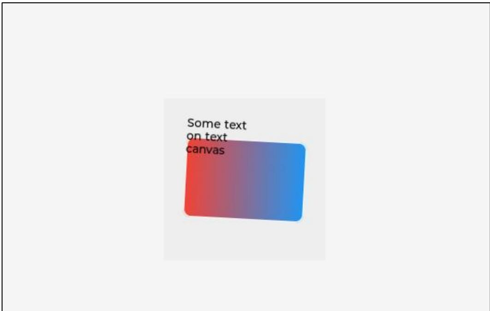  
图14.4.3.1画布实验

# 第十五章 复选框部件 lv_checkbox

复选框部件常用于条款、协议的确定，以及一些多选项控制的场景。

本章节将分为以下几个小节：

15.1 复选框部件的组成  
15.2 复选框部件的相关知识  
15.3 复选框部件 API 函数  
15.4 复选框部件实验

# 15.1 复选框部件的组成

复选框部件由两个部分组成：主体和勾选框，示意图如下：

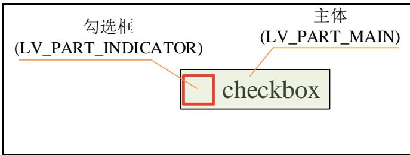  
图15.1.1 复选框的组成

关于部件样式设置的内容，请大家参考6.4.4章节。

# 15.2 复选框部件的相关知识

# 15.2.1 设置复选框文本

复选框部件的文本设置函数有两个：lv_checkbox_set_text 和 lv_checkbox_set_text(static，前者设置的文本是保存在动态分配的内存中的，而后者设置的是静态的文本。

接下来，我们以简单示例来理解复选框文本的设置，示例代码如下所示：

```c
void lv_mainstart(void)   
{ lv_obj_t\* cb1  $=$  lv_checkbox_createLv_scr_act(); /\*创建复选框\*/ lv_checkbox_set_text(cbl，"CheckBox1"); /\*动态设置复选框的文本\*/ lv_obj_align(cbl,LVALIGN_CENTER,0,0); lv_obj_t\* cb2  $=$  lv_checkbox_createLv_scr_act(); /\*创建复选框\*/ lv_checkbox_set_text(static(cbl，"CheckBox2"); /\*静态设置复选框的文本\*/ lv_obj_align_to(cb2，cb1,LVALIGN_LEFT_MID，0，50);   
}
```

在上述源码中，我们创建了两个复选框部件，并分别设置了动态文本和静态文本，示例代码可以在PC模拟器中运行，效果图如下所示：

  
图15.2.1.1设置复选框的文本

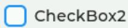

# 15.2.2 复选框部件的状态

复选框的状态有三种：选中、未选中以及禁用，用户需要为其添加、清除状态，可以调用lv_obj_add_state（添加）和lv_obj_clear_state（清除）函数，示例如下：

```c
lv_obj_add_state(cb, LV_STATE_CHECKED); /* 选中复选框 */
lv_obj_clear_state(cb, LV_STATE_CHECKED); /* 清除选中状态（未选中）*/
lv_obj_add_state(cb, LV_STATE_DISABLED); /* 禁用复选框 */
lv_obj_clear_state(cb, LV_STATE_DISABLED); /* 清除禁用状态 */
```

# 15.2.3 复选框事件

① LV_EVENT_VALUE_CHANGED：当复选框被切换时发送；  
② LV_EVENT_DRAW_PART_BEGIN: 绘制开始;  
③ LV_EVENT_DRAW_PART_END: 绘制结束。

# 15.3 复选框部件 API 函数

LVGL官方提供了一些与复选框部件相关API，如下表所示：

表 15.3.1 复选框部件相关的 API 函数  

<table><tr><td>函数</td><td>描述</td></tr><tr><td>lv_checkbox_create()</td><td>创建复选框</td></tr><tr><td>lv_checkbox_set_text()</td><td>设置复选框的文本。文本的内存可能会被释放</td></tr><tr><td>lv_checkbox_set_text(static)</td><td>设置复选框的文本。文本将在静态区中</td></tr><tr><td>lv_checkbox_get_text()</td><td>获取复选框的文本</td></tr></table>

接下来，我们介绍LVGL复选框部件常用的API函数：

# 1.lv_checkbox_create函数

创建复选框，其函数原型如下所示：

```txt
lv_obj_t * lv_checkbox_createLv_obj_t \* parent);
```

该函数的形参描述如表15.3.2所示：

表 15.3.2 lv_checkbox_create 函数形参描述  

<table><tr><td>参数</td><td>描述</td></tr><tr><td>parent</td><td>父对象</td></tr></table>

返回值：指向已创建复选框的指针。

# 2.lv_checkbox_set_text函数

设置复选框的文本（动态），其函数原型如下所示：

```c
void lv_checkbox_set_text(lv_obj_t * obj, const char* txt);
```

该函数的形参描述如表15.3.3所示：

表 15.3.3 lv_checkbox_set_text 函数形参描述  

<table><tr><td>参数</td><td>描述</td></tr><tr><td>obj</td><td>指向复选框的指针</td></tr><tr><td>txt</td><td>复选框的文本。</td></tr></table>

返回值：无。

# 3.lv_checkbox_set_text(static函数

设置复选框的文本（静态），其函数原型如下所示：

```c
void lv_checkbox_set_textStatic(lv_obj_t * obj, const char* txt);
```

该函数的形参描述如表15.3.4所示：

表 15.3.4 lv_checkbox_set_text(static) 函数形参描述  

<table><tr><td>参数</td><td>描述</td></tr><tr><td>obj</td><td>指向复选框的指针</td></tr><tr><td>txt</td><td>复选框的文本。使用 NULL 刷新当前文本</td></tr></table>

返回值：无。

# 4.lv_checkbox_get_text函数

获取复选框的文本，其函数原型如下所示：

```c
const char* lv_checkbox_get_text(const lv_obj_t * obj);
```

该函数的形参描述如表15.3.5所示：

表 15.3.5 lv_checkbox_get_text 函数形参描述  

<table><tr><td>参数</td><td>描述</td></tr><tr><td>obj</td><td>指向复选框的指针</td></tr></table>

返回值：指向复选框文本的指针。

# 15.4 复选框部件实验

# 15.4.1 硬件设计

# 1. 例程功能

本实验主要测试复选框部件 API 函数的使用，实验现象：开机后，屏幕上显示四个复选框、一个主标题（MENU）和一个总价格（Aggregate），勾选不同的项目（菜品），对应的价格会不同，其总价会显示在屏幕下方。与此同时，LED0 闪烁，提示系统正在运行。

该实验的完整源码，请参考《LVGL例程15 checkbox(复选框)》例程，路径：A盘  $\rightarrow 4$  程序源码  $\rightarrow 3$  ，扩展例程  $\rightarrow 4$  ，LVGL例程。

# 15.4.2 软件设计

# 15.4.2.1 程序流程图

本实验的程序流程图，如下图 15.4.2.1.1 所示：

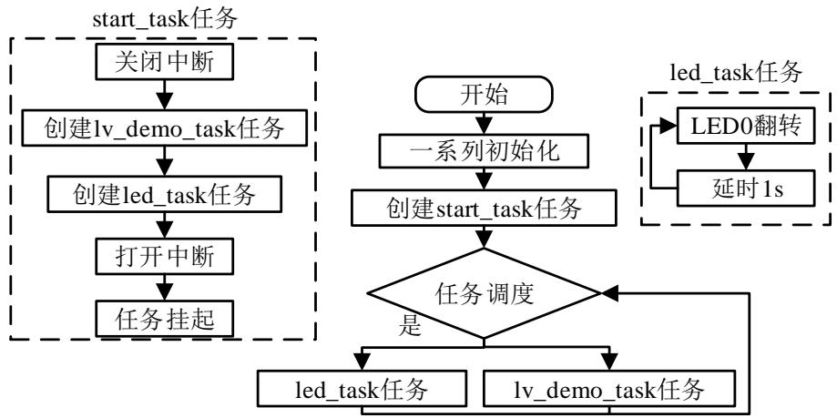

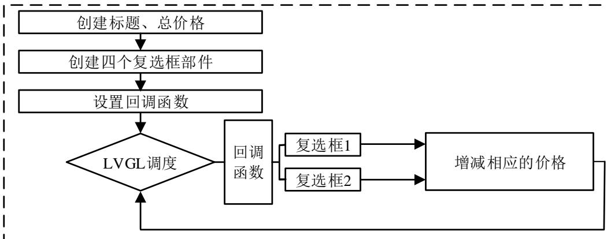  
lv_demo_task任务  
图15.4.2.1.1复选框部件实验流程图

# 15.4.2.2 程序解析

关于LVGL的用户代码，我们都是在lv_mainstart.c文件中编写的，本实验的源码如下所示：

```txt
/\*\*\*\*\*\*\*\*\*\*\*\*\*\*\*\*\*\*\*\*\*\*\*\*\*\*\*\*\*\*\*\*\*\*\*\*\*\*\*\*\*\*\*\*\*\*\*\*\*\*\*\*\*\*\*\*\*\*\*\*\*\*\*\*\*\*\*\*\*\*\*\*\*\*\*\*\*\*\*\*\*\*\*\*\*\*\*\*\*\*\*\*\*\*\*\*\*\*\*\*\* 第一部分 开始  $\text{串}$ $\text{串}$ $\text{串}$ $\text{串}$ $\text{串}$ $\text{串}$ $\text{串}$ $\text{串}$ $\text{串}$ $\text{串}$ $\text{串}$ $\text{串}$ $\text{串}$ $\text{串}$ $\text{串}$ $(\text{串})$ $\text{串}$ $\text{串}$ $\text{串}$ $\text{串}$ $\text{串}$ $\text{串}$ $\text{串}$ $\text{串}$ $\text{串}$ $\text{串}$ $\text{串}$ $\text{串}$ $\text{串}$ $\text{串}$ ${}^{*}=$
```

```c
\* @param 无
\* @return 无
\*/   
static void lv_example_label(void)
\{
	/* 根据活动屏幕宽度选择字体 */
	if (scr_act_width() <= 480)
	\{
	 font = &lv_font_montserrat_14;
	\}
	else
	\{
	font = &lv_font_montserrat_20;
	\}
	/* 菜单标题标签 */
.label_menu = lv_label_create(lv_scr_act());
平板_set_text痍("MENU");
lv_obj_set_style_text.Font (label_menu,font,LV_STATE_DEFAULT);
lv_obj_align (label_menu,LV ALIGN_CENTER,0,-scr act height(   ) * 2 / 5);
	/* 总价格标签 */
.label_aggregate = lv_label_create (lv_scract());
lv_label_set_text (label_aggregate, "Aggregate : $0");
lv_obj_set_style_text.Font (label_aggregate,font,LV_STATE_DEFAULT);
lv_obj_align (label_aggregate,LV ALIGN_CENTER,0,
scract_height(   ) * 2 / 5);
\}
/******* 第二部分 结束 */
/******* 第三部分 开始 */
/*@brief 回调事件
* @param *e: 事件相关参数的集合, 它包含了该事件的所有数据
* @return 无
*/
static void checkbox_event_cb (lv_event_t *e)
\{
	 lv_obj_t *target = lv_event_get_target(e); /* 获取触发源 */
	if(target == checkbox1) /* 复选框1触发 */
\{lv_obj_has_state(checkbox1,
```

```c
LV_STATE_CHECKED) ? (aggregate += 19) : (aggregate -= 19);
}
else if(target == checkbox2) /* 复选框2触发 */
{
    lv_obj_has_state(checkbox2,
        LV_STATE_CHECKED) ? (aggregate += 29) : (aggregate -= 29);
}
/* 更新总价格标签 */
lv_label_set_text fmt.label_aggregate, "Aggregate: $%d", aggregate);
}
/**
* @brief 菜品复选框
* @param 无
* @return 无
*/
static void lv_example_checkbox(void)
{
/* 创建基础对象作为背景 */
lv_obj_t *obj = lv_obj_create(lv_scr_act());
lv_obj_set_size(obj, scr actu_width() * 4/5, scr actu_height() * 3/5);
lv_obj_align(obj, LVALIGN_CENTER, 0, 0);
/* 菜品1复选框 */
checkbox1 = lv_checkbox_create(obj);
lv_checkbox_set_text(checkbox1, "Roast chicken $19");
lv_obj_set_style_text.Font(checkbox1, font, LV_STATE_DEFAULT);
lv_obj_align(checkbox1, LVALIGN_LEFT_MID, 0, -scr actu_height() / 5);
lv_obj_add_event_cb(checkbox1, checkbox_event_cb,
                    LV_EVENT_VALUE_CHANGED, NULL);
/* 菜品2复选框 */
checkbox2 = lv_checkbox_create(obj);
lv_checkbox_set_text(checkbox2, "Roast duck $29");
lv_obj_set_style_text.Font(checkbox2, font, LV_STATE_DEFAULT);
lv_obj_align_to(checkbox2, checkbox1, LVALIGN_OUT_bottom_LEFT, 0,
                    scr actu_height() / 16);
lv_obj_add_event_cb(checkbox2, checkbox_event_cb,
                    LV_EVENT_VALUE_CHANGED, NULL);
/* 菜品3复选框 */
checkbox3 = lv_checkbox_create(obj);
lv_checkbox_set_text(checkbox3, "Roast fish $39");
```

```txt
lv_obj_set_style_text.Font(checkbox3,font,LV_STATE_DEFAULT);lv_obj_align_to(checkbox3，checkbox2，LVALIGN_OUT BOTTOM_LEFT，0,scr_act_height() / 16);lv_obj_add_state(checkbox3，LV_STATE DISABLED);/\*菜品4复选框\*/checkbox4  $=$  lv_checkbox_create(obj);lv_checkbox_set_text(checkbox4，"Roast lamb  $\$ 69$ ");lv_obj_set_style_textfont(checkbox4，font，LV_STATE_DEFAULT);lv_obj_align_to(checkbox4，checkbox3，LVALIGN_OUT BOTTOM_LEFT，0,scr_act_height() / 16);lv_obj_add_state(checkbox4，LV_STATE_DISABLED);}
```

上述源码可分为以下三个部分：

① lv_mainstart 接口函数。在该函数中，我们调用了标签和复选框示例函数；  
② 菜品标题、总价格标签的实现。我们先根据当前活动屏幕宽度来选择字体大小，然后再创建菜单标题标签和总价格标签；  
③ 菜品复选框的实现。我们先创建出来一个背景（基础对象），然后在背景中添加 4 个菜品复选框并为它们添加事件回调。当用户修改某个复选框的状态时，会触发事件回调，在回调函数中，更新当前的总价格。

# 15.4.3 下载验证

把工程编译并下载到我们的开发板中，运行效果如图 15.4.3.1 所示：

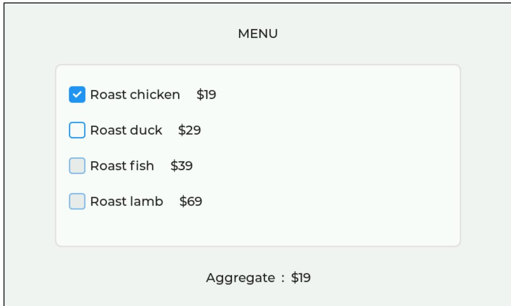  
图15.4.3.1复选框部件实验

# 第十六章 下拉列表部件(lv_dropout)

下拉列表部件常用于多选一的场景，其点击后可展开多个选项，用户可以从这些选项中选择一个，一旦选择好后，这些选项会自动收回。

本章节将分为以下几个小节：

16.1下拉列表部件的组成  
16.2下拉列表部件的相关知识  
16.3下拉列表部件的API函数  
16.4下拉列表部件的实验

# 16.1下拉列表部件的组成

下拉列表部件由五个部分组成，示意图如下：

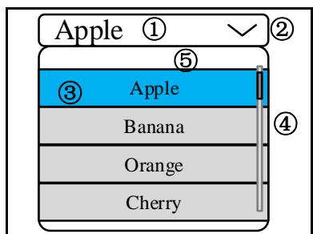  
图16.1.1下拉列表组成部分

# 按钮部分：

① LV_PART_MAIN：按钮的主体背景；  
② LV_PART_INDICATOR：指示器，例如上图向下的箭头。

# 列表部分：

③ LV_PART_SELECTED：当前选中的选项；  
④ LV_PART_SCROLLBAR：滚动条；  
⑤ LV_PART_MAIN：列表主体背景。

注意：用户需要设置上述组成部分的样式，需要先将按钮或列表相关的部分获取回来，关于部件样式设置的内容，请大家参考6.4.4章节。

# 16.2下拉列表部件的相关知识

# 16.2.1 添加选项

用户需要在下拉列表中添加选项，可以使用以下三种方法：

① 调用lv_dropdown_set-options函数添加选项，该函数如下所示：

```c
lv_dropdown_set_options(dropdown, "First \n Second \n Third");
```

在上述的函数中，我们通过字符串传递下拉列表选项，这些选项字符串之间通过‘\n’进行分隔。

② 调用lv_dropdown_add_option函数添加选项，该函数如下所示：

```javascript
lv_dropdown_add_option(delayed, "New option", pos);
```

上述的函数只会添加一个选项，其形参 pos 表示添加的位置，注意：0 表示列表最上面的位置，以此向下类推。

③ 调用 lvdropsdown_set(static_options 函数添加选项，该函数如下所示：

```txt
lvdropsdown_set_options(static (dropdown, options);
```

上述函数所添加的是静态选项，在这种情况下，用户不能再使用lv_dropout_add_option函数添加选项，否则有可能会出现问题。

接下来，我们以简单示例来理解下拉列表的选项添加，示例代码如下所示：

```c
void lv_mainstart(void)   
{ /\*创建一个下拉列表\*/ lv_obj_t\*lv_ddlist1  $\equiv$  lvdropsdown_create(lv_scr_act(); /\*方法一添加多个选项（动态）\*/ lvdropsdown_set-options(lv_ddlist1，"a\nb\nc\nd"); lv_obj_set_pos(lv_ddlist1,100，100); /\*默认显示的选项\*/ lvdropsdown_set_selected(lv_ddlist1，0); lv_obj_t\*lv_ddlist2  $\equiv$  lvdropsdown_create(lv_scr_act()); /\*方法二添加单个选项\*/ lvdropsdown_add_option(lv_ddlist2，"0"，0); lvdropsdown_add_option(lv_ddlist2，"1"，1); lvdropsdown_add_option(lv_ddlist2，"2"，2); lvdropsdown_add_option(lv_ddlist2，"3"，3); /\*默认显示的选项\*/ lvdropsdown_set_selected(lv_ddlist2，1); lv_obj_set_pos(lv_ddlist2，300，100); lv_obj_t\*lv_ddlist3  $\equiv$  lvdropsdown_create(lv_scr_act()); /\*方法三添加多个选项（静态）\*/ lvdropsdown_set-options(static (lv_ddlist3，"1")； lv_obj_set_pos(lv_ddlist3，500，100);
```

在上述源码中，我们分别使用了三种方法来添加选项，一般情况下，第一种方法用得较多，示例代码可以在PC模拟器中运行，效果图如下所示：

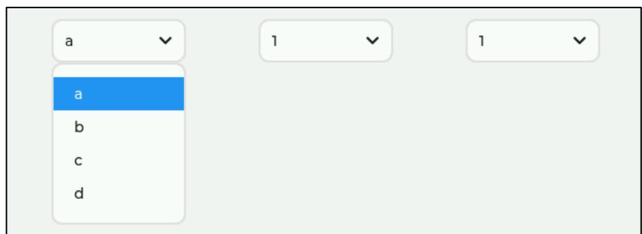  
图16.2.1.1添加选项示例

# 16.2.2 获取当前选中的选项

当用户选中所需的选项之后，如果没有任何反馈，这将无法和其他板块进行交互，因此，我们需要在触发的事件回调中获取当前选中的选项索引和文本，相关函数如下：

```javascript
lv_dropdown_get_selected(dropdown) /\*获取选中的选项索引\*/lv_dropdown_get_selected_str(dropdown，buf，buf_size)/\*获取选项字符串，保存到buf\*/
```

上述源码中，第一个函数用于获取选中的选项索引，第二个函数用于获取选中的选项文本，并将其保存到指定的buf中。

# 16.2.3 设置列表展开方向

在默认的情况下，当用户点击下拉列表后，其都是往下展开的，如果用户想修改列表展开的方向，可以调用以下函数：

```c
lv_dropdown_set_dir(dropdown，LV_DIR_LEFT/RIGHT/UP/Bottom) /\*设置展开方向\*/
```

在上述函数中，第二个形参代表列表的展开方向，用户可以选择上、下、左、右四个方向。

接下来，我们以简单示例来理解下拉列表的展开方向，示例代码如下所示：

```c
void lv_mainstart(void)   
{ /\*创建一个下拉列表\*/ lv_obj_t\*lv_ddlist1  $\equiv$  lvdropsdown_create(lv_scr_act(); /\*添加下拉列表项\*/ lvdropsdown_set-options(lv_ddlist1，"a\nb\nc\nd"); lv_obj_set_pos(lv_ddlist1，100，100); /\*默认显示的下拉列表项\*/ lvdropsdown_set_selected(lv_ddlist1，0); lv_obj_t\*lv_ddlist2  $\equiv$  lvdropsdown_create(lv_scr_act()); lvdropsdown_set_dir(lv_ddlist2,LV_DIR_LEFT）；/\*设置为左侧展开\*/ /\*添加下拉列表项\*/ lvdropsdown_add_option(lv_ddlist2，"0"，0); lvdropsdown_add_option(lv_ddlist2，"1"，1); lvdropsdown_add_option(lv_ddlist2，"2"，2); lvdropsdown_add_option(lv_ddlist2，"3"，3); /\*默认显示的下拉列表项\*/ lvdropsdown_set_selected(lv_ddlist2，1); lv_obj_set_pos(lv_ddlist2，300，100); lv_obj_t\*lv_ddlist3  $\equiv$  lvdropsdown_create(lv_scr_act()); /\*添加下拉列表项\*/ lvdropsdown_set-options-static(lv_ddlist3，"1"); lv_obj_set_pos(lv_ddlist3，500，100);
```

由上述源码可知，我们设置了第二个下拉列表（lv_ddlist2）的展开方向为LV_DIR_LEFT，即向左侧展开，示例代码可以在PC模拟器中运行，效果图如下所示：

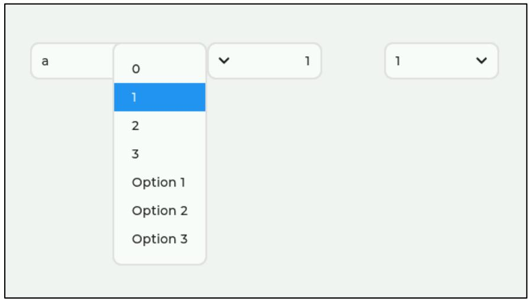  
图16.2.3.1设置下拉列表的方向

# 16.2.4 设置下拉列表图标

下拉列表的图标箭头默认是向下的，如果用户修改了列表的展开方向，此时的箭头方向和展开方向就对应不上了。为了解决上述的问题，LVGL提供了相关的图标设置函数：

```txt
lvdropsdown_set_SYMBOL(delayed, LV_SYMBOL[]) /*设置图标*/
```

在上述函数中，第二个形参代表的是图标，一般情况下，我们调用内部的字体图标即可满足需求，修改后的图标如下图所示：

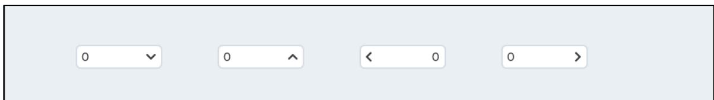  
图16.2.4.1设置下拉列表的图标

# 16.2.5 设置列表常显文本

在默认情况下，当用户选中某个选项后，该选项的文本会更新到列表的头部，示意图如下：

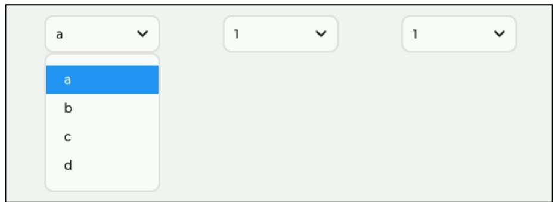  
图16.2.5.1默认显示

在上图中，当用户选中第一个选项，其文本内容（a）将更新到列表头部，如果用户需要设置列表头部的文本为固定内容，可以调用lv_dropout_set_text函数，示例源码如下：

```c
LVFONTDeclare(myFont14)  
void lv_mainstart(void)  
{
```

```c
/* 创建一个下拉列表 */
lv_obj_t* lv_ddlist1 = lvdropsdown_create lv_scr_act());
lvdropsdown_set_text lv_ddlist1, "dropdown");
/*添加下拉列表项 */
lvdropsdown_set_options(lv_ddlist1, "a\nb\nc\nd");
lv_obj_set_pos(lv_ddlist1, 100, 100);
/*默认显示哪一个下拉列表项 */
lvdropsdown_set_selected(lv_ddlist1, 0);
lv_obj_t* lv_ddlist2 = lvdropsdown_create (lv_scr_act());
lvdropsdown_set_dir(lv_ddlist2, LV_DIR_LEFT); /*设置下拉方向 */
/*添加下拉列表项 */
lvdropsdown_add_option (lv_ddlist2, "0", 0);
lvdropsdown_add_option (lv_ddlist2, "1", 1);
lvdropsdown_add_option (lv_ddlist2, "2", 2);
lvdropsdown_add_option (lv_ddlist2, "3", 3);
/*默认显示哪一个下拉列表项 */
lvdropsdown_set_selected (lv_ddlist2, 1);
lv_obj_set_pos (lv_ddlist2, 300, 100);
lv_obj_t* lv_ddlist3 = lvdropsdown_create (lv_scr_act());
/*添加下拉列表项 */
lvdropsdown_set_optionsStatic (lv_ddlist3, "1");
lv_obj_set_pos (lv_ddlist3, 500, 100);
```

在上述源码中，我们调用了lv_dropout_set.tex函数，把第一个列表（lv_ddlist1）的头部文本固定为“dropout”。示例代码可以在PC模拟器中运行，效果图如下所示：

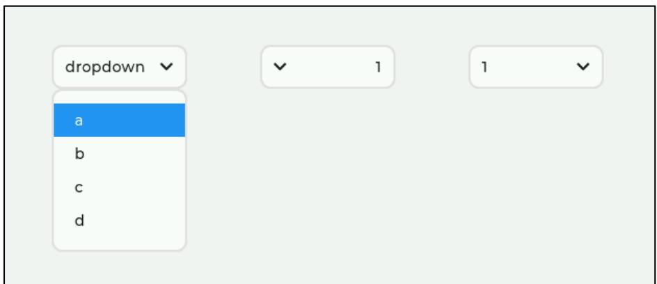  
16.2.5.2 设置下拉列表常显文本

# 16.2.6 打开、开闭下拉列表

当用户需要直接打开或者关闭下拉列表时，可以直接调用以下函数：

```c
lv_dropdown_open (dropdown) /* 打开下拉列表 */
lv_dropdown_close (dropdown) /* 关闭下拉列表 */
```

# 16.3下拉列表部件的API函数

LVGL官方提供了一些与下拉列表部件相关API，如下表所示：

表 16.3.1 下拉列表部件相关的 API 函数  

<table><tr><td>函数</td><td>描述</td></tr><tr><td>lv_dropout_create()</td><td>创建下拉列表</td></tr><tr><td>lv_dropout_set_text()</td><td>设置下拉列表按钮的文本（常显文本）</td></tr><tr><td>lv_dropout_set_options()</td><td>添加选项（动态）</td></tr><tr><td>lv_dropout_set_options(static)</td><td>添加选项（静态）</td></tr><tr><td>lv_dropout_add_option()</td><td>添加单个选项</td></tr><tr><td>lv_dropout_clear(options)</td><td>清除所有选项</td></tr><tr><td>lv_dropout_set_selected()</td><td>设置当前所选项</td></tr><tr><td>lv_dropout_set_dir()</td><td>设置展开方向</td></tr><tr><td>lv_dropout_set_SYMBOL()</td><td>设置图标</td></tr><tr><td>lv_dropout_set_selected/highlight()</td><td>设置当前选中的选项是否高亮</td></tr><tr><td>lv_dropout_get_list()</td><td>获取下拉列表，以设置样式或进行其他修改</td></tr><tr><td>lv_dropout_get_text()</td><td>获取下拉列表按钮的文本</td></tr><tr><td>lv_dropout_get_options()</td><td>获取下拉列表的选项</td></tr><tr><td>lv_dropout_get_selected()</td><td>获取所选选项的索引</td></tr><tr><td>lv_dropout_get_option_cnt()</td><td>获取选项的总数</td></tr><tr><td>lv_dropout_get_selected_str()</td><td>获取当前选中的选项文本</td></tr><tr><td>lv_dropout_get_SYMBOL()</td><td>获取图标</td></tr><tr><td>lv_dropout_get_selected/highlight()</td><td>判断当前选中的选项是否高亮</td></tr><tr><td>lv_dropout_get_dir()</td><td>获取展开方向</td></tr><tr><td>lv_dropout_open()</td><td>打开下拉列表</td></tr><tr><td>lv_dropout_close()</td><td>关闭下拉列表</td></tr></table>

接下来，我们介绍LVGL下拉列表部件常用的API函数：

# 1.lv_dropdown_create函数

创建下拉列表，其函数原型如下所示：

```txt
lv_obj_t * lvdropsdown _create (lv_obj_t * parent,);
```

该函数的形参描述如表16.3.2所示：

表 16.3.2 lv��游创建函数形参描述  

<table><tr><td>参数</td><td>描述</td></tr><tr><td>parent</td><td>父对象</td></tr></table>

返回值：指向创建的下拉列表的指针。

# 2.lv_dropdown_set_text函数

设置下拉列表按钮的文本（常显文本），其函数原型如下所示：

```c
void lvdropsdown_set_text (lv_obj_t * obj, const char* txt);
```

该函数的形参描述如表16.3.3所示：

表 16.3.3 lvishly_set_text 函数形参描述  

<table><tr><td>参数</td><td>描述</td></tr><tr><td>obj</td><td>指向下拉列表对象的指针</td></tr><tr><td>txt</td><td>文本内容</td></tr></table>

返回值：无。

# 3.lv_dropdown_set-options函数

添加选项（动态），其函数原型如下所示：

void lvdropsdown_set_options(lv_obj_t * obj, const char *options);

该函数的形参描述如表16.3.4所示：

表 16.3.4 lv_dropdown_set-options 函数形参描述  

<table><tr><td>参数</td><td>描述</td></tr><tr><td>obj</td><td>指向下拉列表对象的指针</td></tr><tr><td>options</td><td>选项相关的字符串数组</td></tr></table>

返回值：无。

# 4.lv_dropdown_set-options(static)函数

添加选项（静态），其函数原型如下所示：

void lv_dropdown_set_options(static lv_obj_t * obj, const char *options);

该函数的形参描述如表16.3.5所示：

表 16.3.5 lv_dropdown_set-options_static 函数形参描述  

<table><tr><td>参数</td><td>描述</td></tr><tr><td>obj</td><td>指向下拉列表对象的指针</td></tr><tr><td>options</td><td>选项相关的字符串数组</td></tr></table>

返回值：无。

# 5.lv_dropdown_add_option函数

添加单个选项，其函数原型如下所示：

void lv_dropdown_add_option(lv_obj_t * obj, const char * option, uint32_t pos);

该函数的形参描述如表16.3.6所示：

表 16.3.6 lv_dropdown_add_option 函数形参描述  

<table><tr><td>参数</td><td>描述</td></tr><tr><td>obj</td><td>指向下拉列表对象的指针</td></tr><tr><td>option</td><td>选项相关的字符串</td></tr><tr><td>pos</td><td>插入选项的位置，最上方为0</td></tr></table>

返回值：无。

# 7.lv_dropdown_set_selected函数

设置当前所选项，其函数原型如下所示：

void lv_dropdown_set_selected(lv_obj_t * obj, uint16_t sel_opt);

该函数的形参描述如表16.3.7所示：

表 16.3.7 lv_dropdown_set_selected 函数形参描述  

<table><tr><td>参数</td><td>描述</td></tr><tr><td>obj</td><td>指向下拉列表对象的指针</td></tr><tr><td>sel_opt</td><td>所选选项的 ID，从 0 开始</td></tr></table>

返回值：无。

# 8.lv_dropdown_set_dir函数

设置展开方向，其函数原型如下所示：

oid lv_dropdown_set_dir(lv_obj_t * obj, lv_dropdown_dir_t dir);

该函数的形参描述如表16.3.9所示：

表 16.3.9 lv_dropdown_set_dir 函数形参描述  

<table><tr><td>参数</td><td>描述</td></tr><tr><td>obj</td><td>指向下拉列表对象的指针</td></tr><tr><td>dir</td><td>LV_DIR_LEFT/RIGHT/TOP/Bottom</td></tr></table>

返回值：无。

# 9.lv_dropdown_set_symbol函数

设置图标，其函数原型如下所示：

```c
void lvdropsdown_set_SYMBOL(lv_obj_t * obj, const char*symbol);
```

该函数的形参描述如表16.3.10所示：

表 16.3.10 lvdropsdown_set_symbol 函数形参描述  

<table><tr><td>参数</td><td>描述</td></tr><tr><td>obj</td><td>指向下拉列表对象的指针</td></tr><tr><td>symbol</td><td>图标，可选内部图标字体或自定义图像</td></tr></table>

返回值：无。

# 16.4下拉列表部件的实验

# 16.4.1 硬件设计

# 1. 例程功能

本实验主要测试下拉列表部件 API 函数的使用，实验现象：开机后，屏幕上显示五个下拉列表部件，用户可以切换它们的所选项，左侧的下拉列表与标签关联，它的所选项文本会更新到标签当中。与此同时，LED0 闪烁，提示系统正在运行。

该实验的完整源码，请参考《LVGL 例程 16 dropdown (下拉列表)》例程，路径：A 盘  $\rightarrow$  4，程序源码  $\rightarrow$  3，扩展例程  $\rightarrow$  4，LVGL 例程。

# 16.4.2 软件设计

# 16.4.2.1 程序流程图

本实验的程序流程图，如下图 16.4.2.1.1 所示：

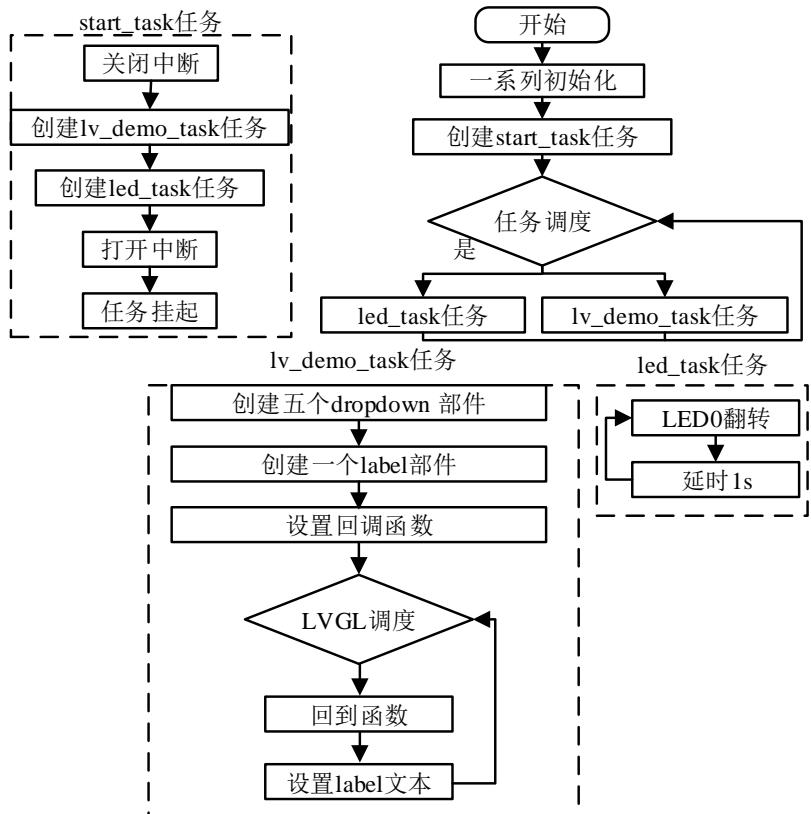  
图16.4.2.1.1下拉列表部件实验流程图

# 16.4.2.2 程序解析

关于LVGL的用户代码，我们都是在lv_mainstart.c文件中编写的，本实验的源码如下所示：

```c
/\*\*\*\*\*\*\*\*\*\*\*\*\*\*\*\*\*\*\*\*\*\*\*\*\*\*\*\*\*\*\*\*\*\*\*\*\*\*\*\*\*\*\*\*\*\*\*\*\*\*\*\*\*\*\*\*\*\*\*\*\*\*\*\*\*\*\*\*\*\*\*\*\*\*\*\*\*\*\*\*\*\*\*\*\*\*\*\*\*\*\*\*\*\*\*\*\*\*\*\*\* 第一部分 结束 /\*\*\*\*\*\*\*\*\*\*\*\*\*\*\*\*\*\*\*\*\*\*\*\*\*\*\*\*\*\* 第一部分 开始 /\*\*  $@$  brief 例1  $@$  param 无  $@$  return 无  $\star /$    
static void lv_exampledropsdown_1(void)   
{ /\* 根据屏幕宽度选择字体和列表宽度 \*/ if (scr_act_width() <= 320) { dropdown.Font = &lv_font_montserrat_14; dropdown_width = 90; } else if (scr_act_width() <= 480) { dropdown.Font = &lv_font_montserrat_18; dropdown_width = 120; } else { dropdown.Font = &lv_font_montserrat_22; dropdown_width = 150; }   
 $\star$  定义并创建下拉列表  $\star /$  lv_obj_t\* dropdown = lvdropsdown_create(lv_scr_act());
```

```c
/\*添加下拉列表选项\*/lv_dropout_set_options(staticdropsdown,options);/\*设置下拉列表字体\*/lv_obj_set_style_text_fontdropsdown，dropdownt.Font，LV_PART_MAIN);/\*设置下拉列表宽度\*/lv_obj_set_widthdropsdown，dropdownt_width);/\*设置下拉列表位置\*/lv_obj_align(dropdown，LV ALIGNCENTER，-scract_width() /3,0);/\*定义并创建标签\*/label  $=$  lv_label_create(1v_scr_act());/\*设置标签表字体\*/lv_obj_set_style_text_font(1abel，dropdownt.Font，LV_PART_MAIN);/\*设置标签宽度\*/lv_obj_set_width.label，dropdownt_width);/\*设置标签位置\*/lv_obj_align_to labelled，dropdown，LVALIGN_OUT_TOP_MID，15,-scract_height() /8);/\*设置标签文本\*/lv_label_set_text labelled,"option1");/\*添加下拉列表回调\*/lv_obj_add_event_cb dropdown，dropdownt_event_cb,LV_EVENT_VALUE_CHANGEDED，NULL);  
}  
/\*\*@brief 下拉列表事件回调\*@param 无\*@return 无\*/  
static void dropout_event_cb(lv_event_t\*e)  
{lv_event_code_t code  $=$  lv_event_get_code(e); /\*获取事件类型\*/lv_obj_t \*dropout  $=$  lv_event_get_target(e); /\*获取触发源\*/if(LV_EVENT_VALUE_CHANGEDED  $\equiv$  code) /\*判断事件类型\*/{charbuf[10];/\*获取当前选项文本\*/lv_dropout_get_selected_str(缩水down，buf,sizeof(buf));lv_label_set_text labelled，buf); /\*显示当前选项文本\*/}
```

```c
/**
* @brief 例2
* @param 无
* @return 无
*/
static void lv_example升降2(void)
{
    lv_obj_t* dropdown;
    dropdown = lv升降_create(lv_scr_act());
    lv升降_set_options(static(dropdown, options);
    /* 设置下拉列表字体 */
    lv_obj_set_style_text.Font(dropdown, dropdownFont, LV_PART_MAIN);
    lv_obj_set_width(dropdown, dropdown_width);
    lv升降_set_dir(dropdown, LV_DIR_bottom);
    lv升降_set_symbol(dropdown, LV_SYMBOL_DOWN);
    lv_obj_align(dropdown, LVALIGN_CENTER, scr actu_width() / 8, -3 * scr actu_height() / 8); /* 设置下拉列表位置 */
    dropdown = lv升降_create(lv_scr actu());
    lv升降_set_options(static(dropdown, options);
    /* 设置下拉列表方向 */
    /* 设置下拉列表符号 */
    lv_obj_set_style_text.Font(dropdown, dropdownFont, LV_PART_MAIN);
    /* 设置下拉列表宽度 */
    lv_obj_set_width(dropdown, dropdown_width);
    /* 设置下拉列表方向 */
    lv升降_set_dir(dropdown, LV_DIR_LEFT);
    /* 设置下拉列表符号 */
    lv升降_set_symbol(dropdown, LV_SYMBOL_DOWN);
    lv_obj_align(dropdown, LVALIGN_CENTER, scr actu_width() / 8, -1 * scr actu_height() / 8); /* 设置下拉列表位置 */
    dropdown = lv升降_create(lv_scr actu());
    lv升降_set_options(static(dropdown, options);
    /* 设置下拉列表符号 */
    lv_obj_set_style_text.Font(dropdown, dropdownFont, LV_PART_MAIN);
    lv_obj_set_width(dropdown, dropdown_width);
    /* 设置下拉列表宽度 */
    lv升降_set_dir(dropdown, LV_DIR_RIGHT);
    /* 设置下拉列表方向 */
    /* 设置下拉列表符号 */
    /* 设置下拉列表符号 */
}
```

```txt
1 \*scr_act_height() /8); /\*设置下拉列表位置\*/  
dropdown  $=$  lv_dropout_create(lv_scr_act()); /\*创建下拉列表\*/  
lv_dropout_set_optionsStatic dropdown，options）； /\*添加下拉列表选项\*//\*设置下拉列表字体\*/  
lv_obj_set_style_text.Font降落，dropout.Font，LV_PART_MAIN);  
lv_obj_set_width降落，dropout_width); /\*设置下拉列表宽度\*/  
lv_dropout_set_dir降落，LV_DIR_TOP); /\*设置下拉列表方向\*/  
lv_dropout_set_SYMBOL降落，LV_SYMBOL_UP); /\*设置下拉列表符号\*/  
lv_obj_align降落，LVALIGN_CENTER，scr_act_width() /8,3\*scr_act_height() /8); /\*设置下拉列表位置\*/  
}
```

上述源码可分为以下三个部分：

① lv_mainstart 接口函数。在该函数中，我们调用了两个下拉列表示例函数；  
② 左侧下拉列表和标签。我们先根据当前活动屏幕宽度来选择字体大小，然后创建左侧下拉列表和标签部件，最后在事件的回调函数中将列表的所选项文本获取回来，更新到标签中；  
③ 右侧四个下拉列表。我们先创建四个下拉列表部件，然后分别设置这些部件的展开方向以及图标。

# 16.4.3 下载验证

把工程编译并下载到我们的开发板中，运行效果如图 16.4.3.1 所示：

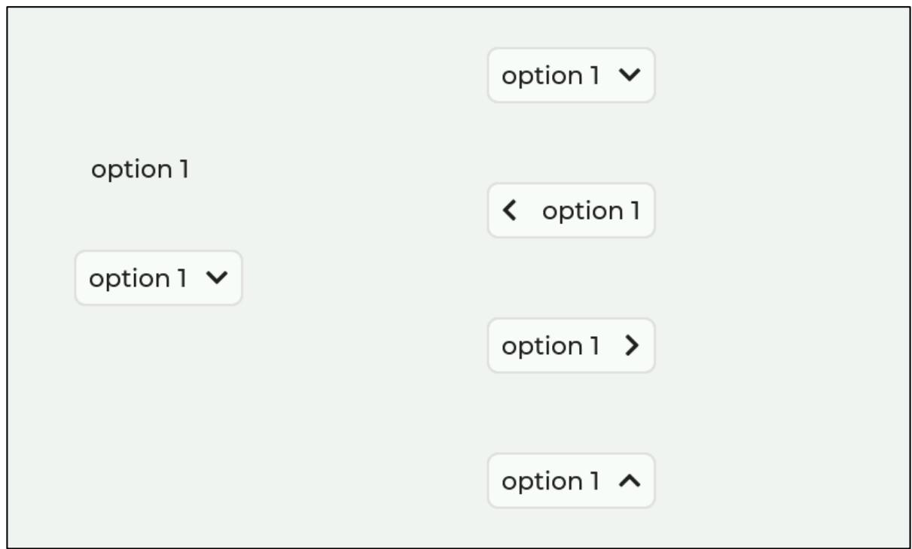  
图16.4.3.1下拉列表部件实验

# 第十七章 图片部件(lv_img)

图片部件可用于显示图片，其图片源可以是 C 语言数组格式的文件、二进制的.bin 文件以及图标字体。值得注意的是，图片部件要显示 BMP、JPEG 等格式的图片，则必须经过解码。

本章节将分为以下几个小节：

17.1 图片部件的组成  
17.2 图片部件的相关知识  
17.3 图片部件的 API 函数  
17.4 图片部件的实验

# 17.1 图片部件的组成

图片部件的组成部分仅有一个：主体（LV_PART_MAIN）。关于部件样式设置的内容，请大家参考6.4.4章节。

# 17.2 图片部件的相关知识

# 17.2.1 图片源选择

图片部件的图片来源分为三种：C语言数组；存储在外部的图片文件；图标字体（详见8.2章节）。接下来，我们详细介绍上述三种图片源的使用方法：

# 1.C语言数组

采用C语言数组的方式来显示图片是较为简单的，整个配置流程分为以下四步：

第一步：生成图片相关的C语言数组。如果用户需要将PNG、JPG和BMP格式的图片转换成C语言数组，可以使用官方的在线转换工具进行格式转换，该在线工具的网址为：https://lvgl.io/tooil/imageconverter。当我们进入到该网页后，界面如图17.2.1.1所示：

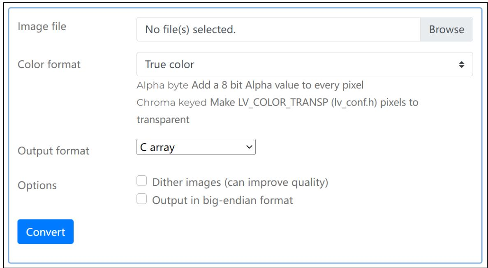  
图17.2.1.1 在线转换工具

进入到该界面后，首先点击上图中“Browse”按钮，导入所需要的图片，导入完成后，点击图中Color format选项，根据需求选择颜色格式（不需要透明度通道就选择True color），然后点击图中Output format选项，选择输出格式为“C array”，最后点击“Convert”按钮即可生成C语言数组相关的文件（文件路径自选）。

第二步：将C语言数组文件添加到工程当中，然后调用LV_IMAGE_DECLARE(xxx)宏定义对图片源进行声明。

第三步：调用lv_img_create函数创建图片部件。

第四步：调用lv_img_set_src函数设置图片源。

# 2.外部图片源文件

第一步：生成外部源文件（.bin）。如果用户需要将PNG、JPG和BMP格式的图片转换成bin文件，同样也可以使用官方的在线转换工具进行格式转换，与C语言数组转换不同的是：在Output format选项中，输出格式需要选择Binary RGB565。转换完成后，我们即可得到图片相关的bin文件。

第二步：使能LVGL的文件系统。

第三步：拷贝 bin 文件到指定的 SD 卡目录中。

第三步：调用lv_img_create函数创建图片部件。

第四步：调用lv.img_set_src函数设置图片源。值得注意的是，该函数中需要指定文件路径，例如："0:APP/my.img.bin";

# 3. 图标字体

在8.2章节中，我们已经详细介绍了图标字体，它们可以作为图片部件的图片源，用户只需要调用lv_img_set_src函数进行设置即可，示例源码如下：

```c
lv_img_set_src(img, LV_SYMBOL_DUMMY);
```

# 17.2.2 图片重新着色

图片重新着色是指将一种特定的颜色与图片的每个像素进行混合，这可以用于显示图片的不同状态，例如选中、未激活、按下等。

用户需要让图片重新着色，就必须要调用以下两个函数：lv_obj_set_style.img_recolor_opa（重着色透明度）和lv_obj_set_style.img_recolor（颜色设置）。注意：重着色透明度的范围是0-255，在默认的情况下，该透明度为0（完全透明），因此，如果不改变该透明度，将看不到颜色混合效果。

# 17.2.3 图片自动大小

如果把图片部件的宽度或高度设置为LV_SIZE_CONTENT，那它的大小将会根据图片源的大小而自动变化。

# 17.2.4 图片偏移

图片偏移是指对图片部件的内部所显示的图片进行偏移，值得注意的是，如果图片偏移出了图片部件的范围，则超出的部分会显示在与偏移方向相反的一侧，如图17.2.4所示：

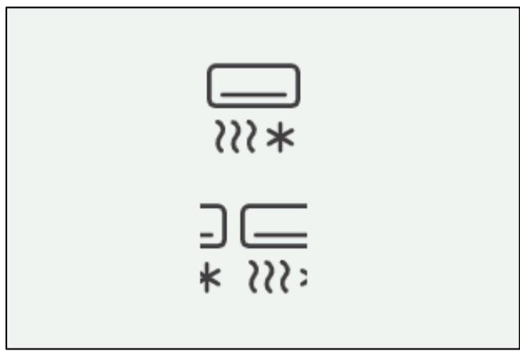  
图17.2.4图片偏移

设置图片偏移可调用以下函数：

```c
lv_img_set_offset_x(img, x_ofs) /* 图片往X轴偏移 */
lv_img_set_offset_y(img, y_ofs) /* 图片往Y轴偏移 */
```

# 17.2.5 图片缩放

在LVGL中，用户可调用lv_img_set_zoom函数设置图片的缩放，该函数具有两个形参，第一个形参为图片部件，而第二个形参为缩放的比例。注意：如果缩放的比例设置为256或LV_imgZoom_NONE，则表示禁用缩放；如果缩放的比例设置为128，则表示缩放到原来的1/2；如果缩放的比例设置为512，则表示放大2倍，示意图如下所示：

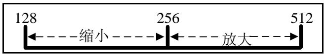  
图17.2.5.1图片缩放比例

# 17.2.6 图片旋转

图片旋转是指图片以某一点为中心，旋转一定的角度。在默认的情况下，旋转的中心点通常就是图片的中心。

用户需要旋转图片，可调用lv_img_set_angle函数进行设置，该函数的第二个形参代表旋转的角度值，值得注意的是，角度值/10 = 实际的旋转角度，因此，如果用户想把图片顺时针旋转  $45^{\circ}$ ，则需要将角度值设置为450。图片旋转的示意图如下：

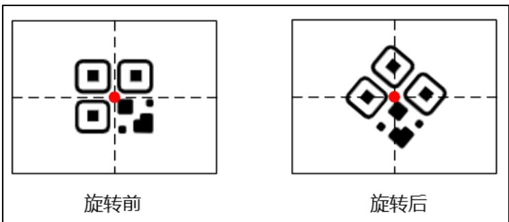  
图17.2.6.1旋转  $45^{\circ}$

在上图中，图片是围绕其中点点进行旋转的，如果用户需要改变旋转的中心点，可以调用lv_img_set_pivot(img, pivot_x, pivot_y)函数，该函数的第二和第三个形参代表旋转中心点的x和y轴坐标。

# 17.3 图片部件的 API 函数

LVGL官方提供了一些与图片部件相关API，如下表所示：

表 17.3.1 图片部件相关的 API 函数  

<table><tr><td>函数</td><td>描述</td></tr><tr><td>lv_img_create()</td><td>创建图片部件</td></tr><tr><td>lv_img_set_src()</td><td>设置图片源</td></tr><tr><td>lv_img_set_offset_x()</td><td>设置图片的x轴偏移量</td></tr><tr><td>lv_img_set_offset_y()</td><td>设置图片的y轴偏移量</td></tr><tr><td>lv_img_set_pivot()</td><td>设置图片的旋转中心点</td></tr><tr><td>lv_img_set_angle()</td><td>设置图片的旋转角度</td></tr><tr><td>lv_img_set_Zoom()</td><td>设置图片的缩放</td></tr><tr><td>lv_img_set_antisalias()</td><td>启用/禁用转换的抗锯齿功能</td></tr><tr><td>lv_img_set_size_mode()</td><td>设置图片的模式</td></tr><tr><td>lv_img_get_src()</td><td>获取图片的来源</td></tr><tr><td>lv_img_get_offset_x()</td><td>获取图片的x轴偏移量</td></tr><tr><td>lv_img_get_offset_y()</td><td>获取图片的y轴偏移量</td></tr><tr><td>lv_img_get_angle()</td><td>获取图片的旋转角度</td></tr><tr><td>lv_img_get_pivot()</td><td>获取图片的旋转中心点</td></tr><tr><td>lv_img_get_Zoom()</td><td>获取图片的缩放系数</td></tr><tr><td>lv_img_get_antisalias()</td><td>获取转换是否开启抗锯齿功能</td></tr><tr><td>lv_img_get_size_mode()</td><td>获取图片模式</td></tr></table>

接下来，我们介绍LVGL图片部件常用的API函数：

# 1. lv_img_create 函数

创建图片部件，其函数原型如下所示：

```c
lv_obj_t * lv_img_create lv_obj_t * parent);
```

该函数的形参描述如表17.3.2所示：

表 17.3.2 lv_img_create 函数形参描述  

<table><tr><td>参数</td><td>描述</td></tr><tr><td>parent</td><td>指向对象的指针,它将是图片的父对象</td></tr></table>

返回值：指向图片部件的指针。

# 2.lv_img_set_src函数

设置图片源，其函数原型如下所示：

```c
void lv_img_set_src(lv_obj_t * obj, const void * src_img);
```

该函数的形参描述如表17.3.3所示：

表 17.3.3 lv_img_set_src 函数形参描述  

<table><tr><td>参数</td><td>描述</td></tr><tr><td>obj</td><td>指向图片对象的指针</td></tr><tr><td>src_img</td><td>图片源</td></tr></table>

返回值：无。

# 3.lv_img_set_offset_x函数

设置图片的  $\mathbf{X}$  轴偏移量。其函数原型如下所示：

```c
void lv_img_set_offset_x lv_obj_t * obj, lv_coord_t x);
```

该函数的形参描述如表17.3.4所示：

表 17.3.4 lv_img_set_offset_x 函数形参描述  

<table><tr><td>参数</td><td>描述</td></tr><tr><td>obj</td><td>指向图片对象的指针</td></tr><tr><td>x</td><td>沿x轴的偏移量</td></tr></table>

返回值：无。

# 4.lv_img_set_offset_y函数

设置图片的y轴偏移量。其函数原型如下所示：

```c
void lv_img_set_offset_y lv_obj_t * obj, lv_coord_t y);
```

该函数的形参描述如表17.3.5所示：

表 17.3.5 lv_img_set_offset_y 函数形参描述  

<table><tr><td>参数</td><td>描述</td></tr><tr><td>obj</td><td>指向图片对象的指针</td></tr><tr><td>y</td><td>沿y轴的偏移量</td></tr></table>

返回值：无。

# 5.lv_img_set_pivot函数

设置图片的旋转中心。图片将围绕此点旋转，其函数原型如下所示：

```c
void lv_img_set_pivot lv_obj_t * obj, lv_coord_t ivot_x, lv_coord_t ivot_y);
```

该函数的形参描述如表17.3.6所示：

表 17.3.6 lv_img_set Pivot 函数形参描述  

<table><tr><td>参数</td><td>描述</td></tr><tr><td>obj</td><td>指向图片对象的指针</td></tr><tr><td>x</td><td>图片的旋转中心x轴坐标</td></tr><tr><td>y</td><td>图片的旋转中心y轴坐标</td></tr></table>

返回值：无。

# 6.lv_img_set_angle函数

设置图片的旋转角度。其函数原型如下所示：

```c
void lv_img_set_angle(lv_obj_t * obj, int16_t angle);
```

该函数的形参描述如表17.3.7所示：

表 17.3.7 lv_img_set_angle 函数形参描述  

<table><tr><td>参数</td><td>描述</td></tr><tr><td>obj</td><td>指向图片对象的指针</td></tr><tr><td>angle</td><td>角度值，实际旋转角度 = 角度值 / 10</td></tr></table>

返回值：无。

# 7.lv_img_set_zoom函数

设置图片缩放，其函数原型如下所示：

```txt
void lv_img_set_zoom(lv_obj_t * obj, uint16_t zoom);
```

该函数的形参描述如表17.3.8所示：  
表 17.3.8 lv_img_set_Zoom 函数形参描述  

<table><tr><td>参数</td><td>描述</td></tr><tr><td>obj</td><td>指向图片对象的指针</td></tr><tr><td>zoom</td><td>缩放系数</td></tr></table>

返回值：无。

# 8.lv_img_set.antialias函数

启用/禁用转换的抗锯齿功能，其函数原型如下所示：

```c
void lv_img_set.antialias lv_obj_t * obj, bool antialias);
```

该函数的形参描述如表17.3.9所示：  
表 17.3.9 lv_img_set.antialias 函数形参描述  

<table><tr><td>参数</td><td>描述</td></tr><tr><td>obj</td><td>指向图片对象的指针</td></tr><tr><td>antialias</td><td>true: 抗锯齿; flase: 不抗锯齿</td></tr></table>

返回值：无。

# 17.4 图片部件的实验

# 17.4.1 硬件设计

# 1. 例程功能

本实验主要测试图片部件 API 函数的使用，实验现象：开机后，屏幕上显示六个滑块以及一张图片（齿轮），当我们滑动不同的滑块时，系统会根据这些滑动的值来修改图片的样式属性。与此同时，LED0 闪烁，提示系统正在运行。

该实验的完整源码，请参考《LVGL 例程 17 lv_img(图片)》例程，路径：A 盘  $\rightarrow 4$  ，程序源码  $\rightarrow 3$  ，扩展例程  $\rightarrow 4$  ，LVGL 例程。

# 17.4.2 软件设计

# 17.4.2.1 程序流程图

本实验的程序流程图，如下图17.4.2.1.1所示：

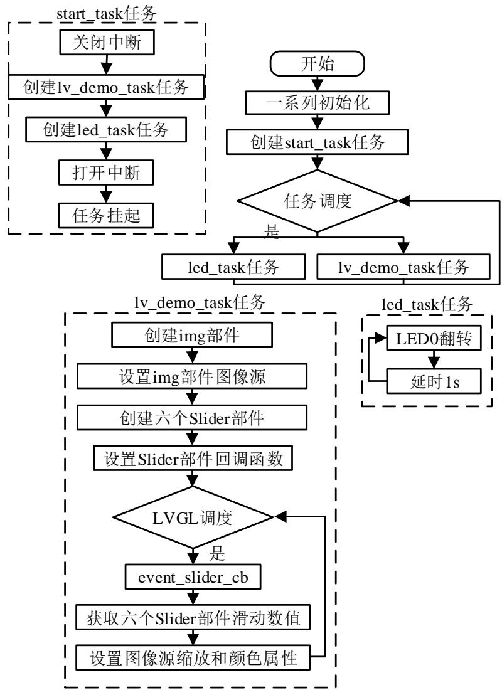  
图17.4.2.1.1图片部件实验流程图

# 17.4.2.2 程序解析

关于LVGL的用户代码，我们都是在lv_mainstart.c文件中编写的，本实验的源码如下所示：

```javascript
/\*\*\*\*\*\*\*\*\*\*\*\*\*\*\*\*\*\*\*\*\*\*\*\*\*\*\*\*\*\*\*\*\*\*\*\*\*\*\*\*\*\*\*\*\*\*\*\*\*\*\*\*\*\*\*\*\*\*\*\*\*\*\*\*\*\*\*\*\*\*\*\*\*\*\*\*\*\*\*\*\*\*\*\*\*\*\*\*\*\*\*\*\*\*\*\*\*\*\*\*\* 第一部分 开始  $\text{串}$ $\text{串}$ $\text{串}$ $\text{串}$ $\text{串}$ $\text{串}$ $\text{串}$ $\text{串}$ $\text{串}$ $\text{串}$ $\text{串}$ $\text{串}$ $\text{串}$ $\text{串}$ $\text{串}$ ${}^{**}$ $@$  brief LVGL 演示\* @param 无\* @return 无\*/void lv_mainstart(void){lv_example.img();1/\*
```

```c
/**
* @brief 创建滑块
* @param color:颜色值
* @return *slider:创建成功的滑块部件
*/
static lv_obj_t *my_slider_create lv_color_t color)
{
    lv_obj_t *slider = lv_slider_create lv_scr_act();
    lv_obj_set_height(slider, scr(act_height() / 20);
    lv_obj_set_width(slider, scr(act_width() / 3);
    lv_obj_remove_style(slider, NULL, LV_PART_KNOB);
    /* 设置滑块指示器颜色 */
    lv_obj_set_style_bg_color(slider,color, LV_PART_INDICATOR);
    /* 设置滑块主体颜色、透明度 */
    lv_obj_set_style_bg_color(slider,lv_color DARKen(color,100),LV_PART_MAIN);
    /* 设置滑块回调 */
    lv_obj_add_event_cb(slider, slider_event_cb, LV_EVENT_VALUE_CHANGED, NULL);
    return slider;
}
/**
* @brief 图片部件实例
* @param 无
* @return 无
*/
static void lv_example.img(void)
{
    img = lv_img_create lv_scr_act();
    lv_img_set_src(img,&img_gear);
    /* 设置图片位置 */
    lv_obj_align(img,LVALIGN_CENTER,-scr actu_width() / 5,0);
    lv_obj_update.layout(img); /* 更新图片参数 */
    /* 图片缩放控制滑块 */
    sliderzoom = my_slider_create lv_colorHex(0x989c98);
    lv_slider_set_range(slider_zoom,128,512); /* 设置滑块的范围 */
    lv_slider_set_value(slider_zoom,256,LV_ANIM_OFF); /* 设置滑块的值 */
    lv_obj_align(slider_zoom,LVALIGN_CENTER,scr actu_width() / 4,
                    -scr actu_height() / 4); /* 设置滑块位置 */
    /* 旋转角度控制滑块 */
}
```

```c
slider_angle = my_slider_create(lv_color(hex(0x989c98)); /* 创建滑块 */
lv_slider_set_range(slider_angle, 0, 3600); /* 设置滑块的范围 */
lv_obj_align_to(slider_angle, slider_zoom, LVALIGN_OUT BOTTOM_LEFT, 0,
scr_act_height() / 20); /* 设置滑块位置 */
/* 红色通道控制滑块 */
slider_r = my_slider_create(lv_color(hex(0xff0000)); /* 创建滑块 */
lv_slider_set_range(slider_r, 0, 255); /* 设置滑块的范围 */
lv_obj_align_to(slider_r, slider_angle, LVALIGN_OUT BOTTOM_LEFT, 0,
scr_act_height() / 20); /* 设置滑块位置 */
/* 绿色通道控制滑块 */
slider_g = my_slider_create(lv_color(hex(0x00ff00)); /* 创建滑块 */
lv_slider_set_range(slider_g, 0, 255); /* 设置滑块的范围 */
lv_obj_align_to(slider_g, slider_r, LVALIGN_OUT BOTTOM_LEFT, 0,
scr_act_height() / 20); /* 设置滑块位置 */
/* 蓝色通道控制滑块 */
slider_b = my_slider_create(lv_color(hex(0x0000ff)); /* 创建滑块 */
lv_slider_set_range(slider_b, 0, 255); /* 设置滑块的范围 */
lv_obj_align_to(slider_b, slider_g, LVALIGN_OUT BOTTOM_LEFT, 0,
scr_act_height() / 20); /* 设置滑块位置 */
/* 着色透明度控制滑块 */
slider_opa = my_slider_create(lv_color(hex(0x00000)); /* 创建滑块 */
lv_slider_set_range(slider_opa, 0, 255); /* 设置滑块的范围 */
lv_slider_set_value(slider_opa, 150, LV_ANIM_OFF); /* 设置滑块的值 */
lv_obj_align_to(slider_opa, slider_b, LVALIGN_OUT BOTTOM_LEFT, 0,
scr_act_height() / 20); /* 设置滑块位置 */
} /\*\*\*\*\*\*\*\*\*\*\*\*\*\*\*\*\*\*\*\*\*\*\*\*\*\*\*\*\*\*\*\*\*\*\*\*\*\*\*\*\*\*\*\*\*\*\*\*\*\*\*\*\*\*\*\*\*\*\*\*\*\*\*\*\*\*\*\*\*\*\*\*\*\*\*\*\*\*\*\*\*\*\*\*\*\*\*\*\*\*\*\*\*\*\*\*\*\*\*\*\*/
/*\* @brief 滑块事件回调
* @param *e : 事件相关参数的集合，它包含了该事件的所有数据
* @return 无
*/ static void slider_event_cb(lv_event_t *e)
{
/* 设置图片缩放 */
lv_img_set_zoom(img, lv_slider_get_value(slider_zoom));
/* 设置图片旋转角度 */
```

```javascript
lv_img_set_angle(img, lv_slider_get_value(slider_angle));  
/* 设置图片重新着色 */  
lv_obj_set_style.img_recolor(img,lv_color.make(lv_slider_get_value(slider_r),lv_slider_get_value(slider_g),lv_slider_get_value(slider_b),LV_PART_MAIN);  
lv_obj_set_style.img_recolor_opa(img,lv_slider_get_value(slider_opa),LV_PART_MAIN); /*设置重新着色透明度*/  
}
```

上述源码可分为以下三个部分：

① lv_mainstart 接口函数。在该函数中，我们调用了图片相关的示例函数；  
(2) 图片、滑块的创建和配置。我们先创建图片部件, 设置图片源, 然后再创建六个滑块部件, 并设置相关的回调函数;  
③ 回调函数的逻辑处理。在滑块的回调函数中，我们将不同滑块的当前值获取回来，然后将这些返回值应用到图片样式的设置中，例如：图片缩放、图片旋转、图片重新着色等。

# 17.4.3 下载验证

把工程编译并下载到我们的开发板中，运行效果如图 17.4.3.1 所示：

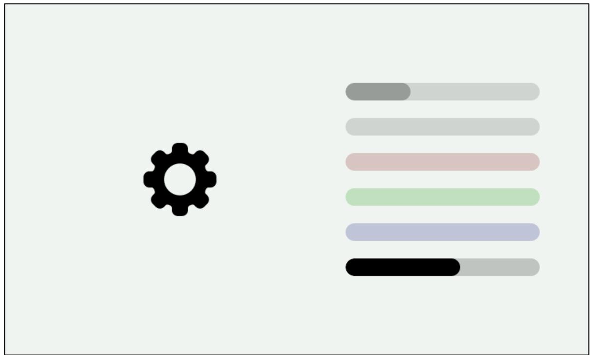  
图17.4.3.1图片部件实验

# 第十八章 标签部件Lv_label)

在LVGL中，标签部件常用于文本显示，例如标题、提示文本等。

本章节将分为以下几个小节：

18.1 标签部件的组成  
18.2 标签部件的相关知识  
18.3标签部件的API函数  
18.4标签部件的实验

# 18.1 标签部件的组成

标签部件由三个部分组成：主体背景、滚动条和所选文本，示意图如下：

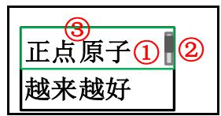  
图18.1.1标签部件组成部分

各组成部分的相关枚举如下所示：

① 主体背景 LV_PART_MAIN;  
② 滚动条 LV_PART_SCROLLBAR;  
$③$  所选文本LV_PART_SELECTD。

关于部件样式设置的内容，请大家参考6.4.4章节。

# 18.2 标签部件的相关知识

# 18.2.1 文本设置

设置标签部件文本的方法有三种：

第一种：调用lv_label_set_text函数

该函数是最常用的标签文本设置函数，它存储文本的内存由动态内存分配的。

第二种：调用lv_label_set_text fmt函数

该函数与C语言的printf输出函数类似，都可以设置“式样化字符串”和“参数表”，示例代码如下：

```txt
lv_label_set_text fmtlabel, "Value: %d", 15);
```

第三种：调用 label_set_text(static) 函数

该函数可以设置静态文本，该文本不存储在动态内存中，而是直接使用指定的缓冲区，此时，如果使用数组设置文本，则该数组不能是局部变量。

# 18.2.2换行符设置

如果用户想把文本分为两段进行显示，则可在内容的末尾添加“\n”，其后续的文本将会换行。

接下来，我们以简单示例来理解标签换行的设置，示例代码如下所示：

```javascript
void lv_mainstart(void)
```

```c
{ lv_obj_t* lv_label1 = lv_label_create lv_scr_act(); lv_label_set_text(lv_label1, "ALIENTEK \nLVGL \nDemo text"); lv_obj_t* lv_label2 = lv_label_create lv_scr_act(); lv_obj_align_to(lv_label2, lv_label1, LVALIGN_OUT BOTTOM_MID, 0, 0); /* 设置标签文本及偏移 */ lv_label_set_text fmt(lv_label2, "Label value %d", 20); }
```

在上述源码中，我们创建了两个标签部件，label1 部件调用 lv_label_set_text 函数设置文本，并使用“\n”进行换行，而 label2 部件调用 lv_label_set_text fmt 函数设置文本。示例代码可以在 PC 模拟器中运行，效果图如下所示：

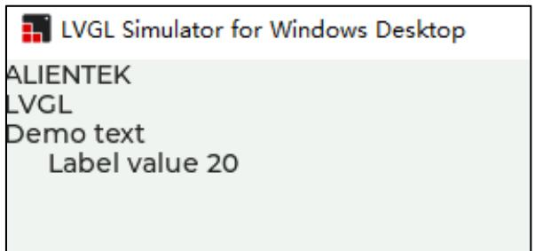  
图18.2.2.1标签部件文本换行

# 18.2.3 文本长模式

默认情况下，标签部件的宽度和高度都会根据文本的大小来动态变化。如果用户固定了标签部件的大小，并且文本的长度超过了部件的长度，则可以使用以下几个长文本模式来选择文本展现的形式：

① LV.Label LONG_WRAP（默认）：如果标签部件的高度是 LV_SIZE_CONTENT，则该部件高度将被扩展，否则文本将被剪切。  
② LV.Label LONG_DOT：将标签文本右下角的最后 3 个字符替换为点。  
③ LV.Label_Long_SCROLL：来回滚动。如果文本比标签部件宽，则往水平方向滚动。如果文本比标签部件高，则往垂直方向滚动。注意：文本只会往一个方向滚动，水平方向具有更高的优先级。  
④ LV.Label LONG SCROLL CIRCULAR：循环滚动。如果文本比标签部件宽，则往水平方向滚动。如果文本比标签部件高，则往垂直方向滚动。注意：文本只会往一个方向滚动，水平方向具有更高的优先级。  
⑥ LV.Label LONG Clip: 直接裁剪标签部件外面的文本。

用户需要设置长文本模式，可调用lv_label_set_long_mode函数。

# 18.2.4 文本着色

用户需要让标签文本着色，可以调用lv_label_set_recolor函数。接下来，我们以简单示例来理解标签文本着色，示例代码如下所示：

```c
void lv_mainstart(void)   
{ lv_obj_t\* lv_label1  $=$  lv_label_createLv_scr_act();
```

```c
lv_label_set_text(lv_label1, "ALIENTEK #ff0000 LVGL# Demo text");  
/* 使能重新着色 */  
lv_label_set_recolor(lv_label1, true);
```

在上述源码中，我们创建了一个标签部件，然后设置文本中的“LVGL”字符串颜色为红色（ff00000），最后使能文本重新着色功能。注意：用户需要设置标签文本着色，必须按以下格式设置文本：#颜色 文本#。示例代码可以在 PC 模拟器中运行，效果图如下所示：

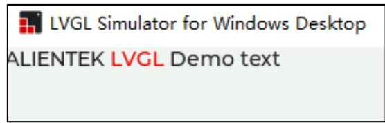  
图18.2.4.1设置文本颜色

# 18.3标签部件的API函数

LVGL官方提供了一些与标签部件相关API，如下表所示：

表 18.3.1 标签部件相关的 API 函数  

<table><tr><td>函数</td><td>描述</td></tr><tr><td colspan="2">label部件设置函数</td></tr><tr><td>lv_label_create()</td><td>创建标签对象</td></tr><tr><td>lv_label_set_text()</td><td>设置标签的新文本</td></tr><tr><td>lv_label_set_text_fmt()</td><td>设置标签的新格式的文本</td></tr><tr><td>lv_label_set_text(static)</td><td>设置一个静态文本</td></tr><tr><td>lv_label_set_long_mode()</td><td>使用更长的文本然后设置对象大小来设置标签</td></tr><tr><td>lv_label_set_recolor()</td><td>启用重新着色</td></tr><tr><td>lv_label_set_text_sel_start()</td><td>设置选择开始索引</td></tr><tr><td>lv_label_set_text_sel_end()</td><td>设置选择结束索引</td></tr><tr><td colspan="2">lable部件获取函数</td></tr><tr><td>lv_label_get_text()</td><td>获取标签文本</td></tr><tr><td>lv_label_get_long_mode()</td><td>获取标签的长模式</td></tr><tr><td>lv_label_get_recolor()</td><td>获取重新着色属性</td></tr><tr><td>lv_label_get_letter_pos()</td><td>获取字母的相对x和y坐标</td></tr><tr><td>lv_label_get_letter_on()</td><td>获取标签相对点上的字母索引</td></tr><tr><td>lv_label_is_char_under_pos()</td><td>检查是否在一个点下绘制了一个字符</td></tr><tr><td>lv_label_get_text_selection_start()</td><td>获取选择开始索引</td></tr><tr><td>lv_label_get_text_selection_end()</td><td>获取选择结束索引</td></tr><tr><td>lv_label_ins_text()</td><td>在标签上插入文本。标签文本不能是静态的</td></tr><tr><td>lv_label_cut_text()</td><td>从标签中删除字符。标签文本不能是静态的</td></tr></table>

接下来，我们介绍LVGL标签部件常用的API函数：

# 1.lv_label_create函数

创建标签部件，该函数原型如下所示：

```c
lv_obj_t * lv_label_createLv_obj_t \* parent);
```

该函数的形参，如表18.3.2所示：

<table><tr><td>参数</td><td>描述</td></tr><tr><td>parent</td><td>父对象</td></tr></table>

表 18.3.2 lv_label_create 函数形参描述

返回值：无

# 2.lv_label_set_text函数

设置文本（动态），该函数原型如下所示：

```c
void lv_label_set_text lv_obj_t * obj, const char* text);
```

该函数的形参，如表18.3.3所示：

表 18.3.3 lv_label_set_text 函数形参描述  

<table><tr><td>参数</td><td>描述</td></tr><tr><td>obj</td><td>指向对象的指针</td></tr><tr><td>text</td><td>文本字符串</td></tr></table>

返回值：无

# 3.lv_label_set_text fmt函数

设置格式化文本，该函数原型如下所示：

```txt
void lv_label_set_text fmt lv_obj_t \* obj, const char \* fmt, ...);
```

该函数的形参，如表18.3.4所示：

表 18.3.4 lv_label_set_text fmt 函数形参描述  

<table><tr><td>参数</td><td>描述</td></tr><tr><td>obj</td><td>指向对象的指针</td></tr><tr><td>fmt</td><td>与printf类似格式的文本</td></tr></table>

返回值：无

# 4.lv_label_set_long_mode函数

设置长文本模式，该函数原型如下所示：

```c
void lv_label_set_long_mode(lv_obj_t * obj, lv_label_long_mode_t long_mode);
```

该函数的形参，如表18.3.5所示：

表 18.3.5 lv_label_set_long_mode 函数形参描述  

<table><tr><td>参数</td><td>描述</td></tr><tr><td>obj</td><td>指向对象的指针</td></tr><tr><td>long_mode</td><td>长文本模式</td></tr></table>

返回值：无

# 5.lv_label_set_recolor函数

设置文本重新着色，该函数原型如下所示：

```c
void lv_label_set_recolor lv_obj_t * obj, bool en);
```

该函数的形参，如表18.3.6所示：

表 18.3.6 lv_label_set_recolor 函数形参描述  

<table><tr><td>参数</td><td>描述</td></tr><tr><td>obj</td><td>指向对象的指针</td></tr><tr><td>en</td><td>true: 启用重新着色, false: 禁用</td></tr></table>

返回值：无

# 18.4标签部件的实验

# 18.4.1 硬件设计

# 1. 例程功能

本实验主要测试标签部件 API 函数的使用，实验现象：开机后，屏幕上显示三个标签部件，它们分别了展现文本重新着色、长文本模式以及文本阴影。与此同时，LEDO 闪烁，提示系统正在运行。

该实验的完整源码，请参考《LVGL例程18lv_label(标签)》例程，路径：A盘  $\rightarrow 4$  ，程序源码  $\rightarrow 3$  ，扩展例程  $\rightarrow 4$  ，LVGL例程。

# 18.4.2 软件设计

# 18.4.2.1 程序流程图

本实验的程序流程图，如下图 18.4.2.1.1 所示：

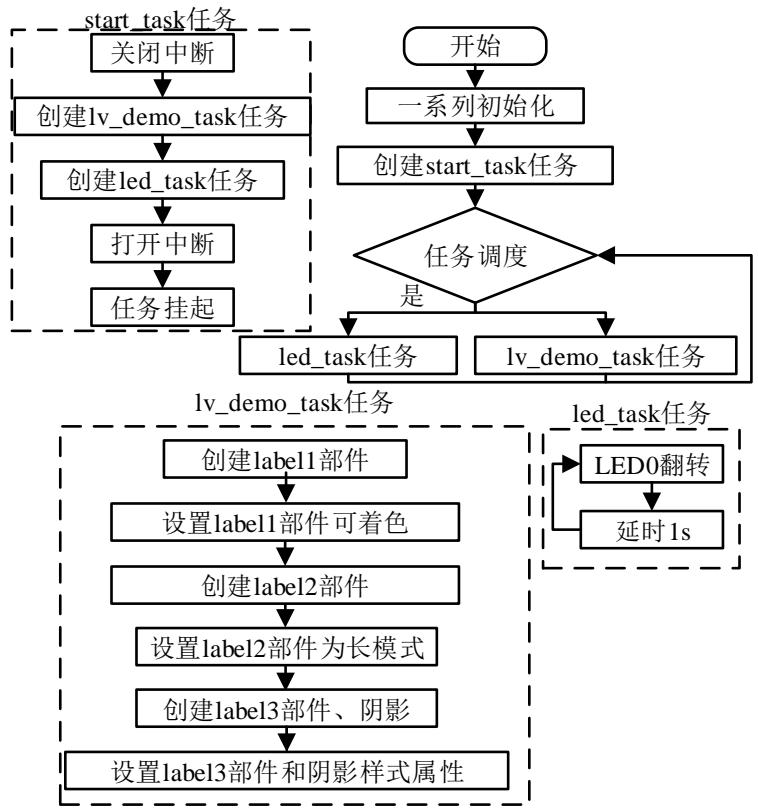  
图18.4.2.1.1标签部件实验流程图

# 18.4.2.2 程序解析

关于LVGL的用户代码，我们都是在lv_mainstart.c文件中编写的，本实验的源码如下所示：

```javascript
/*   
\*/
```

```javascript
\* @param 无\* @return 无\*/void lv_mainstart(void)  
{lv_example_label_1();lv_example_label_2();lv_example_label_3();}  
/****** 第一部分 结束 \*\*\*\*\*\*\*\*\*\*\*\*\*\*\*\*\*\*\*\*\*\*\*\*\*\*\*\*\*\*\*\*\*\*\*\*\*\*\*\*\*\*\*\*\*\*\*\*\*\*\*\*\*\*\*\*\*\*\*\*\*\*\*\*\*\*\*\*\*\*\*\*\*\*\*\*\*\*\*\*\*\*\*\*\*\*\*\*\*\*\*\*\*\*\*\*\*\*\*\*\*  
\*/\* @brief 例1\* @param 无\* @return 无\*/static void lv_example_label_1(void)  
{if (scr_act_width() <= 320)font  $=$  &lv_font_montserrat_10;else if (scr_act_width() <= 480)font  $=$  &lv_font_montserrat_14;elsefont  $=$  &lv_font_montserrat_20;/\*定义并创建标签 \*/lv_obj_t\* label  $=$  lv_label_create(lv_scr_act());/\*设置标签文本 \*/lv_label_set_text.label，"#0000ff Re-color# #ff00ff words# #ff0000 of a# "label, align the lines to the center" "and wrap long text automatically."）；/\*启用标签文本重新着色 \*/lv_label_set_recolor.label, true);/\*设置标签文本字体 \*/lv_obj_set_style_text.Font.label,font,LV_PART_MAIN);/\*设置标签宽度 \*/lv_obj_set_width labelled,scr_act_width() /3);/\*设置标签位置 \*/lv_obj_align labelled,LV ALIGNCENTER,-scr actuwidth() /3,0);/\*设置标签文本对齐方式 \*/lv_obj_set_style_text_align labelled,LV Text ALIGN CENTER,LV PART_MAIN);
```

```c
/* */
* @brief 例2
* @param 无
* @return 无
*/ static void lv_example_label_2(void)
{
    /* 定义并创建标签 */
    lv_obj_t* label = lv_label_create lv_scr_act());
    /* 设置标签文本 */
    lv_label_set_text.label, "It is a circularly scrolling text. ");
    /* 设置标签文本字体 */
    lv_obj_set_style_text.Font (label, font, LV_PART_MAIN);
    /* 设置标签宽度 */
    lv_obj_set_width (label, scr(act_width() / 3);
    /* 设置标签长模式：循环滚动 */
    lv_label_set_long_mode (label, LV.Label LONG.Scroll_CIRCULAR);
    /* 设置标签位置 */
    lv_obj_align (label, LVALIGN_CENTER, 0, 0);
}
/* */
* @brief 例3
* @param 无
* @return 无
*/
static void lv_example_label_3(void)
{
    /* 定义并创建标签 */
    lv_obj_t* label = lv_label_create lv_scr(act());
    /* 设置标签文本 */
    lv_label_set_text fmt (label, "Label can set text like %s", "printf");
    /* 设置标签文本字体 */
    lv_obj_set_style_text.Font (label, font, LV_PART_MAIN);
    /* 设置标签宽度 */
    lv_obj_set_width (label, scr(act_width() / 3);
    /* 设置标签位置 */
    lv_obj_align (label, LVALIGN_CENTER, scr(act_width() / 3, 0);
    /* 设置标签文本对齐方式 */
    lv_obj_set_style_text_align (label, LVText-align_CENTER, LV_PART_MAIN);
    /* 定义并创建阴影标签 */
}
```

```c
lv_obj_t* label-shadow = lv_label_create lv_scr_act();  
/* 设置标签文本 */  
lv_label_set_text.label_shadow, lv_label_get_text.label);  
/* 设置标签文本字体 */  
lv_obj_set_style_text.Font labelled shadow, font, LV_PART_MAIN);  
/* 设置标签宽度 */  
lv_obj_set_width labelled shadow, scr(act_width() / 3);  
/* 设置标签文本透明度 */  
lv_obj_set_style_text_opa labelled shadow, LV_OPA_30, LV_PART_MAIN);  
/* 设置标签文本颜色 */  
lv_obj_set_style_text_color labelled shadow, lv_color.black(), LV_PART_MAIN);  
/* 设置标签文本对齐方式 */  
lv_obj_set_style_text_align labelled shadow, LV_TEXT Alignment_CENTER, LV_PART_MAIN);  
/* 设置标签位置 */  
lv_obj_align_to labelled shadow, label, LVALIGN_TOP_LEFT, 3, 3);  
********** 第二部分 结束 ****/
```

上述源码可分为以下两个部分：

① lv_mainstart 接口函数。在该函数中，我们调用了标签部件相关的 3 个示例函数；  
② 文本重新着色、长文本模式和文本阴影的实现。我们分别在 lv_example_label_1~3 函数中设置标签部件的文本重新着色、长文本模式和文本阴影。

# 18.4.3 下载验证

把工程编译并下载到我们的开发板中，运行效果如图 18.4.3.1 所示：

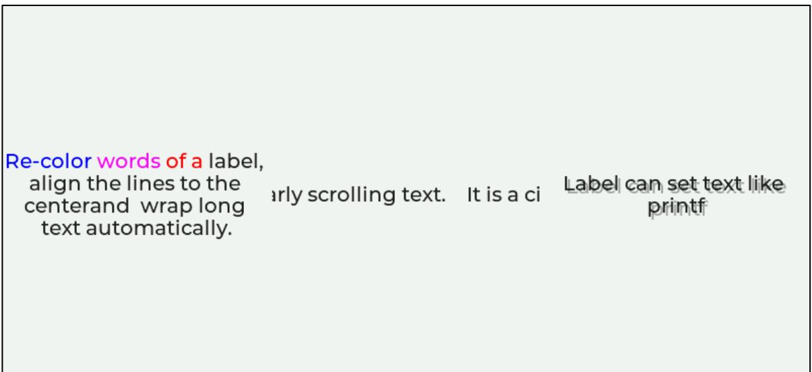  
图18.4.3.1标签部件实验

# 第十九章 线条部件(lv_line)

线条部件由多个点连接而成，它可用于修饰界面或者展示数据。

本章节将分为以下几个小节：

19.1 线部件的组成  
19.2 线部件的相关知识  
19.3线部件的API函数  
19.4 线部件的实验

# 19.1 线条部件的组成

线条部件只有一个组成部分：主体 LV_PART_MAIN。关于部件样式设置的内容，请大家参考 6.4.4 章节。

# 19.2 线条部件的相关知识

# 19.2.1 设置连接点

线条是由多个点连接而成的对象，用户可以使用lv_point_t类型的数组存储这些坐标点，并调用lv_line_set_points函数，把这些坐标点传递给线条部件，它将会把这些点连接起来，最终绘制成线条。

接下来，我们以简单示例来理解线条连接点的设置，示例代码如下所示：

```c
void lv_mainstart(void)   
{ /\*为直线的点创建一个数组\*/ staticlv_point_tline_points[]  $\equiv$  {5，5}，{70，70}，{120，10}， {180，60}，{240，10}）; lv_obj_t\* line1; /\*创建line部件\*/ line1  $\equiv$  lv_line_create(lv_scr_act()); /\*设置线部件的点数组\*/ lv_line_setpoints(line1,line_points,5); /\*居中\*/ lv_obj_center(line1);
```

在上述源码中，我们先创建连接点相关的数组，然后创建一个线条部件，最后将点数组传入到线条部件中，其将会把这些点连接起来。示例代码可以在PC模拟器中运行，效果图如下所示：

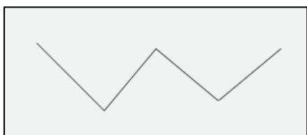

上图中，因为线条部件被居中对齐，所以坐标原点在该部件居中后的左上方，如下图所示：

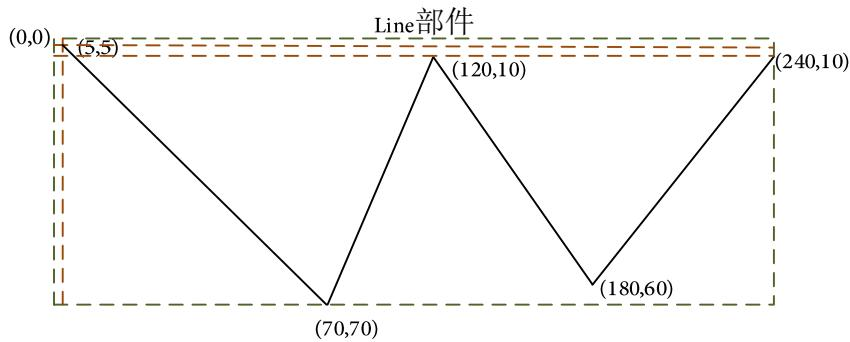  
显示器  
图19.2.1.1 设置线条连接点  
图19.2.1.2坐标点示意图

# 19.2.2 自适应大小

默认情况下，线条部件的宽度和高度都是LV_SIZE_CONTENT，这意味着它将自动设置自身的大小，以适应所有的点。如果用户设置了线条部件的大小，则超出的部分可能不可见。

# 19.2.3 倒Y操作

倒Y操作指的是将线条部件的参考原点设置到左下角，其最终效果相当于将线条沿Y轴方向镜像翻转。用户需要进行倒Y操作，可调用lv_line_set_y_invert函数，效果图如下所示：

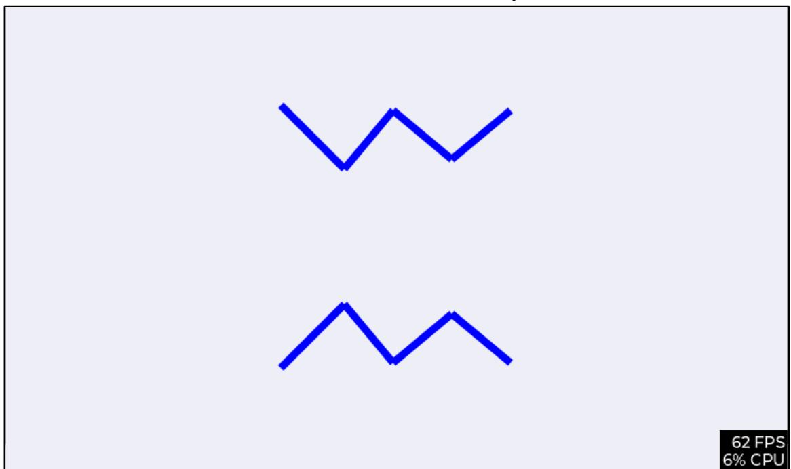  
图19.2.3.1设置线条部件倒Y

# 19.3线条部件的API函数

LVGL官方提供了一些与线条部件相关API，如下表所示：

表 19.3.1.1 线条部件相关的 API 函数  

<table><tr><td>函数</td><td>描述</td></tr><tr><td>lv_line_create()</td><td>创建线条部件</td></tr><tr><td>lv_line_set_points()</td><td>设置一个点数组，线条对象将这些点连接起来</td></tr><tr><td>lv_line_set_y_invert()</td><td>启用或禁用Y坐标反转</td></tr><tr><td>lv_line_get_y_invert()</td><td>获取Y坐标反转属性</td></tr></table>

接下来，我们介绍LVGL线条部件常用的API函数：

# 1.lv_line_create函数

创建线条部件，该函数原型如下所示：

```txt
lv_obj_t * lv_line_create lv_obj_t * parent);
```

该函数的形参，如表19.3.2所示：

表 19.3.2 lv_line_create 函数形参描述  

<table><tr><td>参数</td><td>描述</td></tr><tr><td>parent</td><td>指向父类对象的指针</td></tr></table>

返回值：无。

# 2.lv_line_set_points函数

设置一个点数组，该函数原型如下所示：

```c
void lv_line_set_points( lv_obj_t *obj, const lv_point_t points[], uint16_t point_num);
```

该函数的形参，如表19.3.3所示：

表 19.3.3 lv_line_set_points 函数形参描述  

<table><tr><td>参数</td><td>描述</td></tr><tr><td>obj</td><td>指向线条对象的指针</td></tr><tr><td>points</td><td>点数组</td></tr><tr><td>point_num</td><td>点的数量</td></tr></table>

返回值：无。

# 3.lv_line_set_y_invert函数

启用或禁用Y坐标反转，该函数原型如下所示：

```c
void lv_line_set_y_invert(lv_obj_t *obj, bool en);
```

该函数的形参，如表19.3.4所示：

表 19.3.4 lv_line_set_y_invert 函数形参描述  

<table><tr><td>参数</td><td>描述</td></tr><tr><td>obj</td><td>指向线条对象的指针</td></tr><tr><td>en</td><td>true:开启，false:关闭</td></tr></table>

返回值：无。

# 4.lv_line_get_y_invert函数

获取Y轴反转属性，该函数原型如下所示：

```c
bool lv_line_get_y_invert(const lv_obj_t *obj);
```

该函数的形参，如表19.3.5所示：

<table><tr><td>参数</td><td>描述</td></tr><tr><td>obj</td><td>指向线条对象的指针</td></tr></table>

表 19.3.5 lv_line_get_y_invert 函数形参描述

返回值：true:开启，false:关闭。

# 19.4线条部件的实验

# 19.4.1 硬件设计

# 19.4.1.1 硬件设计

本实验主要测试线条部件 API 函数的使用，实验现象：开机后，屏幕上显示一个标题和一条正弦波曲线。与此同时，LED0 闪烁，提示系统正在运行。

该实验的完整源码，请参考《LVGL 例程 19 lv_line(线条)》例程，路径：A 盘  $\rightarrow 4$  ，程序源码  $\rightarrow 3$  ，扩展例程  $\rightarrow 4$  ，LVGL 例程。

# 19.4.2 软件设计

# 19.4.2.1 程序流程图

本实验的程序流程图，如下图19.4.2.1.1所示：

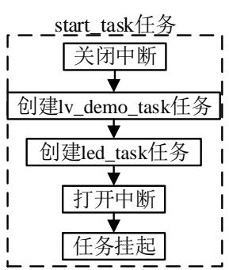


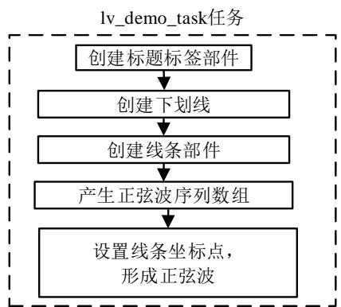  
图19.4.2.1.1线条部件实验流程图


# 19.4.2.2 程序解析

关于LVGL的用户代码，我们都是在lv_mainstart.c文件中编写的，本实验的源码如下所示：

```javascript
/*****\*\*\*\*\*\*\*\*\*\*\*\*\*\*\*\*\*\*\*\*\*\*\*\*\*\*\*\*\*\*\*\*\*\*\*\*\*\*\*\*\*\*\*\*\*\*\*\*\*\*\*\*\*\*\*\*\*\*\*\*\*\*\*\*\*\*\*\*\*\*\*\*\*\*\*\*\*\*\*\*\*\*\*\*\*\*\*\*\*\*\*\*\*\*\*\*\*\*\*\*\*
```

```javascript
\* @brief LVGL 演示\* @param 无\* @return 无\*/void lv_mainstart(void)lv_example_line(); /\* 正弦波实例 \*/}/\*\*\*\*\*\*\*\*\*\*\*\*\*\*\*\*\*\*\*\*\*\*\*\*\*\*\*\*\*\*\*\*\*\*\*\*\*\*\*\*\*\*\*\*\*\*\*\*\*\*\*\*\*\*\*\*\*\*\*\*\*\*\*\*\*\*\*\*\*\*\*\*\*\*\*\*\*\*\*\*\*\*\*\*\*\*\*\*\*\*\*\*\*\*\*\*\*\*\*\*\* 第一部分 结束  $\star \star \star \star \star \star \star \star \star \star \star \star \star \star \star \star \star \star \star \star \star \star \star \star \star \star \star \star \star \star \star \star \star \star \star \star \star \star \star \star \star \star \star \star \star \star \star \star \star \star \star 1$  第二部分 开始  $\ast \ast \ast \ast \ast \ast \ast \ast \ast \ast \ast \ast \ast \ast \ast \ast \ast \ast \ast \ast \ast \ast \ast \ast \ast /$  /\*\* @brief 产生正弦波坐标点\* @param maxval：峰值\* @param samples: 坐标点的个数\* @retval 无\*/static void create_sin_buf( uint16_t maxval, uint16_t samples)ui16_t i;float y = 0;\*/\* 正弦波最小正周期为  $2\pi$  ，约等于  $2\times 3.1415926$  曲线上相邻的两个点在x轴上的间隔  $= 2\times 3.1415926$  /采样点数量\*/float inc  $=$  (2\*3.1415926)/samples; /\* 计算相邻两个点的x轴间隔\*/for（i  $= 0$  ：i  $<  _{\cdot}$  samples；i++) /\* 连续产生samples个点\*/{/\* 正弦波函数解析式：y  $=$  Asin(wx  $^+$  φ）+b\* 计算每个点的y值，将峰值放大maxval倍，并将曲线向上偏移maxval到正数区域\*/y=maxval\*sin(inc\*i)+maxval;\* sin_line_points[i].x  $= 2$  i;\*/\*存入x轴坐标\*/sin_line_points[i].y=y;\*/\*存入y轴坐标\*/}  
}
```

```txt
\* @param 无\* @return 无\*/static void lv_example_line(void)  
{/\* 根据活动屏幕宽度选择字体 \*/if (scr_act_width() <= 480){font  $=$  &lv_font_montserrat_14;1}else{font  $=$  &lv_font_montserrat_30;1/\*标题\*/lv_obj_t \*label  $=$  lv_label_create(lv_scr_act());/\*创建标签\*/lv_label_set_text.label, "Line");/\*设置文本内容\*/lv_obj_set_style_text.Font.label, LV_STATE_DEFAULT); /\*设置字体\*/lv_obj_align.label, LVALIGN_TOP_LEFT, scr actuwidth(/20,scr actuheight(/16);/\*设置位置\*//\*直线（用作下划线）\*/lv_obj_t \*straigh_line  $=$  lv_line_create(lv_scr_act());/\*创建线条\*//\*设置线条坐标点\*/lv_line_set_points(straigh_line, straigh_linepoints, 2);/\*设置位置\*/lv_obj_align_to(straigh_line, label, LV ALIGN_OUT_bottom_LEFT, 0, 0);/\*正弦波\*/lv_obj_t \*sin_line  $=$  lv_line_create(lv_scr_act());/\*创建线条\*/create_sin_bufSCR actuheight(/4, SIN]=-/*产生正弦波坐标点\*//\*设置线条坐标点\*/lv_line_set_points(sin_line, sin_line_points, SIN]=-设置位置\*/lv_obj_center(sin_line);/\*设置位置\*/lv_obj_set_style_line_width(sin_line, 8, LV_PART_MAIN);/\*设置线的宽度\*/lv_obj_set_style_line_color(sin_line, lv Palette_main(LV_PALETTE BLUE),LV_PART_MAIN);/\*设置线的颜色\*//\*设置线条圆角\*/lv_obj_set_style_line Rounded(sin_line, true, LV_PART_MAIN);
```

上述源码可分为以下两个部分：

(1) lv_mainstart 接口函数。在该函数中，我们调用了线条部件相关的示例函数；  
② 正弦波曲线的实现。我们先根据活动屏幕的宽度来选择字体大小，创建标题标签以及下划线，然后创建正弦波相关的线条部件，并将 create_sin_buf 函数所产生的正弦波序列数组设置为其坐标点，从而得到一条正弦波曲线。

# 19.4.3 下载验证

把工程编译并下载到我们的开发板中，运行效果如图 19.4.3.1 所示：

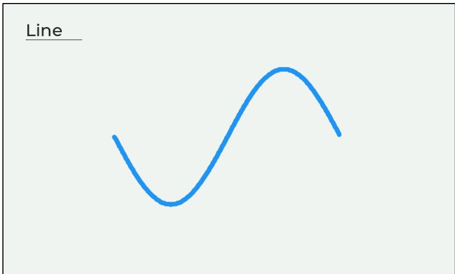  
图19.4.3.1线条部件实验

# 第二十章 滚轮部件(lv Roller)

滚轮部件可展现多个选项，用户可以通过滚动的形式，从这些选项中选择所需的内容。在用户界面设计中，该部件常用于设置时间、日期等。

本章节将分为以下几个小节：

20.1 滚轮部件的组成  
20.2滚轮部件的相关知识  
20.3 滚轮部件的 API 函数  
20.4 滚轮部件的实验

# 20.1 滚轮部件的组成

滚轮部件由两个部分组成：主体背景和所选文本，示意图如下：

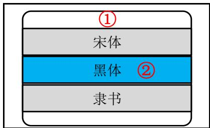  
图20.1.1滚轮部件的组成部分

各组成部分的相关枚举如下所示：

① 主体背景 LV_PART_MAIN;  
$②$  所选文本LV_PART_SELECTD。

关于部件样式设置的内容，请大家参考6.4.4章节。

# 20.2滚轮部件的相关知识

# 20.2.1 添加选项和滚轮模式

# 1. 添加选项

默认情况下，滚轮部件创建出来后，其并不具备任何选项，用户需要添加选项，可调用lv Roller_set-options函数。

# 2. 滚轮模式：

滚轮部件具有两种滚动模式，如下所示：

① LV_ROLLER_MODE_INFINITE：循环滚动模式；  
② LV_ROLLER_MODE_NORMAL: 正常模式。

如果滚轮部件为LV_ROLLER_MODE_INFINITE模式，此时，用户滚动选项，当选项滚动到最后一个，若继续滚动，其将回到第一个选项（循环滚动）；如果滚轮部件为LV_ROLLER_MODE_NORMAL模式，则滚轮部件的最后一个和第一个选项不能循环切换，这两种模式的示意图如下：

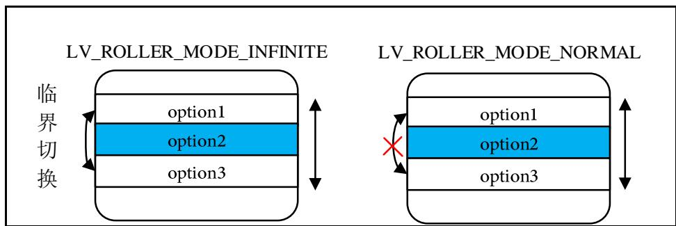  
图20.2.1.1滚轮部件模式示意图

默认情况下，滚轮部件的所选项为第一个添加的选项，如果用户想改变所选项，可调用lv Roller_set_selected函数进行设置。

# 20.2.2 获取选项索引和文本

如果用户想获取当前选中选项的索引，可调用lv Roller_get_selected函数；如果用户想获取当前选中选项的文本，可调用lv Roller_get_selected_str函数。

# 20.2.3 可见选项的数量

滚轮部件中存在多个选项，用户可以调用lv Roller_set Visible_row_count函数，设置默认显示的选项数量。

接下来，我们以简单示例来理解可见选项数量的设置，示例代码如下所示：

```c
/*滚轮选项*/   
static const char\* roller_options  $=$  "option0\n" "option1\n" "option2\n" "option3\n" "option4\n" "option5\n" "option6\n" "option7";   
/\*\*  $\star$  @brief LVGL演示  $\star$  @param 无  $\star$  @return 无   
\*/   
void lv_mainstart(void)   
{ /\*定义并创建滚轮\*/ lv_obj_t\* roller  $=$  lv Roller_create(lv_scr_act()); /\*滚轮添加选项并设置无限模式\*/ lv Roller_set_options(roller, roller_options,LV_ROLLER_MODE_NORMAL); /\*设置滚轮宽度\*/ lv_obj_set_width(roller，110); /\*设置滚轮可见选项个数\*/
```

```txt
lv Roller_set Visible_row_count(roller, 3);
```

上述源码中，我们调用了lv Roller_set Visible_row_count函数，设置滚轮的可见选项个数为3，示例代码可以在PC模拟器中运行，效果图如下所示：

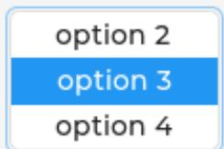  
图20.2.3.1设置滚轮可见选项数量

# 20.3滚轮部件的API函数

LVGL官方提供了一些与滚轮部件相关API，如下表所示：

表 20.3.1.1 滚轮部件相关的 API 函数  

<table><tr><td>函数</td><td>描述</td></tr><tr><td>lv Roller_create()</td><td>创建滚轮部件</td></tr><tr><td>lv Roller_set_options()</td><td>设置滚轮部件选项</td></tr><tr><td>lv Roller_set_selected()</td><td>设置所选选项</td></tr><tr><td>lv Roller_set Visible_row_count()</td><td>设置可见选项数量</td></tr><tr><td>lv Roller_get_selected()</td><td>获取所选选项索引</td></tr><tr><td>lv Roller_get_selected_str()</td><td>获取所选选项文本</td></tr><tr><td>lv Roller_get_options()</td><td>获取滚轮的选项</td></tr><tr><td>lv Roller_get_option_cnt()</td><td>获取选项的总数</td></tr></table>

接下来，我们介绍LVGL滚轮部件常用的API函数：

# 1.lv Roller_create 函数

创建滚轮部件，该函数原型如下所示：

```txt
lv_obj_t * lv Roller_createLv_obj_t \* parent);
```

该函数的形参，如表20.3.2所示：

表 20.3.2 lv_roller_create 函数形参描述  

<table><tr><td>参数</td><td>描述</td></tr><tr><td>parent</td><td>指向父对象的指针</td></tr></table>

返回值：滚轮对象。

# 2. Iv Roller_set-options 函数

设置滚轮的选项，该函数原型如下所示：

```c
void lv Roller_set_options(lv_obj_t *obj, const char *options, lv Roller_mode_t mode);
```

该函数的形参，如表20.3.3所示：

<table><tr><td>参数</td><td>描述</td></tr><tr><td>obj</td><td>指向滚轮对象的指针</td></tr><tr><td>options</td><td>添加的选项</td></tr><tr><td>mode</td><td>滚轮滚动的模式</td></tr></table>

表 20.3.3 lv Roller_set-options 函数形参描述

返回值：无。

# 3.lv Roller_set_selected函数

设置所选选项，该函数原型如下所示：

```c
void lv Roller_set_selected(lv_obj_t *obj, uint16_t sel_opt, lv_anim_enable_t anim);
```

该函数的形参，如表20.3.4所示：

表 20.3.4 lv Roller_set_selected 函数形参描述  

<table><tr><td>参数</td><td>描述</td></tr><tr><td>obj</td><td>指向滚轮对象的指针</td></tr><tr><td>sel_opt</td><td>所选项的索引</td></tr><tr><td>anim</td><td>LV_ANIM_ON: 开启动画; LV_ANOM_OFF: 无动画</td></tr></table>

返回值：无。

# 4.lv Roller_set Visible_row_count 函数

设置可见选项数量，该函数原型如下所示：

```c
void lv Roller_set Visible_row_count (lv_obj_t *obj, uint8_t row_cnt);
```

该函数的形参，如表20.3.5所示：

表 20.3.5 lv Roller_set Visible_row_count 函数形参描述  

<table><tr><td>参数</td><td>描述</td></tr><tr><td>obj</td><td>指向滚轮对象的指针</td></tr><tr><td>row_cnt</td><td>可见选项数量</td></tr></table>

返回值：无。

# 5.lv Roller_get_selected函数

获取所选选项的索引，该函数原型如下所示：

```c
uint16_t lv Roller_get_selected(const lv_obj_t *obj);
```

该函数的形参，如表20.3.6所示：

表 20.3.6 lv Roller_get_selected 函数形参描述  

<table><tr><td>参数</td><td>描述</td></tr><tr><td>obj</td><td>指向滚轮对象的指针</td></tr></table>

返回值：无。

# 6.lv Roller_get_selected_str函数

获取当前所选项的文本，该函数原型如下所示：

```c
void lv Roller_get_selected_str(const lv_obj_t *obj, char *buf, uint32_t buf_size);
```

该函数的形参，如表20.3.7所示：

表 20.3.7 lv Roller_get_selected_str 函数形参描述  

<table><tr><td>参数</td><td>描述</td></tr><tr><td>obj</td><td>指向滚轮对象的指针</td></tr><tr><td>buf</td><td>指向字符串数组的指针</td></tr><tr><td>buf_size</td><td>buf 的大小，以字节为单位</td></tr></table>

返回值：无。

# 7. lv Roller_get_options 函数

获取滚轮的选项，该函数原型如下所示：

```c
const char *lv Roller_get_options(const lv_obj_t *obj);
```

该函数的形参，如表20.3.8所示：

<table><tr><td>参数</td><td>描述</td></tr><tr><td>obj</td><td>指向滚轮对象的指针</td></tr></table>

表 20.3.8 lv_rollower_get-options 函数形参描述  
返回值：选项内容，例如：“Option1 \ nOption2 \ nOption3”。

# 20.4滚轮部件的实验

# 20.4.1 硬件设计

# 1. 例程功能

本实验主要测试滚轮部件 API 函数的使用，实验现象：开机后，屏幕上显示 3 个滚轮，用户可通过滚轮选择所需选项，当 MODE 滚轮选择为 Auto 时，其他两个滚轮将失效（不可滚动）。与此同时，LED0 闪烁，提示系统正在运行。

该实验的完整源码，请参考《LVGL例程20lv Roller(滚轮)》例程，路径：A盘  $\rightarrow 4$  ，程序源码  $\rightarrow 3$  ，扩展例程  $\rightarrow 4$  ，LVGL例程。

# 20.4.2 程序设计

# 20.4.2.1 程序流程图

本实验的程序流程图，如下图 20.4.2.1.1 所示：

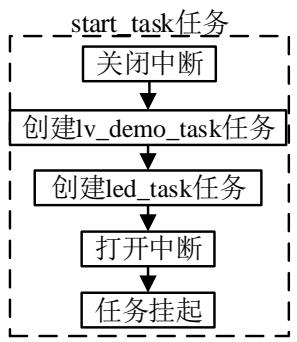

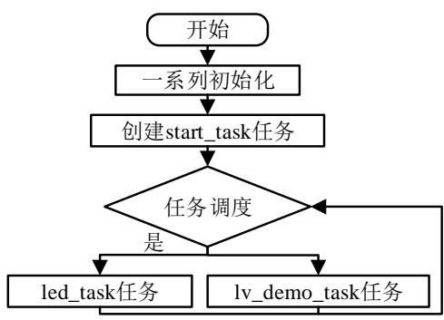

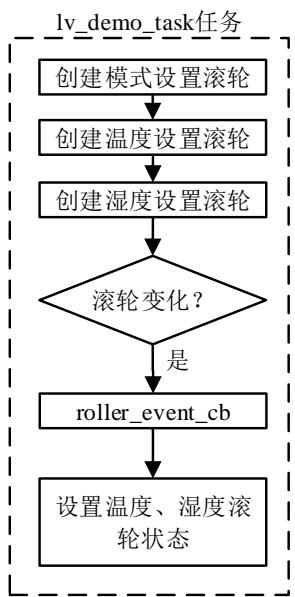  
图20.4.2.1.1滚轮部件实验流程图

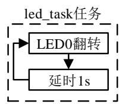

# 20.4.2.2 程序解析

关于LVGL的用户代码，我们都是在lv_mainstart.c文件中编写的，本实验的源码如下所示：

```javascript
/\*\*\*\*\*\*\*\*\*\*\*\*\*\*\*\*\*\*\*\*\*\*\*\*\*\*\*\*\*\*\*\*\*\*\*\*\*\*\*\*\*\*\*\*\*\*\*\*\*\*\*\*\*\*\*\*\*\*\*\*\*\*\*\*\*\*\*\*\*\*\*\*\*\*\*\*\*\*\*\*\*\*\*\*\*\*\*\*\*\*\*\*\*\*\*\*\*\*\*\*\* 第一部分 开始  $\text{串}$ $\text{串}$ $\text{串}$ $\text{串}$ $\text{串}$ $\text{串}$ $\text{串}$ $\text{串}$ $\text{串}$ $\text{串}$ $\text{串}$ $\text{串}$ $\text{串}$ $\text{串}$ $\text{串}$ ${}^{*}[$  brief LVGL 演示 $^{\star}$  @param 无 $^{\star}$  @return 无\*/void lv_mainstart(void){lv_example Roller1(); /\* 模式设置滚轮 \*/lv_example Roller2(); /\* 温度设置滚轮 \*/lv_example Roller3(); /\* 湿度设置滚轮 \*/}  
/\*
```

```c
/* */
* @brief 滚轮事件回调
* @param *e: 事件相关参数的集合, 它包含了该事件的所有数据
* @return 无
*/
static void roller_event_cb(lv_event_t* e)
{
    lv_obj_t *target = lv_event_get_target(e); /* 获取触发源 */
    if (lv Roller_get_selected(target) == 0) /* 获取索引, 判断是否为 Auto 选项 */
        {
            /* 设置温度滚轮为不可选状态 */
            lv_obj_add_state(temproller, LV_STATE_DISABLED);
            /* 设置湿度滚轮为不可选状态 */
            lv_obj_add_state(hum Roller, LV_STATE_DISABLED);
        }
    else
        {
            /* 解除温度滚轮不可选状态 */
            lv_obj_clear_state(temproller, LV_STATE_DISABLED);
            /* 解除湿度滚轮不可选状态 */
            lv_obj_clear_state(hum Roller, LV_STATE_DISABLED);
        }
}
/* */
* @brief 模式设置
* @param 无
* @return 无
*/
static void lv_example Roller1(void)
{
    /* 根据活动屏幕宽度选择字体 */
    if (scr_ACT_width() <= 480)
        {
            font = &lv.Font_montserrat_14;
        }
    else
        {
            font = &lv.Font_montserrat_20;
        }
}
```

```javascript
/\*创建模式设置滚轮\*/lv_obj_t \*mode Roller  $=$  lv Roller_create(lv_scr_act());/\*滚轮添加选项、设置正常模式\*/lv Roller_set_options(mode Roller, mode_options, LV_ROLLER_MODE_NORMAL);/\*设置滚轮位置\*/lv_obj_align(mode Roller, LV ALIGN_CENTER, -scract_width() / 4,0);/\*设置滚轮宽度\*/lv_obj_set_width(mode Roller,scract_width() / 6);/\*设置滚轮字体\*/lv_obj_set_style_text.Font(mode Roller,font,LV_STATE_DEFAULT);/\*设置滚轮可见选项个数\*/lv Roller_set Visible_row_count(mode Roller,3);/\*设置滚轮当前所选项\*/lv Roller_set_selected(mode Roller,2,LV_ANIM_OFF);lv_obj_add_event_cb(mode Roller, roller_event_cb,LV_EVENT_VALUE_CHANGED，NULL）；/\*添加事件回调\*/lv_obj_t \*label  $=$  lv_label_create(lv_scr_act());/\*创建标签\*/lv_label_set_text.label,"MODE");/\*设置文本内容\*/lv_obj_set_style_text.Font.label,font,LV_STATE_DEFAULT);/\*设置字体\*//\*设置位置\*/lv_obj_align_to.label,mode Roller,LVALIGN_OUT_TOP_MID,0,-15）;  
}  
/\*\*@\*brief 温度设置\*@\*param 无\* @return 无\*/static void lv_example Roller2(void)  
{/\*创建温度设置滚轮\*/temp Roller  $=$  lv Roller_create(lv_scr_act());/\*滚轮添加选项、设置正常模式\*/lv Roller_set_options(temp Roller, temp_options, LV_ROLLER_MODE_NORMAL);/\*设置滚轮位置\*/lv_obj_align(temp Roller,LV ALIGN_CENTER,0,0);\*/设置滚轮宽度\*/lv_obj_set_width(temp Roller,scract_width() / 6);/\*设置滚轮字体\*/lv_obj_set_style_text.Font(temp Roller,font,LV_STATE_DEFAULT);/\*设置滚轮可见选项个数\*/lv Roller_set Visible_row_count(temp Roller,3);
```

```txt
/\*设置滚轮当前所选项\*/lv Roller_set_selected(temp Roller,2，LV_ANIM_OFF);lv_obj_t \*label  $=$  lv_label_create(lv_scr_act()); /\*创建标签\*/lv_label_set_text.labell,"TEMP"); /\*设置文本内容\*/lv_obj_set_style_text.Font.label1，font，LV_STATE_DEFAULT);/\*设置字体\*//\*设置位置\*/lv_obj_align_to labelled，temp Roller，LVALIGN_OUT_TOP_MID，0，-15）;  
}  
/\*\*@\*brief湿度设置\*@param无\*  $@$  return无\*/static void lv_example Roller3(void)  
{/\*创建湿度设置滚轮\*/hum Roller  $=$  lv Roller_create(lv_scr_act());/\*滚轮添加选项、设置正常模式\*/lv Roller_set_options(hum Roller,hum_options，LV_ROLLER_MODE_NORMAL);/\*设置滚轮位置\*/lv_obj_align(hum Roller，LVALIGN_CENTER，scr actu_width() /4,0);/\*设置滚轮宽度\*/lv_obj_set_width(hum Roller，scr actu_width() /6);/\*设置滚轮字体\*/lv_obj_set_style_text_font(hum Roller，font，LV_STATE_DEFAULT);/\*设置滚轮可见选项个数\*/lv Roller_set Visible_row_count(hum Roller,3);\*\*设置滚轮当前所选项\*/lv Roller_set_selected(hum Roller,2，LV_ANIM_OFF);lv_obj_t \*label  $=$  lv_label_create(lv_scr actu());/\*创建标签\*/lv_label_set_text.labell,"HUM");/\*设置文本内容\*/lv_obj_set_style_text.Font.label1，font，LV_STATE_DEFAULT);/\*设置字体\*//\*设置位置\*/lv_obj_align_to labelled，hum Roller，LV ALIGN_OUT_TOP_MID，0，-15）;  
}
```

上述源码可分为以下两个部分：

① lv_mainstart 接口函数。在该函数中，我们调用了 3 个滚轮部件相关的示例函数；

② 模式、温度和湿度设置滚轮的实现。我们分别创建了模式、温度和湿度设置滚轮，当模式滚轮的值发生变化时，将触发事件回调。在事件的回调函数中，如果获取到模式滚轮设置为“Auto”，则设置温湿度滚轮为失能状态，否则清除其失能状态。

# 20.4.3 下载验证

把工程编译并下载到我们的开发板中，运行效果如图 20.4.3.1 所示：

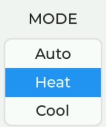  
图20.4.3.1滚轮部件实验

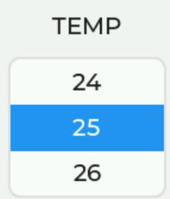

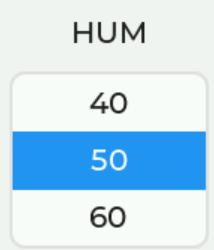

# 第二十一章 滑块部件(lv_slider)

滑块部件和进度条部件类似，它比进度条多了一个旋钮，该旋钮可以让用户手动设置当前值。值得注意的是，进度条部件的大部分属性设置逻辑在滑块部件中都适用，比如设置当前值、动画时间、范围值，等等。

本章节将分为以下几个小节：

21.1滑块部件的组成

21.2 滑块部件的相关知识  
21.3滑块部件的API函数  
21.4滑块部件的实验

# 21.1 滑块部件的组成

滑块部件由三个部分组成：主体背景、指示器和旋钮，示意图如下：

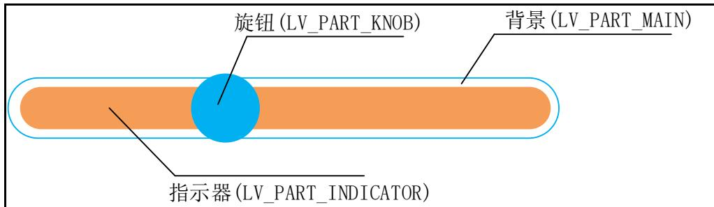  
图21.1.1滑块部件组成部分

关于部件样式设置的内容，请大家参考6.4.4章节。

# 21.2滑块部件的相关知识

# 21.2.1 设置滑块当前值和范围值

默认情况下，滑块部件被创建出来后，它的当前值是0，范围值是  $0\sim 100$  。如果用户需要设置当前值，可调用lv_slider_set_value函数；如果用户需要设置范围值，可以调用lv_slider_set_range函数。

接下来，我们以简单示例来理解当前值和范围值的设置，示例代码如下所示：

```c
void lv_mainstart(void)   
{ /\*创建slider部件\*/ lv_obj_t\*slider  $=$  lv_slider_create(lv_scr_act()); /\*设置slider部件范围值\*/ lv_slider_set_range(slider,0,255); /\*设置slider部件当前值\*/ lv_slider_set_value(slider,100，LV_ANIM_ON); /\*设置slider部件居中\*/ lv_obj_center(slider);   
}
```

在上述源码中，我们先调用lv_slider_create函数，创建滑块部件，然后调用lv_slider_set_range函数，设置滑块部件的范围值，最后调用lv_slider_set_value函数，设置滑块部件的当前值。示例代码可以在PC模拟器中运行，效果图如下所示：

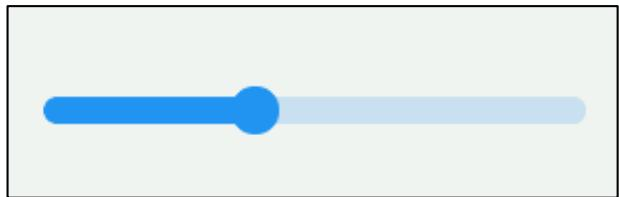  
图21.2.1.1设置当前值和范围值

# 21.2.2 设置滑块部件的模式

除了默认的模式之外，滑块部件还可以配置为以下两种拓展模式：

① LV_SLIDER_MODE_SYMMETRICAL：无论当前值是正数还是负数，指示器始终从零绘制到当前值。  
② LV_SLIDER_MODE_RANGE：允许调用lv_bar_set_start_value函数设置起始值，该起始值必须小于结束值。

用户需要设置滑块部件的模式，可调用以下函数：

```c
lv_slider_set_mode(slider, LV_SLIDER_MODE...)； /* 设置 slider 部件的模式*/
```

接下来，我们以简单示例来理解滑块模式的设置，示例代码如下所示：

```c
void lv_mainstart(void)   
{ /\*创建slider部件\*/ lv_obj_t\*slider  $=$  lv_slider_create(lv_scr_act()); /\*设置slider部件模式：始终从0开始绘制指示器\*/ lv_slider_set_mode slider, LV_SLIDER_MODE_SYNMMETRICAL); /\*设置slider部件数值范围\*/ lv_slider_set_range slider,-100,100); lv_obj_center(slider); /\*创建slider1部件\*/ lv_obj_t\*slider1  $\equiv$  lv_slider_create(lv_scr_act()); /\*创建slider1部件模式：允许指定起始值\*/ lv_slider_set_mode slider1,LV_SLIDER_MODE_RANGE); /\*创建slider1部件起始值\*/ lv_bar_set_start_value(slider1,0,LV_ANIM_OFF); /\*创建slider1部件数值范围\*/ lv_slider_set_range(slider1,-100,100); lv_obj_align_to(slider1,slider,LVALIGN_OUT BOTTOM_MID,0,30);   
}
```

在上述源码中，我们创建了两个滑块部件（slider 和 slider1），并将它们分别设置为 LV_SLIDER_MODE_SYNMMETRICAL 和 LV_SLIDER_MODE_RANGE 模式，除此之外，我们还将两个部件的数值范围为-100~100，slider1 部件的起始值设置为。示例代码可以在 PC 模拟器中运行，效果图如下所示：

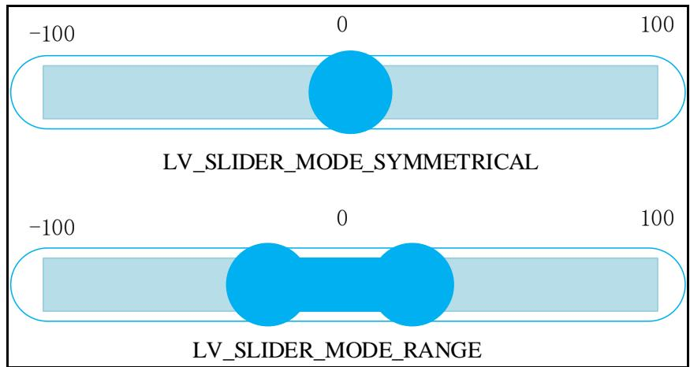  
图21.2.2.1设置不同模式的滑块部件

由上图可知，在LV_SLIDER_MODE_SYNMMETRICAL模式下，滑块始终是从0点开始绘制指示器；而在LV_SLIDER_MODE_RANGE模式下，滑块部件可以改变起始值，值得注意的是，起始值必须小于结束值（当前值）。

# 21.2.3 禁用单击

默认情况下，用户可以通过拖动旋钮或者单击滑块的方式来调整指示器位置，而后者可能会导致当前值的突变，这在某些情景下是不允许出现的。如果用户想禁用单击调整当前值，可调用以下函数：

```c
lv_obj_add_flag(slider, LV_OBJ_FLAG_ADV_HITTEST); /* 禁用单击调整当前值 */
```

# 21.3滑块部件的API函数

LVGL官方提供了一些与滑块部件相关API，如下表所示：

表 21.3.1.1 滑块部件相关的 API 函数  

<table><tr><td>函数</td><td>描述</td></tr><tr><td>lv_slider_create()</td><td>创建滑块部件</td></tr><tr><td>lv_slider_set_value()</td><td>设置当前值</td></tr><tr><td>lv_slider_set_left_value()</td><td>设置左侧旋钮的值</td></tr><tr><td>lv_slider_set_range()</td><td>设置范围值</td></tr><tr><td>lv_slider_set_mode()</td><td>设置模式</td></tr><tr><td>lv_slider_get_value()</td><td>获取当前值</td></tr><tr><td>lv_slider_get_left_value()</td><td>获取左侧旋钮的值</td></tr><tr><td>lv_slider_get_min_value()</td><td>获取最小值</td></tr><tr><td>lv_slider_get_max_value()</td><td>获取最大值</td></tr><tr><td>lv_slider_is_dragged()</td><td>判断滑块是否被拖动</td></tr><tr><td>lv_slider_get_mode()</td><td>获取滑块部件模式</td></tr></table>

接下来，我们介绍LVGL滑块部件常用的API函数：

# 1.lv_slider_create函数

创建滑块部件，该函数原型如下所示：

```txt
lv_obj_t * lv_slider_createLv_obj_t \* parent);
```

该函数的形参，如表21.3.1.2所示：

<table><tr><td>参数</td><td>描述</td></tr><tr><td>parent</td><td>指向父对象的指针</td></tr></table>

表 21.3.1.2 lv_slider_create 函数形参描述

返回值：滑块部件的指针。

# 2.lv_slider_set_value函数

设置滑块部件的当前值，该函数原型如下所示：

```c
static inline void lv_slider_set_value( lv_obj_t *obj, int32_t value, lv_anim_enable_t anim);
```

该函数的形参，如表21.3.1.3所示：

表 21.3.1.3 lv_slider_set_value 函数形参描述  

<table><tr><td>参数</td><td>描述</td></tr><tr><td>obj</td><td>指向滑块对象的指针</td></tr><tr><td>value</td><td>滑块当前值</td></tr><tr><td>anim</td><td>LV_ANIM_ON: 启用动画, LV_ANIM_OFF: 不启用动画</td></tr></table>

返回值：无。

# 3.lv_slider_set_range函数

设置滑块部件的范围值，该函数原型如下所示：

```c
static inline void lv_slider_set_range(lv_obj_t *obj, int32_t min, int32_t max);
```

该函数的形参，如表21.3.1.4所示：

表 21.3.4 lv_slider_set_range 函数形参描述  

<table><tr><td>参数</td><td>描述</td></tr><tr><td>obj</td><td>指向滑块对象的指针</td></tr><tr><td>min</td><td>最小值</td></tr><tr><td>max</td><td>最大值</td></tr></table>

返回值：无。

# 4.lv_slider_set_mode函数

设置滑块的模式，该函数原型如下所示：

```txt
static inline void lv_slider_set_mode(lv_obj_t *obj, lv_slider_mode_t mode);
```

该函数的形参，如表21.3.1.5所示：

表 21.3.1.5 lv_slider_set_mode 函数形参描述  

<table><tr><td>参数</td><td>描述</td></tr><tr><td>obj</td><td>指向滑块对象的指针</td></tr><tr><td>mode</td><td>滑块的模式</td></tr></table>

返回值：无。

# 21.4滑块部件的实验

# 21.4.1 硬件设计

# 1. 例程功能

本实验主要测试滑块部件 API 函数的使用，实验现象：开机后，屏幕上会显示一个滑块，用户可以通过滑块调节音量。与此同时，LED0 闪烁，提示系统正在运行。

该实验的完整源码，请参考《LVGL例程21lv_slider(滑块)》例程，路径：A盘  $\rightarrow 4$  ，程序源码  $\rightarrow 3$  ，扩展例程  $\rightarrow 4$  ，LVGL例程。

# 21.4.2 软件设计

# 21.4.2.1 程序流程图

本实验的程序流程图，如下图 21.4.2.1.1 所示：


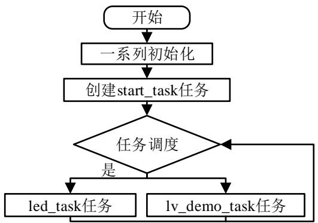

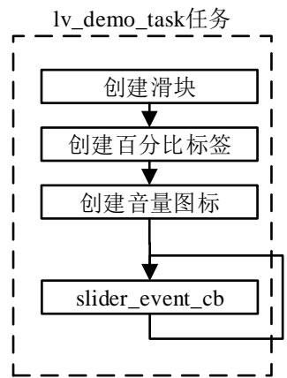  
图21.4.2.1.1滑块部件实验流程图

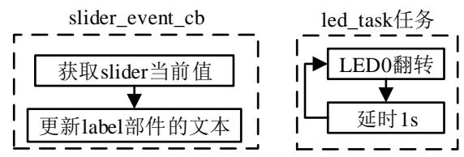

# 21.4.2.2 程序解析

关于LVGL的用户代码，我们都是在lv_mainstart.c文件中编写的，本实验的源码如下所示：

```c
/\*\*\*\*\*\*\*\*\*\*\*\*\*\*\*\*\*\*\*\*\*\*\*\*\*\*\*\*\*\*\*\*\*\*\*\*\*\*\*\*\*\*\*\*\*\*\*\*\*\*\*\*\*\*\*\*\*\*\*\*\*\*\*\*\*\*\*\*\*\*\*\*\*\*\*\*\*\*\*\*\*\*\*\*\*\*\*\*\*\*\*\*\*\*\*\*\*\*\*\*\*  
\*/  
\* @brief LVGL 演示  
\* @param 无  
\* @return 无  
\*/  
void lv_mainstart(void)  
{lv_example_slider();}  
\*/\*\*\*\*\*\*\*\*\*\*\*\*\*\*\*\*\*\*\*\*\*\*\*第一部分 结束 \(\star \star \star \star \star \star \star \star \star \star \star \star \star \star \star \star \star \star \star \star \star \star \star \star \star \star \star \star \star \star \star \star \star \star \star \star \star \star \star \star \star \star \star \star \star \star \star \star \star \star \star
```

```txt
/* */
* @brief 滑块事件回调
* @param *e: 事件相关参数的集合, 它包含了该事件的所有数据
* @return 无
*/
```

```javascript
/\*设置字体\*/lv_obj_set_style_text.Font(slider_label，font，LV_STATE_DEFAULT);/\*设置位置\*/lv_obj_align_to(slider_label，slider，LVALIGN_OUT_RIGHT_MID，20，0);/\*音量图标\*/lv_obj_t \*sound_label  $=$  lv_label_create(lv_scr_act();/\*创建音量标签\*//\*设置文本内容：音量图标\*/lv_label_set_text(sound_label，LV_SYMBOL_VOLUME_MAX);/\*设置字体\*/lv_obj_set_style_text.Font(sound_label，font，LV_STATE_DEFAULT);/\*设置位置\*/lv_obj_align_to(sound_label，slider，LVALIGN_OUT_LEFT_MID，-20，0）;1/****** 第二部分结束\*\*\*\*\*\*\*\*\*\*\*\*\*\*\*\*\*\*\*\*\*\*\*\*\*\*\*\*\*\*\*\*\*\*\*\*\*\*\*\*\*\*\*\*\*\*\*\*\*\*\*\*\*\*\*\*\*\*\*\*\*\*\*\*\*\*\*\*\*\*\*\*\*\*\*\*\*\*\*\*\*\*\*\*\*\*\*\*\*\*\*\*\*\*\*\*\*\*\*\*\*
```

上述源码可分为以下两个部分：

① lv_mainstart 接口函数。在该函数中，我们调用了滑块部件相关的示例函数；  
② 音量调节的实现。我们先根据活动屏幕的宽度来选择字体大小，然后创建滑块、百分比标签和音量图标，并为滑块添加事件回调。当滑块的值发生变化时，会触发事件回调，在回调函数中，我们获取滑块的当前值，并将该值更新到百分比标签中。

# 21.4.3 下载验证

把工程编译并下载到我们的开发板中，运行效果如图 21.4.3.1 所示：

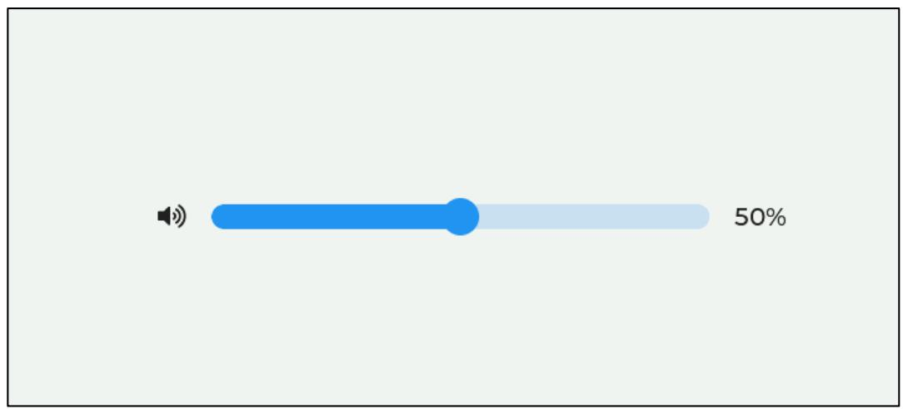  
图21.4.3.1滑块部件实验

# 第二十二章 开关部件(lv_SWITCH)

在GUI界面中，我们经常用到开关部件，它就相当于一个当前值只有0和1的滑块部件。

本章节将分为以下几个小节：

22.1 开关部件的组成  
22.2 开关部件的相关知识  
22.3 开关部件的 API 函数  
22.4开关部件的实验

# 22.1 开关部件的组成

开关部件由三个部分组成：主体背景、指示器和旋钮，示意图如下：

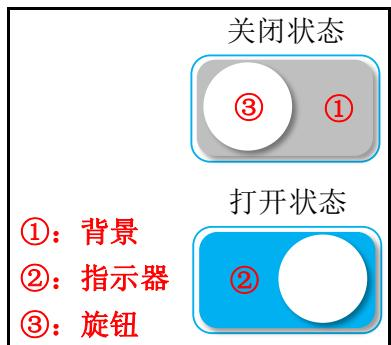  
图22.1.1开关部件组成部分

各组成部分的相关枚举如下所示：

① 主体背景 LV_PART_MAIN;  
② 指示器LV_PART_INDICATOR；  
③ 旋钮 LV_PART_KNOB。

关于部件样式设置的内容，请大家参考6.4.4章节。

# 22.2 开关部件的相关知识

# 22.2.1 获取开关部件状态

用户可调用lv_obj_has_state函数获取开关的当前状态，示例如下：

```c
lv_obj_has_state(switch1, LV_STATE_CHECKED); /*返回true：开启状态*/
```

在上述函数中，我们判断开关是否为开启状态，如果已经开启，则返回 rtue，否则返回 false；

# 22.2.2 设置开关部件的状态

在默认情况下，开关创建出来之后，其是关闭的状态，如果用户需要添加开关的状态，可调用以下函数（用于打开开关）：

```txt
lv_obj_add_state(switch1, LV_STATE_CHECKED);
```

在上述函数中，我们将开关设置为开启的状态。

如果用户想清除开关的状态，可调用以下函数（用于关闭开关）：

```javascript
lv_obj_clear_state(switch1, LV_STATE_CHECKED);
```

注意：当开关状态发生变化时，其触发的事件类型是 LV_EVENT_VALUE_CHANGED。

# 22.3 开关部件的 API 函数

# lv_SWITCH_create 函数

创建开关部件，该函数原型如下所示：

```txt
lv_obj_t * lv_SWITCH_createLv_obj_t \* parent);
```

该函数的形参，如表22.3.2所示：

表 22.3.2 lv_SWITCH_create 函数形参描述  

<table><tr><td>参数</td><td>描述</td></tr><tr><td>parent</td><td>指向父对象的指针</td></tr></table>

返回值：指向开关部件的指针。

# 22.4开关部件的实验

# 22.4.1 硬件设计

# 1. 例程功能

本实验主要测试开关部件 API 函数的使用，实验现象：开机后，屏幕上显示三个不同功能的开关和一个主标题（Control Center），三个开关（从左到右顺序）控制的模式分别是制冷（cool）、制暖（heat）和干燥（dry），制冷和制暖模式互斥，不可同时开启。与此同时，LED0 闪烁，提示系统正在运行。

该实验的完整源码，请参考《LVGL例程22lv_SWITCH(开关)》例程，路径：A盘  $\rightarrow 4$  ，程序源码  $\rightarrow 3$  ，扩展例程  $\rightarrow 4$  ，LVGL例程。

# 22.4.2 软件设计

# 22.4.2.1 程序流程图

本实验的程序流程图，如下图22.4.2.1.1所示：

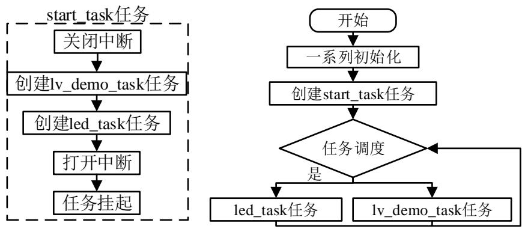

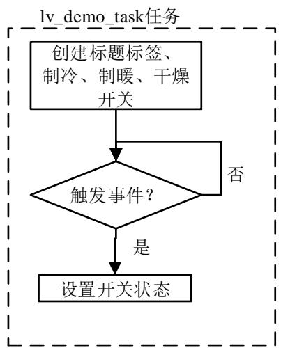  
图22.4.2.1.1开关部件实验流程图

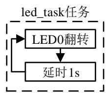

# 22.4.2.2 程序解析

关于LVGL的用户代码，我们都是在lv_mainstart.c文件中编写的，本实验的源码如下所示：

```txt
/\*\*\*\*\*\*\*\*\*\*\*\*\*\*\*\*\*\*\*\*\*\*\*\*\*\*\*\*\*\*\*\*\*\*\*\*\*\*\*\*\*\*\*\*\*\*\*\*\*\*\*\*\*\*\*\*\*\*\*\*\*\*\*\*\*\*\*\*\*\*\*\*\*\*\*\*\*\*\*\*\*\*\*\*\*\*\*\*\*\*\*\*\*\*\*\*\*\*\*\*\* 第一部分 开始  $\text{串}$ $\text{串}$ $\text{串}$ $\text{串}$ $\text{串}$ $\text{串}$ $\text{串}$ $\text{串}$ $\text{串}$ $\text{串}$ $\text{串}$ $\text{串}$ $\text{串}$ $\text{串}$ $\text{串}$ ${}^{*}=$
```

```c
/**
* @brief 回调事件
* @param *e：事件相关参数的集合，它包含了该事件的所有数据
* @return 无
*/
static void switch_event_cb(lv_event_t *e)
{
    lv_obj_t *target = lv_event_get_target(e); /* 获取触发源 */
    if(target == switch_cool) /* 制冷开关触发 */
        {
            if(lv_obj_has_state(switch_cool, LV_STATE_CHECKED)) /* 判断开关状态 */
            {
                /* 制冷模式已打开，关闭制暖模式 */
                lv_obj_clear_state(switch_heat, LV_STATE_CHECKED);
            }
        }
    else if(target == switch_heat) /* 制暖开关触发 */
        {
            if(lv_obj_has_state(switch_heat, LV_STATE_CHECKED)) /* 判断开关状态 */
            {
                /* 制暖模式已打开，关闭制冷模式 */
                lv_obj_clear_state(switch_cool, LV_STATE_CHECKED);
            }
        }
}
*/
** 
* @brief 功能文本标签
* @param 无
* @return 无
*/
static void lv_example_label(void)
{
    /* 根据活动屏幕宽度选择字体 */
    if (scr_act_width() <= 320)
        {
            font = &lv.Font_montserrat_10;
        }
    else if (scr_act_width() <= 480)
        {
            font = &lv.Font_montserrat_14;
```

```javascript
}   
else   
{ font  $=$  &lv.Font_montserrat_20; } lv_obj_t \*label  $=$  lv_label_create(lv_scr_act()); /\*创建标签\*/ lv_label_set_text.label, "Control Center"); /\*设置文本内容\*/ lv_obj_set_style_text.Font (label,font,LV_STATE_DEFAULT);/\*设置字体\*/ /\*设置位置\*/ lv_obj_align (label,LV ALIGNCENTER,0,-scr act height() / 3);   
}   
/\*\* \* @brief 制冷功能开关 \* @param 无 \* @return 无 \*/   
static void lv_example_SWITCH1(void)   
{ /\* 制冷模式基础对象（矩形背景）\*/ lv_obj_t \*obj_cool  $=$  lv_obj_createLv_scr_act(); /\*创建基础对象\*/ /\*设置大小\*/ lv_obj_set_size(obj_cool,scract_height() / 3,scract_height() / 3); /\*设置位置\*/ lv_obj_align(obj_cool,LV ALIGNCENTER,-scract_width() /4，0）; /\*制冷模式开关标签\*/ lv_obj_t \*label_cool  $=$  lv_label_create(obj_cool); /\*创建标签\*/ lv_label_set_text.label,cool,"Cool"); /\*设置文本内容\*/ /\*设置字体\*/ lv_obj_set_style_text_font (label_cool,font,LV_STATE_DEFAULT); /\*设置位置\*/ lv_obj_align (label_cool,LV ALIGNCENTER,0,-scract_height() / 16); /\*制冷模式开关\*/ switch_cool  $=$  lv_SWITCH_create(obj_cool); /\*创建开关\*/ /\*设置大小\*/ lv_obj_set_size(switch_cool,scract_height() /6,scract_height() /12); /\*设置位置\*/ lv_obj_align(switch_cool,LV ALIGNCENTER,0,scract_height() /16); lv_obj_add_event_cb(switch_cool,switch_event_cb, LV_EVENT_VALUE_CHANGEDED，NULL); /\*添加事件\*/
```

```c
/* 
* @brief 制暖功能开关
* @param 无
* @return 无
*/ 
static void lv_example_SWITCH2(void) 
{
    /* 制暖模式基础对象（矩形背景） */
lv_obj_t *obj_heat = lv_obj_create lv_scr_act();
lv_obj_set_size(obj_heat, scr_ACT_height() / 3, scr_ACT_height() / 3);
lv_obj_align(obj_heat, LVALIGN_CENTER, 0, 0);
/* 制暖模式开关标签 */
lv_obj_t *label_heat = lv_label_create(obj_heat);
lv_label_set_text.label_text, "Heat");
lv_obj_set_style_text.Font(obj_heat, font, LV_STATE_DEFAULT);
lv_obj_align(obj_heat, LVALIGN_CENTER, 0, -scr_ACT_height() / 16);
/* 制暖模式开关 */
switch_heat = lv_SWITCH_create(obj_heat);
lv_obj_set_size(switch_heat, scr_ACT_height() / 6, scr_ACT_height() / 12);
lv_obj_align(switch_heat, LVALIGN_CENTER, 0, scr_ACT_height() / 16);
lv_obj_add_event_cb(switch_heat, switch_event_cb, LV_EVENT_VALUE_CHANGEDED, NULL);
}
/* 
* @brief 干燥功能开关
* @param 无
* @return 无
*/
static void lv_example_SWITCH3(void)
{
    /* 干燥模式基础对象（矩形背景） */
lv_obj_t *obj_dry = lv_obj_create lv_scr_act();
lv_obj_set_size(obj_dry, scr_ACT_height() / 3, scr_ACT_height() / 3);
lv_obj_align(obj_dry, LVALIGN_CENTER, scr_ACT_width() / 4, 0);
/* 干燥模式开关标签 */
lv_obj_t *label_dry = lv_label_create(obj_dry);
lv_label_set_text label_dry, "Dry");
lv_obj_set_style_text.Font(obj_dry, font, LV_STATE_DEFAULT);
```

```c
lv_obj_align.label_dry，LV AlignCENTER，0，-scr_act_height() / 16）；  
\*/干燥模式开关\*/  
switch_dry  $=$  lv_SWITCH_create(obj_dry);  
lv_obj_set_size(switch_dry,scr_act_height() / 6，scr_act_height() / 12）;  
lv_obj_align(switch_dry，LV AlignCENTER，0，scr_act_height() / 16）;  
lv_obj_add_state(switch_dry，LV_STATE_CHECKED|LV_STATE DISABLED);  
********** 第二部分 结束 \*\*\*\*\*\*\*\*\*\*\*\*\*\*\*\*\*\*\*\*\*\*\*\*\*\*\*\*\*\*\*\*\*\*\*\*\*\*\*\*\*\*\*\*\*\*\*\*\*\*\*\*\*\*\*\*\*\*\*\*\*\*\*\*\*\*\*\*\*\*\*\*\*\*\*\*\*\*\*\*\*\*\*\*
```

上述源码可分为以下两个部分：

① lv_mainstart 接口函数。在该函数中，我们调用了标签部件和开关部件相关的示例函数；② 开关功能的实现。我们先根据活动屏幕的宽度来选择字体大小，然后分别创建标题标签、制冷、制暖和干燥开关，并为制冷、制暖开关添加事件回调。当制冷、制暖开关的状态发生变化时，将会触发事件回调，在回调函数中，我们获取触发源，如果是制冷开关打开，则将制暖开关关闭；如果是制暖开关打开，则将制冷开关关闭。注意：干燥开关默认开启且状态不可修改。

# 22.4.3 下载验证

把工程编译并下载到我们的开发板中，运行效果如图22.4.3.1所示：

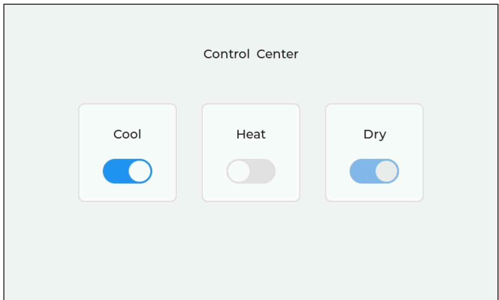  
图22.4.3.1开关部件实验

# 第二十三章 表格部件(Iv_table)

在LVGL中，表格部件是由一个个单元格组成的，该部件经过了专门的优化，它非常轻量化。较为遗憾的是：表格部件的单元格中只能存放文本形式的内容，不支持存放其他任何类型的对象或者部件。

本章节将分为以下几个小节：

23.1 表格部件的组成  
22.2 表格部件的相关知识  
22.3 表格部件的 API 函数  
22.4 表格部件的实验

# 23.1 表格部件的组成

表格部件由两个部分组成：主体背景LV_PART_MAIN和单元格LV_PART_items，关于部件样式设置的内容，请大家参考6.4.4章节。

# 23.2 表格部件的相关知识

# 23.2.1 设置单元格的值

在默认的情况下，用户创建出表格部件，该表格中并没有任何的内容，如果我们想在某个单元格中添加文本，则可调用lv_table_set_cell_value函数。

接下来，我们以简单示例来理解单元格值的设置，示例代码如下所示：

```c
void lv_mainstart(void)   
{ /\*创建表格部件\*/ lv_obj_t\*table  $\equiv$  lv_table_create(lv_scr_ACT()); /\*设置表格部件的单元格文本（第0行，第0列）\*/ lv_table_set_cell_value(table,0,0，"123"); lv_obj_center(table);   
}
```

在上述源码中，我们先调用lv_table_create函数创建表格部件，然后调用lv_table_set_cell_value函数，设置指定单元格的文本：123，值得注意的是，该函数的第二、三个形参分别代表行和列（从0开始）。示例代码可以在PC模拟器中运行，效果图如下所示：

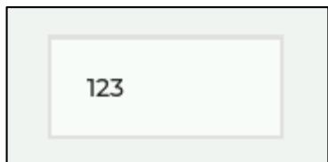  
图23.2.1.1设置单元格文本

# 23.2.2 行和列的设置

在默认的情况下，用户创建出表格部件，该部件只拥有一个单元格，如果我们需要设置单元格的行数和列数，可调用lv_table_set_row_cnt和lv_table_set_col_cnt函数。

接下来，我们以简单示例来理解单元格的行、列设置，示例代码如下所示：

```c
void lv_mainstart(void)   
{ /\*创建table部件\*/ lv_obj_t\* table  $\equiv$  lv_table_create(lv_scr_act()); /\*设置table部件的单元格文本\*/ lv_table_set_cell_value(table,0，0，"123"); /\*设置行数\*/ lv_table_set_row_cnt(table,2); /\*设置列数\*/ lv_table_set_col_cnt(table,2); lv_obj_center(table);   
}
```

在上述源码中，我们调用lv_table_set_row_cnt和lv_table_set_col_cnt函数，分别设置表格部件的行数（2行）和列数（2列），示例代码可以在PC模拟器中运行，效果图如下所示：

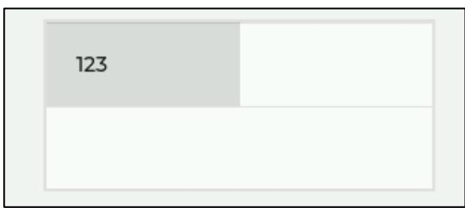  
图23.2.2.1设置表格部件的行列数

由上图可知，文本“123”所在的行和列分别为0、0。接下来，我们以一个示意图来理解表格部件的行列分布，如下图所示：

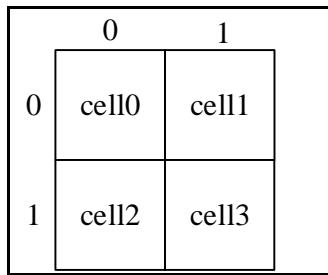  
图23.2.2表格部件的行列分布

由上图可知：行和列的编号都是从0开始的，假设我们需要设置cell3的文本，其对应的行和列分别为1、1。

# 23.2.3宽度和高度的设置

在表格部件中，用户可通过lv_table_set_col_width函数设置某一列的宽度，而单元格的高度则根据单元格样式（字体、填充等）和行数自动计算出来的。

# 23.2.4 合并单元格

合并单元格是指将指定的连续单元区域合并为1个单元格，示意图如下所示：

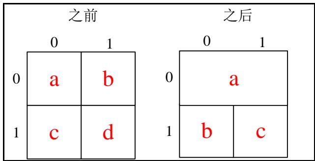  
图23.2.4.1 table部件单元格合并示意图

由上图可知：如果a和b的单元格发生合并，合并之后的单元格归a单元格所有，而b单元格将被删除。注意：在表格部件中，某一个单元格只能和右边的单元格进行合并，不能垂直合并单元格。用户需要合并单元格，可调用lv_table_add_cell_ctrl函数。

# 23.3 表格部件的 API 函数

LVGL官方提供了一些与表格部件相关API，如下表所示：

表 23.3.1.1 表格部件相关的 API 函数  

<table><tr><td>函数</td><td>描述</td></tr><tr><td>lv_table_create()</td><td>创建表格对象</td></tr><tr><td>lv_table_set_cell_value()</td><td>设置单元格的值</td></tr><tr><td>lv_table_set_cell_value fmt()</td><td>设置单元格的值（格式化输入）</td></tr><tr><td>lv_table_set_row_cnt()</td><td>设置行数</td></tr><tr><td>lv_table_set_col_cnt()</td><td>设置列数</td></tr><tr><td>lv_table_set_col_width()</td><td>设置列的宽度</td></tr><tr><td>lv_table_add_cell_ctrl()</td><td>向单元格添加控制位</td></tr><tr><td>lv_table_clear_cell_ctrl()</td><td>清除单元格的控制位</td></tr><tr><td>lv_table_get_cell_value()</td><td>获取单元格的值</td></tr><tr><td>lv_table_get_row_cnt()</td><td>获取行数</td></tr><tr><td>lv_table_get_col_cnt()</td><td>获取列数</td></tr><tr><td>lv_table_get_col_width()</td><td>获取列的宽度</td></tr><tr><td>lv_table_has_cell_ctrl()</td><td>判断单元格是否具有控制位</td></tr><tr><td>lv_table_get_selected_cell()</td><td>获得选定的单元格</td></tr></table>

接下来，我们介绍LVGL表格部件常用的API函数：

# 1.lv_table_create函数

创建表格部件，该函数原型如下所示：

```txt
lv_obj_t * lv_table_create lv_obj_t * parent);
```

该函数的形参，如下表所示：

表 23.3.2 lv_table_create 函数形参描述  

<table><tr><td>参数</td><td>描述</td></tr><tr><td>parent</td><td>指向父对象的指针</td></tr></table>

返回值：指向表格部件的指针。

# 2.lv_table_set_cell_value函数

设置单元格的值，该函数原型如下所示：

```c
void lv_table_set_cell_value( lv_obj_t *obj, uint16_t row, uint16_t col, const char *txt);
```

该函数的形参，如下表所示：

表 23.3.3 lv_table_set_cell_value 函数形参描述  

<table><tr><td>参数</td><td>描述</td></tr><tr><td>obj</td><td>指向表格对象的指针</td></tr><tr><td>row</td><td>行ID</td></tr><tr><td>col</td><td>列ID</td></tr><tr><td>txt</td><td>要显示在单元格中的文本</td></tr></table>

返回值：无。

# 3.lv_table_set_cell_value fmt函数

设置单元格的值（格式化输入），该函数原型如下所示：

```c
void lv_table_set_cell_value fmt(lv_obj_t *obj, uint16_t row, uint16_t col, const char *fmt, ...);
```

该函数的形参，如下表所示：

表 23.3.4 lv_table_set_cell_value fmt 函数形参描述  

<table><tr><td>参数</td><td>描述</td></tr><tr><td>obj</td><td>指向表格对象的指针</td></tr><tr><td>row</td><td>行ID</td></tr><tr><td>col</td><td>列ID</td></tr><tr><td>fmt</td><td>类似printf格式</td></tr></table>

返回值：无。

# 4.lv_table_set_row_cnt函数

设置行数，该函数原型如下所示：

```c
void lv_table_set_row_cntLv_obj_t \*obj, uint16_t row_cnt);
```

该函数的形参，如下表所示：

表 23.3.5 lv_table_set_row_cnt 函数形参描述  

<table><tr><td>参数</td><td>描述</td></tr><tr><td>obj</td><td>指向表格对象的指针</td></tr><tr><td>row_cnt</td><td>行数</td></tr></table>

返回值：无。

# 5.lv_table_set_col_cnt函数

设置列数，该函数原型如下所示：

```c
void lv_table_set_col_cnt(lv_obj_t *obj, uint16_t row_cnt);
```

该函数的形参，如下表所示：

表 23.3.6 lv_table_set_col_cnt 函数形参描述  

<table><tr><td>参数</td><td>描述</td></tr><tr><td>obj</td><td>指向表格对象的指针</td></tr><tr><td>row_cnt</td><td>列数</td></tr></table>

返回值：无。

# 6.lv_table_set_col_width函数

设置列的宽度，该函数原型如下所示：

```c
void lv_table_set_col_width(lv_obj_t *obj, uint16_t col_id, lv Coordinate_t w);
```

该函数的形参，如下表所示：

表 23.3.7 lv_table_set_col_width 函数形参描述  

<table><tr><td>参数</td><td>描述</td></tr><tr><td>obj</td><td>指向表格对象的指针</td></tr><tr><td>col_id</td><td>列的ID</td></tr><tr><td>w</td><td>宽度</td></tr></table>

返回值：无。

# 23.4表格部件的实验

# 23.4.1 硬件设计

# 1. 例程功能

本实验主要测试表格部件 API 函数的使用，实验现象：开机后，屏幕上显示一个标题和表格。与此同时，LED0 闪烁，提示系统正在运行。

该实验的完整源码，请参考《LVGL例程23lv_table(表格)》例程，路径：A盘  $\rightarrow 4$  ，程序源码  $\rightarrow 3$  ，扩展例程  $\rightarrow 4$  ，LVGL例程。

# 23.4.2 软件设计

# 23.4.2.1 程序流程图

本实验的程序流程图，如下图所示：

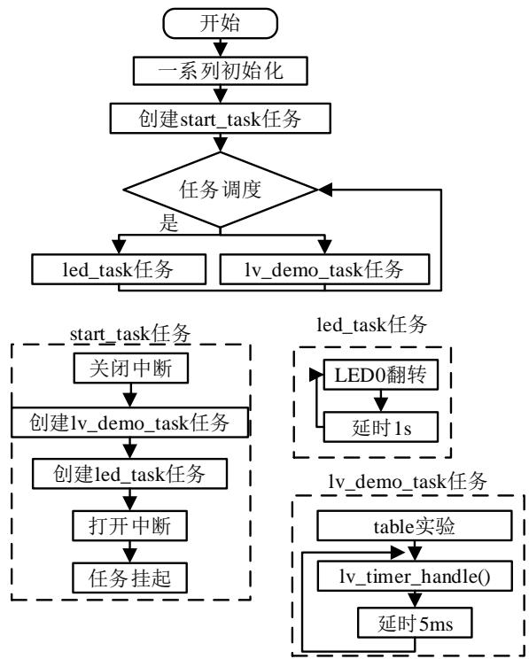  
图23.4.2.1.1表格部件实验流程图

# 23.4.2.2 程序解析

关于LVGL的用户代码，我们都是在lv_mainstart.c文件中编写的，本实验的源码如下所示：

```c
/**
* @brief LVGL 演示
* @param 无
* @return 无
*/
void lv_mainstart(void)
{
    lv_example_table();
}
/**
* @brief 表格实例
* @param 无
* @return 无
*/
static void lv_example_table(void)
{
    /* 标题 */
lv_obj_t *label_title = lv_label_create(lv_scr_act());
        /* 创建标题 */
lv_obj_align.label_title, LVALIGN_TOP_MID, 0, scr actu_height(/8);
lv_obj_set_style_text.Font.label_title, &lvFont_montserrat_20,
            LV_STATE_DEFAULT);
lv_label_set_text.label_title, "Today's prices");
/* 设置字体 */
lv_label_set_text(table_title, "Today's prices");
/* 设置文本内容 */
*/
lv_obj_t *table = lv_table_create(lv_scr_act());
lv_obj_set_height(table, scr actu_height(/2));
lv_obj_center(table);
/* 设置第1列单元格内容（名称） */
lv_table_set_cell_value(table, 0, 0, "Name");
lv_table_set_cell_value(table, 1, 0, "Apple");
lv_table_set_cell_value(table, 2, 0, "Banana");
lv_table_set_cell_value(table, 3, 0, "Lemon");
lv_table_set_cell_value(table, 4, 0, "Grape");
lv_table_set_cell_value(table, 5, 0, "Melon");
lv_table_set_cell_value(table, 6, 0, "Peach");
```

```c
lv_table_set_cell_value(table, 7, 0, "Nuts");  
/* 设置第2列单元格内容（价格）*/  
lv_table_set_cell_value(table, 0, 1, "Price");  
lv_table_set_cell_value(table, 1, 1, "$7");  
lv_table_set_cell_value(table, 2, 1, "$4");  
lv_table_set_cell_value(table, 3, 1, "$6");  
lv_table_set_cell_value(table, 4, 1, "$2");  
lv_table_set_cell_value(table, 5, 1, "$5");  
lv_table_set_cell_value(table, 6, 1, "$1");  
lv_table_set_cell_value(table, 7, 1, "$9");  
/* 单元格宽度 */  
lv_table_set_col_width(table, 0, scr_act_width()/3);  
lv_table_set_col_width(table, 1, scr_act_width()/3);  
}
```

上述源码可分为以下两个部分：

① lv_mainstart 接口函数。在该函数中，我们调用了表格部件相关的示例函数；  
② 价格表的实现。我们先创建标题标签并设置其内容，然后创建表格并添加两行单元格的内容，最后再设置单元格的宽度。

# 23.4.3 下载验证

把工程编译并下载到我们的开发板中，运行效果如下图所示：

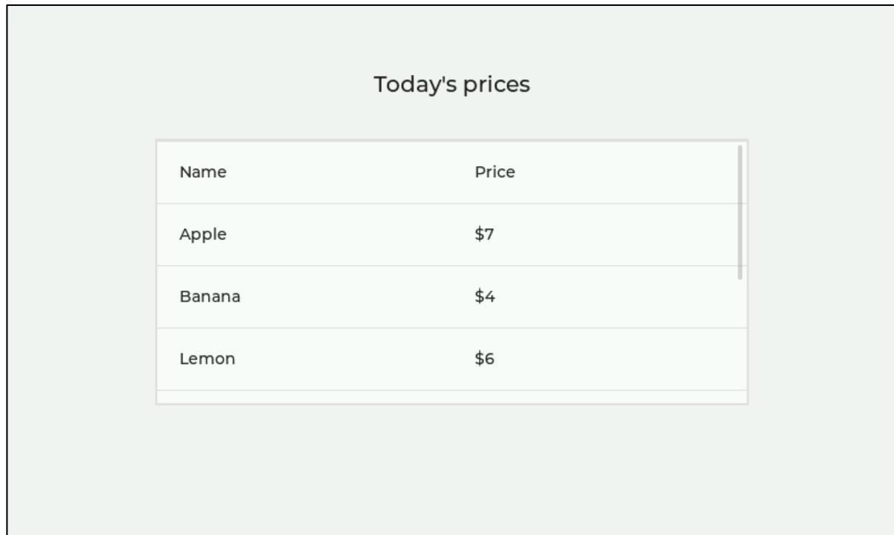  
图23.4.3.1 表格部件实验

# 第二十四章 文本区域部件 lv_textarea

文本域部件就是我们常用的文本输入框，用户可以在其中输入所需文本。

本章节将分为以下几个小节：

24.1 文本区域部件的组成  
24.2 文本区域部件的相关知识  
24.3 文本区域部件的 API 函数  
24.4 文本区域部件的实验

# 24.1 文本区域部件的组成

文本区域部件由五个部分组成：

① 主体 LV_PART_MAIN: 可设置背景属性以及文本样式属性;  
② 滚动条LV_PART_SCROLLBAR：可设置滚动条样式属性；  
③ 所选文本LV_PART_SELECTD：可设置所选文本的样式；  
④ 光标 LV_PART CURSOR: 设置光标的位置、闪烁时间和样式属性;  
⑤ 占位符 LV_PART_TEXTAREA_placeHOLDER：可设置占位符（提示文本）的样式。

关于部件样式设置的内容，请大家参考6.4.4章节。

# 24.2 文本区域部件的相关知识

# 24.2.1 创建文本区域部件

在LVGL中，用户需要创建文本区域部件，可调用以下函数：

```c
lv_obj_t *lv_textarea_create lv_obj_t *parent);
```

上述函数只有一个形参，该形参指向文本区域部件的父类。

# 24.2.2 添加与删除字符

文本区域部件就是一个文本输入框，用户可以在该部件的文本区域中输入字符和删除字符，下面我们分别介绍添加字符和删除字符的知识，如下所示：

# 1. 添加字符和文本

用户需要在文本区域中添加一个字符或者一段字符串，可分别调用lv_textarea_add_char和lv_textarea_add_text函数。

接下来，我们以简单示例来理解字符和文本的添加，示例代码如下所示：

```c
void lv_mainstart(void)  
{lv_obj_t* texture area = lv_textarea_create lv_scr_act(); /* 定义并创建文本框 */lv_textarea_add_char(textarea, 'c'); /* 添加一个字符 */lv_textarea_add_text(textarea, "insert this text"); /* 添加一个字符串 */lv_obj_center(textarea); /* 中间对齐 */}
```

在上述源码中，我们创建先文本区域部件，调用lv_textarea_add_char函数在文本区域添加“c”字符，然后调用lv_textarea_add_text函数在文本区域中添加字符串“insert this text”，最后把文本区域部件居中对齐。示例代码可以在PC模拟器中运行，效果图如下所示：

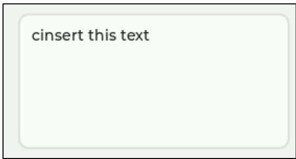  
图24.2.2.1添加字符和字符串

# 2. 删除字符

在LVGL中，文本区域部件删除字符的方法有两种，如下所示：

(1) 调用 lv_textarea_del_char 函数, 从光标位置的左侧删除一个字符;  
② 调用lv_textarea_del_char_forward函数，从光标位置的右侧删除一个字符。

# 24.2.3 占位符文本

占位符（Placeholder）即默认显示的文本，常用于对用户进行默认的提示、说明或引导。在LVGL中，用户可调用lv_textarea_set_placeholder_text函数设置占位符。

接下来，我们以简单示例来理解占位符文本的设置，示例代码如下所示：

```c
void lv_mainstart(void)   
{ lv_obj_t\* textarea  $=$  lv_textarea_create(lv_scr_act();/\*定义并创建文本框\*/ /\*设置占位符\*/ lv_textarea_set_placeholder_text(textarea，"Please enter text....."); lv_obj_center(textarea);   
}
```

在上述源码中，我们先创建文本区域部件，然后设置占位符提示文本为“Please enter text……”。示例代码可以在PC模拟器中运行，效果图如下所示：

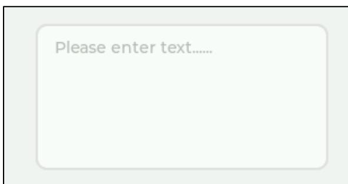  
图24.2.3.1设置占位符

从上图可知：占位符就是对用户进行提示和引导。

# 24.2.4移动光标

在LVGL中，文本区域的光标默认在左上角的位置。当我们添加一个字符时，该光标从左往右移动，默认情况下，光标会一直在文本最后一个字符的右侧。如果用户需要设置光标的位置，可调用lv_textarea_set_cursor_pos函数，该函数的第二个形参表示光标的移动位置，当该形参设置为0，则光标在第一个字符之前；当该形参设置为LV_TA CURSOR LAST，则光标在最后一个字符之后。

如果用户不想使用上述的方式设置光标的位置，可使用以下函数，单步移动光标：

表 24.2.4.1 光标移动相关函数  

<table><tr><td>函数</td><td>描述</td></tr><tr><td>lv_textarea_cursor_right()</td><td>光标往右移动</td></tr><tr><td>lv_textarea_cursor_left()</td><td>光标往左移动</td></tr><tr><td>lv_textarea_cursor_up()</td><td>光标往上移动</td></tr><tr><td>lv_textarea_cursor_down()</td><td>光标往下移动</td></tr></table>

上述的光标移动函数常用于按键手动控制光标，当用户按下某个按键时，光标将会向指定的方向移动。

# 24.2.5 文本区域部件的特殊模式

在LVGL中，文本区域部件的特殊模式有两个，如下所示：

① 单行模式：默认情况下，文本区域的文本超出它的宽度时，该文本将自动换行。如果将文本区域部件设置为单行模式，当它的文本超出其宽度后，文本并不会自动换行，超出的文本将水平滚动显示。单行模式可通过lv_textarea_set_one_line函数进行设置。  
② 密码模式：为了保证文本的机密性，LVGL 的文本区域部件为用户提供了密码模式，当用户输入文本之后，这些文本内容将以“*”字符替代。用户需要设置密码模式，可调用 lv_textarea_set_password_mode 函数。

注意：当用户使用密码模式时，原始文本会先显示一段时间，然后隐藏，该显示时间可以在 lv_conf.h 文件的 LV_TEXTAREADEF_PWD/show_TIME 宏定义中设置。

如果用户想获取密码框的文本内容，可调用lv_textarea_get_text函数，返回的文本并不是“*”字符，而是原始的文本内容。

# 24.2.6 限制输入的字符

文本区域部件可以限制输入字符的范围，例如取款机的密码框，它只允许输入0~9的字符，且密码长度固定为6。LVGL文本区域部件限制输入字符的内容有两个：限制字符类型和限制字符长度。

① 限制字符类型，比如ATM的密码框，它只能输入数字0~9。用户需要限制字符类型，可以调用lv_textarea_set.accepted chars函数进行设置。  
② 限制字符长度，比如ATM的密码框，它只能输入6位密码。用户需要限制字符长度，可以调用lv_textarea_set_max_length函数进行设置。

接下来，我们以简单示例来理解字符输入的限制，示例代码如下所示：

```c
void lv_mainstart(void)   
{ /\*定义并创建文本框\*/ lv_obj_t\*textarea  $=$  lv_textarea_create(lv_scr_act()); /\*设置输入字符长度为6\*/
```

```javascript
lv_textarea_set_max_length(textarea,6);  
/*设置接收输入字符列表*/  
lv_textarea_set.accepted chars(textarea,"0123456789");  
/*一行模式*/  
lv_textarea_set_one_line(textarea，true);  
/*中间对齐*/  
lv_obj_center(textarea);  
/*输入的字符*/  
lv_textarea_add_char(textarea,'C');  
lv_textarea_add_char(textarea,'a');  
lv_textarea_add_char(textarea,'i');  
lv_textarea_add_char(textarea,'X');  
lv_textarea_add_char(textarea,'e');  
lv_textarea_add_char(textarea,'u');  
lv_textarea_add_char(textarea,'e');  
lv_textarea_add_char(textarea,'F');  
lv_textarea_add_char(textarea,'e');  
lv_textarea_add_char(textarea,'n');  
lv_textarea_add_char(textarea,'g');  
lv_textarea_add_char(textarea,'1');  
lv_textarea_add_char(textarea,'6');  
lv_textarea_add_char(textarea,'8');  
lv_textarea_add_char(textarea,'6');  
lv_textarea_add_char(textarea,'6');
```

}

在上述源码中，我们调用lv_textarea_set_max_length函数，限制输入字符长度为6，然后调用lv_textarea_set.accepted chars函数，限制输入字符类型范围为“0123456789”，最后调用多个lv_textarea_add_char函数添加文本，该文本为“CaiXueFeng168666”。上示例代码可以在PC模拟器中运行，效果图如下所示：

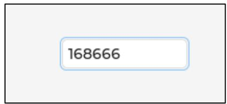  
图24.2.6.1限制字符输入

由上图可知，文本区域部件最终显示的文本是“168666”，而我们输入的所有文本为“CaiXueFeng168666”，这说明我们设置的字符类型和长度限制生效了。

# 24.3 文本区域部件的 API 函数

LVGL官方提供了一些与文本区域部件相关API，如下表所示：

<table><tr><td>函数</td><td>描述</td></tr><tr><td>lv_textarea_create()</td><td>创建文本区域对象</td></tr></table>

表 24.3.1.1 文本区域部件相关的 API 函数  

<table><tr><td>lv_textarea_add_char()</td><td>插入一个字符到当前光标位置</td></tr><tr><td>lv_textarea_add_text()</td><td>将文本插入到当前光标位置</td></tr><tr><td>lv_textarea_del_char()</td><td>删除当前光标左侧的字符</td></tr><tr><td>lv_textarea_del_char.forward()</td><td>删除当前光标右侧的字符</td></tr><tr><td>lv_textarea_set_text()</td><td>设置文本</td></tr><tr><td>lv_textarea_set_placeholder_text()</td><td>设置占位符文本</td></tr><tr><td>lv_textarea_set_cursor_pos()</td><td>设置光标位置</td></tr><tr><td>lv_textarea_set_cursor.click_pos()</td><td>启用/禁用光标的位置</td></tr><tr><td>lv_textarea_set_password_mode()</td><td>设置密码模式</td></tr><tr><td>lv_textarea_set_one_line()</td><td>设置单行模式</td></tr><tr><td>lv_textarea_set_accepted chars()</td><td>限制输入字符的类型</td></tr><tr><td>lv_textarea_set_max_length()</td><td>限制输入字符的长度</td></tr><tr><td>lv_textarea_set_insert_replace()</td><td>文本区域添加自动格式</td></tr><tr><td>lv_textarea_set_text_selection()</td><td>启用/禁用选择模式</td></tr><tr><td>lv_textarea_set_password_show_time()</td><td>将密码更改为“*”之前显示多长时间</td></tr><tr><td>lv_textarea_get_text()</td><td>在密码模式下,获取文本区域的文本</td></tr><tr><td>lv_textarea_get_placeholder_text()</td><td>获取文本区域的占位符文本</td></tr><tr><td>lv_textarea_get_label()</td><td>获取文本区域的标签</td></tr><tr><td>lv_textarea_get_cursor_pos()</td><td>获取当前光标在字符索引中的位置</td></tr><tr><td>lv_textarea_get_cursor.click_pos()</td><td>获取是否启用光标单击定位</td></tr><tr><td>lv_textarea_get_password_mode()</td><td>获取密码模式属性</td></tr><tr><td>lv_textarea_get—one_line()</td><td>查看是否启用了一行模式</td></tr><tr><td>lv_textarea_get.acceptedchars()</td><td>获取可接收字符的列表</td></tr><tr><td>lv_textarea_get_max_length()</td><td>获取文本区域的最大长度</td></tr><tr><td>lv_textarea_text_is_selected()</td><td>查找文本是否被选中</td></tr><tr><td>lv_textarea_get_text_selection()</td><td>查看是否启用了选择模式</td></tr><tr><td>lv_textarea_get_password.show_time()</td><td>获取密码更改为“*”之前显示的时间</td></tr><tr><td>lv_textarea_clear_selection()</td><td>清除文本区域上的选择</td></tr><tr><td>lv_textarea_cursor_right()</td><td>将光标向右移动一个字符</td></tr><tr><td>lv_textarea_cursor_left()</td><td>将光标向左移动一个字符</td></tr><tr><td>lv_textarea_cursor_down()</td><td>将光标向下移动一个字符</td></tr><tr><td>lv_textarea_cursor_up()</td><td>将光标向上移动一个字符</td></tr></table>

接下来，我们介绍LVGL文本区域部件常用的API函数：

# 1.lv_textarea_create函数

创建文本区域部件，该函数原型如下所示：

```txt
lv_obj_t * lv_textarea_create lv_obj_t * parent);
```

该函数的形参，如下表所示：

表 24.3.2 lv_textarea_create 函数形参描述  

<table><tr><td>参数</td><td>描述</td></tr><tr><td>parent</td><td>指向父对象的指针</td></tr></table>

返回值：指向文本区域部件的指针。

# 2.lv_textarea_add_char函数

插入一个字符到当前光标位置，该函数原型如下所示：

```txt
void lv_textarea_add_char(lv_obj_t *obj, uint32_t c);
```

该函数的形参，如下表所示：

```txt
参数 描述
```

表 24.3.3 lv_textarea_add_char 函数形参描述  

<table><tr><td>obj</td><td>指向文本区域对象的指针</td></tr><tr><td>c</td><td>输入的字符</td></tr></table>

返回值：无。

# 3.lv_textarea_add_text函数

将文本插入到当前光标位置，该函数原型如下所示：

```c
void lv_textarea_add_text lv_obj_t *obj, const char *txt);
```

该函数的形参，如下表所示：

表 24.3.4 lv_textarea_add_text 函数形参描述  

<table><tr><td>参数</td><td>描述</td></tr><tr><td>obj</td><td>指向文本区域对象的指针</td></tr><tr><td>txt</td><td>要插入的字符串</td></tr></table>

返回值：无。

# 4.lv_textarea_del_char函数

删除当前光标左侧的字符，该函数原型如下所示：

```txt
void lv_textarea_del_char lv_obj_t *obj);
```

该函数的形参，如下表所示：

表 24.3.5 lv_textarea_del_char 函数形参描述  

<table><tr><td>参数</td><td>描述</td></tr><tr><td>obj</td><td>指向文本区域对象的指针</td></tr></table>

返回值：无。

# 5.lv_textarea_del_char_forward 函数

删除当前光标右侧的字符，该函数原型如下所示：

```txt
void lv_textarea_del_char.forwardlv_obj_t \*obj);
```

该函数的形参，如下表所示：

表 24.3.6 lv_textarea_del_char_forward 函数形参描述  

<table><tr><td>参数</td><td>描述</td></tr><tr><td>obj</td><td>指向文本区域对象的指针</td></tr></table>

返回值：无。

# 6.lv_textarea_set_text函数

设置文本，该函数原型如下所示：

```txt
void lv_textarea_add_char lv_obj_t *obj, uint32_t c);
```

该函数的形参，如下表所示：

表 24.3.7 lv_textarea_set_text 函数形参描述  

<table><tr><td>参数</td><td>描述</td></tr><tr><td>obj</td><td>指向文本区域对象的指针</td></tr><tr><td>c</td><td>输入的文本</td></tr></table>

返回值：无。

# 7.lv_textarea_set_password_mode函数

设置密码模式，该函数原型如下所示：

```c
void lv_textarea_set_password_mode(lv_obj_t *obj, bool en);
```

该函数的形参，如下表所示：

<table><tr><td>参数</td><td>描述</td></tr><tr><td>obj</td><td>指向文本区域对象的指针</td></tr><tr><td>en</td><td>true:启用，false:不启用</td></tr></table>

表 24.3.8 lv_textarea_set_password_mode 函数形参描述

返回值：无。

# 8.lv_textarea_set_one_line函数

设置单行模式，该函数原型如下所示：

```txt
void lv_textarea_set_one_line lv_obj_t *obj, bool en);
```

该函数的形参，如下表所示：

表 24.3.9 lv_textarea_set_one_line 函数形参描述  

<table><tr><td>参数</td><td>描述</td></tr><tr><td>obj</td><td>指向文本区域对象的指针</td></tr><tr><td>en</td><td>true:开启单行，false:不开启</td></tr></table>

返回值：无。

# 9.lv_textarea_set.accepted chars函数

限制字符输入类型，该函数原型如下所示：

```txt
void lv_textarea_set.accepted chars lv_obj_t *obj, const char *list);
```

该函数的形参，如下表所示：

表 24.3.10 lv_textarea_set.accepted chars 函数形参描述  

<table><tr><td>参数</td><td>描述</td></tr><tr><td>obj</td><td>指向文本区域对象的指针</td></tr><tr><td>list</td><td>字符列表指针。如。“0123456789+-。”</td></tr></table>

返回值：无。

# 10.lv_textarea_set_max_length函数

限制字符输入长度，该函数原型如下所示：

```txt
void lv_textarea_set_max_length lv_obj_t *obj, uint32_t num);
```

该函数的形参，如下表所示：

表 24.3.11 lv_textarea_set_max_length 函数形参描述  

<table><tr><td>参数</td><td>描述</td></tr><tr><td>obj</td><td>指向文本区域对象的指针</td></tr><tr><td>num</td><td>最大输入字符数</td></tr></table>

返回值：无。

# 24.4 文本区域部件的实验

# 24.4.1 硬件设计

# 1. 例程功能

本实验主要测试文本区域部件 API 函数的使用，实验现象：开机后，屏幕上显示两个文本区域部件，它们分别用于输入用户名和密码，默认用户名和密码分别是 admin、123456。与此同时，LED0 闪烁，提示系统正在运行。

该实验的完整源码，请参考《LVGL 例程 24 lv_textarea(文本框)》例程，路径：A 盘  $\rightarrow 4$ ，程序源码  $\rightarrow 3$ ，扩展例程  $\rightarrow 4$ ，LVGL 例程。

# 24.4.2 软件设计

# 24.4.2.1 程序流程图

本实验的程序流程图，如下图所示：

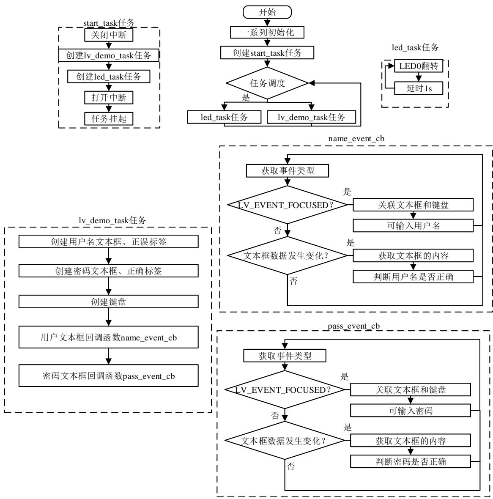  
图24.4.2.1.1文本区域部件实验流程图

# 24.4.2.2 程序解析

关于LVGL的用户代码，我们都是在lv_mainstart.c文件中编写的，本实验的源码如下所示：

```txt
/\*\*\*\*\*\*\*\*\*\*\*\*\*\*\*\*\*\*\*\*\*\*\*\*\*\*\*\*\*\*\*\*\*\*\*\*\*\*\*\*\*\*\*\*\*\*\*\*\*\*\*\*\*\*\*\*\*\*\*\*\*\*\*\*\*\*\*\*\*\*\*\*\*\*\*\*\*\*\*\*\*\*\*\*\*\*\*\*\*\*\*\*\*\*\*\*\*\*\*\*\*  
\*/\*  
\* @brief LVGL 演示  
\* @param 无  
\* @return 无
```

```c
\*/   
void lv_mainstart(void)   
{ lv_example_textarea();   
}   
\*\*\*\*\*\*\*\*\*\*\*\*\*\*\*\*\*\*\*\*\*\*\*\*\*\*\*\*\*\*\*\*\*\*\*\*\*\*\*\*\*\*\*\*\*\*\*\*\*\*\*\*\*\*\*\*\*\*\*\*\*\*\*\*\*\*\*\*\*\*\*\*\*\*\*\*\*\*\*\*\*\*\*\*\*\*\*\*\*\*\*\*\*\*\*\*\*\*\*\*\* 第一部分 结束  $\star \star \star \star \star \star \star \star \star \star \star \star \star \star \star \star \star \star \star \star \star \star \star \star \star \star \star \star \star \star \star \star \star \star \star \star \star \star \star \star \star \star \star \star \star \star \star \star \star \star \star 1$    
\*/\* @brief用户名文本框事件回调   
\* @param  $^ { * } e$  ：事件相关参数的集合，它包含了该事件的所有数据   
\* @return无   
\*/   
static void name_event_cb(lv_event_t  $^ { * } e$  ）   
{ lv_event_code_t code  $=$  lv_event_get_code(e); /\* 获取事件类型\*/ lv_obj_t  $^ { * }$  target  $=$  lv_event_get_target(e); /\* 获取触发源\*/ if (code  $= =$  LV_EVENT_FOCUSED) /\* 事件类型：被聚焦\*/ { lv(keyboard_set_textarea(keyboard, target); /\* 关联用户名文本框和键盘\*/ 1 else if (code  $= =$  LV_EVENT_VALUE_CHANGED) /\* 事件类型：文本框的内容发生变化\*/ { const char  $^ { * }$  txt  $=$  lv_textarea_get_text(target); /\* 获取文本框的文本\*/ if (strcmp(txt,"admin")  $= = 0$  /\* 判断用户名是否正确\*/ { lv_label_set_text.label_name,LV_SYMBOL_OK); /\* 用户名正确，显示√\*/ 1 else { lv_label_set_text labelled_name, ""); /\* 用户名错误，不提示\*/ 1 }   
}   
\*/\* @brief 密码文本框事件回调   
\* @param  $^ { * } e$  ：事件相关参数的集合，它包含了该事件的所有数据   
\* @return无   
\*/   
static void pass_event_cb(lv_event_t  $^ { * } e$  ）
```

```txt
{lv_event_code_t code  $=$  lv_event_get_code(e); /\*获取事件类型\*/lv_obj_t \*target  $=$  lv_event_get_target(e); /\*获取触发源\*/if(code  $= =$  LV_EVENT_FOCUSED) /\*事件类型：被聚焦\*/{lv(keyboard_set_textarea(keyboard,target);\*/关联用户名文本框和键盘\*/}else if(code  $= =$  LV_EVENT_VALUE_CHANGED）/\*事件类型：文本框的内容发生变化\*/{const char \*txt  $=$  lv_textarea_get_text(target); /\*获取文本框的文本\*/if(strcmp(txt,"123456")  $= = 0$  ） /\*判断密码是否正确\*/{lv_label_set_text.label_pass，LV_SYMBOL_OK); /\*密码正确，显示√\*/}else{lv_label_set_text.label_pass，"）； /\*密码错误，不提示\*/}1static void lv_example_textarea(void)  
{/\*\*@brief 用户登录实例\* @param 无\* @return 无\*/  
static void lv_example_textarea(void)  
{/\*根据屏幕大小设置字体\*/if (scr_act_width() <= 320){font  $=$  &lv.Font_montserrat_12;1else if (scr_act_width() <= 480){font  $=$  &lv.Font_montserrat_14;1else{font  $=$  &lv.Font_montserrat_22;
```

```c
/\*用户名文本框\*/  
lv_obj_t \*textarea_name  $=$  lv textarea_create(lv_scr_act(); /\*创建文本框\*/lv_obj_set_width(textarea_name,scr_ACT_width(/2); /\*设置宽度\*//\*设置字体\*/  
lv_obj_set_style_text.Font(textarea_name，font，LV_PART_MAIN);/\*设置位置\*/  
lv_obj_align(textarea_name，LVALIGNCENTER，0，-scract_height(/3）;/\*设置单行模式\*/  
lvporaea_set_oneLine(textarea_name，true);/\*设置输入字符的最大长度\*/  
lvporaea_set_max_length(textarea_name，6);/\*设置占位符\*/  
lvporaea_set_placeholder_text(textarea_name，"user name");/\*添加文本框事件回调\*/  
lv_obj_add_event_cb(textarea_name，name_event_cb，LV_EVENT_ALL，NULL);/\*用户名正误提示标签\*/  
label_name  $=$  lv_label_create(lv_scr_act()); /\*创建标签\*/lv_label_set_text.labelname，"");\*/默认不提示\*/lv_obj_set_style_textFont labelled_name，font，LV_PART_MAIN);\*/设置字体\*//\*设置位置\*/  
lv_obj_align_to labelled_name,textarea_name，LV ALIGN_OUT_RIGHT_MID，5，0);/\*密码文本框\*/  
lv_obj_t \*textarea_pass  $=$  lvporaea_create(lv_scr_act()); /\*创建文本框\*/lv_obj_set_width(textarea_pass，scr_ACT_width(/2);\*/设置宽度\*/lv_obj_set_style_textFont(textarea_pass，font，LV_PART_MAIN);\*/设置字体\*/lv_obj_align_to(textarea_pass,textarea_name，LV ALIGN_OUT_bottom_MID，0，scract_height(/20);\*/设置位置\*/lvporaea_setoneLine(textarea_pass，true);\*/设置单行模式\*/lvporaea_set_password_mode(textarea_pass，true);\*/设置密码模式\*//\*设置密码显示时间\*/  
lvporaea_set_password_show_time(textarea_pass，1000);  
lvporaea_set_max_length(textarea_pass，8);\*\*设置输入字符的最大长度\*/lvporaea_set_placeholder_text(textarea_pass,"password");/\*设置占位符\*/\*\*添加文本框事件回调\*/  
lv_obj_add_event_cb(textarea_pass，pass_event_cb，LV_EVENT_ALL，NULL);/\*密码正误提示标签\*/  
label_pass  $=$  lv_label_create(lv_scr_act()); /\*创建标签\*/lv_label_set_text.labelname，"");\*/默认不提示\*/
```

```txt
lv_obj_set_style_text.Font (label_pass,font，LV_PART_MAIN)；/\*设置字体\*/ /\*设置位置\*/ lv_obj_align_to (label_pass,textarea_pass，LVALIGN_OUT_RIGHT_MID，5，0); /\*键盘\*/ keyboard  $=$  lvkeyboard_create(lv_scr_act())； /\*创建键盘\*/ /\*设置大小\*/ lv_obj_set_size(keyboard，scr_act_width()，scr_act_height() /2);   
}   
/****** 第二部分 结束 \*\*\*\*\*\*\*\*\*\*\*\*\*\*\*\*\*\*\*\*\*\*\*\*\*\*\*\*\*\*\*\*\*\*\*\*\*\*\*\*\*\*\*\*\*\*\*\*\*\*\*\*\*\*\*\*\*\*\*\*\*\*\*\*\*\*\*\*\*\*\*\*\*\*\*\*\*\*\*\*\*\*\*\*\*\*\*\*\*\*\*\*\*\*\*\*\*\*\*\*\*
```

上述源码可分为以下两个部分：

① lv_mainstart 接口函数。在该函数中，我们调用了文本区域部件相关的示例函数；  
② 用户名、密码文本框的实现。我们先根据当前活动屏幕的宽度来选择字体，然后分别创建用户名文本框、用户名正误提示标签、密码文本框、密码正误提示标签以及键盘，并为两个文本框添加事件回调。在默认的情况下，键盘没有与任何文本框关联，如果需要将文本输入到文本框中，则需要点击某个输入框，此时会触发事件回调，在事件的回调函数中，如果判断是发生了“聚焦”事件（此处对应的就是点击输入框），就将被点击的输入框与键盘关联，用户即可输入文本。当用户输入文本时，同样也会触发事件回调，在回调函数中，我们获取文本框的内容并判断正误，如果是正确的，则更新提示标签，显示“√”。

# 24.4.3 下载验证

把工程编译并下载到我们的开发板中，运行效果如下图所示：

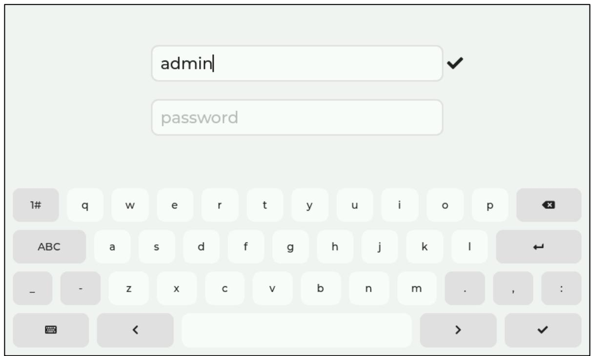  
图24.4.3.1文本区域部件实验

# 第二十五章 日历部件 lv Calendar

日历部件可以展现当前的日期，并帮助用户快速浏览每月的日程安排。

本章节将分为以下几个小节：

25.1日历部件的组成  
25.2日历部件的相关知识  
25.3日历部件的API函数  
25.4日历部件的实验

# 25.1日历部件的组成

日历部件由两个部分组成：

① 主体背景 LV_PART_MAIN;  
② 各个按钮 LV_PART_items（指向日期和名称）。

关于部件样式设置的内容，请大家参考6.4.4章节。

# 25.2 日历部件的相关知识

# 25.2.1 创建日历部件

在LVGL中，用户需要创建日历部件，可调用以下函数：

```txt
lv_obj_t *lv Calendar_create lv_obj_t *parent);
```

上述函数只有一个形参，该形参指向该部件的父类。

# 25.2.2 日期的设置/显示

# 1. 设置当前日期

在默认的情况下，当用户创建出一个日历部件，该部件的当前日期为2020年1月1号，如果用户需要设置日期，则可以调用lv Calendar_set今天的date函数。注意：当前日期并不等同于实时显示的日期！

# 2. 显示日期

如果我们仅仅是设置了当前日期，日期部件并不会自动显示该日期，所以我们必须手动跳转当前日期对应的月份，相关的函数为lv Calendar_setshown_date。

接下来，我们以简单示例来理解日期显示的设置，示例代码如下所示：

```c
/\*获取当前活动屏幕的宽高\*/   
#define scr_act_width()lv_obj_get_width(lv_scr_act())   
#define scr actu height()lv_obj_get_height(lv_scract())   
void lv_mainstart(void)   
{ /\*定义并初始化日历\*/ lv_obj_t\* calendar  $=$  lv Calendar_create(lv_scr_act()); /\*设置日历的大小\*/ lv_obj_set_size(calend,scr actu height(  $\text{串}$  0.85，scr actu height(  $\text{串}$  0.85); lv_obj_center(calendar);
```

```txt
/\*设置当前日期\*/  
lv Calendar_set today date (calendar，2022，4，7);  
/\*设置显示的月份\*/  
lv Calendar set showed date (calendar，2022，4);  
/\*设置日历头\*/  
lv Calendar header dropdown create (lv_scr_act()，calendar);  
/\*更新日历参数\*/  
lv obj_update.layout (calendar);
```

在上述源码中，我们先创建一个日历部件，然后设置当前日期和显示的月份，最后显示日历头和更新日历参数。值得注意的是，日历部件设置日历头的方式有两个，如下所示：

① 调用 lv Calendar_headerdropsdown_create 函数设置；  
② 调用lv Calendar_header_arrow_create函数设置。

上述方法中，①是由下拉列表的形式来选择年月份；②是由按键选择月份，值得注意的是，方法②不能调整年份，它的年份需要根据月份来跳转。示例代码可以在PC模拟器中运行，效果图如下所示：

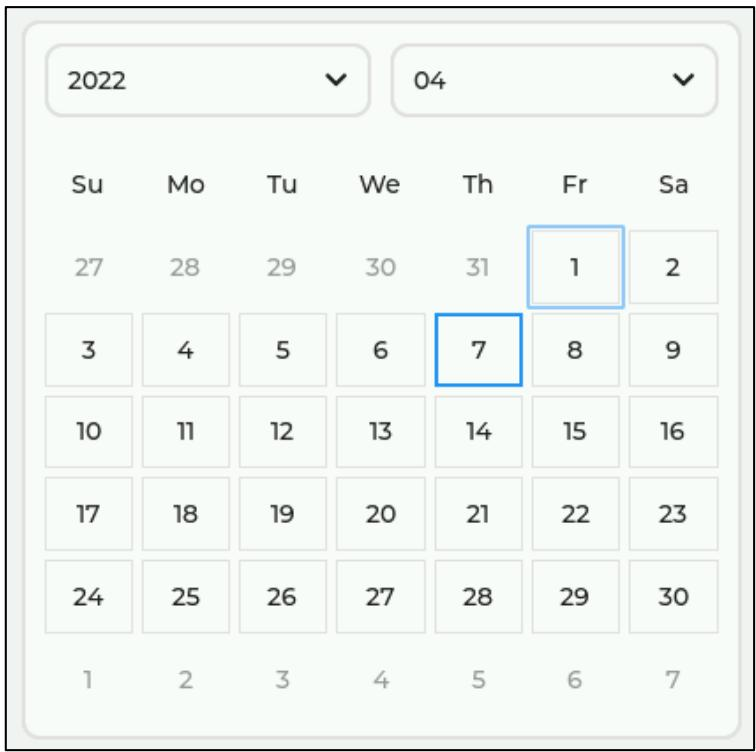  
图25.2.2.1设置当前日期和显示的日期

# 25.2.3 设置日期高亮

如果用户需要某个日期高亮显示，可调用lv Calendar_set_highlighted_dates函数来进行设置。

接下来，我们以简单示例来理解日期高亮的设置，示例代码如下所示：

```c
/* 获取当前活动屏幕的宽高 */
#define scr_act_width() lv_obj_get_width(lv_scr_act())
#define scr_act_height() lv_obj_get_height(lv_scr_act())
```

```c
static lv Calendar_date_t highlightDays[2]; /*定义的日期，必须用全局或静态定义*/  
void lv_mainstart(void)  
{  
/*定义并初始化日历*/lv_obj_t* calendar = lvCalendar_create(lv_scr_act());  
/*设置日历的大小*/lv_obj_set_size(calendarm,scr actu height() \*0.85,scr actu height()\*0.85);lv_obj_center(calendarm);/\*设置日历的日期\*/lv Calendar_set today date(calendarm,2022,4,7);/\*设置日历显示的月份\*/lv Calendar_setshowed_date(calendarm,2022,4);/\*设置日历头\*/lv Calendar_header_dropdown_createLv_scr actu(),calendar);  
/\*设置第一个日期\*/highlight_davs[O].year  $= 2022$  highlight_davs[O].month  $= 4$  highlight_davs[O].day  $= 5$  /\*设置第二个日期\*/highlight_davs[1].year  $= 2022$  highlight_davs[1].month  $= 4$  highlight_davs[1].day  $= 6$ lvCALENDAR_set_highlighted_dates(calendarm,highlight_davs,2);\*/更新日历参数\*/lv_obj_update.layout(calendarm);  
}
```

在上述源码中，我们首先定义了一个静态变量highlightDays，然后设置该结构体的成员变量分别为“2022、4、5”和“2022、4、6”，最后调用lv Calendar_set_highlighted_dates函数，设置这两个日期为高亮状态。示例代码可以在PC模拟器中运行，效果图如下所示：

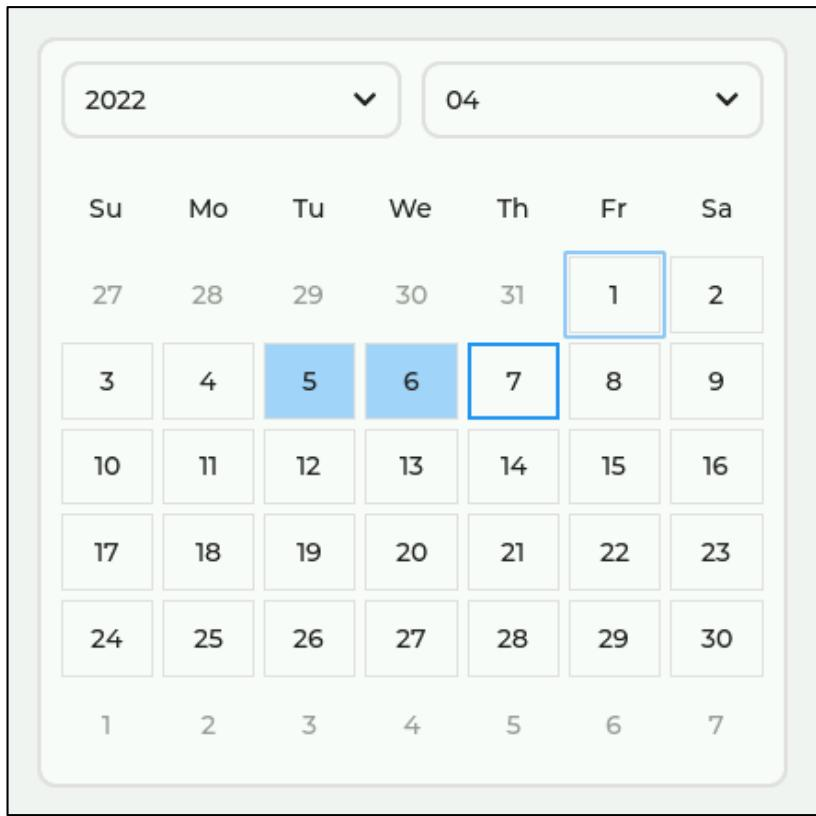  
图25.2.3.1设置某个日期为高亮

由上图可知，我们设置2022年4月5号、6号为高亮显示。

# 25.2.4 设置日名

在默认的情况下，日历都是以英文的形式展示(Su、Mo、Tu、We、Th、Fr和Sa)，如果用户想设置成中文的日名，可调用lv Calendar_set_day_names函数。

接下来，我们以简单示例来理解日期名称的设置，示例代码如下所示：

```c
/\*获取当前活动屏幕的宽高\*/   
#define scr_act_width()lv_obj_get_width(lv_scr_act())   
#define scr actu height()lv_obj_get_height(lv_scract()))   
LVFONTDeclare (myFont14)   
static lv Calendar date_t highlight days[2]；/\*定义的日期，必须用全局或静态定义\*/ const char\* day NAMES[7]  $=$  {"一","二","三","四","五","六","日"，}；   
void lv_mainstart(void){ /\*定义并初始化日历\*/ lv_obj_t\* calendar  $\equiv$  lv Calendar_create(lv_scr_act(); /\*设置字体\*/ lv_obj_set_style_text.Font(calendar,&myFont14,LV_STATE_DEFAULT); /\*设置日历的大小\*/ lv_obj_set_sizecalendar,scr actu height(）\*0.85,scr actu height(  $\star 0.85)$  · lv_obj_center(calendar);
```

```txt
/\*设置日历的日期\*/  
lv Calendar_set today date (calendar，2022，4，7);  
/\*设置日历显示的月份\*/  
lv Calendar_set/showed_date (calendar，2022，4);  
/\*设置日历头\*/  
lv Calendar_header_dropdown_create (lv_scr_act()，calendar);  
highlight_davs[0].year  $= 2022$  /\*设置第一个日期\*/  
highlight_davs[0].month  $= 4$    
highlight_davs[0].day  $= 5$    
highlight_davs[1].year  $= 2022$  /\*设置第二个日期\*/  
highlight_davs[1].month  $= 4$    
highlight_davs[1].day  $= 6$    
lv Calendar_set_highlighted_dates (calendar，highlight_davs，3);  
/\*设置日名\*/  
lv Calendar_set_day_names (calendar，day_names);  
/\*更新日历参数\*/  
lv_obj_update.layout (calendar);
```

在上述源码中，我们为日历部件设置了字体：myFont14（该字体必须包含中文），然后设置day_names数组的内容，调用lv Calendar_set_day_names函数，设置日历的日名，最后更新日历参数。示例代码可以在PC模拟器中运行，效果图如下所示：

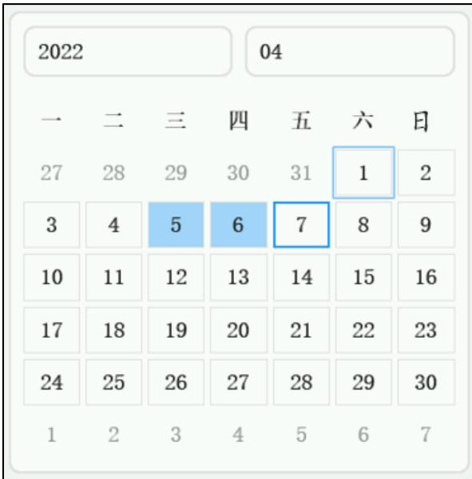  
图25.2.4.1设置日历的日名

# 25.3日历部件的API函数

LVGL官方提供了一些与日历部件相关API，如下表所示：  

<table><tr><td>函数</td><td>描述</td></tr><tr><td>lv Calendar_create()</td><td>创建日历部件</td></tr><tr><td>lv Calendar_set_today_date()</td><td>设置当前的日期</td></tr><tr><td>lv Calendar_set/showed_date()</td><td>设置显示的日期</td></tr></table>

表 25.3.1.1 日历部件相关的 API 函数  

<table><tr><td>lv Calendar_set_highlighted_dates()</td><td>设置高亮显示的日期</td></tr><tr><td>lv Calendar_set_day_names()</td><td>设置日历（星期）的名称</td></tr><tr><td>lv Calendar_get_btntmatrix()</td><td>获取日历的按钮矩阵对象</td></tr><tr><td>lv Calendar_get今天的_date()</td><td>获取当前的日期</td></tr><tr><td>lv Calendar_get/showed_date()</td><td>获取当前显示的日期</td></tr><tr><td>lv Calendar_get_highlighted_dates()</td><td>获取高亮显示的日期</td></tr><tr><td>lv Calendar_get_highlighted_dates_num()</td><td>获取高亮显示的日期数量</td></tr><tr><td>lv Calendar_get_pressd_date()</td><td>获取当前按下的日期</td></tr></table>

接下来，我们介绍LVGL日历部件常用的API函数：

# 1.lv Calendar_create 函数

创建日历部件，该函数原型如下所示：

```txt
lv_obj_t * lv_Calendar_createLv_obj_t \* parent);
```

该函数的形参，如下表所示：

表 25.3.2 lv Calendar_create 函数形参描述  

<table><tr><td>参数</td><td>描述</td></tr><tr><td>parent</td><td>指向父对象的指针</td></tr></table>

返回值：返回 Calendar 部件对象。

# 2.lv Calendar_set today_dat函数

设定当前的日期，该函数原型如下所示：

```c
void lv Calendar_set today_date( lv_obj_t *obj, uint32_t year, uint32_t month, uint32_t day);
```

该函数的形参，如下表所示：

表 25.3.3 lv Calendar_set today date 函数形参描述  

<table><tr><td>参数</td><td>描述</td></tr><tr><td>obj</td><td>指向日历对象的指针</td></tr><tr><td>year</td><td>年</td></tr><tr><td>month</td><td>月</td></tr><tr><td>day</td><td>日</td></tr></table>

返回值：无。

# 3.lv Calendar_set/showed_date函数

设置当前显示的日期，该函数原型如下所示：

```c
void lv Calendar_setshowed_date( lv_obj_t *obj, uint32_t year, uint32_t month);
```

该函数的形参，如下表所示：

表 25.3.4 lv Calendar_set/showed date 函数形参描述  

<table><tr><td>参数</td><td>描述</td></tr><tr><td>obj</td><td>指向日历对象的指针</td></tr><tr><td>year</td><td>年</td></tr><tr><td>month</td><td>月</td></tr></table>

返回值：无。

# 4.lv Calendar_set_highlighted_dates 函数

设置高亮显示的日期，该函数原型如下所示：

```txt
void lv Calendar_set_highlighted_dates lv_obj_t *obj, lvCalendar_date_t highlighted[], uint16_t date_num);
```

该函数的形参，如下表所示：

表 25.3.5 lv Calendar_set_highlighted_dates 函数形参描述  

<table><tr><td>参数</td><td>描述</td></tr><tr><td>obj</td><td>指向日历对象的指针</td></tr><tr><td>highlighted</td><td>年</td></tr><tr><td>date_num</td><td>月</td></tr></table>

返回值：无。

# 5.lv Calendar_set_day_names函数

设置日历（星期）的名称，该函数原型如下所示：

```txt
void lv Calendar_set_day_names lv_obj_t *obj, const char **day_names);
```

该函数的形参，如下表所示：

表 25.3.6 lv Calendar_set_day_names 函数形参描述  

<table><tr><td>参数</td><td>描述</td></tr><tr><td>obj</td><td>指向日历对象的指针</td></tr><tr><td>day_names</td><td>指向存放名称的数组指针</td></tr></table>

返回值：无。

# 6.lv Calendar get btnmatrix 函数

获取日历的按钮矩阵对象，该函数原型如下所示：

```c
lv_obj_t *lv Calendar_get_btnmatrix(const lv_obj_t *obj);
```

该函数的形参，如下表所示：

表 25.3.7 lv Calendar_get_btmatrix 函数形参描述  

<table><tr><td>参数</td><td>描述</td></tr><tr><td>obj</td><td>指向日历对象的指针</td></tr></table>

返回值：指向按钮矩阵的指针。

# 7. lv Calendar_get今天的 date 函数

获取当前的日期，该函数原型如下所示：

```javascript
const lv Calendar date_t *lv Calendar_get今天的 date(const lv_obj_t *calendar);
```

该函数的形参，如下表所示：

表 25.3.8 lv Calendar_get今天的 date 函数形参描述  

<table><tr><td>参数</td><td>描述</td></tr><tr><td>calendar</td><td>指向日历对象的指针</td></tr></table>

返回值：指向当前日期的指针。

# 8. lv Calendar_get_showed_date 函数

获取当前显示的日期，该函数原型如下所示：

```txt
const lv Calendar date_t *lv Calendar_get/showd_date(const lv_obj_t *calendar)
```

该函数的形参，如下表所示：

表 25.3.9 lv Calendar_get_getshowed_date 函数形参描述  

<table><tr><td>参数</td><td>描述</td></tr><tr><td>calendar</td><td>指向日历对象的指针</td></tr></table>

返回值：指向当前显示日期的指针。

# 9.lv Calendar_get_highlighted_dates 函数

获取高亮显示的日期，该函数原型如下所示：

```txt
lv Calendar date t *lv Calendar get highlighted dates(const lv_obj_t *calendar)
```

该函数的形参，如下表所示：

表 25.3.10 lv Calendar_get_highlighted_dates 函数形参描述  

<table><tr><td>参数</td><td>描述</td></tr><tr><td>calendar</td><td>指向日历对象的指针</td></tr></table>

返回值：指向高亮显示日期的指针。

# 10.lv Calendar_get_highlighted_dates_num 函数

获取高亮显示的天数，该函数原型如下所示：

```c
uint16_t lv Calendar_get_highlighted_dates_num(const lv_obj_t *calendar);
```

该函数的形参，如下表所示：

表 25.3.11 lv Calendar get Highlights dates num 函数形参描述  

<table><tr><td>参数</td><td>描述</td></tr><tr><td>calendar</td><td>指向日历对象的指针</td></tr></table>

返回值：高亮显示的天数。

# 11.lv Calendar_get_pressd_date 函数

获取当前选中的日期，该函数原型如下所示：

```c
lv_res_t lv Calendar_get_pressd_date(const lv_obj_t *calendar, lv Calendar_date_t *date);
```

该函数的形参，如下表所示：

表 25.3.11 lv Calendar_get_pressd_date 函数形参描述  

<table><tr><td>参数</td><td>描述</td></tr><tr><td>calendar</td><td>指向日历对象的指针</td></tr><tr><td>date</td><td>存储选中的日期</td></tr></table>

返回值：LV_RES_OK:有一个有效的按下日期；LV_RES_INV:没有按下的日期。

# 25.4日历部件的实验

# 25.4.1 硬件设计

# 1. 例程功能

本实验主要测试日历部件 API 函数的使用，实验现象：开机后，屏幕上显示一个输入标签和日历，当我们选中某个日期时，该日期会在输入标签中显示。与此同时，LEDO 闪烁，提示系统正在运行。

该实验的完整源码，请参考《LVGL 例程 25 lv Calendar(日历)》例程，路径：A 盘  $\rightarrow$  4，程序源码  $\rightarrow$  3，扩展例程  $\rightarrow$  4，LVGL 例程。

# 25.4.2 软件设计

# 25.4.2.1 程序流程图

本实验的程序流程图，如下图所示：

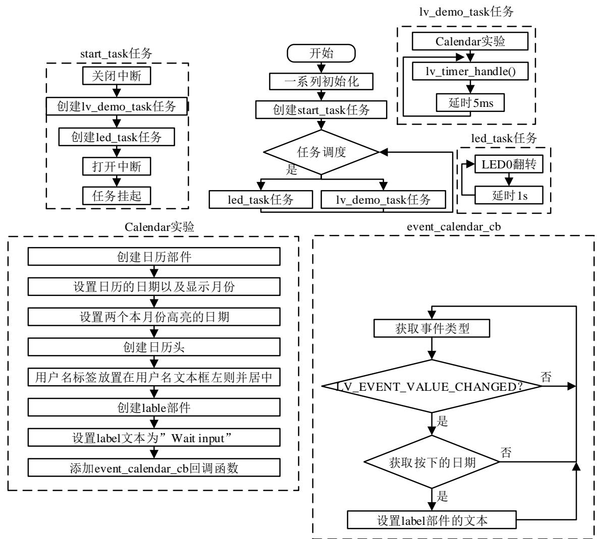  
图25.4.2.1.1日历部件实验流程图

# 25.4.2.2 程序解析

关于LVGL的用户代码，我们都是在lv_mainstart.c文件中编写的，本实验的源码如下所示：

```c
/\*\*\*\*\*\*\*\*\*\*\*\*\*\*\*\*\*\*\*\*\*\*\*\*\*\*\*\*\*\*\*\*\*\*\*\*\*\*\*\*\*\*\*\*\*\*\*\*\*\*\*\*\*\*\*\*\*\*\*\*\*\*\*\*\*\*\*\*\*\*\*\*\*\*\*\*\*\*\*\*\*\*\*\*\*\*\*\*\*\*\*\*\*\*\*\*\*\*\*\*\*  
\*/  
\* @brief LVGL 演示  
\* @param 无  
\* @return 无  
\*/  
void lv_mainstart(void)  
{lv_example Calendar();}  
\*/\*\*\*\*\*\*\*\*\*\*\*\*\*\*\*\*\*\*\*\*\*\*第一部分 结束 \(\text{串串串串串串串串串串串串串串串串串串串串串串串串串串串串串串串串串串串串串串串串串串串串串串串串串串串串串串串串串串串串串串串串串串串串串串串串串串串串串串串串串串串串串串串串串串串串串串串串串串串串
```

```c
/* */
* @brief 日历回调
* @param 无
* @return 无
*/ static void event Calendar_cb(lv_event_t* e)
{
    lv_event_code_t code = lv_event_get_code(e);
    lv_obj_t* obj = lv_event_get_target(e);
    lv_obj_t* label = (lv_obj_t*)e->user_data;
    lv Calendar_date_t date_temp;
    char buf[11];
    if (LV_EVENT_VALUE Changed == code)
        {
            if (LV_RES_OK == lvCalendar_get_pressdate(date, &date_temp))
                lvCalendar_set today_date(date, date_temp.year, date_temp.month, date_temp.day);
            lv_SNprintf(buf, sizeof(buf), "%d/%02d/%02d", date_temp.year, date_temp.month, date_temp.day);
            lv_label_set_text(buf, buf);
        }
}
```

```c
lv Calendar header dropdown create (lv_scr_act(), calendar);  
highlight_davs[0].year = 2022; /*设置第一个日期*/  
highlight_davs[0].month = 4;  
highlight_davs[0].day = 5;  
highlight_davs[1].year = 2022; /*设置第二个日期*/  
highlight_davs[1].month = 4;  
highlight_davs[1].day = 6;  
lv Calendar_set_highlighted_dates (calendar, highlight_davs, 3);  
/*更新日历参数*/  
lv_obj_update.layout (calendar);  
lv_obj_t* label = lv_label_create (lv_scr_act()); /*定义并创建标签*/  
lv_obj_set_width (label, lv_obj_get_x (calendar)); /*设置标签宽度*/  
lv_obj_align (label, LVALIGN_LEFT_MID, 0, 0); /*设置标签位置*/  
/*设置标签文本对齐方式*/  
lv_obj_set_style_text_align (label, LV_TEXT Alignment_CENTER, LV_PART_MAIN);  
lv_label_set_text (label, "Wait input..."); /*设置标签文本*/  
/*设置日历回调*/  
lv_obj_add_event_cb (calendar, event Calendar_cb, LV_EVENT_ALL, label);  
}
```

上述源码可分为以下两个部分：

① lv_mainstart 接口函数。在该函数中，我们调用了日历部件相关的示例函数；  
② 日历、输入框的实现。我们先调用lv Calendar_create函数，创建日历部件，日历创建好之后，分别设置当前的日期和显示的年月为2022.4.7和2022.4，然后创建日历头、设置2022.4.5和2022.4.6为高亮日期；

完成日历部分的创建及配置之后，我们创建标签部件，并设置其默认文本为“Wait input...”，最后为日历部件添加回调函数。在回调函数中，调用lv Calendar.get_pressd_date函数，获取按下的日期，并把将其显示在标签部件中。

# 25.4.3 下载验证

把工程编译并下载到我们的开发板中，运行效果如下图所示：

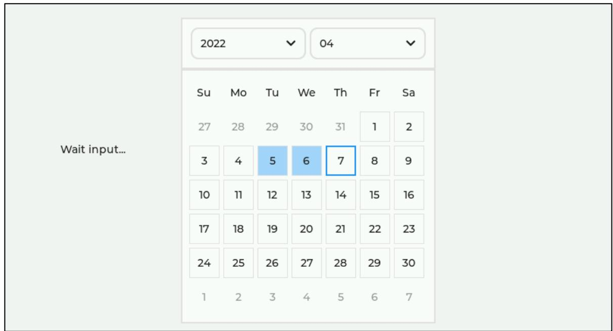  
图25.4.3.1日历部件实验

# 第二十六章 图表部件 lv chart

图表可以将数据可视化，更加直观地显示数据、对比数据、分析数据。LVGL的图表部件支持两种图形：折线图和条形图。

本章节将分为以下几个小节：

26.1 图表部件的组成  
26.2 图表部件的相关知识  
26.3图表部件API函数  
26.4 图表部件的实验

# 26.1 图表部件的组成

图表部件由六个部分组成，如下表所示：

表 26.1.1 图表部件组成部分  

<table><tr><td>组成部分</td><td>描述</td></tr><tr><td>LV_PART_MAIN</td><td>主要设置背景属性和线条(用于分隔线)相关的样式属性</td></tr><tr><td>LV_PART_SCROLLBAR</td><td>主要设置缩放图表时使用的滚动条</td></tr><tr><td rowspan="3">LV_PART_items</td><td>根据图表类型(折线图和条形图)设置</td></tr><tr><td>折线图: 设置线属性,如宽度、高度、bg_color 和半径</td></tr><tr><td>条形图: 背景属性</td></tr><tr><td>LV_PART_INDICATOR</td><td>设置折线图和散点图上的点(小圆或小方)的属性</td></tr><tr><td>LV_PARTCURSOR</td><td>设置游标,比如它的宽度、高度、bg_color 和半径</td></tr><tr><td>LV_PART_TICKS</td><td>设置线条和文本样式属性用于设置刻度的样式</td></tr></table>

关于部件样式设置的内容，请大家参考6.4.4章节。

# 26.2 图表部件的相关知识

图表部件的知识可分为两个部分：第一个是主要功能，这是图表部件不可或缺的功能；第二个是辅助功能，它主要是为了让图表可视化，如标注刻度和刻度文本、缩放和游标等功能。

# 26.2.1图表部件的主要功能

# 1.图表的类型

前面我们已经讲解到图表的类型分为两种，这两种类型分为折线图和条形图，这些图表的类型是由函数lv chart_set_type设置，该函数可设置四种模式，这些模式如下表所示：

表 26.2.1.1 图表的模式  

<table><tr><td>模式</td><td>描述</td></tr><tr><td>LV_CHART_TYPE_NONE</td><td>隐藏数据显示</td></tr><tr><td>LV_CHART_TYPELine</td><td>点与点连接成线(折线图)</td></tr><tr><td>LV_CHART_TYPE_BAR</td><td>条形图</td></tr><tr><td>LV_CHART_TYPE_SCATTER</td><td>X/Y图画点和点之间的线</td></tr></table>

上表的模式主要配置图表数据绘画类型，一般常用的模式是 LV_CHART_TYPE_LINE 和 LV_CHART_TYPE_BAR。下面我们使用一个示意图来描述这两种模式的图表，如下图所示：

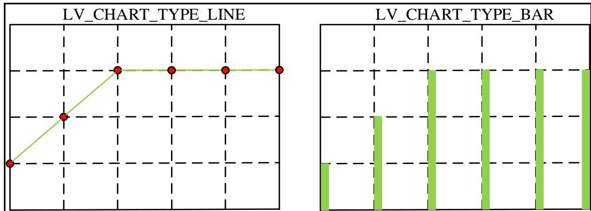  
图26.2.1.1折线图和条形图

# 2. 添加数据序列

数据序列是指绘制在图表上的一组相关值。在不同类型的图表中，数据序列的表示方式各不相同：

(1)条形图：数据序列由一系列具有相同填充（颜色或纹理）的条形表示。  
(2) 折线图（也称为图形）：数据序列用单线表示。

图表设置成条形图或者折线图的方法，前面我们已经讲解过，这里笔者无需重复讲解，数据序列简单来讲就是图表具有多少通道绘制数值，如示波器一般可显示两条或者两条以上的通道。图表的数据序列可调用函数lv chart add series添加，该函数具有三个形参，其中第一个形参指向图表对象；第二个形参是设置数据序列的颜色；而第三个形参表示数据缩放方向，这些方向如下表所示：

表 26.2.1.2 数据缩放方向  

<table><tr><td>数据缩放方向</td><td>描述</td></tr><tr><td>LV_CHART_AXISPRIMARY_Y</td><td>左轴</td></tr><tr><td>LV_CHART_AXIS_SECONDARY_Y</td><td>右轴</td></tr><tr><td>LV_CHART_AXISPRIMARY_X</td><td>底部</td></tr><tr><td>LV_CHART_AXIS_SECONDARY_X</td><td>顶部</td></tr></table>

上述的宏定义与数据缩放有关，数据缩放功能我们以后会讲解到，这里我们了解即可。

# 3. 添加数据

默认情况下，图表部件只支持10个数据点，当然啦，我们也可以手动设置图表的数据点的数量，这个设置方法，我们以后会去讲解。图表部件添加数据的方法有五种，下面我们分别地讲解这五种添加数据的过程，如下所示：

# 第一种：lv chart set ext y array / lv chart set ext x array 函数

这两个函数都是添加数据到图表当中。下面我们分别讲解这两个函数的区别是什么？

函数lv chart_set_ext_y_array是为Y轴数据点设置一个外部阵列，该函数一般用在折线图和条形图类型。函数lv chart set ext x array是为X轴数据点设置一个外部阵列，该函数一般用在LV_CHART_TYPE_SCATTER类型上。

下面我们编写一个简单实例来讲解lv chart set ext y array函数到底如何使用，如下源码所示：

```c
/\*示例数据\*/   
static const lv_coord_t example_data[]  $\equiv$  { 25，26，27，29，30，31，32，34，35，36，37，38，39，40，41，42，43，44，45,   
}；   
void lv_mainstart(void)   
{
```

```c
lv_obj_t* chart;  
/* 创建图表部件 */  
chart = lv-chart_create(lv_scr_act());  
/* 设置图表大小 */  
lv_obj_set_size chart, 200, 150);  
/* 中间对齐 */  
lv_obj_center chart);  
/* 设置折线图类型 */  
lv chart_set_type(char, LV_CHART_TYPELine);  
/* 添加数据序列 */  
lv chart_series_t* ser1 = lv-chart_add_series(char, lv Palette_main(LV_PALETTE_RED), LV_CHART_AXIS_SECONDARY_X);  
/* 为Y轴数据点设置一个外部阵列 */  
lv chart_set_ext_y_array(char, ser1, (lv Coordinate_t*) example_data);  
/* 更新图表 */  
lv chart.refresh(char);
```

从上述源码可知：我们首先创建图表，然后把图表设置图表的类型为折线图，其次图表添加数据序列，最后添加数据到图表当中。上述源码可在PC模拟器或者在开发板上运行，其程序效果图如下图所示：

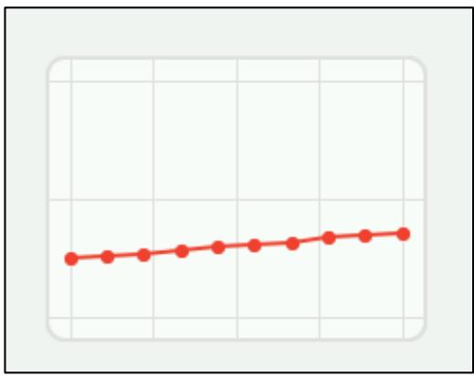  
图26.2.1.2折线图示意图

上图的数据都是由example_data数组提供给图表部件。

# 第二种：lv chart set next value 函数

该函数主要设置图表的下一个数值，使用该函数添加数据到图表的模式具有两种，如下表所示：

表 26.2.1.3 添加数据模式  

<table><tr><td>模式</td><td>描述</td></tr><tr><td>LVChart_UPDATE_MODE_SHIFT</td><td>将旧数据移到左边，并将新数据添加到右边</td></tr><tr><td>LVChart_UPDATE_MODE_CIRCULAR</td><td>以循环的方式添加新数据，就像心电图一样</td></tr></table>

上述的模式是由lv chart set update mode设置，图表会根据这些模式来设置添加数据的方式。接下来我们编写一个简单的实例来讲解这两个模式的作用，如下源码所示：

```c
lv_obj_t* chart;  
lv_obj_t* chart1;
```

```c
static void add_data(lv_timer_t* timer)   
{ LV UNUSED(times); lv chart_set_next_value chart, timer->user_data, lv rand(20, 90));   
}   
static void lv_add_data(lv_timer_t* timer)   
{ LV UNUSED(times); lv chart_set_next_value chart1, timer->user_data, lv rand(20, 90));   
}   
void lv_mainstart(void)   
{ /* 创建图表部件 */ chart = lv chart_create(lv_scr_act()); /* 设置图表大小 */ lv_obj_set_size chart, 200, 150); /* 中间对齐 */ lv_obj_center chart); /* 将旧数据移到左边 */ lv chart_set_update_modechart,LV_CHART_UPDATE_MODE_SHIFT); /* 添加数据序列 */ lv chart_series_t\* ser1  $=$  lv chart_add_serieschart, lv Palette_main(LV_PALETTE_RED), LV_CHART_AXIS_SECONDARY_X); /* 创建定时器*/ lv_timer_create(add_data, 200, ser1); /* 更新图表 */ lv chartrefresh(char; chart1  $=$  lv chart_create(lv_scr_act()); lv_obj_set_size(char1, 200, 150); /* 对齐 */ lv_obj_align_to(char1, chart,LVALIGN_OUT BOTTOM_MID,0,20); /* 添加数据序列 */ lv chart_series_t\* ser2  $=$  lv chart_add_series(char1, lv Palette_main(LV_PALETTE_RED), LV_CHART_AXIS_SECONDARY_X); /* 以循环的方式添加新数据*/ lv chart_set_update_modechart1, LV_CHART_UPDATE_MODE_CIRCULAR); /* 创建定时器 */
```

```c
lv_timer_create(lv_add_data, 200, ser2); /* 更新图表 */ lv chart refresh chart1); }
```

此函数主要创建两个图表，它们分别设置不同的数据模式，然后创建两个定时器分别以200ms调用函数lv chart set next value更新数据。上述源码可在PC模拟器或者在开发板上运行，其程序效果图如下图所示：

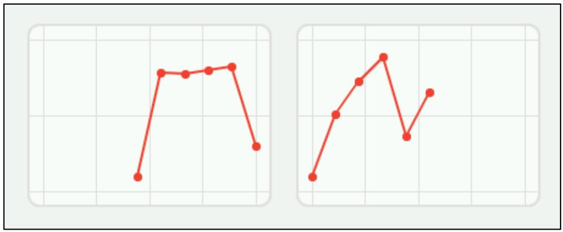  
图26.2.1.3两种模式下添加数据

上图中，左边的图表是 LV_CHART_UPDATE_MODE_SHIFT 模式添加数据，该模式下的数据是从右边往左边移动，而右边的图表是 LV_CHART_UPDATE_MODE_CIRCULAR 模式添加数据是从左边往右边移动，如医院的心电图。

# 第三种：lv chart set all value 函数

该函数很简单理解，它是把所有的数据都初始化为一个数值。前面我们讲解到图表部件只支持10个数据点，如果我们使用这个函数初始化数据点，则这些数据点的数值都是一样的。

# 第四种：lv chart set value by id 函数

此函数主要修改某个数据点的数值，前面我们讲到图表部件默认只支持10数据点，这些数据点是从0开始自增。

# 第五种：在数组中手动设置

使用lv chart add series函数所返回的数据序列指针的成员变量y_points或者x_points数组设置数值，如ser2->y_points[0] = 90。

上述五种添加数据的方式常用的是(1)和(2)方式，这些方式都必须在后面调用函数lv chart refresh 更新数据。

# 4.设置数据点数量

前面笔者也讲解过，图表部件默认只支持10个数据点，如果我们具有11个数据，那么图表先显示前10个数据，而第11个数据会将图表的10个数据逐一往左移位，最后把第一个数据点的数值去除了。下面我们使用一个示意图来讲解上述的过程，如下图所示：

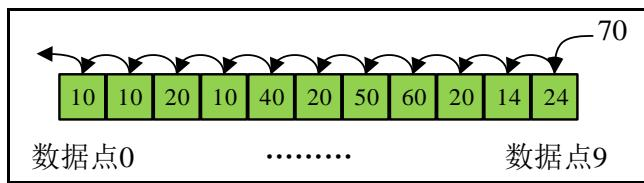  
图26.2.1.4数据移位

结合我们前面讲解的知识，这些数据点类似于一个数组(其实它是一个连续内存的内存块)，该数组默认长度为10，所以上图的数据点可以存放10个元素，如果第11给元素加载到数据点中，则该数组的数值往左移位，最后把原本第一位的元素除去，元素70插入该数组的最后一位。上述的过程就是图表部件的添加数据的原理。

虽然图表部件默认只支持10个数据点，但是我们可以手动设置图表可支持的数据点，如5、6、7等数据点，这些数据点的数量由用户决定。我们调用函数lv chart set point count来设置该图表所支持的数据点。注意：当一个外部缓冲区被分配给一个序列时，这也会影响处理的点数，所以你需要确保外部数组足够大。

# 26.2.2图表部件的辅助功能

# 1.垂直范围

垂直范围是指图表所添加的数据不能超出这个范围。图表默认的垂直范围为0~100，我们可以手动调用函数lv chart set range设置垂直范围。注意：设置垂直范围的数据序列必须是LV_CHART_AXIS_PRIMARY和LV_CHART_AXIS_SECONDARY。下面我们使用一个示意图来讲解图表的垂直范围的知识，如下图所示：

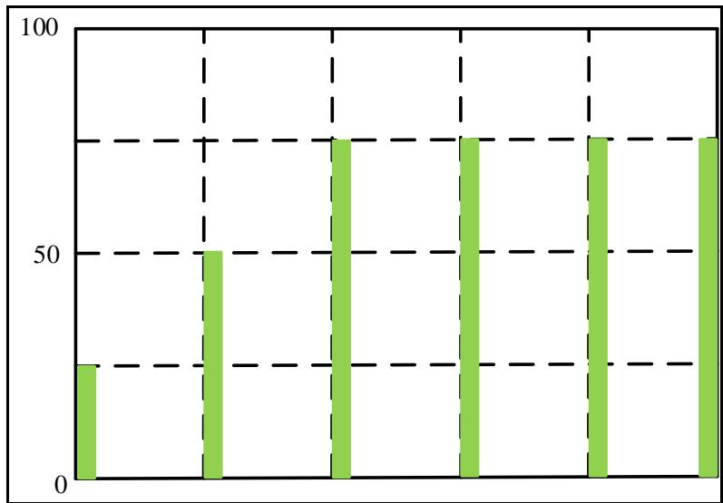  
图26.2.2.1 设置垂直范围

从上图可知：图表部件默认的垂直范围为  $0\sim 100$

# 2. 分隔线

分隔线是用于辅助数据图表提升投射关联的。应用分隔线能够提升数据信息的可阅读性，分隔线给予了二种作用：一是拓宽标值标尺至数据可视化目标中，便于观查数据信息值之尺寸；二是提升数据可视化目标中间的较为基本。

LVGL的图表部件默认设置为3条水平分隔线和5条垂直分隔线，如果某边有可见的边框且该边没有填充，则分割线将绘制在边框的顶部。图表部件分割线是调用函数lv chart_set_div_line_count设置，该函数的第二和第三个形参表示水平和垂直分割线的数量，下面我们使用一个示意图来讲解分割线到底是什么，如下图所示：

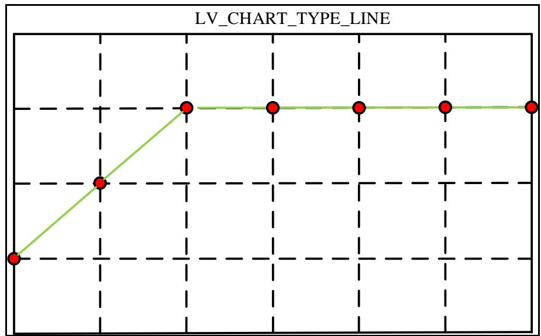  
图26.2.2.2图表分割线示意图

从上图可知：图表默认设置为3条水平分隔线和5条垂直分隔线，这些分割线主要拓宽标值标尺至数据可视化目标。

# 3. 设置默认起始点

如果用户想让绘图从一个点开始而不是默认值 point[0]点开始，我们可以使用函数 lv chart_set_x_start_point(char, ser, id)设置一个替代索引，其中 id 是开始绘图的新索引位置。下面我们使用一个示意图来讲解 LV_CHART_UPDATE_MODE_SHIFT/CIRCULAR 这两种模式下设置起始点到底有何不同，如下图所示：

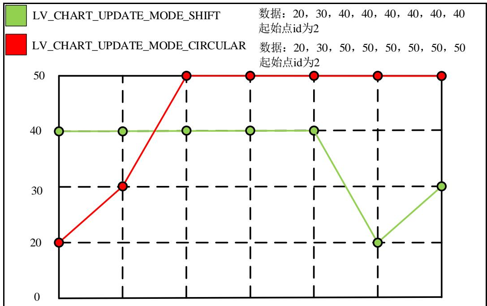  
图26.2.2.3两种模式下的起始点设置

从上图可知：LV_CHART_UPDATE_MODE_SHIFT图表是从id为2的数据点开始，而数据点1和数据点0是最后才添加到图表当中；LV_CHART_UPDATE_MODE_CIRCULAR图表也是一样。

# 4. 刻度线和刻度线标签

刻度由刻度标签和刻度线组成，若要进一步设置刻度样式，就需要引入刻度定位器(locator)和刻度格式器(formatter)的概念。刻度定位器用来设置刻度线的位置；刻度格式器用来设置刻度标签的显示样式。至于刻度格式器和刻度定位器如何实现，这里我们无需了解，因为LVGL作者已经帮我们写好了，我们只调用API接口实现即可。

刻度线和刻度线标签的需要用户调用函数 lv chart_set_axis Tick 添加到当前图表中，该函数具有八个形参，这些形参主要设置刻度线和刻度线的标签。

# lv chart set axis tick 函数

该函数的作用是设置刻度标签和刻度线，该函数原型如下所示：

```txt
void lv chart_set_axis Tick(lv_obj_t * obj, lv chart_axis_t axis, lv_coord_t major_len, lv_coord_t minor_len, lv_coord_t major_cnt, lv_coord_t minor_cnt, bool label_en, lv_coord_t draw_size)
```

该函数的形参，如下表示：

表 26.2.1.4 函数 lv chart_set_axis Tick(   )形参描述  

<table><tr><td>参数</td><td>描述</td></tr><tr><td>obj</td><td>指向图表对象的指针</td></tr><tr><td>axis</td><td>计数的轴:LV_CHART_AXIS_X/PRIMARY_Y/SECONDARY_Y</td></tr><tr><td>major_len</td><td>主刻度长度</td></tr><tr><td>minor_len</td><td>小刻度长度</td></tr><tr><td>major_cnt</td><td>主刻度的数量</td></tr><tr><td>minor_cnt</td><td>小刻度的数量</td></tr><tr><td>label_en</td><td>true:启用在主刻度上绘制标签</td></tr><tr><td>draw_size</td><td>绘制刻度和标签所需的额外大小</td></tr></table>

返回值：无。

下面我们编写一个简单实例来讲解这个函数到底如何添加刻度标签和刻度线，如下源码所示：

```c
void lv_mainstart(void)  
{lv_obj_t* chart;/\*创建一个图表\*/chart  $=$  lv-chart_create(lv_scr_ACT());lv_obj_set_size chart,200，150);lv_obj_center chart);/\*设置Y轴的刻度和刻度标签，主刻度长度为10，小刻度为5，主刻度数量为6，小刻度数量为5\*/lv chart_set_axis Tick chart,LV_CHART_AXIS_PRIMARY_Y,10,5,6,5, true，40);/\*设置X轴的刻度和刻度标签，主刻度长度为10，小刻度为5，主刻度数量为10，小刻度数量为2\*/lv chart_set_axis Tick(chart,LV_CHART_AXISPRIMARY_X,10,5,10,1,
```

```javascript
true，30);lv chart refresh (chart);
```

从上述源码可知：我们设置图表的Y轴的主刻度数量为6，小刻度数量为5，然后设置X轴的主刻度数量为10，小刻度数量为1。上述源码可在PC模拟器或者在开发板上运行，其程序效果图如下图所示：

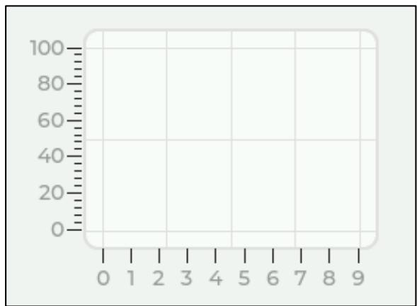  
图26.2.2.4设置图表的Y和X轴刻度和刻度标签

由于图表默认的垂直范围为  $0 \sim 100$ ，我们设置主刻度为6，该图表的Y轴具有五个间隔，所以  $100 / 5 = 20$ ，显然地，图表的Y轴增量以20步长设置；图表的X轴是以1步长为增量。

# 5.缩放

图表缩放指的是局部放大或缩小图表，可以更方便的查看图表数据。LVGL 的图表缩放接口由两个函数设置，一个是 lv chart set zoom x 对 X 轴缩放；另一个是 lv chart set zoom y 对 Y 轴缩放。它们的的第二个形参表示缩放因子，如果缩放因子为 256，则图表没有缩放；如果缩放因子大于 256 且小于等于 512，则图表进行缩放。

# 6. 游标

图表游标可以查看数据是否溢出指定的范围。图表游标需要用户调用函数lv chart add cursor添加，该函数具有三个形参，它们分别指向图表对象、游标颜色以及游标的方向。游标的方向形参可以设置LV_DIR_NONE/RIGHT/UP/LEFT/DOWN/HOR/VER/ALL配置项并告诉游标应该在哪个方向绘制。

设置图表游标的位置具有两个方式，如下所示：

① lv chart set cursor pos (chart, cursor, &point)) 函数的 Pos 形参是一个指向 lv_point_t 变量的指针。例如 lv_point_t point = {10,20}; 如果图表被滚动，游标将保持在相同的位置。  
② lv chart set cursor point (chart, cursor, series, point_id)将游标粘在一个点上。如果点的位置改变(滚动)，游标将随着点移动。

# 26.3 图表部件 API 函数

LVGL官方提供了一些与图表部件相关API，如下表所示：

<table><tr><td>函数</td><td>描述</td></tr><tr><td>lv chart create()</td><td>创建图表对象</td></tr><tr><td>lv chart set type()</td><td>为图表设置一个新的类型</td></tr><tr><td>lv chart set point count()</td><td>设置数据线上的点数</td></tr><tr><td>lv chart set range()</td><td>设置轴上的最小和最大y值</td></tr><tr><td>lv chart set update mode()</td><td>设置图表对象的更新模式</td></tr></table>

表 26.3.1 图表部件相关的 API 函数  

<table><tr><td>lv chart set div line count()</td><td>设置水平和垂直分隔线的数量</td></tr><tr><td>lv chart set zoom x()</td><td>按X方向放大图表</td></tr><tr><td>lv chart set zoom y()</td><td>按Y方向放大图表</td></tr><tr><td>lv chart get zoom x()</td><td>获取X缩放数值</td></tr><tr><td>lv chart get zoom y()</td><td>获取Y缩放数值</td></tr><tr><td>lv chart set axis tick()</td><td>设置轴线上的划线数</td></tr><tr><td>lv chart get type()</td><td>获取图表的类型</td></tr><tr><td>lv chart get point count()</td><td>获取图表上每条数据线的数据点数字</td></tr><tr><td>lv chart get x start point()</td><td>获取数据数组中x轴起点的当前索引</td></tr><tr><td>lv chart get point pos by id()</td><td>获取图表中一个点的位置</td></tr><tr><td>lv chart refresh()</td><td>如果图表的数据线发生了变化，请刷新图表</td></tr><tr><td>lv chart add series()</td><td>添加数据序列到图表</td></tr><tr><td>lv chart remove series()</td><td>从图表中释放并删除数据序列</td></tr><tr><td>lv chart hide series()</td><td>隐藏/取消隐藏图表的单个数据系列</td></tr><tr><td>lv chart set series color()</td><td>改变一个数据系列的颜色</td></tr><tr><td>lv chart set x start point()</td><td>设置数据数组中x轴起点的索引</td></tr><tr><td>lv chart get series next()</td><td>下一个数据系列</td></tr><tr><td>lv chart add cursor()</td><td>添加一个给定颜色的游标</td></tr><tr><td>lv chart set cursor pos()</td><td>设置游标在点的坐标</td></tr><tr><td>lv chart set cursor point()</td><td>把游标固定在一个点上</td></tr><tr><td>lv chart get cursor point()</td><td>获取游标在点的坐标</td></tr><tr><td>lv chart set all value()</td><td>用一个值初始化序列中的所有数据点</td></tr><tr><td>lv chart set next value()</td><td>根据更新模式策略设置下一个点的Y值</td></tr><tr><td>lv chart set next value2()</td><td>根据更新模式策略设置下一个点的X和Y值</td></tr><tr><td>lv chart set value by id()</td><td>直接根据索引设置图表序列中单个点的y值</td></tr><tr><td>lv chart set value by id2()</td><td>根据索引直接设置图表系列的单个点的x和y值(只能在LV_CHART_TYPE_SCATTER类型图表设置)</td></tr><tr><td>lv chart set ext y array()</td><td>设置用于图表的y数据点的外部数组</td></tr><tr><td>lv chart set ext x array()</td><td>设置用于图表的x数据点的外部数组</td></tr><tr><td>lv chart get y array()</td><td>获取一个系列的y值的数组</td></tr><tr><td>lv chart get x array()</td><td>获取一个系列的x值的数组</td></tr><tr><td>lv chart get pressed point()</td><td>获取当前被压点的指数</td></tr></table>

# 26.4 图表部件的实验

# 26.4.1 硬件设计

# 1. 例程功能

本实验主要测试图表部件 API 函数的使用，实验现象：开机后，屏幕上显示一个图表（正弦波）和两个滑块，用户调节滑块的值，即可控制图表的 X、Y 轴缩放。与此同时，LED0 闪烁，提示系统正在运行。

该实验的完整源码，请参考《LVGL例程26lv chart(图表)》例程，路径：A盘  $\rightarrow 4$  ，程序源码  $\rightarrow 3$  ，扩展例程  $\rightarrow 4$  ，LVGL例程。

# 26.4.2 软件设计

# 26.4.2.1 程序流程图

本实验的程序流程图，如下图所示：

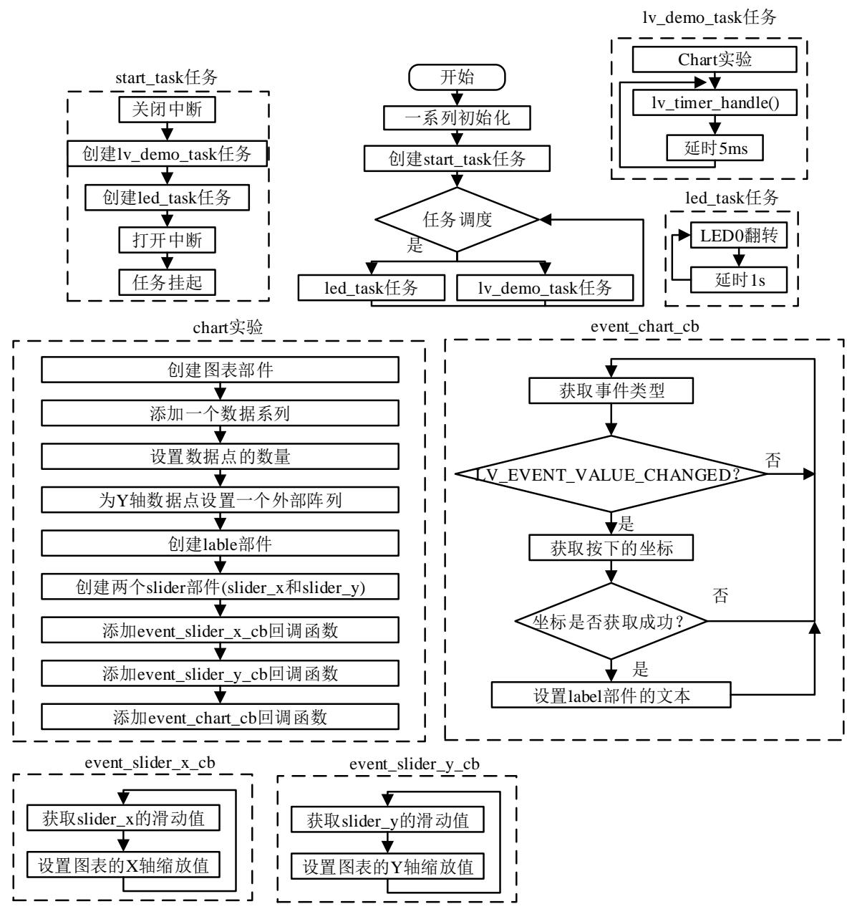  
图26.4.2.1.1图表部件实验流程图

# 26.4.2.2 程序解析

关于LVGL程序主要在lv_mainstart.c文件定义，首先我们看lv_mainstart函数，该函数是LVGL的程序入口，如下源码所示：

```c
/*   
/**   
\* @brief LVGL 演示   
\* @param 无
```

```c
\* @return 无  
\*/  
void lv_mainstart(void)  
{lv_example.chart();}  
/*********** 第一部分 结束 \*\*\*\*\*\*\*\*\*\*\*\*\*\*\*\*\*\*\*\*\*\*\*\*\*\*\*\*\*\*\*\*\*\*\*\*\*\*\*\*\*\*\*\*\*\*\*\*\*\*\*\*\*\*\*\*\*\*\*\*\*\*\*\*\*\*\*\*\*\*\*\*\*\*\*\*\*\*\*\*\*\*\*\*\*\*\*\*\*\*\*\*\*\*\*\*\*\*\*\*\*  
/*********** 第二部分 开始 \*\*\*\*\*\*\*\*\*\*\*\*\*\*\*\*\*\*\*\*\*\*  
/\*  
\* @brief 例\* @param 无\* @return 无\*/  
static void lv_example.chart(void)  
{lv_obj_t\* chart  $=$  lv-chart_create(lv_scr_act());/\*定义并初始化图表\*/lv_obj_set_size chart,scr_ACT_width(),scr_ACT_height()）/\*设置图表大小\*/lv_obj_align chart,LV ALIGN_TOP_LEFT,0,0);/\*设置图表位置\*//\*设置左轴Y方向的最大最小值\*/lv chart_set_rangechart,LV_CHART_AXISPRIMARY_Y,-5，55);lv_obj_set_style_size(charft,0,LV_PART_INDICATOR);/\*不显示数据上的点\*//\*在图表中分配并添加数据系列\*/lv chart_series_t\* ser  $=$  lv chart_add_series(charft,lv Palette_main(LV_PALETTE_RED),LV_CHART_AXISPRIMARY_Y);/\*计算数据线上的新点数\*/uint32_t pcnt  $=$  sizeof的例子_data)/sizeof的例子_data[0]);/\*在图表上设置数据线上的点数\*/lv chart_set_point_count(charft,pcnt);/\*为Y轴数据点设置一个外部阵列\*/lv chart_set_ext_y_array(charft,ser,(lv_coord_t\*)example_data);\*/添加光标\*/lv chart_cursor_t\* cursor  $=$  lv chart_add_cursor(charft,lv Palette_main(LV_PALETTE BLUE),LV_DIR_LEFT|LV_DIR BOTTOM);lv_obj_update.layout(charft);/\*手动更新图表参数\*/label  $=$  lv_label_create(lv_scr_act());/\*定义并创建显示值的标签\*/lv_obj_align (label,LV ALIGN_TOP_LEFT,5,5);/\*设置标签的位置\*//\*设置标签的字体\*/lv_obj_set_style_text.Font (label,&lv_font_montserrat_18,LV_PART_MAIN);lv_label_set_text (label,"");/\*设置标签的文本\*//\*定义并创建x轴缩放滑块\*/
```

```c
lv_obj_t* slider_x = lv_slider_create(lv_scr_act());  
/* 设置滑块范围 */  
lv_slider_set_range(slider_x, LV_IMAGE_ZOOM_NONE, LV_IMAGE_ZOOM_NONE * 10);  
/* 设置滑块回调 */  
lv_obj_add_event_cb(slider_x, event_slider_x_cb, LV_EVENT_VALUE_CHANGED, chart);  
/* 设置滑块宽度 */  
lv_obj_set_width(slider_x, lv_obj_get_width(char) -3.5 * lv_obj_get_height(char) / 10);  
/* 设置滑块高度 */  
lv_obj_set_height(slider_x, lv_obj_get_height(char) / 10);  
/* 设置滑块位置 */  
lv_obj_align_to(slider_x, chart, LVALIGN_bottom_LEFT, lv_obj_get_height(char) / 10, -lv_obj_get_height(char) / 20);  
/* 定义并创建Y轴缩放滑块*/  
lv_obj_t* slider_y = lv_slider_create(lv_scr actu());  
/* 设置滑块范围 */  
lv_slider_set_range(slider_y, LV_IMAGE_ZOOM_NONE, LV_IMAGE_ZOOM_NONE * 10);  
/* 设置滑块回调 */  
lv_obj_add_event_cb(slider_y, event_slider_y_cb, LV_EVENT_VALUE_CHANGED, chart);  
/* 设置滑块宽度 */  
lv_obj_set_width(slider_y, lv_obj_get_height(char) / 10);  
/* 设置滑块高度 */  
lv_obj_set_height(slider_y, lv_obj_get_height(char) -3.5 * lv_obj_get_height(char) / 10);  
lv_obj_align_to(slider_y, chart, LVALIGN_TOP_RIGHT, -lv_obj_get_height(char) / 20, lv_obj_get_height(char) / 10); /*设置滑块位置*/  
/*设置图表回调*/  
lv_obj_add_event_cb chart, event chart cb, LV_EVENT_VALUE_CHANGED, cursor);  
}  
/********** 第二部分 结束**********  
/********** 第三部分 开始**********
```

```c
static void event chart cb (lv_event_t* e)   
{ lv_obj_t* chart  $=$  lv_event_get_target(e); lv_event_code_t code  $=$  lv_event_get_code(e); lv chart cursor_t\* cursor  $=$  (lv chart cursor_t\*)e->user_data; if (LV_EVENT_VALUE_CHANGED  $\equiv =$  code) { uint16_t point_id  $=$  lv chart.get_pressd_point chart); if (LV_CHART_POINT_NON  $! =$  point_id) { lv chart_set_cursor_pointchart, cursor, NULL, point_id); char buf[20]; lv_snprintf(buf,sizeof(buf)，  $(\% d,\% d)$  ，point_id, example_data[point_id]); lv_label_set_text.label，buf); } }   
}   
/\*\* \* @brief X轴滑块回调 \* @param 无 \* @return 无 \*/ static void event_slider_x_cbLv_event_t\* e) { lv_obj_t\* slider_x  $=$  lv_event_get_target(e); lv_obj_t\* chart  $=$  (lv_obj_t\*)e->user_data; lv chart_set_zoom_x chart, lv_slider_get_value(slider_x); }   
/\*\* \* @brief Y轴滑块回调 \* @param 无 \* @return 无 \*/ static void event_slider_y_cbLv_event_t\* e) { lv_obj_t\* slider_y  $=$  lv_event_get_target(e); lv_obj_t\* chart  $=$  (lv_obj_t\*)e->user data; lv chart_set_zoom_y(char,lv_slider_get_value(slider_y)); }
```

上述源码可分为以下三个部分：

(1) lv_mainstart 接口函数。在该函数中，我们调用了图表部件相关的示例函数；  
(2) 图表的基础实现。我们先将外部阵列提供的数据传入到图表中，从而形成曲线，然后创建标签部件，它主要是为了显示按下的坐标点，最后再添加两个滑块，用于控制图表的缩放；  
③ 回调函数处理。event chart cb 回调函数主要用于获取图表的坐标，并在标签部件中显示；event_slider_x_cb 回调函数可以根据 slider_x 的值来缩放图表 X 轴；event_slider_y_cb 回调函数可以根据 slider_y 的值来缩放图表 Y 轴。

# 26.4.3 下载验证

把工程编译并下载到我们的开发板中，运行效果如下图所示：

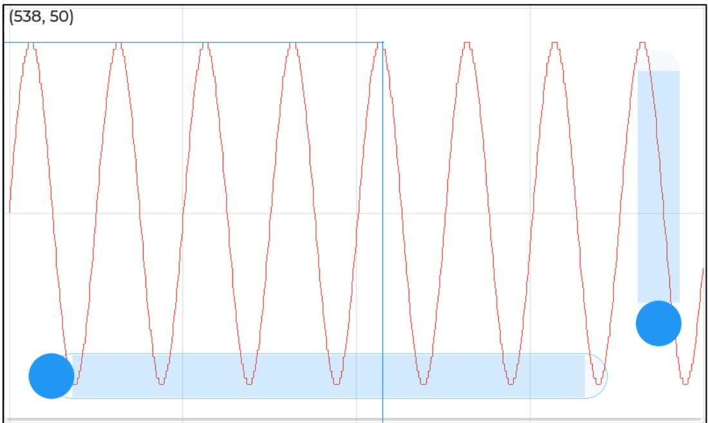  
图26.4.3.1图表部件实验

# 第二十七章 色环部件(lv_colorwheel)

在 UI 设计中，色环部件一般充当颜色选择器的角色，它可以根据色相、饱和度和 RGB 值来进行选择。

本章节将分为以下几个小节：

27.1 色环部件的组成  
27.2 色环部件的相关知识  
27.3色环部件API函数  
27.4色环部件的实验

# 27.1色环部件的组成

色环部件由两个部分组成：

① 主体背景 LV_PART_MAIN;  
② 旋钮 LV_PART_KNOB。

关于部件样式设置的内容，请大家参考6.4.4章节。

# 27.2色环部件的相关知识

# 27.2.1 创建色环部件

色环部件的创建函数如下：

```c
lv_colorwheel_create(parent, knob_recolor); /* 创建色环 */
```

该函数具有两个形参，第一个形参指向父对象，第二个形参代表旋钮的颜色是否设置为当前选择的颜色，如果该形参为true，则旋钮的背景颜色将被设置为当前颜色。

# 27.2.2 设置色环部件的模式

色环部件具有三种模式，这些模式分别控制色相、饱和度和数值，如下表所示：

表 27.2.2.1 色环模式  

<table><tr><td>模式</td><td>描述</td></tr><tr><td>LV_COLORWHEEL_MODE_HUE</td><td>色相（默认模式）</td></tr><tr><td>LV_COLORWHEEL_MODE_SATURATION</td><td>饱和度</td></tr><tr><td>LV_COLORWHEEL_MODE_VALUE</td><td>数值</td></tr></table>

上表中：色相是色彩的第一个特征，是区分各种不同色彩的最准确的标准，如日光通过三棱镜分解出的红、橙、黄、绿、青、紫六种色相；饱和度是指颜色的纯度，如白色到红色的转变；数值是指黑色到某个颜色的数值，比如黑色到红色的过程就是从0到255的数值转变。

接下来，我们以简单示例来理解色环模式的设置，示例代码如下所示：

```c
void lv_mainstart(void)  
{ /*定义并创建色环*/ lv_obj_t* colorwheel = lv_colorwheel_create lv_scr_act(), true); lv_obj_set_size(colorwheel, 100, 100); lv_obj_center(colorwheel); /*设置色环位置*/
```

```txt
lv_obj_update.layout(colorwheel); /* 手动更新色环参数 */
lv_colorwheel_set_mode(colorwheel, LV_COLORWHEEL_MODE_VALUE);
/* 定义并创建色环 */
lv_obj_t* colorwheel1 = lv_colorwheel_create lv_scr_act(), true);
lv_obj_set_size(colorwheel1, 100, 100);
/* 设置色环位置 */
lv_obj_align_to(colorwheel1, colorwheel, LVALIGN_OUT_LEFT_MID, -20, 0);
lv_obj_update.layout(colorwheel1); /* 手动更新色环参数 */
lv_colorwheel_set_mode(colorwheel1, LV_COLORWHEEL_MODE_HUE);
/* 定义并创建色环 */
lv_obj_t* colorwheel2 = lv_colorwheel_create (lv_scr_act(), true);
lv_obj_set_size(colorwheel2, 100, 100);
/* 设置色环位置 */
lv_obj_align_to(colorwheel2, colorwheel, LVALIGN_OUT_RIGHT_MID, 20, 0);
lv_obj_update.layout(colorwheel2); /* 手动更新色环参数 */
lv_colorwheel_set_mode(colorwheel2, LV_COLORWHEEL_MODE_SATURATION);
```

在上述源码中，我们创建了三个色环部件，然后调用lv_colorwheel_set_mode函数，分别设置三个色环部件的模式为数值、色相和饱和度。注意：色相模式的色环在屏幕的左侧，数值模式的色环在屏幕的中间，饱和度的色环在屏幕的右侧。示例代码可以在PC模拟器中运行，效果图如下所示：

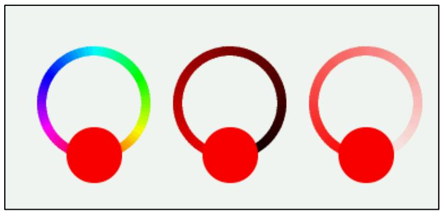  
图27.2.2.1 设置色环的模式

由上图可知：中间和右侧的色环都是红色为基准的，如果用户想修改其他颜色，可调用lv_colorwheel_setrgb函数来进行设置。

# 27.2.3色环部件的事件

色环部件的常用事件类型为LV_EVENT_VALUE_CHANGED。

# 27.3色环部件API函数

LVGL官方提供了一些与色环部件相关API，如下表所示：

<table><tr><td>函数</td><td>描述</td></tr></table>

表 27.3.1 色环部件相关的 API 函数  

<table><tr><td>lv_colorwheel_create()</td><td>创建色环部件</td></tr><tr><td>lv_colorwheel_set_hsv()</td><td>设置色环当前 hsv</td></tr><tr><td>lv_colorwheel_setrgb()</td><td>设置色环的当前 RGB 颜色</td></tr><tr><td>lv_colorwheel_set_mode()</td><td>设置当前的颜色模式</td></tr><tr><td>lv_colorwheel_get_hsv()</td><td>获取色环当前选中的 hsv</td></tr><tr><td>lv_colorwheel_getrgb()</td><td>获取色环当前选定的 RGB 颜色</td></tr><tr><td>lv_colorwheel_get_color_mode()</td><td>获取当前的颜色模式</td></tr></table>

接下来，我们介绍LVGL色环部件常用的API函数：

# 1.lv_colorwheel_create函数

创建色环部件，该函数原型如下所示：

```txt
lv_obj_t *lv_colorwheel_create lv_obj_t * parent, bool knob_recolor);
```

该函数的形参，如下表所示：

表 27.3.2 lv_colorwheel_create 函数形参描述  

<table><tr><td>参数</td><td>描述</td></tr><tr><td>parent</td><td>指向父类对象的指针</td></tr><tr><td>knob_recolor</td><td>旋钮颜色跟随，true：开启</td></tr></table>

返回值：返回色环部件对象。

# 2.lv_colorwheel_set_hsv函数

设置色环的当前 hsv，该函数原型如下所示：

```txt
bool lv_colorwheel_set_hsv(lv_obj_t *obj, lv_color_hsv_t hsv);
```

该函数的形参，如下表所示：

表 27.3.3 lv_colorwheel_set_hsv 函数形参描述  

<table><tr><td>参数</td><td>描述</td></tr><tr><td>obj</td><td>指向色环对象的指针</td></tr><tr><td>hsv</td><td>当前选中的 hsv</td></tr></table>

返回值：true：设置成功，false：设置失败。

# 3.lv_colorwheel_setrgb函数

设置色环的当前 RGB 颜色，该函数原型如下所示：

```txt
bool lv_colorwheel_set_rgb(lv_obj_t *obj, lv_color_t color);
```

该函数的形参，如下表所示：

表 27.3.4 lv_colorwheel_setrgb 函数形参描述  

<table><tr><td>参数</td><td>描述</td></tr><tr><td>obj</td><td>指向色环对象的指针</td></tr><tr><td>color</td><td>当前选中的 RGB 颜色</td></tr></table>

返回值：true：设置成功，false：设置失败。

# 4.lv_colorwheel_set_mode函数

设置当前的颜色模式，该函数原型如下所示：

```c
void lv_colorwheel_set_mode(lv_obj_t *obj, lv_colorwheel_mode_t mode);
```

该函数的形参，如下表所示：

表 27.3.4 lv_colorwheel_set_mode 函数形参描述  

<table><tr><td>参数</td><td>描述</td></tr><tr><td>obj</td><td>指向色环对象的指针</td></tr><tr><td>mode</td><td>颜色模式</td></tr></table>

返回值：无。

# 27.4色环部件的实验

# 27.4.1 硬件设计

# 1. 例程功能

本实验主要测试色环部件 API 函数的使用，实验现象：开机后，屏幕上显示一个色环和圆盘，当用户改变色环当前所选的颜色之后，该颜色会更新到圆盘的背景颜色中。与此同时，LED0 闪烁，提示系统正在运行。

该实验的完整源码，请参考《LVGL例程27lv_colorwheel(色环)》例程，路径：A盘  $\rightarrow 4$  程序源码  $\rightarrow 3$  ，扩展例程  $\rightarrow 4$  ，LVGL例程。

# 27.4.2 软件设计

# 27.4.2.1 程序流程图

本实验的程序流程图，如下图所示：

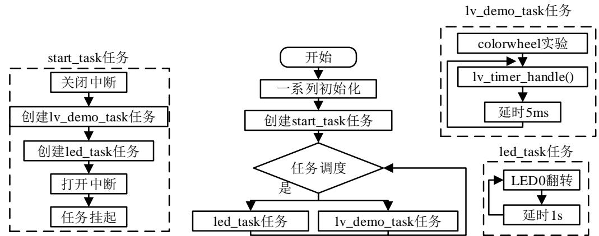

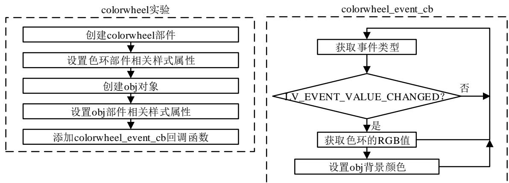  
图27.4.2.1.1色环部件实验流程图

# 27.4.2.2 程序解析

关于LVGL的用户代码，我们都是在lv_mainstart.c文件中编写的，本实验的源码如下所示：

```javascript
/*   
\*/
```

```c
\* @param 无\* @return 无\*/void lv_mainstart(void)  
{lv_example_colorwheel();}  
/****** 第一部分 结束 \*\*\*\*\*\*\*\*\*\*\*\*\*\*\*\*\*\*\*\*\*\*\*\*\*\*\*\*\*\*\*\*\*\*\*\*\*\*\*\*\*\*\*\*\*\*\*\*\*\*\*\*\*\*\*\*\*\*\*\*\*\*\*\*\*\*\*\*\*\*\*\*\*\*\*\*\*\*\*\*\*\*\*\*\*\*\*\*\*\*\*\*\*\*\*\*\*\*\*\*\*  
\*/\* @brief 色环部件实例\* @param 无\* @return 无\*/  
static void lv_example_colorwheel(void)  
{/\* 创建色环（用于选择颜色）\*/lv_obj_t *colorwheel  $=$  lv_colorwheel_create(lv_scr_act(), true);lv_obj_set_size(colorwheel, scr_act_height()  $\star$  2 /3,scr_act_height()  $\star$  2 /3); /\*设置大小\*/lv_obj_center(colorwheel); /\*设置位置\*/lv_obj_set_style.arc_width(colorwheel, scr actu height(  $\star$  0.1,LV_PART_MAIN); /\*设置色环圆弧宽度\*/lv_colorwheel_set_mode_fixcd(colorwheel, true); /\*固定色环模式\*//\* 基础对象（用于显示所选颜色）\*/obj  $=$  lv_obj_create(lv_scr_act()); /\*创建基础对象\*//\*设置大小\*/lv_obj_set_size(obj,scr actu height() /3,scr actu height() /3);lv_obj_align_to(obj,colorwheel,LV ALIGNCENTER,0,0); /\*设置位置\*/lv_obj_set_style_radius(obj,LV RADIUS_CIRCLE,LV_PART_MAIN);/\*设置圆角\*/lv_obj_set_style_bg_color(obj,lv_colorwheel_get_rgb(colorwheel),LV_PART_MAIN); /\*设置背景颜色\*/lv_obj_add_event_cb(colorwheel,colorwheel_event_cb,LV_EVENT_VALUE_CHANGED,NULL); /\*设置色环事件回调\*/}  
/\**\* @brief 色环事件回调\* @param \*e：事件相关参数的集合，它包含了该事件的所有数据\* @return 无\*/  
static void colorwheel_event_cb(lv_event_t \*e)
```

```javascript
{lv_obj_t \*target  $=$  lv_event_get_target(e); /\*获取触发源\*/lv_obj_set_style_bg_color(obj，lv_colorwheel_getrgb(target),LV_PART_MAIN); /\*设置基础对象背景颜色\*/}
```

上述源码可分为以下两个部分：

① lv_mainstart 接口函数。在该函数中，我们调用了色环部件相关的示例函数；  
② 色环颜色更新到圆盘背景。我们先创建色环部件以及基础对象（圆盘），然后为色环部件添加回调函数。当色环的值发生变化时，将会触发事件回调，在事件的回调函数中，我们获取色环的RGB值，然后将其设置为基础对象（圆盘）的背景颜色。

# 27.4.3 下载验证

把工程编译并下载到我们的开发板中，运行效果如下图所示：

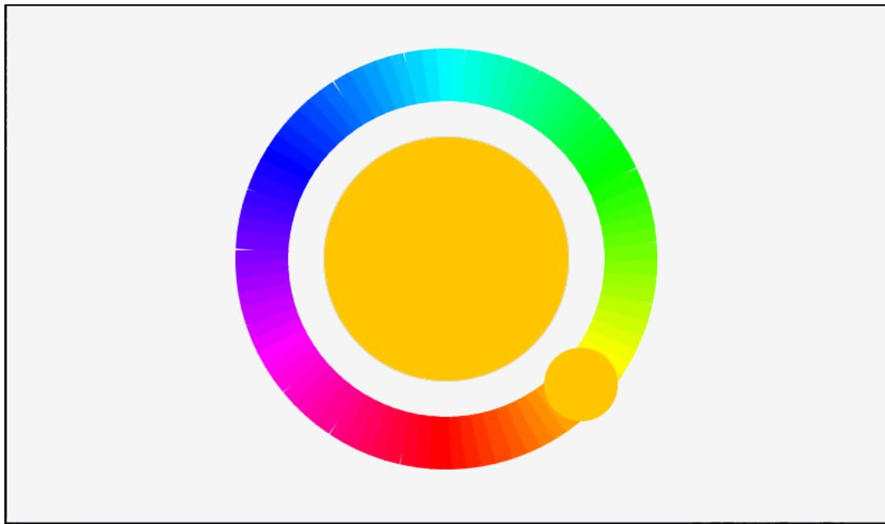  
图27.4.3.1色环部件实验

当用户转动上图色环的旋钮时，中间基础对象（圆盘）的背景颜色会随之变化。

# 第二十八章 图片按钮部件(Iv_imgbtn)

图片按钮部件和按钮部件是非常相似的，它只不过是在按钮部件的基础上增加了图片显示的功能。

本章节将分为以下几个小节：

28.1 图片按钮部件的组成  
28.2 图片按钮部件的相关知识  
28.3 图片按钮部件 API 函数  
28.4 图片按钮部件实验

# 28.1 图片按钮部件的组成

图片按钮部件只有一个组成部分：主体LV_PART_MAIN。关于部件样式设置的内容，请大家参考6.4.4章节。

# 28.2 图片按钮部件的相关知识

# 28.2.1 图片的来源

图片按钮部件支持C语言数组或者外部存储器读取图片源，值得注意的是，它并不支持图标字体。关于图片源的获取，请大家回顾17.2.1章节。

接下来，我们以简单示例来理解图片源的设置，示例代码如下所示：

```txt
LV_IMAGE_DECLARE(img_zdyz);  
void lv_mainstart(void)  
{  
/* 定义并创建图片按钮 */lv_obj_t* imgBTN = lv_imgbtn_create(lv_scr_act());  
/* 设置图片释放时的图片 */lv_imgbtn_set_src(imgBTN, LV_IMGBTN_STATEreleased, NULL, &img_zdyz, NULL);  
/* 设置图片按钮大小 */lv_obj_set_size(imgBTN, 100, 100);  
/* 设置图片按钮位置 */lv_obj_center(imgBTN);lv_obj_set_style.img_recolor_opa(imgBTN, LV_OPA_30, LV_STATElongleftrightarrow);lv_obj_set_style.img_recolor(imgBTN, lv_color_white(), LV_STATElongleftrightarrow);lv_obj_set_styletranslate_y(imgBTN, 5, LV_STATElongleftrightarrow);  
}
```

在上述源码中，我们先调用lv_imgbtn_create函数创建图片按钮部件，然后调用lv_imgbtn_set_src函数设置图片源，该函数的第二个形参代表按钮的状态（图片何时生效），第三~五个形参为图片源，一般情况下，第三个和第五个形参设置为NULL。注意：图片源必须声明后才能使用。示例代码可以在PC模拟器中运行（需要有图片源），效果图如下所示：

  
图28.2.1.1设置图片源

当我们按下上图中的图片时，该图片会重新着色并往y轴偏移5个像素，如下图所示：

  
图28.2.1.2按下时的状态

# 28.2.2 添加/清除的状态

图片按钮部件支持六个状态，如下所示：

① LV_IMGBTN_STATElongleftrightarrow：释放状态；  
② LV_IMGBTN_STATElongleftrightarrow：按下状态；  
③ LV ImagBTN_STATE DISABLED：禁用状态；  
④ LV_IMGBTN_STATE_CHECKED_RELEASED：点击释放状态；  
(5) LV_IMGBTN_STATE_CHECKEDlongleftrightarrow: 点击按下状态;  
⑥ LV ImagBTN_STATE_CHECKED DISABLED：点击禁用状态；

如果用户想清除或者添加上述的状态，可调用lv_obj_add/clear_state函数进行设置。

# 28.3 图片按钮部件 API 函数

LVGL官方提供了一些与图片按钮部件相关API，如下表所示：

表 28.3.1 图片按钮部件相关的 API 函数  

<table><tr><td>函数</td><td>描述</td></tr><tr><td>lv_imgbtn_create()</td><td>创建图片按钮部件</td></tr><tr><td>lv_imgbtn_set_src()</td><td>设置图片源</td></tr><tr><td>lv_imgbtn_set_state()</td><td>设置图片按钮的状态</td></tr><tr><td>lv_imgbtn_get_src_left()</td><td>获取给定状态下的左侧图片</td></tr><tr><td>lv_imgbtn_get_src_middle()</td><td>获取给定状态下的中间图片</td></tr><tr><td>lv_imgbtn_get_src_right()</td><td>获取给定状态下的右侧图片</td></tr></table>

接下来，我们介绍LVGL图片按钮部件常用的API函数：

# 1.lv_imgbtn_create函数

创建图片按钮部件，该函数原型如下所示：

```txt
lv_obj_t * lv_imgbtn_create lv_obj_t * parent);
```

该函数的形参，如下表所示：

表 28.3.2 lv_imgbtn_create 函数形参描述  

<table><tr><td>参数</td><td>描述</td></tr><tr><td>parent</td><td>指向父对象的指针</td></tr></table>

返回值：指向图片按钮对象的指针。

# 2.lv_imgbtn_set_src函数

设置图片源，该函数原型如下所示：

```c
void lv_imgbtn_set_srcLv_obj_t \*imgbtn, lv_imgbtn_state_t state, const void \*src_left, const void \*src_mid, const void \*src_right);
```

该函数的形参，如下表所示：

表 28.3.3 lv_imgbtn_set_src 函数形参描述  

<table><tr><td>参数</td><td colspan="2">描述</td></tr><tr><td>imgBTN</td><td colspan="2">指向图片按钮对象的指针</td></tr><tr><td rowspan="7">state</td><td colspan="2">状态</td></tr><tr><td>LV_IMGBTN_STATEreleased</td><td>释放状态</td></tr><tr><td>LV_IMGBTN_STATElongleftrightarrow</td><td>按下状态</td></tr><tr><td>LV_IMGBTN_STATE DISABLED</td><td>禁用状态</td></tr><tr><td>LV_IMGBTN_STATE_CHECKEDlongleftrightarrow</td><td>点击释放状态</td></tr><tr><td>LV_IMGBTN_STATE_CHECKEDlongleftrightarrow</td><td>点击按下状态</td></tr><tr><td>LV_IMGBTN_STATE_CHECKED DISABLED</td><td>点击禁用状态</td></tr><tr><td>src_left</td><td colspan="2">指向按钮左侧的图片源的指针(C数组或文件路径)</td></tr><tr><td>src_mid</td><td colspan="2">指向按钮中间的图片源的指针(C数组或文件路径)</td></tr><tr><td>src_right</td><td colspan="2">指向按钮右侧的图片源的指针(C数组或文件路径)</td></tr></table>

返回值：无。

# 3.lv_imgbtn_set_state函数

设置图片按钮部件的状态，该函数原型如下所示：

```c
void lv_imgbtn_set_state lv_obj_t *imgbtn, lv_imgbtn_state_t state);
```

该函数的形参，如下表所示：

表 28.3.4 lv_imgbtn_set_state 函数形参描述  

<table><tr><td>参数</td><td>描述</td></tr><tr><td>imgBTN</td><td>指向图片按钮对象的指针</td></tr><tr><td>state</td><td>图片按钮状态</td></tr></table>

返回值：无。

# 28.4 图片按钮部件实验

# 28.4.1 硬件设计

# 1. 例程功能

本实验主要测试图片按钮部件 API 函数的使用，实验现象：开机后，屏幕上显示 3 个图片按钮，点击图片按钮可以切换当前状态（图片重新着色）。与此同时，LED0 闪烁，提示系统正在运行。

该实验的完整源码，请参考《LVGL例程28lv_imgbtn(图片按钮)》例程，路径：A盘  $\rightarrow 4$  程序源码  $\rightarrow 3$  ，扩展例程  $\rightarrow 4$  ，LVGL例程。

# 28.4.2 软件设计

# 28.4.2.1 程序流程图

本实验的程序流程图，如下图所示：

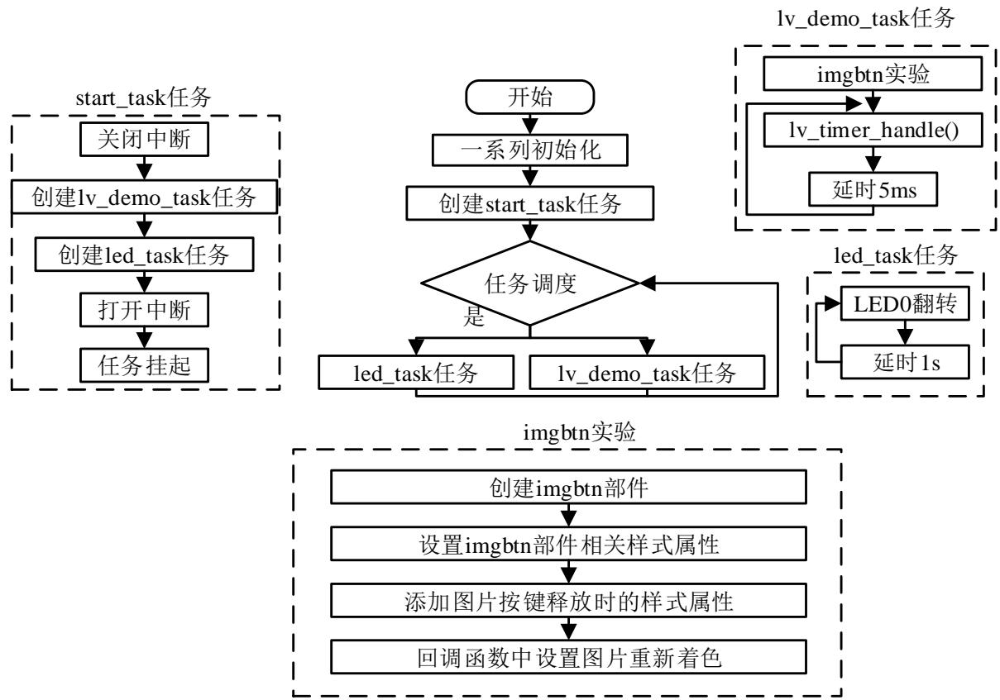  
图28.4.2.1.1图片按钮部件实验流程图

# 28.4.2.2 程序解析

关于LVGL的用户代码，我们都是在lv_mainstart.c文件中编写的，本实验的源码如下所示：

```javascript
/*   
\*/
```

```c
\* @param 无\* @return 无\*/void lv_mainstart(void)  
{lv_example_imgbtn();  
}  
/\*\*\*\*\*\*\*\*\*\*\*\*\*\*\*\*\*\*\*\*\*\*\*\*\*\*\*\*\*\*\*\*\*\*\*\*\*\*\*\*\*\*\*\*\*\*\*\*\*\*\*\*\*\*\*\*\*\*\*\*\*\*\*\*\*\*\*\*\*\*\*\*\*\*\*\*\*\*\*\*\*\*\*\*\*\*\*\*\*\*\*\*\*\*\*\*\*\*\*\*\*  
/\*\*\*\*\*\*\*\*\*\*\*\*\*\*\*\*\*\*\*\*\*  
/\*\*\*\*\*\*\*\*\*\*  
/\*\* @brief 制冷按钮事件回调\* @param \*e：事件相关参数的集合，它包含了该事件的所有数据\* @return 无\*/  
static void cool_event_cb(lv_event_t \*e)  
{lv_obj_t \*target  $=$  lv_event_get_target(e); /\*获取触发源\*/if(cool_mode_state  $= = 0$  /\*判断按钮状态，如果为0，即关闭状态\*/{cool_mode_state  $= 1$  /\*切换按钮状态\*//\*设置图片重新着色透明度\*/lv_obj_set_style.img_recolor_opa(target，255，0);/\*设置图片重新着色：蓝色\*/lv_obj_set_style.img_recolor(target，lv_color_hex(0x00a9ff)，0);1else/\*按钮为开启状态\*/{cool_mode_state  $= 0$  /\*切换按钮状态\*//\*设置图片重新着色透明度\*/lv_obj_set_style.img_recolor_opa(target，255，0);/\*设置图片重新着色：灰色\*/lv_obj_set_style.img_recolor(target，lv_color_hex(0x8a8a8a)，0);1  
}  
/\*  
\* @brief 制暖按钮事件回调\* @param \*e：事件相关参数的集合，它包含了该事件的所有数据\* @return 无\*/  
static void warm_event_cb(lv_event_t \*e)
```

```txt
{lv_obj_t \*target  $=$  lv_event_get_target(e); /\*获取触发源\*/if(warm_mode_state  $\equiv 0$  /\*判断按钮状态，如果为0，即关闭状态\*/{warm_mode_state  $= 1$  /\*切换按钮状态\*//\*设置图片重新着色透明度\*/lv_obj_set_style.img_recolor_opa(target,255,0);/\*设置图片重新着色：红色\*/lv_obj_set_style.img_recolor(target,lv_color(hex(0xff0000),0);1}else{warm_mode_state  $= 0$  /\*切换按钮状态\*//\*设置图片重新着色透明度\*/lv_obj_set_style.img_recolor_opa(target,255,0);\*\*设置图片重新着色：灰色\*/lv_obj_set_style.img_recolor(target,lv_color(hex(0x8a8a8a),0);1}  
\*/\*\*@brief干燥按钮事件回调\* @param \*e：事件相关参数的集合，它包含了该事件的所有数据\* @return无\*/static void dry_event_cb(lv_event_t \*e)  
{lv_obj_t \*target  $=$  lv_event_get_target(e); /\*获取触发源\*/if(dry_mode_state  $\equiv 0$  /\*判断按钮状态，如果为0，即关闭状态\*/{dry_mode_state  $= 1$  /\*切换按钮状态\*//\*设置图片重新着色透明度\*/lv_obj_set_style.img_recolor_opa(target,255,0);\*\*设置图片重新着色：蓝色\*/lv_obj_set_style.img_recolor(target,lv_color.hex(0x00a9ff)，0);1}else/\*按钮为开启状态\*/{dry_mode_state  $= 0$  /\*切换按钮状态\*//\*设置图片重新着色透明度\*/lv_obj_set_style.img_recolor_opa(target,255,0);
```

```txt
/\*设置图片重新着色：灰色\*/lv_obj_set_style_img_recolor(target，lv_color.hex(0x8a8a8a)，0);1}  
\*/\*\*@brief 图片按钮实例\* @param 无\* @return 无\*/static void lv_example_imgbtn(void)  
{/\*根据活动屏幕宽度选择字体\*/if (scr_act_width() <= 480){font  $=$  &lv.Font_montserrat_14;1else{font  $=$  &lv.Font_montserrat_22;1/\*基础对象（用作背景）\*/lv_obj_t \*obj  $=$  lv_obj_create(lv_scr_act());/\*创建基础对象\*/lv_obj_set_size(obj,scr_act_width(-10,200);\*/设置大小\*/lv_obj_align(obj,LV ALIGNCENTER,0,0);/\*设置位置\*//\*制冷模式（图片按钮）\*/lv_obj_t \*imgbtn_cool  $=$  lv_imgbtn_create(obj);\*/创建图片按钮\*/lv_imgbtn_set_src(imgbtn_cool，LV_IMGBTN_STATE_RELEASED，NULL,&img_cool，NULL);/\*设置图片源\*/lv_obj_set_size(imgbtn_cool,64,64);/\*设置大小\*//\*设置位置\*/lv_obj_align(imgbtn_cool，LV ALIGN CENTER，-scr act width(/3,-15);\*/添加事件\*/lv_obj_add_event_cb(imgbtn_cool，cool_event_cb，LV_EVENTlongleftrightarrow，NULL);/\*制冷模式（标签）\*/lv_obj_t \*label_cool  $=$  lv_label_create(obj);/\*创建标签\*/lv_label_set_text.labelcale,"Cool");/\*设置文本\*/lv_obj_set_style_text.Font label�cool，font，0);/\*设置字体\*//\*设置位置\*/lv_obj_align_to labelled_cool，imgbtn_cool，LV_ALIGN_OUT BOTTOM_MID，0，10);
```

/\*制暖模式（图片按钮） \*/  
```c
lv_obj_t *imgbtn_warm = lv_imgbtn_create(obj); /* 创建图片按钮 */
lv_imgbtn_set_src(imgbtn_warm, LV_IMGBTN_STATE_RELEASED,
NULL, &img_warm, NULL); /* 设置图片源 */
lv_obj_set_size(imgbtn_warm, 64, 64); /* 设置大小 */
lv_obj_align(imgbtn_warm, LVALIGN_CENTER, 0, -15); /* 设置位置 */
/* 添加事件 */
lv_obj_add_event_cb(imgbtn_warm, warm_event_cb, LV_EVENTPressed, NULL);
```

/\*制暖模式（标签） \*/  
```txt
lv_obj_t *label_warm = lv_label_create(obj); /* 创建标签 */
lv_label_set_text.label_warm, "Warm"); /* 设置文本 */
lv_obj_set_style_text.Font.label_warm, font, 0); /* 设置字体 */
/* 设置位置 */
lv_obj_align_to.label_warm, imgBTN_warm, LVALIGN_OUT BOTTOM_MID, 0, 10);
```

$/ \star$  干燥模式（图片按钮）  $\star /$  
```c
lv_obj_t *imgbtn_dry = lv_imgbtn_create(obj); /* 创建图片按钮 */
lv_imgbtn_set_src(imgbtn_dry, LV_IMGBTN_STATE_RELEASED, NULL, & img_dry, NULL); /* 设置图片源 */
lv_obj_set_size(imgbtn_dry, 64, 64); /* 设置大小 */
```

/\*设置位置\*/  
```c
lv_obj_align(imgbtn_dry，LVALIGN_CENTER，scr_act_width() / 3，-15）;  
/*添加事件*/  
lv_obj_add_event_cb(imgbtn_dry，dry_event_cb，LV_EVENTlongleftrightarrow，NULL);
```

/\*干燥模式（标签） \*/  
```javascript
lv_obj_t *label_dry = lv_label_create(obj); /* 创建标签 */
lv_label_set_text.label_dry, "Dry"); /* 设置文本 */
lv_obj_set_style_text.Font.label_dry, font, 0); /* 设置字体 */
/* 设置位置 */
lv_obj_align_to.label_dry, imgBTN_dry, LVALIGN_OUT BOTTOM_MID, 0, 10);
```

/\*线条（分割线）  $\star /$  
```c
lv_obj_t *line_left = lv_line_create(obj); /* 创建线条 */
lv_line_set_points(line_left, linepoints, 2); /* 设置线条坐标点 */
lv_obj_set_style_line_color(line_left, lv_color(hex(0xc6c6c6), LV_STATE_DEFAULT); /* 设置线条颜色 */
/* 设置位置 */
lv_obj_align(line_left, LVALIGN_CENTER, -scract_width(/6, 0));
```

```c
lv_line_set_points(line_right，linepoints，2); /\*设置线条坐标点\*/lv_obj_set_style_line_color(line_right，lv_color(hex(0xc6c6c6)，LV_STATE_DEFAULT); /\*设置线条颜色\*//\*设置位置\*/lv_obj_align(line_right，LVALIGN_CENTER，scr_act_width(/6,0);1/****** 第二部分 结束 \*\*\*\*\*\*\*\*\*\*\*\*\*\*\*\*\*\*\*\*\*\*\*\*\*\*\*\*\*\*\*\*\*\*\*\*\*\*\*\*\*\*\*\*\*\*\*\*\*\*\*\*\*\*\*\*\*\*\*\*\*\*\*\*\*\*\*\*\*\*\*\*\*\*\*\*\*\*\*\*\*\*\*\*\*\*\*\*\*\*\*\*\*\*\*\*\*\*\*\*\*
```

上述源码可分为以下两个部分：

① lv_mainstart 接口函数。在该函数中，我们调用了图片按钮部件相关的示例函数；  
② 图片按钮状态切换的实现。我们先根据活动屏幕的宽度来选择字体大小，创建出基础对象作为背景，然后分别创建制冷、制暖和干燥模式图片按钮，并为它们分别添加事件回调。当某个图片按钮被按下时，会触发事件回调，在回调函数中，我们会根据按钮的当前状态来切换重新着色的颜色，这样就可以达到图片按钮状态切换的效果。

# 28.4.3 下载验证

把工程编译并下载到我们的开发板中，切换状态后的图片按钮如下图所示：

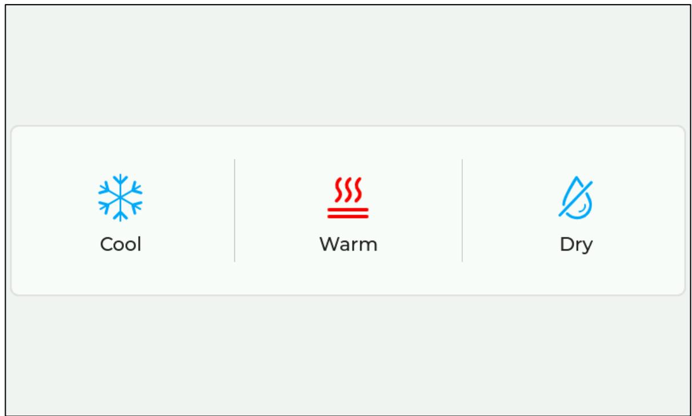  
图28.4.3.1图片按钮部件实验

# 第二十九章 键盘部件 lv_keyboard

键盘部件本质上是一个特殊的按钮矩阵，它具有预定义的键映射和逻辑处理，从而实现文本的输入功能。

本章节将分为以下几个小节：

29.1 键盘部件的组成  
29.2 键盘部件的相关知识  
29.3 键盘部件 API 函数  
29.4 键盘部件实验

# 29.1 键盘部件的组成

键盘部件与按钮矩阵的组成类似，一共有两个部分：

① LV_PART_MAIN：主体背景；  
② LV_PART_items: 按钮。

关于部件样式设置的内容，请大家参考6.4.4章节。

# 29.2 键盘部件的相关知识

# 29.2.1 键盘部件模式

键盘部件内嵌了多种输入模式：大写字母、小写字母和特殊字符等，用户可以触摸相应的按键进行模式切换。如果用户需要手动切换输入模式，可调用lv_keyboard_set_mode函数进行设置，该函数的第二个形参代表要切换的输入模式，这些模式的枚举如下所示：

① LV_KEYBOARD_MODE_TEXT_LOWER：小写字母；  
② LV_KEYBOARD_MODE_TEXT_UPPER: 大写字母;  
③ LV_KEYBOARD_MODE_TEXT_SPECIAL：特殊字符；  
④ LV_KEYBOARD_MODE_NUMBER：数字键盘。

默认情况下，键盘部件为LV_KEYBOARD_MODE_TEXT_LOWER模式。

# 29.2.2 指定文本区域

在默认的情况下，键盘部件没有与任何输入框关联，此时，即使用户输入内容，这些内容并不会更新到输入框中，因此，如果我们想要把键盘输入的内容传入在文本区域部件当中，就必须调用lv_keyboard_set_textarea函数，把键盘和文本区域部件关联起来。

接下来，我们以简单示例来理解键盘和文本框的关联，示例代码如下所示：

```c
define scr_act_width() lv_obj_get_width(lv_scr_act())
#define scr actu heightlv_obj_get_heightLv_scract()
void lv_mainstart(void)
\*/定义并创建键盘 \*/lv_obj_t* keyboard  $=$  lvKeyboard_create(lv_scr_act());/\*定义并创建文本框\*/
```

```c
lv_obj_t* texture area = lv_textarea_create lv_scr_act();  
/* 设置文本框宽度 */  
lv_obj_set_width(textarea, scr(act_width() - 10);  
/* 设置文本框高度 */  
lv_obj_set_height(textarea, (scr(act_height() >> 1) - 10);  
lv_obj_align(textarea, LVALIGN_TOP_LEFT, 0, 0);  
/* 为键盘指定一个文本区域 */  
lv(keyboard_set_textarea(keyboard, textarea);
```

在上述源码中，我们先创建键盘部件和文本区域部件，然后设置文本区域部件的相关属性，最后调用lv(keyboard_set_textarea函数，为键盘指定一个文本区域，这样即可将它们关联起来。示例代码可以在PC模拟器中运行，效果图如下所示：

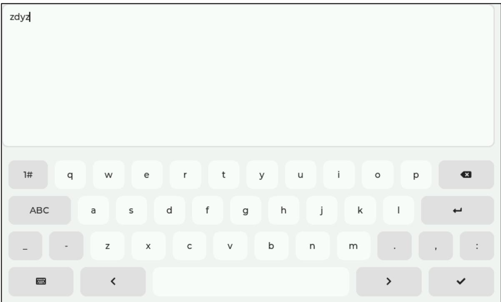  
图29.2.2.1键盘和文本区域关联

# 29.2.3 按键弹窗设置

按键弹窗指的是当用户按下键盘中的某一个按键时，突出显示该按键的文本，效果图如下所示：

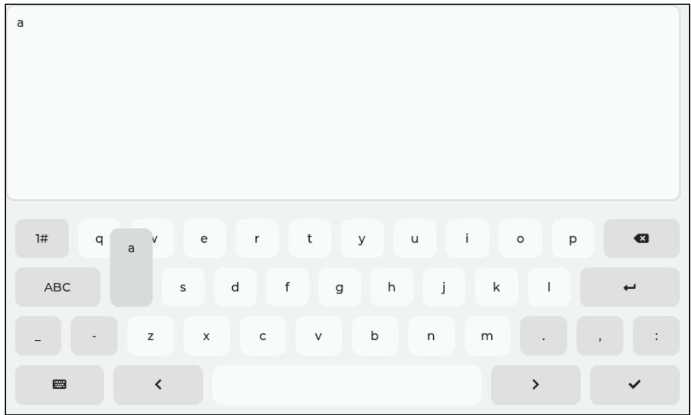  
图29.2.3.1设置按键弹窗

用户需要开启按键弹窗，可调用lv_keyboard_set_popovers(keyboard, true)函数进行设置，该函数的第二个形参为true，则代表启用按键弹窗。

# 29.3 键盘部件 API 函数

LVGL官方提供了一些与键盘部件相关API，如下表所示：

表 29.3.1 键盘部件相关的 API 函数  

<table><tr><td>函数</td><td>描述</td></tr><tr><td>lv(keyboard_create()</td><td>创建键盘部件</td></tr><tr><td>lv(keyboard_set_textarea()</td><td>指定文本区域</td></tr><tr><td>lv(keyboard_set_mode()</td><td>设置键盘模式</td></tr><tr><td>lv(keyboard_set_popovers()</td><td>设置按键弹窗</td></tr><tr><td>lv(keyboard_set_map()</td><td>设置一个新的按键映射</td></tr><tr><td>lv(keyboard_get_textarea()</td><td>获取键盘关联的文本区域对象</td></tr><tr><td>lv(keyboard_get_mode()</td><td>获取键盘模式</td></tr><tr><td>lv_btnmatrix_get_popovers()</td><td>判断是否启用按键弹窗</td></tr><tr><td>lv(keyboard_get_map_array()</td><td>获取键盘的当前按键映射</td></tr><tr><td>lv(keyboard_get_selected_btn()</td><td>获取按下的按键索引</td></tr><tr><td>lv(keyboard_get_btn_text()</td><td>获取按下的按键文本</td></tr><tr><td>lv(keyboard_def_event_cb()</td><td>添加字符到文本区域和改变映射</td></tr></table>

接下来，我们介绍LVGL键盘部件常用的API函数：

# 1.lv_imgbtn_create函数

创建键盘部件，该函数原型如下所示：

```txt
lv_obj_t * lv_keyboard_createLv_obj_t \* parent);
```

该函数的形参，如下表所示：

<table><tr><td>参数</td><td>描述</td></tr><tr><td>parent</td><td>指向父对象的指针</td></tr></table>

# 表 29.3.2 lv_keyboard_create 函数形参描述

返回值：指向键盘部件的指针。

# 2.lv(keyboard_set_textarea函数

指定文本区域，该函数原型如下所示：

```c
void lv(keyboard_set_textarea(lv_obj_t *kb, lv_obj_t *ta);
```

该函数的形参，如下表所示：

表 29.3.3 lv_keyboard_set_textarea 函数形参描述  

<table><tr><td>参数</td><td>描述</td></tr><tr><td>kb</td><td>指向键盘对象的指针</td></tr><tr><td>ta</td><td>指向要关联的文本区域对象的指针</td></tr></table>

返回值：无。

# 3.lvkeyboard_set_mode函数

设置键盘模式，该函数原型如下所示：

```txt
void lv_keyboard_set_mode( lv_obj_t *kb, lv_keyboard_mode_t mode);
```

该函数的形参，如下表所示：

表 29.3.4 lv_keyboard_set_mode 函数形参描述  

<table><tr><td>参数</td><td colspan="2">描述</td></tr><tr><td>kb</td><td colspan="2">指向键盘对象的指针</td></tr><tr><td rowspan="7">mode</td><td colspan="2">键盘的模式选择</td></tr><tr><td>LV_KEYBOARD_MODE_TEXT_LOWER</td><td>小写字母键盘</td></tr><tr><td>LV_KEYBOARD_MODE_TEXT_UPPER</td><td>大写字母键盘</td></tr><tr><td>LV_KEYBOARD_MODE_TEXT_SPECIAL</td><td>特殊字符键盘</td></tr><tr><td>LV_KEYBOARD_MODE_NUMBER</td><td>数字键盘</td></tr><tr><td>LV_KEYBOARD_MODE_USER_1</td><td rowspan="2">自定义模式</td></tr><tr><td>LV_KEYBOARD_MODE_USER_4</td></tr></table>

返回值：无。

# 4.lvkeyboard_set_popovers函数

设置按键弹窗，该函数原型如下所示：

```c
void lv_keyboard_set_popovers(lv_obj_t *kb, bool en);
```

该函数的形参，如下表所示：

表 29.3.5 lv_keyboard_set_popovers 函数形参描述  

<table><tr><td>参数</td><td>描述</td></tr><tr><td>kb</td><td>指向键盘对象的指针</td></tr><tr><td>en</td><td>true:启动弹窗; false:禁用弹窗</td></tr></table>

返回值：无。

# 5.lvKeyboard_set_map函数

设置一个新的按键映射，该函数原型如下所示：

```c
void lv_keyboard_set_map(lv_obj_t *kb, lv_keyboard_mode_t mode, const char *map[], const lv_btnmatrix_ctrl_t ctrl_map());
```

该函数的形参，如下表所示：

```txt
参数 描述
```

表 29.3.6 lv_keyboard_set_map 函数形参描述  

<table><tr><td>kb</td><td colspan="2">指向键盘对象的指针</td></tr><tr><td rowspan="7">mode</td><td colspan="2">键盘的模式选择</td></tr><tr><td>LV_KEYBOARD_MODE_TEXT_LOWER</td><td>小写字母键盘</td></tr><tr><td>LV_KEYBOARD_MODE_TEXT_UPPER</td><td>大写字母键盘</td></tr><tr><td>LV_KEYBOARD_MODE_TEXT_SPECIAL</td><td>特殊字符键盘</td></tr><tr><td>LV_KEYBOARD_MODE_NUMBER</td><td>数字键盘</td></tr><tr><td>LV_KEYBOARD_MODE_USER_1</td><td rowspan="2">自定义模式</td></tr><tr><td>LV_KEYBOARD_MODE_USER_4</td></tr><tr><td>map</td><td colspan="2">指向描述映射的字符串数组的指针</td></tr><tr><td>ctrl_map</td><td colspan="2">要设置新的 map</td></tr></table>

返回值：无。

# 29.4 键盘部件实验

# 29.4.1 硬件设计

# 1. 例程功能

本实验主要测试键盘部件 API 函数的使用，实验现象：开机后，屏幕上显示一个文本框和键盘，用户可以在文本框中输入内容，用户按下“键盘”图标即可切换键盘模式。与此同时，LED0 闪烁，提示系统正在运行。

该实验的完整源码，请参考《LVGL 例程 29 lv_keyboard(键盘)》例程，路径：A 盘  $\rightarrow 4$ ，程序源码  $\rightarrow 3$ ，扩展例程  $\rightarrow 4$ ，LVGL 例程。

# 29.4.2 软件设计

# 29.4.2.1 程序流程图

本实验的程序流程图，如下图所示：

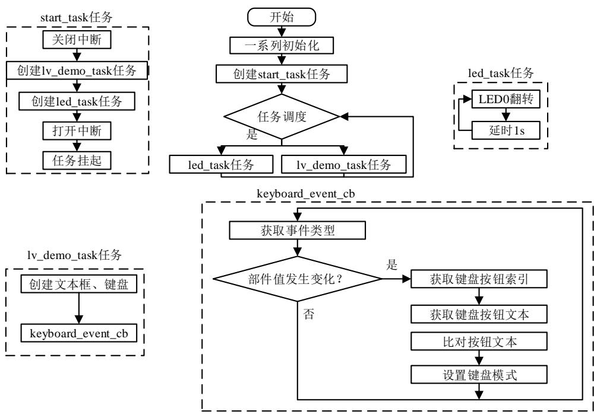  
图29.4.2.1.1键盘部件实验流程图

# 29.4.2.2 程序解析

关于LVGL的用户代码，我们都是在lv_mainstart.c文件中编写的，本实验的源码如下所示：

```c
/\*\*\*\*\*\*\*\*\*\*\*\*\*\*\*\*\*\*\*\*\*\*\*\*\*\*\*\*\*\*\*\*\*\*\*\*\*\*\*\*\*\*\*\*\*\*\*\*\*\*\*\*\*\*\*\*\*\*\*\*\*\*\*\*\*\*\*\*\*\*\*\*\*\*\*\*\*\*\*\*\*\*\*\*\*\*\*\*\*\*\*\*\*\*\*\*\*\*\*\*\*  
\*/  
\* @brief LVGL 演示  
\* @param 无  
\* @return 无  
\*/  
void lv_mainstart(void)  
{lv_example_keyboard();}  
\*/\*\*\*\*\*\*\*\*\*\*\*\*\*\*\*\*\*\*\*\*\*\*第一部分结束\* \(\text{串串串串串串串串串串串串串串串串串串串串串串串串串串串串串串串串串串串串串串串串串串串串串串串串串串串串串串串串串串串串串串串串串串串串串串串串串串串串串串串串串串串串串串串串串串串串串串串串串串串串
```

```c
lv_event_code_t code = lv_event_get_code(e); /* 获取事件类型 */
lv_obj_t *target = lv_event_get_target(e); /* 获取触发源 */
if (code == LV_EVENT_VALUE_CHANGED)
{
/* 获取键盘按钮索引 */
uint16_t id = lv_btnmatrix_get_selected_btn(target);
/* 获取按钮文本 */
const char *txt = lv_btnmatrix_get_btn_text(target, id);
if (strcmp(txt, LV_SYMBOL_KEYBOARD) == 0) /* 判断是不是键盘图标被按下 */
{
/* 获取当前键盘模式，判断是否为数字模式 */
if (lv_keyboard_get_mode(target) == LV_KEYBOARD_MODE_NUMBER)
{
/* 如果是数字模式，则切换为小写字母模式 */
lv_keyboard_set_mode(target, LV_KEYBOARD_MODE_TEXT_LOWER);
}
else
{
/* 不是数字模式，则切换为数字模式 */
lv_keyboard_set_mode(target, LV_KEYBOARD_MODE_NUMBER);
}
}
}
}
/**
* @brief 键盘实例
* @param 无
* @return 无
*/
static void lv_example-keyboard(void)
{
/* 文本框 */
lv_obj_t *textarea = lv_textarea_create(lv_scr_act());
/* 创建文本框 */
/* 设置大小 */
lv_obj_set_size(textarea, scr actu_width() - 10, scr actu_height() / 2 - 10);
lv_obj_align(textarea, LV ALIGN_TOP_MID, 0, 0); /* 设置位置 */
/* 键盘 */
lv_obj_t *keyboard = lvKeyboard_create(lv_scr actu());
/* 创建键盘 */
lvKeyboard_set_textarea(keyboard, textarea); /* 关联键盘和文本框 */
```

```c
lv_obj_add_event_cb(keyboard,keyboard_event_cb, LV_EVENT_VALUE_CHANGED，NULL）； /\*设置键盘事件回调\*/   
\*/
```

上述源码可分为以下两个部分：

① lv_mainstart 接口函数。在该函数中，我们调用了键盘部件相关的示例函数；  
(2) 文本输入和键盘模式切换的实现。我们创建了文本框以及键盘部件，并将它们关联起来，然后为键盘部件添加了事件回调。在回调函数中，我们先判断事件的类型，如果类型是部件的值发生了变化（即键盘有按钮按下），就将按钮索引和文本获取回来，然后判断文本的内容，若文本为“键盘图标”，则切换键盘的模式。

# 29.4.3 下载验证

把工程编译并下载到我们的开发板中，运行效果如下图所示：

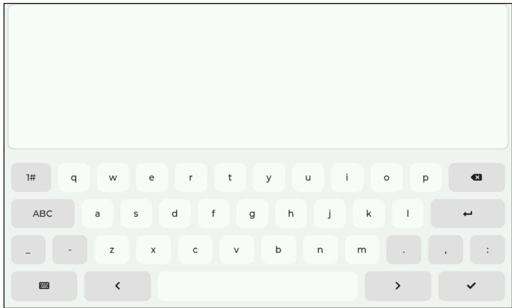  
图29.4.3.1键盘部件实验界面

# 第三十章 LED 部件(lv_led)

LED部件常用于指示硬件的状态，它的亮度与背景颜色深度有关，亮度越低，对应的背景颜色越深。

本章节将分为以下几个小节：

30.1 LED部件的组成  
30.2 LED部件的相关知识  
30.3 LED部件API函数  
30.4 LED部件实验

# 30.1 LED部件的组成

LED部件只有一个组成部分：主体LV_PART_MAIN。关于部件样式设置的内容，请大家参考6.4.4章节。

# 30.2 LED部件的相关知识

# 30.2.1 设置LED颜色

在默认的情况下，LED部件的主体颜色为蓝色，如果用户改变LED主体颜色，可调用lv_led_set_color函数进行设置，该函数有两个形参，第一个形参代表要设置颜色的LED对象，第二个形参代表要设置的颜色。LED颜色修改的效果图如下所示：

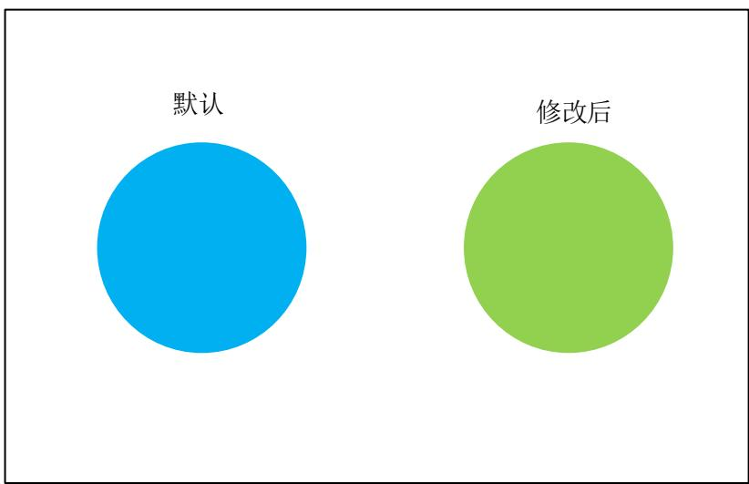  
图30.2.1.1修改LED主体颜色

# 30.2.2 设置LED亮度

LED部件的亮度与颜色深度有关，亮度越低，颜色越深，它的亮度值可选范围是0~255（整数）。如果LED部件的亮度设置为0，则它的主体颜色最深，亮度最低；如果LED部件的亮度设置为255，则它的主体颜色最浅，亮度最高。

在默认的情况下，LED部件的亮度为最大值，如果用户想修改LED部件的亮度值，可调用lv_led_set_brightness函数进行设置。LED亮度修改的效果图如下所示：

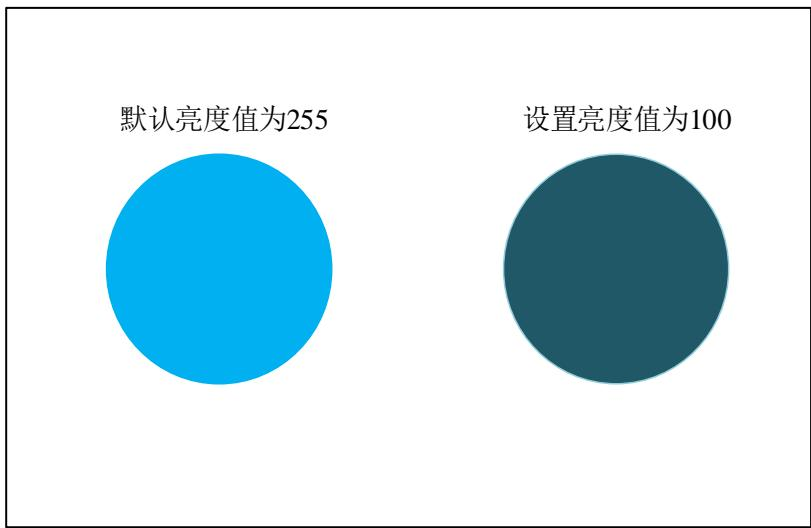  
图30.2.2.1修改LED部件的亮度值

# 30.2.3 状态切换

在LED部件中，状态切换的本质就是将其亮度改变到预设值，例如：打开LED时，将其亮度调整到255。用户需要切换LED的状态，可调用lv_led_on（开启）和lv_led_off（关闭）函数进行设置。

# 30.3 LED部件API函数

LVGL官方提供了一些与LED部件相关API，如下表所示：

表 30.3.1 LED 部件相关的 API 函数  

<table><tr><td>函数</td><td>描述</td></tr><tr><td>lv_led_create()</td><td>创建 LED 部件</td></tr><tr><td>lv_led_set_color()</td><td>设置 LED 部件主体颜色</td></tr><tr><td>lv_led_set_brightness()</td><td>设置 LED 部件的亮度</td></tr><tr><td>lv_led_on()</td><td>打开 LED</td></tr><tr><td>lv_led_off()</td><td>关闭 LED</td></tr><tr><td>lv_led_toggle()</td><td>翻转 LED 的状态</td></tr><tr><td>lv_led_get_brightness()</td><td>获取 LED 对象的亮度</td></tr></table>

接下来，我们介绍LED部件常用的API函数：

# 1.lv_led_create函数

创建LED部件，该函数原型如下所示：

```c
lv_obj_t * lv_led_create lv_obj_t * parent);
```

该函数的形参，如下表所示：

表 30.3.2 lv_led_create 函数形参描述  

<table><tr><td>参数</td><td>描述</td></tr><tr><td>parent</td><td>指向父对象的指针</td></tr></table>

返回值：指向LED对象的指针。

# 2.lv_led_set_color函数

设置LED的主体颜色，该函数原型如下所示：

```c
void lv_led_set_color lv_obj_t *led, lv_color_t color);
```

该函数的形参，如下表所示：

表 30.3.3 lv_led_set_color 函数形参描述  

<table><tr><td>参数</td><td>描述</td></tr><tr><td>led</td><td>指向LED对象的指针</td></tr><tr><td>color</td><td>主体颜色</td></tr></table>

返回值：无。

# 3.lv_led_set_brightness函数

设置LED的亮度值，该函数原型如下所示：

```c
void lv_led_set_brightness lv_obj_t *led, uint8_t bright);
```

该函数的形参，如下表所示：

表 30.3.4 lv_led_set_brightness 函数形参描述  

<table><tr><td>参数</td><td>描述</td></tr><tr><td>led</td><td>指向LED对象的指针</td></tr><tr><td>bright</td><td>亮度值</td></tr></table>

返回值：无。

# 4.lv_led_on函数

开启LED，该函数原型如下所示：

```txt
void lv_led_on lv_obj_t *led);
```

该函数的形参，如下表所示：

表 30.3.5 lv_led_on 函数形参描述  

<table><tr><td>参数</td><td>描述</td></tr><tr><td>led</td><td>指向LED对象的指针</td></tr></table>

返回值：无。

# 5.lv_led_off函数

关闭LED，该函数原型如下所示：

```txt
void lv_led_off lv_obj_t *led);
```

该函数的形参，如下表所示：

表 30.3.6 lv_led_off 函数形参描述  

<table><tr><td>参数</td><td>描述</td></tr><tr><td>led</td><td>指向LED对象的指针</td></tr></table>

返回值：无。

# 30.4 LED部件实验

# 30.4.1 硬件设计

# 1. 例程功能

本实验主要测试LED部件API函数的使用，实验现象：开机后，屏幕上显示三个LED，点击LED即可切换其状态。与此同时，LEDO闪烁，提示系统正在运行。

该实验的完整源码，请参考《LVGL例程30lv_led(灯)》例程，路径：A盘  $\rightarrow 4$  ，程序源码 $\rightarrow 3$  ，扩展例程  $\rightarrow 4$  ，LVGL例程。

# 30.4.2 软件设计

# 30.4.2.1 程序流程图

本实验的程序流程图，如下图所示：

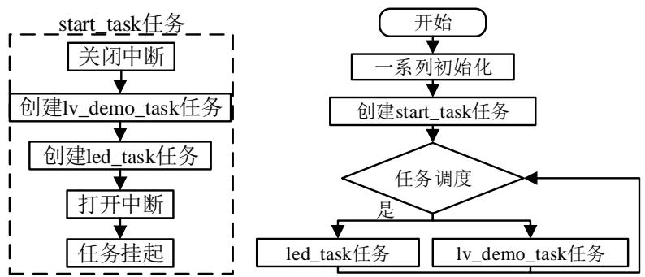

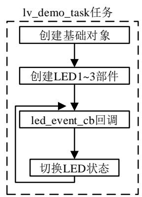  
图30.4.2.1.1LED部件实验流程图

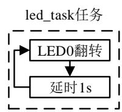

# 30.4.2.2 程序解析

关于LVGL的用户代码，我们都是在lv_mainstart.c文件中编写的，本实验的源码如下所示：

```txt
/\*\*\*\*\*\*\*\*\*\*\*\*\*\*\*\*\*\*\*\*\*\*\*\*\*\*\*\*\*\*\*\*\*\*\*\*\*\*\*\*\*\*\*\*\*\*\*\*\*\*\*\*\*\*\*\*\*\*\*\*\*\*\*\*\*\*\*\*\*\*\*\*\*\*\*\*\*\*\*\*\*\*\*\*\*\*\*\*\*\*\*\*\*\*\*\*\*\*\*\*\*  
\*/\*@brief LVGL演示\* @param 无\* @return 无\*/void lv_mainstart(void)  
{lv_example_led_1(); /\*LED1\*/lv_example_led_2(); /\*LED2\*/lv_example_led_3(); /\*LED3\*/}  
/\*\*\*\*\*\*\*\*\*\*\*\*\*\*\*\*\*\*\*\*\*\*\*\*\*\*\*第一部分结束\* \(\text{串串串串串串串串串串串串串串串串串串串串串串串串串串串串串串串串串串串串串串串串串串串串串串串串串串串串串串串串串串串串串串串串串串串串串串串串串串串串串串串串串串串串串串串串串串串串串串串串串串串串
```

```c
/* */
* @brief LED事件回调
* @param *e：事件相关参数的集合，它包含了该事件的所有数据
* @return 无
*/ static void led_event_cb(lv_event_t* e)
{
    lv_obj_t* led = lv_event_get_target(e); /* 获取触发源 */
    lv_led Toggle(led); /* 翻转LED状态 */
}
/**
* @brief LED1
* @param 无
* @return 无
*/
static void lv_example_led_1(void)
{
    /* 根据活动屏幕宽度选择字体 */
    if (scr_act_width() <= 480)
        {
            font = &lv_font_montserrat_14;
        }
    else
        {
            font = &lv.Font_montserrat_20;
        }
    /* 创建基础对象作为背景 */
    obj = lv_obj_create(lv_scr_act());
    lv_obj_set_size(obj, scr_act_width() * 5 / 6, scr actu_height() * 3 / 5);
    lv_obj_align(obj, LVALIGN_CENTER, 0, 0);
    lv_obj_set_style bg_color(obj, lv_color_hex(0xe9efef), LV_STATE_DEFAULT);
    lv_obj_t* led = lv_led_create(obj); /* 创建LED */
    /* 设置LED大小 */
    lv_obj_set_size(led, scr actu_height() / 5, scr actu_height() / 5);
    lv_obj_align(led, LVALIGN_CENTER, -scr actu_width() * 4 / 15,
                    -scr actu_height() / 15); /* 设置LED位置 */
    lv_led_off(led); /* 关闭LED */
    /* 设置LED事件回调 */
    lv_obj_add_event_cb(led, led_event_cb, LV_EVENTCLICKED, NULL);
```

```c
lv_obj_t *label = lv_label_create(lv_scr_act()); /* 创建LED功能标签*/ lv_label_set_text.label, "ROOM 1"); /* 设置文本*/ lv_obj_set_style_text.Font (label,font,LV_STATE_DEFAULT); /* 设置字体*/ lv_obj_align_to labelled,led,LV ALIGN_OUT BOTTOM_MID,0, scr actu height(/15); /*设置位置*/   
}   
/\*\* \* @brief LED2 \* @param 无 \* @return 无   
\*/   
static void lv_example_led_2(void)   
{ lv_obj_t\* led  $=$  lv_led_create(obj); /*创建LED*/ /\*设置LED大小\*/ lv_obj_set_size(led,scr actu_height() /5,scr actu_height() /5); /\*设置LED位置\*/ lv_obj_align(led,LV ALIGN CENTER,0,-scr actu_height() /15); lv_led_set_color(led,lv_color.hex(0xff0000)); /*设置LED颜色*/ lv_led_on(led); /\*打开LED\*/ /\*设置LED事件回调\*/ lv_obj_add_event_cb(led,led_event_cb,LV_EVENTCLICKED，NULL); lv_obj_t\*label  $=$  lv_label_createLv_scr actu(); /\*创建LED功能标签\*/ lv_label_set_text.label,"ROOM 2"); /\*设置文本\*/ lv_obj_set_style_text_font (label,font,LV_STATE_DEFAULT); /\*设置字体\*/ lv_obj_align_to labelled,led,LV ALIGN_OUT BOTTOM_MID,0, scr actu_height() /15); /\*设置位置\*/   
}   
/\*\* \* @brief LED3 \* @param 无 \* @return 无   
\*/   
static void lv_example_led_3(void)   
{ lv_obj_t\* led  $=$  lv_led_create(obj); /\*创建LED\*/ /\*设置LED大小\*/ lv_obj_set_size(led,scr actu_height() /5,scr actu_height() /5); lv_obj_align(led,LV ALIGN CENTER,scr actu_width()  $\star$  4/15, -scr actu_height() /15); /\*设置LED位置\*/
```

```c
lv_led_set_color(led, lv_color(hex(0x2fc827)); /* 设置LED颜色 */
lv_led_off(led); /* 关闭LED */
/* 设置LED事件回调 */
lv_obj_add_event_cb(led, led_event_cb, LV_EVENTCLICKED, NULL);
lv_obj_t *label = lv_label_create(lv_scr_act()); /* 创建LED功能标签 */
lv_label_set_text.label, "ROOM3"); /* 设置文本 */
lv_obj_set_style_text.Font.label, font, LV_STATE_DEFAULT); /* 设置字体 */
lv_obj_align_to.label, led, LVALIGN_OUT BOTTOM_MID, 0, scr_ACT_height(); /* 设置位置 */
********** 第二部分 结束 *** /
```

上述源码可分为以下两个部分：

① lv_mainstart 接口函数。在该函数中，我们调用了 3 个 LED 部件相关的示例函数；  
② LED 状态切换的实现。我们先根据活动屏幕宽度来选择字体的大小，创建基础对象作为背景，然后分别创建 3 个 LED 部件，并为它们添加事件回调。当某个 LED 被点击时，会触发事件回调，在回调函数中，LED 的状态将发生翻转。

注意：不同版本的LVGL，LED的默认样式会有所不同，在V8.2版本中，LED开启时仅有轮廓和阴影发生变化，主体不发生改变。

# 30.4.3 下载验证

把工程编译并下载到我们的开发板中，运行效果如下图所示：

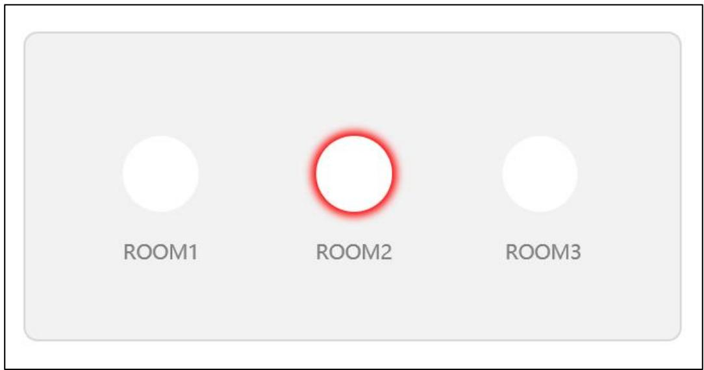  
图30.4.3.1LED部件实验

当我们点击上图中的LED部件时，可切换该部件的状态，如下图所示：

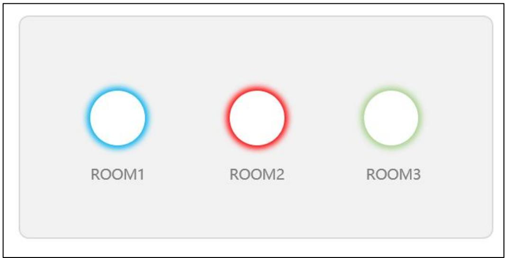  
图30.4.3.2切换LED部件状态

# 第三十一章 列表部件Lv_list)

列表部件可用于展现多个选项，它在 UI 设计中广泛应用，例如：文件管理系统、设置菜单、功能菜单，等等。

本章节将分为以下几个小节：

31.1列表部件的组成  
31.2列表部件的相关知识  
31.3列表部件API函数  
31.4列表部件实验

# 31.1列表部件的组成

列表部件由两个部分组成：

① LV_PART_MAIN：主体背景；  
② LV_PART_SCROLLBAR：滚动条。

关于部件样式设置的内容，请大家参考6.4.4章节。

# 31.2列表部件的相关知识

# 31.2.1 添加列表按钮

在默认的情况下，列表部件被创建出来后，只有一个矩形背景框，并没有任何的文本和按钮，用户需要自行往列表里面添加按钮，添加按钮的相关函数为lv_list_addBtn。

接下来，我们以简单示例来理解列表按钮的添加，示例代码如下所示：

```c
void lv_mainstart(void)  
{lv_obj_t *list = lv_list_create(lv_scr_act()); /\* 创建列表 \*/lv_obj_set_width(list, 200); /\* 设置列表宽度 \*/lv_obj_set_height(list, 150); /\* 设置列表高度 \*/lv_obj_center(list);lv_obj_t \*BTN;BTN = lv_list_addBTN(list, LV_SYMBOL_FILE, "New"); /\* 添加按钮 \*/BTN = lv_list_addBTN(list, LV_SYMBOL_DIRECTORY, "Open"); /\* 添加按钮 \*/}
```

在上述的源码中，我们先创建列表部件，然后调用lv_list_addbtn函数添加列表按钮，该函数的第二个形参用于设置图标，第三个形参用于设置按钮的文本。示例代码可以在PC模拟器中运行，效果图如下所示：

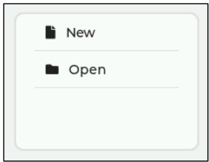  
图31.2.1.1添加列表按钮

上图中，我们添加了两个列表按钮，这两个列表按钮都是具有图标和文本的，如果用户不想显示图标或者文本，则在对应的形参中填入 NULL 即可。

# 31.2.2 设置列表文本

列表文本主要用于一类按钮的功能提示或按钮分类。用户需要添加列表文本，可调用lv_list_add_text函数进行设置，该函数有两个形参，第一个形参指向列表对象，第二个形参表示设置的文本。

接下来，我们以简单示例来理解列表文本的设置，示例代码如下所示：

```c
void lv_mainstart(void)  
{lv_obj_t* list = lv_list_create lv_scr_act(); /\* 创建列表 \*/lv_obj_set_width(list, 200); /\* 设置列表宽度 \*/lv_obj_set_height(list, 150); /\* 设置列表高度 \*/lv_obj_center(list);lv_obj_t\* btn;lv_list_add_text(list, "File"); /\* 列表添加标签 \*/btn = lv_list_add_btn(list, LV_SYMBOL_FILE, "New"); /\* 添加按钮 \*/btn = lv_list_add_btn(list, LV_SYMBOL_DIRECTORY, "Open"); /\* 添加按钮 \*/}
```

在上述源码中，我们创建了列表并为其添加按钮，于此同时，调用lv_list_add_text函数添加列表文本。示例代码可以在PC模拟器中运行，效果图如下所示：

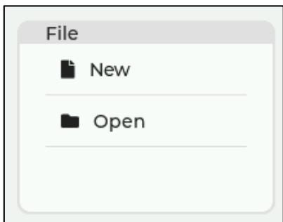  
图31.2.1.2添加列表文本

# 31.3列表部件API函数

LVGL官方提供了一些与列表部件相关API，如下表所示：

表 31.3.1 列表部件相关的 API 函数  

<table><tr><td>函数</td><td>描述</td></tr><tr><td>lv_list_create()</td><td>创建列表部件</td></tr><tr><td>lv_list_add_text()</td><td>添加列表文本</td></tr><tr><td>lv_list_add_btn()</td><td>添加列表按钮</td></tr><tr><td>lv_list_get_btn_text()</td><td>获取按下的按钮文本</td></tr></table>

接下来，我们介绍LVGL列表部件常用的API函数：

# 1.lv_list_create函数

创建列表部件，该函数原型如下所示：

```txt
lv_obj_t * lv_list_createLv_obj_t \* parent);
```

该函数的形参，如下表所示：

表 31.3.2 lv_list_create 函数形参描述  

<table><tr><td>参数</td><td>描述</td></tr><tr><td>parent</td><td>指向父对象的指针</td></tr></table>

返回值：指向列表部件的指针。

# 2.lv_list_add_text函数

设置列表文本，该函数原型如下所示：

```c
lv_obj_t *lv_list_add_text( lv_obj_t *list, const char *txt);
```

该函数的形参，如下表所示：

表 31.3.3 lv_list_add_text 函数形参描述  

<table><tr><td>参数</td><td>描述</td></tr><tr><td>list</td><td>指向列表对象的指针</td></tr><tr><td>txt</td><td>设置的文本</td></tr></table>

返回值：指向文本的指针。

# 3.lv_list_addbtn函数

设置列表按钮，该函数原型如下所示：

```c
lv_obj_t *lv_list_add_btn( lv_obj_t *list, const char *icon, const char *txt);
```

该函数的形参，如下表所示：

表 31.3.4 lv_list_addBtn 函数形参描述  

<table><tr><td>参数</td><td>描述</td></tr><tr><td>list</td><td>指向列表对象的指针</td></tr><tr><td>icon</td><td>图标</td></tr><tr><td>txt</td><td>设置的文本</td></tr></table>

返回值：指向按钮的指针。

# 4.lv_list_get_btn_text函数

获取按下的按钮文本，该函数原型如下所示：

```txt
const char *lv_list_get_btn_text lv_obj_t *list, lv_obj_t *btn);
```

该函数的形参，如下表所示：

表 31.3.5 lv_list_get_btn_text 函数形参描述  

<table><tr><td>参数</td><td>描述</td></tr><tr><td>list</td><td>指向列表对象的指针</td></tr><tr><td>btn</td><td>图标</td></tr></table>

返回值：指向文本的指针。

# 31.4列表部件实验

# 31.4.1 硬件设计

# 1. 例程功能

本实验主要测试列表部件 API 函数的使用，实验现象：开机后，屏幕上显示一个列表和标签，当用户按下列表中的按钮时，该按钮的文本将会被更新到标签中。与此同时，LED0 闪烁，提示系统正在运行。

该实验的完整源码，请参考《LVGL例程31lv_list(列表)》例程，路径：A盘  $\rightarrow 4$  ，程序源码  $\rightarrow 3$  ，扩展例程  $\rightarrow 4$  ，LVGL例程。

# 31.4.2 软件设计

# 31.4.2.1 程序流程图

本实验的程序流程图，如下图所示：

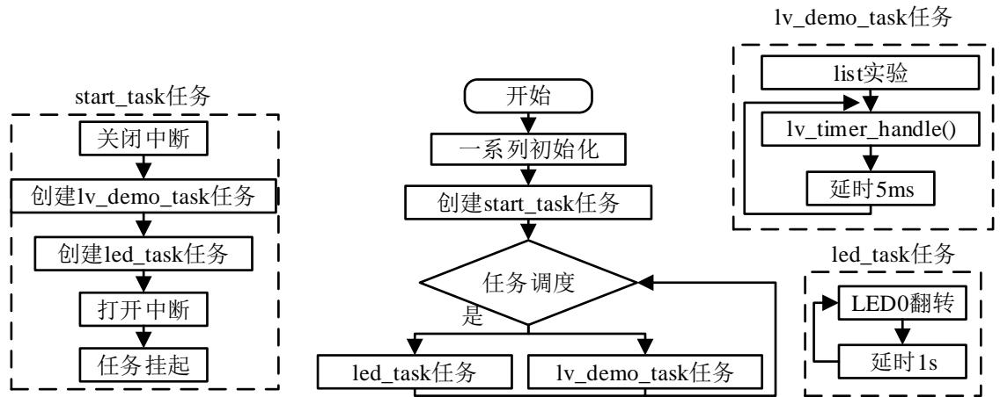

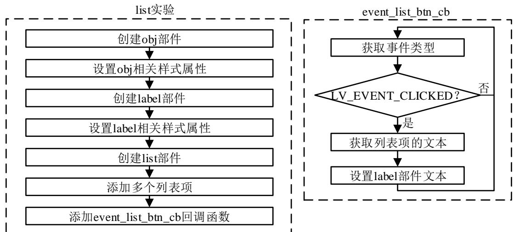  
图31.4.2.1.1列表部件实验流程图

# 31.4.2.2 程序解析

关于LVGL的用户代码，我们都是在lv_mainstart.c文件中编写的，本实验的源码如下所示：

```c
/\*\*\*\*\*\*\*\*\*\*\*\*\*\*\*\*\*\*\*\*\*\*\*\*\*\*\*\*\*\*\*\*\*\*\*\*\*\*\*\*\*\*\*\*\*\*\*\*\*\*\*\*\*\*\*\*\*\*\*\*\*\*\*\*\*\*\*\*\*\*\*\*\*\*\*\*\*\*\*\*\*\*\*\*\*\*\*\*\*\*\*\*\*\*\*\*\*\*\*\*\* 第一部分 开始  $\star \star \star \star \star \star \star \star \star \star \star \star \star \star \star \star \star \star \star \star \star \star \star \star \star \star \star \star \star \star \star \star \star \star \star \star \star \star \star \star \star \star \star \star \star \star \star \star \star \star \star 1$    
\*/  
void lv_mainstart(void)  
{lv_example_list();}  
\*/\*\*\*\*\*\*\*\*\*\*\*\*\*\*\*\*\*\*\*\*\* 第一部分 结束  $\star \star \star \star \star \star \star \star \star \star \star \star \star \star \star \star \star \star \star \star \star \star \star \star \star \star \star \star \star \star \star \star \star \star \star \star \star \star \star \star \star \star \star \star \star \star \star \star \star 1 /$    
\*/\*\* @brief 列表按钮事件回调\* @param  $^{\text{喜}}$  e：事件相关参数的集合，它包含了该事件的所有数据\* @return 无\*/  
static void list_btn_event_cb(lv_event_t *e)  
{lv_obj_t *list_btn = lv_event_get_target(e); /\* 获取触发源\*//\* 获取按钮文本并显示\*/lv_label_set_text(list_label,lv_list_get_btn_text(list, list_btn));lv_obj_add_state(list_btn,LV_STATEOCUS_KEY); /\* 添加状态（聚焦）\*/}  
/\*  
\* @brief 例\* @param 无\* @return 无\*/  
static void lv_example_list(void)  
{/\* 根据屏幕大小设置字体\*/if (scr_act_width() <= 320){font  $=$  &lv.Font_montserrat_14;1else if (scr_act_width() <= 480)
```

```txt
{ font  $=$  &lv.Font_montserrat_16;   
}   
else   
{ font  $=$  &lv.Font_montserrat_18;
```

/* 创建左侧矩形背景 */  
```c
lv_obj_t* obj_left = lv_obj_create(lv_scr_act()); /* 创建一个基础对象 */
lv_obj_set_width(obj_left, scr(act_width() * 0.7); /* 设置宽度 */
lv_obj_set_height(obj_left, scr(act_height() * 0.9); /* 设置高度 */
lv_obj_align(obj_left, LVALIGN_LEFT_MID, 5, 0); /* 设置位置 */
lv_obj_update.layout(obj_left); /* 手动更新物体的参数 */
```

/* 创建右侧矩形背景 */  
```c
lv_obj_t* obj_right = lv_obj_create(lv_scr_act()); /* 创建一个基础对象 */
lv_obj_set_width(obj_right, scr_ACT_width() - lv_obj_get_width(obj_left) - 15); /* 设置宽度 */
lv_obj_set_height(obj_right, lv_obj_get_height(obj_left)); /* 设置高度 */
/* 设置位置 */
lv_obj_align_to(obj_right, obj_left, LVALIGN_OUT_RIGHT_MID, 5, 0);
lv_obj_update.layout(obj_right); /* 手动更新物体的参数 */
```

/* 显示当前选项的文本内容 */  
```javascript
list_label = lv_label_create(obj_right); /* 创建标签 */
/* 设置标签的宽度 */
lv_obj_set_width(list_label, lv_obj_get_width(obj_right) - 13);
lv_obj_align(list_label, LVALIGN_TOP_MID, 0, 5); /* 设置标签位置 */
lv_obj_update.layout(list_label); /* 手动更新标签的参数 */
lv_obj_set_style_text_align(list_label, LV_TEXTALIGN_CENTER,
LV_PART_MAIN); /* 设置标签文本对齐方式 */
lv_label_set_text(list_label, "New"); /* 设置标签文本 */
/* 设置标签文本字体 */
lv_obj_set_style_text.Font(list_label, font, LV_PART_MAIN);
```

/* 创建列表 */  
```c
list = lv_list_create(obj_left); /* 创建列表 */
lv_obj_set_width(list, lv_obj_get_width(obj_left) * 0.8); /* 设置列表宽度 */
lv_obj_set_height(list, lv_obj_get_height(obj_left) * 0.9); /* 设置列表高度 */
lv_obj_center(list); /* 设置列表的位置 */
lv_obj_set_style_text.Font(list, font, LV_PART_MAIN); /* 设置字体 */
```

```c
/* 为列表添加按钮 */
lv_obj_t* btn;
lv_list_add_text(list, "File");
btn = lv_list_add_btn(list, LV_SYMBOL_FILE, "New"); /* 添加列表文本 */
lv_obj_add_event_cb(btn, list_btn_event_cb, LV_EVENTCLICKED, NULL);
btn = lv_list_add_btn(list, LV_SYMBOL_DIRECTORY, "Open"); /* 添加按钮 */
/* 添加按钮回调 */
lv_obj_add_event_cb(btn, list_btn_event_cb, LV_EVENTCLICKED, NULL);
btn = lv_list_add_btn(list, LV_SYMBOL.Save, "Save"); /* 添加按钮 */
/* 添加按钮回调 */
lv_obj_add_event_cb(btn, list_btn_event_cb, LV_EVENTCLICKED, NULL);
btn = lv_list_add_btn(list, LV_SYMBOL_CLOSE, "Delete"); /* 添加按钮 */
/* 添加按钮回调 */
lv_obj_add_event_cb(btn, list_btn_event_cb, LV_EVENTCLICKED, NULL);
btn = lv_list_add_btn(list, LV_SYMBOL_edit, "Edit"); /* 添加按钮 */
/* 添加按钮回调 */
lv_obj_add_event_cb(btn, list_btn_event_cb, LV_EVENTCLICKED, NULL);
lv_list_add_text(list, "Connectivity"); /* 添加列表文本 */
btn = lv_list_add_btn(list, LV_SYMBOL_BLUETOOTH, "Bluetooth");
lv_obj_add_event_cb(btn, list_btn_event_cb, LV_EVENTCLICKED, NULL);
btn = lv_list_add_btn(list, LV_SYMBOL_GPS, "Navigation");
lv_obj_add_event_cb(btn, list_btn_event_cb, LV_EVENTCLICKED, NULL);
btn = lv_list_add_btn(list, LV_SYMBOL_USB, "USB");
lv_obj_add_event_cb(btn, list_btn_event_cb, LV_EVENTCLICKED, NULL);
btn = lv_list_add_btn(list, LV_SYMBOL_BATTERY_FULL, "Battery");
lv_obj_add_event_cb(btn, list_btn_event_cb, LV_EVENTCLICKED, NULL);
lv_list_add_text(list, "Exit");
btn = lv_list_add_btn(list, LV_SYMBOL_OK, "Apply");
lv_obj_add_event_cb(btn, list_btn_event_cb, LV_EVENTCLICKED, NULL);
btn = lv_list_add_btn(list, LV_SYMBOL_CLOSE, "Close");
lv_obj_add_event_cb(btn, list_btn_event_cb, LV_EVENTCLICKED, NULL);
}
```

上述源码可分为以下两个部分：

① lv_mainstart 接口函数。在该函数中，我们调用了列表部件相关的示例函数；  
② 列表和标签的实现。我们先根据活动屏幕的宽度来选择字体大小，创建两个基础对象作为背景，然后创建当前选项文本标签以及列表部件，并为列表添加多个按钮。当某个列表按钮被按下时，将触发事件回调，在事件回调函数中，我们获取被按下按钮的文本内容，并将其更新到当前选项文本标签中。

# 31.4.3 下载验证

把工程编译并下载到我们的开发板中，运行效果如下图所示：

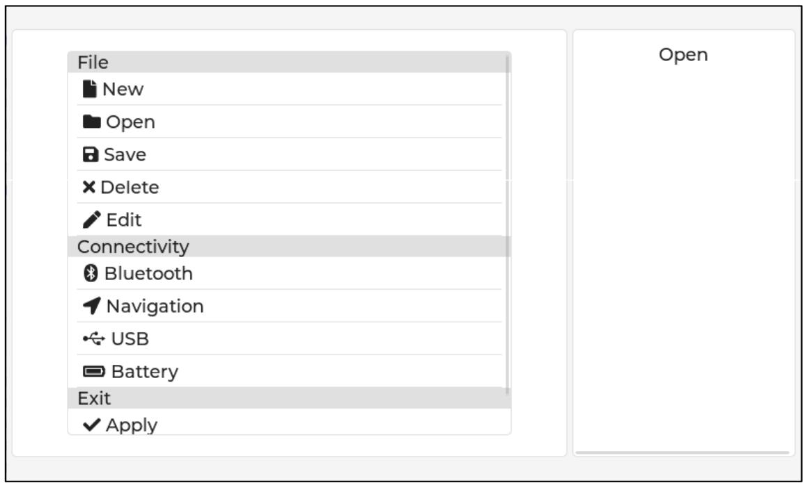  
图31.4.3.1列表部件实验

# 第三十二章 仪表部件(lv_meter)

仪表部件可以将某种数据可视化，方便用户进行监测，其应用场景包括：汽车油表、温湿度仪表、速度仪表、水位显示，等等。

本章节将分为以下几个小节：

32.1 仪表部件的组成  
32.2 仪表部件的相关知识  
32.3 仪表部件 API 函数  
32.4 仪表部件实验

# 32.1 仪表部件的组成

仪表部件由四个部分组成，示意图如下：

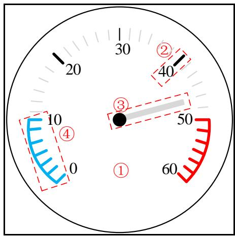  
图32.1.1 仪表的组成部分

① LV_PART_MAIN：主体背景；  
② LV_PART_TICK：仪表的刻度；  
$③$  LV_PART_INDICATOR：仪表指针；  
④ LV_PART_items: 圆弧。

关于部件样式设置的内容，请大家参考6.4.4章节。

# 32.2 仪表部件的相关知识

# 32.2.1 仪表部件主要功能

在LVGL中，当用户创建出一个仪表部件时，该部件并不具备仪表的角度、仪表的范围、仪表的刻度以及仪表的指针等功能，这些功能都是由用户自行设置的。接下来，我们分别介绍这些功能的添加：

# 1. 添加刻度

从图32.1.1可知：刻度分为小刻度和主刻度，主刻度是图中加粗的线条，而小刻度是图中正常的线条。这些刻度的添加是由三个函数来完成，如下表所示：

<table><tr><td>函数</td><td>描述</td></tr><tr><td>lv_meter_add_scale()</td><td>添加刻度</td></tr></table>

表 32.2.1.1 仪表添加刻度的函数  

<table><tr><td>lv-meter_set_scale;ticks()</td><td>设置小刻度</td></tr><tr><td>lv-meter_set_scalemajor;ticks()</td><td>设置主刻度</td></tr></table>

上表的函数调用是有一定的顺序的，首先调用第一个函数把刻度添加到仪表当中，该函数返回一个刻度的对象，然后我们根据这个刻度的对象分别设置小刻度和主刻度。

下面我们分别介绍这些函数的原型，如下所示：

# (1) lv-meter_add_scale 函数

给仪表添加一个刻度，该函数原型如下所示：

```txt
lv-meter_scale_t *lv-meter_add_scale(lv_obj_t *obj);
```

该函数的形参，如下表所示：

表 32.3.1.2 lv-meter_add_scale 函数形参描述  

<table><tr><td>参数</td><td>描述</td></tr><tr><td>obj</td><td>指向仪表对象的指针</td></tr></table>

返回值：指向刻度的对象的指针。

# (2)lv-meter_set_scaleTicks函数

给仪表添加一个小刻度，该函数原型如下所示：

```c
void lv-meter_set_scaleTicks(lv_obj_t *obj, lv-meter_scale_t *scale, uint16_t cnt, uint16_t width, uint16_t len, lv_color_t color);
```

该函数的形参，如下表所示：

表 32.3.1.3 lv-meter_set_scaleTicks 函数形参描述  

<table><tr><td>参数</td><td>描述</td></tr><tr><td>meter</td><td>指向仪表对象的指针</td></tr><tr><td>scale</td><td>指向刻度对象</td></tr><tr><td>cnt</td><td>小刻度的数量</td></tr><tr><td>width</td><td>小刻度的宽度</td></tr><tr><td>len</td><td>小刻度的长度</td></tr><tr><td>color</td><td>小刻度的颜色</td></tr></table>

返回值：无。

# (3) lv-meter_set_scalemajorTicks函数

给仪表添加一个主刻度，该函数原型如下所示：

```c
void lv-meter_set_scalemajorTicks lv_obj_t \*obj, lv-meter_scale_t \*scale, uint16_t nth, uint16_t width, uint16_t len, lv_color_t color, int16_t label_gap);
```

该函数的形参，如下表所示：

表 32.3.1.3 lv-meter_set_scalemajorTicks 函数形参描述  

<table><tr><td>参数</td><td>描述</td></tr><tr><td>meter</td><td>指向仪表对象的指针</td></tr><tr><td>scale</td><td>指向刻度对象</td></tr><tr><td>nth</td><td>绘画主刻度的步长</td></tr><tr><td>width</td><td>主刻度的宽度</td></tr><tr><td>len</td><td>主刻度的长度</td></tr><tr><td>color</td><td>主刻度的颜色</td></tr><tr><td>label_gap</td><td>刻度与标签之间的间隙</td></tr></table>

返回值：无。

接下来，我们以简单示例来理解刻度的添加，示例代码如下所示：

```c
/* 获取当前活动屏幕的宽高 */
#define scr_act_width() lv_obj_get_width(lv_scr_act())
#define scr actu height() lv_obj_get_height(lv_scract())
void lv_mainstart(void)
{
    lv_obj_t* meter = lv-meter_create(lv_scr_act());
    lv_obj_set_width(meter, scr actu height() * 0.4); /* 设置仪表宽度 */
    lv_obj_set_height(meter, scr actu height() * 0.4); /* 设置仪表高度 */
    /* 设置仪表位置 */
    lv_obj_center(meter);
    /* 设置仪表刻度 */
    lv-meter_scale_t* scale = lv-meter_add_scale(meter); /* 定义并添加刻度 */
    /* 设置小刻度数量为41，宽度为1，长度为屏幕高度除以80，颜色为灰色 */
    lv-meter_set_scaleTicks(metric, scale, 41, 1, scr actu height() / 80,
                    lv Palette_main(LV_PALETTEGrey));
    /* 设置主刻度的步长为8，宽度为1，长度为屏幕高度除以60，颜色为黑色，
刻度与数值的间距为屏幕高度除以30 */
    lv-meter_set_scalemajorTicks(metric, scale, 8, 1, scr actu height() / 60,
                    lv_color_white(), scr actu height() / 30);
}
```

从上述源码可知：首先创建 mater 部件，然后添加刻度到仪表当中，其次设置小刻度，该刻度的数量是 41 个，宽度为 1，而长度根据屏幕高度除以 80，最后设置主刻度，主刻度是根据小刻度的数量来计算的，它的计算公式是：主刻度数量 = (小刻度数量 - 1) / (主刻度的步长) + 1，显然地，根据这条公式可以算出主刻度的数量为 6((41(小刻度数量) - 1) / 8(步长) + 1)。

注意：第一个主刻度是从第一个小刻度开始绘画，然后根据小刻度以8为步长绘画第二个主刻度，由此类推。这些主刻度对应的数值是由仪表数值范围决定的，默认数值最大为100，系统将该数值除以主刻度数量为增量，如第一个主刻度为0，经过小刻度8步长绘画第二个主刻度，该刻度的对应数值为16(100/6)，由此类推。

上述源码可在PC模拟器或者在开发板上运行，效果图如下所示：

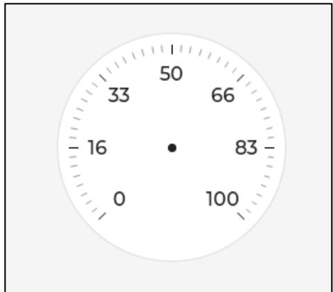  
图32.2.1.1添加刻度到仪表当中

# 2. 添加指针

仪表指针，是指用于仪表上指示数据的零部件。指针的功能就是以比较客观直接的方法指示复杂的数据结构。指针的结构一般是狭长的，一端尖，便于指示和读数。因为精确度是仪器仪表的主要性能之一，指针的这种设计和构造有利于提高仪器仪表的精度，减小误差。从上图32.2.1.1中，该仪表只添加了刻度功能，但它并没有指针的功能，如果该仪表不添加指针，那么我们很难读取仪表的数值，所以指针对于仪表来说是非常重要的。

在LVGL中，关于仪表指针的函数有两个，如下表所示：

表 32.3.1.4 仪表指针相关的函数  

<table><tr><td>函数</td><td>描述</td></tr><tr><td>lv-meter_add_needle_line()</td><td>添加指针</td></tr><tr><td>lv-meter_set_indicator_value()</td><td>设置指针指向的数值</td></tr></table>

接下来，我们分别介绍这两个函数：

# 1.lv_metric_add_needle_line函数

给仪表添加一个指针，该函数原型如下所示：

```c
lv-meter_indicator_t *lv-meter_add_needle_line lv_obj_t *obj,  
    lv-meter_scale_t *scale,  
    uint16_t width,  
    lv_color_t color,  
    int16_t r_mod);
```

该函数的形参，如下表所示：

表 32.3.1.5 lv-meter_add_needle_line 函数形参描述  

<table><tr><td>参数</td><td>描述</td></tr><tr><td>obj</td><td>指向仪表对象的指针</td></tr><tr><td>scale</td><td>指向刻度对象</td></tr><tr><td>width</td><td>指针宽度</td></tr><tr><td>color</td><td>指针颜色</td></tr><tr><td>r_mod</td><td>修改半径长度(0:默认值; -10:默认长度-10)</td></tr></table>

返回值：仪表指针的对象。

# 2.lv_metric_setindicator_value函数

设置指针的数值，该函数原型如下所示：

```txt
void lv-meter_set_indicator_value( lv_obj_t * obj, lv-meter_indicator_t * indic, int32_t value);
```

该函数的形参，如下表所示：

表 32.3.1.5 lv-meter_set_indicator_value 函数形参描述  

<table><tr><td>参数</td><td>描述</td></tr><tr><td>obj</td><td>指向仪表对象的指针</td></tr><tr><td>indic</td><td>指向指针对象</td></tr><tr><td>value</td><td>指向的数值</td></tr></table>

返回值：无。

接下来，我们以简单示例来理解仪表指针的添加，示例代码如下所示：

```c
/* 获取当前活动屏幕的宽高 */
#define scr_act_width() lv_obj_get_width(lv_scr_act())
#define scr actu height() lv_obj_get_heightlv_scract()
void lv_mainstart(void)
```

```javascript
{lv_obj_t\* meter  $=$  lv-meter_create(lv_scr_act());/\*定义并创建仪表\*/lv_obj_set_width(meter,scr_act_height(  $\text{串}$  0.4）；/\*设置仪表宽度\*/lv_obj_set_height(meter,scr_act_height(  $\text{串}$  0.4）；/\*设置仪表高度\*//\*设置仪表位置\*/lv_obj_center(meter);/\*设置仪表刻度\*/lv-meter_scale_t\* scale  $=$  lv-meter_add_scale(meter);/\*定义并添加刻度\*//\*设置小刻度\*/lv-meter_set_scale_ticks(meter, scale,41,1,scr_act_height() /80，lv Palette_main(LV_PALETTEGREY));/\*设置主刻度\*/lv-meter_set_scalemajor_ticks(meter, scale,8,1,scr_act_height() /60，lv_color_white(),scr_act_height() /30);lv-meter(indicator_t\*indic;/\*添加仪表指针，该指针宽度为4，颜色为灰色，长度-10\*/indic  $=$  lv-meter_add_needle_line(meter, scale,4，lv Palette_main(LV_PALETTEGREY)，-10);/\*设置指针指向的数值\*/lv-meter_set_indicator_value(meter,indic,54);
```

在上述源码中，我们调用了lv-meter_add_needle_line函数来添加仪表指针，该指针的宽度为4，颜色为灰色，指针长度为-10，添加完指针之后，该函数会返回仪表指针对象，有了指针对象，再将仪表指针的数值设置为54。上述源码可在PC模拟器或者在开发板上运行，其程序效果图如下图所示：

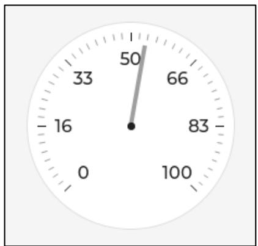  
图32.2.1.2添加指针并设置指向的数值

上图中，仪表指针的顶端和小刻度还有一定的距离，该距离由lv-meter_add_needle_line函数最后的形参决定，如果传入的数值为0，则仪表指针刚好覆盖到小刻度的顶端；如果传入的数值大于0，则仪表指针超出小刻度；如果传入的数值小于0，则仪表指针的顶端和小刻度还有一定的距离。

# 3. 设置仪表的角度和仪表的范围

仪表的角度主要设置仪表从顺时针旋转的角度以及有效的角度范围，比如图32.2.1.2中，该图中的仪表有效角度范围为  $0\sim 270^{\circ}$ ，如果我们使用仪表部件制作时钟UI，显然  $0\sim 270^{\circ}$  有效角度范围并不满足我们的需求，所以我们可手动设置仪表的有效角度范围为  $0\sim 360^{\circ}$ 。

仪表的范围是指仪表的数值范围，默认仪表的数值范围为0~100的数值，我们可以手动调整数值的范围。

上述仪表的三个功能是由一个LVGL函数lv_meter_set_scale_range统一设置，该函数具有六个形参，这些形参描述如下所示：

# lv_meter_set_scale_range函数

设置仪表的角度和范围，该函数原型如下所示：

```c
void lv-meter_set_scale_range lv_obj_t * obj, lv-meter_scale_t * scale, int32_t min, int32_t max, uint32_t angle_range, uint32_t rotation);
```

该函数的形参，如下表所示：

表 32.3.1.6 lv-meter_set_scale_range 函数形参描述  

<table><tr><td>参数</td><td>描述</td></tr><tr><td>obj</td><td>指向仪表对象的指针</td></tr><tr><td>scale</td><td>指向指针对象</td></tr><tr><td colspan="2">仪表数值范围设置</td></tr><tr><td>min</td><td>最小值</td></tr><tr><td>max</td><td>最大值</td></tr><tr><td colspan="2">仪表的有效角度设置</td></tr><tr><td>angle_range</td><td>最大的角度(默认是270°，可设置0~360°)</td></tr><tr><td colspan="2">仪表的旋转角度设置</td></tr><tr><td>rotation</td><td>旋转的角度(默认是0°，可设置0~360°)</td></tr></table>

返回值：无。

接下来，我们以简单示例来理解仪表范围和角度的设置，示例代码如下所示：

```c
/* 获取当前活动屏幕的宽高 */
#define scr_act_width() lv_obj_get_width(lv_scr_act())
#define scr actu height() lv_obj_get_heightlv_scract()
void lv_mainstart(void)
{
    lv_obj_t* meter = lv-meter_create(lv_scr_act());
    lv_obj_set_width(meter, scr actu height() * 0.4); /* 定义并创建仪表 */
    lv_obj_set_height(meter, scr actu height() * 0.4); /* 设置仪表宽度 */
    /* 设置仪表位置 */
    lv_obj_center(meter);
    /* 设置仪表刻度 */
    lv-meter_scale_t* scale = lv-meter_add_scale(meter); /* 定义并添加刻度 */
    /* 设置小刻度 */
    lv-meter_set_scale_ticks(meter, scale, 41, 1, scr actu height() / 80,
                    lv Palette_main(LV_PALETTEGREY));
    /* 设置主刻度 */
};
```

```c
lv-meter_set_scalemajor_ticks(meter, scale, 8, 1, scr_act_height() / 60, lv_color/black(), scr_act_height() / 30);  
lv-meter_indicator_t* indic;  
/* 添加仪表指针，该指针宽度为4，颜色为灰色，长度-10*/  
indic = lv-meter_add_needle_line(meter, scale, 4, lv Palette_main(LV_PALETTEGrey), -10);  
/* 设置指针指向的数值 */  
lv-meter_setindicator_value(meter, indic, 54);  
/* 设置仪表数值范围、有效角度和旋转角度 */  
lv-meter_set_scale_range(meter, scale, 0, 150, 360, 90);
```

在上述源码中，我们设置仪表的数值范围为0到150，有效角度为  $360^{\circ}$ ，旋转角度为 $90^{\circ}$ 。示例代码可在PC模拟器上运行，效果图如下所示：

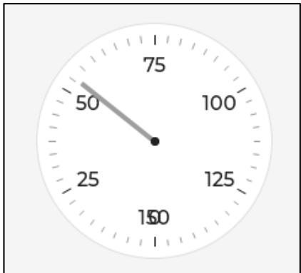  
图32.2.1.3设置仪表角度和范围

上图中，我们设置仪表有效角度为0~360，数值范围为0~150，而旋转角度为  $90^{\circ}$  。注意：默认情况下， $0^{\circ}$  是在三点钟的位置，上图是经过  $90^{\circ}$  旋转后得到的效果。

# 32.2.2 仪表部件辅助功能

仪表部件的辅助功能主要用于装饰仪表，如：图片指针、仪表的指示刻度以及仪表弧线指示器等。下面我们分别介绍这三个辅助功能的使用，如下所示：

# 1. 仪表指针图片

为了提高仪表的美观度，用户可以使用图片来替代仪表的指针，这样能使仪表更加生动。仪表指针图片相关的函数如下所示：

# lv_meter_add_needle_img函数

添加指针图片，该函数原型如下所示：

```c
lv-meter_indicator_t *lv-meter_add_needle_img( lv_obj_t *obj,  
lv-meter_scale_t *scale,  
const void *src,  
lv_coord_t pivot_x,  
lv_coord_t pivot_y);
```

该函数的形参，如下表所示：

<table><tr><td>参数</td><td>描述</td></tr></table>

表 32.2.2.1 lv-meter_add_needle_img 函数形参描述  

<table><tr><td>obj</td><td>指向仪表对象的指针</td></tr><tr><td>scale</td><td>指向刻度对象</td></tr><tr><td>src</td><td>图像源(C数组、路径等)</td></tr><tr><td>pivot_x</td><td>X枢轴点</td></tr><tr><td>pivot_y</td><td>Y枢轴点</td></tr></table>

返回值：无。

接下来，我们以简单示例来理解仪表指针图片的设置，示例代码如下所示：

```c
/* 获取当前活动屏幕的宽高 */
#define scr actu_width() lv_obj_get_width(lv_scr actu())
#define scr actu_height()
lv_obj_get_height(lv_scr actu())
LV_IMAGE_DECLARE(img_hand)
void lv_mainstart(void)
{
    lv_obj_t* meter = lv-meter_create(lv_scr actu());
    lv_obj_set_width(meter, scr actu_height() * 0.4); /* 定义并创建仪表 */
    lv_obj_set_height(meter, scr actu_height() * 0.4); /* 设置仪表宽度 */
    /* 设置仪表位置 */
    lv_obj_center(meter);
    /* 设置仪表刻度 */
    lv-meter_scale_t* scale = lv-meter_add_scale(meter); /* 定义并添加刻度 */
    /* 设置小刻度 */
    lv-meter_set_scale_ticks(meter, scale, 41, 1, scr actu_height() / 80, lv Palette_main(LV_PALETTEGrey));
    /* 设置主刻度 */
    lv-meter_set_scalemajor_ticks(meter, scale, 8, 1, scr actu_height() / 60, lv_color_white(), scr actu_height() / 30);
    /* 添加指针图像 */
    lv-meter_indicator_t * indic = lv-meter_add_needle_img(metric, scale, &img_hand, 5, 5);
    /* 设置指针指向的数值 */
    lv-meter_setIndicator_value(meter, indic, 54);
}
```

在上述源码中，我们定义了一个图像源，然后调用lv_meter_add_needle_img函数，设置该图像为仪表指针，最后调用lv_meter_set_indicator_value函数，设置仪表指针指向的数值。上述源码可在PC模拟器上运行，效果如下所示：

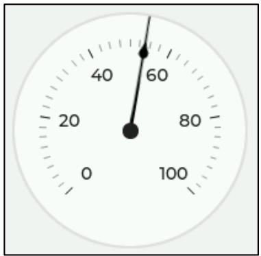  
图32.2.2.1设置图像为仪表指针

注意：lv-meter_add_needle.img函数的最后两个形参需要根据实际情况进行设置，如果图片和原点有偏差，大家可以适当修改这两个形参的数值。

# 2. 仪表的指示刻度

仪表的指示刻度是指在仪表刻度上指定某个范围刻度填充颜色，前面我们学习过lv-meter_set_scaleTicks和lv-meter_set_scalemajorTicks这两个函数，它们都有一个形参表示刻度填充的颜色，显然地，这些形参只针对整体设置颜色，并不是指定某个刻度范围设置颜色。这个次要功能也是比较常见的，比如汽车油表，它的最低值和最大值的某范围都是使用明显的颜色提示和引导驾驶员。下面我们使用一个示意图来讲解这个功能，如下图所示：

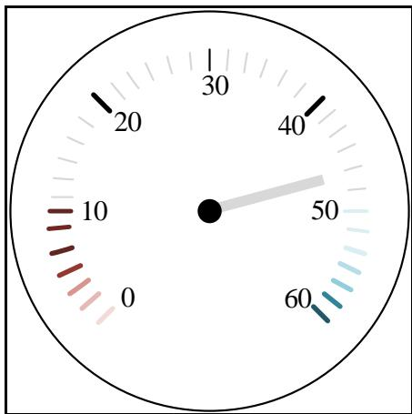  
图32.2.2.2设置某个刻度范围颜色

从上图可知：我们设置仪表从0到10和50到60以某种颜色渐变，这样的功能在仪表部件中是比较常见的。关于这个功能，LVGL官方提供了三个函数，如下表所示：

表 32.2.2.2 绘制指示刻度相关函数  

<table><tr><td>函数</td><td>描述</td></tr><tr><td>lv-meter_add_scale-lines()</td><td>添加刻度线指示刻度</td></tr><tr><td>lv-meter_set_indicator_start_value()</td><td>设置指示刻度的起始值</td></tr><tr><td>lv-meter_set Indicator_end_value()</td><td>设置指示刻度的终止值</td></tr></table>

上述表中的函数也是按照某些顺序执行，首先我们调用函数lv-meter_add_scale-lines在仪表上添加指示刻度，该函数返回指示刻度指针，然后程序根据指示刻度指针设置指示刻度的起始值和终止值，起始值和终止值无需顺序调用。注意：如果仪表不设置起始值，则指示刻度从0开始；如果仪表只添加指示刻度不设置起始值和终止值，则指示刻度不会被绘画出来。

下面我们分别介绍这三个函数，如下所示：

# (1) lv_meter_add_scale-lines 函数

添加刻度线指示刻度，该函数原型如下所示：

```c
lv-meter_indicator_t *lv-meter_add_scale-lines(lv_obj_t *obj,  
lv-meter_scale_t *scale,  
lv_color_t color_start,  
lv_color_t color_end,  
bool local,  
int16_t width_mod);
```

该函数的形参，如下表所示：

<table><tr><td>参数</td><td>描述</td></tr><tr><td>obj</td><td>指向仪表对象的指针</td></tr><tr><td>scale</td><td>指向刻度对象</td></tr><tr><td>color_start</td><td>开始颜色</td></tr><tr><td>color_end</td><td>终止颜色</td></tr><tr><td>local</td><td>true: 渐变, false: 渐变(注: 这两种状态看不出有任何变化)</td></tr><tr><td>width_mod</td><td>指示刻度的宽度</td></tr></table>

表 32.2.2.3 lv meter add scale lines 函数形参描述

返回值：返回指示刻度指针。

# (2)lvmetersetindicatorstartvalue函数

设置指示刻度的起始值，该函数原型如下所示：

```c
void lv-meter_set_indicator_start_value lv_obj_t *obj, lv-meter_indicator_t *indic, int32_t value);
```

该函数的形参，如下表所示：

<table><tr><td>参数</td><td>描述</td></tr><tr><td>obj</td><td>指向仪表对象的指针</td></tr><tr><td>indic</td><td>指向刻度对象</td></tr><tr><td>value</td><td>起始值</td></tr></table>

表 32.2.2.4 lv-meter_set_indicator_start_value 函数形参描述

返回值：无。

# (3)lv-meter_setindicator_end_value函数

设置指示刻度的结束值，该函数原型如下所示：

```c
void lv-meter_set_indicator_end_value lv_obj_t *obj, lv-meter_indicator_t *indic, int32_t value);
```

该函数的形参，如下表所示：

<table><tr><td>参数</td><td>描述</td></tr><tr><td>obj</td><td>指向仪表对象的指针</td></tr><tr><td>indic</td><td>指向刻度对象</td></tr><tr><td>value</td><td>结束值</td></tr></table>

表 32.2.2.4 lv-meter_setindicator_end_value 函数形参描述

返回值：无。

接下来，我们以简单示例来理解仪表指示刻度的设置，示例代码如下所示：

```c
/* 获取当前活动屏幕的宽高 */
#define scr_act_width() lv_obj_get_width(lv_scr_act())
#define scr actu height() lv_obj_get_heightlv_scract()
LV_IMAGE_DECLARE(img_hand)
```

```c
void lv_mainstart(void)   
{ lv_obj_t\* meter  $=$  lv-meter_create(lv_scr_act(); /\*定义并创建仪表\*/ lv_obj_set_width(meter,scr_act_height(); /\*设置仪表宽度\*/ lv_obj_set_height(meter,scr_act_height(); /\*设置仪表高度\*/ /\*设置仪表位置\*/ lv_obj_center(meter); /\*设置仪表刻度\*/ lv-meter_scale_t\* scale  $\equiv$  lv-meter_add_scale(meter); /\*定义并添加刻度\*/ /\*设置小刻度\*/ lv-meter_set_scale_ticks(meter, scale,41,1,10, lv Palette_main(LV_PALETTEGREY)); /\*设置主刻度\*/ lv-meter_set_scalemajor_ticks(meter, scale,8,1,10, lv_color_white(),scract_height() /30); /\*添加指针图像\*/ lv-meter_indicator_t\* indic  $\equiv$  lv-meter_add_needle_img(metric, scale, &img_hand,5,5); /\*设置指针指向的数值\*/ lv-meter_set_indicator_value(meter,indic,54); /\*添加指示刻度，起始颜色为浅蓝色，终止颜色为深蓝色，状态为true，指示刻度为10\*/ indic  $=$  lv-meter_add_scale Lines(meter, scale, lv Palette DARKEN(LV_PALETTE BLUE,1), lv Palette DARKen(LV_PALETTE BLUE,4), true,10); /\*设置指示刻度起始值为50\*/ lv-meter_set_indicator_start_value(meter,indic,50); /\*设置指示刻度终止值为100\*/ lv-meter_set_indicator_end_value(meter,indic,100); }
```

在上述源码中，我们在仪表中添加了指示刻度，该指示刻度由浅蓝色到深蓝色渐变，然后设置了指示刻度的起始值和终止值。示例代码可在PC模拟器上运行，效果如下所示：

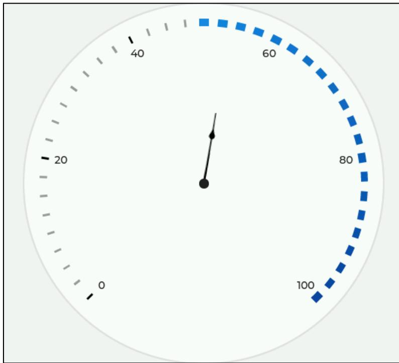  
图32.2.2.3设置指示刻度

# 3. 仪表弧线指示器

仪表弧线指示器也是一样比较常见的仪表功能，该功能和指示刻度具有相似的效果，主要用于引导和提示用户，其示意图如下所示：

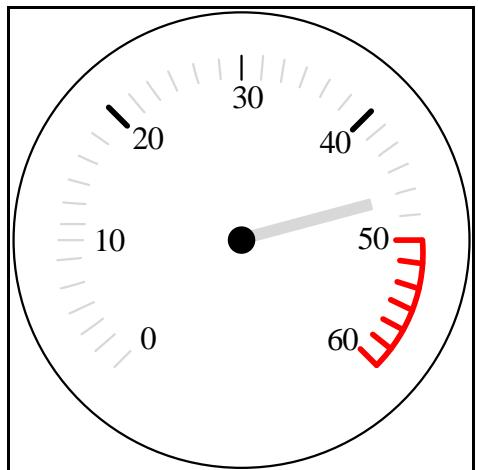  
图32.2.2.4添加仪表弧线指示器

上图中，我们在仪表中添加了弧线指示器，关于这个功能，LVGL官方提供了三个函数，如下表所示：

表 32.2.2.5 绘制弧线指示器相关函数  

<table><tr><td>函数</td><td>描述</td></tr><tr><td>lv-meter_addArc()</td><td>添加弧线指示器</td></tr><tr><td>lv-meter_setindicator_start_value()</td><td>设置指示刻度的起始值</td></tr><tr><td>lv-meter_setindicator_end_value()</td><td>设置指示刻度的终止值</td></tr></table>

上表中第二、三个函数我们已经讲解过，接下来重点介绍第一个函数：

lv-meter_add_ar函数

添加弧线指示器，该函数原型如下所示：

```txt
lv-meter_indicator_t *lv-meter_add.arc(lv_obj_t *obj,
```

```csv
lv-meter_scale_t *scale,  
uint16_t width,  
lv_color_t color,  
int16_t r_mod)
```

该函数的形参，如下表所示：

表 32.2.2.6 lv_meter_add.arc 函数形参描述  

<table><tr><td>参数</td><td>描述</td></tr><tr><td>obj</td><td>指向仪表对象的指针</td></tr><tr><td>scale</td><td>指向刻度对象</td></tr><tr><td>width</td><td>弧线宽度</td></tr><tr><td>color</td><td>弧线颜色</td></tr><tr><td>r_mod</td><td>偏移值</td></tr></table>

返回值：无。

接下来，我们以简单示例来理解仪表弧线指示器的添加，示例代码如下所示：

```c
/* 获取当前活动屏幕的宽高 */
#define scr_act_width() lv_obj_get_width(lv_scr_act())
#define scr actu height() lv_obj_get_height(lv_scract())
LV_IMAGE.Declare(img_hand)
void lv_mainstart(void)
{
    lv_obj_t* meter = lv-meter_create(lv_scr_act()); /* 定义并创建仪表 */
    lv_obj_set_width(meter, scr actu height()); /* 设置仪表宽度 */
    lv_obj_set_height(meter, scr actu height()); /* 设置仪表高度 */
    /* 设置仪表位置 */
    lv_obj_center(meter);
    /* 设置仪表刻度 */
    lv-meter_scale_t* scale = lv-meter_add_scale(meter); /* 定义并添加刻度 */
    /* 设置小刻度 */
    lv-meter_set_scale_ticks(meter, scale, 41, 1, 10,
                          lv Palette_main(LV_PALETTEGREY));
    /* 设置主刻度 */
    lv-meter_set_scalemajor_ticks(meter, scale, 8, 1, 10,
                          lv_color_white(), scr actu height() / 30);
    /* 添加指针图像 */
    lv-meter(indicator_t * indic = lv-meter_add_needle.img(meter,
                          scale,
                                  &img_hand, 5, 5);
    /* 设置指针指向的数值 */
    lv-meter_set_indicator_value(meter, indic, 54);
    /* 添加指示刻度，起始颜色为浅蓝色，终止颜色为深蓝色，状态为 true，指示刻度为 10 */
    indic = lv-meter_add_scale-lines(meter, scale,
                          lv Palette DARKEN(LV_PALETTE BLUE, 1),
                          lv Palette DARKEN(LV_PALETTE BLUE, 4),
                          true, 10);
```

```c
/\*设置指示刻度起始值为50\*/  
lv-meter_setindicator_start_value(metric，indic，50);  
/\*设置指示刻度终止值为100\*/  
lv-meter_setindicator_end_value(metric，indic，100);  
/\*添加弧线指示器，弧线宽度为10，颜色为红色，偏移10\*/  
indic  $=$  lv-meter_add_arc(metric，scale，10,lv Palette_main(LV_PALETTE_red)，10);  
lv-meter_setindicator_start_value(metric，indic，50);  
lv-meter_setindicator_end_value(metric，indic，100);
```

在上述源码中，我们调用了lv-meter_addArc函数来添加弧线指示器，该弧线指示器的宽度为10，弧线颜色为红色，弧线偏移10。示例代码可在PC模拟器上运行，效果如下所示：

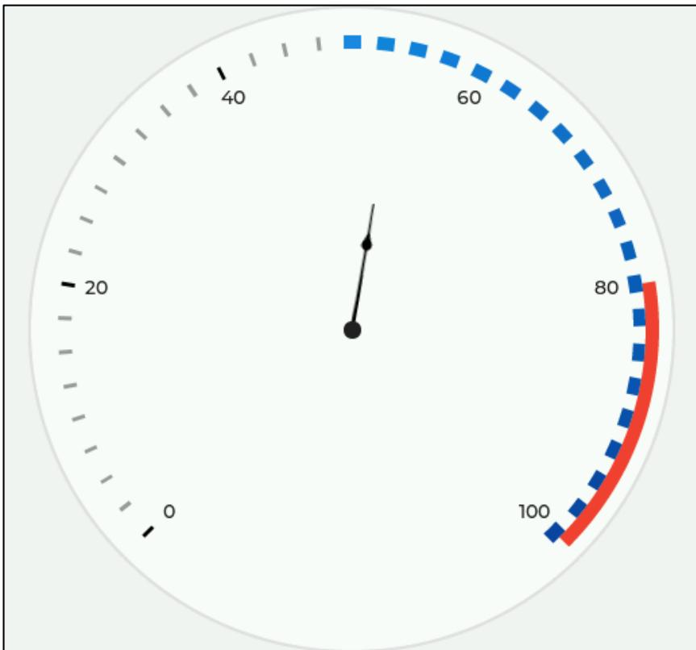  
图32.2.2.5添加弧线指示器

上图中，弧线指示器的范围是  $80\sim 100$  ，弧线往外偏移10步长。

# 32.3 仪表部件 API 函数

LVGL官方提供了一些与仪表部件相关API，如下表所示：  

<table><tr><td>函数</td><td>描述</td></tr><tr><td>lv_meter_create()</td><td>创建仪表对象</td></tr><tr><td>lv_meter_add_scale()</td><td>给仪表添加新刻度</td></tr><tr><td>lv_meter_set_scale_ticks()</td><td>设置小刻度的属性</td></tr><tr><td>lv_meter_set_scalemajor_ticks()</td><td>设置主刻度的属性</td></tr><tr><td>lv_meter_set_scale_range()</td><td>设置数值范围和角度范围</td></tr><tr><td>lv_meter_add_needle_line()</td><td>添加指针</td></tr></table>

表 32.3.1 仪表部件相关的 API 函数  

<table><tr><td>lv-meter_add_needle_img()</td><td>添加图片指针</td></tr><tr><td>lv-meter_addArc()</td><td>添加弧线指示器</td></tr><tr><td>lv-meter_add_scale-lines()</td><td>添加刻度线指示器</td></tr><tr><td>lv-meter_set_indicator_value()</td><td>设置指针的值</td></tr><tr><td>lv-meter_set_indicator_start_value()</td><td>设置刻度的起始值</td></tr><tr><td>lv-meter_set_indicator_end_value()</td><td>设置刻度的终止值</td></tr></table>

# 32.4 仪表部件实验

# 32.4.1 硬件设计

# 1. 例程功能

本实验主要测试仪表部件 API 函数的使用，实验现象：开机后，屏幕上显示三个不同样式和功能的仪表。与此同时，LED0 闪烁，提示系统正在运行。

该实验的完整源码，请参考《LVGL例程32lv_meter(仪表)》例程，路径：A盘  $\rightarrow 4$  ，程序源码  $\rightarrow 3$  ，扩展例程  $\rightarrow 4$  ，LVGL例程。

# 32.4.2 软件设计

# 32.4.2.1 程序流程图

本实验的程序流程图，如下图所示：

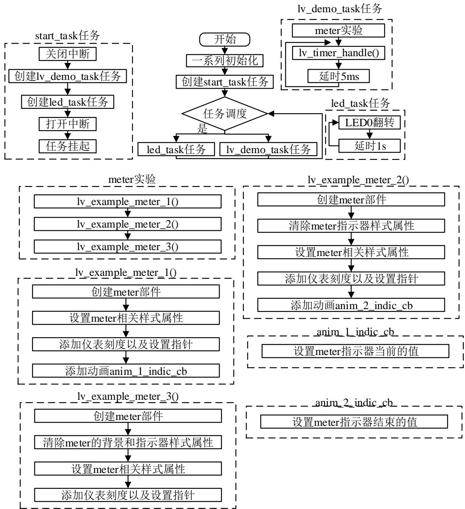  
图32.4.2.1.1 仪表部件实验流程图

# 32.4.2.2 程序解析

关于LVGL的用户代码，我们都是在lv_mainstart.c文件中编写的，本实验的源码如下所示：

```c
/****** 第一部分 开始 /  
/*  
* @brief LVGL 演示  
* @param 无  
* @return 无  
*/  
void lv_mainstart(void)
```

```c
{lv_example_meter_1();lv_example_meter_2();lv_example_meter_3();}  
/****** 第一部分 结束  
/****** 第二部分 开始  
/**** 第二部分 开始  
/*@brief 例1* @param 无* @return 无*/  
static void lv_example_meter_1(void)  
{const lv_font_t* font;/\*根据屏幕大小设置字体\*/if (scr_act_width() <= 320)font  $=$  &lv.Font_montserrat_10;else if (scr_act_width() <= 480)font  $=$  &lv.Font_montserrat_14;elsefont  $=$  &lv.Font_montserrat_16;/\*定义并创建仪表\*/lv_obj_t\* meter  $\equiv$  lv-meter_create(lv_scr_act());/\*设置仪表宽度\*/lv_obj_set_width(meter,scr_act_height()  $\ast$  0.4);/\*设置仪表高度\*/lv_obj_set_height(meter,scr_act_height()  $\ast$  0.4);/\*设置仪表位置\*/lv_obj_align(metric,LVALIGN_CENTER,-scr_act_width() /3,0);\*/设置仪表文字字体\*/lv_obj_set_style_text.Font(metric,font,LV_PART_MAIN);/\*设置仪表刻度\*//\*定义并添加刻度\*/lv-meter_scale_t\* scale  $\equiv$  lv-meter_add_scale(metric);\*/设置小刻度\*/lv-meter_set_scale_ticks(metric,scale,41,1,scr_act_height() /80,lv Palette_main(LV_PALETTEGREY));/\*设置主刻度\*/lv-meter_set_scalemajor_ticks(metric,scale,8,1,
```

```txt
$\mathrm{scr\_act\_height() / 60,lv\_color\_black(),}$  scr actu height() /30); /\*设置指针\*/ lv-meterindicator_t\*indic; indic  $=$  lv-meter_addArc(meter, scale,2, lv Palette_main(LV_PALETTE BLUE),0); lv-meter_setindicator_start_value(meter,indic,0); lv-meter_setindicator_end_value(meter,indic,20); indic  $=$  lv-meter_add_scale-lines(meter, scale, lv Palette_main(LV_PALETTE BLUE), lv Palette_main(LV_PALETTE BLUE),false,0); lv-meter_setindicator_start_value(meter,indic,0); lv-meter_setindicator_end_value(meter,indic,20); indic  $=$  lv-meter_addArc(meter, scale,2, lv Palette_main(LV_PALETTE RED),0); lv-meter_setindicator_start_value(meter,indic,80); lv-meter_setindicator_end_value(meter,indic,100); indic  $=$  lv-meter_add_scaleLines(meter, scale, lv Palette_main(LV_PALETTE RED), lv Palette_main(LV_PALETTE RED),false,0); lv-meter_setindicator_start_value(meter,indic,80); lv-meter_setindicator_end_value(meter,indic,100); indic  $=$  lv-meter_add_needle_line(meter, scale,4, lv Palette_main(LV_PALETTE GREY)，-10); lv_obj_set_user_data(meter，indic); /\*设置指针动画\*/ lv Anim_t a; lv anim_init(&a); lvanim_set_exec_cb(&a,(lvanim_exec_xcb_t)anim_1_indic_cb); lvanim_set_var(&a,meter); lvanim_set_values(&a,0，100); lvanim_set_time(&a，2000); lvanim_setrepeat_delay(&a，100); lvanim_set.Playback_time(&a，500); lvanim_set.playback_delay(&a，100); lvanim_setrepeat_count(&a,LV_ANIM_REPEAT_INFINITE); lvanim_start(&a);   
}   
/\*\*  $@$  brief例1指针动画  $@$  @param meter：对象  $@$  @param value：数值
```

```c
\* @return 无  
\*/  
static void anim_1_indic_cb(lv_obj_t\* meter, int32_t value)  
{lv-meter_indicator_t\* indic = (lv-meter_indicator_t\*)meter->user_data;lv-meter_setIndicator_value(meter, indic, value);  
}  
/\*\* \* @brief 例2\* @param 无\* @return 无\*/  
static void lv_example_meter_2(void)  
{const lv_font_t\* font;/\* 根据屏幕大小设置字体 \*/if (scr_act_width() <= 320)font  $=$  &lv_font_montserrat_8;else if (scr_act_width() <= 480)font  $=$  &lv_font_montserrat_10;elsefont  $=$  &lv_font_montserrat_14;/\* 定义并创建仪表 \*/meter_2 = lv-meter_create(lv_scr_act());/\* 设置仪表宽度 \*/lv_obj_set_width(meter_2,scr_act_height() \* 0.4);/\* 设置仪表高度 \*/lv_obj_set_height(meter_2,scr_act_height() \* 0.4);/\* 设置仪表位置 \*/lv_obj_center(meter_2);/\* 设置仪表文字字体 \*/lv_obj_set_style_text.Font(meter_2,font,LV_PART_MAIN);/\* 删除仪表指针样式 \*/lv_obj_remove_style(meter_2，NULL，LV_PART_INDICATOR);/\* 设置仪表刻度 \*/lv-meter_scale_t\* scale  $=$  lv-meter_add_scale(meter_2);lv-meter_set_scaleTicks(meter_2, scale,11,2,scract_height() / 15,lv Palette_main(LV_PALETTEGrey));lv-meter_set_scalemajorTicks(meter_2, scale,1,2,
```

```c
scr_act_height() / 15, lv_color_hex3(0xEEE), scr_act_height() / 40);  
lv-meter_set_scale_range(metric_2, scale, 0, 100, 270, 90);  
/* 设置指针 */  
lv-meter(indicator_t* indic1 = lv-meter_add_arc(metric_2, scale, scr_act_height() / 45, lv Palette_main(LV_PALETTE_RED), 0);  
lv-meter(indicator_t* indic2 = lv-meter_add_arc(metric_2, scale, scr_act_height() / 45, lv Palette_main(LV_PALETTE.Green), -scr_act_height() / 45);  
lv-meter(indicator_t* indic3 = lv-meter_add_arc(metric_2, scale, scr_act_height() / 45, lv Palette_main(LV_PALETTE BLUE), -scr_act_height() / 22.5);  
/* 设置指针动画 */  
lv_anim_t a;  
lv_anim_init(&a);  
lv_anim_set_exec_cb(&a, (lv_anim_exec_xcb_t)anim_2_indic_cb);  
lv_anim_set_values(&a, 0, 100);  
lv_anim_setrepeat_delay(&a, 100);  
lv_anim_setPlayback_delay(&a, 100);  
lv_anim_setrepeat_count(&a, LV_ANIM_REPEAT_INFINITE);  
lv_anim_set_time(&a, 2000);  
lv_anim_set playback_time(&a, 500);  
lv_anim_set_var(&a, indic1);  
lv_anim_start(&a);  
lv_anim_set_time(&a, 1000);  
lv_anim_set playback_time(&a, 1000);  
lv_anim_set_var(&a, indic2);  
lv_anim_start(&a);  
lv_anim_set_time(&a, 1000);  
lv_anim_set playback_time(&a, 2000);  
lv_anim_set_var(&a, indic3);  
lv_anim_start(&a);  
}  
/* @brief 例2指针动画  
* @param meter:对象
```

```javascript
\* @param value:数值\* @return无\*/static void anim_2_indic_cb(lv-meter_indicator_t\* indic, int32_tvalue)  
{lv-meter_setIndicator_end_value(meter_2，indic，value);  
}  
/\*\* \* @brief 例3\* @param 无\* @return无\*/  
static void lv_example_meter_3(void)  
{/\* 定义并创建仪表\*/lv_obj_t\* meter  $=$  lv-meter_create(lv_scr_act());/\*移除背景样式\*/lv_obj_remove_style(meter，NULL，LV_PART_MAIN);\*/\*移除指针样式\*/lv_obj_remove_style(meter，NULL，LV_PART_INDICATOR);\*/设置仪表宽度\*/lv_obj_set_width(meter，scr(act_height()  $\star$  0.4);\*/设置仪表高度\*/lv_obj_set_height(meter，scr(act_height()  $\star$  0.4);\*/设置仪表位置\*/lv_obj_align(meter，LVALIGN_CENTER，scr(act_width() /3,0);\*/手动更新参数\*/lv_obj_update.layout(meter);\*/设置仪表刻度\*/lv-meter_scale_t\* scale  $=$  lv-meter_add_scale(meter);lv-meter_set_scaleTicks(meter，scale，0，0，0，lv_color_white();lv-meter_set_scale_range(meter，scale，0，100，360，0);\*/设置指针\*/lv_coord_t indic_w  $=$  scr actu_height()  $\star$  0.05;lv-meter_indicator_t\* indic1  $=$  lv-meter_add_arc(meter，scale，indic_w,lv Palette_main(LV_PALETTE_ORANGE)，0);lv-meter_setIndicator_start_value(meter，indic1，0);lv-meter_setIndicator_end_value(meter，indic1，40);lv-meter_indicator_t\* indic2  $=$  lv-meter_add_arc(meter，scale，indic_w,lv Palette_main(LV_PALETTE_YELLOW)，0);/\*Start from the previous\*/
```

```c
lv-meter_setindicator_start_value(metric, indic2, 40);  
lv-meter_setindicator_end_value(metric, indic2, 80);  
lv-meter Indicator_t* indic3 = lv-meter_add_arc(metric, scale, indic_w, lv Palette_main(LV_PALETTE_deep_orANGE), 0);  
/*Start from the previous*/  
lv-meter_setindicator_start_value(metric, indic3, 80);  
lv-meter_setindicator_end_value(metric, indic3, 100);
```

```txt
/****★★★★★★★★★★★★★★★★★★★★★★★★★★★★★★★★★★★★★★★★★★★★★★★★★★★★★★★★★★★★★★★★★★★★★★★★★★★★★★★★★★★★★★★★★★★★★★★★★★★★★★★★★★★★★★★★★★★★★★★★★★★★★★★★★★★★★★★★★★★★★★★★★★★★★★★★★★★★★★★★★★★★★★★★★★★★★★★★★★★★★★★★★★★★★★★★★★★★★★★★★
```

上述源码可分为以下两个部分：

① lv_mainstart 接口函数。在该函数中，我们调用了仪表部件相关的示例函数；  
(2) 不同仪表功能的实现。第一、二个仪表的功能类似，它们只是样式有所区别，实现的逻辑如下：先创建仪表部件，并设置相关的样式属性，然后在仪表部件中添加指针等功能，最后再以动画的形式驱动指针旋转；第三个仪表使用非常规的样式，我们将其背景和指示器都删除，然后设置其指针属性。

# 32.4.3 下载验证

把工程编译并下载到我们的开发板中，运行效果如下图所示：

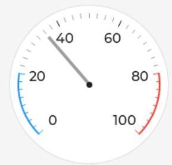  
图32.4.3.1仪表部件实验

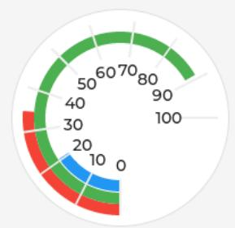

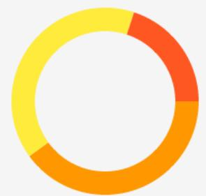

# 第三十三章 消息框部件(lv msgbox)

消息框即消息弹窗，它可用于消息通知、内容提示、信息确认，等等。消息框部件可以设置为模态或非模态，当用户选择模态时，消息框弹出，仅有消息框的区域可点击，其他区域的点击无效。

本章节将分为以下几个小节：

33.1 消息框部件的组成  
33.2 消息框部件的相关知识  
33.3 消息框部件 API 函数  
33.4 消息框部件实验

# 33.1 消息框部件的组成

消息框部件是由多个小部件构建而成的，包括：lv_obj、lv_btn、lv_label和lv_btnmatrix部件，示意图如下所示：

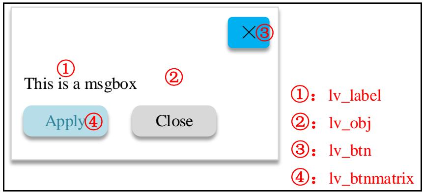  
图33.1.1 消息框部件的组成

关于部件样式设置的内容，请大家参考6.4.4章节。

# 33.2 消息框部件的相关知识

# 33.2.1 创建消息框部件

用户需要创建消息框部件，可以调用lvmsgbox_create函数，该函数具有五个形参，如下所示：

(1) parent: 父对象, 如果该形参为 NULL, 则该消息框部件为模态;  
(2) title: 消息框的标题;  
(3) txt: 消息框的文本;  
④ btmtexts[]：按钮文本的数组；  
⑤ add_closebtn: 添加/不添加关闭按钮。

接下来，我们以简单示例来理解消息框的创建，示例代码如下所示：

```c
void lv_mainstart(void)   
{ static const char\* btns[]  $=$  {"Apply", "Close",""}; lv_obj_t\* lv msgbox  $\equiv$  lvmsgbox_create(NULL, "Hello", "ALIENTEK", btns, true);
```

```javascript
lv_obj_center lvmsgbox);
```

}

在上述代码中，我们调用了lvmsgbox_create函数创建消息框，在该函数中设置消息框标题为“Hello”，消息的内容为“ALIENTEK”，按钮文本为“Apply”和“Close”，并使能关闭按钮。注意：如果该函数的第一个形参为NULL，则该消息框模态。示例代码可以在PC模拟器中运行，效果图如下所示：

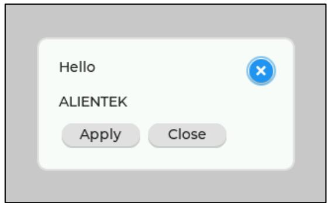  
图33.2.1.1 创建消息框部件

# 33.2.2获取消息框的组成部分

在33.1小节中，我们介绍了消息框部件的组成部分，如果用户需要设置这些组成部分的样式，则需要先将它们获取回来，获取组成部分的相关函数如下：

```c
lv_obj_t * lvmsgbox_get_title lv_obj_t *樘);  
lv_obj_t * lvmsgbox_get_closeBtn(lv_obj_t *樘);  
lv_obj_t * lvmsgbox_get_text lv_obj_t *樘);  
lv_obj_t * lvmsgbox_get_bs(ns lv_obj_t *樘);
```

# 33.2.3 关闭消息框部件

如果用户想手动关闭消息框，可调用lvmsgbox_close函数进行设置。

# 33.2.4 消息框部件事件

消息框部件常用的事件类型为LV_EVENT_VALUE_CHANGED。

# 33.3 消息框部件 API 函数

LVGL官方提供了一些与消息框部件相关API，如下表所示：

<table><tr><td>函数</td><td>描述</td></tr><tr><td>lvmsgbox_create()</td><td>创建消息框部件</td></tr><tr><td>lvmsgbox_get_title()</td><td>获取消息框标题文本对象</td></tr><tr><td>lvmsgbox_get_closeBtn()</td><td>获取关闭按钮对象</td></tr><tr><td>lvmsgbox_get_text()</td><td>获取提示文本对象</td></tr><tr><td>lvmsgbox_get_content()</td><td>获取消息框内容对象</td></tr><tr><td>lvmsgbox_get_bs()</td><td>获取按键矩阵对象</td></tr><tr><td>lvmsgbox_get.activeBtn()</td><td>获取当前按下的按钮索引</td></tr><tr><td>lvmsgbox_get.activeBtn_text()</td><td>获取当前按下的按钮文本</td></tr><tr><td>lvmsgbox_close()</td><td>关闭消息框</td></tr><tr><td>lvmsgbox_close_async()</td><td>异步关闭消息框</td></tr></table>

# 表 33.3.1 消息框部件相关的 API 函数

接下来，我们介绍LVGL消息框部件常用的API函数：

# 1.lv msgbox_create 函数

创建消息框部件，其函数原型如下所示：

```c
lv_obj_t *lvmsgbox_create lv_obj_t *parent, const char *title, const char *txt, const char *btntxts[], bool add_close_btn);
```

该函数的形参描述如下表所示：

<table><tr><td>参数</td><td>描述</td></tr><tr><td>parent</td><td>指向父类的指针，如果设置为 NULL，则消息框为模态</td></tr><tr><td>title</td><td>消息框标题</td></tr><tr><td>txt</td><td>消息框文本</td></tr><tr><td>btntexts</td><td>消息框按键文本数组</td></tr><tr><td>add_closebtn</td><td>true:添加关闭按钮，false：不添加</td></tr></table>

# 表 33.3.2 lv_MSGbox_create 函数形参描述

返回值：指向的消息框指针。

# 2.lvmsgbox_get_title函数

获取消息框标题文本对象，其函数原型如下所示：

```c
lv_obj_t *lv_MSGbox_get_title lv_obj_t *obj);
```

该函数的形参描述如下表所示：

<table><tr><td>参数</td><td>描述</td></tr><tr><td>obj</td><td>指向消息框对象的指针</td></tr></table>

# 表 33.3.3 lvmsgbox_get_title 函数形参描述

返回值：指向消息框标题文本对象的指针。

# 3.lvmsgbox_get_closebtn函数

获取消息框关闭按键对象，其函数原型如下所示：

```c
lv_obj_t *lv_MSGbox_get_closeBtn(lv_obj_t *obj);
```

该函数的形参描述如下表所示：

<table><tr><td>参数</td><td>描述</td></tr><tr><td>obj</td><td>指向消息框对象的指针</td></tr></table>

# 表 33.3.4 lvmsgbox_get_closeBtn 函数形参描述

返回值：指向消息框关闭按键对象的指针。

# 4.lv msgbox_get_text 函数

获取消息框提示文本对象，其函数原型如下所示：

```c
lv_obj_t *lv_MSGbox_get_text lv_obj_t *obj);
```

该函数的形参描述如下表所示：

<table><tr><td>参数</td><td>描述</td></tr><tr><td>obj</td><td>指向消息框对象的指针</td></tr></table>

# 表 33.3.5 lv_MSGbox_get_text 函数形参描述

返回值：指向消息框提示文本对象的指针。

# 5.lv msgbox_close函数

关闭消息框，其函数原型如下所示：

```txt
void lvmsgbox_close(lv_obj_t *mbox);
```

该函数的形参描述如下表所示：

表 33.3.6 lvmsgbox_close 函数形参描述  

<table><tr><td>参数</td><td>描述</td></tr><tr><td>bbox</td><td>指向消息框对象的指针</td></tr></table>

返回值：无。

# 33.4 消息框部件实验

# 33.4.1 硬件设计

# 1. 例程功能

本实验主要测试消息框部件API函数的使用，实验现象：开机后，屏幕上显示一个滑块，用户可以通过滑块调节音量，当音量大于  $80\%$  时，出现弹窗提示。用户点击OK按钮，弹窗关闭。与此同时，LED0闪烁，提示系统正在运行。

该实验的完整源码，请参考《LVGL 例程 33 lvmsgbox(消息框)》例程，路径：A 盘  $\rightarrow$  4，程序源码  $\rightarrow$  3，扩展例程  $\rightarrow$  4，LVGL 例程。

# 33.4.2 软件设计

# 33.4.2.1 程序流程图

本实验的程序流程图，如下图所示：

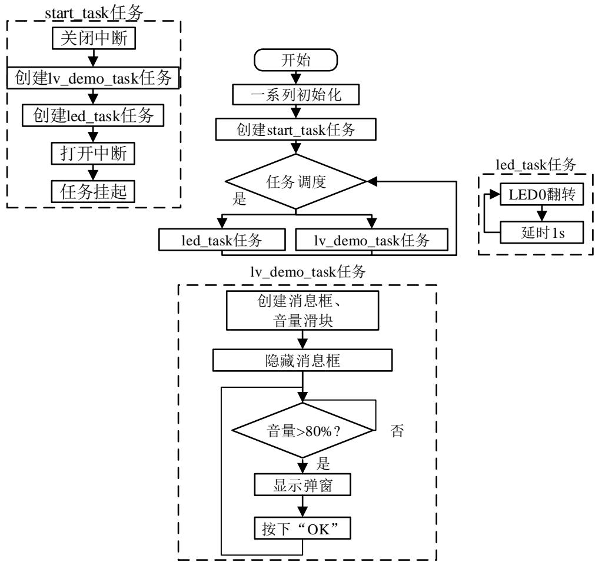  
图33.4.2.1.1 消息框实验流程图

# 33.4.2.2 程序解析

关于LVGL的用户代码，我们都是在lv_mainstart.c文件中编写的，本实验的源码如下所示：

```c
/\*\*\*\*\*\*\*\*\*\*\*\*\*\*\*\*\*\*\*\*\*\*\*\*\*\*\*\*\*\*\*\*\*\*\*\*\*\*\*\*\*\*\*\*\*\*\*\*\*\*\*\*\*\*\*\*\*\*\*\*\*\*\*\*\*\*\*\*\*\*\*\*\*\*\*\*\*\*\*\*\*\*\*\*\*\*\*\*\*\*\*\*\*\*\*\*\*\*\*\*\*  
\*/  
\*@brief LVGL演示  
\* @param 无  
\* @return 无  
\*/  
void lv_mainstart(void)  
{lv_example_slider();lv_example msgbox();}  
\*/\*\*\*\*\*\*\*\*\*\*\*\*\*\*\*\*\*\*\*\*\*\*\*第一部分结束\* /\* /\* /\* /\* /\* /\* /\* /\* /\* /\* /\* /\* /\* /\* /\* /\* /\* /\* /\* /\* /\* /\* /\* /\* /\* /\* /\* /\* /\* /\* /\* /\* /\* /\* /\* /\* /\* /\* /\* /\* /\* /\* /\* /\* /\* /\* /\* /\* /\* /\* \*/
```

```c
\* @brief 滑块事件回调  
\* @param \*e：事件相关参数的集合，它包含了该事件的所有数据  
\* @return 无  
\*/  
static void slider_event_cb(lv_event_t \*e)  
{lv_obj_t \*target = lv_event_get_target(e); /\* 获取触发源 \*/lv_event_code_t code  $=$  lv_event_get_code(e); /\* 获取事件类型 \*/if (code  $= =$  LV_EVENT_VALUE_CHANGED)1lv_label_set_text fmt(slider_label, "%d%%",lv_slider_get_value(target)); /\*获取当前值，更新音量百分比\*/if (lv_slider_get_value(target) >80) /\*音量大于  $80 \%$  /\*\*//\*清除消息框隐藏属性，出现弹窗提示\*/lv_obj_clear_flag(msgbox，LV_OBJ_FLAG_HIDDEN）；1}1  
}  
\*\*\*  $@$  brief 音量调节滑块\* @param 无\* @return 无\*/  
static void lv_example_slider(void)  
{/\*滑块\*/lv_obj_t \*slider  $=$  lv_slider_createLv_scr_act(); /\*创建滑块\*/lv_obj_set_size(slider,scr_ACT_width() /2,20); /\*设置大小\*/lv_obj_center(slider); /\*设置位置\*/lv_slider_set_value(slider,50,LV_ANIM_OFF); /\*设置当前值\*/lv_obj_add_event_cb(slider,slider_event_cb,LV_EVENT_VALUE_CHANGED，NULL）;/\*百分比标签\*/slider_label  $=$  lv_label_createLv_scr_act(); /\*创建百分比标签\*/lv_label_set_text(slider_label,"50%"); /\*设置文本内容\*/lv_obj_set_style_text.Font(slider_label,&lv_font_montserrat_20, LV_STATE_DEFAULT); /\*设置字体\*/lv_obj_align_to(slider_label,slider,LVALIGN_OUT_RIGHT_MID,20,0);
```

```c
/* 音量图标 */
lv_obj_t *sound_label = lv_label_create(lv_scr_act(   )); /* 创建音量标签 */
lv_label_set_text(sound_label, LV_SYMBOL_VOLUME_MAX); /* 设置文本内容 */
lv_obj_set_style_text.Font(sound_label, &lv_font_montserrat_20,
																							(LV_STATE_DEFAULT); /* 设置字体 */
lv_obj_align_to(sound_label, slider, LV ALIGN_OUT_LEFT_MID, -20, 0);
}
/* */
* @brief 消息框事件回调
* @param *e : 事件相关参数的集合，它包含了该事件的所有数据
* @return 无
*/
```

```c
lv_obj_add_event_cb(msgbox, msgbox_event_cb, LV_EVENT_VALUE_CHANGED, NULL);  
/* 消息框标题 */  
lv_obj_t *title = lvmsgbox_get_title(msgbox); /* 获取标题部分 */  
lv_obj_set_style_text.Font(title, &lv_font_montserrat_20, LV_STATE_DEFAULT); /* 设置字体 */  
lv_obj_set_style_text_color(title, lv_color_hex(0xff0000), LV_STATE_DEFAULT); /* 设置文本颜色：红色 */  
/* 消息框主体 */  
lv_obj_t *content = lvmsgbox_get_content(msgbox); /* 获取主体部分 */  
lv_obj_set_style_text.Font(content, &lv-font_montserrat_20, LV_STATE_DEFAULT); /* 设置字体 */  
lv_obj_set_style_text_color(content, lv_color_hex(0x6c6c6c), LV_STATE_DEFAULT); /* 设置文本颜色：灰色 */  
lv_obj_set_style_pad_top(content, 15, LV_STATE_DEFAULT); /* 设置顶部填充 */  
/* 消息框按钮 */  
lv_obj_t *BTN = lvmsgbox_get_btns(msgbox); /* 获取按钮矩阵部分 */  
lv_obj_set_style bg_opa(btn, 0, LV_PART_items); /* 设置按钮背景透明度 */  
lv_obj_set_style-shadow_width(btn, 0, LV_PART_items); /* 去除按钮阴影 */  
lv_obj_set_style_text.Font(btn, &lv_font_montserrat_20, LV_PART_items); /* 设置文本颜色（未按下）：蓝色 */  
lv_obj_set_style_text_color(btn, lv_color_hex(0x2271df), LV_PART_items); /* 设置文本颜色（已按下）：红色 */  
lv_obj_set_style_text_color(btn, lv_color_hex(0xff0000), LV_PART_items|LV_STATE_pressed);  
lv_obj_add_flag(msgbox, LV_OBJ_FLAG_HIDDEN); /* 隐藏消息框 */
```

上述源码可分为以下两个部分：

① lv_mainstart 接口函数。在该函数中，我们调用了滑块和消息框部件相关的示例函数；  
② 弹窗功能的实现。我们先根据创建出音量滑块和消息框部件，然后分别给它们添加事件回调，最后再给消息框部件添加隐藏属性。当用户滑动音量滑块，将会触发滑块的事件回调，在事件回调函数中，如果检测到音量值超过  $80\%$  ，则将消息框的隐藏属性去除，这样即可实现弹窗提示。当弹窗出现之后，如果用户点击 OK 按钮，即可触发消息框的事件回调，在事件回调函数中，消息框将会被关闭。

# 33.4.3 下载验证

把工程编译并下载到开发板中，运行效果如下图所示：

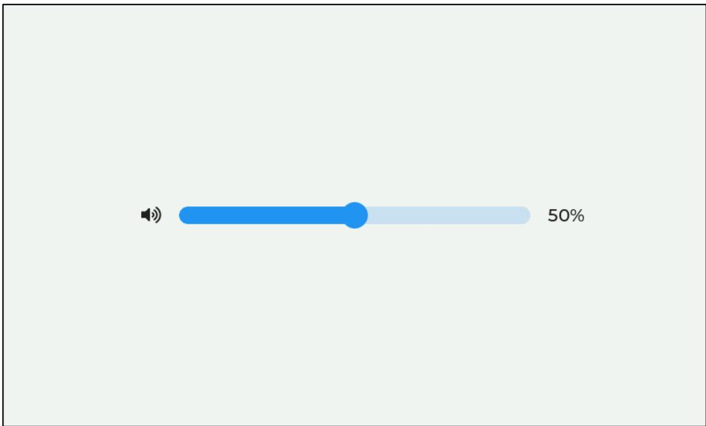  
图33.4.3.1 消息框部件实验主界面

当音量超过  $80\%$  时，出现弹窗提示，如下图所示：

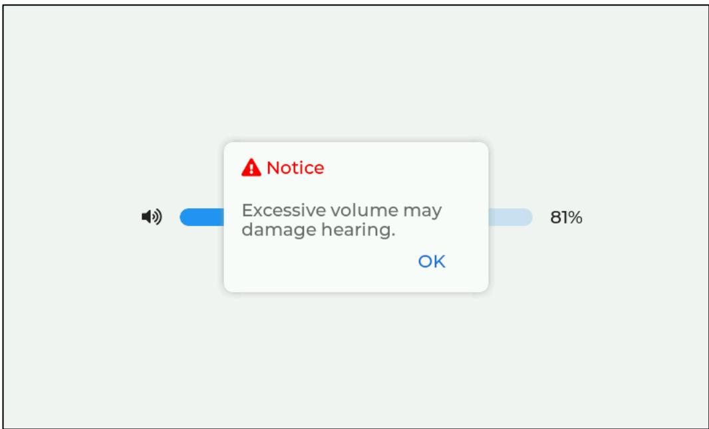  
图33.4.3.2 弹窗提示

用户按下“OK”按钮，即可关闭弹窗。

# 第三十四章 跨度部件(lv.span)

Span 部件常用于文本的修饰，它可以汇聚不同字体、颜色和大小的文本。

本章节将分为以下几个小节：

34.1 Span部件的组成  
34.2 Span 部件的相关知识  
34.3 Span部件API函数  
34.4 Span 部件实验

# 34.1 Span 部件的组成

Span 部件的组成部分仅有一个：主体 LV_PART_MAIN。关于部件样式设置的内容，请大家参考 6.4.4 章节。

# 34.2 Span 部件的相关知识

# 34.2.1 设置文本和样式

Span 部件是用来描述文本以及修改文本样式的，在设置文本样式之前，我们必须创建 Span 部件的描述符，然后设置它的文本样式属性，最后让 Span 部件的样式通过其样式成员配置为普通样式，这样我们就可以使用跨度部件来修饰文本样式了。

接下来，我们结合源码为大家介绍跨度部件使用步骤：

第一步：创建一个普通样式，源码如下所示：

```c
static lv_style_t style; /* 定义普通样式 */
lv_style_init(&style); /* 通样式初始化 */
lv_style_set_border_width(&style, 1); /* 设置边框宽度 */
/* 设置边框颜色 */
lv_style_set_border_color(&style, lv Palette_main(LV_PALETTE_ORANGE)); lv_style_set_pad_all(&style, 2);
```

第二步：调用lv_spangroup_create函数，创建Span部件组，这个组是用来添加Span部件描述符的，源码如下所示：

```c
lv_obj_t * spans = lv_spangroup_create(lv_scr_act()); /* 创建 spans 组 */  
lv_obj_set_width(spans, 400); /* 设置该部件的宽度 */  
lv_obj_set_height(spans, 300); /* 创建该部件的高度 */  
lv_obj_center(spans); /* 中间对齐 */  
/* 把 spans 部件添加到普通样式当中 */  
lv_obj_add_style(spans, &style, 0);  
/* 设置该部件的文本对齐模式 */  
lv_spangroup_set_align(spans, LV_TEXTALIGN_LEFT);  
/* 设置该部件的文本缩进 */  
lv_spangroup_set_indent(spans, 20);  
/* 设置该部件的模式 */  
lv_spangroup_set_mode(spans, LV_SPAN_MODE_BREAK);
```

在上述源码中，我们调用lv_obj_add_style函数，添加普通样式到Span部件，这样即可调用样式属性的设置函数来修饰Span部件上的文本了。

第三步：调用lv_spangroup_new-span函数，创建Span部件的描述符并添加到Span组中，源码如下所示：

```c
lvspan_t \* span  $=$  lv_spangroup_new-span(spans); /\*创建 spans 描述符\*/  
lvSpan_set_text span, "China is a beautiful country.")； /\*设置要显示的文本\*//\*设置该文本的颜色\*/  
lv_style_set_text_color(&span->style，lv Palette_main(LV_PALETTE_RED));/\*设置该文本的字体\*/  
lv_style_set_text.Font(&span->style，&lv_font_montserrat_24);
```

在上述源码中，我们创建Span描述符并添加到Span组中，然后调用lv spans_set_text函数，设置要显示的文本，最后调用样式属性设置函数，修改文本的样式。上述的源码可以在模拟器上运行，运行效果如下所示：

China is a beautiful country.

图34.2.1.1设置文本样式

# 34.2.2 获取 Span 组的子对象

用户需要获取 Span 组的子对象，可以调用 lv_spangroup_get_child (spangroup, id)函数，该函数具有两个形参，它们分别代表 Span 组和索引。注意：如果 id 为 0，则获取 Span 组的第一个子类，如果 id 为 -1，则获取 Span 组的最后一个子类。

# 34.2.3 Span 部件文本对齐

Span部件与标签部件一样，可以设置文本对齐的模式，具体如下表所示：

表 34.2.3.1 Span 部件文本对齐模式  

<table><tr><td>对齐模式</td><td>描述</td></tr><tr><td>LV_TEXT Alignment_LEFT</td><td>文本左对齐</td></tr><tr><td>LV_TEXT Alignment_CENTER</td><td>文本居中对齐</td></tr><tr><td>LV_TEXT Alignment_RIGHT</td><td>文本右对齐</td></tr><tr><td>LV_TEXT Alignment_AUTO</td><td>文本自动对齐</td></tr></table>

如果用户需要修改文本对齐的模式，可以调用lv_spangroup_set_align函数进行设置。

# 34.2.4 Span组的模式选择

Span组的模式有三种，如下表所示：

表 34.2.3.1 Span 组的模式  

<table><tr><td>文本模式</td><td>描述</td></tr><tr><td>LV_SPAN_MODE FIXED</td><td>修复对象大小</td></tr><tr><td>LV_SPAN_MODE_EXPAND</td><td>将对象大小扩展为文本大小，但保持在一行上</td></tr><tr><td>LV_SPAN_MODE_BREAK</td><td>保持宽度，断开太长的行和自动扩大高度</td></tr></table>

当用户创建Span组时，该组一般默认为LV_SPAN_MODE_EXPAND文本模式，如果需要修改文本模式，可以调用lv_spangroup_set_mode函数进行配置。

注意：在LV_SPAN_MODE_BREAK模式下，我们可以设置最大显示行数，这个最大行数的设置函数为lv_spangroup_setlines，如果该函数的第二个形参设置是负值，则表示无限制行数；如果该形参设置为10，则表示最大行数为10行。

# 34.2.5 文本溢出

文本溢出是指文本的大小超过了 Span 组的区域范围，针对这种情况，LVGL 提供了两种溢出模式，如下表所示：

表 34.2.5.1 溢出模式的描述  

<table><tr><td>溢出模式</td><td>描述</td></tr><tr><td>LV_SPAN_OVERFLOW Clip</td><td>在区域限制处截断文本</td></tr><tr><td>LV_SPAN_OVERFLOW_ELLIPSIS</td><td>当文本溢出该区域时，显示省略号(…)</td></tr></table>

接下来，我们以一个示意图来理解这两种溢出模式的效果，如下图所示：

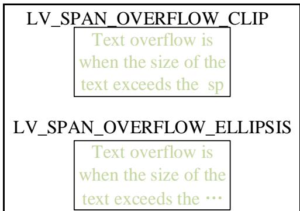  
图34.2.5.1溢出模式的效果

如果用户需要修改溢出的模式，可以调用lv_spangroup_set_overflow函数进行配置。

# 34.2.6 文本首行缩进

用户需要实现文本的首行缩进，可以调用 lv_spangroup_set_indent 函数进行配置，该函数的第二个形参代表缩进的像素大小，除此之外，也可以使用百分比形式来设置文本缩进。

# 34.3 Span 部件 API 函数

LVGL官方提供了一些与Spin部件相关API，如下表所示：

<table><tr><td>函数</td><td>描述</td></tr><tr><td colspan="2">Span部件创建与删除函数</td></tr><tr><td>lv_spangroup_create()</td><td>创建Span组</td></tr><tr><td>lv_spangroup_new spans()</td><td>创建Span描述符</td></tr><tr><td>lv_spangroup_del spans()</td><td>删除Span描述符</td></tr><tr><td colspan="2">Span部件设置函数</td></tr><tr><td>lv spans_set_text()</td><td>设置文本</td></tr><tr><td>lv spans_set_text(static)</td><td>设置文本（静态）</td></tr><tr><td>lv_spangroup_set_align()</td><td>设置文本对齐模式</td></tr><tr><td>lv_spangroup_set_overflow()</td><td>设置溢出模式</td></tr><tr><td>lv_spangroup_set_indent()</td><td>设置文本首行缩进</td></tr><tr><td>lv_spangroup_set_mode()</td><td>设置Span组模式</td></tr><tr><td>lv_spangroup_set-lines()</td><td>设置显示行数</td></tr><tr><td colspan="2">Span部件获取函数</td></tr></table>

表 33.3.1 Span 部件相关的 API 函数  

<table><tr><td>lv_spangroup_get_child()</td><td>获取子类</td></tr><tr><td>lv_spangroup_get_child_cnt()</td><td>获取子类数量</td></tr><tr><td>lv_spangroup_get_align()</td><td>获取对齐模式</td></tr><tr><td>lv_spangroup_get_overflow()</td><td>获取溢出模式</td></tr><tr><td>lv_spangroup_get_indent()</td><td>判断是否首行缩进</td></tr><tr><td>lv_spangroup_get_mode()</td><td>获取Span组模式</td></tr><tr><td>lv_spangroup_get Lines()</td><td>获取显示行数</td></tr><tr><td>lv_spangroup_get_max_line_h()</td><td>获取行的最大高度</td></tr><tr><td>lv_spangroup_get Expand_width()</td><td>获取扩大宽度</td></tr><tr><td>1 lv_spangroup_get Expand_height()</td><td>获取扩大高度</td></tr><tr><td>lv_spangroup_refr_mode()</td><td>更新模式</td></tr></table>

# 34.4 Span部件实验

# 34.4.1 硬件设计

# 1. 例程功能

本实验主要测试 Span 部件 API 函数的使用，实验现象：开机后，屏幕上显示一些不同样式的文本。与此同时，LEDO 闪烁，提示系统正在运行。

该实验的完整源码，请参考《LVGL例程34lv.span(跨度)》例程，路径：A盘  $\rightarrow 4$  ，程序源码  $\rightarrow 3$  ，扩展例程  $\rightarrow 4$  ，LVGL例程。

# 34.4.2 软件设计

# 34.4.2.1 程序流程图

本实验的程序流程图，如下图所示：

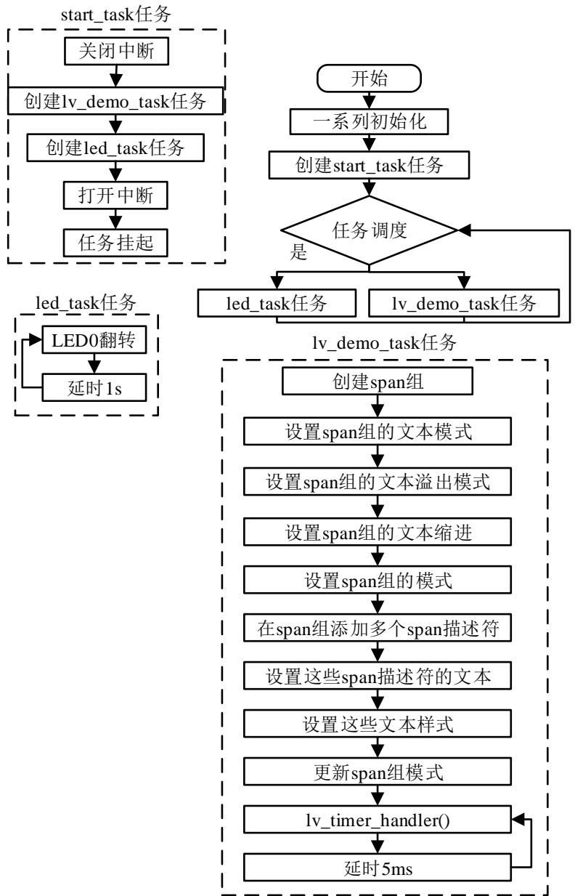  
图34.4.2.1.1 Span部件实验流程图

# 34.4.2.2 程序解析

关于LVGL的用户代码，我们都是在lv_mainstart.c文件中编写的，本实验的源码如下所示：

```c
/\*\*\*\*\*\*\*\*\*\*\*\*\*\*\*\*\*\*\*\*\*\*\*\*\*\*\*\*\*\*\*\*\*\*\*\*\*\*\*\*\*\*\*\*\*\*\*\*\*\*\*\*\*\*\*\*\*\*\*\*\*\*\*\*\*\*\*\*\*\*\*\*\*\*\*\*\*\*\*\*\*\*\*\*\*\*\*\*\*\*\*\*\*\*\*\*\*\*\*\*\*  
\*/  
\* @brief LVGL 演示  
\* @param 无  
\* @return 无  
\*/  
void lv_mainstart(void)  
{lv_exampleSpan();
```

```c
}  
/*********** 第一部分 结束 */
/*********** 第二部分 开始 */
/*  
* @brief 例  
* @param 无  
* @return 无  
*/  
static void lv_exampleSpan(void)  
{  
/* 定义并创建 spangroup */lv_obj_t* spangroup = lv_spangroup_create lv_scr_act();  
/* 设置 spangroup 宽度 */lv_obj_set_width(spangroup, 200);  
/* 设置 spangroup 高度 */lv_obj_set_height(spangroup, 200);  
/* 设置 spangroup 位置 */lv_obj_center(spangroup);  
/* 设置 spangroup 边框宽度 */lv_obj_set_style_border_width(spangroup, 1, LV_PART_MAIN);  
/* 设置 spangroup 边框颜色 */lv_obj_set_style_border_color(spangroup,lv Palette_main(LV_PALETTE_ORANGE),LV_PART_MAIN);  
/* 设置 spangroup 文本对齐方式 */lv_spangroup_set_align(spangroup, LV_TEXTALIGN_LEFT);  
/* 设置 spangroup 溢出 */lv_spangroup_set_overflow(spangroup, LV_SPAN_OVERFLOW_CLAMP);  
/* 设置 spangroup 缩进 */lv_spangroup_set_indent(spangroup, 20);  
/* 设置 spangroup 模式 */lv_spangroup_set_mode(spangroup, LV_SPAN_MODE_BREAK);  
/* 创建并新建 span */lv spans_t* span = lv_spangroup_new-span(spangroup);  
/* 设置 span 文本 */lv spans_set_text span, "This is span 1.";  
/* 设置 span 文本颜色 */lv_style_set_text_color(&span->style, lv Palette_main(LV_PALETTE_RED));  
/* 设置 span 文本格式 */lv_style_set_textdecor(&span->style, LV_TEXT_DECOR_STRIKETHROUGH|LV_TEXT_DECOR UNDERLINE);
```

```c
/* 设置 span 文本透明度 */
lv_style_set_text_opa(&span->style, LV_OPA_30);
/* 新建 span */
span = lv_spangroup_newspan(spangroup);
/* 设置 span 文本 */
lv_style_set_text(static(char* &), "This is span 2. ");
/* 设置 span 文本字体 */
lv-style_set_text.Font(&span->style, &lv_font_montserrat_16);
/* 设置 span 文本颜色 */
lv-style_set_text_color(&span->style, lv Palette_main(LV_PALETTE_GREEN));
/* 新建 span */
span = lv_spangroup_new-span(spangroup);
/* 设置 span 文本 */
lv/style_set_text-static(char* &), "This is span 3. ");
/* 设置 span 文本颜色 */
lv-style_set_text_color(&span->style, lv Palette_main(LV_PALETTE BLUE));
/* 新建 span */
span = lv_spangroup_new-span(spangroup);
/* 设置 span 文本 */
lv/style_set_text-static(char* &), "This is span 4. ");
/* 设置 span 文本颜色 */
lv-style_set_text_color(&span->style, lv Palette_main(LV_PALETTE.Green));
/* 设置 span 文本字体 */
lv-style_set_text.Font(&span->style, &lv_font_montserrat_10);
/* 设置 span 文本格式 */
lv-style_set_text_decor(&span->style, LV_TEXT_DECOR UNDERLINE);
/* 新建 span */
span = lv_spangroup_new-span(spangroup);
/* 设置 span 文本 */
lv/style_set_text(spangroup);
/* 更新 spangroup 模式 */
lv_spangroup_refr_mode(spangroup);
```

上述源码可分为以下两个部分：

① lv_mainstart 接口函数。在该函数中，我们调用了 Span 部件相关的示例函数；  
② 多样式文本的实现。我们先创建出 Span 组，设置其大小、位置、样式以及各种特殊的属性，然后分别添加 5 个子类，并为它们设置不同的内容和样式。

# 34.4.3 下载验证

把工程编译并下载到开发板中，运行效果如下图所示：

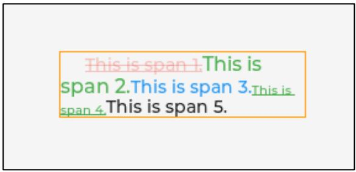  
图34.4.3.1 Span实验界面

# 第三十五章 微调器部件(lv.spinbox)

微调器部件本质上就是一个文本区域部件，它只不过在后者的基础上做了一些延伸。在 UI 设计中，微调器主要用于精确调节某个参数值。

本章节将分为以下几个小节：

35.1 微调器部件的组成  
35.2 微调器部件的相关知识  
35.3 微调器部件 API 函数  
35.4 微调器部件实验

# 35.1 微调器部件的组成

微调器部件本质上就是文本区域部件，它们的组成类似。关于部件样式设置的内容，请大家参考6.4.4章节。

# 35.2 微调器部件的相关知识

# 35.2.1 微调器部件属性设置

# 1.数值格式设置

在默认情况下，微调器部件被创建出来，只能显示5位数，且没有小数点，如下图所示：

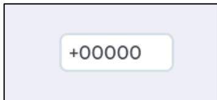  
图35.2.1.1默认的微调器部件

如果用户需要设置总的位数和小数点，可以调用以下函数：

```txt
lvspinbox_set digit_format(sinbox, digit_count, separator_position);
```

上述函数中，digit_count 形参表示总的位数，separator_position 形参表示小数点之前的位数。

接下来，我们以简单示例来理解总位数和小数点的设置，示例代码如下所示：

```c
void lv_mainstart(void)   
{ lv_obj_t \*spinbox  $=$  lvspinbox_create(lv_scr_act());/\*创建微调器部件\*/ lvSpinbox_set digit_format(spinbox,5,2); /\*设置数字格式\*/ lv_obj_set_width(spinbox，100); lv_obj_align_to(spinbox，NULL，LVALIGN_CENTER，0，0);   
}
```

在上述源码中，我们创建了一个微调器部件，然后调用lv.spinbox_set_digit_format函数，设置数字的格式：总的位数为5，小数点之前的位数为2。示例代码可以在PC模拟器中运行，效果图如下所示：

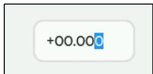  
图35.2.1.2设置数字格式

在上图中，总的位数为5，我们设置了小数点前的位数为2，所以小数点的位数为3。

注意：在微调器部件中，小数点仅仅是“装饰”，它并不会改变最终的数值，例如：微调器部件上面显示55.211，而我们获取它的当前数值，得到的将会是55211。

# 2.数值调整

微调器数值相关的函数如下：

```c
lvspinbox_set_range(spinbox, min, max); /* 设置微调器的数值范围 */
lvSpinbox_set_value(spinbox, num); /* 设置微调器的数值 */
lvSpinbox_increment(spinbox); /* 按步进值递增 */
lvSpinbox_decrement(spinbox); /* 按步进值递减 */
lvSpinbox_set_step(spinbox, step); /* 步进值 */
lvSpinbox_set_pos(spinbox, pos); /* 设置光标位置（决定了控制哪一位数） */
```

lv.spinbox_set_range函数用于设置微调器部件的数值范围，它的第二、三个形参分别表示最小值和最大值（忽略小数点）。

lv_spinbox_set_value函数用于设置微调器部件的当前数值，值得注意的是，设置该数值的时候，小数点是会被忽略的，例如：微调器的总位数为5位，小数为3位，当用户设置当前值为20时，微调器部件只会显示00.020，并不是20.000，示意图如下所示：

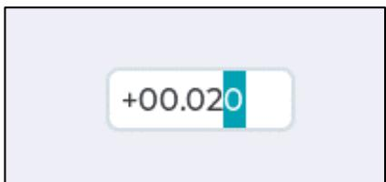  
图35.2.1.3设置当前值

lv.spinbox_set_step 函数用于设置递增递减的步进值，在默认情况下，微调器部件的步进值为 1，如果我们设置为 5，那每一次调用递增或递减函数，微调器的数值将会递增或递减 5。

# 35.2.2 微调器部件翻转模式

为了防止数值自增或自减时超过限制范围，微调器部件提供了翻转模式，用户需要开启该模式，可以调用lvspinbox_set_rollover(spinbox, true/false)函数进行设置。

# 35.3 微调器部件 API 函数

LVGL官方提供了一些与微调器部件相关API，如下表所示：

<table><tr><td>函数</td><td>描述</td></tr><tr><td>lvspinbox_create()</td><td>创建微调器部件</td></tr><tr><td>lvSpinbox_set_value()</td><td>设置微调器部件的数值</td></tr><tr><td>lvSpinbox_set_rollover()</td><td>设置翻转</td></tr><tr><td>lvSpinbox_set digit_format()</td><td>设置数值格式</td></tr><tr><td>lvSpinbox_set_step()</td><td>设置步进值</td></tr><tr><td>lvSpinbox_set_range()</td><td>设置范围</td></tr></table>

表 35.3.1 微调器部件相关的 API 函数  

<table><tr><td>lvspinbox_set_pos()</td><td>设置光标位置</td></tr><tr><td>lvSpinbox_set digit_step发展方向()</td><td>根据编码器数值设置数字步长方向</td></tr><tr><td>lvSpinbox_get_rollover()</td><td>获取翻转状态</td></tr><tr><td>lvSpinbox_get_value()</td><td>获取当前值</td></tr><tr><td>lvSpinbox_get_step()</td><td>获取步进值</td></tr><tr><td>lvSpinbox_step_next()</td><td>将步进除以10，选择下一个较低的数字</td></tr><tr><td>lvSpinbox_step Prev()</td><td>将步进乘以10，选择下一个更高的数字</td></tr><tr><td>lvSpinbox_increment()</td><td>数值自增</td></tr><tr><td>lvSpinbox decrement()</td><td>数值自减</td></tr></table>

接下来，我们介绍LVGL微调器部件常用的API函数：

# 1.lv.spinbox_create函数

创建微调器对象，其函数原型如下所示：

```txt
lv_obj_t *lv.spinbox_create lv_obj_t *parent);
```

该函数的形参描述如下表所示：

表 35.3.2 lvsworth_create 函数形参描述  

<table><tr><td>参数</td><td>描述</td></tr><tr><td>parent</td><td>父对象指针</td></tr></table>

返回值：指向创建的微调器的指针。

# 2.lv.spinbox_set_value函数

设置微调器当前值，其函数原型如下所示：

```c
void lvspinbox_set_value (lv_obj_t *obj, int32_t i);
```

该函数的形参描述如下表所示：

表 35.3.3 lvsworth_set_value 函数形参描述  

<table><tr><td>参数</td><td>描述</td></tr><tr><td>obj</td><td>微调器对象指针</td></tr><tr><td>i</td><td>当前值</td></tr></table>

返回值：无。

# 3.lv.spinbox_set_rollover函数

设置翻转模式，其函数原型如下所示：

```txt
void lvspinbox_set_rollover( lv_obj_t *obj, bool b);
```

该函数的形参描述如下表所示：

表 35.3.4 lvsworth_set_rollover 函数形参描述  

<table><tr><td>参数</td><td>描述</td></tr><tr><td>obj</td><td>微调器对象指针</td></tr><tr><td>b</td><td>true: 启用, false: 禁用(默认)</td></tr></table>

返回值：无。

# 4.lv.spinbox_set_digit_format函数

设置数值格式，其函数原型如下所示：

```txt
void lvspinbox_set digit_format( lv_obj_t *obj, uint8_t digit_count, uint8_t separator_position);
```

该函数的形参描述如下表所示：

<table><tr><td>参数</td><td>描述</td></tr><tr><td>obj</td><td>微调器对象指针</td></tr></table>

表 35.3.5 lv_spinbox_set_digit_format 函数形参描述  

<table><tr><td>digit_count</td><td>总的位数，不包括小数点分隔符和符号</td></tr><tr><td>separator_position</td><td>小数点前的位数。如果为0，则不显示小数点</td></tr></table>

返回值：无。

# 5.lv.spinbox_set_step函数

设置步进值，其函数原型如下所示：

```c
void lvspinbox_set_step(lv_obj_t *obj, uint32_t step);
```

该函数的形参描述如下表所示：

表 35.3.6 lvspinbox_set_step 函数形参描述  

<table><tr><td>参数</td><td>描述</td></tr><tr><td>obj</td><td>微调器对象指针</td></tr><tr><td>step</td><td>步进值</td></tr></table>

返回值：无。

# 6.lv.spinbox_set_range函数

设置微调器的数值范围，其函数原型如下所示：

```c
void lvspinbox_set_range(lv_obj_t *obj, int32_t range_min, int32_t range_max);
```

该函数的形参描述如下表所示：

表 35.3.7 lvsworth_set_range 函数形参描述  

<table><tr><td>参数</td><td>描述</td></tr><tr><td>obj</td><td>微调器对象指针</td></tr><tr><td>range_min</td><td>最小值</td></tr><tr><td>range_max</td><td>最大值</td></tr></table>

返回值：无。

# 7.lv.spinbox_set_pos函数

设置光标的位置，其函数原型如下所示：

```c
void lvspinbox_set_pos (lv_obj_t *obj, uint8_t pos);
```

该函数的形参描述如下表所示：

表 35.3.8 lvsworth_set_pos 函数形参描述  

<table><tr><td>参数</td><td>描述</td></tr><tr><td>obj</td><td>微调器对象指针</td></tr><tr><td>pos</td><td>位置</td></tr></table>

返回值：无。

# 8.lv.spinbox_increment函数

数值递增，其函数原型如下所示：

```txt
void lvspinbox_increment(lv_obj_t \*obj);
```

该函数的形参描述如下表所示：

表 35.3.9 lvsworth_increment 函数形参描述  

<table><tr><td>参数</td><td>描述</td></tr><tr><td>obj</td><td>微调器对象指针</td></tr></table>

返回值：无。

# 9.lv.spinbox_decrement函数

数值递减，其函数原型如下所示：

```javascript
void lvspinbox_decrementlv_obj_t \*obj);
```

该函数的形参描述如下表所示：

<table><tr><td>参数</td><td>描述</td></tr></table>

表 35.3.10 lvsworth_decrement 函数形参描述  

<table><tr><td>obj</td><td>微调器对象指针</td></tr></table>

返回值：无。

# 35.4 微调器部件实验

# 35.4.1 硬件设计

# 1. 例程功能

本实验主要测试微调器部件 API 函数的使用，实验现象：开机后，屏幕上显示一个微调器、和两个按钮（控制递增递减），当用户按下递增或递减按钮时，微调器的值会发生相应的变化，而该值也会通过串口打印出来。与此同时，LED0 闪烁，提示系统正在运行。

该实验的完整源码，请参考《LVGL例程35lv.spinbox(微调器)》例程，路径：A盘  $\rightarrow$  4，程序源码  $\rightarrow 3$  ，扩展例程  $\rightarrow 4$  ，LVGL例程。

# 35.4.2 软件设计

# 35.4.2.1 程序流程图

本实验的程序流程图，如下图所示：

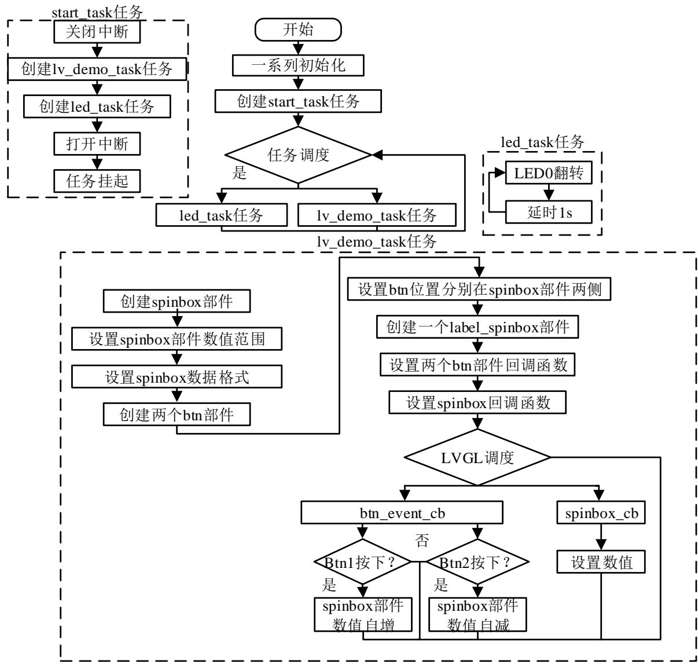  
图35.4.2.1.1 微调器部件实验流程图

# 35.4.2.2 程序解析

关于LVGL的用户代码，我们都是在lv_mainstart.c文件中编写的，本实验的源码如下所示：

```c
/\*\*\*\*\*\*\*\*\*\*\*\*\*\*\*\*\*\*\*\*\*\*\*\*\*\*\*\*\*\*\*\*\*\*\*\*\*\*\*\*\*\*\*\*\*\*\*\*\*\*\*\*\*\*\*\*\*\*\*\*\*\*\*\*\*\*\*\*\*\*\*\*\*\*\*\*\*\*\*\*\*\*\*\*\*\*\*\*\*\*\*\*\*\*\*\*\*\*\*\*\*  
\*/  
\* @brief LVGL 演示  
\* @param 无  
\* @return 无  
\*/  
void lv_mainstart(void)  
{lv_example_spinbox();}  
\*/
```

```c
/* */
* @brief 按钮事件回调
* @param *e : 事件相关参数的集合，它包含了该事件的所有数据
* @return 无
*/
static void.btn_event_cb(cv_event_t *e)
{
    lv_obj_t *target = lv_event_get_target(e); /* 获取触发源 */
    if (target == btn_up) /* 递增按钮按下 */
        lvspinbox_increment(spinbox); /* 数值递增 */
    else if (target == btn_down) /* 递减按钮按下 */
        lvSpinbox_decrement(spinbox); /* 数值递减 */
    }
}
/**
* @brief 微调器事件回调
* @param *e : 事件相关参数的集合，它包含了该事件的所有数据
* @return 无
*/
static void spinbox_event_cb(cv_event_t *e)
{
    float spinbox_value; /* 微调器当前值 */
    lv_event_code_t code = lv_event_get_code(e); /* 获取事件类型 */
    if (code == LV_EVENT_VALUE-changingED)
        spinbox_value = (float)lvSpinbox_get_value(spinbox);
    printf("%lf\r\n", spinbox_value/10);
}
```

```txt
\* @return 无\*/static void lv_examplespinbox(void)  
{/\* 微调器\*/spinbox  $=$  lvspinbox_create(lv_scr_act()); /\* 创建微调器\*/lvSpinbox_set_range(spinbox，-10000，10000); /\* 设置范围值\*/lvSpinbox_set digit_format(spinbox，5，4); /\* 设置数字格式\*/lv_obj_set_size(spinbox，150，47); /\* 设置大小\*/lv_obj_center(spinbox); /\* 设置位置\*/lv_obj_update.layout(spinbox); /\* 更新布局\*/lv_obj_set_style_text.Font(spinbox，&lv_font_montserrat_18，LV_PART_MAIN);lv_obj_set_style_text_align(spinbox，LV_TEXTALIGN_CENTER，LV_PART_MAIN);lv_obj_add_event_cb(spinbox，spinbox_event_cb，LV_EVENT_VALUE_CHANGED，NULL); /\* 添加事件回调\*//\* 递增按钮\*/BTN_up  $\equiv$  lvbtn_create(lv_scr_act()); /\* 创建按钮\*/lv_obj_set_size(BTN_up，38，38)； /\* 设置大小\*/lv_obj_align_to(BTN_up，spinbox，LVALIGN_OUT_LEFT_MID，-10，0）;/\* 设置背景图标\*/lv_obj_set_style bg_img_src(BTN_up，LV_SYMBOL_PLUS，LV_PART_MAIN);\*/添加事件回调\*/lv_obj_add_event_cb(BTN_up，BTN_event_cb，LV_EVENTCLICKED，NULL);/\* 递减按钮\*/BTN_down  $\equiv$  lvbtn_create(lv_scr_act()); /\* 创建按钮\*/lv_obj_set_size(BTN_down，38，38)； /\* 设置大小\*/lv_obj_align_to(BTN_down，spinbox，LVALIGN_OUT_RIGHT_MID，10，0）;/\* 设置背景图标\*/lv_obj_set_style bg_img_src(BTN_down，LV_SYMBOL_MINUS，LV_PART_MAIN);\*/添加事件回调\*/lv_obj_add_event_cb(BTN_down，BTN_event_cb，LV_EVENTCLICKED，NULL);
```

上述源码可分为以下两个部分：

① lv_mainstart 接口函数。在该函数中，我们调用了微调器部件相关的示例函数；  
② 微调器递增递减的实现。我们先创建微调器和两个按钮部件，然后设置这些部件相关样式属性，并为微调器、递增递减按钮添加事件。当用户点击递增或递减按钮时，会触发相应的事件回调，在回调函数中，我们调用递增或递减函数，修改微调器的当前值。当微调器的数值发生变化时，会触发事件回调，在事件回调中，我们获取当前值并将其转换，最后再打印到串口。

# 35.4.3 下载验证

把工程编译并下载到开发板中，运行效果如下图所示：

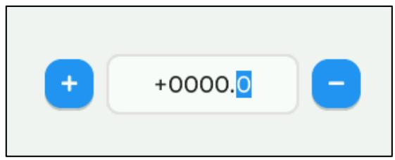  
图35.4.3.1微调器部件实验示意图

当我们点击“+”或者“-”按钮时，微调器数值将发生变化，与此同时，该数值也会被打印到串口。

# 第三十六章 加载器部件(lv Spinner)

加载器在 UI 设计中很常见，它可用于提示用户，当前任务正在加载中。

本章节将分为以下几个小节：

36.1 加载器部件的组成  
36.2加载器部件的相关知识  
36.4加载器部件API函数  
36.5加载器部件实验

# 36.1 加载器部件的组成

加载器部件是由主体背景和指示器组成的，示意图如下所示：

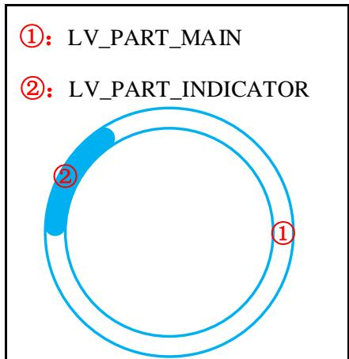  
图36.1.1加载器部件的组成部分

关于部件样式设置的内容，请大家参考6.4.4章节。

# 36.2加载器部件的相关知识

# 1. 创建加载器部件

用户需要创建加载器部件，可调用lv Spinner_create(parent, time, arc_length)函数，该函数有三个形参，parent形参表示部件的父类，time形参表示指示器旋转一圈的时间（以毫秒为单位），arc_length形参表示指示器的长度。

# 36.4加载器部件API函数

加载器部件相关的函数只有一个，如下所示：

# lv Spinner_create 函数

创建加载器部件，其函数原型如下所示：

```txt
lv_obj_t *lv Spinner_create lv_obj_t *parent, uint32_t time, uint32_t arc_length);
```

该函数的形参描述如下表所示：

<table><tr><td>参数</td><td>描述</td></tr><tr><td>parent</td><td>父对象指针</td></tr><tr><td>time</td><td>指示器旋转一圈的时间</td></tr><tr><td>arc_length</td><td>指示器的长度</td></tr></table>

表 36.3.2 lvSpinner_create 函数形参描述

返回值：指向加载器的指针。

# 36.5加载器部件实验

# 36.4.1 硬件设计

# 1. 例程功能

本实验主要测试加载器部件 API 函数的使用，实验现象：开机后，屏幕上显示一个加载器和提示文本（LOADING...）。与此同时，LED0 闪烁，提示系统正在运行。

该实验的完整源码，请参考《LVGL例程36lvSpinner(加载器)》例程，路径：A盘  $\rightarrow 4$  程序源码  $\rightarrow 3$  ，扩展例程  $\rightarrow 4$  ，LVGL例程。

# 36.4.2 软件设计

# 36.4.2.1 程序流程图

本实验的程序流程图，如下图所示：

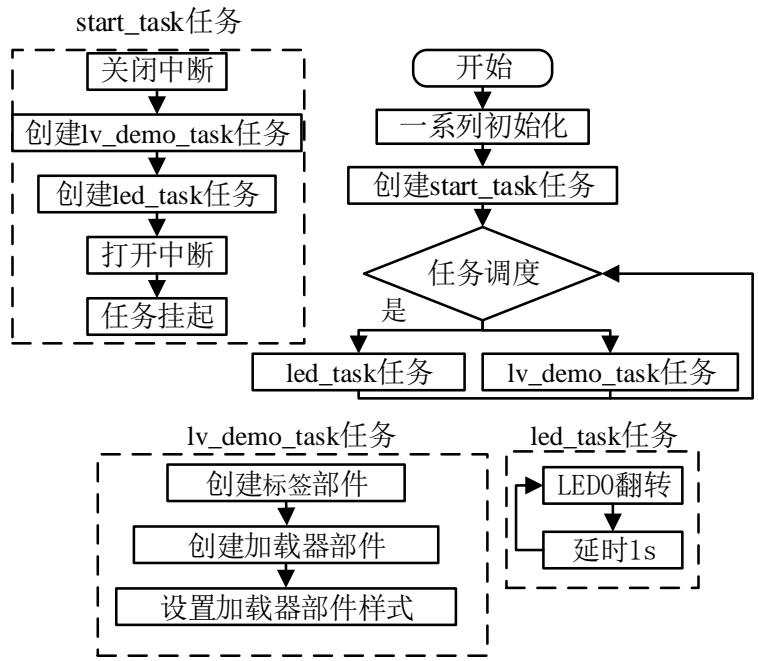  
图36.4.2.1.1加载器部件实验流程图

# 36.4.2.2 程序解析

关于LVGL的用户代码，我们都是在lv_mainstart.c文件中编写的，本实验的源码如下所示：

```txt
/\*\*\*\*\*\*\*\*\*\*\*\*\*\*\*\*\*\*\*\*\*\*\*\*\*\*\*\*\*\*\*\*\*\*\*\*\*\*\*\*\*\*\*\*\*\*\*\*\*\*\*\*\*\*\*\*\*\*\*\*\*\*\*\*\*\*\*\*\*\*\*\*\*\*\*\*\*\*\*\*\*\*\*\*\*\*\*\*\*\*\*\*\*\*\*\*\*\*\*\*\*  
\*/\*  
\* @brief LVGL 演示  
\* @param 无  
\* @return 无
```

```c
\*/   
void lv_mainstart(void)   
{ lv_example_label(); /*加载提示标签*/ lv_example Spinner(); /*加载器显示*/   
}   
/*第部分结束*********/   
//第部分开始*********/   
/*  
* @brief 加载提示标签  
* @param 无  
* @return 无  
*/   
static void lv_example_label(void)   
{ /*根据活动屏幕宽度选择字体*/ if (scr_act_width() <= 480) { font = &lv_font_montserrat_14; } else { font = &lv.Font_montserrat_20; } /*加载标题标签*/ label_load = lv_label_create(lv_scr_act()); lv_label_set_text.labelLabel_load, "LOADING..."); lv_obj_set_style_text.Font.label_load, font, LV_STATE_DEFAULT); lv_obj_align.label_load, LVALIGN_CENTER, 0, scr actu height() / 10);   
}   
/*  
* @brief 加载器显示  
* @param 无  
* @return 无  
*/   
static void lv_example Spinner(void)   
{ spinner = lv spinner_create(lv_scr_act(), 1000, 60); /*创建加载器*/ /*设置位置*/ lv_obj_align(spinner, LV ALIGN_CENTER, 0, -scr actu height() / 15);
```

```c
/* 设置大小 */
lv_obj_set_size(spinner, scr_act_height() / 5, scr_act_height() / 5);
/* 设置主体圆弧宽度 */
lv_obj_set_style_arcl_width(spinner, scr_act_height() / 35, LV_PART_MAIN);
lv_obj_set_style_arcl_width(spinner, scr_act_height() / 35, LV_PART_INDICATOR); /* 设置指示器圆弧宽度 */
********** 第二部分 结束 ***
```

上述源码可分为以下两个部分：

① lv_mainstart 接口函数。在该函数中，我们调用了标签、加载器部件相关的示例函数；  
② 加载页面的实现。我们先根据活动屏幕的宽度来选择字体，然后创建标签部件和加载器部件，并为加载器部件设置样式。

# 36.4.3 下载验证

把工程编译并下载到开发板中，运行效果如下图所示：

  
图36.4.3.1加载器部件实验

LOADING...

# 第三十七章 选项卡视图部件(Iv_tabview)

选项卡视图部件常用于多页面的切换，它的每一个页面就相当于一个容器，用户可以往里面装入自己需要的内容（例如其他的部件）。

本章节将分为以下几个小节：

37.1 选项卡视图部件的组成  
37.2 选项卡视图部件的相关知识  
37.3 选项卡视图部件的 API 函数  
37.4 选项卡视图部件的实验

# 37.1 选项卡视图部件的组成

选项卡视图部件由两个部分组成，示意图如下所示：

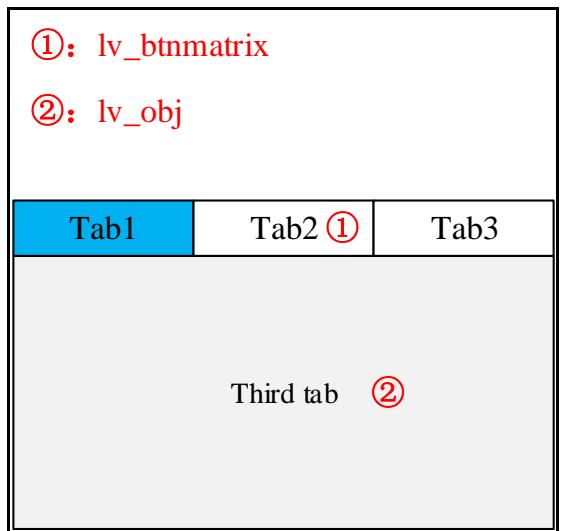  
图37.1.1 选项卡视图部件的组成部分

由上图可知，选项卡视图部件由按钮矩阵和主体容器两部分组成，如果用户需要修改这两部分的样式，则必须先获取相应的组成部分。关于部件样式设置的内容，请大家参考6.4.4章节。

# 37.2 选项卡视图部件的相关知识

# 37.2.1 创建选项卡视图部件

用户需要创建选项卡视图部件，可调用lv_tabview_create(parent,tab_pos,tab_size)函数，该函数有三个形参，parent形参表示父类，tab_pos形参表示选项卡的方向，tab_size形参表示选项卡的大小。接下来，我们结合示意图，帮助大家理解选项卡方向和大小，示意图如下所示：

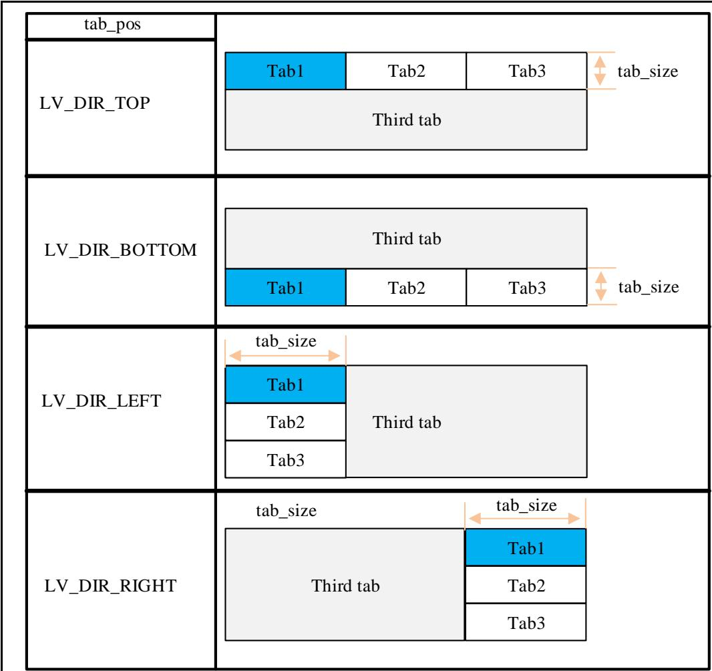  
图37.2.1.1 选项卡的方向和大小

注意：在默认情况下，选项卡视图部件被创建出来，它是没有任何选项卡的。

# 37.2.2 添加选项卡

用户需要添加选项卡，可以调用以下函数：

```c
lv_tabview_add_tab tabview, "tab_name"); /* 添加选项卡 */
```

该函数的第二个形参代表选项卡的名称，当选项卡添加完成后，将会返回一个指向该选项卡的容器的指针，我们可以往这个容器里面添加所需的内容。

接下来，我们以简单示例来理解选项卡的添加，示例代码如下所示：

```c
void lv_mainstart(void)   
{ /\*创建选项卡视图\*/ lv_obj_t\* tabview  $=$  lv_tabview_create(lv_scr_act(),LV_DIR_TOP,50); lv_obj_t\* tab1  $\equiv$  lv_tabview_add_tab(tableview，"Tab1");/\*添加选项卡1\*/ lv_obj_t\* tab2  $\equiv$  lv_tabview_add_tab(tableview，"Tab2");/\*添加选项卡2\*/
```

在上述源码中，我们创建了一个选项卡视图部件，然后调用lv_tabview_add_tab函数添加两个选项卡。示例代码可以在PC模拟器中运行，效果图如下所示：

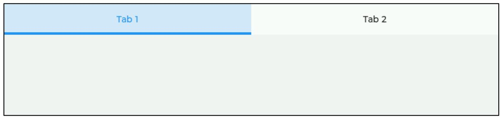  
图37.2.2.1 添加选项卡

# 37.2.3 切换选项卡

用户需要切换选项卡，有以下三种方式：

① 直接点击对应选项卡的按钮；  
② 触摸滑动；  
③ 调用lv_tabview_set_ACT tabview, id, anim_en)函数。

注意：调用lv_tabview_set_tab_ACT函数进行选项卡切换时，其id是从0开始的，换言之，0就是第一个选项卡，1为第二个选项卡，以此类推。

# 37.2.4 获取部件

选项卡视图部件是由按钮矩阵和主体容器两部分组成，如果用户需要修改这两部分的样式，则必须先获取相应的组成部分。获取按钮矩阵和主体容器的相关函数分别为：lv_tabview_get_tab_bs(tableview)、lv_tabview_get_content(tableview)。

# 37.3 选项卡视图部件的 API 函数

LVGL官方提供了一些与选项卡视图部件相关API，如下表所示：

表 37.3.1 选项卡部件相关的 API 函数  

<table><tr><td>函数</td><td>描述</td></tr><tr><td>lv_tabview_create()</td><td>创建选项卡部件</td></tr><tr><td>lv_tabview_add_tab()</td><td>添加选项卡</td></tr><tr><td>lv_tabview_get_content()</td><td>获取选项卡容器对象</td></tr><tr><td>lv_tabview_get_tab_bs()</td><td>获取按键矩阵对象</td></tr><tr><td>lv_tabview_set(act()</td><td>设置当前显示的选项卡</td></tr><tr><td>lv_tabview_get_tab(act()</td><td>获取当前显示的选项卡</td></tr></table>

接下来，我们介绍LVGL选项卡部件常用的API函数：

# 1.lv_tabview_create函数

创建选项卡视图部件，其函数原型如下所示：

```txt
lv_obj_t *lv_tabview_create( lv_obj_t *parent, lv_dir_t tab_pos, lvCOORD_t tab_size);
```

该函数的形参描述如下表所示：

<table><tr><td>参数</td><td>描述</td></tr><tr><td>parent</td><td>父对象</td></tr><tr><td>tab_pos</td><td>选项卡方向</td></tr><tr><td>tab_size</td><td>选项卡大小</td></tr></table>

表 37.3.2 lv_tabview_create 函数形参描述

返回值：指向选项卡视图部件的指针。

# 2.lv_tabview_add_tab函数

添加选项卡，其函数原型如下所示：

```c
lv_obj_t *lv_tabview_add_tab(lv_obj_t *tv, const char *name);
```

该函数的形参描述如下表所示：

<table><tr><td>参数</td><td>描述</td></tr><tr><td>tv</td><td>选项卡视图对象</td></tr><tr><td>name</td><td>选项卡名称</td></tr></table>

表 37.3.3 lv_tabview_add_tab 函数形参描述

返回值：指向选项卡容器对象的指针。

# 3.lv_tabview_get_content函数

获取选项卡容器，其函数原型如下所示：

```c
lv_obj_t *lv_tabview_get_content(lv_obj_t *tv);
```

该函数的形参描述如下表所示：

<table><tr><td>参数</td><td>描述</td></tr><tr><td>tv</td><td>选项卡视图对象</td></tr></table>

表 37.3.4 lv_tabview_get_content 函数形参描述

返回值：指向选项卡容器对象的指针。

# 4.lv_tabview_get_tab_bs函数

获取选项卡视图的按钮矩阵，其函数原型如下所示：

```c
lv_obj_t *lv_tabview_get_tab_bs(nv_obj_t *tv);
```

该函数的形参描述如下表所示：

<table><tr><td>参数</td><td>描述</td></tr><tr><td>tv</td><td>选项卡视图对象</td></tr></table>

表 37.3.5 lv_tabview_get_tab_bs函数形参描述

返回值：选项卡按键矩阵对象。

# 37.4 选项卡视图部件的实验

# 37.4.1 硬件设计

# 1. 例程功能

本实验主要测试选项卡视图部件 API 函数的使用，实验现象：开机后，屏幕上显示一个选项卡，用户可以自行切换选项，以浏览不同页面的内容。与此同时，LEDO 闪烁，提示系统正在运行。

该实验的完整源码，请参考《LVGL例程37lv_tabview(选项卡)》例程，路径：A盘  $\rightarrow 4$  程序源码  $\rightarrow 3$  ，扩展例程  $\rightarrow 4$  ，LVGL例程。

# 37.4.2 软件设计

# 37.4.2.1 程序流程图

本实验的程序流程图，如下图所示：

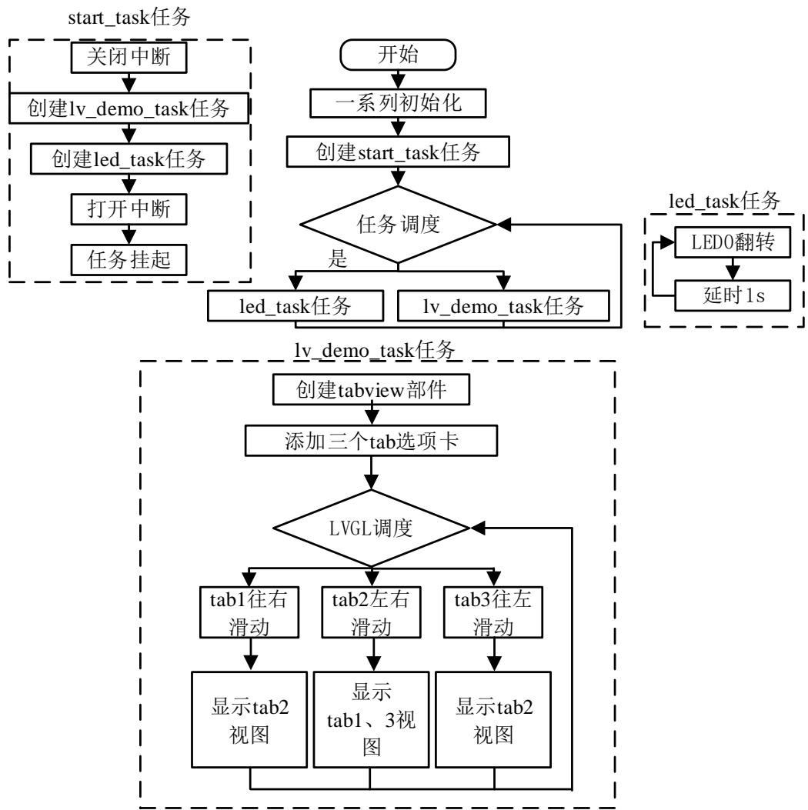  
图37.4.2.1.1 选项卡视图部件实验流程图

# 37.4.2.2 程序解析

关于LVGL的用户代码，我们都是在lv_mainstart.c文件中编写的，本实验的源码如下所示：

```c
/\*\*\*\*\*\*\*\*\*\*\*\*\*\*\*\*\*\*\*\*\*\*\*\*\*\*\*\*\*\*\*\*\*\*\*\*\*\*\*\*\*\*\*\*\*\*\*\*\*\*\*\*\*\*\*\*\*\*\*\*\*\*\*\*\*\*\*\*\*\*\*\*\*\*\*\*\*\*\*\*\*\*\*\*\*\*\*\*\*\*\*\*\*\*\*\*\*\*\*\*\*  
\*/  
\*@brief LVGL演示  
\* @param 无  
\* @return 无  
\*/  
void lv_mainstart(void)  
{lv_example_tabview();}  
\*/\*\*\*\*\*\*\*\*\*\*\*\*\*\*\*\*\*\*\*\*\*\*第一部分结束\*
```

```c
/* */
* @brief 选项卡实例
* @param 无
* @return 无
*/ static void lv_example_tabview(void)
{
    /* 根据屏幕大小设置字体 */
    if (scr_act_width() <= 480)
        {
            font = &lv.Font_montserrat_14;
        }
    else
        {
            font = &lv.Font_montserrat_20;
        }
    /* 第一部分：选项卡（基础） */
    /* 创建选项卡 */
    lv_obj_t *tabview = lv_tabview_createLv_scr_act(), LV_DIR_TOP, scr_act_height() / 6); /* 创建选项卡 */
    lv_obj_set_style_text_font(tableview, font, LV_STATE_DEFAULT); /* 设置字体 */
    lv_obj_t *tab1 = lv_tabview_add_tab(tableview, "Message"); /* 添加选项卡 1 */
    lv_obj_t *tab2 = lv_tabview_add_tab(tableview, "Schedule"); /* 添加选项卡 2 */
    lv_obj_t *tab3 = lv_tabview_add_tab(tableview, "Meeting"); /* 添加选项卡 3 */
    /* 创建标签（在选项卡 1 内） */
    lv_obj_t *label1 = lv_label_createTAB1;
    lv_label_set_text.label1, "Tonight's meeting cancelled.", /* 设置文本内容 */
    lv_obj_center label1; /* 设置位置 */
    /* 创建标签（在选项卡 2 内） */
    lv_obj_t *label2 = lv_label_createTAB2;
    lv_label_set_text.label2, "AM 8:30 meet the client\n\n"
        "PM 13:30 factory tour"; /* 设置文本内容 */
    lv_obj_center label2; /* 设置位置 */
    /* 创建标签（在选项卡 3 内） */
    lv_obj_t *label3 = lv_label_createTAB3;
    lv_label_set_text.label3, "None");
    /* 设置文本内容 */
    lv_obj_center label3; /* 设置位置 */
```

```c
/\*\*\*\*\*\*\*\*\*\*\*\*\*\*\*\*\*\*\*\*\*\*\*\*\*\*\*\*\*\*\*\*\*\*\*\*\*\*\*\*\*\*\*\*\*\*\*\*\*\*\*\*\*\*\*\*\*\*\*\*\*\*\*\*\*\*\*\*\*\*\*\*\*\*\*\*\*\*\*\*\*\*\*\*\*\*\*\*\*\*\*\*\*\*\*\*\*\*\*\*\* /\*1、按钮\*/ /\*获取按钮部分\*/ lv_obj_t \*BTN = lv_tabview_get_tab_bsns(tableview); /\*未选中的按钮\*/ /\*设置按钮背景颜色：橙色\*/ lv_obj_set_style bg_color(bg_t,lv_color(hex(0xb7472a), LV_PART_ITEMs|LV_STATE_DEFAULT); /\*设置按钮背景透明度\*/ lv_obj_set_style bg_opa(bg_t,200,LV_PART_ITEMs|LV_STATE_DEFAULT); /\*设置按钮文本颜色：白色\*/ lv_obj_set_style_text_color(bg,lv_color(hex(0xf3f3f3), LV_PART_ITEMs|LV_STATE_DEFAULT); /\*选中的按钮\*/ /\*设置按钮背景颜色：灰色\*/ lv_obj_set_style bg_color(bg,lv_color(hex(0xe1e1e1), LV_PART_ITEMs|LV_STATE_CHECKED); /\*设置按钮背景透明度\*/ lv_obj_set_style bg_opa(bg,200,LV_PART_ITEMs|LV_STATE_CHECKED); /\*设置按钮文本颜色：橙色\*/ lv_obj_set_style_text_color(bg,lv_color(hex(0xb7472a), LV_PART_ITEMs|LV_STATE_CHECKED); /\*设置按钮边框宽度为0\*/ lv_obj_set_styleborder_width(bg,0,LV_PART_ITEMs|LV_STATE_CHECKED); /\*2、主体\*/ /\*获取主体部分\*/ lv_obj_t \*obj  $=$  lv_tabview_get_content(tableview); /\*设置背景颜色：白色\*/ lv_obj_set_style bg_color(obj,lv_color(hex(0xFFFFFF),LV_STATE_DEFAULT); /\*设置背景透明度\*/ lv_obj_set_style bg_opa(obj,255,LV_STATE_DEFAULT);
```

上述源码可分为以下两个部分：

① lv_mainstart 接口函数。在该函数中，我们调用了选项卡视图部件相关的示例函数；  
② 选项卡页面切换的实现。我们先根据活动屏幕的宽度来选择字体大小，创建选项卡视图部件，然后添加tab1、tab2和tab3三个页面，最后设置这些页面里的内容并优化其样式。

# 37.4.3 下载验证

把工程编译并下载到开发板中，运行效果如下表所示：

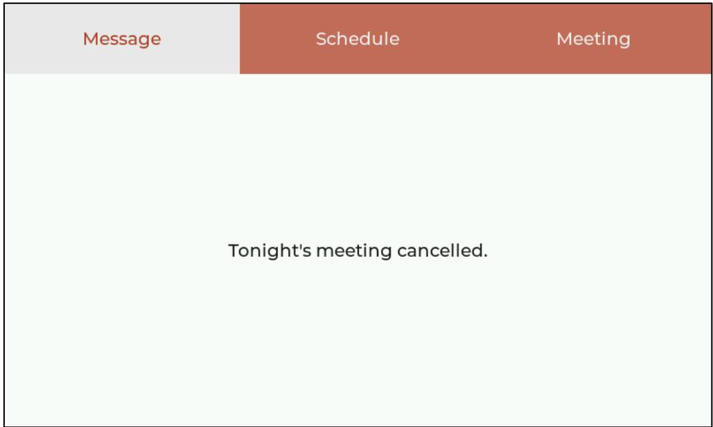  
图37.4.3.1 选项卡视图部件实验

# 第三十八章 平铺视图部件(Iv_TILEview)

平铺视图部件常用于多页面的切换，它的每一个页面就相当于一个容器，用户可以往里面装入自己需要的内容（例如其他的部件），与选项卡视图部件不同的是，它是通过滑动的形式切换页面的，并没有按钮矩阵。

本章节将分为以下几个小节：

38.1 平铺视图部件的组成  
38.2 平铺视图部件的相关知识  
38.3 平铺视图部件的 API 函数  
38.4 平铺视图部件的实验

# 38.1 平铺视图部件的组成

平铺视图部件的组成部分只有一个：主体容器（lv_obj），示意图如下所示：

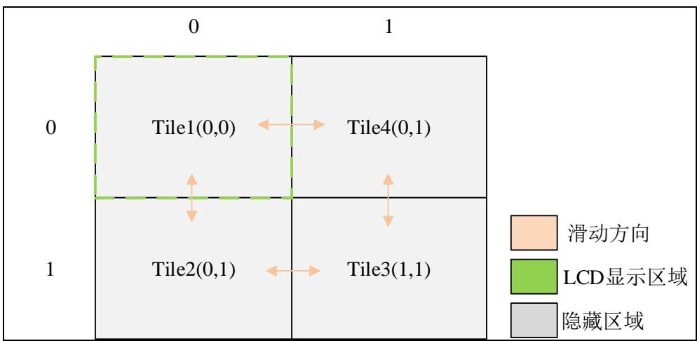  
图38.1.1平铺视图部件的组成

上图中，每一个Tile即一个容器（页面），在正常显示的情况下，只有一个页面可见，其他的页面为隐藏状态，用户可以通过滑动屏幕来切换页面。

关于部件样式设置的内容，请大家参考6.4.4章节。

# 38.2 平铺视图部件的相关知识

# 38.2.1 添加页面

用户需要创建平铺视图部件，可调用lv tileview_create函数，值得注意的是，在默认情况下，该部件被创建出来后并没有任何页面。需要往平铺视图部件中添加页面，可以调用lv tileview_add_TILE函数进行设置，该函数的第二、三个形参代表页面所在的行列坐标（见图38.1.1），第四个形参代表页面切换的方向，该滑动方向的可选参数如下所示：

① LV_DIR_LEFT: 往左滑动;  
② LV_DIR_RIGHT: 往右滑动;  
③ LV_DIR_TOP：往上滑动；  
④ LV_DIR_bottom: 往下滑动;

⑥ LV_DIR_HOR: 水平滑动;  
⑦ LV_DIR.Ver: 垂直滑动;  
⑧ LV_DIR_ALL：全部方向。

注意：需要实现页面的切换，则至少要添加两个页面，且合理设置页面切换的方向，例如：页面1在页面2的左侧，此时，我们应该给页面1添加往右滑动的方向属性，而页面2则是添加往左滑动的方向属性。

当用户添加完页面之后，将会得到指向该页面的容器的指针，我们可以在该容器中添加自己所需的内容。

# 38.2.2 切换页面

切换页面的方法有两种：触摸滑动、调用页面切换函数。页面切换相关的函数如下所示：

```c
/\*根据页面的容器进行切换 \*/  
lv_obj_set_TILE tileview，tile_obj，LV_ANIM_ON/OFF);  
/\*根据页面的坐标进行切换\*/  
lv_obj_set_TILE_id(tileviewv,col_id,row_id，LV_ANIM_ON/OFF);
```

# 38.3 平铺视图部件的 API 函数

LVGL官方提供了一些与平铺视图部件相关API，如下表所示：

表 38.3.1 平铺视图部件相关的 API 函数  

<table><tr><td>函数</td><td>描述</td></tr><tr><td>lv_TILEview_create()</td><td>创建平铺视图部件</td></tr><tr><td>lv_TILEview_add_tile()</td><td>添加页面</td></tr><tr><td>lv_obj_set_tile()</td><td>根据容器切换页面</td></tr><tr><td>lv_obj_set_tile_id()</td><td>根据坐标切换页面</td></tr><tr><td>lv_TILEview_get_tile actu()</td><td>获取当前的页面</td></tr></table>

接下来，我们介绍LVGL平铺视图部件常用的API函数：

# 1.lv_TILEview_create函数

创建平铺视图部件，其函数原型如下所示：

```txt
lv_obj_t *lv_TILEview_create lv_obj_t *parent);
```

该函数的形参描述如下表所示：

表 38.3.2 lv tileview_create 函数形参描述  

<table><tr><td>参数</td><td>描述</td></tr><tr><td>parent</td><td>父对象指针</td></tr></table>

返回值：指向平铺视图部件的指针。

# 2.lv tileview_add_TILE 函数

添加页面，其函数原型如下所示：

```c
lv_obj_t *lv_TILEview_add_TILE(lv_obj_t *tv, uint8_t col_id, uint8_t row_id, lv_dir_t dir);
```

该函数的形参描述如下表所示：

<table><tr><td>参数</td><td>描述</td></tr><tr><td>tv</td><td>平铺视图对象指针</td></tr><tr><td>col_id</td><td>列ID</td></tr><tr><td>row_id</td><td>行ID</td></tr><tr><td>dir</td><td>滑动方向</td></tr></table>

表 38.3.3 lv tileview_create 函数形参描述

返回值：指向页面容器的指针。

# 3.lv_obj_set_TILE函数

根据容器切换页面，其函数原型如下所示：

```sql
void lv_obj_set_TILE( lv_obj_t *tv, lv_obj_t *tile_obj, lvanim_enable_t anim_en);
```

该函数的形参描述如下表所示：

表 38.3.4 lv_obj_set_TILE 函数形参描述  

<table><tr><td>参数</td><td>描述</td></tr><tr><td>tv</td><td>平铺视图对象指针</td></tr><tr><td>tile_obj</td><td>页面容器对象</td></tr><tr><td>anim_en</td><td>是否启用动画效果</td></tr></table>

返回值：无。

# 4.lv_obj_set_TILE_id函数

根据坐标切换页面，其函数原型如下所示：

```c
void lv_obj_set_TILE_id( lv_obj_t *tv, uint32_t col_id, uint32_t row_id, lv_ANIM_enable_t anim_en);
```

该函数的形参描述如下表所示：

表 38.3.5 lv_obj_set_TILE_id 函数形参描述  

<table><tr><td>参数</td><td>描述</td></tr><tr><td>tv</td><td>平铺视图对象指针</td></tr><tr><td>col_id</td><td>列ID</td></tr><tr><td>row_id</td><td>行ID</td></tr><tr><td>anim_en</td><td>是否启用动画效果</td></tr></table>

返回值：无。

# 5.lv tileview_get_TILE actu函数

获取当前页面，其函数原型如下所示：

```txt
lv_obj_t *lv_TILEview_get_TILE actuLV_obj_t \*obj);
```

该函数的形参描述如下表所示：

表 38.3.6 lv_TILEview_get_TILE actu函数形参描述  

<table><tr><td>参数</td><td>描述</td></tr><tr><td>obj</td><td>平铺视图对象指针</td></tr></table>

返回值：无。

# 38.4 平铺视图部件的实验

# 38.4.1 硬件设计

# 1. 例程功能

本实验主要测试平铺视图部件 API 函数的使用，实验现象：开机后，屏幕上默认显示平铺视图部件的页面 1，用户可以通过左右滑动屏幕来切换不同的页面。与此同时，LED0 闪烁，提示系统正在运行。

该实验的完整源码，请参考《LVGL 例程 38 lv_TILEview(平铺视图)》例程，路径：A 盘  $\rightarrow$  4，程序源码  $\rightarrow$  3，扩展例程  $\rightarrow$  4，LVGL 例程。

# 38.4.2 软件设计

# 38.4.2.1 程序流程图

本实验的程序流程图，如下图所示：

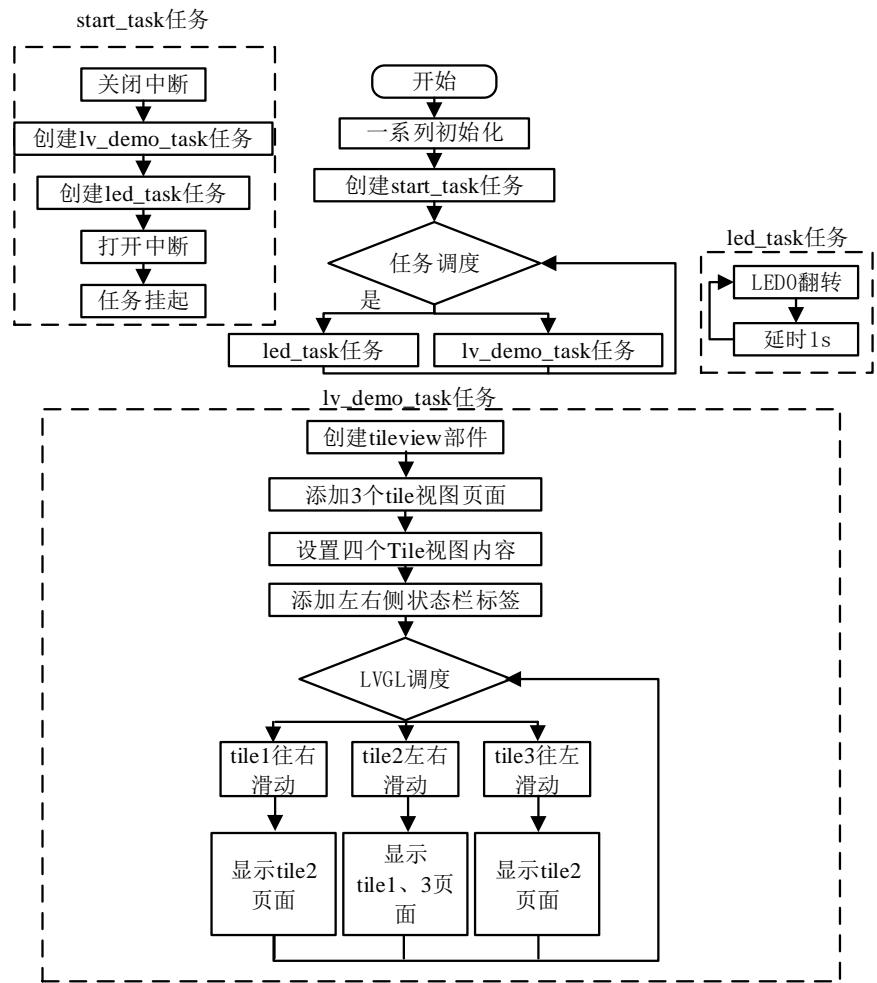  
图38.4.2.1.1平铺视图部件实验流程图

# 38.4.2.2 程序解析

关于LVGL的用户代码，我们都是在lv_mainstart.c文件中编写的，本实验的源码如下所示：

```c
/**
* @brief LVGL 演示
* @param 无
* @return 无
*/
void lv_mainstart(void)
{
    lv_example TILEview();
}
/**
* 第一部分 结束 */
*/
* 第二部分 开始 */
*/
*/
* @brief 平铺视图实例
* @param 无
* @return 无
*/
static void lv_example_TILEview(void)
{
    /* 根据屏幕宽度设置字体 */
    if (scr_act_width() <= 480)
        {
            font = &lv_font_montserrat_14;
        }
    else
        {
            font = &lv.Font_montserrat_20;
        }
    /* 创建平铺视图页面 */
    lv_obj_t *tileview = lv Tileview_create(lv_scr_act());
    /* 创建平铺视图 */
    /* 添加页面 1 */
    lv_obj_t *tile_1 = lv Tileview_add_tile( tileview, 0, 0, LV_DIR_RIGHT );
    /* 添加页面 2 */
    lv_obj_t *tile_2 = lv Tileview_add_tile( tileview, 1, 0, LV_DIR_LEFT | LV_DIR_RIGHT );
    /* 添加页面 3 */
    lv_obj_t *tile_3 = lv Tileview_add_tile( tileview, 2, 0, LV_DIR_LEFT );
    /* 设置页面内容 */
    lv_obj_t *label_1 = lv_label_create tile_1; /* 创建标签 */
};
```

```c
lv_label_set_text.label_1, "Page_1"); /*设置文本内容*/lv_obj_set_style_text.Font.label_1,font，LV_STATE_DEFAULT); /*设置字体*/lv_obj_center labelled_1); /*设置位置*/lv_obj_t *label_2 = lv_label_create(tile_2); /*创建标签*/lv_label_set_text labelled_2, "Page_2"); /*设置文本内容*/lv_obj_set_style_text.Font labelled_2,font，LV_STATE_DEFAULT); /*设置字体*/lv_obj_center labelled_2); /*设置位置*/lv_obj_t *label_3 = lv_label_create(tile_3); /*创建标签*/lv_label_set_text labelled_3, "Page_3"); /*设置文本内容*/lv_obj_set_style_text.Font labelled_3,font，LV_STATE_DEFAULT); /*设置字体*/lv_obj_center labelled_3); /*设置位置*/lv_obj_remove_style tileview，NULL，LV_PART_SCROLLBAR); /*移除滚动条*//\*左侧状态栏\*/lv_obj_t *label_left  $=$  lv_label_create lv_scr_act(); /*创建标签\*/lv_label_set_text.label_left, "AM 8:30"); /*设置文本内容\*/lv_obj_set_style_text.Font.label_left,font,LV_STATE_DEFAULT); /*设置字体\*/lv_obj_align labelled_left，LV ALIGN_TOP_LEFT，10，10）; /*设置位置\*//\*右侧状态栏\*/lv_obj_t *label_right  $=$  lv_label_create (lv_scr_act()); /*创建标签\*/lv_label_set_text.label_right，LV_SYMBOL_WIFI"  $80 \%$  LV_SYMBOL_BATTERY_3); /*设置文本内容\*/\*设置字体\*/lv_obj_set_style_text.Font.label_right，font，LV_STATE_DEFAULT); /lv_obj_align labelled_right，LVALIGN_TOP_RIGHT，-10，10）; /*设置位置\*/}
```

上述源码可分为以下两个部分：

① lv_mainstart 接口函数。在该函数中，我们调用了平铺视图部件相关的示例函数；  
② 平铺视图页面切换的实现。我们先根据活动屏幕的宽度来选择字体大小，创建平铺视图部件，并为其添加3个页面，然后在不同的页面中添加具体的内容。最后，我们在屏幕的顶部添加了状态栏相关的标签，用于显示时间和系统状态。

# 38.4.3 下载验证

把工程编译并下载到开发板中，运行效果如下图所示：

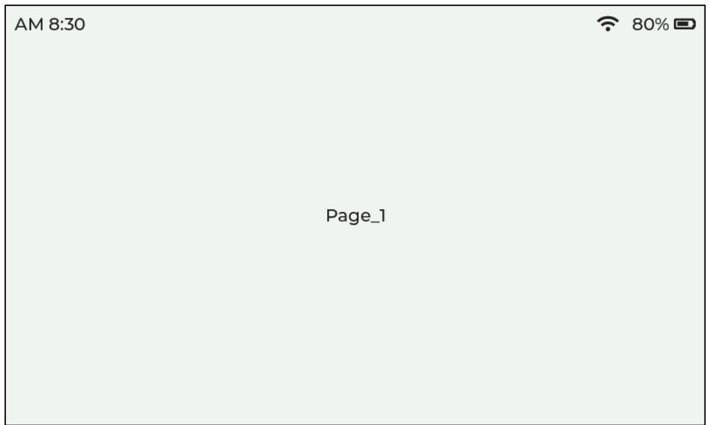  
图38.4.3.1平铺视图部件实验

# 第三十九章 窗口部件(lv_win)

窗口部件就是一个灵活的页面，它常用于任务的前后台切换、多任务协同处理等场景。

本章节将分为以下几个小节：

39.1 窗口部件的组成  
39.2 窗口部件的相关知识  
39.3 窗口部件的 API 函数  
39.4 窗口部件的实验

# 39.1 窗口部件的组成

窗口部件是由四个小部件组成，示意图如下所示：

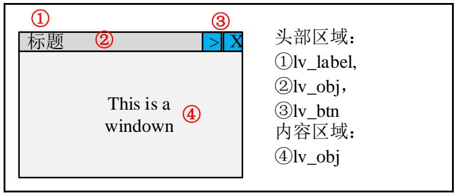  
图39.1.1 窗口部件的组成

注意：如果需要设置内容区域的样式，则要先将该部分获取回来。关于部件样式设置的内容，请大家参考6.4.4章节。

# 39.2 窗口部件的相关知识

# 39.2.1 创建窗口

用户可以调用lv_win_create函数来创建窗口，该函数有两个形参，第一个形参指向窗口的父类，第二个形参代表窗口头部区域的高度。

# 39.2.2 添加标题与按键

用户可调用lv_win_add_title函数来添加标题，该函数设置的文本会添加到图39.1.1的头部区域中。

用户可调用lv_win_addbtn函数来添加按钮，该函数的icon形参代表图像源，BTN_width形参代表按钮的宽度。

注意：标题和按钮将按照函数的调用顺序添加，添加的方向为：从左向右，换言之，哪一部分先添加，则该部分排在左边。

下面我们结合示意图，帮助大家理解标题和按钮的添加顺序，示意图如下所示：

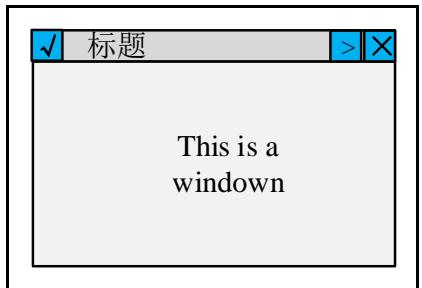  
图39.2.2.1添加标题和按钮

上图中，按钮“√”最先被添加，然后依次是标题、按钮“>”和按钮“×”。

# 39.2.3 获取窗口的组成部分

窗口主要分为两个区域：头部和内容，这两部分的获取函数分别为lv_win_get_header、lv_win_get_content。

# 39.3 窗口部件的 API 函数

LVGL官方提供了一些与窗口部件相关API，如下表所示：

表 39.3.1 窗口部件相关的 API 函数  

<table><tr><td>函数</td><td>描述</td></tr><tr><td>lv_win_create()</td><td>创建窗口部件</td></tr><tr><td>lv_win_add_title()</td><td>添加标题</td></tr><tr><td>lv_win_addBtn()</td><td>添加按钮</td></tr><tr><td>lv_win_get_header()</td><td>获取头部区域</td></tr><tr><td>lv_win_get_content()</td><td>获取内容区域</td></tr></table>

接下来，我们介绍LVGL窗口部件常用的API函数：

# 1.lv_win_create函数

创建窗口部件，其函数原型如下所示：

```c
lv_obj_t *lv_win_create lv_obj_t *parent, lv Coordinate_t header_height);
```

该函数的形参描述如下表所示：

表 39.3.2 lv_win_create 函数形参描述  

<table><tr><td>参数</td><td>描述</td></tr><tr><td>parent</td><td>父对象指针</td></tr><tr><td>header_height</td><td>头部区域的高度</td></tr></table>

返回值：指向窗口的指针。

# 2.lv_win_add_title函数

添加窗口标题，其函数原型如下所示：

```c
lv_obj_t *lv_win_add_title lv_obj_t *win, const char *txt);
```

该函数的形参描述如下表所示：

表 39.3.3 lv_win_add_title 函数形参描述  

<table><tr><td>参数</td><td>描述</td></tr><tr><td>win</td><td>指向窗口对象的指针</td></tr><tr><td>txt</td><td>标题的文本</td></tr></table>

返回值：指向标题的指针。

# 3.lv_win_addbtn函数

添加按钮，其函数原型如下所示：

```c
lv_obj_t *lv_win_add_btn(lv_obj_t *win, const void *icon, lv_coord_t btn_w);
```

该函数的形参描述如下表所示：

表 39.3.4 lv_win_addBtn 函数形参描述  

<table><tr><td>参数</td><td>描述</td></tr><tr><td>win</td><td>指向窗口对象的指针</td></tr><tr><td>icon</td><td>图像源</td></tr><tr><td>btn_w</td><td>按钮的宽度</td></tr></table>

返回值：指向按钮的指针。

# 4.lv_win_get_header函数

获取头部区域，其函数原型如下所示：

```c
lv_obj_t *lv_win_get_header lv_obj_t *win);
```

该函数的形参描述如下表所示：

表 39.3.5 lv_win_get_header 函数形参描述  

<table><tr><td>参数</td><td>描述</td></tr><tr><td>win</td><td>指向窗口对象的指针</td></tr></table>

返回值：指向头部区域的指针。

# 5.lv_win_get_content函数

获取主体内容区域，其函数原型如下所示：

```c
lv_obj_t *lv_win_get_content (lv_obj_t *win);
```

该函数的形参描述如下表所示：

表 39.3.6 lv_win_get_content 函数形参描述  

<table><tr><td>参数</td><td>描述</td></tr><tr><td>win</td><td>指向窗口对象的指针</td></tr></table>

返回值：指向内容区域的指针。

# 39.4 窗口部件的实验

# 39.4.1 硬件设计

# 1. 例程功能

本实验主要测试窗口部件 API 函数的使用，实验现象：开机后，屏幕上显示一个设置窗口，用户可以通过滑块来调节音量。与此同时，LED0 闪烁，提示系统正在运行。

该实验的完整源码，请参考《LVGL 例程 39 lv_win(窗口)》例程，路径：A 盘  $\rightarrow 4$  ，程序源码  $\rightarrow 3$  ，扩展例程  $\rightarrow 4$  ，LVGL 例程。

# 39.4.2 软件设计

# 39.4.2.1 程序流程图

本实验的程序流程图，如下图所示：

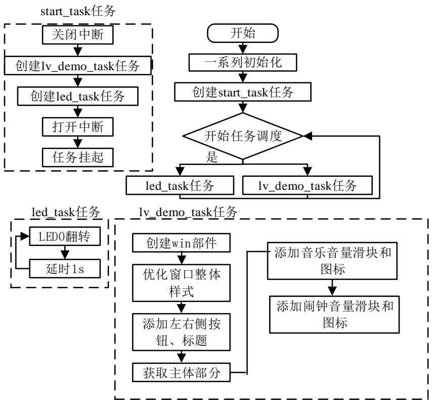  
图39.4.2.1.1LVGL窗口部件实验流程图

# 39.4.2.2 程序解析

关于LVGL的用户代码，我们都是在lv_mainstart.c文件中编写的，本实验的源码如下所示：

```c
/\*\*\*\*\*\*\*\*\*\*\*\*\*\*\*\*\*\*\*\*\*\*\*\*\*\*\*\*\*\*\*\*\*\*\*\*\*\*\*\*\*\*\*\*\*\*\*\*\*\*\*\*\*\*\*\*\*\*\*\*\*\*\*\*\*\*\*\*\*\*\*\*\*\*\*\*\*\*\*\*\*\*\*\*\*\*\*\*\*\*\*\*\*\*\*\*\*\*\*\*\*  
\*/\*@brief LVGL演示\* @param 无\* @return 无\*/void lv_mainstart(void){lv_example_win();}  
/\*\*\*\*\*\*\*\*\*\*\*\*\*\*\*\*\*\*\*\*第一部分结束\*  $\text{三}$ $\text{三}$ $\text{三}$ $\text{三}$ $\text{三}$ $\text{三}$ $\text{三}$ $\text{三}$ $\text{三}$ $\text{三}$ $\text{三}$ $\text{三}$ $\text{三}$ $\text{三}$ $\text{三}$ ${}^{3}$ $\text{三}$ $\text{三}$ $\text{三}$ $\text{三}$ $\text{三}$ $\text{三}$ $\text{三}$ $\text{三}$ $\text{三}$ $\text{三}$ $\text{三}$ $\text{三}$ $\text{三}$ $\text{三}$ \*  
/\*@\*brief按钮事件回调\* @param  $^{\star}e$  ：事件相关参数的集合，它包含了该事件的所有数据\* @return 无\*/  
static void btn_event_cb(lv_event_t  $^{\star}e$  ）
```

```c
{lv_event_code_t code  $=$  lv_event_get_code(e); /\*获取事件类型\*/if(code  $\equiv$  LV_EVENTCLICKED) /\*按钮按下\*/{lv_obj_add_flag(win，LV_OBJ_FLAG_HIDDEN)；/\*隐藏窗口\*/}  
1  
\*\* \*@brief 窗口实例\* @param 无\* @return 无\*/  
static void lv_example_win(void)  
{/\*根据屏幕宽度选择字体\*/if (scr_act_width() <= 480){font  $=$  &lv_font_montserrat_12;1else{font  $=$  &lv_font_montserrat_20;1/\*\*\*\*\*\*\*\*\*\*\*\*\*\*\*\*\*\*\*\*\*\*\*\*\*\*\*\*\*\*\*\*\*\*\*\*\*\*\*\*\*\*\*\*\*\*\*\*\*\*\*\*\*\*\*\*\*\*\*\*\*\*\*\*\*\*\*\*\*\*\*\*\*\*\*\*\*\*\*\*\*\*\*\*\*\*\*\*\*\*\*\*\*\*\*\*\*\*\*\*\*窗口整体\*\*\*\*\*\*\*\*\*/\*创建窗口\*/win  $=$  lv_win_create(lv_scr_act(),scr_act_height()/12);\*/设置大小\*/lv_obj_set_size(win,scr_act_width()\*5/8,scr_act_height()\*4/7);lv_obj_center(win); /\*设置位置\*/lv_obj_set_style_border_width(win,1,LV_STATE_DEFAULT); /\*设置边框宽度\*/lv_obj_set_style_border_color(win,lv_color_hex(0x8a8a8a),LV_STATE_DEFAULT); /\*设置边框颜色\*/lv_obj_set_style_border_opa(win,100,LV_STATE_DEFAULT); /\*设置边框透明度\*/lv_obj_set_style_radius(win,10,LV_STATE_DEFAULT); /\*设置圆角\*/\*\*\*\*\*\*\* 头部\*\*\*\*\*\*
```

```txt
/* 设置阴影宽度 */
lv_obj_set_style-shadow_width(btn_settings, 0, LV_STATE_DEFAULT);
lv_obj_set_style_text_color(btn_settings, lv_color_hex(0x000000),
LV_STATE_DEFAULT); /* 设置文本颜色 */
/* 标题 */
lv_obj_t *title = lv_win_add_title(win, "Setting"); /* 添加标题 */
lv_obj_set_style_text.Font(title, font, LV_STATE_DEFAULT); /* 设置字体 */
/* 右侧按钮 */
lv_obj_t *btn_close = lv_win_add btn(win, LV_SYMBOL_CLOSE, 30);
/* 设置背景透明度 */
lv_obj_set_style bg_opa(btn_close, 0, LV_STATE_DEFAULT);
/* 设置阴影宽度 */
lv_obj_set_style-shadow_width(btn_close, 0, LV_STATE_DEFAULT);
/* 设置文本颜色（未按下） */
lv_obj_set_style_textcolor(btn_close, lv_color_hex(0x000000),
LV_STATE_DEFAULT);
/* 设置文本颜色（已按下） */
lv_obj_set_style_textcolor(btn_close, lv_color_hex(0xff0000),
LV_STATE_pressed);
/* 添加事件 */
lv_obj_add_event_cb(btn_close, btn_event_cb, LV_EVENTCLICKED, NULL);
/*********** 主体********** */
/* 获取主体 */
lv_obj_t *content = lv_win_get_content(win);
/* 设置背景颜色 */
lv_obj_set_style.bg_color(content, lv_color_hex(0xFFFFFF),
LV_STATE_DEFAULT);
/* 音乐音量滑块 */
lv_obj_t *slider.audio = lv_slider_create(content);
/* 设置大小 */
lv_obj_set_size(slider.audio, scr actuewidth()/3, scr actuheight()/30);
/* 设置位置 */
lv_obj_align(slider.audio, LVALIGN_CENTER, 15, -scr actuheight()/14);
/* 设置当前值 */
lv_slider_set_value(slider.audio, 50, LV_ANIM_OFF);
/* 设置主体颜色 */
lv_obj_set_style.bg_color(slider.audio, lv_color_hex(0x787c78),
LV_PART_MAIN);
```

```javascript
/\*设置指示器颜色\*/  
lv_obj_set_style bg_color(slider.audio，lv_color.hex(0xc3c3c3)，LV_PART_INDICATOR);  
/\*移除旋钮\*/  
lv_obj_remove_style(slider.audio，NULL，LV_PART_KNOB);  
/\*音乐音量图标\*/  
lv_obj_t \*label.audio  $=$  lv_label_create(content);  
/\*设置文本内容：音乐图标\*/  
lv_label_set_text.label.audio，LV_SYMBOL=AUDIO);  
/\*设置字体\*/  
lv_obj_set_style_text.Font[label.audio，font，LV_STATE_DEFAULT);  
/\*设置位置\*/  
lv_obj_align_to.label.audio，slider.audio，LVALIGN_OUT_LEFT_MID，-scr actu_width(/40,0);  
/\*闹钟音量滑块\*/  
lv_obj_t \*slider_bell  $=$  lv_slider_create(content);  
/\*设置大小\*/  
lv_obj_set_size(slider_bell，scr actu_width(/3，scr actu_height(/30);  
/\*设置位置\*/  
lv_obj_align(slider_bell，LVALIGN_CENTER，15，scr actu_height(/14);  
/\*设置当前值\*/  
lv_slider_set_value(slider_bell，50，LV_ANIM_OFF);  
/\*设置主体颜色\*/  
lv_obj_set_style bg_color(slider_bell，lv_color_hex(0x787c78)，LV_PART_MAIN);  
/\*设置指示器颜色\*/  
lv_obj_set_style bg_color(slider_bell，lv_color_hex(0xc3c3c3)，LV_PART_INDICATOR);  
/\*移除旋钮\*/  
lv_obj_remove_style(slider_bell，NULL，LV_PART_KNOB);  
/\*闹钟音量图标\*/  
lv_obj_t \*label_bell  $=$  lv_label_create(content);  
/\*设置文本内容：闹钟图标\*/  
lv_label_set_text.label:bell，LV_SYMBOL_BELL);  
/\*设置字体\*/  
lv_obj_set_style_text_font[label_bell，font，LV_STATE_DEFAULT);  
/\*设置位置\*/  
lv_obj_align_to labelled_bell，slider_bell，LVALIGN_OUT_LEFT_MID，-scr actu_width(/40,0);
```

上述源码可分为以下两个部分：

① lv_mainstart 接口函数。在该函数中，我们调用了窗口部件相关的示例函数；  
② 音量调节窗口的实现。我们首先根据活动屏幕的宽度来选择字体，创建窗口部件，并优化其整体样式，然后再设置窗口头部中左右侧按钮以及标题，最后往主体里面添加了音乐、闹钟音量控制相关的图标和滑块。

# 39.4.3 下载验证

把工程编译并下载到开发板中，运行效果如下图所示：

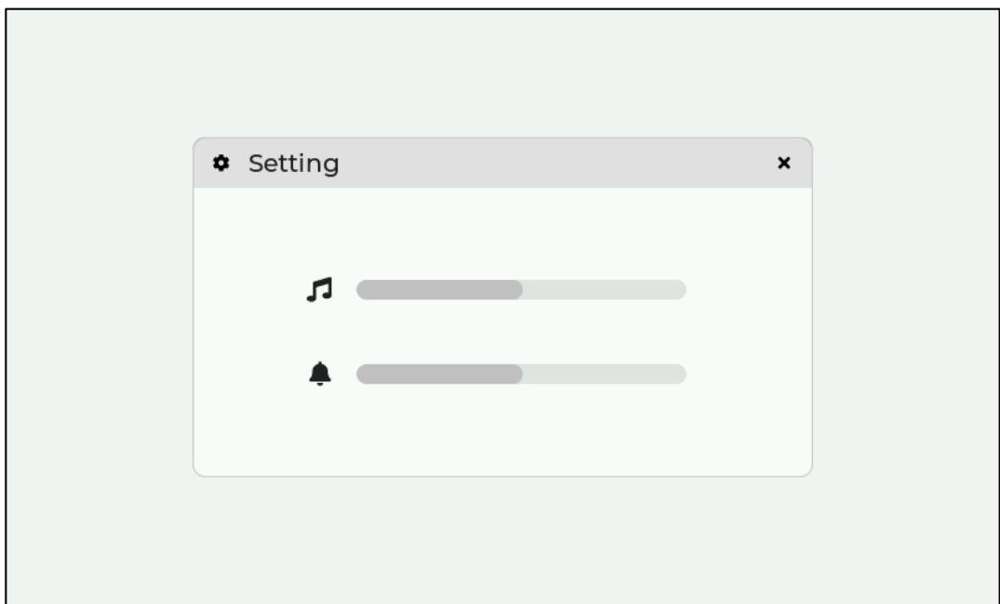  
图39.4.3.1 窗口部件实验

# 第四十章 动画图像 lv_animimg

动画图像相当于图片部件的一种延伸，它拥有多个图片源，这些图片经过一定顺序的展现后，就会形成动画的效果。

本章节将分为以下几个小节：

40.1 动画图像部件的组成  
40.2 动画图像部件的相关知识  
40.3 动画图像部件的 API 函数  
40.4 动画图像部件的实验

# 40.1 动画图像部件的组成

动画图像部件只有一个组成部分：主体背景LV_PART_MAIN，关于部件样式设置的内容，请大家参考6.4.4章节。

# 40.2动画图像部件的相关知识

动画图像的实现原理很简单：将多张连贯的照片按顺序展现。在LVGL动画图像部件中，使用图像源的数组形式来提供这些连贯图片，从理论上讲，我们只需要按顺序遍历这个图像源数组，就可以使里面的图片以动画的形式播放。动画图像的原理示意图如下所示：

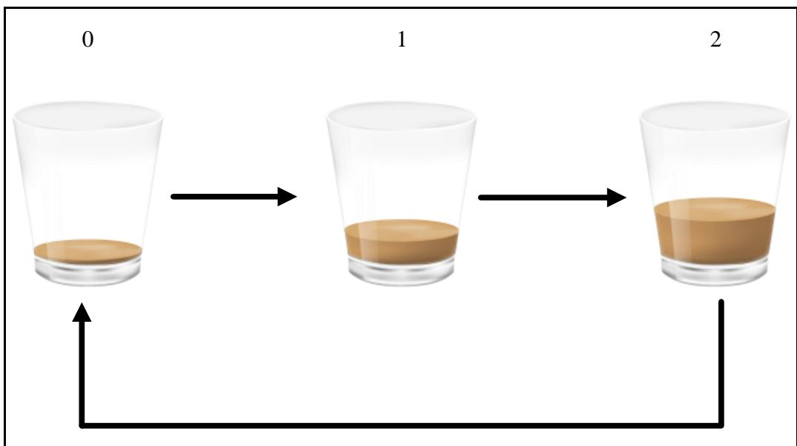  
图40.2.1动画图像的实现原理

# 40.3动画图像部件的API函数

LVGL官方提供了一些与动画图像部件相关API，如下表所示：  

<table><tr><td>函数</td><td>描述</td></tr><tr><td>lv_animimg_create()</td><td>创建动画图像部件</td></tr><tr><td>lv_animimg_set_src()</td><td>设置图像源</td></tr><tr><td>lv_animimg_start()</td><td>开启动画图像</td></tr><tr><td>lv_animimg_set_duration()</td><td>设置动画图像的时间</td></tr></table>

lv_animimg_setrepeat_count() 设置动画图像重复次数

表 40.3.1 动画图像部件相关的 API 函数

接下来，我们介绍LVGL动画图像部件常用的API函数：

# 1.lv_animimg_create函数

创建动画图像对象，其函数原型如下所示：

```c
lv_obj_t * lv_animg_createLv_obj_t \* parent);
```

该函数的形参描述如表40.3.2所示：

<table><tr><td>参数</td><td>描述</td></tr><tr><td>parent</td><td>父对象指针</td></tr></table>

表 40.3.2 lv_animimg_create 函数形参描述

返回值：指向动画图像的指针。

# 2.lv_animimg_set_src函数

设置动画图像的图像源，其函数原型如下所示：

```c
void lv_animg_set_src(lv_obj_t * obj, lv_img_dsc_t * dsc[], uint8_t num);
```

该函数的形参描述如表40.3.3所示：

<table><tr><td>参数</td><td>描述</td></tr><tr><td>obj</td><td>指向动画图像的指针</td></tr><tr><td>dsc[]</td><td>图像描述符数组</td></tr><tr><td>num</td><td>图像源数量</td></tr></table>

表 40.3.3 lv_animimg_set_src 函数形参描述

返回值：无。

# 3.lv_animimg_start函数

开启动画图像，其函数原型如下所示：

```txt
void lv_animg_start lv_obj_t * obj);
```

该函数的形参描述如表40.3.4所示：

<table><tr><td>参数</td><td>描述</td></tr><tr><td>obj</td><td>指向动画图像的指针</td></tr></table>

表 40.3.4 lv_animimg_start 函数形参描述

返回值：无。

# 4.lv_animimg_set_duration函数

设置动画图像时间，其函数原型如下所示：

```txt
void lv_animg_set_duration(lv_obj_t \* obj, uint32_t duration);
```

该函数的形参描述如表40.3.5所示：

<table><tr><td>参数</td><td>描述</td></tr><tr><td>obj</td><td>指向动画图像的指针</td></tr><tr><td>duration</td><td>动画图像时间</td></tr></table>

表 40.3.5 lv_animg_set_duration 函数形参描述

返回值：无。

# 5.lv_animimg_setrepeat_count函数

设置动画图像重复次数，其函数原型如下所示：

```txt
void lv_animimg_setrepeat_count(lv_obj_t \* obj, uint16_t count);
```

该函数的形参描述如表40.3.5所示：

<table><tr><td>参数</td><td>描述</td></tr><tr><td>obj</td><td>指向动画图像的指针</td></tr><tr><td>count</td><td>重复次数</td></tr></table>

表 40.3.5 lv_animimg_setrepeat_count 函数形参描述

返回值：无。

# 40.4动画图像部件的实验

关于动画图像部件的实验，大家可以参考LVGL官方提供的实验，路径：A盘  $\rightarrow 6$  ，软件资料  $\rightarrow 14 / 15$  ，LVGL学习资料  $\rightarrow$  lvgl-master  $\rightarrow$  lvgl-release-v8.2  $\rightarrow$  examples  $\rightarrow$  widgets  $\rightarrow$  animimg。关于该实验所用到的图像文件，请在lvgl-release-v8.2  $\rightarrow$  examples  $\rightarrow$  assets路径下查找。

# 第四十一章 菜单部件 lv_menu

菜单小部件可轻松创建多级菜单。命令、子菜单或者分隔条都可包括在菜单之中。每一个创建的菜单至多有四级子菜单。菜单部件是一组通常在功能上相关的命令或部件的容器。提供特殊的布局行为，并支持用户启动的工具栏大小调整和排列。

本章节将分为以下几个小节：

41.1 菜单部件的组成  
41.2 菜单部件的相关知识  
41.3 菜单部件的 API 函数  
41.4 菜单部件的实验

# 41.1 菜单部件的组成

菜单小部件是由两个大类构建而成，第一个大类为主容器，第二个大类为侧边栏容器，它们各自也是由不同的部分构建而成的，下面我们就以一个示意图来讲解菜单部件，如下图所示：

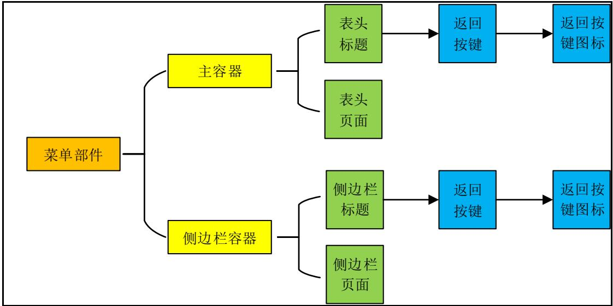  
图41.1.1菜单部件的构建部分

从上图可知：菜单部件主要包含两个容器，它们分别为主容器和侧边栏容器，主容器是由标题和页面组成，而侧边栏容器也是类似部分组成。

# 41.2 菜单部件的相关知识

# 41.2.1 创建菜单部件

创建菜单部件非常简单，我们只需调用lv_menu_create函数创建菜单部件。一开始创建菜单部件时，它只包含主容器和根返回按键，如下图所示：

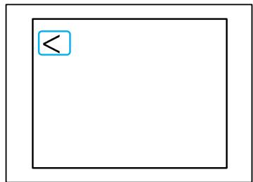  
图41.2.1.1 初始菜单部件示意图

从上图可知：菜单部件创建时，它只单单创建主容器以及根返回按键，其他部分需由用户自己添加。

# 41.2.2 标题模式

标题模式可以设置在表头标题和侧边栏标题，用户可调用函数 lv_menu_set_mode_header 设置它们的标题模式，该函数具有两个形参，第一个形参指向菜单部件对象，而第二个形参表示要设置的标题模式，标题模式具有三种类型，这些类型如下所示：

① LV_menuHEADER_TOP FIXED：标题位于顶部。  
② LV_menuHEADER_TOP_UNFIXED：标题位于顶部，可以滚动出视图。  
③ LV_menuHEADER_TOP_UNFIXED：标题位于底部。

# 41.2.3 根返回按钮模式

根返回按键模式具有两种，这些模式如下所示：

① LV_menu_ROOT_BACKBTN DISABLED：菜单根按键禁用。  
② LV_menu_ROOT_BACKBTN_ENABLED：菜单根按键启用。

上述模式主要设置根返回按键的模式，用户可调用函数 lv_menu_set_mode_root_backBtn 设置。默认情况下，这个根按键是启用的。

# 41.2.4 创建菜单页面

创建一个新的空菜单页。我们可以向该页面添加任何小部件，创建新的菜单页面的函数是lv_menu_page_create，该函数具有两个形参，第一个形参指向菜单对象，而第二个形参表示菜单的标题。注意：这个函数不能单独使用，可以结合下面的设置主容器页面和设置侧边栏容器页面小节的内容。

# 41.2.5 设置主容器页面

创建菜单页面之后，用户可以使用lv_menu_set_page将其设置为主要区域。该函数具有两个形参，第一个形参指向菜单的对象，而第二个形参指向菜单页面，如果该形参为NULL，则该函数是用来清除主菜单和清除菜单历史。当我们调用该函数把菜单页面设置成主容器页面时，菜单部件的主体会生成自动生成主容器和侧边栏容器，下面我们就以一个示意图来讲解这个知识点，如下图所示：

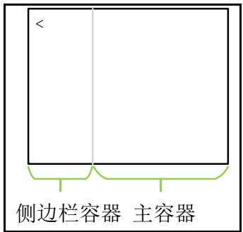  
图41.2.4.1 创建菜单页面

从上图可知：当我们使用函数lv_menu_set_page设置菜单页面为主容器页面，系统自动把菜单部件的主体划分为两个部分，第一个部分为侧边栏容器，另一个是主容器。

接下来，我们以一个简单实例来讲解这小节的知识，如下源码所示：

```c
void lv_mainstart(){ /*第一步：创建菜单部件*/ lv_obj_t* menu  $=$  lv_menu_create(lv_scr_act()); /*设置根返回按键模式*/ lv_menu_set_mode_root_back_btn(menu, LV_MENU_ROOT_BACKBTN_ENABLED); /*设置菜单部件大小*/ lv_obj_set_size(menu,lv_disp_get_HOR_res(NULL), lv_disp_get_ver_res(NULL)); /*设置菜单部件中间对齐*/ lv_obj_center(menu); /*第二步：创建菜单页面*/ lv_obj_t\* sub_mechanics_page  $\equiv$  lv_menu_page_createmenu,"ATK"); /*第三步：设置菜单页面样式*/ lv_obj_set_style_pad_HOR(sub_mechanics_page, lv_obj_get_style_pad_left(lv_menu_get_main_header(menu), 0)，0); /*第四步：设置菜单页面为主容器页面*/ lv_menu_set_page(menu,sub_mechanics_page);   
}
```

此函数主要把创建的菜单页面设置为主容器的页面，该页面的标题是“ATK”字符串，下面我们就以一个示意图来模拟上述源码功能，大家可以把这些代码在PC模拟器或者开发板上运行，该示意图如下图所示：

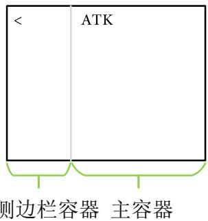  
图41.2.4.2主容器页面的添加

从上图可知：我们已经在主容器种添加了一个页面，大家可以在这个页面实现自己的 UI。

# 41.2.6 设置侧边栏容器页面

创建菜单页面之后，用户可以使用lv_menu_setsidebar_page函数将其设置到侧边栏。该函数具有两个形参，第一个形参指向菜单的对象，而第二个形参指向菜单页面，如果该形参为NULL，则该函数是用来清除侧边栏。本小节的知识和上小节知识类似，主要讲解菜单页面添加带侧边栏容器中。

接下来，我们以一个简单实例来讲解这小节的知识，如下源码所示：

```c
void lv_mainstart()   
{ /\*第一步：创建菜单部件\*/ lv_obj_t\*menu  $\equiv$  lv_menu_create(lv_scr_act()); /\*设置根返回按键模式\*/ lv_menu_set_mode_root_backBTN(menu,LV.Menu_ROOT_BACKBTN_ENABLED); /\*设置菜单部件大小\*/ lv_obj_set_size/menu,lv_disp_get_HOR_res(NULL), lv_disp_get_ver_res(NULL)); /\*设置菜单部件中间对齐\*/ lv_obj_center(menu); /\*第二步：创建菜单页面\*/ lv_obj_t\*sub_mechanics_page  $\equiv$  lv_menu_page_create(menu,"ATK"); /\*第三步：设置菜单页面样式\*/ lv_obj_set_style_pad_HOR(sub_mechanics_page, lv_obj_get_style_pad_left(lv_menu_get_main_header(menu), 0)，0); /\*第四步：设置菜单页面为侧边栏容器页面\*/ lv_menu_setsidebar_page(menu,sub_mechanics_page);   
}
```

此函数主要把创建的菜单页面设置为侧边栏容器的页面，该页面的标题是“ATK”字符串，下面我们就以一个示意图来模拟上述源码功能，大家可以把这些代码在PC模拟器或者开发板上运行，该示意图如下图所示：

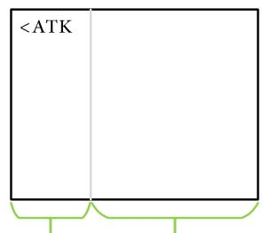  
侧边栏容器 主容器  
图41.2.4.2主容器页面的添加

从上图可知：我们已经在侧边栏容器种添加了一个页面，大家可以在这个页面实现自己的 UI。

# 41.2.7 菜单页面的连接

菜单页面的连接是指我们在页面上创建了一个可点击的对象，我们希望点击该对象之后系统自动打开我们已经创建好的页面，这叫做菜单页面的连接，这个操作类似于界面切换原理。菜单页面连接的使用可调用lv_menu_set_load_page_event函数设置连接关系，该函数具有三个形参，第一个形参指向菜单部件，第二个形参表示连接源(点击对象)，而第三个形参指向连接的页面，这个页面也是调用lv_menu_page_create函数创建的。下面我们使用一个示意图来讲解本小节的知识，如下图所示：

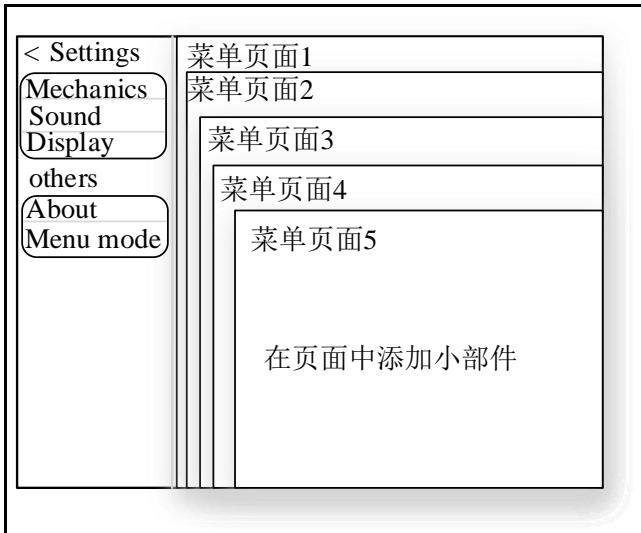  
图41.2.7.1菜单页面的连接示意图

从上图可知：左边的侧边栏也是菜单页面，这个设置方法是调用lv_menu_setsidebar_page函数设置，该菜单页面可以添加各种小部件来作为连接源(点击对象)，上图右边的是连接的页面，当用户点击侧边栏中的“Mechanics”标签可切换右边的任意菜单页面，这个菜单页面需要用户调用lv_menu_set_load_page_event进行连接。

# 41.2.8 创建一个菜单容器、空区域和分隔符

LVGL 的菜单部件提供用户三个好用的函数，它们分别为菜单容器的创建、创建空区域以及创建分隔符，这些函数是用来辅助菜单部件的开发的，这些函数如下表所示：

表 41.2.8.1 菜单部件辅助函数  

<table><tr><td>函数</td><td>描述</td></tr><tr><td>lv_menu_cont_create()</td><td>创建一个新的容器</td></tr><tr><td>lv_menu_section_create()</td><td>创建一个空的区域</td></tr><tr><td>lv_menu Separator_create()</td><td>创建一个分隔符</td></tr></table>

下面我们使用一个示意图来讲解这些菜单部件辅助函数的使用，如下图所示：

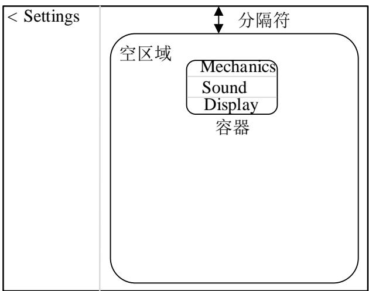  
图41.2.8.1菜单辅助函数的作用

从上述可知：设置分隔符是指空区域与主容器顶部的相隔位置，一般我们创建菜单页面时会调用函数lv_menu_section_create空区域，然后在这个空区域添加我们的小部件。

# 41.3 菜单部件的 API 函数

LVGL 提供给用户的菜单部件相关函数，如下表所示：

表 41.3.1 菜单部件相关函数  

<table><tr><td>函数</td><td>描述</td></tr><tr><td colspan="2">菜单部件设置函数</td></tr><tr><td>lv_menu_create()</td><td>创建菜单部件</td></tr><tr><td>lv_menu_page_create()</td><td>创建菜单页面</td></tr><tr><td>lv_menu_cont_create()</td><td>创建菜单容器</td></tr><tr><td>lv_menu_section_create()</td><td>创建空区域</td></tr><tr><td>lv_menu Separator_create()</td><td>创建分隔符</td></tr><tr><td>lv_menu_set_page()</td><td>设置菜单页面为主容器</td></tr><tr><td>lv_menu_setsidebar_page()</td><td>设置菜单页面为侧边栏容器</td></tr><tr><td>lv_menu_set_mode_header()</td><td>设置标题模式</td></tr><tr><td>lv_menu_set_mode_root_backBtn()</td><td>设置根返回按键</td></tr><tr><td>lv_menu_set_load_page_event()</td><td>菜单页面连接</td></tr><tr><td colspan="2">菜单部件获取函数</td></tr><tr><td>lv_menu_get.cur_main_page()</td><td>返回指向当前在 main 中显示的菜单页的指针</td></tr><tr><td>lv_menu_get.cur sidebar_page()</td><td>返回指向当前在侧边栏中显示的菜单页的指针</td></tr><tr><td>lv_menu_get_main_header()</td><td>获取主标题</td></tr><tr><td>lv_menu_get_main_header_backBtn()</td><td>获取主标题返回按键</td></tr><tr><td>lv_menu_get sidebar_header()</td><td>获取侧边栏标题</td></tr><tr><td>lv_menu_get sidebar_header_backBtn()</td><td>获取侧边栏返回按键</td></tr><tr><td>lv_menu_backBtn_is_root()</td><td>设置返回根按键</td></tr><tr><td>lv_menu_clear_history()</td><td>清除菜单</td></tr></table>

# 41.4 菜单部件的实验

关于菜单部件的实验，大家可以参考LVGL官方提供的实验，该实验的路径为lvgl-release-v8.2\examples\windows\menu。

# 组件篇

经过前面的学习，我们已经对LVGL基础知识以及LVGL的部件知识具有深刻的认识，接下来，我们学习一下LVGL提供的组件库到底如何使用，LVGL提供的组件库非常多，例如BMP、PNG、JPEG、GIF、QR等组件库，这些组件库相关的源码文件存放的路径是\Lvgl\src\extra\libs目录下，其中文件系统也属于组件库的一种，而ffmpeg和rlottie组件库本教程并没有涉及，大家可以在linux环境下学习这两个组件库。

# 第四十二章 LVGL BMP 图片

BMP是英文Bitmap（位图）的简写，它是Windows操作系统中的标准图像文件格式，能够被多种Windows应用程序所支持。随着Windows操作系统的流行与丰富的Windows应用程序的开发，BMP位图格式理所当然地被广泛应用。这种格式的特点是包含的图像信息较丰富，几乎不进行压缩，但由此导致了它与生俱来的缺点--占用磁盘空间过大。所以，BMP在单机上比较流行。本章主要讲解LVGL BMP集成解码库的使用，该BMP解码库是按需读取像素(不会加载整个图像)，因此使用BMP图像需要很少的RAM消耗。

本章节将分为以下两个小节：

42.1 LVGL的BMP解码库概述

42.2 LVGL的BMP解码库实验

# 42.1 LVGL 的 BMP 解码库概述

复制 “LVGL 例程 5 LVGL 文件系统使用” 工程并重命名为 “LVGL 例程 41 BMP 图片读取”。在该工程中，创建 Middlewares/lvgl/src/bmp 工程管理项分组，该组添加 lv bmp.c 文件。这文件在 LVGL/GUI/lvgl/src/extra/libs/bmp 路径下定义的。如下图所示：

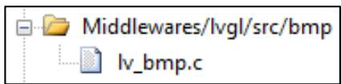  
图42.1.1 工程管理项添加文件

注意：使用LVGLBMP解码库之前，必须在lv_conf.h文件启用LVUSE_BMP。如果该宏定义设置为1，则启用BMP解码库，否则不启用该解码库。

# LVGL BMP解码库的局限性：

(1) BMP 文件只能从文件加载。如果想将它们存储在闪存中，最好使用 LVGL 的图像转换器将它们转换为 C 数组。  
(2) BMP 文件的颜色格式必须与 LV_COLOR_DEPTH 匹配。使用 GIMP 以所需的格式保存图像，例如我们正点原子的 tft 显示屏支持 16 位深度的，所以 LV_COLOR_DEPTH 设置为 16。  
(3) 不支持调色板，简单来讲：不支持图像修改颜色。

注意：由于官方的 BMP 解码库是 32 位颜色深度，而正点原子的 TFT 显示屏只能处理 16 位颜色深度，所以需要修改 BMP 源代码，修改过程如下所示：

1. 修改bmp_dsc_t结构体，如下源码所示：

```c
typedef struct { uint8_t blue; uint8_t green; uint8_t red; uint8_t reserved; }rgbquad_t; typedef struct { lv.fs_file_t f; unsigned int px_offset;
```

```txt
int px_width; int px_height; unsigned int bpp; int row_size_bytes; rgbquad_t palette[256]; } bmp_dsc_t;
```

上述源码可知：我们定义了一个rgbquad_t结构体，该结构体主要描述RGB颜色值。

2. 修改函数 decoder_read_line，如下源码所示：

```c
static lv_res_t decoder_read_line( lv_imgDecoder_t * decoder, lv_imgDecoder_dsc_t * dsc, lv_coord_t x, lv_coord_t y, lv_coord_t len, uint8_t * buf)   
{ cmp_dsc_t \* b = dsc->user_data; y  $=$  (b->px_height - 1)-y;/\*BMP images are stored upside down*/ uint32_t p  $=$  b->px_offset + b->row_size_bytes \* y; p += x \* (b->bpp / 8); lv_FS-seeking(&b->f,p,LV_FS_SEEK_SET); lv_FS_read(&b->f,buf,len \* (b->bpp / 8),NULL); if((b->bpp >= 16)&& (b->bpp == (sizeof lv_color_t)\*8))) { lv_FS_read(&b->f,buf,len \* (b->bpp / 8),NULL); #if LV_COLOR_DEPTH  $= = 32$  lv_color32_t \* bufc  $=$  (lv_color32_t*)buf; for(void i  $= 0$  ;i<len;i++) { /\* Byte0:blue,byte1:green,byte2:red,byte3:alpha \*/ uint8_t \*p  $=$  (uint8_t \*)&bufc[i]; bufc[i].ch.red  $=$  p[2]; bufc[i].ch.green  $=$  p[1]; bufc[i].ch.blue  $=$  p[0]; bufc[i].ch.alpha  $=$  0xff; /*Amazing*/ }   
#endif   
} else { lv_color_t \*color_p  $=$  (lv_color_t \*)buf; uint8_t color_buf[4]; switch(b->bpp) { case 24:
```

```c
for(int i = 0; i < len; i++)  
{lv_FS_read(&b->f, color_buf, 3, NULL);color_p[i] = lv_color.make(color_buf[2],color_buf[1], color_buf[0]);}break;  
case 16:for(int i = 0; i < len; i++)lv_FS_read(&b->f, color_buf, 2, NULL);uint16_t color16 = \* (uint16_t \*) color_buf;#define RGB565_R5(rgb565) ((rgb565 >> 11) & 0x1f)#define RGB565_G6(rgb565) ((rgb565 >> 5) & 0x3f)#define RGB565_B5(rgb565) ((rgb565 >> 0) & 0x1f)#define R5_2_R8(r5) (r5 << 3)#define G6_2_G8(g6) (g6 << 2)#define B5_2_B8(b5) (b5 << 3)color_p[i] = lv_color.make(R5_2_R8(RGB565_R5(color16)),G6_2_G8(RGB565_G6(color16)),B5_2_B8(RGB565_B5(color16));}break;  
case 8:for(int i = 0; i < len; i++){lv_FS_read(&b->f, color_buf, 1, NULL);uint8_t index = color_buf[0];rgbquad_t color = b->palette[index];color_p[i] = lv_color.make(color.red,color.green,color.blue);}break;  
case 4:for(int i = 0; i < len;){lv_FS_read(&b->f, color_buf, 1, NULL);for(int j = 0; (j < 8) && (i < len); j += 4, i++) {uint8_t index = (color_buf[0] >> (4 - j)) & 0x0f;
```

```txt
rgbquad_t color  $=$  b->palette[index]; color_p[i]  $=$  lv_color.make(color.red, color.green, color.blue); } 1 break; case 1: for(int i  $= 0$  ;i<len;} { lv.fs_read(&b->f,color_buf,1,NULL); for(int j  $= 0$  ;  $(\mathrm{j} <   8)$  && (i<len);j++,i++){ uint8_t index  $=$  (color_buf[0] >> (7 - j)) & 0x01; rgbquad_t color  $=$  b->palette[index]; color_p[i]  $=$  lv_color.make( color.red, color.green, color.blue); } 1 break; default: break; } return LV_RES_OK;
```

上述源码可知：颜色深度不再局限于32位，而是根据b->bpp参数选择颜色深度。

# 42.2 LVGL的BMP解码库实验

# 42.2.1 硬件设计

# 1. 例程功能

本实验主要测试 BMP 解码库的使用，在 lvgl_demo.c 文件中设计了四个任务，它们分别为 start_task、lv_demo_task 和 led_task 任务，下面我们分别地讲解这些任务到底实现什么功能。

start_task 任务：主要负责创建 user_task、touch_task 和 led_task 任务，最后删除自身。

lv_demo_task 任务：主要调用 lv_mainstart 函数执行 lvgl 程序，该函数调用 LVGL 的 BMP 解码库函数读取 SD 卡上的 BMP 并在显示屏上显示。

该实验的实验工程，请参考《LVGL例程41BMP图片读取》。注意：DMF407、MiniST M32不支持本实验。

# 42.2.2 软件设计

# 42.2.2.1 程序流程图

本实验的程序流程图，如下图所示：

  
图42.2.2.1.1LVGLBMP图片读取实验流程图

# 42.2.2.3 程序解析

关于LVGL程序主要在lv_mainstart.c文件定义，首先我们看lv_mainstart函数，该函数是LVGL的程序入口，如下源码所示：

```cpp
typedef struct   
{ char \*img_path; char \*label_text; }img_info_t;   
static const img_info_t draw.img[]  $=$  { {"0:/PICTURE/BMP/camera.bmp","camera"}， {"0:/PICTURE/BMP/ALIENTEKLOGO.bmp"，"ALIENTEKLOGO"}， }; #define img_Num sizeofdraw.img)/sizeof draw.img[0]lv_obj_t \*img;
```

```c
\* @brief lv_mainstart   
\* @param 无   
\* @retval 无   
\*/   
void lv_mainstart()   
{ lv_obj_t \*label  $=$  lv_label_create(lv_scr_act()); lv_label_set_text.label,"BMP_Decoder"); lv_obj_set_style_text_color.label,lv Palette_main(LV_PALETTE_RED), LV_STATE_DEFAULT); lv_obj_set_style_text.Font.label,&lv_font_montserrat_32,LV_STATE_DEFAULT); lv_obj_align_to labelledNull,LVALIGN_TOP_MID,0,0); lv_obj_set_style_bg_colorLv_scr_act(),lv Palette_main(LV_PALETTE BLUE), LV_STATE_DEFAULT); img  $=$  lv_img_createLv_scr_act(); /\*创建图像\*/ lv_img_set_src(img，drawimg[O].img_path); /\*设置图像源\*/ lv_obj_align_to(img，NULL，LV ALIGNCENTER，0，0）;/\*设置对齐模式\*/   
}
```

上述源码可知：我们主要创建img部件，然后调用lv.img_set_src()设置图像源，最后设置对齐模式。

# 42.2.3 下载验证

把工程编译并下载到开发板中，如下图所示：

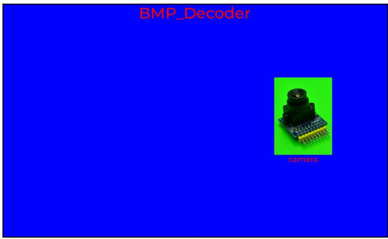  
图42.2.3.1 BMP图片读取实验示意图

# 第四十三章 LVGL PNG 图片

PNG 是一种采用无损压缩算法的位图格式，其设计目的是试图替代 GIF 和 TIFF 文件格式，同时增加一些 GIF 文件格式所不具备的特性。PNG 使用从 LZ77 派生的无损数据压缩算法。本章主要讲解 LVGL PNG 集成解码库的使用。

本章节将分为以下两个小节：

43.1 LVGL PNG 解码库的移植

43.2 LVGL PNG 图片显示实验

# 43.1 LVGL PNG 解码库的移植

复制“LVGL例程5LVGL文件系统使用”工程并重命名为“LVGL例程42PNG图片读取”。打开工程并在工程中创建Middlewares/lvgl/src/png工程管理项分组，在该组添加lodeppng.c和lv png.c文件，这些文件在LVGLGUI/lvgl/src/extra/libs/png路径下定义的。如下图所示：

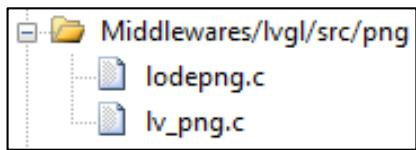  
图43.1.1在工程管理项组添加文件

注意：使用LVGLPNG解码库之前，必须在lv_conf.h文件启用LV_USEPNG宏定义。如果该宏定义设置为1，则启用PNG解码库，否则不启用该解码库。

# 小知识：

PNG 图像被解码时，在解码过程中所需要 RAM 等于图像宽度*图像高度*4 个字节。例如一张  $800 * 480$  的 PNG 图片，它所需要的 RAM 内存为  $800 * 480 * 4$ （约等于 1.4M）内存。

注意：下面的操作只针对 Mini Pro H750 和北极星开发板，其他开发板可忽略以下内容。

首先打开工程，然后点击 Linker 选项卡，最后打开分散加载文件，如下图所示：

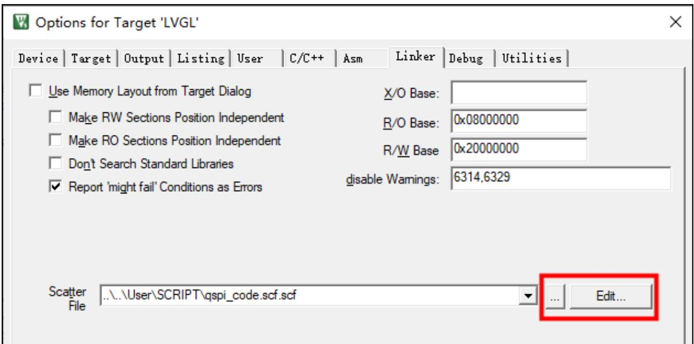  
图43.1.2打开分散加载文件

在该文件添加下图的源码：

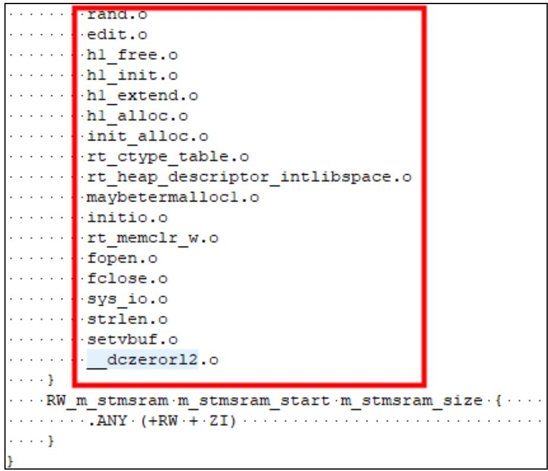  
图43.1.3把这些文件放在内部flash

注意：如果添加了图43.1.3的源码，程序还是无法进入main函数，则开启“Use MicroLIB”微库。

# 43.2 LVGL PNG 图片显示实验

# 43.2.1 硬件设计

# 1. 例程功能

本实验主要测试 PNG 解码库的使用，在 lvgl_demo.c 文件中设计了四个任务，它们分别为 start_task、lv_demo_task 和 led_task 任务，下面我们分别地讲解这些任务到底实现什么功能。

start_task 任务：主要负责创建 user_task、touch_task 和 led_task 任务，最后删除自身。

lv_demo_task 任务：主要调用 lv_mainstart 函数执行 lvgl 程序，该函数调用 LVGL 的 PNG 解码库函数读取 SD 卡上的 PNG 并在显示屏上显示。

该实验的实验工程，请参考《LVGL例程42PNG图片读取》。注意：DMF407、MiniST M32和精英不支持本实验。

# 43.2.2 软件设计

# 43.2.2.1 程序流程图

本实验的程序流程图，如下图所示：

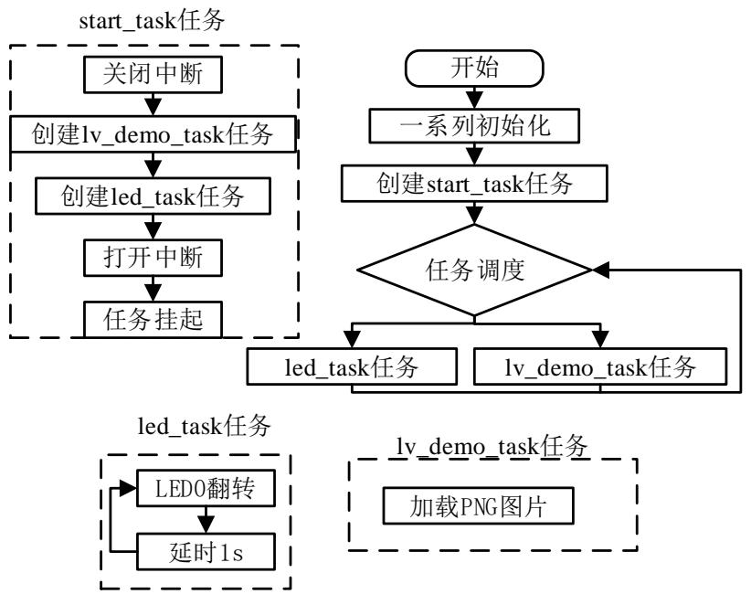  
图43.2.2.1.1 BMP图片读取实验流程图

# 43.2.2.3 程序解析

关于LVGL程序主要在lv_mainstart.c文件定义，首先我们看lv_mainstart函数，该函数是LVGL的程序入口，如下源码所示：

```c
/\*PNG图片结构体\*/   
typedef struct   
{ char \*img_path; /\* 图片路径\*/ char \*label_text; /\* 图片名称\*/ }img_info_t;   
/\*定义PNG路径\*/   
const img_info_t PNG_PATH[]  $=$  { {"0:/PICTURE/PNG/mlljt.png","xiaomao.png"}， {"0:/PICTURE/PNG/laji.png","laji.png"}， };   
/\*获取路径的个数\*/   
#define image_mun (int)(sizeof(PNG_PATH)/sizeof(PNG_PATH[0]))   
lv_obj_t \*img;   
\*\* @brief 创建PNG图片文件   
\* @param parent：父类   
\* @param path: 图片路径
```

```c
\* @retval 返回图片部件   
\*/   
lv_obj_t \* lv png_create_from_file(lv_obj_t \* parent, const char \* path)   
{ lv_obj_t \* img  $=$  lv_img_create(parent); lv_img_set_src(img，path); lv_obj_align_to(img，NULL，LVALIGN_CENTER,0,0); return img;   
}   
/\*\*   
\* @brief LVGL程序入口   
\* @param 无   
\* @retval 无   
\*/   
void lv_mainstart()   
{ lv png_init(); /\*初始化PNG解码库\*/ lv_obj_t \*label  $=$  lv_label_create(lv_scr_act()); lv_label_set_text.label,"PNG_Decoder"); lv_obj_align_to labelledNull,LV ALIGN_TOP_MID,0,0); /\*创建PNG文件\*/ img  $=$  lv png_create_from_file(lv_scr_act(),PNG_PATH[0].img_path);   
1
```

上述源码可知：首先创建 img 部件，然后调用 lv_img_set_src 设置图像源，最后设置对齐模式。

# 43.2.3 下载验证

把工程编译并下载到开发板中，运行效果如下图所示：

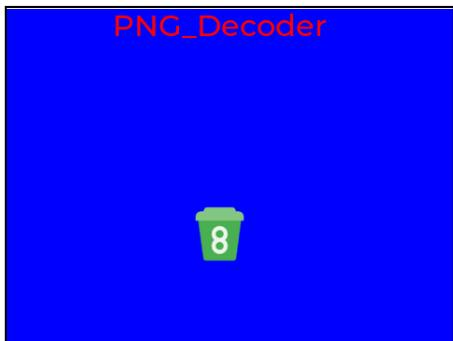  
图43.2.3.1 PNG图片读取实验

# 第四十四章 LVGL JPEG 图片

本章主要讲解LVGL的JPEG集成解码库的使用，JPEG是全彩和灰度图像的标准压缩方法，JPEG用于压缩“真实世界”的景象、线条画、卡通，其他非现实图像并不是其强项。JPEG会有损耗，意指输出图像与输入图像并不完全相同，因此，如果需要达到完全相同的输出位，则不能使用JPEG。不过，对于常见的照片图像，可以得到非常好的压缩级别。LVGL的JPEG解码库的原理就是将图片如何压缩为字节流以及重新解码为图片的过程。

本章节将分为以下两个小节：

44.1 LVGL JPEG解码库的移植

44.2 LVGL JPEG 图片显示实验

# 44.1 LVGL JPEG解码库的移植

复制“LVGL例程5LVGL文件系统使用”工程并重命名为“LVGL例程45jpeg图片读取”，在该工程中创建工程管理项分组Middlewares/lvgl/src/jepg，在该组添加lv_sjpg.c和tjpgd.c文件，这些文件在LVGL/GUI/lvgl/src/extra/libss.jpg路径下定义的。

用户如何使用该解码库呢，LVGL 作者已经提供一个方案给我们了，如下图所示：

```c
17 lines (14 sloc) 376 Bytes  
1 #include "..././lv/examples.h"  
2 #if LV_USE_SJPG && LV Builds_EXAMPLES  
3  
4 /\*\*  
5 * Load an SJPG image  
6 */  
7 void lv_example_sjpg_1(void)  
8 {  
9 lv_obj_t * wp;  
10  
11 wp = lv_img_createLv_scr_act();  
12 /* Assuming a File system is attached to letter 'A'  
13 * E.g. set LVUSE_FS_STDIO 'A' in lv_conf.h */  
14 lv_img_set_src(wp, "A:lvgl/examples/libssjpg/small_image.sjpg");  
15 }  
16  
17 #endif
```

图44.1.1 官方解码库的示例

首先打开 lv_conf.h 文件，然后在该文件找到 LV_USE_SJPG 宏定义并设置为 1 启用 JPEG 解码库，该解码库的初始化在 lv_init/lvextra_init 函数下调用 lv_split.jpeg_init 函数。

官方对LVGL的JPEG解码器概述：

① 该解码库支持常规 jpg 和自定义 jpg 格式。  
② 解码普通.jpg会占用整个未压缩图像内存（建议用于具有更多RAM的设备）。  
③ jpg是基于“普通”JPG的自定义格式，是为lgl专门制作的。  
④ sjpg是“split-jpeg”，它是一堆带有sjpg标头的小jpeg片段。  
⑤ jpg 大小将几乎与 jpg 文件相当，或者可能稍大。  
⑥ 从磁盘（读取）和c数组读取实现。  
⑦ 如果在缓存中可用，则SJPEG帧片段缓存可实现行的快速获取。  
⑧ 默认情况下，sjpg 图像缓存为图像宽度 *2*16 字节（可以修改）。  
(9) 当前仅支持 16 位图像格式（可做）。  
⑩ JPG 和 SJPG 图像只解码所需的部分, 因此不能缩放或旋转

LVGL 解码库支持三种读取jpeg方式，这三种方式如下所示：

① 将JPG转换为C数组，使用在线图片软件转换即可，注意：Color format = RAW, output format = C Array 选项配置。  
② SJPG 图片格式读取，这类不是我们涉及的领域，但是我们 MCU 可以读取这类型的图片格式，SJPG 图片格式使用.JPG 图片经过 python3 和 PIL 库进行转换。  
③ 直接使用LVGL文件系统读取SD卡路径下的jpeg图片。

# 44.1.1 JPG转换SJPG图片格式

在上面我们已经介绍过，JPG转换SJPG图片格式需要python3和PIL库，首先我们下载python软件安装，打开网址：https://www.python.org/downloads/，然后点击下载，如下图所示：

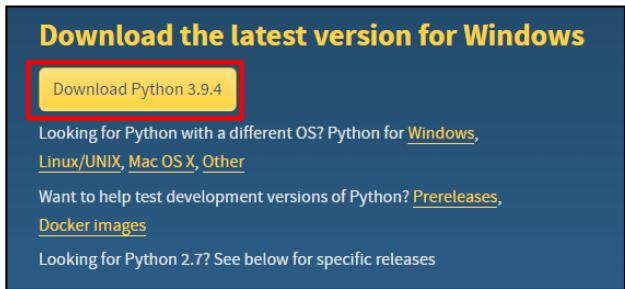  
图44.1.1.1 下载python

从上图中我们选择windows版本下载，python的安装请大家自行安装。安装完成之后，按下键盘win+r快捷键，输入CMD进入命令行，在该命令行下输入“python”字段，测试安装是否成功，如下图所示：

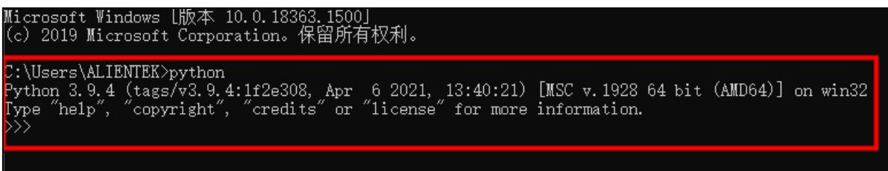  
图44.1.1.2安装python成功

如果命令行出现上图的信息，则表示 python 安装成功。

安装 PIL 库，请在命令行输入"easy_install Pillow"，如下图所示：

```txt
C:\Users\ALIENTEK>easy_install Pillow   
WARNING: The easy_install command is deprecated and will be removed in a future version.   
Searching for Pillow   
Best match: pillow 8.2.0   
Processing pillow-8.2.0-py3.9-win-amd64.egg   
pillow 8.2.0 is already the active version in easy-install.pth   
Using c:\\python39\\lib\\site-packages\\pillow-8.2.0-py3.9-win-amd64.egg   
Processing dependencies for Pillow   
Finished processing dependencies for Pillow   
C:\Users\ALIENTEK>
```

如果安装 PIL 库失败，则把 python 安装路径加载到电脑环境变量中，然后重新安装 PIL 库。

在桌面新建一个文件夹，把lvgl-release-v8.2/ scripts/路径下的文件jpg_to_sjpg.py脚本复制到新建的文件夹下，最后放入转换的jpeg图片到该文件夹中，如下图所示：

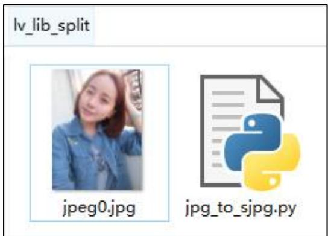  
图44.1.1.3安装PIL库  
图44.1.1.4文件夹下的文件  
图44.1.1.4执行jpg_to_sjpg.py脚本

笔者不知道大家有没有学过python，它运行文件夹下的.py文件可以使用pycharm、vscobe等软件，如果不使用这些软件，可以使用命令行执行.py文件，这些命令如下所示：

```batch
cd C:\Users\ATK\Desktop\Lv_lib_split  
python jpg_to_sjpg.pyJPEG0.jpg
```

首先我们使用cd命令跳到新建的文件夹下，然后执行.py文件，如下图所示：

```batch
C:\Users\ATK>cd C:\Users\ATK\Desktop\Lv_lib_split   
C:\Users\ATK\Desktop\Lv_lib_split>python jpg_to_sjpg.pyJPEG0.jpg   
Conversion started..   
Input: jpeg0.jpg RES  $= 240\times 320$    
Output: Time taken  $= 0.26$  sec bin size  $= 35.2$  KB jpeg0.sjg (bin file) jpeg0.c (c array)   
A11 good!
```

当执行完毕时，在新建文件夹下得到下图的文件：

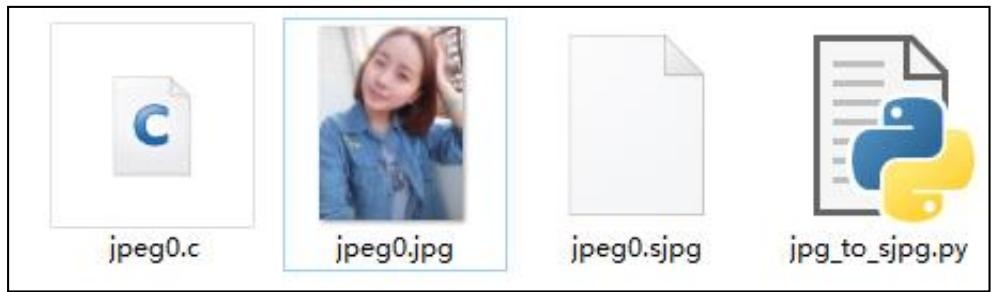  
图44.1.1.5生成sjpg格式图片

上述图44.1.1.5中，jpeg0.jpg图片格式可使用文件系统读取显示，而jpeg0.c文件可直接加载到flash中。

注意：如果使用Python3.10以上版本，则使用“pip3 install pillow”命令安装PIL库，然后输入拷贝.jpg_to jpg.py脚本和转换图片到文件夹中，最后我们进入转换的文件夹，并在这个路径下输入“python.jpg_to jpg.pyJPEG0.jpg”命令转换。

# 44.2 LVGL JPEG 图片显示实验

# 44.2.1 硬件设计

# 1. 例程功能

本实验主要测试 JEPG 解码库的使用，在 lvgl_demo.c 文件中设计了四个任务，它们分别为 start_task、lv_demo_task 和 led_task 任务，下面我们分别地讲解这些任务到底实现什么功能。

start_task 任务：主要负责创建 user_task、touch_task 和 led_task 任务，最后删除自身。

lv_demo_task 任务：主要调用 lv_mainstart 函数执行 lvgl 程序，该函数调用 LVGL 的 JPEG 解码库函数读取 SD 卡上的 JPEG 并在显示屏上显示。

该实验的实验工程，请参考《LVGL例程45.jpeg图片读取》。注意：DMF407、MiniSTM32和精英不支持本实验。

# 44.2.2 软件设计

# 44.2.2.1 程序流程图

本实验的程序流程图，如下图所示：

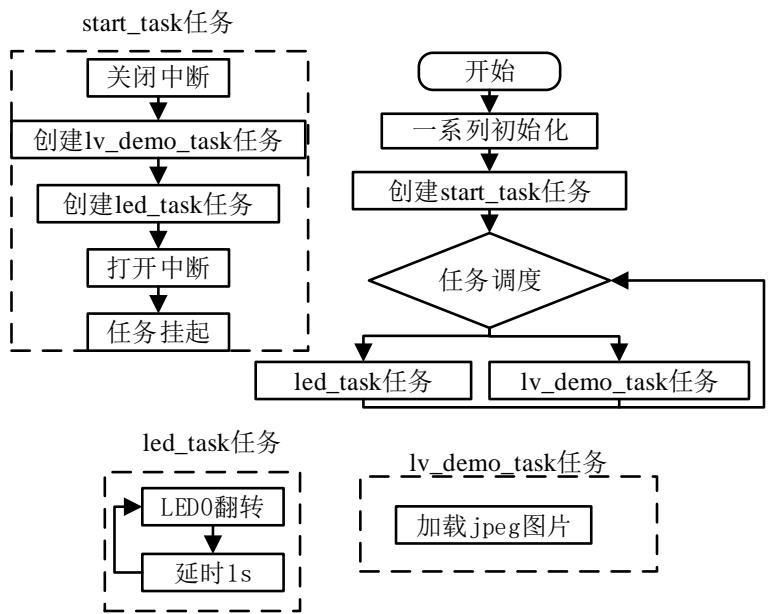  
图44.2.2.1.1jpeg图片读取实验流程图

# 44.2.2.2 程序解析

关于LVGL程序主要在lv_mainstart.c文件定义，首先我们看lv_mainstart函数，该函数是LVGL的程序入口，如下源码所示：

```c
/\*\* \* @brief 1vgl程序入口 \* @param 无 \* @retval 无 \*/   
void lv_mainstart()   
{ /\*创建标签\*/ lv_obj_t \*label  $=$  lv_label_create(lv_scr_act()); /\*设置标签颜色\*/ lv_label_set_text.label, "JPEG_Decoder"); /\*设置文本颜色\*/ lv_obj_set_style_text_color.label,lv Palette_main(LV_PALETTE_RED), LV_STATE_DEFAULT); /\*设置文本字体\*/ lv_obj_set_style_text.Font.label,&lv_font_montserrat_32,LV_STATE_DEFAULT); /\*设置顶部中间对齐\*/ lv_obj_align labelled,LV ALIGN_TOP_MID,0,0); /\*设置背景颜色\*/ lv_obj_set_style_bg_colorLv_scr_act(),lv Palette_main(LV_PALETTE BLUE), LV_STATE_DEFAULT); /\*创建image部件\*/ lv_obj_t \*img  $=$  lv_img_createLv_scr_act();
```

```txt
/\*设置图像源\*/  
lv_img_set_src(img，"0:/PICTURE/JPEG/SIM900A.jpg");  
/\*中间对齐\*/  
lv_obj_align(img,LV ALIGN Center,0,0);
```

上述源码可知：创建一个img部件，然后调用lv.img_set_src()设置图像源，最后中间对齐。注意：必须在lv_cong.h使能LVGL文件系统。

# 44.2.3 下载验证

把工程编译并下载到我们的开发板中，运行效果如下图所示：

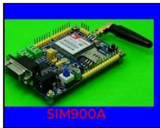  
图44.2.3.1.jpeg图片读取实验

# 第四十五章 LVGL GIF 读取

上一章已经给大家讲解了jpeg图片读取和jpeg图片转换成sjpg格式方法，本章主要讲解LVGL提供GIF解码库的使用。

本章节将分为以下两个小节：

45.1 LVGLGIF解码库的移植

45.2 LVGL GIF 图形交换显示实验

# 45.1 LVGL GIF 解码库的移植

复制“LVGL例程5LVGL文件系统使用”工程并重命名为“LVGL例程46GIF读取”，在该工程中创建Middlewares/lvgl/src/gif工程管理项组，该组添加gifdec.c和lv.gif.c文件，这些文件在LVGLGUI/lvgl/src/extra/libs.gif路径下定义的，如下图所示：

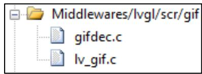  
图45.1.1 工程管理项添加文件

注意：使用LVGLGIF解码库之前，必须在lv_conf.h文件启用LVUSE_GIF。如果该宏定义设置为1，则启用GIF解码库，否则不启用该解码库。

# 小知识：

GIF 图像被解码时，在解码过程中所需要 RAM 是以颜色深度决定的。

(1) LV_COLOR_DEPTH 为 8，则所需要的 RAM 为宽度*高度*3 内存。  
(2) LV_COLOR_DEPTH 为 16，则所需要的 RAM 为宽度*高度*4 内存。  
(3) LV_COLOR_DEPTH 为 32，则所需要的 RAM 为宽度*高度*5 内存。

例如，颜色深度为16的一个800*480的GIF图像，它所需要的RAM为800*480*4(约等于1.4M)内存。

# GIF读取方案：

LVGL GIF解码库读取具有两种方案，第一个是把GIF转成C数组格式文件，而另一种就是文件系统读取。

注意：如果GIF图像使用官方在线转换工具，则有Color format选择颜色格式(RAW)。

# 45.2 LVGL GIF 图形显示实验

# 45.2.1 硬件设计

# 1. 例程功能

本实验主要测试GIF解码库的使用，在lvgl_demo.c文件中设计了四个任务，它们分别为start_task、lv_demo_task和led_task任务，下面我们分别地讲解这些任务到底实现什么功能。

start_task 任务：主要负责创建 user_task、touch_task 和 led_task 任务，最后删除自身。

lv_demo_task 任务：主要调用 lv_mainstart 函数执行 lvgl 程序，该函数调用 LVGL 的 GIF 解码库函数读取 SD 卡上的 gif 并在显示屏上显示。

该实验的实验工程，请参考《LVGL例程43GIF图片读取》。注意：DMF407、MiniSTM32和精英不支持本实验。

# 45.2.2 软件设计

# 45.2.2.1 程序流程图

本实验的程序流程图，如下图所示：

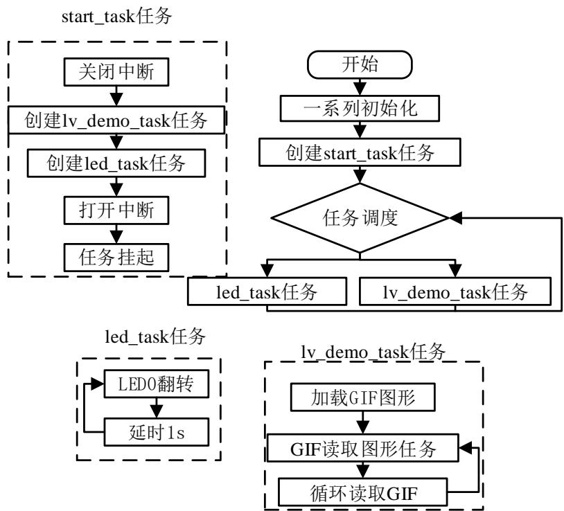  
图45.2.2.1.1GIF图片读取实验流程图

# 45.2.2.3 程序解析

关于LVGL程序主要在lv_mainstart.c文件定义，首先我们看lv_mainstart函数，该函数是LVGL的程序入口，如下源码所示：

```c
typedef struct   
{ char \*img_path; char \*label_text; }img_info_t; const img_info_t GIF_PATH[]  $=$  { {"0:/PICTURE/GIF/alientek.gif", "alientek.gif"},   
};   
#define image_mun (int) (sizeof(GIF_PATH)/sizeof(GIF_PATH[0])) int image  $= 0$
```

```c
lv_obj_t *img;   
static lv_style_t img_style;   
extern int has_next;   
void lv_mainstart(void)   
{ lv_obj_t *label; label  $=$  lv_label_create(lv_scr_act()); lv_label_set_text.label, "GIF_Decoder"); lv_obj_set_style_text_color.label, lvpalette_main(LV_PALETTE_RED), LV_STATE_DEFAULT); lv_obj_set_style_text.Font.label,&lv_font_montserrat_32,LV_STATE_DEFAULT); lv_obj_align_to labelled, NULL,LVALIGN_TOP_MID,0,0); lv_obj_set_style bg_color lv_scr_act(),lvpalette_main(LV_PALETTE BLUE), LV_STATE_DEFAULT); lv_obj_set_style bg_color lv_scr_act(),lvpalette_main(LV_PALETTE BLUE), LV_STATE_DEFAULT); img  $=$  lv.gif_create(lv_scr_act()); lv.gif_set_src(img,GIF_PATH-image).img_path); lv_obj_align_to(img,NULL,LVALIGN_CENTER,0,0); lv_timer_createLv_my_timer,10,image);   
}
```

从上述源码可知：调用lv.gif_create函数创建GIF控制块，然后调用lv.gif_set_src函数显示GIF图像，最后调用lv_timer_create创建10ms的定时器并设置lv_my_timer定时器回调函数。该定时器回调函数如下：

```c
void lv_my_timer(lv_timer_t *timer)  
{  
    if (has_next == 0) /* 如果是最后一帧，那么切换 GIF */  
    {  
        image++;  
        lv_obj_del(img); /* 删除前面的 GIF */  
    }  
    if (image >= image_mun) /* 判断 GIF 库包含的个数是否最大 */  
    {  
        image = 0; /* 重新开始展示 */  
        img = lv.gif_create lv_scr_act();  
        lv.gif_set_src(img, GIF_PATH[img].img_path);  
    }  
    else /* 如果不是最后的 GIF */  
    {  
        img = lv.gif_create lv_scr_act();  
        lv.gif_set_src(img, GIF_PATH[img].img_path);  
    }  
}
```

```c
} timer->user_data  $\equiv$  img; /* 设置任务数据等于获取的图片数据*/ lv_obj_align_to(img,NULL,LV ALIGNCENTER,0,0); 1
```

上述源码可知：如果显示GIF最后帧数时，则调用lv_obj_del删除GIF控制块并重新调用lv.gif_create创建GIF控制块。注意：has_next参数在lv.gif.c定义的，该参数主要获取GIF的最后帧数。由于该参数原本为局部变量，所以笔者修改它为全局变量。如果为0，则表示最后帧数。

# 45.2.3 下载验证

把工程编译并下载到我们的开发板中，运行效果如下图所示：

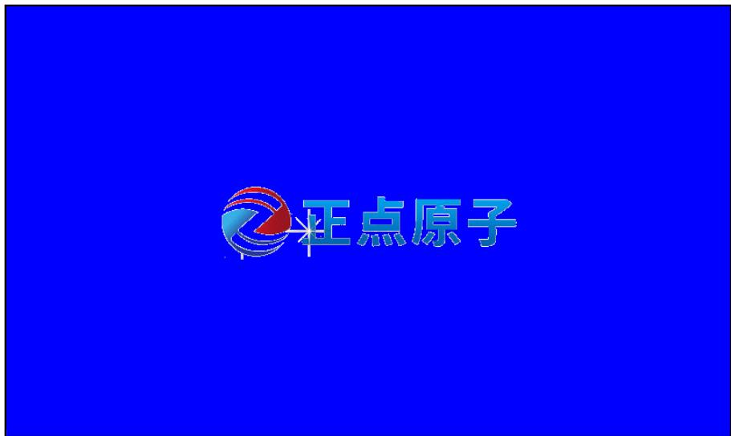  
图45.2.3.1GIF读取实验

# 第四十六章 LVGL 二维码库

二维码又称二维条码，常见的二维码为 QR Code，QR 全称 Quick Response，是一个近几年来移动设备上超流行的一种编码方式，它比传统的 Bar Code 条形码能存更多的信息，也能表示更多的数据类型。本章主要讲解 LVGL QR Code 二维码库的使用。

本章节将分为以下两个小节：

46.1 LVGL 二维码库移植

46.2 LVGL 二维码实验

# 46.1 LVGL 二维码库移植

复制“LVGL例程5LVGL文件系统使用”工程并重命名为“LVGL例程44二维码显示”，在该工程中，创建Middlewares/lvgl/src/qr工程管理项分组，该组主要添加lv_arcode.c和qrcodegen.c文件，这些文件在LVGLGUI/lvgl/src/extra/libs/qrcode路径下定义的，如下图所示：

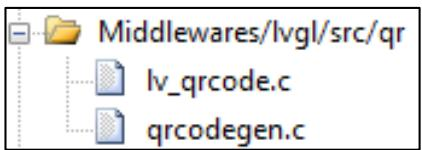  
图46.1.1把LVGL二维码库添加到工程  
图46.1.1.1LVGL二维码库的API函数

# 46.1.1 LVGL 二维码库 API 函数

LVGL的二维码库只提供用户三个函数使用，如下表所示：

<table><tr><td>函数</td><td>描述</td></tr><tr><td>lv_qrcode_create()</td><td>创建一个QR码</td></tr><tr><td>lv_qicode_update()</td><td>设置二维码对象的数据</td></tr><tr><td>lv_qicode_delete()</td><td>删除一个QR码对象</td></tr></table>

# 1.lv_qcode_create函数

该函数的作用是创建一个空的 QR 码, 其函数原型如下所示:

```txt
lv_obj_t \* lv_qrtc_create(lv_obj_t \* parent, lv_coord_t size, lv_color_t dark_color, lv_color_t light_color)
```

该函数的形参描述如下表所示：

表 46.1.1.2 函数 lv_qrpcode_create(   )形参描述  

<table><tr><td>参数</td><td>描述</td></tr><tr><td>parent</td><td>指向一个创建 QR 码的对象</td></tr><tr><td>size</td><td>二维码的宽度和高度</td></tr><tr><td>dark_color</td><td>二维码的暗颜色</td></tr><tr><td>light_color</td><td>二维码的高亮色</td></tr></table>

返回值：指向创建的 QR code 对象的指针。

# 2.lv_qcode_update函数

该函数的作用是设置二维码对象的数据，其函数原型如下所示：

```c
lv_res_t lv_qrtc_update( lv_obj_t * qrtc, const void * data, uint32_t data_len)
```

该函数的形参描述如下表所示：

表 46.1.1.3 函数 lv_qrpcode_update(   )形参描述  

<table><tr><td>参数</td><td>描述</td></tr><tr><td>qRFC</td><td>指向QR代码对象的指针</td></tr><tr><td>data</td><td>数据显示</td></tr><tr><td>data_len</td><td>以字节为单位的数据长度</td></tr></table>

返回值：LV_RES_OK:没有错误；LV_RES_INV:错误。

# 3.lv_qrtc_delete函数

该函数的作用是删除一个 QR 码对象，其函数原型如下所示：

```txt
void lv_qrtc_delete lv_obj_t * qrtc)
```

该函数的形参描述如下表所示：

表 46.1.1.4 函数 lv_qrcode_delete(   )形参描述  

<table><tr><td>参数</td><td>描述</td></tr><tr><td>qRFC</td><td>指向QR代码对象的指针</td></tr></table>

返回值：无

# 46.2 LVGL 二维码实验

# 46.2.1 硬件设计

# 1. 例程功能

本实验主要测试二维码库的使用，在lvgl_demo.c文件中设计了四个任务，它们分别为start_task、lv_demo_task和led_task任务，下面我们分别地讲解这些任务到底实现什么功能。

start_task 任务：主要负责创建 user_task、touch_task 和 led_task 任务，最后删除自身。

lv_demo_task 任务：主要调用 lv_mainstart 函数执行 lvgl 程序，该函数调用 LVGL 二维码库的 API 函数绘画二维码。

该实验的实验工程，请参考《LVGL例程44二维码显示》。注意：DMF407、MiniSTM32和精英不支持本实验。

# 46.2.2 软件设计

# 46.2.2 程序流程图

根据上述例程功能分析，我们得到以下流程图，如下图所示：

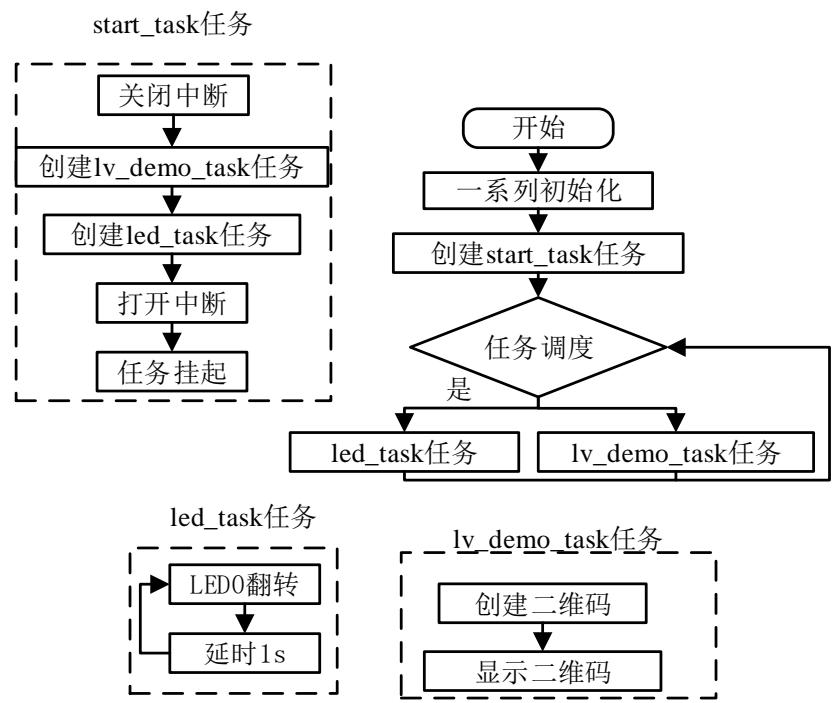  
图46.2.2.1二维码显示实验流程图

# 46.2.3 程序解析

关于LVGL程序主要在lv_mainstart.c文件定义，首先我们看lv_mainstart函数，该函数是LVGL的程序入口，如下源码所示：

```txt
const char \* data  $=$  "Hello ALIENTEK(正点原子）";   
/\*\* \* @brief 二维码显示 \* @param 无 \* @return 无 \*/   
void lv_mainstart(void)   
{ /\*创建一个标签\*/ lv_obj_t \*label_time  $=$  lv_label_create(lv_scr_act()); /\*设置标签的文本\*/ lv_label_set_text.label_time,"ALIENTEK_QR"); /\*设置标签的文本字体颜色\*/ lv_obj_set_style_text_color.label_time,lv Palette_main(LV_PALETTE_RED), LV_STATE_DEFAULT); /\*设置标签的文本字体\*/ lv_obj_set_style_text.Font.label_time,&lv_font_montserrat_32, LV_STATE_DEFAULT); /\*设置标签的顶部中间对齐\*/ lv_obj_align labelled_time,LV ALIGN_TOP_MID,0,0);
```

```c
/\*创建一个lcddev.width/2的二维码\*/  
lv_obj_t \*qr  $=$  lv_qrcode_create(lv_scr_act(),lv_obj_get_width(lv_scr_act()）/2,lv_color(hex3(0x33f),lv_color.hex3(0xeef));  
/\*设置数据\*/  
lv_qrcode_update(qr，data，strlen(data));  
/\*二维码中间对齐\*/  
lv_obj_align(qr,LVALIGN_CENTER,0,0);
```

上述源码可知：首先调用lv_qrcode_create函数创建二维码部件，然后调用lv_qrcode_update函数设置二维码显示的数据。

# 46.2.3 下载验证

把工程编译并下载到我们的开发板中，运行效果如下图所示：

  
图46.2.3.1二维码显示示意图

# 第四十七章 SquareLine Studio 使用

使用 SquareLine Studio 的设计师可以快速有效地将他们的想法付诸实践。它极大地减少了程序员的负担，并产生了更优化的工作流程。SquareLine Studio 是基于开源的 LVGL 图形库。由于此导出的代码可以完全开放源代码，无需任何专有的预构建库文件。LVGL 还确保即使在低功率设备上的高性能。使用 SquareLine Studio 和学习如何将 UI 组合在一起是非常直观的。

本章节将分为以下几个小节：

47.1 SquareLine Studio初探  
47.2 SquareLine Studio 实验  
47.3 SquareLine Studio 移植到工程

# 47.1 SquareLine Studio 初探

Squareline Studio 是一个多平台的设计工具，可以帮助设计师和开发人员快速高效地工作。我们的目标是帮助设计师和开发人员使用相同的文件格式，SquareLine Studio 使之成为可能，通过创建一个完美的代码到您的项目。无论您使用的是 C 语言还是 Python 语言，都可以导出这两种语言的代码。这些代码可以移植到我们工程当中。下面我们分几个部分来介绍 SquareLine Studio 设计器整体框架。

# 1. SquareLine Studio 设计器的安装

SquareLine Studio 设计器的下载地址为：https://squareline.io/downloads，该设计器可分为三种安装包，它们分别为 window、linux 以及 MAC OS 安装包，这里我们选择 window 版本安装包，如下图所示：

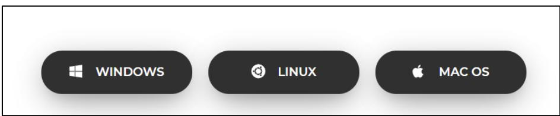  
图47.1.1 SquareLine Studio 设计器安装包

上图中，我们选择windows版本安装包即可，关于该设计器的介绍文档可在这个路径下查看：https://docs(squareline.io/docs/introduction/typical_dev，该介绍文档都是纯英文的，如果大家对英文不太熟悉，可看本章节的内容，笔者尽量讲解全面一些。

根据图47.1.1所示，我们点击“WINDOWS”下载SquareLine Studio设计器，下载完成之后我们就会得到SquareLineStudio_Windows_v1_0_5.zip压缩包。在这个压缩包里面有一个SquareLineStudio_Setup.exe文件，双击运行该文件如下图所示：

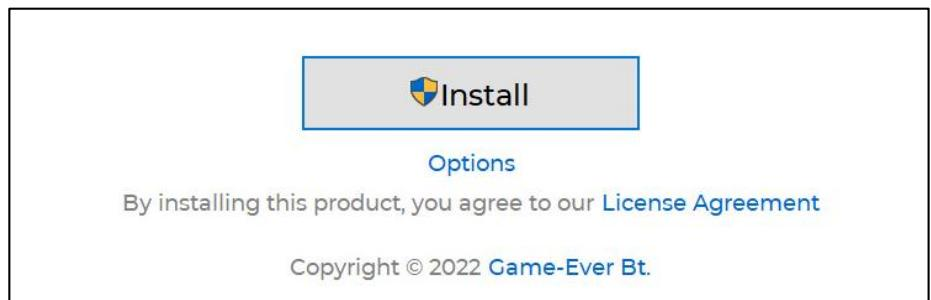  
图47.1.2 SquareLineStudio安装界面

点击上图中的Options选项选择安装路径，这里我们默认选择C盘的路径，然后点击“install”安装该软件，直到弹出完成界面并点击“finish”选项即可。

# 2. SquareLine Studio 设计器创建工程

SquareLine Studio 设计器创建工程，这里笔者分为几个步骤来讲解：

第一步：在桌面上双击SquareLine Studio打开设计器，进入后的界面如下图所示：

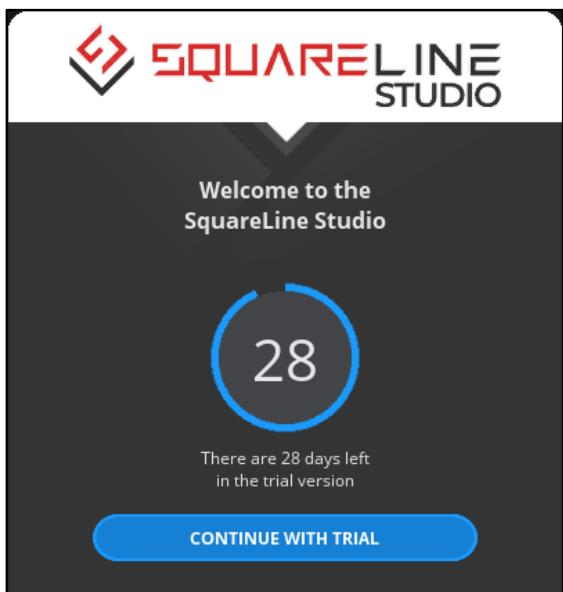  
图47.1.3 SquareLine Studio 登录界面

从上图可知：SquareLine Studio 设计器是一个付费软件，大家可以在它的官方购买使用时间，购买地址为：https://squareline.io/pricing/licenses，这里只有三个购买项，如下图所示：

  
图47.1.4 SquareLine Studio 设计器购买方式

从图 47.1.3 中，我们选择“CONTINUE WITH TRIAL”选项，这个选项表示不够买并试用该软件，试用期为30天。

第二步：点击“CONTINUE WITH TRIAL”选项进入构建工程界面，如下图所示：

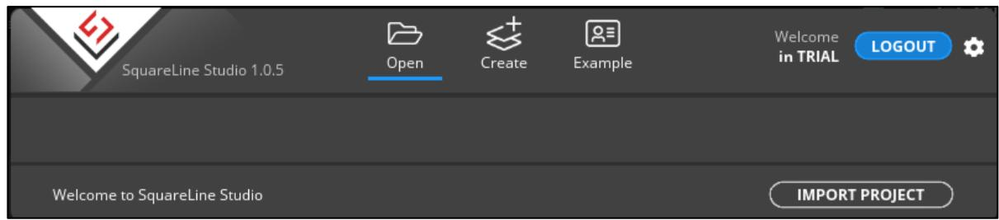  
图47.1.5构建工程界面

上图中，“Open”以及“IMPORT PROJECT”选项都是可以导入以创建的工程，“Create”选项为创建 SquareLine Studio 设计器工程，“Example”选项是官方提供的工程 demo，这些demo非常漂亮，大家可以打开它们并运行，如下图所示：

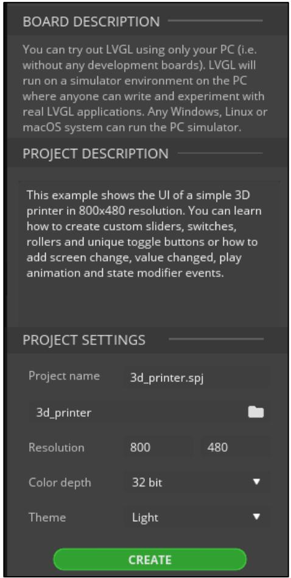  
图47.1.6官方提供的工程demo

大家可以选择自己喜欢的demo，然后点击右下方的“CREATE”选项创建工程。

第三步：点击上图47.1.5的“Create”选项构建自己的工程，如下图所示：

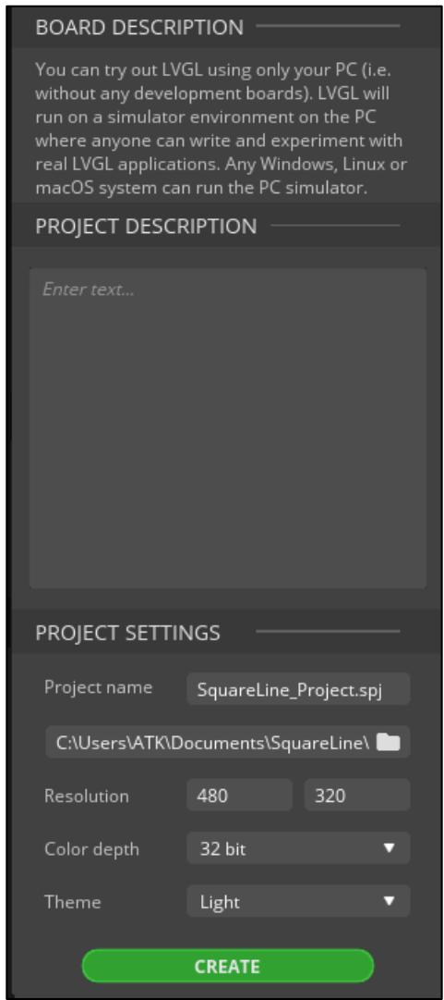  
图47.1.7 创建工程界面

我们可以在上图右下角的“PROJECT SETTINGS”框架填写工程相关的参数，首先“Project name”为工程的名称，它下方的区域是设置工程保存的路径，“Resolution”选项是设置UI界面的宽度和高度，“Color depth”为UI的颜色深度，这里我们选择16bit，因为我们正点原子提供的LCD都是16位颜色深度，“Theme”选项是UI的主题，最后点击“CREATE”选项创建工程。

# 3. SquareLine Studio 框架介绍

SquareLine Studio 框架一共分为两个大板块，这些板块分别为：表头菜单、面板菜单，下面我们分别介绍它们内部的架构组成。

# (1) 表头菜单：

表头菜单分为三个子菜单，这些子菜单分别为File Menu、Export Menu、Help Menu三个子菜单，下面分别介绍这些子菜单包含的内容，如图45.1.8所示：

# - File Menu

New: 创建工程。

Open: 打开工程。

Save: 保存工程。

Save As: 另存为。

Preferences: 查看软件信息。

Project settings: 当前项目的设置。

Exit: 退出软件。

# Export Menu

Export File: 导出文本。

Export Project: 导出工程。

# Help Menu

SquareLine Studio docs：软件的文档网页。

LVGL Website: LVGL 官网。

YouTube channel: 未实现选项。

EULA：用户许可协议(EULA)网页。

# (2) 面板菜单

面板菜单是由6个板块组成，它们分别为层次和动画体系板块、小部件板块、可编辑视图板块、资源和控制台板块、事件板块、样式属性及历史和字库管理板块。

下面我们分别地讲解这些板块的作用，如下所示：

# 层次和动画体系板块

这个板块主要分为两个部分，一个是层次体系和动画体系，层次体系主要选择并放置添加到屏幕上的元素(小部件)，而动画体系就是添加动画效果的部分，这个板块位于SquareLine Studio 软件的左上角，如下图所示：

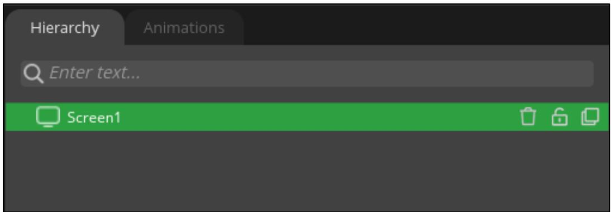  
图47.1.8层次和动画体系板块

# 小部件板块

这个板块主要在屏幕上放置小部件，这些小部件前面的章节中有讲解到，这里我们就无需讲解了，这个板块位于SquareLine Studio软件的左下角区域，如下图所示：

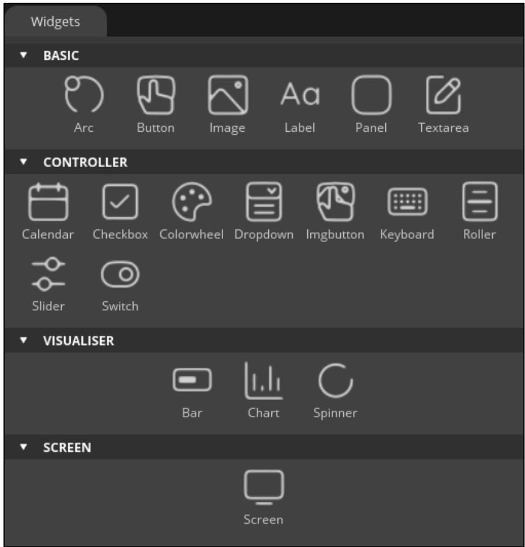  
图47.1.9小部件板块

从上图可知，SquareLine Studio 软件只有支持大部分的小部件。

# 可编辑视图板块

可编辑视图类似于 LCD 屏幕。可通过滚动滚轮方式放大或缩小可编辑视图。我们一般点击小部件板块的小部件就可以加载到可编辑视图当中，用户可以使用鼠标移动小部件的位置属性，该板块位于 SquareLine Studio 软件顶部中间位置，如下图所示：

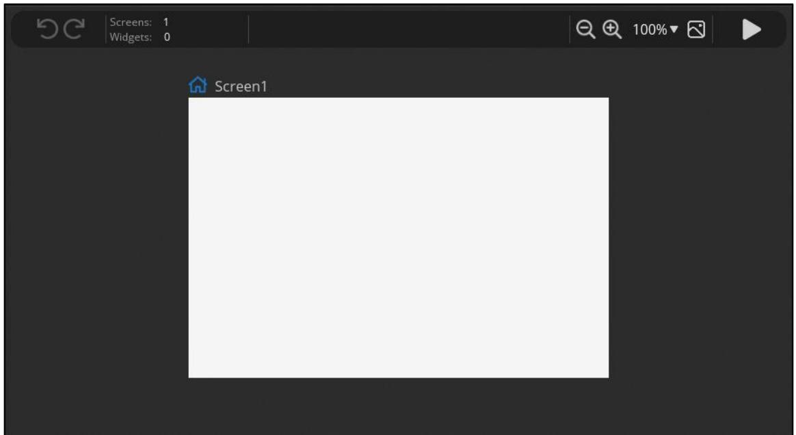  
图47.1.10可编辑视图板块

注意：上图的右上角的图标为模拟启动按键。

# 资源和控制台板块

资源和控制台板块是由资源管理和控制台管理部分组成，资源管理主要添加 UI 所需的图片等资源，而控制台管理部分主要与 LVGL python 有关，这里我们就不需要讲解控制台管理部分，该板块位于 SquareLine Studio 软件底部中间位置，如下图所示：

# ADD FILE INTO ASSETS

从上图可知，在资源管理界面下可点击右下角的“ADD FILE INIO ASSETS”选项，当按下这个选项时，可添加相应的图片文件到资源管理。

# 事件板块

事件板块是针对所有小部件的板块，如果一个小部件触发事件时，可在事件回调函数执行相应的动作，比如一个 BUTTON 按键部件按下时切换屏幕背景颜色。该板块位于 SquareLine Studio 软件右下角区域中，如下图所示：

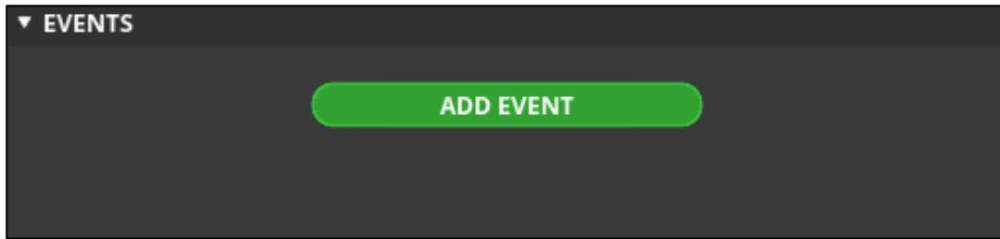  
图47.1.12事件板块

当用户在可编辑视图中点击一个小部件，然后点击上图中的“ADD EVENT”添加该部件的事件，如下图所示：

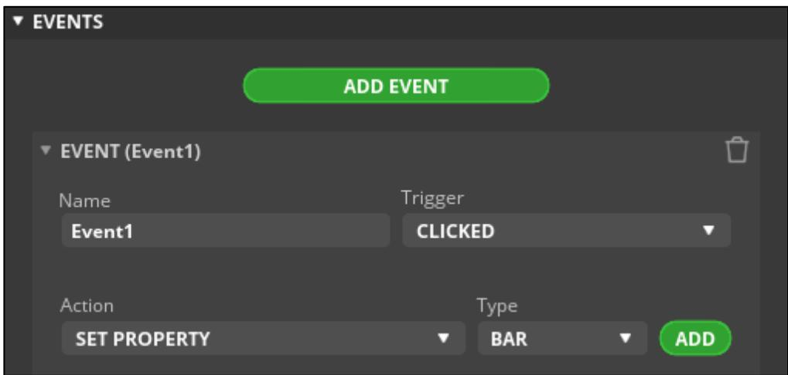  
图47.1.11资源和控制台板块  
图47.1.13添加一个事件

下面我们来讲解一下上图的包含的内容，“Name”标签下的文本框是设置事件的名称，也就是说：生成代码时的事件函数名称；“Trigger”标签下的文本框是设置事件的类型，例如点击、释放、长按或者短按等事件类型；“Action”标签下的文本框是设置活动类型，比如改变屏幕、添加圆弧、设置透明度等类型，我们一般设置“SET PROPERTY”表示包含所有类型；“Type”标签下的文本框是设置触发部件，比如操作圆弧、下拉列表等部件。

如果我们选择了“Action”和“Type”文本框的内容且按下“ADD”选项，则弹出一个界面让用户添加相应的参数，如下图所示：

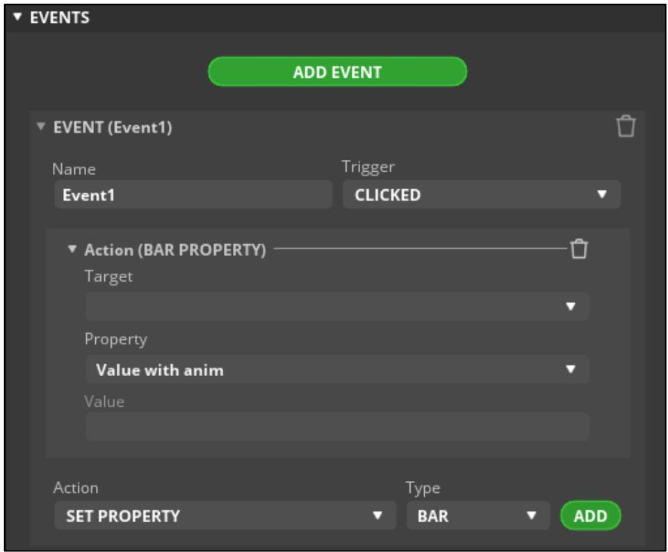  
图47.1.14添加一个活动

“Target”标签下的文本框表示需要动作的进度条部件，“Property”标签下的文本框表示修改该部件的数值是否使用动画形式，这里只有两个选项，一个是没有动画形式，另一个是动画形式，“Value”标签下的文本框表示数值添加的步长大小。

# 样式属性及历史和字库管理板块

样式属性及历史和字库管理板块是由样式属性、历史以及字库管理组成。样式属性：主要设置小部件的样式属性，每一个部件所需要设置的样式都不一样，大家可以参考官方网址：https://docs-squareline.io/docs/dev_env/graphics 定义相关样式属性；历史记录：主要表示添加操作历史记录，这个历史记录可以返回到过去的操作，这个功能类似于 PS 的历史记录；字库管理主要创建自定义的字库提供给 UI 界面使用。这个板块位于 SquareLine Studio 软件右上角区域中，如下图所示：

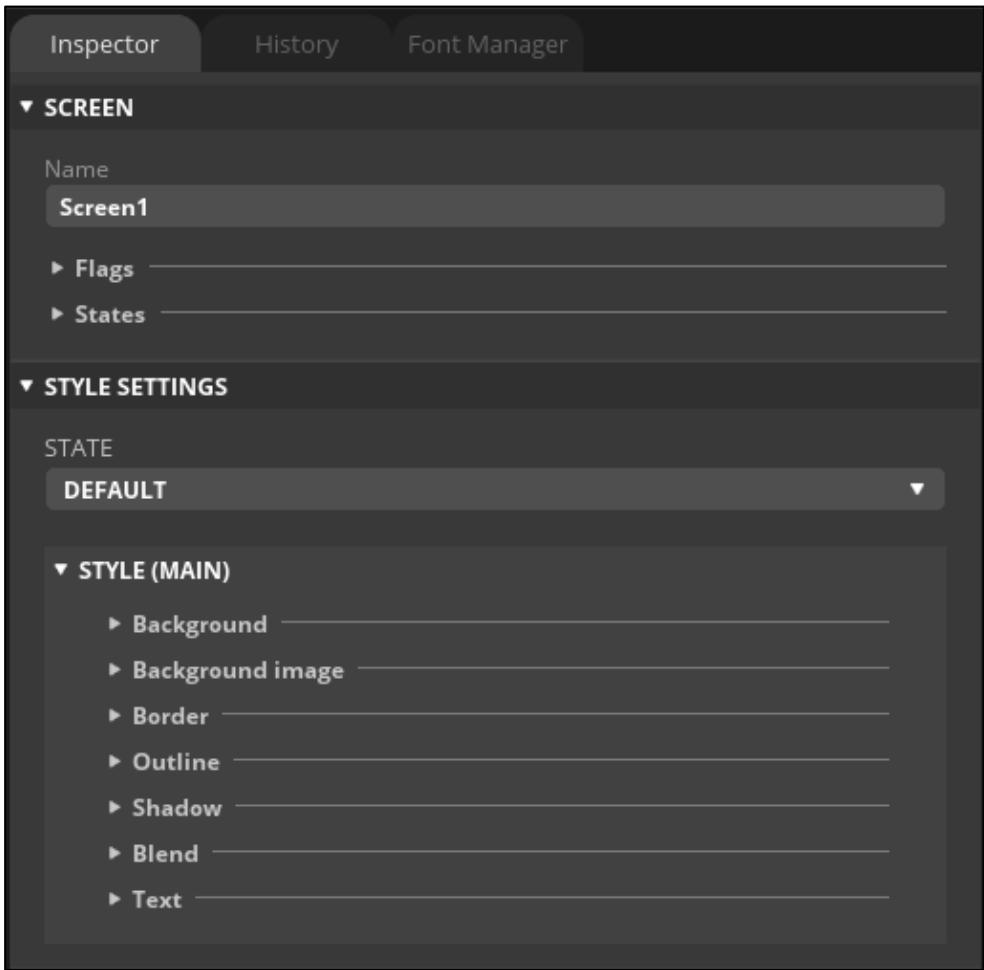  
图47.1.15样式属性及历史和字库管理板块

上图中，“STYLE SETTINGS”下的内容请参考官方的网址，因为每一个部件设置的样式属性都不一样，该网址为：https://docs(squareline.io/docs/dev_env/wildcards；上图的SCREEN下的内容是所有部件都是一样的，“Name”文本框表示部件的名称；“Flags”表示要添加还是清除标志；“States”表示对部件添加哪些状态。

# 47.2 SquareLine Studio 实验

前面的章节我们已经很讲解 SquareLine Studio 软件各个板块的作用以及相关知识，下面我们就以一个简单的实例来使用 SquareLine Studio 软件，这个实例的实现功能是创建两个屏幕，然后这两个屏幕都创建一个 button 按键部件，其中它们自己的按键可切换到另一个屏幕当中。

下面我们就分为价格步骤来实现这个功能，这些步骤如下所示：

第一步：在Screen1屏幕下添加Button按键，该部件添加方法直接在小部件板块点击Button部件即可，如下图所示：

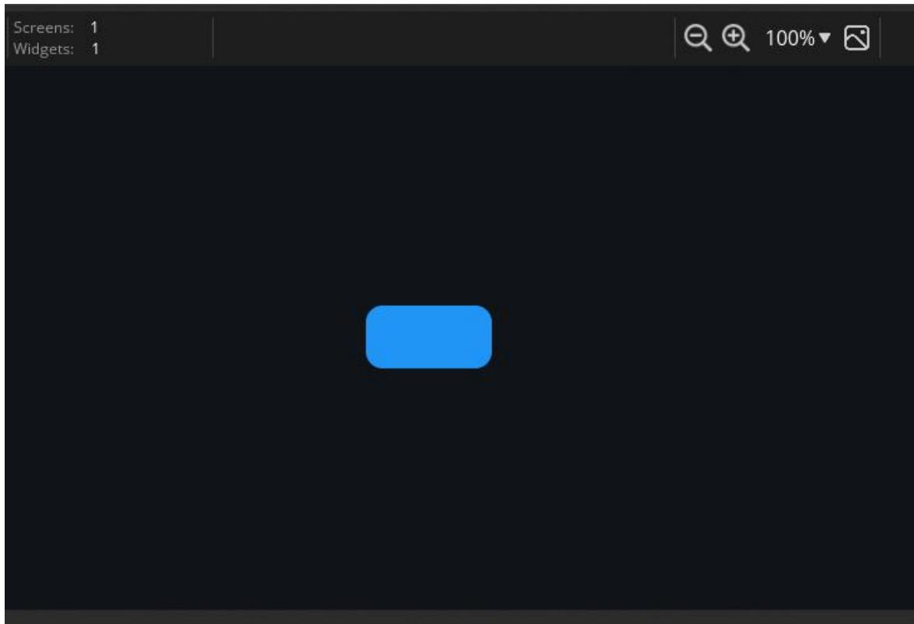  
图47.2.1在Screen1添加一个Button部件

第二步：点击小部件板块添加另一个屏幕Screen2，如下图所示：

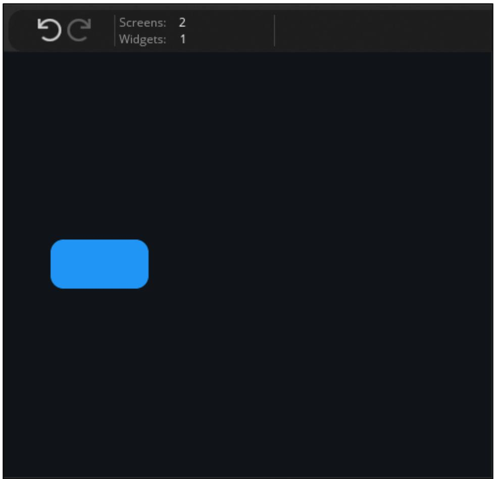

为了区别，我们把Screen2屏幕设置背景颜色为红色，如下图所示：

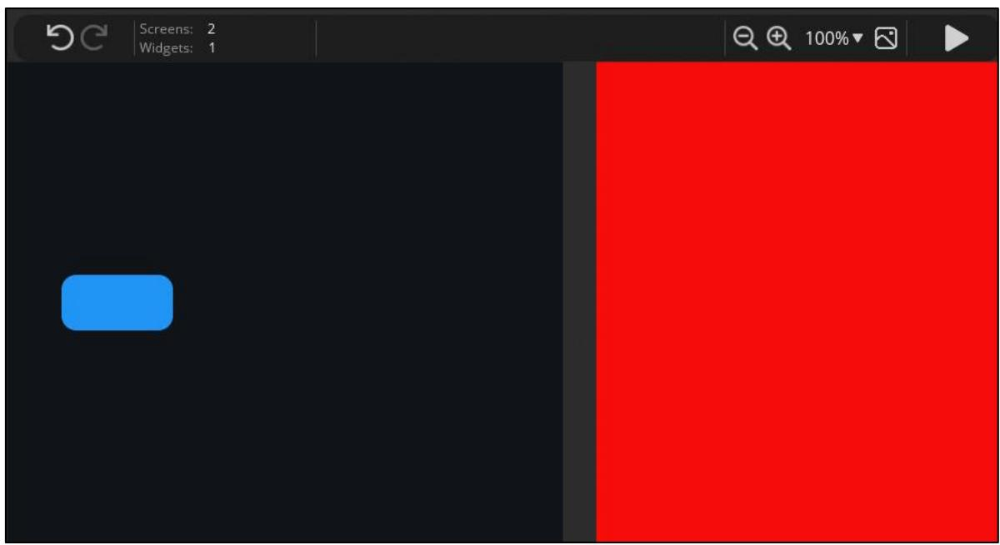  
图47.2.3设置Screen2屏幕背景为红色  
图47.2.2添加Screen2屏幕

Screen2 屏幕背景为红色的设置方法这里我们就无需讲解了，直接操作样式属性管理板块即可。

第三步：在Screen2屏幕添加Button按键部件，如下图所示：

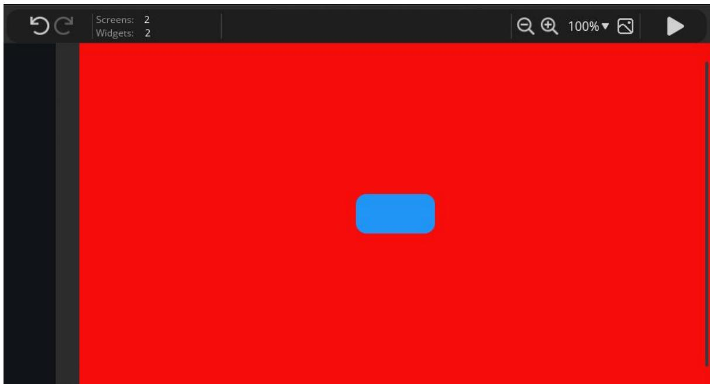  
图47.2.4在Screen2屏幕上添加Button按键

第四步：添加Screen1的Button按键的事件，该事件类型(Trigger)为CLICKED，活动(Action)为CHANGE SCREEN，如下图所示：

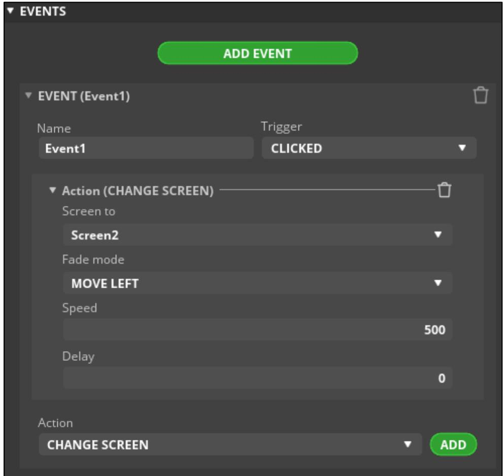  
图47.2.5添加事件

从上图可知：“Screen to”标签下的文本框表示要切换的目标屏幕，这里我们选择Screen2，“Fade mode”标签下的文本框表示切换的方式，这里我们选择往左移动，“Speed”标签下的文本框表示切换的速度，“Delay”标签下的文本框表示切换的时间。

第五步：添加Screen2的Button按键的事件，添加方法与第四步一样，注意先点击Buttonb部件才点击添加事件，我们在图47.2.5中的“Screen to”标签下的文本框选择Screen1即可。

第六步：点击可编辑视图右上角的启动图标，如下图所示：

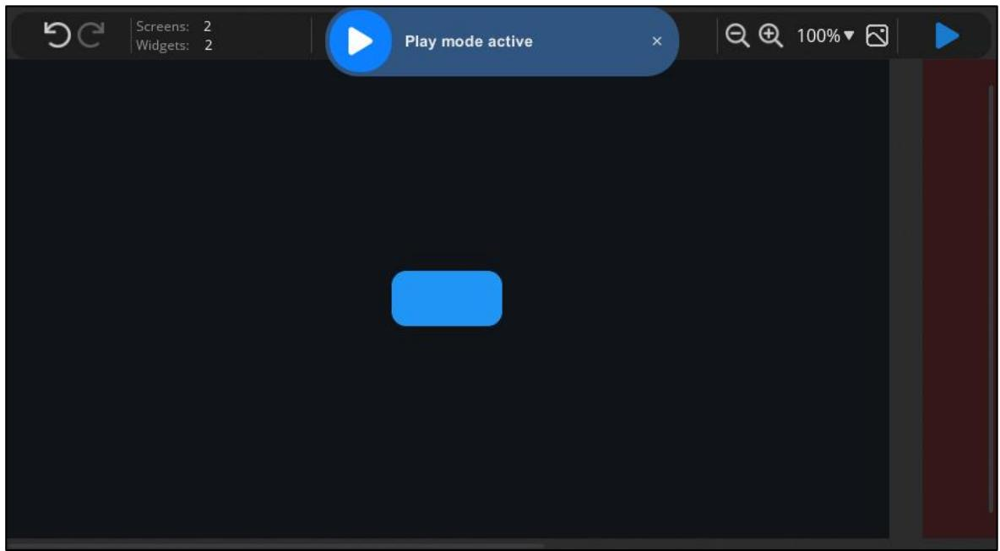  
图47.2.6启动模拟

当我们点击Screen1中的Button按键时，系统自动往左切换到Screen2屏幕中，当我们点击我们点击Screen2中的Button按键时，系统自动往左切换到Screen1屏幕中。

# 47.3 SquareLine Studio 移植到工程

前面我们已经讲解了 SquareLine Studio 软件可以导出 C 代码，这些 C 代码可以移植到我们工程当中，下面我们分几个步骤来讲解：

第一步：点击表头菜单下的Export菜单，找到“Export file”选项并点击生成代码。

第二步：打开工程保存的路径，我们会发现四个文件，这些文件就是移植到工程中的文件，如下图所示：

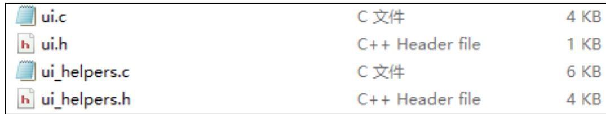  
图47.3.1导出的代码

第三步：把这些文件复制并拷贝到目标工程/Middlewares/LVGL/GUI_APP路径下。

第四步，打开工程并添加到工程当中，如下图所示：

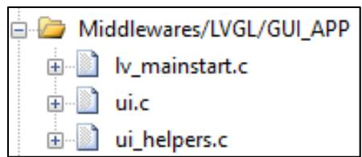  
图47.3.2添加UI源码

第五步：在uihelpers.h以及ui.h文件把#if __hasinclude("lvl.h")去除，如下所示：

```txt
if __hasinclude("lgl.h") #include"lvgl.h"
```

```txt
else #include"lvgl/lvgl.h" #endif
```

我们把上述源码的条件编译语句去除，修改为如下源码：

```txt
include "lvgl.h"
```

第六步：在lv_mainstart函数下调用ui_init函数初始化UI界面即可。

经过上面的六步，我们就可以完成SquareLine Studio设置的UI并导出代码移植到工程当中，大家也可以尝试一下SquareLine Studio软件，不得不说这个软件能提高我们的开发效率。

# 布局篇

经过前面的学习，笔者相信读者已经对LVGL的基础知识以及部件的使用有一定的了解，下面笔者开始介绍布局篇的内容，本来这些内容会在LVGL基础知识章节中讲解的，由于布局篇的内容会涉及到部件的使用，所以笔者把这一篇的内容放在最后讲解。

# 第四十八章 Flex 布局

Flexible Box 模型，通常被称为 flexbox，是一种一维的布局模型。它给 flexbox 的子元素之间提供了强大的空间分布和对齐能力。

本章节将分为以下几个小节：

48.1 Flex初探  
48.2 Flex相关知识  
48.3 Flex布局的实验

# 48.1 Flex初探

Flex布局，是一种可以简便、完整、响应式地实现各种页面布局，它是CSS的一个重点应用。LVGL从V8版本开始已经支持CSS的Flex和Grid布局，前面笔者也说过：flexbox是一种一维的布局，是因为一个flexbox一次只能处理一个维度上的元素布局，一行或者一列，但是Grid布局是一种二维布局，它可以同时处理行和列上的布局，本章主要讲解Flex布局知识，而Grid布局知识笔者会在下一个章节讲解。

简单来说：它可以将对象排列成行或列，并处理环绕，调整对象和行/列之间的间距，处理增长以使对象填充剩余空间的最小/最大宽度和高度。

# 48.2 Flex相关知识

# 48.2.1启用Flex布局

在lv_conf.h文件中把LV_USE_FLEX配置项置1即可启用Flex布局。

# 48.2.2 Flex条文

(1) 轨道：行或列。  
(2) 主轴：行或列，对象放置的方向。  
③ 交叉轴：垂直于主轴。  
(4) 换行/换列：如果轨道中没有更多空间，则开始新轨道  
(5) 增长: 如果设置在一个项目上, 它将增长以填充轨道上的剩余空间。  
⑥ 间隙：行和列或轨道上的对象之间的空间。

当使用 flex 布局时，首先想到的是两根轴线，它们分别为主轴和交叉轴。主轴是 flex 方向，另一根轴垂直于它。我们使用 flexbox 的所有属性都跟这两根轴线有关，所以有必要在一开始首先理解它。下面笔者带读者来讲解一下主轴和交叉轴的区别：

1. 主轴：是定义对象的放置方向的，在LVGL中，它一般可取八个值，如下表所示：

<table><tr><td>主轴的定义</td><td>描述</td></tr><tr><td>LV_FLEX_FLOW_ROW</td><td>将子类们排成一行并不换行</td></tr><tr><td>LV_FLEX_FLOW_ROW.WRAP</td><td>将子类们排成一行并换行</td></tr><tr><td>LV_FLEX_FLOW_ROW_reverse</td><td>将子类们排成一行并不换行且顺序相反</td></tr><tr><td>LV_FLEX_FLOW_ROW.WRAP_reverse</td><td>将子类们排成一行并换行且顺序相反</td></tr><tr><td>LV_FLEX_FLOW_COLUMN</td><td>将子类们排成一列并不换行</td></tr><tr><td>LV_FLEX_FLOW_COLUMN.WRAP</td><td>将子类们排成一列并换行</td></tr></table>

表 48.2.2.1 Flex 布局主轴配置项  

<table><tr><td>LV_FLEX_FLOW_COLUMN_reverse</td><td>将子类们排成一列并不换行且顺序相反</td></tr><tr><td>LV_FLEX_FLOW_COLUMN.WRAP_reverse</td><td>将子类们排成一列并换行且顺序相反</td></tr></table>

从上表可知：如果我们设置 LV_FLEX_FLOW_ROW~ LV_FLEX_FLOW_ROW_WRAP_REVERSE 为主轴配置项时，容器的主轴将沿着 inline 方向延伸，如下图所示：

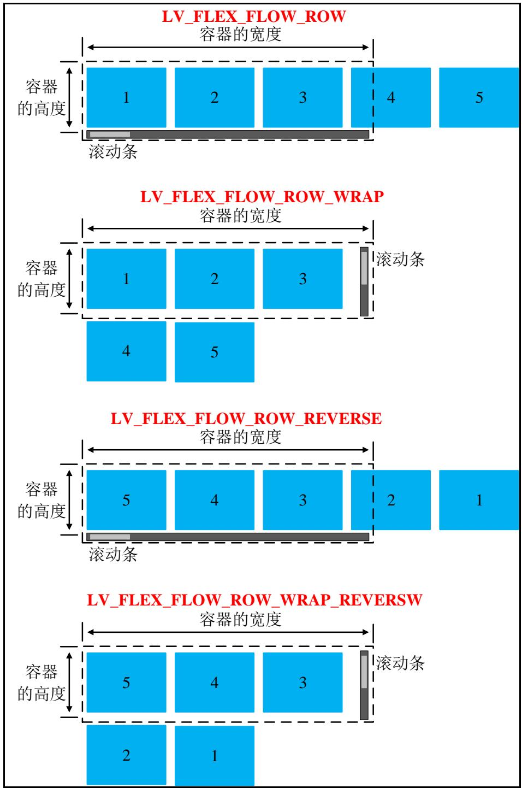  
图48.2.2.1主轴(行)设置示意图

从上图可知：容器就是绘画在显示屏上的部件，如果有些子类超出了容器范围，则系统自动使能滚动条。值得注意的是：带有WRAP的配置项会把超出容器的子类以换行的形式添加在第二行中，例如上图中的第二和第四的示意图；带有REVEESW的配置项会把所有子类以翻转的顺序排列，例如上图中的第三和第四的示意图。

从上表可知：如果我们设置LV_FLEX_FLOW_COLUMN  $\sim$  LV_FLEX_FLOW_COLUMN_WRAP_reverse为主轴配置项时，容器的主轴会沿着上下方向延伸--也就是block排列的方向，如下图所示：

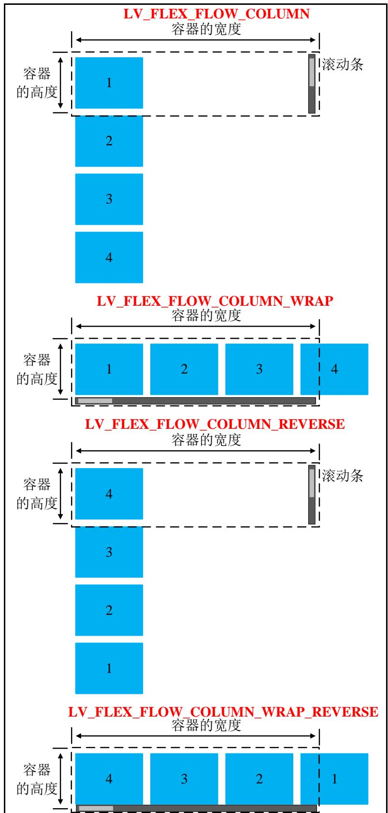  
图48.2.2.2 主轴(列)设置示意图

从上图可知：容器就是绘画在显示屏上的部件，如果有些子类超出了容器范围，则系统自动使能滚动条。值得注意的是：带有WRAP的配置项会把超出容器的子类以换列的形式添加在第二列中，例如上图中的第二和第四的示意图；带有REVEESW的配置项会把所有子类以翻转的顺序排列，例如上图中的第三和第四的示意图。

2. 交叉轴：交叉轴垂直于主轴，所以如果你的flex-direction(主轴)设成了ROW的话，交叉轴的方向就是沿着列向下的，如下图所示：

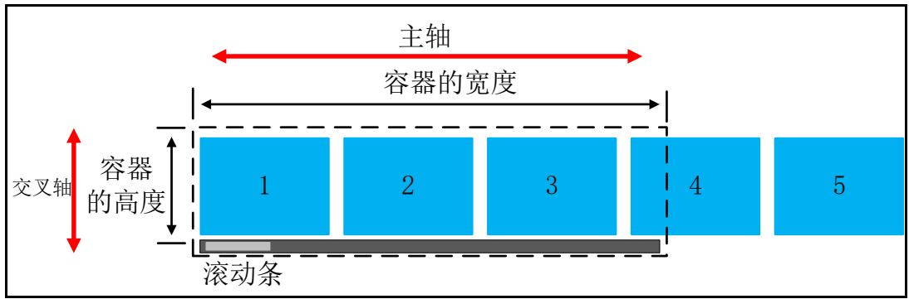  
图48.2.2.3列的交叉主轴

如果你的flex-direction(主轴)设成了COLUMN的话，交叉轴就是水平方向，如下图所示：

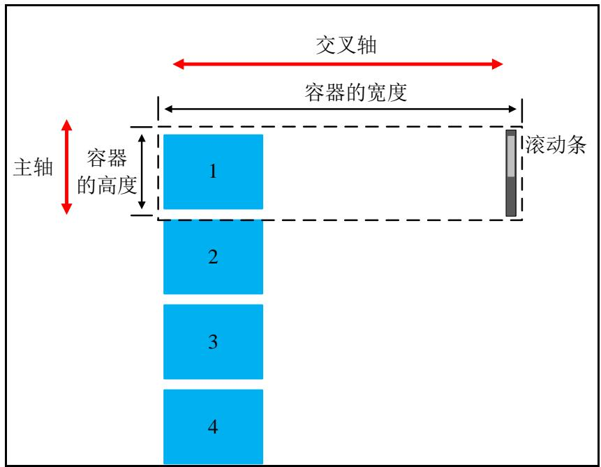  
图48.2.2.4行的交叉主轴

至此，笔者已经讲解了Flex多个条文的作用，例如上面的主轴和交叉主轴以及换行/换列等知识，剩下的条文我们会在下面的小节来讲解。

# 48.2.3 对象如何使用 Flex 布局

在LVGL中，使用Flex布局有两种方式，第一种是使用lv_obj_set.layout函数方法设置对象启用Flex布局，第二种是使用lv_obj_set_flex_flow函数启用Flex布局。下面笔者以一个简单实例来讲解本小节的内容，如下所示：

```javascript
void lv_mainstart(void) {
```

```c
/* 第一种方式 */
static lv_style_t style;
lv_style_init(&style);
lv_style_set_flex_flow(&style, LV_FLEX_FLOW_ROW.WRAP);
/* 设置Flex布局*/
lv_style_set.layout(&style, LV_LAYOUT[FLEX];
lv_obj_t* cont = lv_obj_create(lv_scr_act());
lv_obj_set_size(cont, 300, 220);
lv_obj_add_style(cont, &style, 0);
/* 第二种方式 */
lv_obj_t* cont_row = lv_obj_create(lv_scr_act());
lv_obj_set_size(cont_row, 300, 220);
lv_obj_align(cont_row, LV_FLEX_FLOW_ROW, 0, 5);
/* 设置Flex布局*/
lv_obj_set_flex_flow(cont_row, LV_FLEX_FLOW_ROW.WRAP);
lv_obj_align_to(cont_row, cont, LVALIGN_OUT_RIGHT_TOP, 20, 0);
uint32_t i;
for (i = 0; i < 10; i++) {
    lv_obj_t* obj;
    lv_obj_t* label;
    /* 在cont容器中添加BTN对象*/
    obj = lvbtn_create(cont);
    lv_obj_set_size(obj, 100, LV_PCT(100));
    label = lv_label_create(obj);
    lv_label_set_text fmt.label, "Item:%u", i);
    lv_obj_center[label];
    /* 在cont_row容器中添加BTN对象*/
    obj = lvbtn_create(cont_row);
    lv_obj_set_size(obj, 100, LV_PCT(100));
    label = lv_label_create(obj);
    lv_label_set_text fmt.label, "Item:%u", i);
    lv_obj_center[label];
}
```

上述源码非常简单，它们分别使用不同的方式启用Flex布局，而它们的布局类型都是LV_FLEX_FLOW_ROW_WRAP配置项，这个配置项笔者在前面也讲解过，这里我们无需重复讲解。把代码下载到开发板中或者在PC机模拟可得到以下效果图：

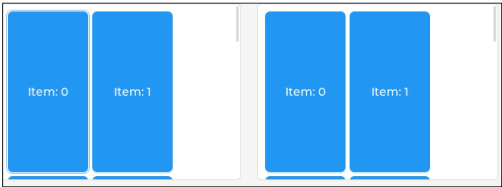  
图48.2.3.1启用Flex的方式

# 48.2.4 Flex对齐

Flexbox 的一个关键特性是能够设置 flex 元素沿主轴方向和交叉轴方向的对齐方式以及它们之间的空间分配。这里不得不提起 LVGL 提供的一个函数，该函数为 lv_obj_set_flex_align(o bj, main_place, cross_place, track.Cross_place)，这个函数具有四个形参，下面笔者来讲解一下这四个形参的作用，如下表所示：

表 48.2.4.1 v_obj_set_flex_align(   )函数的形参描述  

<table><tr><td>形参</td><td>描述</td></tr><tr><td>obj</td><td>指向设置对齐的对象</td></tr><tr><td>main_place</td><td>主轴上的对象对齐</td></tr><tr><td>cross_place</td><td>交叉轴上的对象对齐</td></tr><tr><td>track.Cross_place</td><td>行/列交叉轴上的对象对齐</td></tr></table>

main_place、cross_place 和 track-cross_place 形参的转入值如下表所示：  
表 48.2.4.2 对齐配置项  

<table><tr><td>配置项</td><td>描述</td></tr><tr><td>LV_FLEXALIGN_START</td><td>水平方向左上和垂直上方向上（默认）</td></tr><tr><td>LV_FLEXALIGN_END</td><td>水平方向右侧和垂直底部</td></tr><tr><td>LV_FLEXALIGN_CENTER</td><td>居中</td></tr><tr><td>LV_FLEXALIGN_SPACE_EVENLY</td><td>任何两个对象之间的间距（它们的边缘空间相等），但不适用于 track CROSS_place 形参</td></tr><tr><td>LV_FLEXALIGN_SPACE_AROUND</td><td>对象在轨道上均匀分布，周围空间相等，但不适用于 track CROSS_place 形参</td></tr><tr><td>LV_FLEXALIGN_SPACE_BETWEEN</td><td>对象在轨道上均匀分布：第一个对象在开始行，最后一个项目在结束行，但不适用于 track CROSS_place 形参</td></tr></table>

如果 main_place 形参分别传入这六个形参，那么容器中的子对象如何布局呢？下面笔者使用一个示意图来描述这个功能，如下所示：

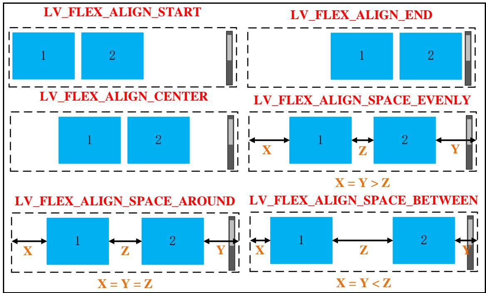  
图48.2.4.1 main_place形参传入的配置项示意图

注意：上图的效果图是以LV_FLEX_FLOW_ROW_WRAP类型来绘画的，其他类型请读者自行研究。

track CROSS_place 形参只能传入 LV_FLEXALIGN_START、LV_FLEXALIGN_END 和 LV_FLEX alignments_CENTER 配置项，它们分别代表显示的位置。为了更好的理解这个知识，笔者花费一点点时间绘画一个示意图来让读者了解这个知识，如下图所示：

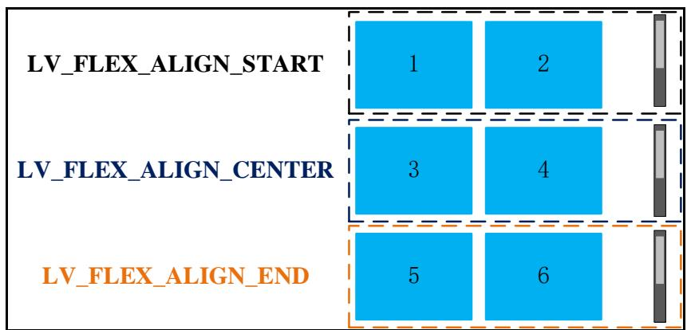  
图48.2.4.2 track CROSS_place形参传入的配置项示意图

从上图可知：如果 track CROSS_place 形参设置为 LV_FLEXALIGN_START，则该容器显示子类 1 和 2；如果 track CROSS_place 形参设置为 LV_FLEXALIGN_END，则该容器显示子类 5 和 6；如果 track CROSS_place 形参设置为 LV_FLEXALIGN_CENTER，则该容器显示子类 3 和 4。

cross_place 形参一般在子类对象具有不同的高度时会起作用。

# 48.2.5 flex-grow 属性

flex-grow 若被赋值为一个正整数，它沿主轴方向增长尺寸。这会使该元素延展，并占据此方向轴上的可用空间（available space）。如果有其他元素也被允许延展，那么它们会各自占

据可用空间的一部分。关于这个 grow 属性，LVGL 提供了 lv_obj_set_flexGrow 函数来设置，该函数具有两个形参，第一个形参指向要增长的对象，而第二个形参表示增长的倍数，例如有 400 像素剩余空间和 3 个对象增长，它们设置分别为 1、1 和 2，所以它们的宽度分别为 100，100 和 200 像素，如下图所示：

图48.2.5 grow属性的设置  
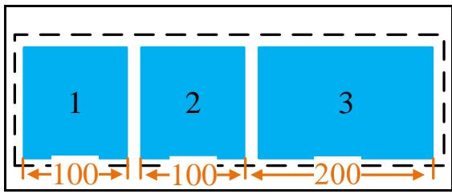  
注意：lv_obj_set_flexgrow函数的第二个形参为0时禁用grow属性。  
这些函数一般用在样式启动Flex布局程序当中。注意：可以使用本地样式属性函数设置。

# 48.2.6 Flex条文的样式函数

在样式中，所有与Flex相关的值都是底层的样式属性，这些与Flex相关的样式属性函数如下表所示：

表 48.2.6.1 与 Flex 相关样式属性函数  

<table><tr><td>函数</td><td>描述</td></tr><tr><td>lv_style_set_flex_flow()</td><td>设置Flex 流动布局</td></tr><tr><td>lv_style_set_flex_main_place()</td><td>设置主轴</td></tr><tr><td>lv_style_set_flexcross_place()</td><td>设置交叉轴</td></tr><tr><td>lv_style_set_flex_track_place()</td><td>设置轨道轴</td></tr><tr><td>lv_style_set_flexgrow()</td><td>设置增长</td></tr></table>

# 48.2.7 Flex间隙

Flex-gap属性用来设置元素列之间的间隔（gutter）大小，例如修改对象之间的最小空间，可以在flex容器样式上设置以下属性：

① pad_row：设置行之间的填充。  
② pad_column: 设置列之间的填充。

如果读者不希望对象之间有任何填充，可调用lv_style_set_pad_column(&row/container_style,0)函数设置。

# 48.3 Flex布局的实验

关于Flex布局的实验，大家可以参考LVGL官方提供的实验，该实验的路径为lvgl-release-v8.2\examples\Layouts\Flex文件夹下，该文件夹具有六个实例提供给读者学习。

# 第四十九章 Grid 布局

网格布局引入了二维网格布局系统，可用于布局页面主要的区域布局或小型组件。本章主要介绍LVGL网格布局的使用。

本章节将分为以下几个小节：

49.1 Grid初探  
49.2 Grid相关知识  
49.3 Grid布局的实验

# 49.1 Grid初探

Grid网格是一组相交的水平线和垂直线，它定义了网格的列和行。我们可以将网格元素放置在与这些行和列相关的位置上。简单来说：Grid网格可以将对象排列到具有行或列（轨道）的二维“表”中，该对象可以跨越多个列或行。轨道的大小可以设置为像素、LVGRID_CONTENT或“空闲单元”(FR)以按比例分配空闲空间。

# 49.2 Grid相关知识

# 49.2.1启用Grid布局

在lv_conf.h文件中把LV_USEGRID配置项置1即可启用Flex布局。

# 49.2.2 Grid条文

① 轨道(tracks)：行或列。  
② 空闲单元(FR)：如果在轨道上设置了大小，FR它将增长以填充父级的剩余空间。  
③ 间隙(gap)：行和列或轨道上的项目之间的空间。

# 49.2.3 对象如何使用 Grid 布局

在LVGL中，需要读者使用lv_obj_set.layout函数设置对象启用Grid布局。

# 49.2.3 Grid描述符

Grid 描述符是用来描述行/列的数量以及单元格的像素，它一般使用两个数组来描述网格的行数和列数，例如声明 2 个数组，它们分别描述行和列的个数以及大小，注意：这些数组的最后一个元素必须是 LV_grid_template LAST 配置项，如下源码所示：

```c
/* 2列100和400ps宽度*/  
static lv_coord_t column_dsc[] = {100, 400, LV_grid_template LAST};  
/* 3个100像素高的行*/  
static lv_coord_t row_dsc[] = {100, 100, 100, LV_grid_template LAST};
```

从上述源码可知：column_dsc 和 row_dsc 数组创建了 3 行 2 列的网格，网格内的单元格大小由这些数组内的数值决定。下面笔者使用一个示意图来讲解上述的内容，如下所示：

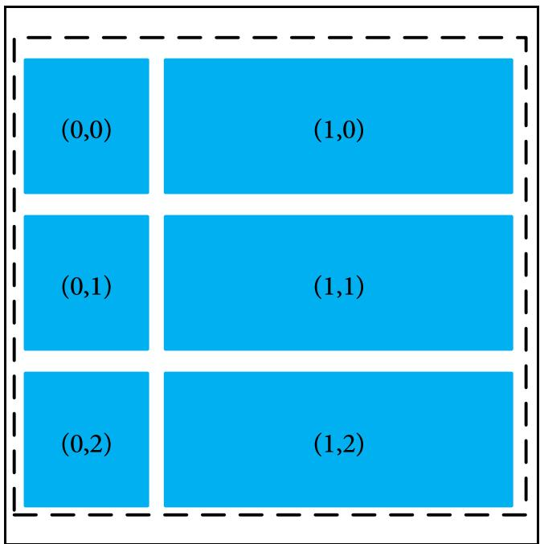  
图49.2.3 创建3行2列的Grid网格

上述的数组是调用了lv_obj_set_style_grid_column_dsc_array和lv_obj_set_style_grid_row_dsc_array函数创建网格的。

当然除了以像素为单位的简单设置之外，我们还可以使用两个特殊值：

① LVGRID_CONTENT：将宽度设置为此轨道上最大的子类。  
② LVGRID_FR(X): 告诉该轨道应使用剩余空间的哪一部分，数值越大，空间越大。

# 49.2.4 添加 Grid 对象

默认情况下，我们的子项不会自动添加到网格中。这些子类需要读者手动添加到单元格中，这个添加方式需要读者调用lv_obj_set_grid_cell把子类对象添加到指定网格位置，下面笔者分别讲解一下这个函数的形参到底如何传入数值，如下表所示：

表 49.2.4.1 lv_obj_set_grid_cell(   )函数形参描述  

<table><tr><td>形参</td><td colspan="2">描述</td></tr><tr><td>child</td><td colspan="2">添加的对象</td></tr><tr><td>column_pos</td><td colspan="2">列索引</td></tr><tr><td rowspan="5">column_align row_align</td><td colspan="2">列对齐/行对齐</td></tr><tr><td colspan="2">对齐的配置项</td></tr><tr><td>LVGRIDALIGN_START</td><td>水平方向左上和垂直上方向上（默认）</td></tr><tr><td>LVGRIDALIGN_END</td><td>水平方向右侧和垂直底部</td></tr><tr><td>LVGRIDALIGN_CENTER</td><td>居中</td></tr><tr><td>row_pos</td><td colspan="2">行索引</td></tr><tr><td>columnspan</td><td rowspan="2" colspan="2">起始单元格开始涉及多少个轨道(默认设置为1)</td></tr><tr><td>rowSpan</td></tr></table>

下面笔者使用一个简单的实例来讲解本小节的内容，如下所示：

```c
void lv_mainstart(void) {
    static lv_coord_t col_dsc[] = {70, 70, 70, LV_grid_template LAST};
    static lv_coord_t row_dsc[] = {50, 50, 50, LV_grid_template LAST};
}
```

```c
lv_obj_t* cont = lv_obj_create(lv_scr_act());  
/* 设置网格的列数量 */  
lv_obj_set_style_grid_column_dsc_array(cont, col_dsc, 0);  
/* 设置网格的行数量 */  
lv_obj_set_style_grid_row_dsc_array(cont, row_dsc, 0);  
/* 设置容器大小 */  
lv_obj_set_size(cont, 300, 220);  
lv_obj_center(cont);  
/* 开启GRID网格 */  
lv_obj_set.layout(cont, LV_LAYOUT GRID);  
lv_obj_t* obj;  
/* 创建一个BTN子类*/  
obj = lv_btn_create(cont);  
/* 把BTN对象添加到网格(0,0)位置 */  
lv_obj_set_grid_cell(obj, LV_GRIDALIGN_STRETCH, 0, 1, LV.GridALIGN_STRETCH, 0, 1);  
/* 创建一个switch子类*/  
obj = lv_SWITCH_create(cont);  
/* 把BTN对象添加到网格(0,1)位置 */  
lv_obj_set_grid_cell(obj, LV.GridALIGN_STRETCH, 0, 1, LV.GridALIGN_STRETCH, 1, 1);}
```

从上述源码可知：笔者创建了一个名为 cont 容器，在该容器内根据 col_dsc 和 row_dsc 数组创建 3 行 3 列的网格，至此我们调用 lv_obj_set.layout 函数开启 GRID，然后我们在网格的 (0,0)位置添加 btn 对象，在网格的(0,1)添加 switch 对象，最后编译代码并把代码下载到开发板中，如图 49.2.4.1 所示：

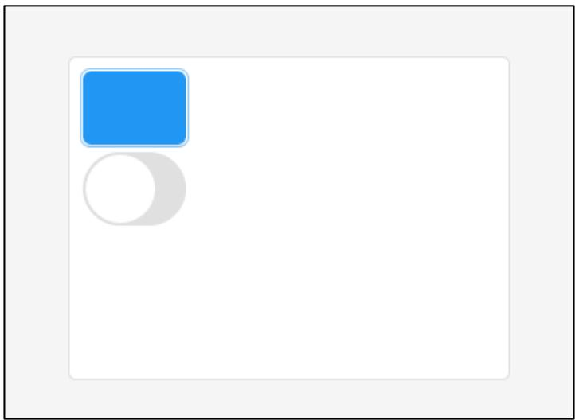  
图49.2.4.1在指定位置添加对象

# 49.2.5 Grid 对齐

Grid对齐与flex容器对齐标准是类似的，请参考第四十八章的48.2.4小节，注意：Grid对齐使用的是lv_obj_set_grid_align函数并不是lv_obj_set_flex_align函数。

# 49.2.6 Grid条文的样式函数

在样式中，所有与Grid相关的值都是底层的样式属性，这些与Grid相关的样式属性函数如下所示：

① GRID_COLUMN_DSC_ARRAY：设置列的描述符数组。  
② GRID_ROW_DSC_ARRAY：设置行的描述符数组。  
③ GRID_COLUMNALIGN：设置列的对象对齐。  
④ GRID_ROWALIGN：设置列的对象对齐。  
⑤ GRID_CELL_XALIGN：设置单元格的X轴方向对齐。  
⑥ GRID_CELL_COLUMN_POS：设置列的单元格位置。  
⑦ GRID_CELL_COLUMN_SPAN: 设置列的单元格宽度。  
⑧ GRID_CELL_YALIGN：设置单元格的Y轴方向对齐。  
⑨ GRID_CELL_ROW_POS：设置行的单元格位置。  
⑩ GRID_CELL_ROW_SPAN：设置行的单元格宽度。

这些函数是使用本地样式来设置Grid布局属性。

# 49.2.7 Grid间隙

Grid-gap 属性用来设置元素列之间的间隔（gutter）大小，例如修改对象之间的最小空间，可以在 Grid 容器样式上设置以下属性：

① pad_row：设置行之间的填充。  
② pad_column：设置列之间的填充。

# 49.3 Grid布局的实验

关于 Grid 布局的实验，大家可以参考 LVGL 官方提供的实验，该实验的路径为 lvgl-release-v8.2\examples\Layouts\grid 文件夹下，该文件夹具有六个实例提供给读者学习。